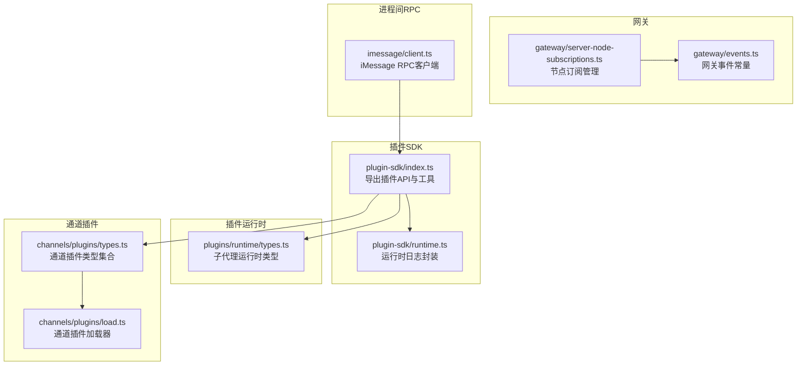
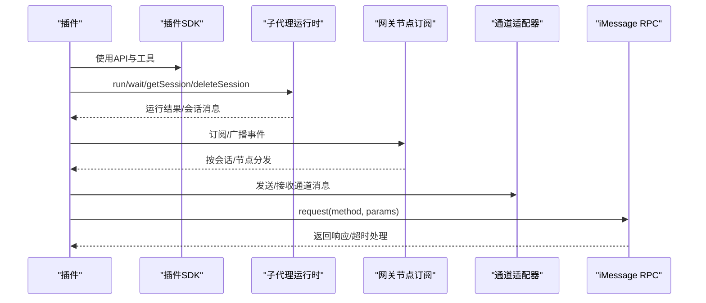
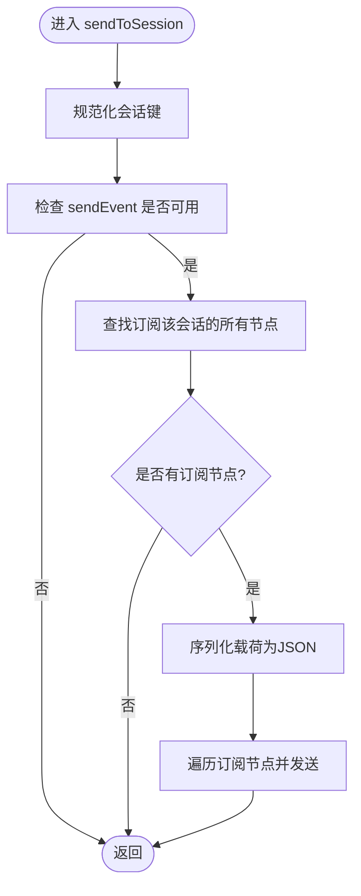
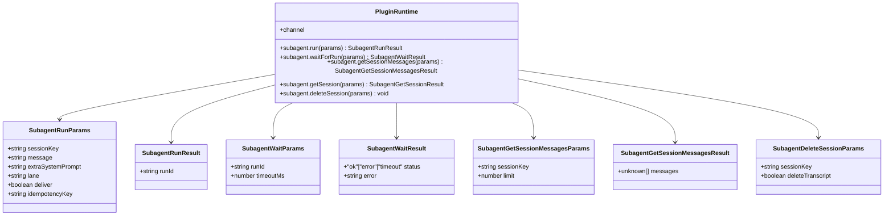
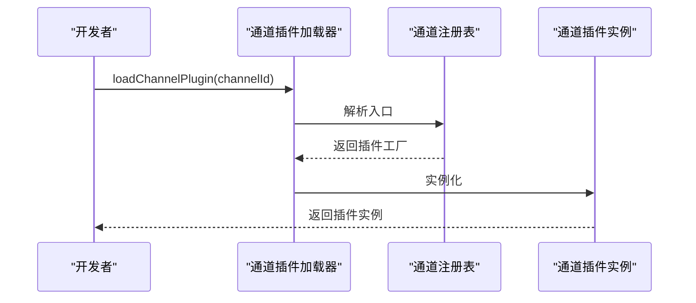
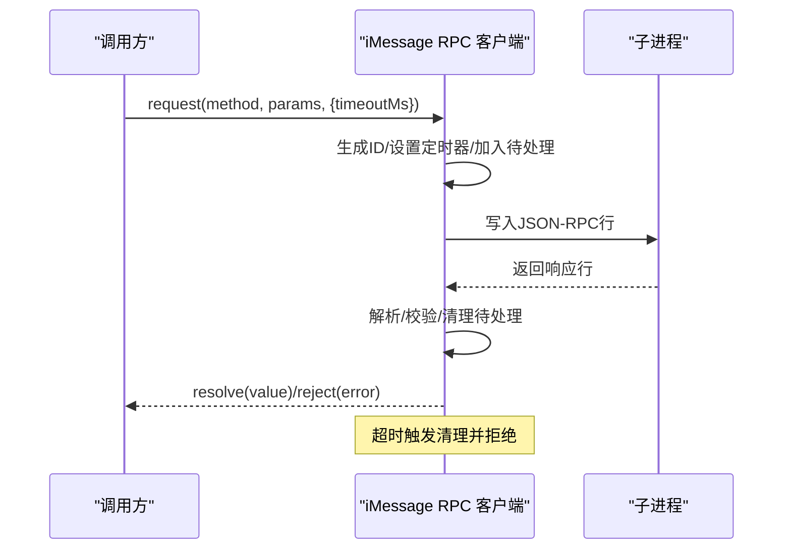
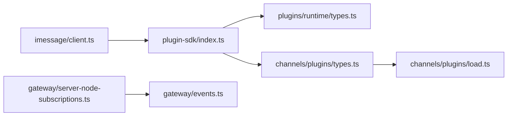

# 插件通信API

<cite>
**本文引用的文件**
- [src/plugin-sdk/index.ts](file://src/plugin-sdk/index.ts)
- [src/plugin-sdk/runtime.ts](file://src/plugin-sdk/runtime.ts)
- [src/plugins/runtime/types.ts](file://src/plugins/runtime/types.ts)
- [src/gateway/server-node-subscriptions.ts](file://src/gateway/server-node-subscriptions.ts)
- [src/gateway/events.ts](file://src/gateway/events.ts)
- [src/channels/plugins/types.ts](file://src/channels/plugins/types.ts)
- [src/channels/plugins/load.ts](file://src/channels/plugins/load.ts)
- [src/imessage/client.ts](file://src/imessage/client.ts)
- [extensions/*/index.ts](file://extensions/voice-call/index.ts)
- [extensions/*/openclaw.plugin.json](file://extensions/voice-call/openclaw.plugin.json)
</cite>

## 目录
1. [简介](#简介)
2. [项目结构](#项目结构)
3. [核心组件](#核心组件)
4. [架构总览](#架构总览)
5. [详细组件分析](#详细组件分析)
6. [依赖关系分析](#依赖关系分析)
7. [性能考量](#性能考量)
8. [故障排查指南](#故障排查指南)
9. [结论](#结论)
10. [附录](#附录)

## 简介
本文件为 OpenClaw 插件通信API的权威参考，覆盖插件间事件发布订阅、消息传递与状态共享机制；解释插件通信接口的方法定义（事件监听、消息发送、回调处理）；并给出跨进程与网络通信的实践路径。同时，结合仓库中的安全与鉴权相关实现，说明权限控制、访问验证与请求防护等安全机制，并提供可落地的错误处理、重连与性能优化建议。

## 项目结构
OpenClaw 的插件通信能力由“插件SDK”“运行时类型”“网关节点订阅管理”“通道插件类型系统”“iMessage RPC 客户端”等模块协同构成。下图概览了与插件通信直接相关的核心模块及其职责：

图表来源
- [src/plugin-sdk/index.ts:1-826](file://src/plugin-sdk/index.ts#L1-L826)
- [src/plugin-sdk/runtime.ts:1-45](file://src/plugin-sdk/runtime.ts#L1-L45)
- [src/plugins/runtime/types.ts:1-64](file://src/plugins/runtime/types.ts#L1-L64)
- [src/gateway/server-node-subscriptions.ts:1-165](file://src/gateway/server-node-subscriptions.ts#L1-L165)
- [src/gateway/events.ts:1-8](file://src/gateway/events.ts#L1-L8)
- [src/channels/plugins/types.ts:1-66](file://src/channels/plugins/types.ts#L1-L66)
- [src/channels/plugins/load.ts:1-8](file://src/channels/plugins/load.ts#L1-L8)
- [src/imessage/client.ts:144-194](file://src/imessage/client.ts#L144-L194)

章节来源
- [src/plugin-sdk/index.ts:1-826](file://src/plugin-sdk/index.ts#L1-L826)
- [src/plugin-sdk/runtime.ts:1-45](file://src/plugin-sdk/runtime.ts#L1-L45)
- [src/plugins/runtime/types.ts:1-64](file://src/plugins/runtime/types.ts#L1-L64)
- [src/gateway/server-node-subscriptions.ts:1-165](file://src/gateway/server-node-subscriptions.ts#L1-L165)
- [src/gateway/events.ts:1-8](file://src/gateway/events.ts#L1-L8)
- [src/channels/plugins/types.ts:1-66](file://src/channels/plugins/types.ts#L1-L66)
- [src/channels/plugins/load.ts:1-8](file://src/channels/plugins/load.ts#L1-L8)
- [src/imessage/client.ts:144-194](file://src/imessage/client.ts#L144-L194)

## 核心组件
- 插件SDK入口：集中导出插件API、适配器类型、运行时工具、Webhook注册、状态辅助等，是插件开发者的统一入口。
- 运行时环境：提供日志、错误退出、不可用态兜底等运行时能力，便于在不同宿主环境中复用。
- 子代理运行时：定义子代理任务运行、等待、会话查询与删除等API，支撑插件内嵌智能体生命周期管理。
- 节点订阅管理：基于会话键与节点ID的订阅表，支持向特定会话、所有订阅节点或所有连接节点广播事件。
- 通道插件类型系统：定义通道适配器、账户状态、消息动作、安全策略等类型，统一多通道插件的接口契约。
- 通道插件加载器：从注册表解析并加载指定通道插件。
- iMessage RPC 客户端：通过标准输入输出进行 JSON-RPC 请求/响应，支持超时与待处理队列管理。

章节来源
- [src/plugin-sdk/index.ts:1-826](file://src/plugin-sdk/index.ts#L1-L826)
- [src/plugin-sdk/runtime.ts:1-45](file://src/plugin-sdk/runtime.ts#L1-L45)
- [src/plugins/runtime/types.ts:1-64](file://src/plugins/runtime/types.ts#L1-L64)
- [src/gateway/server-node-subscriptions.ts:1-165](file://src/gateway/server-node-subscriptions.ts#L1-L165)
- [src/channels/plugins/types.ts:1-66](file://src/channels/plugins/types.ts#L1-L66)
- [src/channels/plugins/load.ts:1-8](file://src/channels/plugins/load.ts#L1-L8)
- [src/imessage/client.ts:144-194](file://src/imessage/client.ts#L144-L194)

## 架构总览
下图展示了插件通信在系统内的交互路径：插件通过SDK调用运行时API；网关侧维护节点订阅，将事件按会话或节点广播；通道插件负责具体协议适配；iMessage RPC 提供进程间调用能力。

图表来源
- [src/plugin-sdk/index.ts:1-826](file://src/plugin-sdk/index.ts#L1-L826)
- [src/plugins/runtime/types.ts:1-64](file://src/plugins/runtime/types.ts#L1-L64)
- [src/gateway/server-node-subscriptions.ts:1-165](file://src/gateway/server-node-subscriptions.ts#L1-L165)
- [src/channels/plugins/types.ts:1-66](file://src/channels/plugins/types.ts#L1-L66)
- [src/imessage/client.ts:144-194](file://src/imessage/client.ts#L144-L194)

## 详细组件分析

### 组件A：节点订阅管理（事件发布/订阅）
- 功能要点
  - 基于节点ID与会话键建立双向映射，支持订阅、取消订阅、清空。
  - 支持向“特定会话”“所有订阅节点”“所有连接节点”三类目标广播事件。
  - 将任意有效载荷序列化为JSON后发送，避免重复序列化开销。
- 关键API
  - subscribe(nodeId, sessionKey)
  - unsubscribe(nodeId, sessionKey)
  - unsubscribeAll(nodeId)
  - sendToSession(sessionKey, event, payload, sendEvent?)
  - sendToAllSubscribed(event, payload, sendEvent?)
  - sendToAllConnected(event, payload, listConnected?, sendEvent?)
  - clear()

图表来源
- [src/gateway/server-node-subscriptions.ts:100-119](file://src/gateway/server-node-subscriptions.ts#L100-L119)

章节来源
- [src/gateway/server-node-subscriptions.ts:1-165](file://src/gateway/server-node-subscriptions.ts#L1-L165)

### 组件B：子代理运行时（消息传递与状态共享）
- 功能要点
  - run：提交一次子代理运行任务，返回运行ID。
  - waitForRun：等待运行完成或超时，返回状态与错误信息。
  - getSessionMessages：按会话键获取最近消息列表。
  - deleteSession：删除会话（可选清理转录）。
- 数据模型
  - 参数与结果均以结构化对象形式传递，便于跨边界序列化与校验。

图表来源
- [src/plugins/runtime/types.ts:8-63](file://src/plugins/runtime/types.ts#L8-L63)

章节来源
- [src/plugins/runtime/types.ts:1-64](file://src/plugins/runtime/types.ts#L1-L64)

### 组件C：通道插件类型系统与加载
- 类型系统
  - 定义通道适配器、账户状态、消息动作、安全策略、工具上下文等类型，确保多通道插件的一致性。
- 加载器
  - 从注册表解析并加载指定通道插件，屏蔽底层实现差异。

图表来源
- [src/channels/plugins/load.ts:1-8](file://src/channels/plugins/load.ts#L1-L8)
- [src/channels/plugins/types.ts:1-66](file://src/channels/plugins/types.ts#L1-L66)

章节来源
- [src/channels/plugins/load.ts:1-8](file://src/channels/plugins/load.ts#L1-L8)
- [src/channels/plugins/types.ts:1-66](file://src/channels/plugins/types.ts#L1-L66)

### 组件D：iMessage RPC 客户端（进程间通信）
- 功能要点
  - 通过标准输入输出发送 JSON-RPC 请求，使用自增ID关联请求与响应。
  - 维护待处理响应队列，支持超时与错误回调。
  - 对解析失败进行容错记录。
- 关键流程
  - request(method, params?, opts?)：构造请求、写入stdin、等待Promise完成或超时。
  - handleLine：解析行并分派到对应待处理项。

图表来源
- [src/imessage/client.ts:144-194](file://src/imessage/client.ts#L144-L194)

章节来源
- [src/imessage/client.ts:144-194](file://src/imessage/client.ts#L144-L194)

### 组件E：网关事件（更新可用）
- 事件常量
  - update.available：用于通知网关有可用更新。
- 典型用途
  - 插件在启动或后台轮询中检测更新，通过事件通道通知网关，再由网关驱动后续流程。

章节来源
- [src/gateway/events.ts:1-8](file://src/gateway/events.ts#L1-L8)

### 组件F：插件SDK入口（API聚合）
- 职责
  - 汇聚插件API、适配器类型、运行时工具、Webhook注册、状态辅助、安全与鉴权相关工具等，形成统一对外接口。
- 价值
  - 降低插件开发心智负担，统一错误处理、日志与运行时行为。

章节来源
- [src/plugin-sdk/index.ts:1-826](file://src/plugin-sdk/index.ts#L1-L826)

### 组件G：运行时日志封装（兼容不同宿主）
- 能力
  - 将通用日志/错误接口桥接到宿主提供的Logger，必要时提供不可用时的兜底错误。
- 适用场景
  - 在CLI、服务端或容器环境中复用同一套运行时逻辑。

章节来源
- [src/plugin-sdk/runtime.ts:1-45](file://src/plugin-sdk/runtime.ts#L1-L45)

## 依赖关系分析
- 插件SDK对运行时与通道类型强依赖，是插件开发的唯一入口。
- 网关节点订阅管理独立于通道类型，但通过事件常量与SDK协作。
- iMessage RPC 客户端与通道适配器解耦，通过标准输入输出实现跨进程通信。
- 通道插件加载器依赖注册表，实现插件发现与实例化。

图表来源
- [src/plugin-sdk/index.ts:1-826](file://src/plugin-sdk/index.ts#L1-L826)
- [src/plugins/runtime/types.ts:1-64](file://src/plugins/runtime/types.ts#L1-L64)
- [src/channels/plugins/types.ts:1-66](file://src/channels/plugins/types.ts#L1-L66)
- [src/channels/plugins/load.ts:1-8](file://src/channels/plugins/load.ts#L1-L8)
- [src/gateway/server-node-subscriptions.ts:1-165](file://src/gateway/server-node-subscriptions.ts#L1-L165)
- [src/gateway/events.ts:1-8](file://src/gateway/events.ts#L1-L8)
- [src/imessage/client.ts:144-194](file://src/imessage/client.ts#L144-L194)

章节来源
- [src/plugin-sdk/index.ts:1-826](file://src/plugin-sdk/index.ts#L1-L826)
- [src/plugins/runtime/types.ts:1-64](file://src/plugins/runtime/types.ts#L1-L64)
- [src/channels/plugins/types.ts:1-66](file://src/channels/plugins/types.ts#L1-L66)
- [src/channels/plugins/load.ts:1-8](file://src/channels/plugins/load.ts#L1-L8)
- [src/gateway/server-node-subscriptions.ts:1-165](file://src/gateway/server-node-subscriptions.ts#L1-L165)
- [src/gateway/events.ts:1-8](file://src/gateway/events.ts#L1-L8)
- [src/imessage/client.ts:144-194](file://src/imessage/client.ts#L144-L194)

## 性能考量
- 事件广播
  - 使用订阅表进行O(1)级查找与广播，避免全量扫描。
  - 将载荷序列化延迟至发送前，减少冗余序列化。
- RPC 调用
  - 采用自增ID与定时器管理待处理请求，避免阻塞。
  - 合理设置超时时间，防止长时间占用资源。
- 日志与错误
  - 统一日志格式与错误码，便于监控与定位问题。
- 并发与限流
  - 可在SDK层引入队列与限流策略，避免过载。

## 故障排查指南
- RPC 超时
  - 现象：request 调用在设定时间内未收到响应。
  - 排查：检查子进程是否正常、stdin 是否可写、是否存在解析异常。
  - 参考实现位置：[src/imessage/client.ts:144-194](file://src/imessage/client.ts#L144-L194)
- 事件未送达
  - 现象：订阅已建立但未收到目标事件。
  - 排查：确认会话键与节点ID规范化、sendEvent 回调可用、订阅表未被清空。
  - 参考实现位置：[src/gateway/server-node-subscriptions.ts:100-165](file://src/gateway/server-node-subscriptions.ts#L100-L165)
- 运行时不可用
  - 现象：运行时退出不可用。
  - 排查：确认运行时环境初始化、日志输出、不可用错误提示。
  - 参考实现位置：[src/plugin-sdk/runtime.ts:34-44](file://src/plugin-sdk/runtime.ts#L34-L44)
- 更新事件未触发
  - 现象：插件检测到更新但未收到通知。
  - 排查：确认事件常量与分发逻辑一致。
  - 参考实现位置：[src/gateway/events.ts:1-8](file://src/gateway/events.ts#L1-L8)

章节来源
- [src/imessage/client.ts:144-194](file://src/imessage/client.ts#L144-L194)
- [src/gateway/server-node-subscriptions.ts:100-165](file://src/gateway/server-node-subscriptions.ts#L100-L165)
- [src/plugin-sdk/runtime.ts:34-44](file://src/plugin-sdk/runtime.ts#L34-L44)
- [src/gateway/events.ts:1-8](file://src/gateway/events.ts#L1-L8)

## 结论
OpenClaw 的插件通信API以“插件SDK”为核心，围绕“运行时类型”“节点订阅管理”“通道类型系统”“iMessage RPC 客户端”构建起完整的事件与消息通路。通过统一的API与类型约束，插件可在多通道、多进程场景下实现稳定、可扩展的通信。配合事件与状态共享机制，插件可高效地完成任务编排与跨边界数据交换。

## 附录
- 插件清单与入口
  - 扩展插件通常通过 openclaw.plugin.json 声明入口与元数据，index.ts 导出插件实现。
  - 示例路径：extensions/*/openclaw.plugin.json、extensions/*/index.ts
- 最佳实践
  - 使用 SDK 提供的运行时与工具，确保日志与错误处理一致。
  - 在广播事件前先检查 sendEvent 可用性与订阅表有效性。
  - 对 RPC 请求设置合理超时，避免阻塞。
  - 利用会话键进行细粒度路由，减少广播压力。