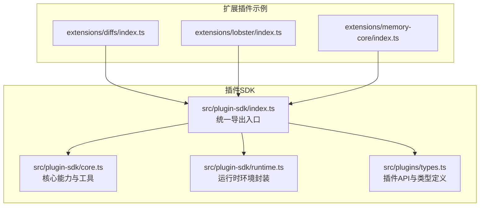
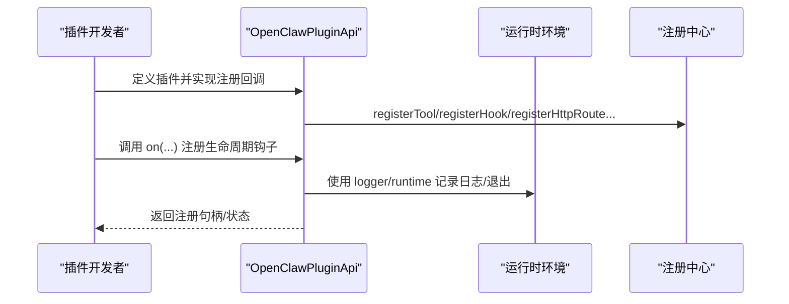
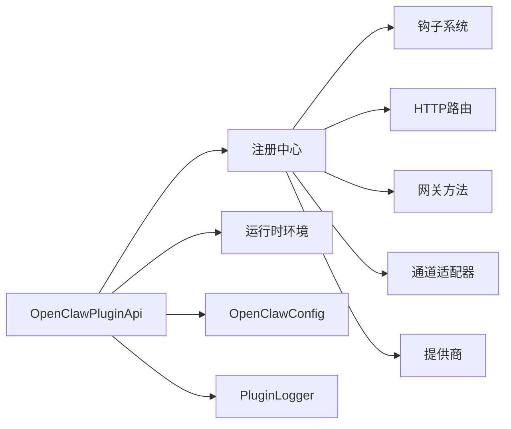

# 核心插件API

<cite>
**本文引用的文件**
- [src/plugin-sdk/index.ts](file://src/plugin-sdk/index.ts)
- [src/plugins/types.ts](file://src/plugins/types.ts)
- [src/plugin-sdk/core.ts](file://src/plugin-sdk/core.ts)
- [src/plugin-sdk/runtime.ts](file://src/plugin-sdk/runtime.ts)
- [extensions/diffs/index.ts](file://extensions/diffs/index.ts)
- [extensions/diffs/openclaw.plugin.json](file://extensions/diffs/openclaw.plugin.json)
- [extensions/lobster/index.ts](file://extensions/lobster/index.ts)
- [extensions/lobster/openclaw.plugin.json](file://extensions/lobster/openclaw.plugin.json)
- [extensions/memory-core/index.ts](file://extensions/memory-core/index.ts)
- [extensions/memory-core/openclaw.plugin.json](file://extensions/memory-core/openclaw.plugin.json)
</cite>

## 目录
1. [简介](#简介)
2. [项目结构](#项目结构)
3. [核心组件](#核心组件)
4. [架构总览](#架构总览)
5. [详细组件分析](#详细组件分析)
6. [依赖关系分析](#依赖关系分析)
7. [性能考量](#性能考量)
8. [故障排查指南](#故障排查指南)
9. [结论](#结论)
10. [附录](#附录)

## 简介
本文件为 OpenClaw 核心插件 API 的权威参考，聚焦于插件生命周期、配置管理、上下文对象与注册机制，并补充插件间通信（事件发布订阅、消息传递、状态共享）的可用能力与最佳实践。内容基于仓库中插件 SDK 的类型定义与导出，确保读者能够准确理解 OpenClawPluginApi 接口、插件上下文对象以及插件注册与扩展点。

## 项目结构
OpenClaw 将插件能力集中在插件 SDK 模块中，通过统一入口导出插件 API、运行时、工具与通道适配器等能力；同时在 extensions 目录下提供多种官方插件示例，便于学习与复用。

图表来源
- [src/plugin-sdk/index.ts:1-826](file://src/plugin-sdk/index.ts#L1-L826)
- [src/plugin-sdk/core.ts:1-44](file://src/plugin-sdk/core.ts#L1-L44)
- [src/plugin-sdk/runtime.ts:1-45](file://src/plugin-sdk/runtime.ts#L1-L45)
- [src/plugins/types.ts:1-893](file://src/plugins/types.ts#L1-L893)
- [extensions/diffs/index.ts](file://extensions/diffs/index.ts)
- [extensions/lobster/index.ts](file://extensions/lobster/index.ts)
- [extensions/memory-core/index.ts](file://extensions/memory-core/index.ts)

章节来源
- [src/plugin-sdk/index.ts:1-826](file://src/plugin-sdk/index.ts#L1-L826)

## 核心组件
本节从类型与职责角度梳理 OpenClaw 插件体系的关键组成。

- OpenClawPluginApi：插件开发的核心入口，提供注册工具、钩子、HTTP 路由、通道适配、网关方法、CLI、服务、提供商与命令等能力。
- OpenClawPluginServiceContext：服务启动/停止所需的上下文，包含配置、工作空间路径与日志记录器。
- OpenClawPluginService：服务抽象，定义 start/stop 生命周期钩子。
- OpenClawPluginConfigSchema：插件配置的校验与 UI 提示能力。
- PluginLogger：插件日志接口，支持 debug/info/warn/error。
- 运行时环境 RuntimeEnv：通过 createLoggerBackedRuntime/resolveRuntimeEnv 构建，提供日志与退出语义。
- 钩子系统：涵盖模型解析、提示构建、代理执行、消息收发、工具调用、会话与子代理生命周期等阶段。

章节来源
- [src/plugins/types.ts:22-306](file://src/plugins/types.ts#L22-L306)
- [src/plugin-sdk/runtime.ts:9-44](file://src/plugin-sdk/runtime.ts#L9-L44)

## 架构总览
OpenClaw 插件通过 OpenClawPluginApi 注册各类扩展点，形成“插件定义 -> 注册 -> 生命周期 -> 执行”的闭环。运行时环境贯穿插件执行期，提供日志与退出能力；钩子系统允许在关键节点注入逻辑。

图表来源
- [src/plugins/types.ts:263-306](file://src/plugins/types.ts#L263-L306)
- [src/plugin-sdk/runtime.ts:9-32](file://src/plugin-sdk/runtime.ts#L9-L32)

## 详细组件分析

### OpenClawPluginApi 接口详解
- 基础属性
  - id/name/version/description/source：插件元信息
  - config/pluginConfig/runtime/logger：运行期配置、插件配置、运行时环境与日志
  - resolvePath：将相对路径解析为绝对路径
- 注册类方法
  - registerTool(tool, opts?)：注册工具或工厂函数
  - registerHook(events, handler, opts?)：注册内部钩子
  - registerHttpRoute(params)：注册 HTTP 路由（可选匹配策略与认证）
  - registerChannel(registration|ChannelPlugin)：注册通道适配器
  - registerGatewayMethod(method, handler)：注册网关方法
  - registerCli(registrar, opts?)：注册 CLI 子命令
  - registerService(service)：注册服务（含 start/stop）
  - registerProvider(provider)：注册提供商（认证、模型等）
  - registerCommand(command)：注册无需 LLM 的自定义命令
  - registerContextEngine(id, factory)：注册上下文引擎（独占槽位）
  - on(hookName, handler, opts?)：注册生命周期钩子（带优先级）

章节来源
- [src/plugins/types.ts:263-306](file://src/plugins/types.ts#L263-L306)

### 插件上下文对象 API
- OpenClawPluginServiceContext
  - config/workspaceDir/stateDir/logger：服务所需配置与日志
- OpenClawPluginToolContext
  - config/workspaceDir/agentDir/agentId/sessionKey/sessionId/messageChannel/agentAccountId/requesterSenderId/senderIsOwner/sandboxed：工具执行上下文
- ProviderAuthContext
  - config/agentDir/workspaceDir/prompter/runtime/isRemote/openUrl/oauth：提供商认证上下文
- PluginCommandContext
  - senderId/channel/channelId/isAuthorizedSender/args/commandBody/config/from/to/accountId/messageThreadId：命令执行上下文
- PluginRuntime
  - 通过 createLoggerBackedRuntime/resolveRuntimeEnv 构建，提供 log/error/exit

章节来源
- [src/plugins/types.ts:230-235](file://src/plugins/types.ts#L230-L235)
- [src/plugins/types.ts:58-73](file://src/plugins/types.ts#L58-L73)
- [src/plugins/types.ts:101-112](file://src/plugins/types.ts#L101-L112)
- [src/plugins/types.ts:146-169](file://src/plugins/types.ts#L146-L169)
- [src/plugin-sdk/runtime.ts:9-32](file://src/plugin-sdk/runtime.ts#L9-L32)

### 插件注册机制
- 插件定义
  - OpenClawPluginDefinition：包含 id/name/description/version/kind/configSchema/register/activate
  - OpenClawPluginModule：支持对象或函数式定义
- 元数据与版本
  - 通过 OpenClawPluginDefinition 的 id/version 字段标识插件身份与版本
  - 版本兼容性建议由上层加载器与依赖声明共同保障
- 依赖声明
  - 通过 registerProvider/ChannelPlugin/registerGatewayMethod 等注册间接声明依赖（例如提供商、通道、网关方法）
- 生命周期
  - register/activate：分别在“注册”和“激活”阶段调用
  - registerService/start/stop：服务化插件的生命周期

章节来源
- [src/plugins/types.ts:248-257](file://src/plugins/types.ts#L248-L257)
- [src/plugins/types.ts:237-241](file://src/plugins/types.ts#L237-L241)

### 插件间通信接口
- 事件发布订阅
  - registerHook(events, handler, opts?)：注册内部钩子，覆盖从模型解析到消息发送/接收、工具调用、会话与子代理生命周期等阶段
  - on(hookName, handler, opts?)：注册生命周期钩子（带优先级）
- 消息传递
  - registerHttpRoute(params)：注册 HTTP 路由，结合认证策略实现跨插件消息通道
  - registerGatewayMethod(method, handler)：注册网关方法，供外部调用
- 状态共享
  - 通过 registerService 与运行时环境配合，结合插件配置与持久化存储实现状态共享
  - 钩子事件对象（如 PluginHookMessageSendingResult、PluginHookBeforeMessageWriteResult）可用于在消息链路中修改或阻断消息

章节来源
- [src/plugins/types.ts:277-306](file://src/plugins/types.ts#L277-L306)
- [src/plugins/types.ts:580-591](file://src/plugins/types.ts#L580-L591)
- [src/plugins/types.ts:666-669](file://src/plugins/types.ts#L666-L669)

### 钩子系统与事件模型
- 钩子名称集合与校验
  - 包含 before_model_resolve/before_prompt_build/before_agent_start/llm_input/llm_output/agent_end/before_compaction/after_compaction/before_reset/message_received/message_sending/message_sent/before_tool_call/after_tool_call/tool_result_persist/before_message_write/session_start/session_end/subagent_spawning/subagent_delivery_target/subagent_spawned/subagent_ended/gateway_start/gateway_stop
- 钩子事件与结果
  - 各阶段事件对象与可选返回值（如模型/提示变更、消息修改/取消、工具参数变更/阻断、消息写入前修改/阻断、子代理目标重定向等）
- 提示注入钩子
  - before_prompt_build/before_agent_start 支持系统提示与上下文拼接的静态注入（避免每轮 token 成本）

章节来源
- [src/plugins/types.ts:321-372](file://src/plugins/types.ts#L321-L372)
- [src/plugins/types.ts:422-442](file://src/plugins/types.ts#L422-L442)
- [src/plugins/types.ts:490-517](file://src/plugins/types.ts#L490-L517)
- [src/plugins/types.ts:565-591](file://src/plugins/types.ts#L565-L591)
- [src/plugins/types.ts:606-633](file://src/plugins/types.ts#L606-L633)
- [src/plugins/types.ts:635-669](file://src/plugins/types.ts#L635-L669)
- [src/plugins/types.ts:678-691](file://src/plugins/types.ts#L678-L691)
- [src/plugins/types.ts:716-770](file://src/plugins/types.ts#L716-L770)
- [src/plugins/types.ts:776-784](file://src/plugins/types.ts#L776-L784)

### 运行时与日志
- createLoggerBackedRuntime/resolveRuntimeEnv：将外部日志器适配为 RuntimeEnv，提供 log/error/exit
- resolveRuntimeEnvWithUnavailableExit：在运行时不可用时提供兜底退出语义

章节来源
- [src/plugin-sdk/runtime.ts:9-44](file://src/plugin-sdk/runtime.ts#L9-L44)

### 配置管理
- OpenClawPluginConfigSchema：支持 safeParse/parse/validate/uiHints/jsonSchema，用于插件配置校验与 UI 提示
- emptyPluginConfigSchema：空配置模式，便于无配置插件快速起步

章节来源
- [src/plugins/types.ts:44-56](file://src/plugins/types.ts#L44-L56)
- [src/plugin-sdk/index.ts:127](file://src/plugin-sdk/index.ts#L127)

### CLI 与命令
- registerCli(registrar, opts?)：注册 CLI 子命令
- registerCommand(command)：注册无需 LLM 的简单命令，优先于内置命令与代理调用

章节来源
- [src/plugins/types.ts:285-293](file://src/plugins/types.ts#L285-L293)
- [src/plugins/types.ts:186-203](file://src/plugins/types.ts#L186-L203)

### 通道与提供商
- registerChannel(registration|ChannelPlugin)：注册通道适配器
- registerProvider(provider)：注册提供商（认证、模型、格式化凭据等）

章节来源
- [src/plugins/types.ts:283-287](file://src/plugins/types.ts#L283-L287)
- [src/plugins/types.ts:122-132](file://src/plugins/types.ts#L122-L132)

## 依赖关系分析
- 组件耦合
  - OpenClawPluginApi 依赖运行时环境与配置，通过 register* 方法向注册中心注册扩展点
  - 钩子系统以事件对象与可选返回值解耦插件逻辑与核心流程
- 外部依赖
  - 网关方法、通道适配器、提供商等通过注册接口与核心系统对接
- 循环依赖风险
  - 通过“注册接口 + 事件驱动”的设计降低循环依赖概率

图表来源
- [src/plugins/types.ts:263-306](file://src/plugins/types.ts#L263-L306)
- [src/plugin-sdk/runtime.ts:9-32](file://src/plugin-sdk/runtime.ts#L9-L32)

## 性能考量
- 钩子链路
  - 在提示构建与模型解析阶段进行静态上下文注入，减少每轮 token 成本
  - 工具调用前后钩子应避免重型同步操作，必要时采用异步处理
- 消息处理
  - 使用 registerHttpRoute 与网关方法时，注意限流与请求体大小限制
- 会话压缩
  - 利用 before_compaction/after_compaction 阶段对会话文件进行并行处理，减少阻塞

## 故障排查指南
- 日志定位
  - 使用 PluginLogger 的 error/warn/info/debug 输出关键路径日志
  - 通过 resolveRuntimeEnvWithUnavailableExit 在运行时不可用时输出明确错误
- 配置校验
  - 使用 OpenClawPluginConfigSchema.validate/safeParse 校验插件配置，收集错误列表
- 钩子调试
  - 在 message_sending/message_sent/before_message_write 等阶段插入日志，确认消息链路是否被修改或阻断
- 退出与异常
  - 使用 RuntimeEnv.exit 触发可控退出，便于上层捕获与恢复

章节来源
- [src/plugin-sdk/runtime.ts:34-44](file://src/plugin-sdk/runtime.ts#L34-L44)
- [src/plugins/types.ts:40-56](file://src/plugins/types.ts#L40-L56)
- [src/plugins/types.ts:580-591](file://src/plugins/types.ts#L580-L591)
- [src/plugins/types.ts:666-669](file://src/plugins/types.ts#L666-L669)

## 结论
OpenClaw 的插件体系以 OpenClawPluginApi 为核心，围绕注册、钩子、运行时与配置管理构建了高扩展性与强可观测性的框架。通过标准化的上下文对象与事件模型，插件可在不侵入核心流程的前提下实现复杂业务逻辑；同时，HTTP 路由与网关方法为跨插件通信提供了清晰的边界。

## 附录

### 实现一个完整插件的步骤与示例路径
以下示例展示了如何实现一个具备工具、钩子、HTTP 路由与服务的插件。请参考以下路径获取真实实现与元数据文件：

- 工具与钩子示例
  - [extensions/diffs/index.ts](file://extensions/diffs/index.ts)
  - [extensions/lobster/index.ts](file://extensions/lobster/index.ts)
- 服务与生命周期示例
  - [extensions/memory-core/index.ts](file://extensions/memory-core/index.ts)
- 插件元数据
  - [extensions/diffs/openclaw.plugin.json](file://extensions/diffs/openclaw.plugin.json)
  - [extensions/lobster/openclaw.plugin.json](file://extensions/lobster/openclaw.plugin.json)
  - [extensions/memory-core/openclaw.plugin.json](file://extensions/memory-core/openclaw.plugin.json)

实现要点（基于已导出类型与示例文件）：
- 在插件模块中实现 OpenClawPluginDefinition 或函数式定义，并在 register 回调中调用 OpenClawPluginApi 的注册方法
- 使用 registerTool 注册工具或工厂函数；使用 registerHook/on 注册钩子
- 使用 registerHttpRoute 注册 HTTP 路由；使用 registerGatewayMethod 注册网关方法
- 使用 registerService 注册服务；在 start/stop 中管理资源
- 使用 OpenClawPluginConfigSchema 定义与校验插件配置
- 使用 PluginLogger 输出日志；通过 RuntimeEnv 控制退出

章节来源
- [src/plugins/types.ts:248-261](file://src/plugins/types.ts#L248-L261)
- [src/plugins/types.ts:263-306](file://src/plugins/types.ts#L263-L306)
- [src/plugin-sdk/index.ts:127](file://src/plugin-sdk/index.ts#L127)
- [extensions/diffs/index.ts](file://extensions/diffs/index.ts)
- [extensions/lobster/index.ts](file://extensions/lobster/index.ts)
- [extensions/memory-core/index.ts](file://extensions/memory-core/index.ts)
- [extensions/diffs/openclaw.plugin.json](file://extensions/diffs/openclaw.plugin.json)
- [extensions/lobster/openclaw.plugin.json](file://extensions/lobster/openclaw.plugin.json)
- [extensions/memory-core/openclaw.plugin.json](file://extensions/memory-core/openclaw.plugin.json)