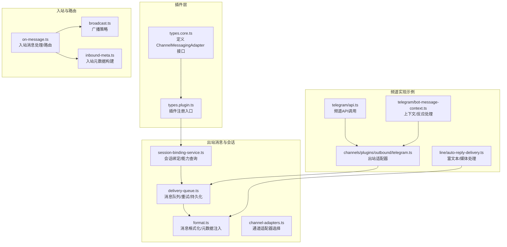
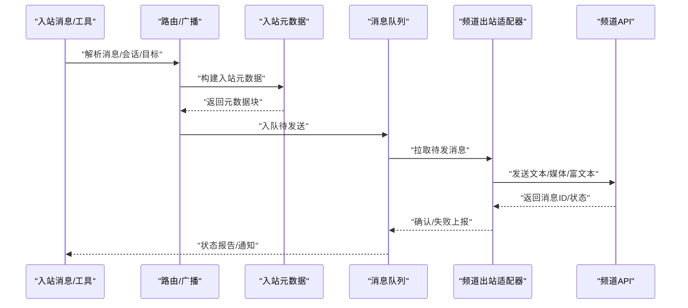
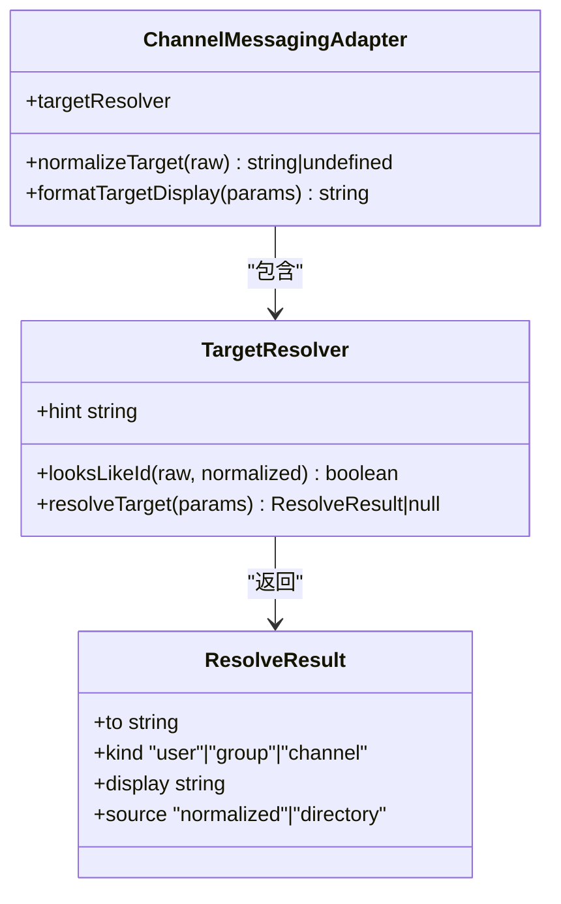
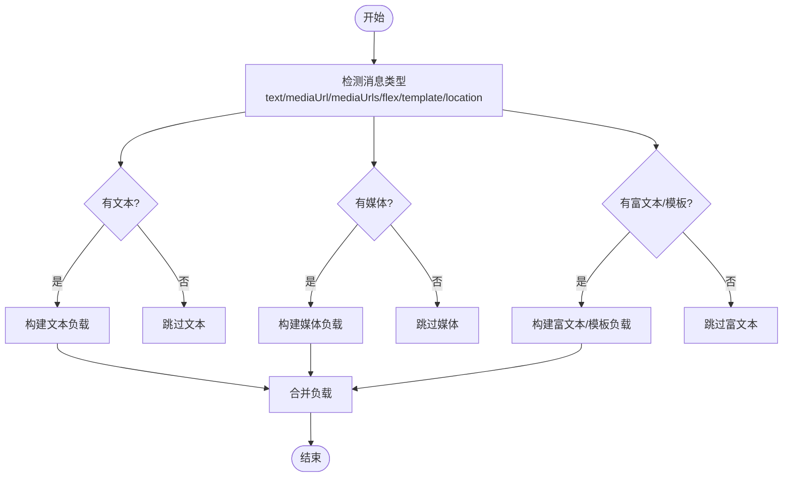
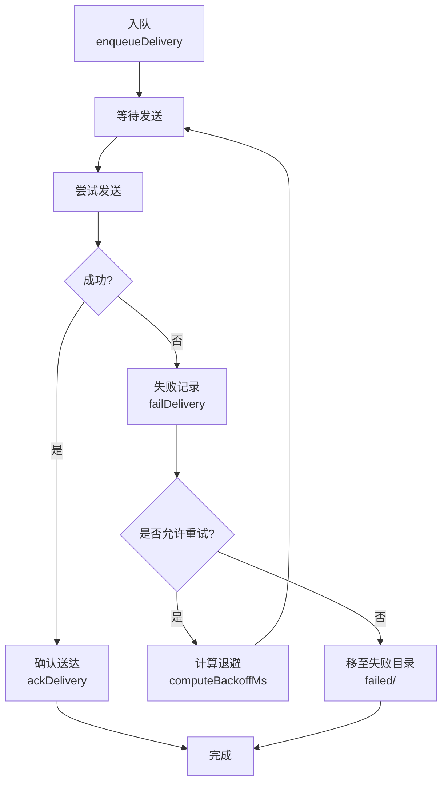
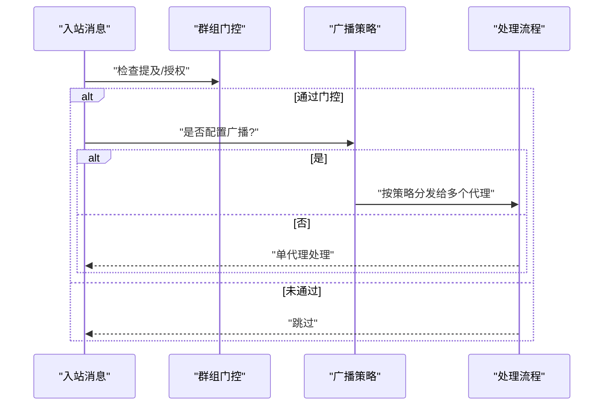
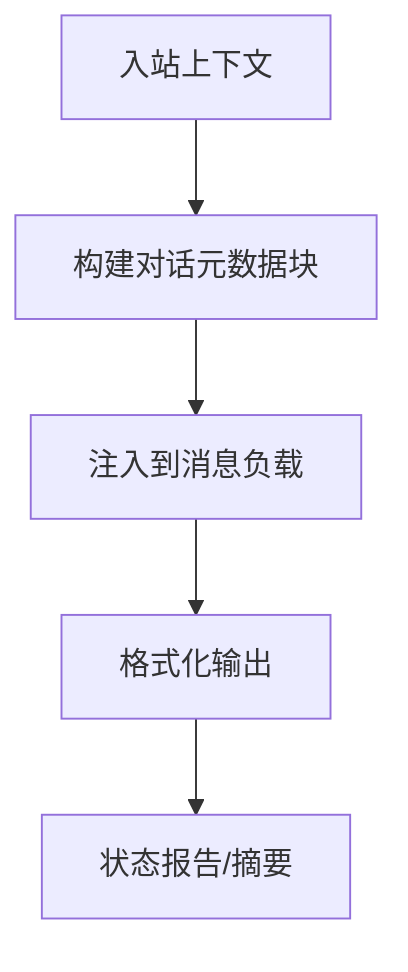
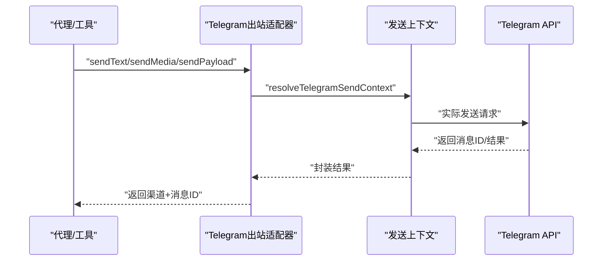
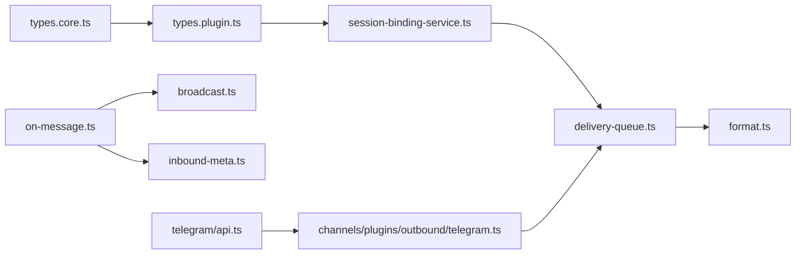

# 消息适配器

<cite>
**本文引用的文件**
- [src/channels/plugins/types.core.ts](file://src/channels/plugins/types.core.ts)
- [src/channels/plugins/types.plugin.ts](file://src/channels/plugins/types.plugin.ts)
- [src/infra/outbound/delivery-queue.ts](file://src/infra/outbound/delivery-queue.ts)
- [src/infra/outbound/format.ts](file://src/infra/outbound/format.ts)
- [src/web/auto-reply/monitor/on-message.ts](file://src/web/auto-reply/monitor/on-message.ts)
- [src/web/auto-reply/monitor/broadcast.ts](file://src/web/auto-reply/monitor/broadcast.ts)
- [src/auto-reply/reply/inbound-meta.ts](file://src/auto-reply/reply/inbound-meta.ts)
- [src/infra/outbound/outbound.test.ts](file://src/infra/outbound/outbound.test.ts)
- [src/channels/telegram/api.ts](file://src/channels/telegram/api.ts)
- [src/channels/plugins/outbound/telegram.ts](file://src/channels/plugins/outbound/telegram.ts)
- [src/telegram/bot-message-context.ts](file://src/telegram/bot-message-context.ts)
- [src/line/auto-reply-delivery.ts](file://src/line/auto-reply-delivery.ts)
- [src/infra/outbound/session-binding-service.ts](file://src/infra/outbound/session-binding-service.ts)
- [src/infra/outbound/channel-adapters.ts](file://src/infra/outbound/channel-adapters.ts)
- [src/cron/delivery.failure-notify.test.ts](file://src/cron/delivery.failure-notify.test.ts)
</cite>

## 目录
1. [简介](#简介)
2. [项目结构](#项目结构)
3. [核心组件](#核心组件)
4. [架构总览](#架构总览)
5. [详细组件分析](#详细组件分析)
6. [依赖关系分析](#依赖关系分析)
7. [性能考量](#性能考量)
8. [故障排查指南](#故障排查指南)
9. [结论](#结论)
10. [附录](#附录)

## 简介
本文件面向OpenClaw消息适配器（ChannelMessagingAdapter）的实现与使用，聚焦以下目标：
- 明确ChannelMessagingAdapter接口的实现要求：消息发送、接收、状态报告与错误处理的方法签名与职责边界
- 规范消息格式：文本消息、媒体消息、富文本消息与系统消息的结构定义与转换
- 完整的消息生命周期：排队、重试、持久化与清理策略
- 消息路由规则：单聊、群聊、广播消息的处理流程
- 元数据管理：时间戳、发送者信息、消息ID等字段的来源与呈现
- 提供实现示例与常见问题解决方案

## 项目结构
围绕消息适配器的关键目录与文件：
- 插件类型与适配器接口定义：channels/plugins/types.core.ts、types.plugin.ts
- 出站消息与会话绑定：infra/outbound/*.ts
- 广播与路由：web/auto-reply/monitor/*.ts
- 入站元数据与消息格式化：auto-reply/reply/inbound-meta.ts、infra/outbound/format.ts
- 频道具体实现示例：channels/telegram/*、line/auto-reply-delivery.ts
- 会话绑定服务：infra/outbound/session-binding-service.ts

**图表来源**
- [src/channels/plugins/types.core.ts:286-309](file://src/channels/plugins/types.core.ts#L286-L309)
- [src/channels/plugins/types.plugin.ts:70-86](file://src/channels/plugins/types.plugin.ts#L70-L86)
- [src/infra/outbound/delivery-queue.ts:1-200](file://src/infra/outbound/delivery-queue.ts#L1-L200)
- [src/infra/outbound/format.ts:87-121](file://src/infra/outbound/format.ts#L87-L121)
- [src/web/auto-reply/monitor/on-message.ts:127-170](file://src/web/auto-reply/monitor/on-message.ts#L127-L170)
- [src/web/auto-reply/monitor/broadcast.ts:47-125](file://src/web/auto-reply/monitor/broadcast.ts#L47-L125)
- [src/auto-reply/reply/inbound-meta.ts:99-136](file://src/auto-reply/reply/inbound-meta.ts#L99-L136)
- [src/channels/telegram/api.ts:1-24](file://src/channels/telegram/api.ts#L1-L24)
- [src/channels/plugins/outbound/telegram.ts:89-160](file://src/channels/plugins/outbound/telegram.ts#L89-L160)
- [src/telegram/bot-message-context.ts:303-337](file://src/telegram/bot-message-context.ts#L303-L337)
- [src/line/auto-reply-delivery.ts:88-130](file://src/line/auto-reply-delivery.ts#L88-L130)

**章节来源**
- [src/channels/plugins/types.core.ts:286-309](file://src/channels/plugins/types.core.ts#L286-L309)
- [src/channels/plugins/types.plugin.ts:70-86](file://src/channels/plugins/types.plugin.ts#L70-L86)
- [src/infra/outbound/delivery-queue.ts:1-200](file://src/infra/outbound/delivery-queue.ts#L1-L200)
- [src/infra/outbound/format.ts:87-121](file://src/infra/outbound/format.ts#L87-L121)
- [src/web/auto-reply/monitor/on-message.ts:127-170](file://src/web/auto-reply/monitor/on-message.ts#L127-L170)
- [src/web/auto-reply/monitor/broadcast.ts:47-125](file://src/web/auto-reply/monitor/broadcast.ts#L47-L125)
- [src/auto-reply/reply/inbound-meta.ts:99-136](file://src/auto-reply/reply/inbound-meta.ts#L99-L136)
- [src/channels/telegram/api.ts:1-24](file://src/channels/telegram/api.ts#L1-L24)
- [src/channels/plugins/outbound/telegram.ts:89-160](file://src/channels/plugins/outbound/telegram.ts#L89-L160)
- [src/telegram/bot-message-context.ts:303-337](file://src/telegram/bot-message-context.ts#L303-L337)
- [src/line/auto-reply-delivery.ts:88-130](file://src/line/auto-reply-delivery.ts#L88-L130)

## 核心组件
- ChannelMessagingAdapter接口：定义目标标准化、目标解析、显示格式化等能力，用于统一跨频道的消息寻址与展示。
- 出站消息队列与重试：负责消息持久化、失败回退、最大重试次数控制与恢复扫描。
- 路由与广播：根据消息类型与配置决定单聊、群聊或广播策略。
- 元数据与格式化：统一注入时间戳、消息ID、线程/会话标识等元数据，并对消息进行格式化。
- 频道适配器示例：以Telegram为例，展示如何实现发送文本、媒体与富文本消息。

**章节来源**
- [src/channels/plugins/types.core.ts:286-309](file://src/channels/plugins/types.core.ts#L286-L309)
- [src/infra/outbound/delivery-queue.ts:1-200](file://src/infra/outbound/delivery-queue.ts#L1-L200)
- [src/web/auto-reply/monitor/on-message.ts:127-170](file://src/web/auto-reply/monitor/on-message.ts#L127-L170)
- [src/web/auto-reply/monitor/broadcast.ts:47-125](file://src/web/auto-reply/monitor/broadcast.ts#L47-L125)
- [src/auto-reply/reply/inbound-meta.ts:99-136](file://src/auto-reply/reply/inbound-meta.ts#L99-L136)
- [src/infra/outbound/format.ts:87-121](file://src/infra/outbound/format.ts#L87-L121)
- [src/channels/plugins/outbound/telegram.ts:89-160](file://src/channels/plugins/outbound/telegram.ts#L89-L160)

## 架构总览
消息从“入站/工具触发”到“出站投递”的整体流程如下：

**图表来源**
- [src/web/auto-reply/monitor/on-message.ts:127-170](file://src/web/auto-reply/monitor/on-message.ts#L127-L170)
- [src/auto-reply/reply/inbound-meta.ts:99-136](file://src/auto-reply/reply/inbound-meta.ts#L99-L136)
- [src/infra/outbound/delivery-queue.ts:109-136](file://src/infra/outbound/delivery-queue.ts#L109-L136)
- [src/channels/plugins/outbound/telegram.ts:89-160](file://src/channels/plugins/outbound/telegram.ts#L89-L160)
- [src/channels/telegram/api.ts:1-24](file://src/channels/telegram/api.ts#L1-L24)

## 详细组件分析

### ChannelMessagingAdapter接口与实现要求
- 目标标准化：normalizeTarget(raw) -> 可选；将输入的目标字符串归一化为稳定标识。
- 目标解析：targetResolver.resolveTarget(params) -> 返回to、kind、display、source；支持looksLikeId与hint提示。
- 目标显示格式化：formatTargetDisplay(params) -> 返回用于UI/日志的显示字符串。
- 适用场景：跨频道统一寻址、显示名与ID映射、目录查询辅助。

**图表来源**
- [src/channels/plugins/types.core.ts:286-309](file://src/channels/plugins/types.core.ts#L286-L309)

**章节来源**
- [src/channels/plugins/types.core.ts:286-309](file://src/channels/plugins/types.core.ts#L286-L309)
- [src/channels/plugins/types.plugin.ts:70-86](file://src/channels/plugins/types.plugin.ts#L70-L86)

### 消息格式规范
- 文本消息：包含text字段，可配合replyToId、threadId等上下文字段。
- 媒体消息：包含mediaUrl或mediaUrls数组，可附加文本描述。
- 富文本消息：通过频道特定的富文本容器（如LINE Flex/Template、Telegram InlineKeyboard等）表达交互元素。
- 系统消息：用于内部状态、通知或调试用途，通常不对外可见或作为特殊标记存在。

**图表来源**
- [src/line/auto-reply-delivery.ts:88-130](file://src/line/auto-reply-delivery.ts#L88-L130)
- [src/channels/plugins/outbound/telegram.ts:132-160](file://src/channels/plugins/outbound/telegram.ts#L132-L160)

**章节来源**
- [src/line/auto-reply-delivery.ts:88-130](file://src/line/auto-reply-delivery.ts#L88-L130)
- [src/channels/plugins/outbound/telegram.ts:89-160](file://src/channels/plugins/outbound/telegram.ts#L89-L160)

### 消息生命周期管理
- 入队：enqueueDelivery生成唯一ID并写入磁盘，记录enqueuedAt、payloads、threadId、replyToId等。
- 发送：按需从队列读取，调用频道适配器发送；成功后ackDelivery采用两阶段标记避免重复发送。
- 失败与重试：failDelivery更新retryCount、lastAttemptAt、lastError；computeBackoffMs基于重试次数计算退避；loadPendingDeliveries扫描并按退避策略恢复。
- 最终处理：超过最大重试次数或永久性错误时移至failed/目录；通知与告警通过失败通知任务完成。

**图表来源**
- [src/infra/outbound/delivery-queue.ts:109-180](file://src/infra/outbound/delivery-queue.ts#L109-L180)
- [src/infra/outbound/delivery-queue.ts:244-276](file://src/infra/outbound/delivery-queue.ts#L244-L276)
- [src/infra/outbound/outbound.test.ts:164-204](file://src/infra/outbound/outbound.test.ts#L164-L204)

**章节来源**
- [src/infra/outbound/delivery-queue.ts:1-200](file://src/infra/outbound/delivery-queue.ts#L1-L200)
- [src/infra/outbound/delivery-queue.ts:244-276](file://src/infra/outbound/delivery-queue.ts#L244-L276)
- [src/infra/outbound/outbound.test.ts:164-204](file://src/infra/outbound/outbound.test.ts#L164-L204)

### 消息路由规则
- 单聊：DM场景下确保senderE164等身份字段稳定，必要时进行标准化。
- 群聊：应用群组门控（mention/激活），并可选择广播给多个代理。
- 广播：根据配置选择串行或并行策略，对每个代理独立构建路由键并抑制历史清理，保证一致性。

**图表来源**
- [src/web/auto-reply/monitor/on-message.ts:127-170](file://src/web/auto-reply/monitor/on-message.ts#L127-L170)
- [src/web/auto-reply/monitor/broadcast.ts:47-125](file://src/web/auto-reply/monitor/broadcast.ts#L47-L125)

**章节来源**
- [src/web/auto-reply/monitor/on-message.ts:127-170](file://src/web/auto-reply/monitor/on-message.ts#L127-L170)
- [src/web/auto-reply/monitor/broadcast.ts:47-125](file://src/web/auto-reply/monitor/broadcast.ts#L47-L125)

### 消息元数据管理
- 入站元数据：包含message_id、reply_to_id、sender_id、conversation_label、sender、timestamp、group_*、thread_label、topic_id、is_forum/is_group_chat、was_mentioned、has_reply_context/has_forwarded_context/has_thread_starter、history_count等。
- 出站格式化：注入timestamp、toJid、meta等字段，形成统一的网关摘要与消息ID报告。

**图表来源**
- [src/auto-reply/reply/inbound-meta.ts:99-136](file://src/auto-reply/reply/inbound-meta.ts#L99-L136)
- [src/infra/outbound/format.ts:87-121](file://src/infra/outbound/format.ts#L87-L121)

**章节来源**
- [src/auto-reply/reply/inbound-meta.ts:99-136](file://src/auto-reply/reply/inbound-meta.ts#L99-L136)
- [src/infra/outbound/format.ts:87-121](file://src/infra/outbound/format.ts#L87-L121)

### 实现示例：Telegram出站适配器
- 发送文本：sendText，支持replyToId、threadId与accountId。
- 发送媒体：sendMedia，支持mediaUrl与本地根路径。
- 发送负载：sendPayload，支持复杂负载拆分与多段发送。
- 频道API：fetchTelegramChatId用于验证与解析聊天ID。

**图表来源**
- [src/channels/plugins/outbound/telegram.ts:89-160](file://src/channels/plugins/outbound/telegram.ts#L89-L160)
- [src/channels/telegram/api.ts:1-24](file://src/channels/telegram/api.ts#L1-L24)

**章节来源**
- [src/channels/plugins/outbound/telegram.ts:89-160](file://src/channels/plugins/outbound/telegram.ts#L89-L160)
- [src/channels/telegram/api.ts:1-24](file://src/channels/telegram/api.ts#L1-L24)
- [src/telegram/bot-message-context.ts:303-337](file://src/telegram/bot-message-context.ts#L303-L337)

### 错误处理与状态报告
- 结构化错误：会话绑定服务在绑定失败时抛出结构化错误，包含通道、账号、放置位置等上下文。
- 失败通知：失败告警通过明确的目标严格发送，即使失败也仅记录日志并吞掉异常，避免影响主流程。
- 状态摘要：formatOutboundDeliverySummary按渠道输出消息ID与额外详情（如chatId、channelId）。

**章节来源**
- [src/infra/outbound/session-binding-service.ts:226-253](file://src/infra/outbound/session-binding-service.ts#L226-L253)
- [src/cron/delivery.failure-notify.test.ts:38-143](file://src/cron/delivery.failure-notify.test.ts#L38-L143)
- [src/infra/outbound/format.ts:112-121](file://src/infra/outbound/format.ts#L112-L121)

## 依赖关系分析
- 类型依赖：插件类型定义位于types.core.ts与types.plugin.ts，统一了适配器注册与接口约束。
- 运行时依赖：会话绑定服务依赖适配器能力查询与绑定；出站队列依赖适配器的发送实现；广播与路由依赖配置与上下文。
- 频道适配器：Telegram示例展示了如何组合上下文解析、发送与结果封装。

**图表来源**
- [src/channels/plugins/types.core.ts:286-309](file://src/channels/plugins/types.core.ts#L286-L309)
- [src/channels/plugins/types.plugin.ts:70-86](file://src/channels/plugins/types.plugin.ts#L70-L86)
- [src/infra/outbound/session-binding-service.ts:255-261](file://src/infra/outbound/session-binding-service.ts#L255-L261)
- [src/infra/outbound/delivery-queue.ts:109-136](file://src/infra/outbound/delivery-queue.ts#L109-L136)
- [src/infra/outbound/format.ts:87-121](file://src/infra/outbound/format.ts#L87-L121)
- [src/web/auto-reply/monitor/on-message.ts:127-170](file://src/web/auto-reply/monitor/on-message.ts#L127-L170)
- [src/web/auto-reply/monitor/broadcast.ts:47-125](file://src/web/auto-reply/monitor/broadcast.ts#L47-L125)
- [src/auto-reply/reply/inbound-meta.ts:99-136](file://src/auto-reply/reply/inbound-meta.ts#L99-L136)
- [src/channels/plugins/outbound/telegram.ts:89-160](file://src/channels/plugins/outbound/telegram.ts#L89-L160)
- [src/channels/telegram/api.ts:1-24](file://src/channels/telegram/api.ts#L1-L24)

**章节来源**
- [src/channels/plugins/types.core.ts:286-309](file://src/channels/plugins/types.core.ts#L286-L309)
- [src/channels/plugins/types.plugin.ts:70-86](file://src/channels/plugins/types.plugin.ts#L70-L86)
- [src/infra/outbound/session-binding-service.ts:255-261](file://src/infra/outbound/session-binding-service.ts#L255-L261)
- [src/infra/outbound/delivery-queue.ts:109-136](file://src/infra/outbound/delivery-queue.ts#L109-L136)
- [src/infra/outbound/format.ts:87-121](file://src/infra/outbound/format.ts#L87-L121)
- [src/web/auto-reply/monitor/on-message.ts:127-170](file://src/web/auto-reply/monitor/on-message.ts#L127-L170)
- [src/web/auto-reply/monitor/broadcast.ts:47-125](file://src/web/auto-reply/monitor/broadcast.ts#L47-L125)
- [src/auto-reply/reply/inbound-meta.ts:99-136](file://src/auto-reply/reply/inbound-meta.ts#L99-L136)
- [src/channels/plugins/outbound/telegram.ts:89-160](file://src/channels/plugins/outbound/telegram.ts#L89-L160)
- [src/channels/telegram/api.ts:1-24](file://src/channels/telegram/api.ts#L1-L24)

## 性能考量
- 队列与持久化：采用原子重命名与临时文件策略，减少竞态风险与重复发送。
- 退避策略：指数级退避（固定步长）降低对下游的压力，提升恢复概率。
- 广播策略：并行广播可提升吞吐，但需注意下游限流与资源占用。
- 富文本与媒体：拆分与分片发送，避免超限与失败重试成本过高。

[本节为通用指导，无需列出具体文件来源]

## 故障排查指南
- 绑定失败：检查通道与账号是否注册适配器、放置位置是否受支持、返回值是否为真值。
- 发送失败：查看队列条目retryCount、lastAttemptAt、lastError；确认退避是否生效；核对目标ID与权限。
- 广播异常：确认配置中的agent列表与策略；检查并行执行中的个别代理错误日志。
- 元数据缺失：核对入站上下文字段完整性；确保在format阶段正确注入timestamp、toJid、meta等。

**章节来源**
- [src/infra/outbound/session-binding-service.ts:226-253](file://src/infra/outbound/session-binding-service.ts#L226-L253)
- [src/infra/outbound/outbound.test.ts:164-204](file://src/infra/outbound/outbound.test.ts#L164-L204)
- [src/web/auto-reply/monitor/broadcast.ts:112-125](file://src/web/auto-reply/monitor/broadcast.ts#L112-L125)
- [src/infra/outbound/format.ts:87-121](file://src/infra/outbound/format.ts#L87-L121)

## 结论
OpenClaw的消息适配器体系通过统一的ChannelMessagingAdapter接口与插件化适配器实现，结合完善的出站队列、重试与广播机制，提供了跨频道的一致性消息体验。遵循本文档的接口约定、消息格式与生命周期管理实践，可确保消息在不同频道间的可靠流转与可观测性。

[本节为总结性内容，无需列出具体文件来源]

## 附录
- 通道适配器选择：getChannelMessageAdapter根据通道ID返回对应适配器实例，支持组件版本特性开关。
- 会话绑定服务：提供bind/listBySession/resolveByConversation/getCapabilities等能力，便于命令预检与绑定管理。

**章节来源**
- [src/infra/outbound/channel-adapters.ts:14-56](file://src/infra/outbound/channel-adapters.ts#L14-L56)
- [src/infra/outbound/session-binding-service.ts:255-261](file://src/infra/outbound/session-binding-service.ts#L255-L261)