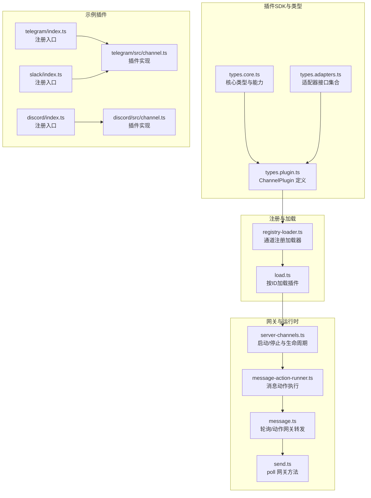
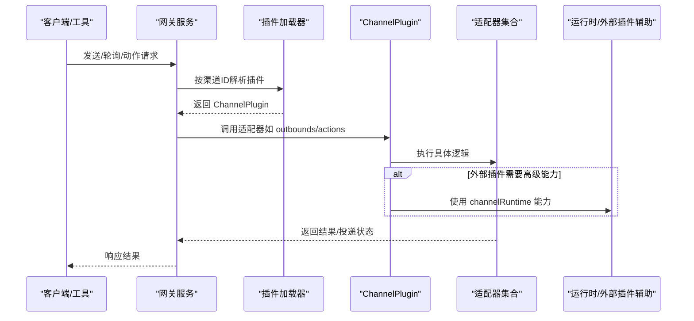
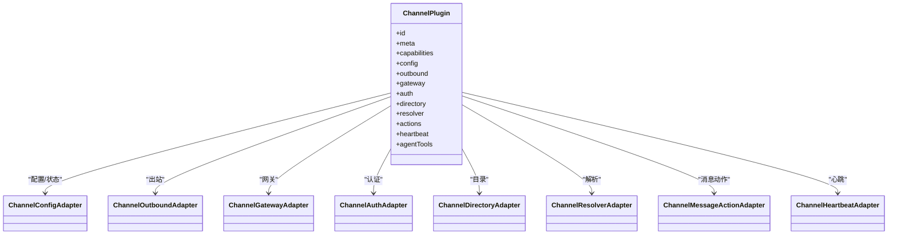
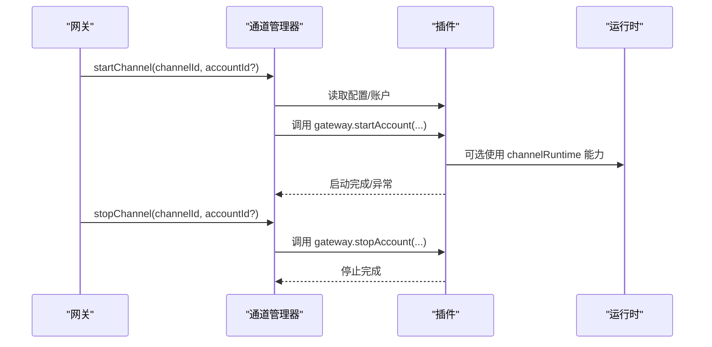
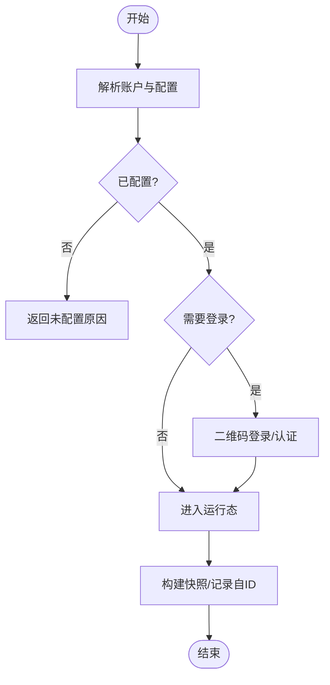
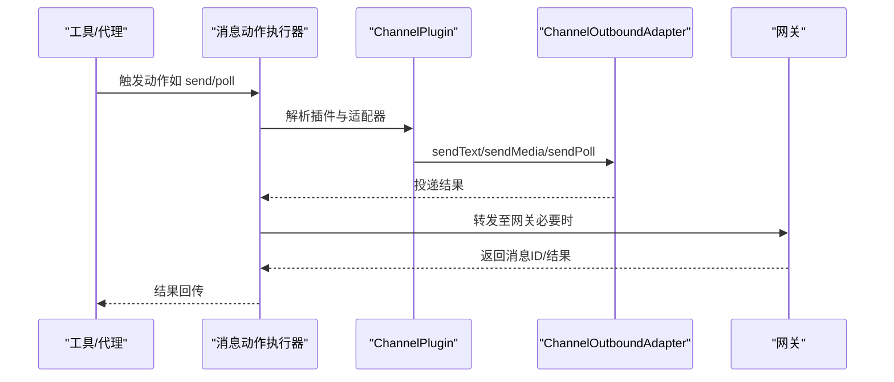
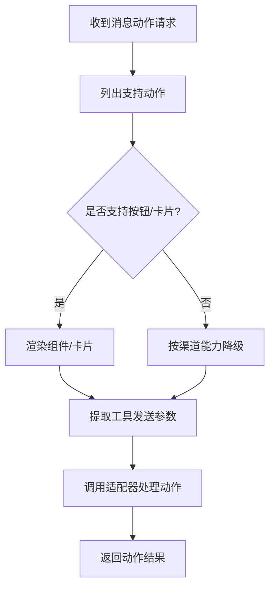
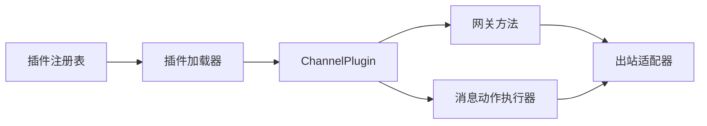

# 渠道插件API

<cite>
**本文引用的文件**
- [types.core.ts](file://src/channels/plugins/types.core.ts)
- [types.adapters.ts](file://src/channels/plugins/types.adapters.ts)
- [types.plugin.ts](file://src/channels/plugins/types.plugin.ts)
- [registry-loader.ts](file://src/channels/plugins/registry-loader.ts)
- [load.ts](file://src/channels/plugins/load.ts)
- [server-channels.ts](file://src/gateway/server-channels.ts)
- [message-action-runner.ts](file://src/infra/outbound/message-action-runner.ts)
- [message.ts](file://src/infra/outbound/message.ts)
- [send.ts](file://src/gateway/server-methods/send.ts)
- [index.ts（Telegram 插件）](file://extensions/telegram/index.ts)
- [channel.ts（Telegram 插件）](file://extensions/telegram/src/channel.ts)
- [index.ts（Discord 插件）](file://extensions/discord/index.ts)
- [channel.ts（Discord 插件）](file://extensions/discord/src/channel.ts)
- [index.ts（Slack 插件）](file://extensions/slack/index.ts)
</cite>

## 目录
1. [简介](#简介)
2. [项目结构](#项目结构)
3. [核心组件](#核心组件)
4. [架构总览](#架构总览)
5. [详细组件分析](#详细组件分析)
6. [依赖关系分析](#依赖关系分析)
7. [性能考量](#性能考量)
8. [故障排查指南](#故障排查指南)
9. [结论](#结论)
10. [附录](#附录)

## 简介
本文件为 OpenClaw 渠道插件 API 的完整参考文档，面向希望开发或集成渠道适配器（如 Telegram、Discord、Slack 等）的开发者。内容覆盖 ChannelPlugin 接口与各类适配器的职责边界、生命周期方法、账户管理与会话管理、消息收发与富媒体能力、群组与权限策略、以及消息动作（如投票、组件按钮等）的扩展机制。同时提供实现要点、最佳实践与常见问题排查建议。

## 项目结构
OpenClaw 将“渠道插件”作为可插拔模块注册到运行时，通过统一的 ChannelPlugin 接口暴露能力，并由网关层在运行期按需加载与调用。核心目录与文件如下：
- 渠道插件类型定义：src/channels/plugins/types.*.ts
- 渠道插件注册与加载：src/channels/plugins/registry-loader.ts、load.ts
- 网关侧启动/停止与生命周期：src/gateway/server-channels.ts
- 消息动作执行与网关转发：src/infra/outbound/message-action-runner.ts、src/infra/outbound/message.ts、src/gateway/server-methods/send.ts
- 具体渠道插件示例：extensions/*/index.ts、extensions/*/src/channel.ts

**图表来源**
- [types.core.ts:1-403](file://src/channels/plugins/types.core.ts#L1-L403)
- [types.adapters.ts:1-384](file://src/channels/plugins/types.adapters.ts#L1-L384)
- [types.plugin.ts:1-86](file://src/channels/plugins/types.plugin.ts#L1-L86)
- [registry-loader.ts:1-35](file://src/channels/plugins/registry-loader.ts#L1-L35)
- [load.ts:1-8](file://src/channels/plugins/load.ts#L1-L8)
- [server-channels.ts:59-372](file://src/gateway/server-channels.ts#L59-L372)
- [message-action-runner.ts:469-654](file://src/infra/outbound/message-action-runner.ts#L469-L654)
- [message.ts:280-346](file://src/infra/outbound/message.ts#L280-L346)
- [send.ts:409-456](file://src/gateway/server-methods/send.ts#L409-L456)
- [index.ts（Telegram 插件）:1-18](file://extensions/telegram/index.ts#L1-L18)
- [channel.ts（Telegram 插件）:1-200](file://extensions/telegram/src/channel.ts#L1-L200)
- [index.ts（Discord 插件）:1-20](file://extensions/discord/index.ts#L1-L20)
- [channel.ts（Discord 插件）:1-200](file://extensions/discord/src/channel.ts#L1-L200)
- [index.ts（Slack 插件）:1-18](file://extensions/slack/index.ts#L1-L18)

**章节来源**
- [types.core.ts:1-403](file://src/channels/plugins/types.core.ts#L1-L403)
- [types.adapters.ts:1-384](file://src/channels/plugins/types.adapters.ts#L1-L384)
- [types.plugin.ts:1-86](file://src/channels/plugins/types.plugin.ts#L1-L86)
- [registry-loader.ts:1-35](file://src/channels/plugins/registry-loader.ts#L1-L35)
- [load.ts:1-8](file://src/channels/plugins/load.ts#L1-L8)
- [server-channels.ts:59-372](file://src/gateway/server-channels.ts#L59-L372)
- [message-action-runner.ts:469-654](file://src/infra/outbound/message-action-runner.ts#L469-L654)
- [message.ts:280-346](file://src/infra/outbound/message.ts#L280-L346)
- [send.ts:409-456](file://src/gateway/server-methods/send.ts#L409-L456)
- [index.ts（Telegram 插件）:1-18](file://extensions/telegram/index.ts#L1-L18)
- [channel.ts（Telegram 插件）:1-200](file://extensions/telegram/src/channel.ts#L1-L200)
- [index.ts（Discord 插件）:1-20](file://extensions/discord/index.ts#L1-L20)
- [channel.ts（Discord 插件）:1-200](file://extensions/discord/src/channel.ts#L1-L200)
- [index.ts（Slack 插件）:1-18](file://extensions/slack/index.ts#L1-L18)

## 核心组件
- ChannelPlugin：统一的渠道插件契约，包含元数据、能力声明、配置、适配器集合与可选的代理工具。
- 适配器族：
  - 配置与状态：ChannelConfigAdapter、ChannelStatusAdapter
  - 账户与认证：ChannelAuthAdapter、ChannelPairingAdapter、ChannelSecurityAdapter
  - 群组与线程：ChannelGroupAdapter、ChannelThreadingAdapter
  - 消息与目录：ChannelMessagingAdapter、ChannelDirectoryAdapter、ChannelResolverAdapter
  - 出站与网关：ChannelOutboundAdapter、ChannelGatewayAdapter
  - 命令与流式：ChannelCommandAdapter、ChannelStreamingAdapter
  - 提示与提及：ChannelAgentPromptAdapter、ChannelMentionAdapter
  - 心跳与消息动作：ChannelHeartbeatAdapter、ChannelMessageActionAdapter

这些适配器以可选方式实现，插件仅需实现其关心的能力即可。

**章节来源**
- [types.plugin.ts:49-85](file://src/channels/plugins/types.plugin.ts#L49-L85)
- [types.adapters.ts:24-384](file://src/channels/plugins/types.adapters.ts#L24-L384)
- [types.core.ts:76-325](file://src/channels/plugins/types.core.ts#L76-L325)

## 架构总览
下图展示从“网关请求”到“渠道插件执行”的端到端流程，包括插件加载、生命周期管理、消息动作与轮询转发。

**图表来源**
- [load.ts:6-8](file://src/channels/plugins/load.ts#L6-L8)
- [registry-loader.ts:15-34](file://src/channels/plugins/registry-loader.ts#L15-L34)
- [server-channels.ts:307-372](file://src/gateway/server-channels.ts#L307-L372)
- [message-action-runner.ts:555-654](file://src/infra/outbound/message-action-runner.ts#L555-L654)
- [message.ts:280-346](file://src/infra/outbound/message.ts#L280-L346)
- [send.ts:409-456](file://src/gateway/server-methods/send.ts#L409-L456)

## 详细组件分析

### ChannelPlugin 接口与适配器族
- ChannelPlugin 字段概览
  - id、meta、capabilities：标识与能力声明
  - config、configSchema：账户配置与UI提示
  - setup、pairing、security、groups、mentions、outbound、status、gateway、auth、elevated、commands、streaming、threading、messaging、agentPrompt、directory、resolver、actions、heartbeat、agentTools
- 适配器职责
  - 配置与状态：解析/校验账户、生成快照、探测/审计
  - 认证与配对：登录（含二维码）、登出、允许来源归一化与通知
  - 群组与线程：是否需要@提及、工具策略、回复模式
  - 消息与目录：目标标准化、解析、显示格式化；用户/群组查询
  - 出站与网关：分发模式（直连/网关/混合）、分块策略、发送接口、轮询发送
  - 命令与流式：命令权限控制、流式输出合并策略
  - 提示与提及：工具提示、@提及剥离
  - 心跳与消息动作：就绪检查、收件人解析、动作清单、按钮/卡片支持、动作处理

**图表来源**
- [types.plugin.ts:49-85](file://src/channels/plugins/types.plugin.ts#L49-L85)
- [types.adapters.ts:24-384](file://src/channels/plugins/types.adapters.ts#L24-L384)
- [types.core.ts:286-372](file://src/channels/plugins/types.core.ts#L286-L372)

**章节来源**
- [types.plugin.ts:49-85](file://src/channels/plugins/types.plugin.ts#L49-L85)
- [types.adapters.ts:24-384](file://src/channels/plugins/types.adapters.ts#L24-L384)
- [types.core.ts:286-372](file://src/channels/plugins/types.core.ts#L286-L372)

### 生命周期方法与配置变更回调
- 启动/停止
  - 网关侧通过 ChannelGatewayAdapter.startAccount/stopAccount 管理账户级生命周期
  - 启动时可注入 channelRuntime（对外部插件开放高级能力），停止时清理任务与运行态
- 登录/登出
  - ChannelAuthAdapter.login 支持交互式登录（如二维码）
  - ChannelGatewayAdapter.logoutAccount 提供登出清理
- 配置变更
  - ChannelPlugin.reload 声明配置前缀，触发热重载
  - 注册表缓存会在活跃注册表变化时清空，确保新插件生效

**图表来源**
- [server-channels.ts:307-372](file://src/gateway/server-channels.ts#L307-L372)
- [types.adapters.ts:275-289](file://src/channels/plugins/types.adapters.ts#L275-L289)

**章节来源**
- [server-channels.ts:59-372](file://src/gateway/server-channels.ts#L59-L372)
- [types.adapters.ts:275-289](file://src/channels/plugins/types.adapters.ts#L275-L289)
- [registry-loader.ts:15-34](file://src/channels/plugins/registry-loader.ts#L15-L34)

### 账户管理API：验证、登录与会话
- 账户验证与描述
  - ChannelConfigAdapter.isConfigured/isEnabled/disabledReason/unconfiguredReason
  - describeAccount 输出运行时快照字段
- 登录流程
  - ChannelAuthAdapter.login 或 ChannelGatewayAdapter.loginWithQrStart/wait
- 会话与运行态
  - ChannelStatusAdapter.buildAccountSnapshot/logSelfId/resolveAccountState
  - 网关侧 markChannelLoggedOut 统一更新运行态

**图表来源**
- [types.adapters.ts:52-81](file://src/channels/plugins/types.adapters.ts#L52-L81)
- [types.adapters.ts:127-166](file://src/channels/plugins/types.adapters.ts#L127-L166)
- [server-channels.ts:374-397](file://src/gateway/server-channels.ts#L374-L397)

**章节来源**
- [types.adapters.ts:52-81](file://src/channels/plugins/types.adapters.ts#L52-L81)
- [types.adapters.ts:127-166](file://src/channels/plugins/types.adapters.ts#L127-L166)
- [server-channels.ts:374-397](file://src/gateway/server-channels.ts#L374-L397)

### 消息发送与接收API
- 文本/媒体/富文本
  - ChannelOutboundAdapter.sendText/sendMedia/sendPayload
  - 分块策略：chunker、chunkerMode、textChunkLimit
  - 媒体与占位符：根据渠道能力自动选择占位文本
- 轮询/动作
  - ChannelOutboundAdapter.sendPoll 与网关 send 方法配合
  - 消息动作执行器负责参数解析与跨渠道差异处理
- 目标解析与显示
  - ChannelMessagingAdapter.normalizeTarget/targetResolver/formatTargetDisplay
  - ChannelResolverAdapter.resolveTargets 支持多输入批量解析

**图表来源**
- [types.adapters.ts:108-125](file://src/channels/plugins/types.adapters.ts#L108-L125)
- [message-action-runner.ts:555-654](file://src/infra/outbound/message-action-runner.ts#L555-L654)
- [message.ts:280-346](file://src/infra/outbound/message.ts#L280-L346)
- [send.ts:409-456](file://src/gateway/server-methods/send.ts#L409-L456)

**章节来源**
- [types.adapters.ts:108-125](file://src/channels/plugins/types.adapters.ts#L108-L125)
- [message-action-runner.ts:469-654](file://src/infra/outbound/message-action-runner.ts#L469-L654)
- [message.ts:280-346](file://src/infra/outbound/message.ts#L280-L346)
- [send.ts:409-456](file://src/gateway/server-methods/send.ts#L409-L456)

### 渠道特定功能：群组管理、权限与消息动作
- 群组管理
  - ChannelGroupAdapter.resolveRequireMention/resolveGroupIntroHint/resolveToolPolicy
- 权限与DM策略
  - ChannelSecurityAdapter.resolveDmPolicy/collectWarnings
  - ChannelPairingAdapter.normalizeAllowEntry/notifyApproval
- 消息动作
  - ChannelMessageActionAdapter.listActions/supportsButtons/supportsCards/extractToolSend/handleAction
  - 不同渠道支持的动作不同（如 Telegram 的 poll 匿名/时长）

**图表来源**
- [types.adapters.ts:356-364](file://src/channels/plugins/types.adapters.ts#L356-L364)
- [types.core.ts:359-372](file://src/channels/plugins/types.core.ts#L359-L372)
- [message-action-runner.ts:568-654](file://src/infra/outbound/message-action-runner.ts#L568-L654)

**章节来源**
- [types.adapters.ts:83-87](file://src/channels/plugins/types.adapters.ts#L83-L87)
- [types.adapters.ts:378-383](file://src/channels/plugins/types.adapters.ts#L378-L383)
- [types.adapters.ts:265-273](file://src/channels/plugins/types.adapters.ts#L265-L273)
- [types.adapters.ts:356-364](file://src/channels/plugins/types.adapters.ts#L356-L364)
- [types.core.ts:359-372](file://src/channels/plugins/types.core.ts#L359-L372)
- [message-action-runner.ts:568-654](file://src/infra/outbound/message-action-runner.ts#L568-L654)

### 实现示例与最佳实践
- 示例插件（Telegram/Discord/Slack）
  - 注册入口：extensions/*/index.ts
  - 插件实现：extensions/*/src/channel.ts
  - 关键点：capabilities、config、security、directory/resolver、messaging、agentPrompt、pairing、outbound 等
- 最佳实践
  - 明确声明 capabilities，避免不支持能力被误用
  - 使用 ChannelOutboundAdapter 的分块与媒体策略，保证跨渠道一致性
  - 在 ChannelStatusAdapter 中提供探测/审计，便于诊断
  - 对消息动作进行能力声明与参数校验，避免渠道差异导致的错误
  - 外部插件通过 ChannelGatewayContext.channelRuntime 获取高级能力时，注意兼容性与降级

**章节来源**
- [index.ts（Telegram 插件）:1-18](file://extensions/telegram/index.ts#L1-L18)
- [channel.ts（Telegram 插件）:120-200](file://extensions/telegram/src/channel.ts#L120-L200)
- [index.ts（Discord 插件）:1-20](file://extensions/discord/index.ts#L1-L20)
- [channel.ts（Discord 插件）:74-200](file://extensions/discord/src/channel.ts#L74-L200)
- [index.ts（Slack 插件）:1-18](file://extensions/slack/index.ts#L1-L18)

## 依赖关系分析
- 插件加载依赖于活跃插件注册表，按渠道ID查找并缓存插件实例
- 网关侧在启动/停止时调用插件的 gateway 方法，并维护运行时快照
- 消息动作执行器与网关方法协同，将动作参数规范化后交由插件适配器处理

**图表来源**
- [registry-loader.ts:15-34](file://src/channels/plugins/registry-loader.ts#L15-L34)
- [load.ts:6-8](file://src/channels/plugins/load.ts#L6-L8)
- [server-channels.ts:307-372](file://src/gateway/server-channels.ts#L307-L372)
- [message-action-runner.ts:555-654](file://src/infra/outbound/message-action-runner.ts#L555-L654)

**章节来源**
- [registry-loader.ts:1-35](file://src/channels/plugins/registry-loader.ts#L1-L35)
- [load.ts:1-8](file://src/channels/plugins/load.ts#L1-L8)
- [server-channels.ts:307-372](file://src/gateway/server-channels.ts#L307-L372)
- [message-action-runner.ts:555-654](file://src/infra/outbound/message-action-runner.ts#L555-L654)

## 性能考量
- 分块与流式
  - 合理设置 textChunkLimit 与 blockStreamingCoalesceDefaults，减少小包与网络往返
- 缓存与懒加载
  - 插件加载器基于活跃注册表缓存插件实例，避免重复解析
  - 运行时代理延迟初始化，减少冷启动成本
- 并发与超时
  - 状态探测/审计设置合理超时，避免阻塞网关启动
  - 轮询动作在网关侧统一收敛，避免插件内部并发风暴

[本节为通用指导，无需特定文件引用]

## 故障排查指南
- 常见问题定位
  - 未配置：检查 ChannelConfigAdapter.unconfiguredReason/isConfigured
  - 登录失败：确认 ChannelAuthAdapter.login/QR 流程与凭据来源
  - 动作不支持：核对 ChannelMessageActionAdapter.supportsButtons/Cards 与 listActions
  - 目标解析失败：检查 ChannelMessagingAdapter.targetResolver 与 ChannelResolverAdapter.resolveTargets
- 运行态诊断
  - 使用 ChannelStatusAdapter.probeAccount/auditAccount/buildAccountSnapshot
  - 网关侧 markChannelLoggedOut 统一标记登出状态
- 参数校验
  - 消息动作执行器对 poll 参数进行严格校验（如 Telegram 专属参数）

**章节来源**
- [types.adapters.ts:52-81](file://src/channels/plugins/types.adapters.ts#L52-L81)
- [types.adapters.ts:127-166](file://src/channels/plugins/types.adapters.ts#L127-L166)
- [server-channels.ts:374-397](file://src/gateway/server-channels.ts#L374-L397)
- [message-action-runner.ts:568-654](file://src/infra/outbound/message-action-runner.ts#L568-L654)

## 结论
OpenClaw 的渠道插件体系通过统一的 ChannelPlugin 接口与丰富的适配器族，实现了对多渠道能力的抽象与扩展。借助清晰的生命周期管理、完善的账户与会话机制、灵活的消息动作与出站策略，开发者可以快速实现稳定、可维护的渠道适配器，并在不同渠道间保持一致的使用体验。

[本节为总结性内容，无需特定文件引用]

## 附录
- 关键类型速查
  - ChannelPlugin：插件契约与能力声明
  - ChannelConfigAdapter/ChannelStatusAdapter：账户配置与状态
  - ChannelOutboundAdapter/ChannelGatewayAdapter：消息出站与网关
  - ChannelAuthAdapter/ChannelPairingAdapter/ChannelSecurityAdapter：认证与安全
  - ChannelGroupAdapter/ChannelThreadingAdapter：群组与线程
  - ChannelMessagingAdapter/ChannelDirectoryAdapter/ChannelResolverAdapter：消息与目录
  - ChannelMessageActionAdapter/ChannelHeartbeatAdapter：动作与心跳
  - ChannelAgentPromptAdapter/ChannelMentionAdapter/ChannelCommandAdapter/ChannelStreamingAdapter：提示、提及、命令与流式

[本节为概览性内容，无需特定文件引用]