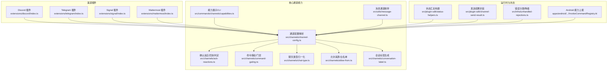
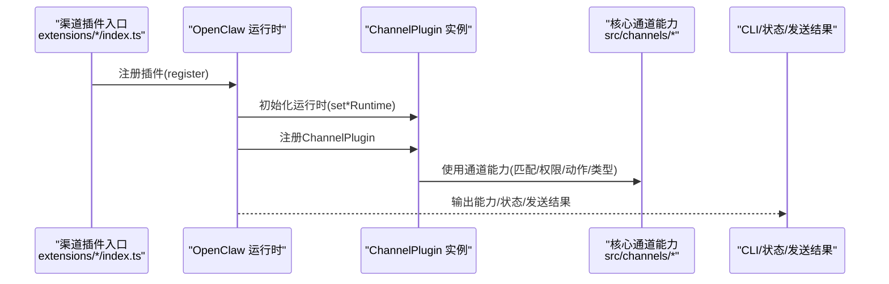
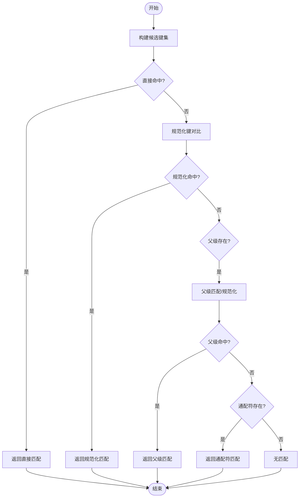
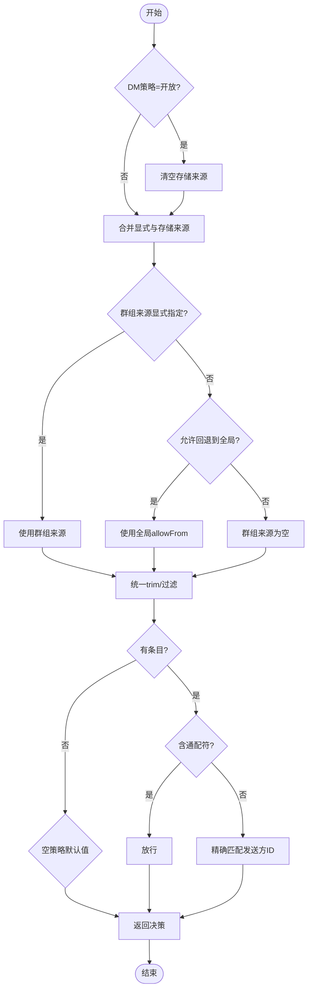
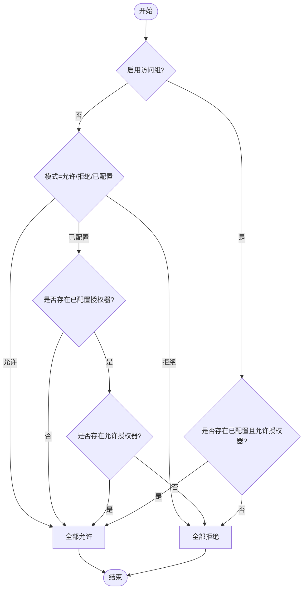
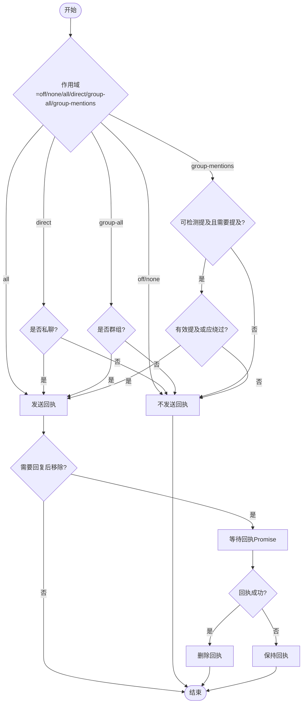
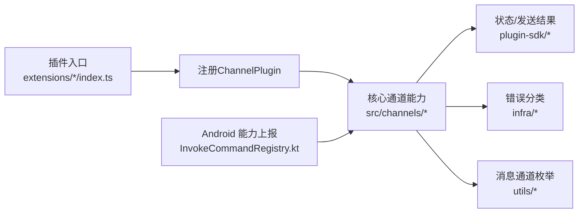

# 渠道特定功能

<cite>
**本文引用的文件**
- [extensions/discord/index.ts](file://extensions/discord/index.ts)
- [extensions/telegram/index.ts](file://extensions/telegram/index.ts)
- [extensions/signal/index.ts](file://extensions/signal/index.ts)
- [extensions/mattermost/index.ts](file://extensions/mattermost/index.ts)
- [src/channels/channel-config.ts](file://src/channels/channel-config.ts)
- [src/channels/ack-reactions.ts](file://src/channels/ack-reactions.ts)
- [src/channels/command-gating.ts](file://src/channels/command-gating.ts)
- [src/channels/chat-type.ts](file://src/channels/chat-type.ts)
- [src/channels/allow-from.ts](file://src/channels/allow-from.ts)
- [src/channels/conversation-label.ts](file://src/channels/conversation-label.ts)
- [src/commands/channels/capabilities.ts](file://src/commands/channels/capabilities.ts)
- [src/utils/message-channel.ts](file://src/utils/message-channel.ts)
- [src/plugin-sdk/status-helpers.ts](file://src/plugin-sdk/status-helpers.ts)
- [src/plugin-sdk/channel-send-result.ts](file://src/plugin-sdk/channel-send-result.ts)
- [src/infra/unhandled-rejections.ts](file://src/infra/unhandled-rejections.ts)
- [apps/android/app/src/main/java/ai/openclaw/app/node/InvokeCommandRegistry.kt](file://apps/android/app/src/main/java/ai/openclaw/app/node/InvokeCommandRegistry.kt)
</cite>

## 目录
1. [简介](#简介)
2. [项目结构](#项目结构)
3. [核心组件](#核心组件)
4. [架构总览](#架构总览)
5. [详细组件分析](#详细组件分析)
6. [依赖关系分析](#依赖关系分析)
7. [性能考量](#性能考量)
8. [故障排查指南](#故障排查指南)
9. [结论](#结论)
10. [附录](#附录)

## 简介
本文件面向OpenClaw的“渠道特定功能”，系统化梳理各渠道（Discord、Telegram、Signal、Mattermost等）在群组管理、用户权限、消息动作与特殊消息类型上的差异化实现；解释渠道能力检测、版本兼容与降级策略；给出渠道配置的参数校验、默认值与动态调整方法；并总结渠道间差异的处理方式（功能映射、格式转换、行为标准化），以及渠道特定的错误码与异常处理策略。文末提供实现示例与性能优化建议。

## 项目结构
OpenClaw通过插件化扩展接入多渠道，每个渠道以独立插件形式注册到OpenClaw运行时，并暴露统一的ChannelPlugin接口。核心逻辑位于src/channels目录，涵盖配置解析、权限控制、消息动作、聊天类型与会话标签等通用能力；平台侧（如Android）提供运行时能力上报与可用性过滤。

图示来源
- [extensions/discord/index.ts:1-20](file://extensions/discord/index.ts#L1-L20)
- [extensions/telegram/index.ts:1-18](file://extensions/telegram/index.ts#L1-L18)
- [extensions/signal/index.ts:1-18](file://extensions/signal/index.ts#L1-L18)
- [extensions/mattermost/index.ts:1-24](file://extensions/mattermost/index.ts#L1-L24)
- [src/channels/channel-config.ts:1-183](file://src/channels/channel-config.ts#L1-L183)
- [src/channels/ack-reactions.ts:1-104](file://src/channels/ack-reactions.ts#L1-L104)
- [src/channels/command-gating.ts:1-46](file://src/channels/command-gating.ts#L1-L46)
- [src/channels/chat-type.ts:1-19](file://src/channels/chat-type.ts#L1-L19)
- [src/channels/allow-from.ts:1-54](file://src/channels/allow-from.ts#L1-L54)
- [src/channels/conversation-label.ts:1-70](file://src/channels/conversation-label.ts#L1-L70)
- [src/commands/channels/capabilities.ts:76-118](file://src/commands/channels/capabilities.ts#L76-L118)
- [src/utils/message-channel.ts:95-133](file://src/utils/message-channel.ts#L95-L133)
- [src/plugin-sdk/status-helpers.ts:125-172](file://src/plugin-sdk/status-helpers.ts#L125-L172)
- [src/plugin-sdk/channel-send-result.ts:1-14](file://src/plugin-sdk/channel-send-result.ts#L1-L14)
- [src/infra/unhandled-rejections.ts:138-172](file://src/infra/unhandled-rejections.ts#L138-L172)
- [apps/android/app/src/main/java/ai/openclaw/app/node/InvokeCommandRegistry.kt:200-234](file://apps/android/app/src/main/java/ai/openclaw/app/node/InvokeCommandRegistry.kt#L200-L234)

章节来源
- [extensions/discord/index.ts:1-20](file://extensions/discord/index.ts#L1-L20)
- [extensions/telegram/index.ts:1-18](file://extensions/telegram/index.ts#L1-L18)
- [extensions/signal/index.ts:1-18](file://extensions/signal/index.ts#L1-L18)
- [extensions/mattermost/index.ts:1-24](file://extensions/mattermost/index.ts#L1-L24)
- [src/channels/channel-config.ts:1-183](file://src/channels/channel-config.ts#L1-L183)
- [src/channels/ack-reactions.ts:1-104](file://src/channels/ack-reactions.ts#L1-L104)
- [src/channels/command-gating.ts:1-46](file://src/channels/command-gating.ts#L1-L46)
- [src/channels/chat-type.ts:1-19](file://src/channels/chat-type.ts#L1-L19)
- [src/channels/allow-from.ts:1-54](file://src/channels/allow-from.ts#L1-L54)
- [src/channels/conversation-label.ts:1-70](file://src/channels/conversation-label.ts#L1-L70)
- [src/commands/channels/capabilities.ts:76-118](file://src/commands/channels/capabilities.ts#L76-L118)
- [src/utils/message-channel.ts:95-133](file://src/utils/message-channel.ts#L95-L133)
- [src/plugin-sdk/status-helpers.ts:125-172](file://src/plugin-sdk/status-helpers.ts#L125-L172)
- [src/plugin-sdk/channel-send-result.ts:1-14](file://src/plugin-sdk/channel-send-result.ts#L1-L14)
- [src/infra/unhandled-rejections.ts:138-172](file://src/infra/unhandled-rejections.ts#L138-L172)
- [apps/android/app/src/main/java/ai/openclaw/app/node/InvokeCommandRegistry.kt:200-234](file://apps/android/app/src/main/java/ai/openclaw/app/node/InvokeCommandRegistry.kt#L200-L234)

## 核心组件
- 通道匹配与键规范化：提供通道条目匹配、通配符与父级回退、键规范化与候选生成，支撑跨渠道一致的配置解析。
- 权限与来源控制：合并DM与群组允许来源，支持通配符与显式列表，提供发送方ID白名单判定。
- 命令授权与门禁：根据访问组开关与授权器集合，决定是否放行文本或控制命令。
- 消息动作与回执：按聊天类型与提及规则，判定是否发送确认反应/回执，并支持回复后清理。
- 聊天类型归一化：将多种输入归一为direct/group/channel，便于后续路由与行为选择。
- 会话标签生成：从上下文提取或拼接会话标识，适配不同渠道的ID特征。
- 能力检测与展示：CLI输出通道能力清单，覆盖聊天类型、编辑/撤回、回复、媒体、线程、原生命令等。
- 消息通道枚举：统一列出可投递与网关内部通道，辅助路由与别名解析。
- 运行时状态与发送结果：构建通道状态摘要、收集最后错误问题；封装发送结果为统一对象。
- 错误分类与降级：识别配置类与瞬态网络错误，避免对网关造成不必要的崩溃。

章节来源
- [src/channels/channel-config.ts:1-183](file://src/channels/channel-config.ts#L1-L183)
- [src/channels/allow-from.ts:1-54](file://src/channels/allow-from.ts#L1-L54)
- [src/channels/command-gating.ts:1-46](file://src/channels/command-gating.ts#L1-L46)
- [src/channels/ack-reactions.ts:1-104](file://src/channels/ack-reactions.ts#L1-L104)
- [src/channels/chat-type.ts:1-19](file://src/channels/chat-type.ts#L1-L19)
- [src/channels/conversation-label.ts:1-70](file://src/channels/conversation-label.ts#L1-L70)
- [src/commands/channels/capabilities.ts:76-118](file://src/commands/channels/capabilities.ts#L76-L118)
- [src/utils/message-channel.ts:95-133](file://src/utils/message-channel.ts#L95-L133)
- [src/plugin-sdk/status-helpers.ts:125-172](file://src/plugin-sdk/status-helpers.ts#L125-L172)
- [src/plugin-sdk/channel-send-result.ts:1-14](file://src/plugin-sdk/channel-send-result.ts#L1-L14)
- [src/infra/unhandled-rejections.ts:138-172](file://src/infra/unhandled-rejections.ts#L138-L172)

## 架构总览
下图展示了OpenClaw渠道插件如何注册到运行时，并与核心通道能力协作，最终驱动消息路由与行为执行。

图示来源
- [extensions/discord/index.ts:12-16](file://extensions/discord/index.ts#L12-L16)
- [extensions/telegram/index.ts:11-14](file://extensions/telegram/index.ts#L11-L14)
- [extensions/signal/index.ts:11-14](file://extensions/signal/index.ts#L11-L14)
- [extensions/mattermost/index.ts:12-20](file://extensions/mattermost/index.ts#L12-L20)
- [src/channels/channel-config.ts:24-32](file://src/channels/channel-config.ts#L24-L32)
- [src/channels/allow-from.ts:38-54](file://src/channels/allow-from.ts#L38-L54)
- [src/channels/ack-reactions.ts:16-43](file://src/channels/ack-reactions.ts#L16-L43)
- [src/plugin-sdk/status-helpers.ts:125-152](file://src/plugin-sdk/status-helpers.ts#L125-L152)
- [src/plugin-sdk/channel-send-result.ts:7-14](file://src/plugin-sdk/channel-send-result.ts#L7-L14)

## 详细组件分析

### 组件A：通道配置与匹配
- 功能要点
  - 支持直接匹配、父级回退、通配符回退与键规范化。
  - 提供匹配元数据应用与结果解析，便于上层记录命中来源与键。
  - 用于构建通道键候选集，提升配置查找效率。
- 关键流程
  - 输入多个候选键，优先命中直接匹配；否则尝试规范化后的键；再回退到父级或通配符。
  - 返回命中的条目、键与来源，便于后续决策。
- 复杂度
  - 匹配过程涉及多次遍历与集合操作，整体复杂度与键数量线性相关。
- 优化建议
  - 对常用键建立索引；减少重复规范化开销；在父级回退前先检查通配符命中。

图示来源
- [src/channels/channel-config.ts:60-164](file://src/channels/channel-config.ts#L60-L164)

章节来源
- [src/channels/channel-config.ts:1-183](file://src/channels/channel-config.ts#L1-L183)

### 组件B：用户权限与来源控制
- 功能要点
  - 合并DM与群组允许来源，支持策略（开放/白名单）切换。
  - 判定发送方ID是否在允许列表中，支持通配符与空策略默认值。
- 关键流程
  - DM策略为开放时清空存储来源；否则合并显式与存储来源。
  - 群组来源可显式指定，或回退到全局allowFrom；最终统一trim与去重。
  - 最终判定：若无条目则按策略返回；若有通配符直接放行；否则精确匹配。

图示来源
- [src/channels/allow-from.ts:1-54](file://src/channels/allow-from.ts#L1-L54)

章节来源
- [src/channels/allow-from.ts:1-54](file://src/channels/allow-from.ts#L1-L54)

### 组件C：命令授权与门禁
- 功能要点
  - 基于访问组开关与多个授权器，决定命令是否被授权。
  - 控制命令门禁：当开启文本命令且存在控制命令但未授权时，应阻断。
- 关键流程
  - 若未启用访问组，则按“允许/拒绝/已配置”模式决定；若已配置则需至少一个允许。
  - 启用访问组时，需至少一个已配置且允许的授权器。

图示来源
- [src/channels/command-gating.ts:8-29](file://src/channels/command-gating.ts#L8-L29)

章节来源
- [src/channels/command-gating.ts:1-46](file://src/channels/command-gating.ts#L1-L46)

### 组件D：消息动作与确认反应
- 功能要点
  - 支持多种作用域（全部/私聊/群组全量/仅提及/关闭/不处理）。
  - 针对WhatsApp提供专用模式（总是/仅提及/从不），并结合提及检测与激活状态。
  - 支持回复后自动移除确认反应。
- 关键流程
  - 根据scope与聊天类型判定是否需要回执。
  - 对WhatsApp，依据直聊/群聊与模式决定是否回执；提及检测失败时拒绝。
  - 回复后异步等待回执Promise，成功则删除回执消息。

图示来源
- [src/channels/ack-reactions.ts:16-43](file://src/channels/ack-reactions.ts#L16-L43)
- [src/channels/ack-reactions.ts:53-79](file://src/channels/ack-reactions.ts#L53-L79)
- [src/channels/ack-reactions.ts:87-103](file://src/channels/ack-reactions.ts#L87-L103)

章节来源
- [src/channels/ack-reactions.ts:1-104](file://src/channels/ack-reactions.ts#L1-L104)

### 组件E：聊天类型归一化
- 功能要点
  - 将输入归一为direct/group/channel，支持别名（如dm）。
- 应用场景
  - 与消息动作、会话标签、路由策略协同，确保跨渠道一致性。

章节来源
- [src/channels/chat-type.ts:1-19](file://src/channels/chat-type.ts#L1-L19)

### 组件F：会话标签生成
- 功能要点
  - 优先使用显式会话标签或线程标签；私聊使用发送者名称；群组使用频道/主题/空间等。
  - 针对特定渠道ID特征（纯数字、带@g.us）进行追加处理，避免歧义。
- 复杂度
  - 字符串处理与正则匹配，总体线性。

章节来源
- [src/channels/conversation-label.ts:1-70](file://src/channels/conversation-label.ts#L1-L70)

### 组件G：渠道能力检测与展示
- 功能要点
  - CLI输出通道能力清单，包括聊天类型、投票、反应、编辑/撤回、回复、特效、群组管理、线程、媒体、原生命令、阻断流式等。
- 使用建议
  - 在部署前通过CLI核对各渠道能力，指导配置与行为选择。

章节来源
- [src/commands/channels/capabilities.ts:76-118](file://src/commands/channels/capabilities.ts#L76-L118)

### 组件H：消息通道枚举与路由
- 功能要点
  - 统计可投递通道与网关内部通道，提供通道值与别名解析。
- 应用场景
  - 作为路由与别名解析的基础，避免非法通道值进入处理链。

章节来源
- [src/utils/message-channel.ts:95-133](file://src/utils/message-channel.ts#L95-L133)

### 组件I：运行时状态与发送结果
- 功能要点
  - 构建通道状态摘要（含令牌来源、探测信息、模式等），并收集最后错误问题。
  - 将底层发送结果封装为统一对象，包含通道名、成功标志、消息ID与错误对象。
- 应用场景
  - 仪表盘与诊断工具展示通道健康状况；错误对象便于上层统一处理。

章节来源
- [src/plugin-sdk/status-helpers.ts:125-172](file://src/plugin-sdk/status-helpers.ts#L125-L172)
- [src/plugin-sdk/channel-send-result.ts:1-14](file://src/plugin-sdk/channel-send-result.ts#L1-L14)

### 组件J：错误分类与降级策略
- 功能要点
  - 识别配置类错误与瞬态网络错误，避免对网关造成不必要的崩溃。
  - 通过错误码/名称收集与匹配，判断是否应降级处理。
- 应用场景
  - 在通道监控与重启策略中，区分临时故障与永久配置错误。

章节来源
- [src/infra/unhandled-rejections.ts:138-172](file://src/infra/unhandled-rejections.ts#L138-L172)

### 组件K：Android端能力上报与可用性过滤
- 功能要点
  - 根据运行时标志（相机/位置/短信/语音唤醒/运动传感器等）动态上报通道能力与命令可用性。
- 应用场景
  - 在设备能力受限时，自动降级或隐藏不支持的功能，提升用户体验。

章节来源
- [apps/android/app/src/main/java/ai/openclaw/app/node/InvokeCommandRegistry.kt:204-234](file://apps/android/app/src/main/java/ai/openclaw/app/node/InvokeCommandRegistry.kt#L204-L234)

## 依赖关系分析
- 插件注册依赖：各渠道插件通过OpenClaw插件SDK注册，设置运行时并注册ChannelPlugin。
- 能力耦合：通道配置、权限控制、消息动作、聊天类型与会话标签共同构成消息处理的前置条件。
- 平台耦合：Android侧运行时能力影响通道能力与命令可用性，形成“能力上报—配置—行为”的闭环。

图示来源
- [extensions/discord/index.ts:12-16](file://extensions/discord/index.ts#L12-L16)
- [extensions/telegram/index.ts:11-14](file://extensions/telegram/index.ts#L11-L14)
- [extensions/signal/index.ts:11-14](file://extensions/signal/index.ts#L11-L14)
- [extensions/mattermost/index.ts:12-20](file://extensions/mattermost/index.ts#L12-L20)
- [src/channels/channel-config.ts:24-32](file://src/channels/channel-config.ts#L24-L32)
- [src/plugin-sdk/status-helpers.ts:125-152](file://src/plugin-sdk/status-helpers.ts#L125-L152)
- [src/plugin-sdk/channel-send-result.ts:7-14](file://src/plugin-sdk/channel-send-result.ts#L7-L14)
- [src/infra/unhandled-rejections.ts:138-172](file://src/infra/unhandled-rejections.ts#L138-L172)
- [apps/android/app/src/main/java/ai/openclaw/app/node/InvokeCommandRegistry.kt:204-234](file://apps/android/app/src/main/java/ai/openclaw/app/node/InvokeCommandRegistry.kt#L204-L234)

章节来源
- [extensions/discord/index.ts:1-20](file://extensions/discord/index.ts#L1-L20)
- [extensions/telegram/index.ts:1-18](file://extensions/telegram/index.ts#L1-L18)
- [extensions/signal/index.ts:1-18](file://extensions/signal/index.ts#L1-L18)
- [extensions/mattermost/index.ts:1-24](file://extensions/mattermost/index.ts#L1-L24)
- [src/channels/channel-config.ts:1-183](file://src/channels/channel-config.ts#L1-L183)
- [src/plugin-sdk/status-helpers.ts:125-172](file://src/plugin-sdk/status-helpers.ts#L125-L172)
- [src/plugin-sdk/channel-send-result.ts:1-14](file://src/plugin-sdk/channel-send-result.ts#L1-L14)
- [src/infra/unhandled-rejections.ts:138-172](file://src/infra/unhandled-rejections.ts#L138-L172)
- [apps/android/app/src/main/java/ai/openclaw/app/node/InvokeCommandRegistry.kt:200-234](file://apps/android/app/src/main/java/ai/openclaw/app/node/InvokeCommandRegistry.kt#L200-L234)

## 性能考量
- 通道匹配与键规范化：对常用键建立索引，减少规范化与遍历次数。
- 权限判定：允许来源列表应尽量短小，必要时引入通配符以降低维护成本。
- 命令门禁：授权器集合不宜过大，可通过分层授权减少计算。
- 消息动作：回执Promise异步处理，避免阻塞主流程；批量回执时考虑并发上限。
- 状态与发送结果：统一封装可减少分支判断，提高可观测性与可维护性。
- Android能力上报：按需触发能力更新，避免频繁扫描设备能力。

## 故障排查指南
- 配置类错误
  - 识别配置错误码，避免误判为瞬态网络错误；在诊断工具中单独标注。
- 瞬态网络错误
  - 对网络超时、连接中断等进行降级处理，避免网关崩溃；记录错误码与名称以便追踪。
- 发送结果异常
  - 使用统一的发送结果封装，将字符串错误转为Error对象，便于上层捕获与恢复。
- 状态问题
  - 收集最后错误并生成问题报告，定位具体账户与通道；检查探测时间戳与模式字段。

章节来源
- [src/infra/unhandled-rejections.ts:138-172](file://src/infra/unhandled-rejections.ts#L138-L172)
- [src/plugin-sdk/channel-send-result.ts:7-14](file://src/plugin-sdk/channel-send-result.ts#L7-L14)
- [src/plugin-sdk/status-helpers.ts:154-172](file://src/plugin-sdk/status-helpers.ts#L154-L172)

## 结论
OpenClaw通过插件化架构与统一的核心通道能力，实现了对多渠道的灵活适配。通道配置、权限控制、消息动作、聊天类型与会话标签构成了跨渠道一致的行为基线；能力检测与状态封装提升了可观测性；错误分类与降级策略保障了稳定性。建议在实际部署中结合CLI能力输出与平台能力上报，动态调整配置与行为，确保最佳体验与性能。

## 附录
- 渠道特定实现示例（路径）
  - Discord插件注册与运行时设置：[extensions/discord/index.ts:12-16](file://extensions/discord/index.ts#L12-L16)
  - Telegram插件注册与运行时设置：[extensions/telegram/index.ts:11-14](file://extensions/telegram/index.ts#L11-L14)
  - Signal插件注册与运行时设置：[extensions/signal/index.ts:11-14](file://extensions/signal/index.ts#L11-L14)
  - Mattermost插件注册与斜杠命令回调路由：[extensions/mattermost/index.ts:12-20](file://extensions/mattermost/index.ts#L12-L20)
- 渠道配置与匹配（路径）
  - 通道条目匹配与回退策略：[src/channels/channel-config.ts:60-164](file://src/channels/channel-config.ts#L60-L164)
  - 允许来源合并与判定：[src/channels/allow-from.ts:1-54](file://src/channels/allow-from.ts#L1-L54)
  - 命令授权与门禁：[src/channels/command-gating.ts:8-45](file://src/channels/command-gating.ts#L8-L45)
  - 确认反应/回执判定与清理：[src/channels/ack-reactions.ts:16-103](file://src/channels/ack-reactions.ts#L16-L103)
  - 聊天类型归一化：[src/channels/chat-type.ts:3-18](file://src/channels/chat-type.ts#L3-L18)
  - 会话标签生成：[src/channels/conversation-label.ts:23-69](file://src/channels/conversation-label.ts#L23-L69)
  - 能力展示CLI：[src/commands/channels/capabilities.ts:76-118](file://src/commands/channels/capabilities.ts#L76-L118)
  - 消息通道枚举：[src/utils/message-channel.ts:95-133](file://src/utils/message-channel.ts#L95-L133)
  - 状态汇总与最后错误收集：[src/plugin-sdk/status-helpers.ts:125-172](file://src/plugin-sdk/status-helpers.ts#L125-L172)
  - 发送结果封装：[src/plugin-sdk/channel-send-result.ts:7-14](file://src/plugin-sdk/channel-send-result.ts#L7-L14)
  - 错误分类与降级：[src/infra/unhandled-rejections.ts:138-172](file://src/infra/unhandled-rejections.ts#L138-L172)
  - Android能力上报与命令可用性过滤：[apps/android/app/src/main/java/ai/openclaw/app/node/InvokeCommandRegistry.kt:204-234](file://apps/android/app/src/main/java/ai/openclaw/app/node/InvokeCommandRegistry.kt#L204-L234)