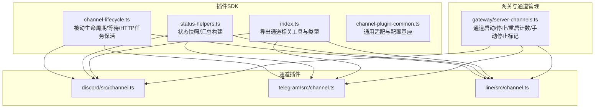
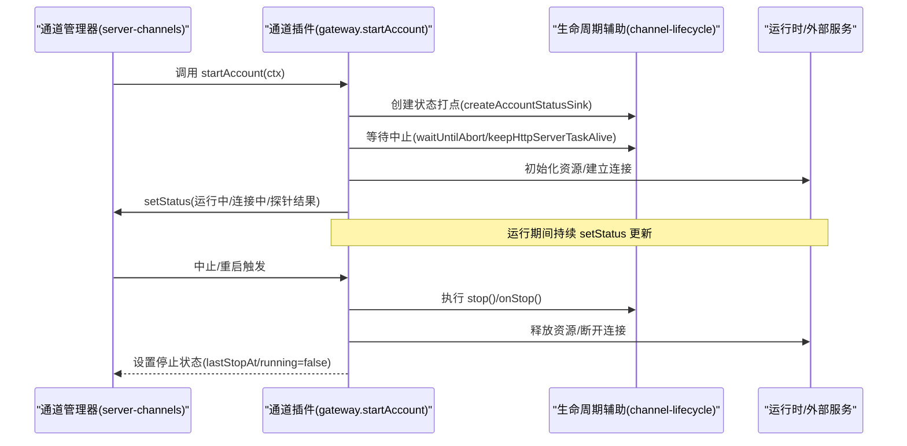
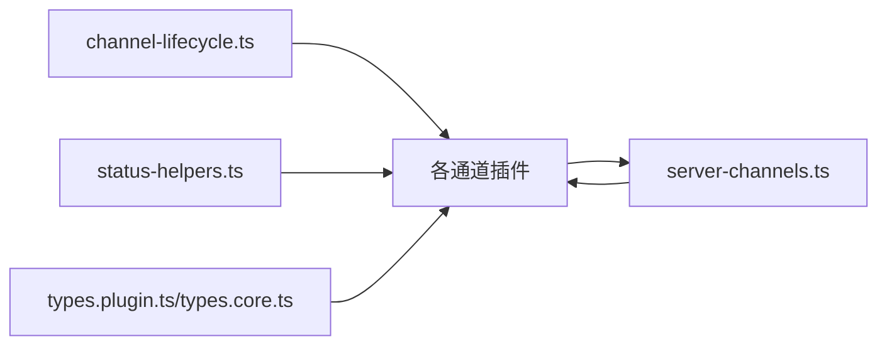

# 生命周期方法

<cite>
**本文引用的文件**
- [src/plugin-sdk/channel-lifecycle.ts](file://src/plugin-sdk/channel-lifecycle.ts)
- [src/plugin-sdk/index.ts](file://src/plugin-sdk/index.ts)
- [src/plugin-sdk/status-helpers.ts](file://src/plugin-sdk/status-helpers.ts)
- [src/plugin-sdk/channel-plugin-common.ts](file://src/plugin-sdk/channel-plugin-common.ts)
- [src/channels/plugins/types.plugin.ts](file://src/channels/plugins/types.plugin.ts)
- [src/channels/plugins/types.core.ts](file://src/channels/plugins/types.core.ts)
- [src/gateway/server-channels.ts](file://src/gateway/server-channels.ts)
- [extensions/discord/src/channel.ts](file://extensions/discord/src/channel.ts)
- [extensions/telegram/src/channel.ts](file://extensions/telegram/src/channel.ts)
- [extensions/line/src/channel.ts](file://extensions/line/src/channel.ts)
- [src/gateway/server-close.ts](file://src/gateway/server-close.ts)
- [src/plugin-sdk/channel-lifecycle.test.ts](file://src/plugin-sdk/channel-lifecycle.test.ts)
</cite>

## 目录
1. [简介](#简介)
2. [项目结构](#项目结构)
3. [核心组件](#核心组件)
4. [架构总览](#架构总览)
5. [详细组件分析](#详细组件分析)
6. [依赖关系分析](#依赖关系分析)
7. [性能考量](#性能考量)
8. [故障排查指南](#故障排查指南)
9. [结论](#结论)
10. [附录](#附录)

## 简介
本文件面向 OpenClaw 渠道插件的生命周期方法，系统化梳理 initialize() 初始化与 shutdown() 关闭流程，覆盖配置变更回调（热重载）、参数验证与状态恢复、错误恢复策略（异常捕获、状态回滚、自愈机制）、性能监控与诊断能力，并总结最佳实践与常见陷阱。目标是帮助插件作者在不破坏宿主稳定性的情况下，正确实现渠道生命周期管理。

## 项目结构
围绕渠道生命周期的关键模块分布如下：
- 插件 SDK：提供生命周期辅助函数、状态构建器、类型定义与导出入口
- 渠道插件示例：Discord、Telegram、LINE 等具体实现
- 网关与通道管理：负责启动/停止通道、账户级生命周期编排
- 诊断与关闭：提供诊断事件、心跳与服务端优雅关闭流程

图表来源
- [src/plugin-sdk/channel-lifecycle.ts:1-108](file://src/plugin-sdk/channel-lifecycle.ts#L1-L108)
- [src/plugin-sdk/status-helpers.ts:1-173](file://src/plugin-sdk/status-helpers.ts#L1-L173)
- [src/plugin-sdk/index.ts:1-826](file://src/plugin-sdk/index.ts#L1-L826)
- [src/plugin-sdk/channel-plugin-common.ts:1-22](file://src/plugin-sdk/channel-plugin-common.ts#L1-L22)
- [extensions/discord/src/channel.ts:1-463](file://extensions/discord/src/channel.ts#L1-L463)
- [extensions/telegram/src/channel.ts:1-587](file://extensions/telegram/src/channel.ts#L1-L587)
- [extensions/line/src/channel.ts:1-746](file://extensions/line/src/channel.ts#L1-L746)
- [src/gateway/server-channels.ts:95-457](file://src/gateway/server-channels.ts#L95-L457)

章节来源
- [src/plugin-sdk/channel-lifecycle.ts:1-108](file://src/plugin-sdk/channel-lifecycle.ts#L1-L108)
- [src/plugin-sdk/status-helpers.ts:1-173](file://src/plugin-sdk/status-helpers.ts#L1-L173)
- [src/plugin-sdk/index.ts:1-826](file://src/plugin-sdk/index.ts#L1-L826)
- [src/plugin-sdk/channel-plugin-common.ts:1-22](file://src/plugin-sdk/channel-plugin-common.ts#L1-L22)
- [extensions/discord/src/channel.ts:1-463](file://extensions/discord/src/channel.ts#L1-L463)
- [extensions/telegram/src/channel.ts:1-587](file://extensions/telegram/src/channel.ts#L1-L587)
- [extensions/line/src/channel.ts:1-746](file://extensions/line/src/channel.ts#L1-L746)
- [src/gateway/server-channels.ts:95-457](file://src/gateway/server-channels.ts#L95-L457)

## 核心组件
- 生命周期辅助函数
  - 账户状态打点封装：将 accountId 绑定到状态补丁，便于统一上报
  - 等待中止信号：在可选的 AbortSignal 下等待，支持 onAbort 钩子
  - 被动账户生命周期：start 启动后等待中止，再执行 stop/onStop 清理
  - HTTP 服务器任务保活：监听 close 事件并确保 onAbort 触发后再退出
- 状态构建器
  - 默认运行态、基础汇总、探针汇总、计算式账户快照、令牌型汇总、从 lastError 收集问题
- 类型与契约
  - ChannelPlugin 定义了 gateway.startAccount、gateway.stopAccount、status 等关键钩子
  - ChannelAccountSnapshot 描述账户运行期状态字段集合
- 通道管理器
  - 统一启动/停止通道，维护重启尝试次数、手动停止标记、运行任务与中止控制器
  - 提供运行时快照、登录态标记、重启尝试重置等能力

章节来源
- [src/plugin-sdk/channel-lifecycle.ts:1-108](file://src/plugin-sdk/channel-lifecycle.ts#L1-L108)
- [src/plugin-sdk/status-helpers.ts:1-173](file://src/plugin-sdk/status-helpers.ts#L1-L173)
- [src/channels/plugins/types.plugin.ts:49-85](file://src/channels/plugins/types.plugin.ts#L49-L85)
- [src/channels/plugins/types.core.ts:97-159](file://src/channels/plugins/types.core.ts#L97-L159)
- [src/gateway/server-channels.ts:111-457](file://src/gateway/server-channels.ts#L111-L457)

## 架构总览
OpenClaw 的通道生命周期由“网关通道管理器”驱动，插件通过 ChannelPlugin 的 gateway.startAccount 暴露初始化逻辑；当需要停止或重启时，管理器调用 stopAccount 或直接中止 AbortController。生命周期辅助函数贯穿于 startAccount 实现中，保证资源分配、状态设置与清理的一致性。

图表来源
- [src/gateway/server-channels.ts:307-366](file://src/gateway/server-channels.ts#L307-L366)
- [src/plugin-sdk/channel-lifecycle.ts:29-62](file://src/plugin-sdk/channel-lifecycle.ts#L29-L62)
- [extensions/discord/src/channel.ts:416-461](file://extensions/discord/src/channel.ts#L416-L461)
- [extensions/telegram/src/channel.ts:485-532](file://extensions/telegram/src/channel.ts#L485-L532)
- [extensions/line/src/channel.ts:587-629](file://extensions/line/src/channel.ts#L587-L629)

## 详细组件分析

### initialize() 方法实现要求
- 入口与上下文
  - 通过 ChannelPlugin.gateway.startAccount 接收上下文 ctx，包含 cfg、account、runtime、abortSignal、setStatus、log、getStatus 等
  - 建议使用 createAccountStatusSink 将 accountId 绑定到状态打点，确保 setStatus 的补丁包含 accountId
- 初始化参数与资源分配
  - 参数校验：如 Discord 的 token、Telegram 的 token/webhook、LINE 的 token/secret 等
  - 资源分配：建立对外连接（如 WebSocket/HTTP）、初始化运行时句柄、注册事件监听
  - 状态设置：在启动前/后及时 setStatus，记录 lastStartAt、running=true、connected 等
- 外部服务探测与日志
  - 可选地进行探针（probe）以确认凭证有效性与能力范围，并根据结果输出提示或警告
- 保活与中止
  - 使用 waitUntilAbort 或 keepHttpServerTaskAlive 保持任务存活，直至收到 AbortSignal
  - 在 finally/清理阶段调用 stop()/onStop，确保资源回收

示例参考路径
- [extensions/discord/src/channel.ts:416-461](file://extensions/discord/src/channel.ts#L416-L461)
- [extensions/telegram/src/channel.ts:485-532](file://extensions/telegram/src/channel.ts#L485-L532)
- [extensions/line/src/channel.ts:587-629](file://extensions/line/src/channel.ts#L587-L629)
- [src/plugin-sdk/channel-lifecycle.ts:14-62](file://src/plugin-sdk/channel-lifecycle.ts#L14-L62)

章节来源
- [src/plugin-sdk/channel-lifecycle.ts:14-62](file://src/plugin-sdk/channel-lifecycle.ts#L14-L62)
- [src/channels/plugins/types.plugin.ts:49-85](file://src/channels/plugins/types.plugin.ts#L49-L85)
- [extensions/discord/src/channel.ts:416-461](file://extensions/discord/src/channel.ts#L416-L461)
- [extensions/telegram/src/channel.ts:485-532](file://extensions/telegram/src/channel.ts#L485-L532)
- [extensions/line/src/channel.ts:587-629](file://extensions/line/src/channel.ts#L587-L629)

### shutdown() 方法清理流程
- 停止顺序
  - 若存在显式的 stopAccount 钩子，先调用以执行插件特定清理
  - 等待当前任务完成（Promise.all），忽略异常，确保不会阻塞关闭
  - 删除 abort 控制器与任务映射，设置运行状态为停止（running=false、lastStopAt）
- 状态回写
  - setStatus 写入停止时间与运行态
  - 对于登录态变化，可通过 markChannelLoggedOut 标记 logged out 并更新 lastError
- 网关层协作
  - 通道管理器在 stopChannel 时会合并已知账户 ID，逐个执行上述流程
  - 对于无显式 stopAccount 且无任务/中止器的情况，采用快速路径直接返回

示例参考路径
- [src/gateway/server-channels.ts:311-366](file://src/gateway/server-channels.ts#L311-L366)
- [extensions/telegram/src/channel.ts:533-584](file://extensions/telegram/src/channel.ts#L533-L584)
- [extensions/line/src/channel.ts:630-694](file://extensions/line/src/channel.ts#L630-L694)

章节来源
- [src/gateway/server-channels.ts:311-366](file://src/gateway/server-channels.ts#L311-L366)
- [extensions/telegram/src/channel.ts:533-584](file://extensions/telegram/src/channel.ts#L533-L584)
- [extensions/line/src/channel.ts:630-694](file://extensions/line/src/channel.ts#L630-L694)

### 配置变更回调与热重载
- 热重载触发
  - 插件通过 reload 字段声明配置前缀（如 channels.discord、channels.telegram、channels.line），用于识别需热重载的配置段
  - 网关通道管理器在停止通道时，若检测到账户任务/中止器为空且无 stopAccount，则快速路径返回；否则按常规流程清理并重新启动
- 参数验证与状态恢复
  - 插件在 status.buildAccountSnapshot 中综合运行态、探针与审计结果，生成最终快照
  - 当配置无效或凭证缺失时，lastError 记录原因，collectStatusIssuesFromLastError 可将 lastError 转换为诊断问题
- 生命周期一致性
  - 使用 createAccountStatusSink 统一打点，避免遗漏 accountId
  - 在 startAccount 开始阶段即 setStatus，结束阶段再更新停止状态，确保状态机连续

示例参考路径
- [extensions/discord/src/channel.ts:101-114](file://extensions/discord/src/channel.ts#L101-L114)
- [extensions/telegram/src/channel.ts:153-186](file://extensions/telegram/src/channel.ts#L153-L186)
- [extensions/line/src/channel.ts:132-161](file://extensions/line/src/channel.ts#L132-L161)
- [src/plugin-sdk/status-helpers.ts:154-172](file://src/plugin-sdk/status-helpers.ts#L154-L172)
- [src/gateway/server-channels.ts:311-366](file://src/gateway/server-channels.ts#L311-L366)

章节来源
- [extensions/discord/src/channel.ts:101-114](file://extensions/discord/src/channel.ts#L101-L114)
- [extensions/telegram/src/channel.ts:153-186](file://extensions/telegram/src/channel.ts#L153-L186)
- [extensions/line/src/channel.ts:132-161](file://extensions/line/src/channel.ts#L132-L161)
- [src/plugin-sdk/status-helpers.ts:154-172](file://src/plugin-sdk/status-helpers.ts#L154-L172)
- [src/gateway/server-channels.ts:311-366](file://src/gateway/server-channels.ts#L311-L366)

### 错误恢复策略
- 异常捕获与状态回滚
  - startAccount 中对探针/初始化失败进行 try/catch，必要时仅记录调试信息而不中断流程
  - 通过 setStatus 记录 lastError，结合 collectStatusIssuesFromLastError 输出诊断
- 自愈机制
  - 通道管理器维护 restartAttempts，成功启动后重置；手动停止标记 manuallyStopped 防止自动重启
  - 对于 HTTP 服务器保活，onAbort 触发后等待 close 事件，确保资源有序释放
- 诊断与可观测性
  - 使用 createAccountStatusSink 统一状态打点，便于上层聚合
  - 通道插件 status.buildAccountSnapshot 可附加审计与探针结果，辅助定位问题

示例参考路径
- [extensions/discord/src/channel.ts:416-461](file://extensions/discord/src/channel.ts#L416-L461)
- [extensions/telegram/src/channel.ts:485-532](file://extensions/telegram/src/channel.ts#L485-L532)
- [extensions/line/src/channel.ts:587-629](file://extensions/line/src/channel.ts#L587-L629)
- [src/plugin-sdk/channel-lifecycle.ts:70-107](file://src/plugin-sdk/channel-lifecycle.ts#L70-L107)
- [src/gateway/server-channels.ts:115-118](file://src/gateway/server-channels.ts#L115-L118)

章节来源
- [extensions/discord/src/channel.ts:416-461](file://extensions/discord/src/channel.ts#L416-L461)
- [extensions/telegram/src/channel.ts:485-532](file://extensions/telegram/src/channel.ts#L485-L532)
- [extensions/line/src/channel.ts:587-629](file://extensions/line/src/channel.ts#L587-L629)
- [src/plugin-sdk/channel-lifecycle.ts:70-107](file://src/plugin-sdk/channel-lifecycle.ts#L70-L107)
- [src/gateway/server-channels.ts:115-118](file://src/gateway/server-channels.ts#L115-L118)

### 性能监控与诊断
- 状态快照与汇总
  - 使用 createDefaultChannelRuntimeState、buildBaseChannelStatusSummary、buildTokenChannelStatusSummary 等构建一致的状态视图
  - 在运行期间定期 setStatus，记录 lastInboundAt/lastOutboundAt 等指标，便于追踪活跃度
- 诊断事件
  - 插件 SDK 导出诊断事件工具，可用于上报心跳、消息入队/出队、运行尝试等事件
- 通道审计
  - 通道插件 status.auditAccount 可对权限/成员关系进行审计，辅助发现配置问题

示例参考路径
- [src/plugin-sdk/status-helpers.ts:12-152](file://src/plugin-sdk/status-helpers.ts#L12-L152)
- [src/plugin-sdk/index.ts:622-642](file://src/plugin-sdk/index.ts#L622-L642)
- [extensions/discord/src/channel.ts:389-414](file://extensions/discord/src/channel.ts#L389-L414)
- [extensions/telegram/src/channel.ts:414-483](file://extensions/telegram/src/channel.ts#L414-L483)
- [extensions/line/src/channel.ts:566-585](file://extensions/line/src/channel.ts#L566-L585)

章节来源
- [src/plugin-sdk/status-helpers.ts:12-152](file://src/plugin-sdk/status-helpers.ts#L12-L152)
- [src/plugin-sdk/index.ts:622-642](file://src/plugin-sdk/index.ts#L622-L642)
- [extensions/discord/src/channel.ts:389-414](file://extensions/discord/src/channel.ts#L389-L414)
- [extensions/telegram/src/channel.ts:414-483](file://extensions/telegram/src/channel.ts#L414-L483)
- [extensions/line/src/channel.ts:566-585](file://extensions/line/src/channel.ts#L566-L585)

## 依赖关系分析
- 低耦合高内聚
  - 生命周期辅助函数独立于具体通道，通过 ctx 与 setStatus 解耦
  - 通道插件仅暴露 startAccount/stopAccount 等最小接口，其余细节封装在运行时
- 直接依赖
  - 通道插件依赖 SDK 的生命周期辅助与状态构建器
  - 通道管理器依赖插件的 gateway 钩子与配置解析
- 间接依赖
  - 诊断事件与心跳等能力经 SDK 导出，供通道插件使用

图表来源
- [src/plugin-sdk/channel-lifecycle.ts:1-108](file://src/plugin-sdk/channel-lifecycle.ts#L1-L108)
- [src/plugin-sdk/status-helpers.ts:1-173](file://src/plugin-sdk/status-helpers.ts#L1-L173)
- [src/channels/plugins/types.plugin.ts:49-85](file://src/channels/plugins/types.plugin.ts#L49-L85)
- [src/channels/plugins/types.core.ts:97-159](file://src/channels/plugins/types.core.ts#L97-L159)
- [src/gateway/server-channels.ts:95-457](file://src/gateway/server-channels.ts#L95-L457)

章节来源
- [src/plugin-sdk/channel-lifecycle.ts:1-108](file://src/plugin-sdk/channel-lifecycle.ts#L1-L108)
- [src/plugin-sdk/status-helpers.ts:1-173](file://src/plugin-sdk/status-helpers.ts#L1-L173)
- [src/channels/plugins/types.plugin.ts:49-85](file://src/channels/plugins/types.plugin.ts#L49-L85)
- [src/channels/plugins/types.core.ts:97-159](file://src/channels/plugins/types.core.ts#L97-L159)
- [src/gateway/server-channels.ts:95-457](file://src/gateway/server-channels.ts#L95-L457)

## 性能考量
- 资源分配与释放
  - 将昂贵资源（连接池、定时器、文件句柄）纳入 stop/onStop 清理流程，避免泄漏
- 等待与保活
  - 使用 waitUntilAbort/keepHttpServerTaskAlive 替代轮询，降低 CPU 占用
- 状态更新频率
  - setStatus 应在关键节点（启动、停止、连接状态变化）进行，避免高频抖动
- 诊断与可观测性
  - 利用诊断事件与状态快照，结合 lastInboundAt/lastOutboundAt 等指标评估吞吐与延迟

## 故障排查指南
- 常见症状与定位
  - 启动失败：检查 startAccount 中的参数校验与探针结果，关注 setStatus 的 lastError
  - 无法停止：确认是否实现了 stopAccount 并正确处理 abortSignal
  - 重复令牌：Telegram 示例中对共享 token 的账户进行告警与阻止
- 诊断工具
  - 使用 collectStatusIssuesFromLastError 将 lastError 转换为诊断问题
  - 通道插件 status.auditAccount 可辅助发现权限/成员关系问题
- 优雅关闭
  - 网关关闭时会清理定时器、广播 shutdown、关闭 HTTP 服务器，确保进程平滑退出

示例参考路径
- [src/plugin-sdk/status-helpers.ts:154-172](file://src/plugin-sdk/status-helpers.ts#L154-L172)
- [extensions/telegram/src/channel.ts:485-532](file://extensions/telegram/src/channel.ts#L485-L532)
- [src/gateway/server-close.ts:81-138](file://src/gateway/server-close.ts#L81-L138)

章节来源
- [src/plugin-sdk/status-helpers.ts:154-172](file://src/plugin-sdk/status-helpers.ts#L154-L172)
- [extensions/telegram/src/channel.ts:485-532](file://extensions/telegram/src/channel.ts#L485-L532)
- [src/gateway/server-close.ts:81-138](file://src/gateway/server-close.ts#L81-L138)

## 结论
通过生命周期辅助函数与统一的状态模型，OpenClaw 为通道插件提供了清晰的初始化与关闭边界。遵循本文建议，可在保证健壮性的前提下实现热重载、参数验证、状态恢复与自愈机制，并借助诊断事件与状态快照提升可观测性与运维效率。

## 附录
- 最佳实践
  - 明确 startAccount 的职责边界：只做初始化与保活，不在其中处理业务消息
  - 使用 createAccountStatusSink 统一打点，避免遗漏 accountId
  - 在 finally 中执行 stop/onStop，确保资源回收
  - 将耗时操作放入异步任务，避免阻塞启动流程
- 常见陷阱
  - 忽略 AbortSignal 导致无法优雅停止
  - 未设置 lastStopAt/running=false，导致状态不一致
  - 在 setStatus 中遗漏关键字段（如 connected、lastError），影响诊断
  - 未处理重复令牌或多账户共享凭证场景