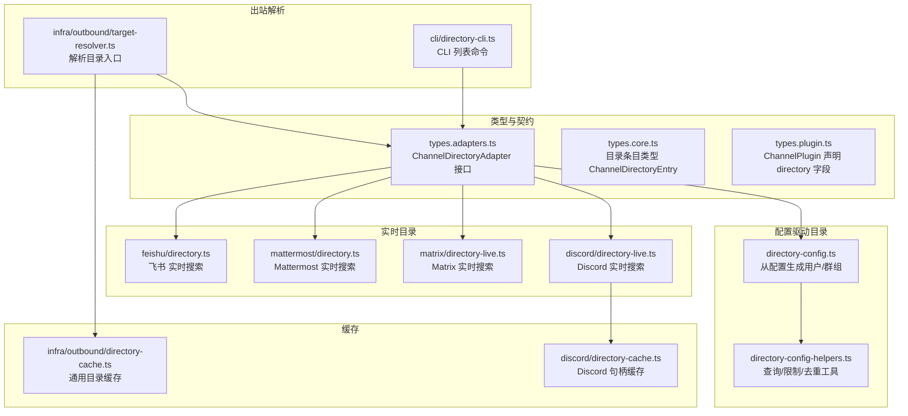
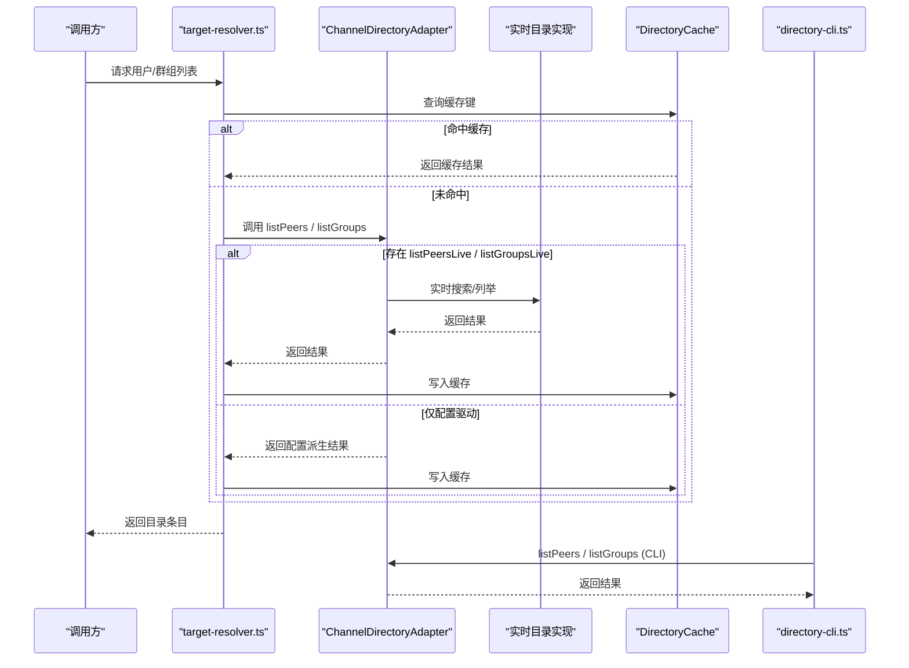
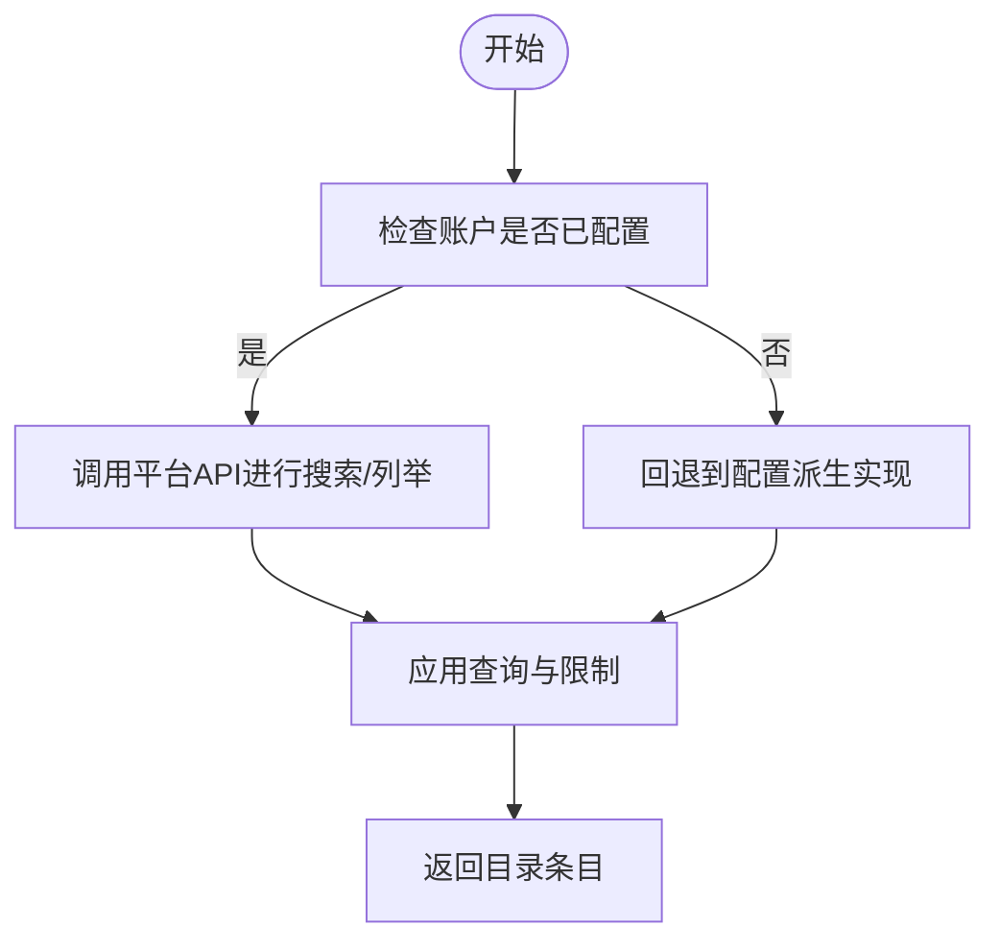
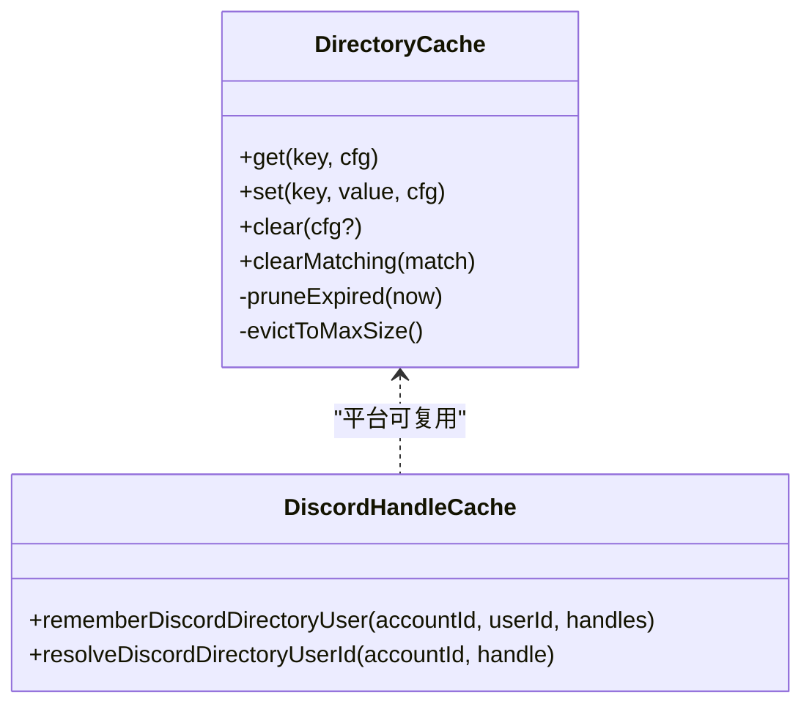
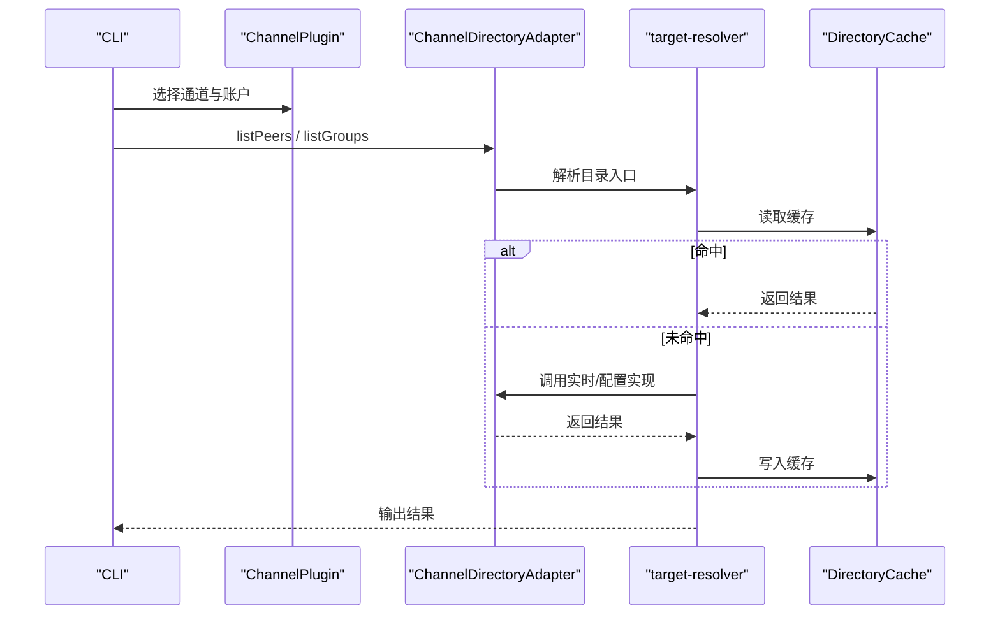
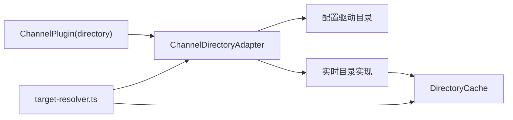

# 目录适配器

<cite>
**本文引用的文件**
- [src/channels/plugins/types.adapters.ts](file://src/channels/plugins/types.adapters.ts)
- [src/channels/plugins/types.plugin.ts](file://src/channels/plugins/types.plugin.ts)
- [src/channels/plugins/types.core.ts](file://src/channels/plugins/types.core.ts)
- [src/channels/plugins/directory-config.ts](file://src/channels/plugins/directory-config.ts)
- [src/channels/plugins/directory-config-helpers.ts](file://src/channels/plugins/directory-config-helpers.ts)
- [src/infra/outbound/target-resolver.ts](file://src/infra/outbound/target-resolver.ts)
- [src/infra/outbound/directory-cache.ts](file://src/infra/outbound/directory-cache.ts)
- [src/cli/directory-cli.ts](file://src/cli/directory-cli.ts)
- [src/discord/directory-live.ts](file://src/discord/directory-live.ts)
- [src/discord/directory-cache.ts](file://src/discord/directory-cache.ts)
- [extensions/matrix/src/directory-live.ts](file://extensions/matrix/src/directory-live.ts)
- [extensions/mattermost/src/mattermost/directory.ts](file://extensions/mattermost/src/mattermost/directory.ts)
- [extensions/feishu/src/directory.ts](file://extensions/feishu/src/directory.ts)
</cite>

## 目录
1. [简介](#简介)
2. [项目结构](#项目结构)
3. [核心组件](#核心组件)
4. [架构总览](#架构总览)
5. [详细组件分析](#详细组件分析)
6. [依赖关系分析](#依赖关系分析)
7. [性能考量](#性能考量)
8. [故障排查指南](#故障排查指南)
9. [结论](#结论)
10. [附录](#附录)

## 简介
本文件面向OpenClaw目录适配器（ChannelDirectoryAdapter）的实现与使用，聚焦以下目标：
- 明确ChannelDirectoryAdapter接口的实现要求：用户查询、群组管理、联系人同步。
- 解释目录数据结构：用户信息、群组信息、权限级别等字段定义与语义。
- 提供搜索与过滤实现指南：模糊匹配、精确查找、条件筛选。
- 说明目录缓存策略：本地缓存、增量更新、冲突解决。
- 介绍目录同步机制：双向同步、冲突检测、数据一致性保障。
- 给出性能优化建议与实现参考路径。

## 项目结构
围绕目录适配器的关键模块与文件如下：
- 类型与契约：定义目录适配器接口、目录条目类型、解析器接口等。
- 配置驱动的目录：从配置中派生用户/群组列表，并支持查询与限制。
- 实时目录：对接第三方平台API进行实时搜索与列举。
- 缓存与命中：本地内存缓存与按账号维度的句柄映射缓存。
- 出站解析与调用：在消息发送前解析目标并选择“缓存/实时”来源。

**图表来源**
- [src/channels/plugins/types.adapters.ts:335-344](file://src/channels/plugins/types.adapters.ts#L335-L344)
- [src/channels/plugins/types.core.ts:315-325](file://src/channels/plugins/types.core.ts#L315-L325)
- [src/channels/plugins/types.plugin.ts:79-79](file://src/channels/plugins/types.plugin.ts#L79-L79)
- [src/channels/plugins/directory-config.ts:76-222](file://src/channels/plugins/directory-config.ts#L76-L222)
- [src/channels/plugins/directory-config-helpers.ts:1-128](file://src/channels/plugins/directory-config-helpers.ts#L1-L128)
- [src/infra/outbound/directory-cache.ts:1-99](file://src/infra/outbound/directory-cache.ts#L1-L99)
- [src/discord/directory-live.ts:1-133](file://src/discord/directory-live.ts#L1-L133)
- [src/discord/directory-cache.ts:1-112](file://src/discord/directory-cache.ts#L1-L112)
- [extensions/matrix/src/directory-live.ts:1-210](file://extensions/matrix/src/directory-live.ts#L1-L210)
- [extensions/mattermost/src/mattermost/directory.ts:1-173](file://extensions/mattermost/src/mattermost/directory.ts#L1-L173)
- [extensions/feishu/src/directory.ts:1-157](file://extensions/feishu/src/directory.ts#L1-L157)
- [src/infra/outbound/target-resolver.ts:253-340](file://src/infra/outbound/target-resolver.ts#L253-L340)
- [src/cli/directory-cli.ts:98-147](file://src/cli/directory-cli.ts#L98-L147)

**章节来源**
- [src/channels/plugins/types.adapters.ts:335-344](file://src/channels/plugins/types.adapters.ts#L335-L344)
- [src/channels/plugins/types.core.ts:315-325](file://src/channels/plugins/types.core.ts#L315-L325)
- [src/channels/plugins/types.plugin.ts:79-79](file://src/channels/plugins/types.plugin.ts#L79-L79)
- [src/channels/plugins/directory-config.ts:76-222](file://src/channels/plugins/directory-config.ts#L76-L222)
- [src/channels/plugins/directory-config-helpers.ts:1-128](file://src/channels/plugins/directory-config-helpers.ts#L1-L128)
- [src/infra/outbound/directory-cache.ts:1-99](file://src/infra/outbound/directory-cache.ts#L1-L99)
- [src/discord/directory-live.ts:1-133](file://src/discord/directory-live.ts#L1-L133)
- [src/discord/directory-cache.ts:1-112](file://src/discord/directory-cache.ts#L1-L112)
- [extensions/matrix/src/directory-live.ts:1-210](file://extensions/matrix/src/directory-live.ts#L1-L210)
- [extensions/mattermost/src/mattermost/directory.ts:1-173](file://extensions/mattermost/src/mattermost/directory.ts#L1-L173)
- [extensions/feishu/src/directory.ts:1-157](file://extensions/feishu/src/directory.ts#L1-L157)
- [src/infra/outbound/target-resolver.ts:253-340](file://src/infra/outbound/target-resolver.ts#L253-L340)
- [src/cli/directory-cli.ts:98-147](file://src/cli/directory-cli.ts#L98-L147)

## 核心组件
- ChannelDirectoryAdapter接口：定义self、listPeers、listPeersLive、listGroups、listGroupsLive、listGroupMembers等方法，用于获取当前身份、枚举用户/群组以及查询成员。
- ChannelDirectoryEntry：目录条目的统一结构，包含kind、id、name、handle、rank、avatarUrl、raw等字段。
- 配置驱动目录：通过directory-config.ts与directory-config-helpers.ts从配置中提取allowFrom、dms、channels/groups等集合，生成用户/群组条目，并支持查询与限制。
- 实时目录：各通道扩展实现listPeersLive/listGroupsLive，直接调用远端API进行搜索或列举。
- 缓存：通用目录缓存DirectoryCache与特定平台的句柄缓存（如Discord），提升查询性能与减少外部调用。
- 出站解析：target-resolver.ts根据“缓存/实时”策略选择目录实现，并结合缓存返回结果；CLI通过directory-cli.ts暴露listPeers/listGroups命令。

**章节来源**
- [src/channels/plugins/types.adapters.ts:335-344](file://src/channels/plugins/types.adapters.ts#L335-L344)
- [src/channels/plugins/types.core.ts:315-325](file://src/channels/plugins/types.core.ts#L315-L325)
- [src/channels/plugins/directory-config.ts:65-74](file://src/channels/plugins/directory-config.ts#L65-L74)
- [src/channels/plugins/directory-config-helpers.ts:11-23](file://src/channels/plugins/directory-config-helpers.ts#L11-L23)
- [src/infra/outbound/directory-cache.ts:22-99](file://src/infra/outbound/directory-cache.ts#L22-L99)
- [src/discord/directory-cache.ts:60-107](file://src/discord/directory-cache.ts#L60-L107)
- [src/infra/outbound/target-resolver.ts:253-340](file://src/infra/outbound/target-resolver.ts#L253-L340)
- [src/cli/directory-cli.ts:113-147](file://src/cli/directory-cli.ts#L113-L147)

## 架构总览
下图展示目录适配器在系统中的交互关系：上层通过ChannelPlugin声明directory适配器，出站解析器根据策略选择“缓存/实时”，实时目录调用第三方API，配置驱动目录从配置中派生条目，缓存模块提供统一的内存缓存与过期清理。

**图表来源**
- [src/infra/outbound/target-resolver.ts:253-340](file://src/infra/outbound/target-resolver.ts#L253-L340)
- [src/infra/outbound/directory-cache.ts:22-99](file://src/infra/outbound/directory-cache.ts#L22-L99)
- [src/channels/plugins/types.adapters.ts:335-344](file://src/channels/plugins/types.adapters.ts#L335-L344)
- [src/cli/directory-cli.ts:113-147](file://src/cli/directory-cli.ts#L113-L147)

## 详细组件分析

### ChannelDirectoryAdapter 接口与职责
- 自身身份：self可返回当前账户对应的目录条目。
- 用户与群组：listPeers/listGroups返回静态/配置派生的用户/群组列表；listPeersLive/listGroupsLive返回实时搜索/列举结果。
- 成员查询：listGroupMembers返回指定群组的成员列表。
- 实现建议：
  - 若平台支持实时搜索，优先实现listPeersLive/listGroupsLive。
  - 对于无实时能力的平台，至少实现listPeers/listGroups，并在必要时提供配置驱动的派生逻辑。
  - 支持limit与query参数，确保性能与用户体验。

**章节来源**
- [src/channels/plugins/types.adapters.ts:335-344](file://src/channels/plugins/types.adapters.ts#L335-L344)

### 目录数据结构与字段语义
- ChannelDirectoryEntry字段：
  - kind：用户/群组/频道
  - id：平台唯一标识
  - name：显示名称
  - handle：常用别称/标签
  - avatarUrl：头像URL
  - rank：排序权重（如用户优先级）
  - raw：原始响应对象（便于调试与扩展）

**章节来源**
- [src/channels/plugins/types.core.ts:315-325](file://src/channels/plugins/types.core.ts#L315-L325)

### 配置驱动的目录：用户与群组派生
- Slack/Discord/Telegram/WhatsApp等平台通过directory-config.ts从allowFrom、dms、channels/groups等配置项派生用户/群组ID。
- 使用directory-config-helpers.ts提供的工具函数：
  - resolveDirectoryQuery/resolveDirectoryLimit：标准化查询字符串与限制数量。
  - applyDirectoryQueryAndLimit：对ID列表进行模糊匹配与截断。
  - toDirectoryEntries：将ID数组转换为目录条目。
  - collectDirectoryIdsFromEntries/collectDirectoryIdsFromMapKeys：从配置中收集合法ID并去重。

**章节来源**
- [src/channels/plugins/directory-config.ts:65-74](file://src/channels/plugins/directory-config.ts#L65-L74)
- [src/channels/plugins/directory-config-helpers.ts:3-19](file://src/channels/plugins/directory-config-helpers.ts#L3-L19)
- [src/channels/plugins/directory-config-helpers.ts:57-70](file://src/channels/plugins/directory-config-helpers.ts#L57-L70)
- [src/channels/plugins/directory-config-helpers.ts:93-106](file://src/channels/plugins/directory-config-helpers.ts#L93-L106)

### 实时目录：以平台为中心的搜索与列举
- Discord：listDiscordDirectoryPeersLive通过members/search接口搜索成员；listDiscordDirectoryGroupsLive列举公会频道并支持slug化匹配。
- Matrix：listMatrixDirectoryPeersLive调用用户目录搜索；listMatrixDirectoryGroupsLive支持别名解析与房间名模糊匹配。
- Mattermost：listMattermostDirectoryPeers通过搜索term或批量成员ID查询；listMattermostDirectoryGroups遍历所有可用客户端的公共/私有频道。
- 飞书：listFeishuDirectoryPeersLive/listFeishuDirectoryGroupsLive在已配置情况下调用联系人与聊天列表接口，并回退到配置派生实现。

**图表来源**
- [src/discord/directory-live.ts:76-132](file://src/discord/directory-live.ts#L76-L132)
- [extensions/matrix/src/directory-live.ts:88-122](file://extensions/matrix/src/directory-live.ts#L88-L122)
- [extensions/mattermost/src/mattermost/directory.ts:118-172](file://extensions/mattermost/src/mattermost/directory.ts#L118-L172)
- [extensions/feishu/src/directory.ts:64-109](file://extensions/feishu/src/directory.ts#L64-L109)
- [extensions/feishu/src/directory.ts:111-156](file://extensions/feishu/src/directory.ts#L111-L156)

**章节来源**
- [src/discord/directory-live.ts:39-74](file://src/discord/directory-live.ts#L39-L74)
- [src/discord/directory-live.ts:76-132](file://src/discord/directory-live.ts#L76-L132)
- [extensions/matrix/src/directory-live.ts:158-209](file://extensions/matrix/src/directory-live.ts#L158-L209)
- [extensions/mattermost/src/mattermost/directory.ts:64-107](file://extensions/mattermost/src/mattermost/directory.ts#L64-L107)
- [extensions/mattermost/src/mattermost/directory.ts:118-172](file://extensions/mattermost/src/mattermost/directory.ts#L118-L172)
- [extensions/feishu/src/directory.ts:30-62](file://extensions/feishu/src/directory.ts#L30-L62)
- [extensions/feishu/src/directory.ts:111-156](file://extensions/feishu/src/directory.ts#L111-L156)

### 搜索与过滤实现指南
- 模糊匹配：将查询字符串trim后转小写，对ID或名称执行包含判断；对Matrix/飞书等平台还支持别名/显示名匹配。
- 精确查找：若查询为空，实时目录通常不发起网络请求；配置驱动目录可直接返回全量ID再应用过滤。
- 条件筛选：结合allowFrom、dms、channels/groups等配置项进行集合合并与去重，再应用查询与limit。
- 性能要点：限制返回数量、避免重复请求、利用缓存键区分“缓存/实时”。

**章节来源**
- [src/channels/plugins/directory-config-helpers.ts:3-19](file://src/channels/plugins/directory-config-helpers.ts#L3-L19)
- [src/channels/plugins/directory-config.ts:65-70](file://src/channels/plugins/directory-config.ts#L65-L70)
- [extensions/matrix/src/directory-live.ts:56-62](file://extensions/matrix/src/directory-live.ts#L56-L62)
- [extensions/mattermost/src/mattermost/directory.ts:71-88](file://extensions/mattermost/src/mattermost/directory.ts#L71-L88)
- [extensions/feishu/src/directory.ts:89-98](file://extensions/feishu/src/directory.ts#L89-L98)

### 目录缓存策略：本地缓存、增量更新与冲突解决
- 通用目录缓存：DirectoryCache提供TTL过期、最大容量淘汰、配置变更清空、插入时间刷新等机制。
- 平台特定缓存：Discord提供句柄到用户ID的映射缓存，支持带/不带服务器后缀的用户名匹配。
- 增量更新：实时目录在搜索到新用户时可更新句柄缓存；配置驱动目录在新增allowFrom/dms时应触发缓存重建。
- 冲突解决：当同一handle对应多个用户ID时，优先使用最新记录；Discord缓存自动覆盖旧键。

**图表来源**
- [src/infra/outbound/directory-cache.ts:22-99](file://src/infra/outbound/directory-cache.ts#L22-L99)
- [src/discord/directory-cache.ts:60-107](file://src/discord/directory-cache.ts#L60-L107)

**章节来源**
- [src/infra/outbound/directory-cache.ts:22-99](file://src/infra/outbound/directory-cache.ts#L22-L99)
- [src/discord/directory-cache.ts:60-107](file://src/discord/directory-cache.ts#L60-L107)

### 目录同步机制：双向同步、冲突检测与一致性
- 双向同步：实时目录与配置驱动目录并行存在，优先使用实时结果；当实时不可用时回退至配置派生。
- 冲突检测：当同一用户在不同账户或不同来源出现差异时，以最近一次更新为准；句柄缓存支持去重与覆盖。
- 一致性保障：缓存键包含channel、accountId、kind、source、signature，确保跨账户与来源隔离；配置变更触发缓存清空，避免脏读。

**章节来源**
- [src/infra/outbound/target-resolver.ts:253-340](file://src/infra/outbound/target-resolver.ts#L253-L340)
- [src/infra/outbound/directory-cache.ts:71-76](file://src/infra/outbound/directory-cache.ts#L71-L76)
- [src/discord/directory-cache.ts:60-84](file://src/discord/directory-cache.ts#L60-L84)

### 出站解析与调用流程
- 目标解析：target-resolver.ts根据“缓存/实时”策略选择目录实现，构建缓存键并读取/写入缓存。
- CLI支持：directory-cli.ts提供listPeers/listGroups命令，透传query与limit参数，支持JSON输出。

**图表来源**
- [src/cli/directory-cli.ts:113-147](file://src/cli/directory-cli.ts#L113-L147)
- [src/infra/outbound/target-resolver.ts:253-340](file://src/infra/outbound/target-resolver.ts#L253-L340)
- [src/infra/outbound/directory-cache.ts:22-99](file://src/infra/outbound/directory-cache.ts#L22-L99)

**章节来源**
- [src/cli/directory-cli.ts:98-147](file://src/cli/directory-cli.ts#L98-L147)
- [src/infra/outbound/target-resolver.ts:253-340](file://src/infra/outbound/target-resolver.ts#L253-L340)

## 依赖关系分析
- ChannelPlugin通过directory字段声明目录适配器；适配器可同时提供配置驱动与实时实现。
- target-resolver.ts依赖目录适配器与缓存模块，负责目录入口与缓存策略。
- 各平台扩展独立实现listPeersLive/listGroupsLive，共享通用工具函数与缓存策略。

**图表来源**
- [src/channels/plugins/types.plugin.ts:79-79](file://src/channels/plugins/types.plugin.ts#L79-L79)
- [src/channels/plugins/types.adapters.ts:335-344](file://src/channels/plugins/types.adapters.ts#L335-L344)
- [src/infra/outbound/target-resolver.ts:253-340](file://src/infra/outbound/target-resolver.ts#L253-L340)
- [src/infra/outbound/directory-cache.ts:22-99](file://src/infra/outbound/directory-cache.ts#L22-L99)

**章节来源**
- [src/channels/plugins/types.plugin.ts:79-79](file://src/channels/plugins/types.plugin.ts#L79-L79)
- [src/channels/plugins/types.adapters.ts:335-344](file://src/channels/plugins/types.adapters.ts#L335-L344)
- [src/infra/outbound/target-resolver.ts:253-340](file://src/infra/outbound/target-resolver.ts#L253-L340)

## 性能考量
- 查询限制：合理设置limit，避免一次性返回过多条目；对实时API调用进行分页与并发控制。
- 缓存策略：启用DirectoryCache并设置合适的TTL与最大容量；对高频查询键保持活跃状态。
- 去重与归一化：使用collectDirectoryIdsFromEntries/collectDirectoryIdsFromMapKeys与去重工具，减少重复计算。
- 回退机制：实时失败时快速回退到配置派生实现，降低端到端延迟。
- 平台特定优化：Discord使用句柄缓存与slug化匹配；Matrix/飞书对别名与显示名进行预处理。

[本节为通用指导，无需具体文件分析]

## 故障排查指南
- 实时目录不可用：检查账户令牌、网络连通性与API配额；确认listPeersLive/listGroupsLive实现是否正确处理错误并回退。
- 缓存异常：验证缓存键构建逻辑（channel/accountId/kind/source/signature）；确认配置变更后缓存被清空。
- 句柄冲突：Discord句柄缓存可能覆盖旧映射，检查handle规范化规则与后缀去除逻辑。
- CLI无法列出：确认所选通道支持directory且已正确加载；检查query与limit参数传递。

**章节来源**
- [src/discord/directory-cache.ts:86-107](file://src/discord/directory-cache.ts#L86-L107)
- [src/infra/outbound/target-resolver.ts:253-340](file://src/infra/outbound/target-resolver.ts#L253-L340)
- [src/cli/directory-cli.ts:113-147](file://src/cli/directory-cli.ts#L113-L147)

## 结论
OpenClaw的目录适配器通过统一接口与灵活的实现策略，既满足配置驱动的稳定场景，又支持实时目录的动态能力。配合通用缓存与平台特定优化，可在多通道环境下实现高性能、高一致性的目录服务。建议在新通道实现中优先提供实时能力，并完善缓存与回退策略，确保在异常场景下的可用性与一致性。

[本节为总结，无需具体文件分析]

## 附录
- 关键实现参考路径（不含代码内容，仅路径与行号）：
  - [接口定义:335-344](file://src/channels/plugins/types.adapters.ts#L335-L344)
  - [目录条目类型:315-325](file://src/channels/plugins/types.core.ts#L315-L325)
  - [配置驱动用户/群组:76-222](file://src/channels/plugins/directory-config.ts#L76-L222)
  - [查询与限制工具:11-23](file://src/channels/plugins/directory-config-helpers.ts#L11-L23)
  - [Discord实时目录:39-132](file://src/discord/directory-live.ts#L39-L132)
  - [Discord句柄缓存:60-107](file://src/discord/directory-cache.ts#L60-L107)
  - [Matrix实时目录:88-209](file://extensions/matrix/src/directory-live.ts#L88-L209)
  - [Mattermost实时目录:64-172](file://extensions/mattermost/src/mattermost/directory.ts#L64-L172)
  - [飞书实时目录:30-156](file://extensions/feishu/src/directory.ts#L30-L156)
  - [通用目录缓存:22-99](file://src/infra/outbound/directory-cache.ts#L22-L99)
  - [出站解析与缓存:253-340](file://src/infra/outbound/target-resolver.ts#L253-L340)
  - [CLI目录命令:113-147](file://src/cli/directory-cli.ts#L113-L147)