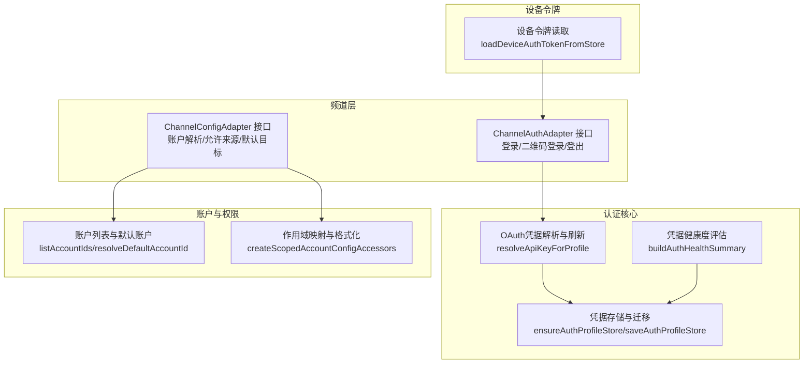
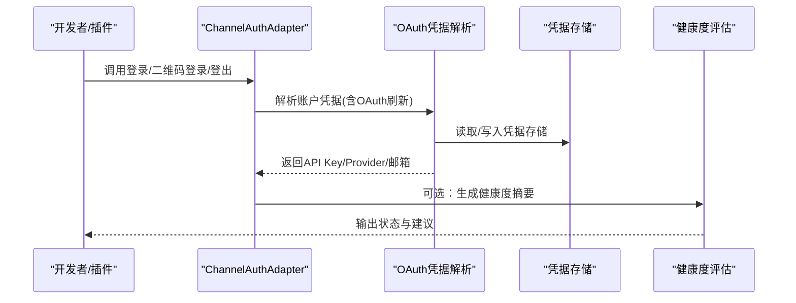
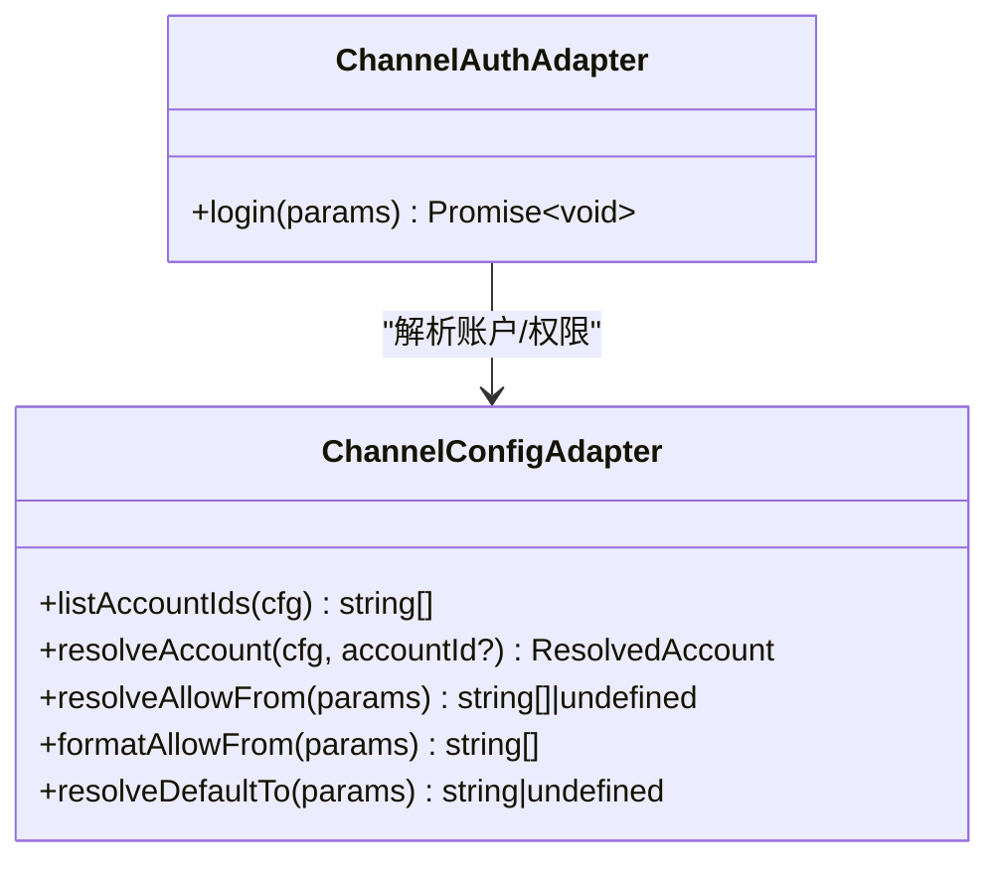
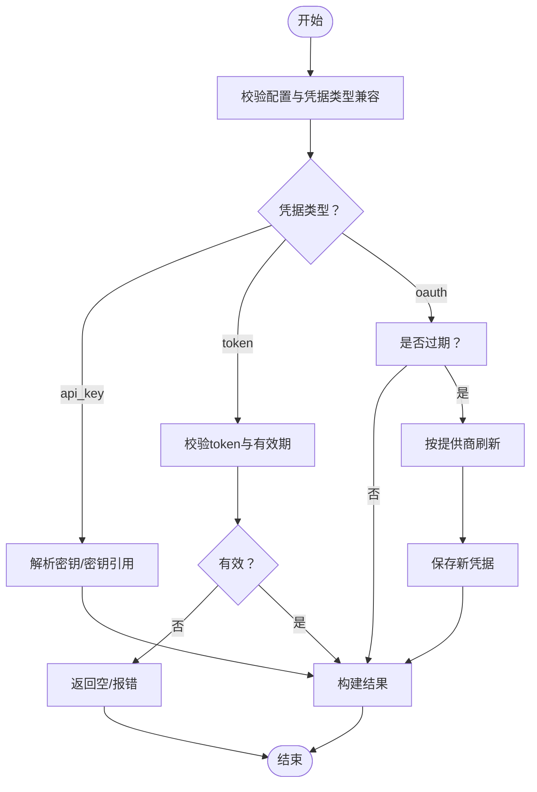
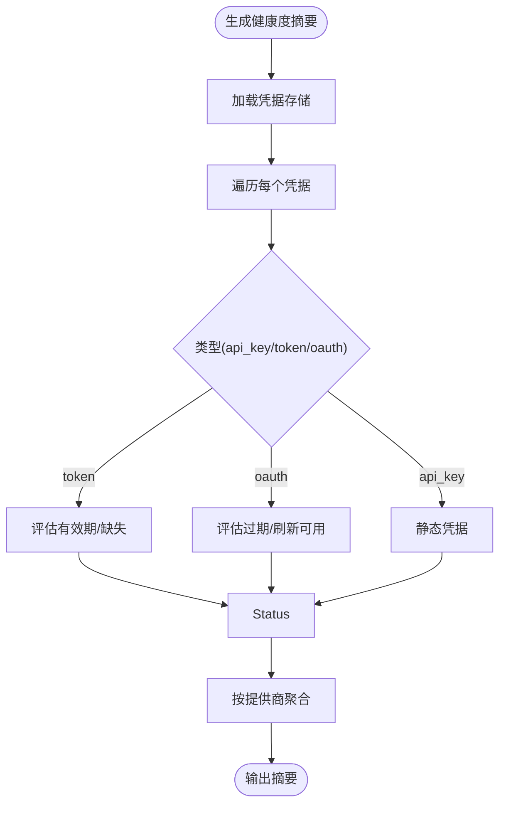
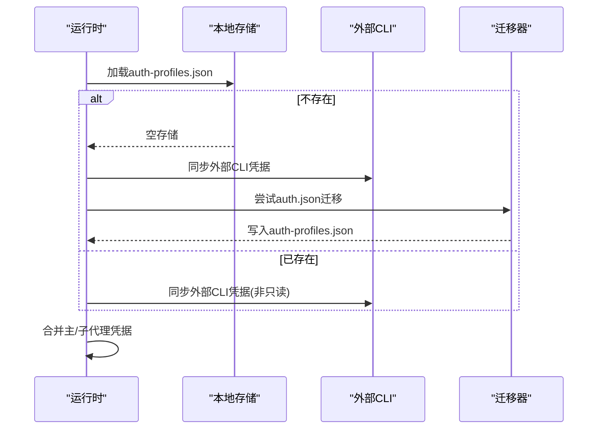
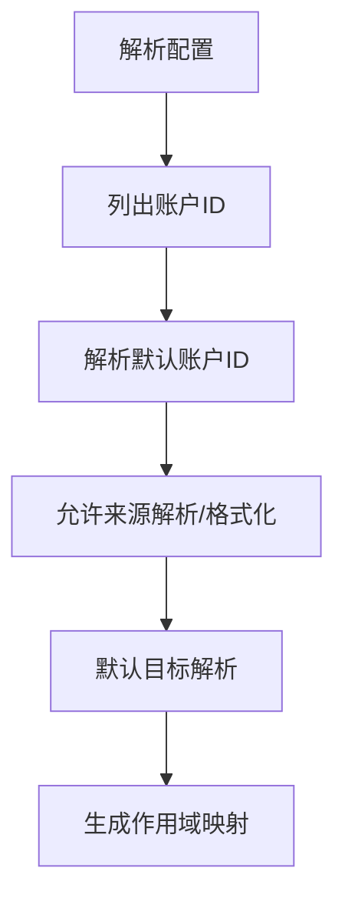
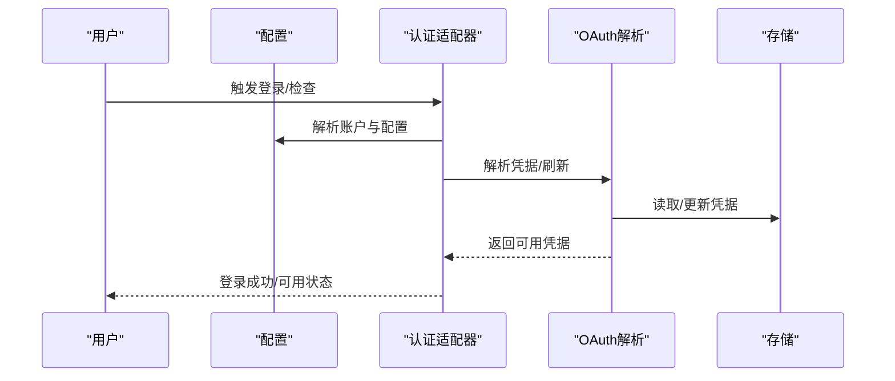
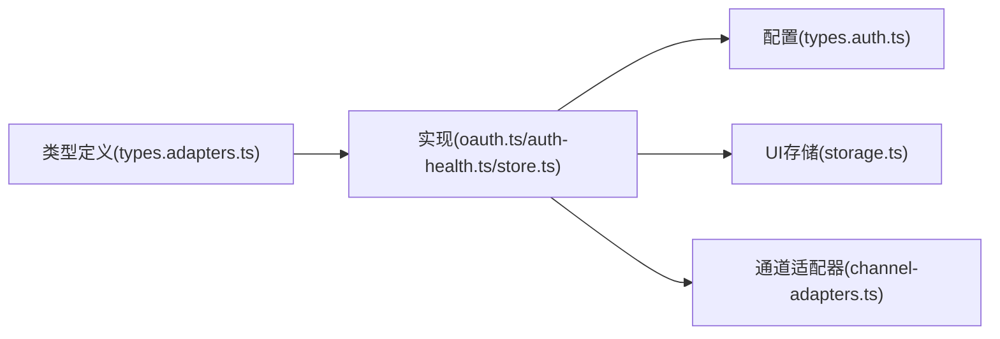

# 认证适配器

<cite>
**本文引用的文件**
- [src/channels/plugins/types.adapters.ts](file://src/channels/plugins/types.adapters.ts)
- [src/agents/auth-profiles/oauth.ts](file://src/agents/auth-profiles/oauth.ts)
- [src/agents/auth-health.ts](file://src/agents/auth-health.ts)
- [src/agents/auth-profiles/store.ts](file://src/agents/auth-profiles/store.ts)
- [src/agents/auth-profiles/credential-state.ts](file://src/agents/auth-profiles/credential-state.ts)
- [src/agents/auth-profiles/doctor.ts](file://src/agents/auth-profiles/doctor.ts)
- [src/config/types.auth.ts](file://src/config/types.auth.ts)
- [src/channels/plugins/account-helpers.ts](file://src/channels/plugins/account-helpers.ts)
- [src/plugin-sdk/channel-config-helpers.ts](file://src/plugin-sdk/channel-config-helpers.ts)
- [src/shared/device-auth-store.ts](file://src/shared/device-auth-store.ts)
- [src/infra/outbound/channel-adapters.ts](file://src/infra/outbound/channel-adapters.ts)
- [src/agents/auth-profiles.chutes.test.ts](file://src/agents/auth-profiles.chutes.test.ts)
- [src/agents/chutes-oauth.flow.test.ts](file://src/agents/chutes-oauth.flow.test.ts)
- [src/agents/auth-health.test.ts](file://src/agents/auth-health.test.ts)
- [src/agents/auth-profiles.oauth.test.ts](file://src/agents/auth-profiles.oauth.test.ts)
</cite>

## 目录
1. [简介](#简介)
2. [项目结构](#项目结构)
3. [核心组件](#核心组件)
4. [架构总览](#架构总览)
5. [详细组件分析](#详细组件分析)
6. [依赖关系分析](#依赖关系分析)
7. [性能考量](#性能考量)
8. [故障排查指南](#故障排查指南)
9. [结论](#结论)
10. [附录](#附录)

## 简介
本文件面向OpenClaw的“频道认证适配器”（ChannelAuthAdapter）实现，系统化梳理OAuth流程、API密钥与会话令牌管理、认证状态与健康度监控、账户验证与多账户支持、错误处理策略以及安全最佳实践。目标是帮助开发者在扩展新频道或维护现有频道时，快速理解并正确实现认证适配器。

## 项目结构
围绕认证适配器的关键模块分布如下：
- 频道适配器类型定义：定义了ChannelAuthAdapter等接口契约，明确登录入口与可选能力边界
- 认证凭据解析与刷新：负责OAuth令牌获取、刷新、兼容性处理与回退策略
- 认证健康度与状态：对凭据有效性、过期风险进行评估与汇总
- 凭据存储与迁移：统一凭据存储格式、版本与兼容处理
- 账户与权限：账户列表、默认账户解析、权限继承与作用域映射
- 设备级令牌：设备令牌读取与角色归一化
- 其他辅助：通道消息适配器、CLI命令提示等

**图表来源**
- [src/channels/plugins/types.adapters.ts:291-299](file://src/channels/plugins/types.adapters.ts#L291-L299)
- [src/agents/auth-profiles/oauth.ts:305-487](file://src/agents/auth-profiles/oauth.ts#L305-L487)
- [src/agents/auth-health.ts:187-283](file://src/agents/auth-health.ts#L187-L283)
- [src/agents/auth-profiles/store.ts:462-509](file://src/agents/auth-profiles/store.ts#L462-L509)
- [src/channels/plugins/account-helpers.ts:8-39](file://src/channels/plugins/account-helpers.ts#L8-L39)
- [src/plugin-sdk/channel-config-helpers.ts:34-61](file://src/plugin-sdk/channel-config-helpers.ts#L34-L61)
- [src/shared/device-auth-store.ts:14-29](file://src/shared/device-auth-store.ts#L14-L29)

**章节来源**
- [src/channels/plugins/types.adapters.ts:291-299](file://src/channels/plugins/types.adapters.ts#L291-L299)
- [src/agents/auth-profiles/oauth.ts:305-487](file://src/agents/auth-profiles/oauth.ts#L305-L487)
- [src/agents/auth-health.ts:187-283](file://src/agents/auth-health.ts#L187-L283)
- [src/agents/auth-profiles/store.ts:462-509](file://src/agents/auth-profiles/store.ts#L462-L509)
- [src/channels/plugins/account-helpers.ts:8-39](file://src/channels/plugins/account-helpers.ts#L8-L39)
- [src/plugin-sdk/channel-config-helpers.ts:34-61](file://src/plugin-sdk/channel-config-helpers.ts#L34-L61)
- [src/shared/device-auth-store.ts:14-29](file://src/shared/device-auth-store.ts#L14-L29)

## 核心组件
- ChannelAuthAdapter：定义频道登录入口，支持通用登录流程；若需二维码登录或登出，可扩展相应方法
- OAuth凭据解析与刷新：统一从凭据存储中解析API Key/OAuth/Token，处理过期与刷新，兼容不同提供商
- 认证健康度：按账户与提供商维度评估凭据状态，输出健康摘要
- 凭据存储：支持主/子代理凭据合并、外部CLI同步、旧版迁移与只读运行时模式
- 账户与权限：账户枚举、默认账户解析、允许来源与默认目标的作用域映射
- 设备令牌：按设备ID与角色读取令牌，用于设备级鉴权

**章节来源**
- [src/channels/plugins/types.adapters.ts:291-299](file://src/channels/plugins/types.adapters.ts#L291-L299)
- [src/agents/auth-profiles/oauth.ts:305-487](file://src/agents/auth-profiles/oauth.ts#L305-L487)
- [src/agents/auth-health.ts:187-283](file://src/agents/auth-health.ts#L187-L283)
- [src/agents/auth-profiles/store.ts:462-509](file://src/agents/auth-profiles/store.ts#L462-L509)
- [src/channels/plugins/account-helpers.ts:8-39](file://src/channels/plugins/account-helpers.ts#L8-L39)
- [src/plugin-sdk/channel-config-helpers.ts:34-61](file://src/plugin-sdk/channel-config-helpers.ts#L34-L61)
- [src/shared/device-auth-store.ts:14-29](file://src/shared/device-auth-store.ts#L14-L29)

## 架构总览
下图展示认证适配器在系统中的位置与交互：

**图表来源**
- [src/channels/plugins/types.adapters.ts:291-299](file://src/channels/plugins/types.adapters.ts#L291-L299)
- [src/agents/auth-profiles/oauth.ts:305-487](file://src/agents/auth-profiles/oauth.ts#L305-L487)
- [src/agents/auth-health.ts:187-283](file://src/agents/auth-health.ts#L187-L283)
- [src/agents/auth-profiles/store.ts:462-509](file://src/agents/auth-profiles/store.ts#L462-L509)

## 详细组件分析

### ChannelAuthAdapter 接口与实现要求
- 登录入口：login方法接收配置、账户ID、运行时环境等参数，返回void
- 可选能力：若频道支持二维码登录/等待与登出，可实现对应的start/wait/logout方法
- 与配置适配器协作：通过ChannelConfigAdapter解析账户、允许来源、默认目标等

**图表来源**
- [src/channels/plugins/types.adapters.ts:291-299](file://src/channels/plugins/types.adapters.ts#L291-L299)
- [src/channels/plugins/types.adapters.ts:52-81](file://src/channels/plugins/types.adapters.ts#L52-L81)

**章节来源**
- [src/channels/plugins/types.adapters.ts:291-299](file://src/channels/plugins/types.adapters.ts#L291-L299)
- [src/channels/plugins/types.adapters.ts:52-81](file://src/channels/plugins/types.adapters.ts#L52-L81)

### OAuth 流程与API密钥管理
- 解析优先级：api_key > token > oauth（兼容互换）
- 过期判断：基于expires时间；若未过期直接使用
- 刷新策略：按提供商调用对应刷新逻辑；失败时尝试回退到主代理凭据、备用配置或特定提供商回退
- 锁定与持久化：使用文件锁保护凭据更新，避免并发冲突
- 错误提示：结合doctor提示生成可操作建议

**图表来源**
- [src/agents/auth-profiles/oauth.ts:29-55](file://src/agents/auth-profiles/oauth.ts#L29-L55)
- [src/agents/auth-profiles/oauth.ts:305-487](file://src/agents/auth-profiles/oauth.ts#L305-L487)
- [src/agents/auth-profiles/credential-state.ts:13-24](file://src/agents/auth-profiles/credential-state.ts#L13-L24)

**章节来源**
- [src/agents/auth-profiles/oauth.ts:305-487](file://src/agents/auth-profiles/oauth.ts#L305-L487)
- [src/agents/auth-profiles/credential-state.ts:13-24](file://src/agents/auth-profiles/credential-state.ts#L13-L24)

### 会话令牌处理与健康度管理
- 健康度状态：ok/expiring/expired/missing/static
- 评估维度：按账户与提供商聚合，考虑refresh_token存在性对到期预警的影响
- 摘要输出：包含当前时间、告警阈值、各账户与提供商的状态与剩余时间

**图表来源**
- [src/agents/auth-health.ts:187-283](file://src/agents/auth-health.ts#L187-L283)

**章节来源**
- [src/agents/auth-health.ts:17-44](file://src/agents/auth-health.ts#L17-L44)
- [src/agents/auth-health.ts:80-96](file://src/agents/auth-health.ts#L80-L96)
- [src/agents/auth-health.ts:187-283](file://src/agents/auth-health.ts#L187-L283)

### 凭据存储与迁移、主/子代理继承
- 存储格式：version/profiles/order/lastGood/usageStats
- 运行时快照：支持主代理与子代理凭据合并
- 外部CLI同步：首次加载时将外部CLI工具的凭据同步至运行时
- 旧版迁移：从auth.json迁移到auth-profiles.json，并删除旧文件
- 只读模式：在密钥激活等场景下以只读方式加载，避免意外写入

**图表来源**
- [src/agents/auth-profiles/store.ts:346-441](file://src/agents/auth-profiles/store.ts#L346-L441)
- [src/agents/auth-profiles/store.ts:443-460](file://src/agents/auth-profiles/store.ts#L443-L460)
- [src/agents/auth-profiles/store.ts:462-509](file://src/agents/auth-profiles/store.ts#L462-L509)

**章节来源**
- [src/agents/auth-profiles/store.ts:346-441](file://src/agents/auth-profiles/store.ts#L346-L441)
- [src/agents/auth-profiles/store.ts:443-460](file://src/agents/auth-profiles/store.ts#L443-L460)
- [src/agents/auth-profiles/store.ts:462-509](file://src/agents/auth-profiles/store.ts#L462-L509)

### 账户验证机制与多账户支持
- 账户列表与默认账户：从配置中解析已配置账户ID，支持规范化与默认账户选择
- 作用域映射：允许来源与默认目标的解析与格式化，支持按账户定制
- 权限继承：通过作用域访问器将账户配置映射为实际使用的字符串集合

**图表来源**
- [src/channels/plugins/account-helpers.ts:8-39](file://src/channels/plugins/account-helpers.ts#L8-L39)
- [src/plugin-sdk/channel-config-helpers.ts:34-61](file://src/plugin-sdk/channel-config-helpers.ts#L34-L61)

**章节来源**
- [src/channels/plugins/account-helpers.ts:8-39](file://src/channels/plugins/account-helpers.ts#L8-L39)
- [src/plugin-sdk/channel-config-helpers.ts:34-61](file://src/plugin-sdk/channel-config-helpers.ts#L34-L61)

### 设备级令牌与会话令牌
- 设备令牌：按deviceId与role读取，进行角色与作用域归一化
- 会话令牌：前端侧按网关URL作用域存储于会话存储，清理遗留键

**章节来源**
- [src/shared/device-auth-store.ts:14-29](file://src/shared/device-auth-store.ts#L14-L29)
- [ui/src/ui/storage.ts:35-70](file://ui/src/ui/storage.ts#L35-L70)

### 登录检查、自动续期与登出流程
- 登录检查：通过健康度评估与配置兼容性判断账户可用性
- 自动续期：OAuth凭据在首次API调用前自动刷新，若具备refresh_token则不预警过期
- 登出流程：若实现logoutAccount，应清理账户相关状态并返回清理结果

**图表来源**
- [src/agents/auth-health.ts:165-184](file://src/agents/auth-health.ts#L165-L184)
- [src/agents/auth-profiles/oauth.ts:385-407](file://src/agents/auth-profiles/oauth.ts#L385-L407)

**章节来源**
- [src/agents/auth-health.ts:165-184](file://src/agents/auth-health.ts#L165-L184)
- [src/agents/auth-profiles/oauth.ts:385-407](file://src/agents/auth-profiles/oauth.ts#L385-L407)

## 依赖关系分析
- 类型契约：ChannelAuthAdapter与ChannelConfigAdapter定义了认证适配器的职责边界
- 实现依赖：OAuth解析依赖存储与提供商刷新器；健康度评估依赖凭据状态计算
- 配置模型：AuthProfileConfig与AuthConfig描述账户模式与全局冷却策略
- 外部集成：通道消息适配器与UI会话存储参与整体认证体验

**图表来源**
- [src/channels/plugins/types.adapters.ts:291-299](file://src/channels/plugins/types.adapters.ts#L291-L299)
- [src/agents/auth-profiles/oauth.ts:305-487](file://src/agents/auth-profiles/oauth.ts#L305-L487)
- [src/agents/auth-health.ts:187-283](file://src/agents/auth-health.ts#L187-L283)
- [src/agents/auth-profiles/store.ts:462-509](file://src/agents/auth-profiles/store.ts#L462-L509)
- [src/config/types.auth.ts:1-29](file://src/config/types.auth.ts#L1-L29)
- [src/infra/outbound/channel-adapters.ts:1-57](file://src/infra/outbound/channel-adapters.ts#L1-L57)

**章节来源**
- [src/channels/plugins/types.adapters.ts:291-299](file://src/channels/plugins/types.adapters.ts#L291-L299)
- [src/agents/auth-profiles/oauth.ts:305-487](file://src/agents/auth-profiles/oauth.ts#L305-L487)
- [src/agents/auth-health.ts:187-283](file://src/agents/auth-health.ts#L187-L283)
- [src/agents/auth-profiles/store.ts:462-509](file://src/agents/auth-profiles/store.ts#L462-L509)
- [src/config/types.auth.ts:1-29](file://src/config/types.auth.ts#L1-L29)
- [src/infra/outbound/channel-adapters.ts:1-57](file://src/infra/outbound/channel-adapters.ts#L1-L57)

## 性能考量
- 文件锁与并发：凭据更新使用文件锁，避免竞争条件，但可能带来I/O阻塞；建议批量更新与缓存策略
- 运行时快照：主/子代理合并与运行时快照减少重复I/O，提升查询效率
- 健康度评估：按提供商聚合，避免对每个账户重复计算
- 会话缓存：会话存储带TTL，降低频繁读取成本

[本节为通用指导，无需具体文件分析]

## 故障排查指南
- OAuth刷新失败：抛出带doctor提示的错误，包含提供商、配置、建议修复命令
- 凭据无效/过期：通过evaluateStoredCredentialEligibility与resolveTokenExpiryState定位原因
- 健康度异常：使用buildAuthHealthSummary查看账户与提供商状态，关注expiring/expired
- 测试覆盖：针对OAuth交换、刷新、健康度与配置映射有完整测试用例

**章节来源**
- [src/agents/auth-profiles/oauth.ts:473-487](file://src/agents/auth-profiles/oauth.ts#L473-L487)
- [src/agents/auth-profiles/credential-state.ts:34-74](file://src/agents/auth-profiles/credential-state.ts#L34-L74)
- [src/agents/auth-health.ts:187-283](file://src/agents/auth-health.ts#L187-L283)
- [src/agents/auth-profiles.chutes.test.ts:38-84](file://src/agents/auth-profiles.chutes.test.ts#L38-L84)
- [src/agents/chutes-oauth.flow.test.ts:38-117](file://src/agents/chutes-oauth.flow.test.ts#L38-L117)
- [src/agents/auth-health.test.ts](file://src/agents/auth-health.test.ts)
- [src/agents/auth-profiles.oauth.test.ts](file://src/agents/auth-profiles.oauth.test.ts)

## 结论
ChannelAuthAdapter通过清晰的类型契约与完善的OAuth解析、健康度评估、凭据存储与多账户支持，提供了可扩展且安全的认证框架。遵循本文档的实现要点与最佳实践，可在保证安全性的同时，获得良好的用户体验与可维护性。

[本节为总结，无需具体文件分析]

## 附录
- 安全最佳实践
  - 使用文件锁保护凭据文件，避免并发写入
  - 对敏感字段（如密钥）仅在内存中保留必要副本，持久化时去除明文
  - 严格区分主/子代理凭据，确保继承与隔离平衡
  - 在只读场景（如密钥激活）禁用持久化写入
  - 对OAuth刷新失败提供可操作的doctor提示
- 实现示例路径
  - OAuth解析与刷新：[src/agents/auth-profiles/oauth.ts:305-487](file://src/agents/auth-profiles/oauth.ts#L305-L487)
  - 健康度评估：[src/agents/auth-health.ts:187-283](file://src/agents/auth-health.ts#L187-L283)
  - 凭据存储与迁移：[src/agents/auth-profiles/store.ts:462-509](file://src/agents/auth-profiles/store.ts#L462-L509)
  - 账户与权限映射：[src/channels/plugins/account-helpers.ts:8-39](file://src/channels/plugins/account-helpers.ts#L8-L39)、[src/plugin-sdk/channel-config-helpers.ts:34-61](file://src/plugin-sdk/channel-config-helpers.ts#L34-L61)
  - 设备令牌读取：[src/shared/device-auth-store.ts:14-29](file://src/shared/device-auth-store.ts#L14-L29)

[本节为补充信息，无需具体文件分析]