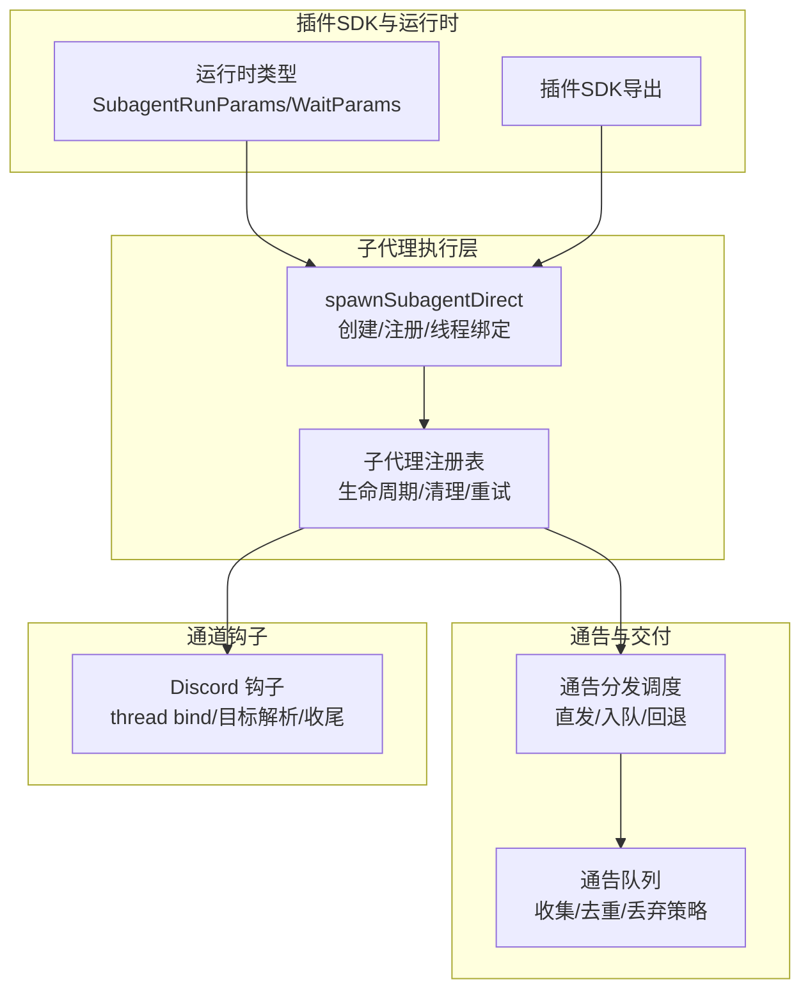
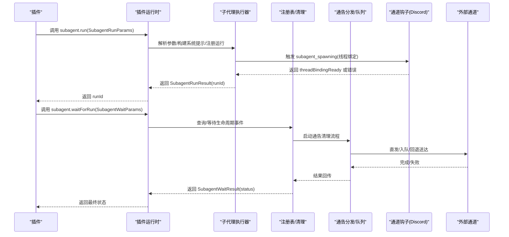
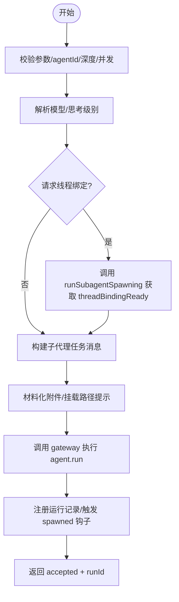
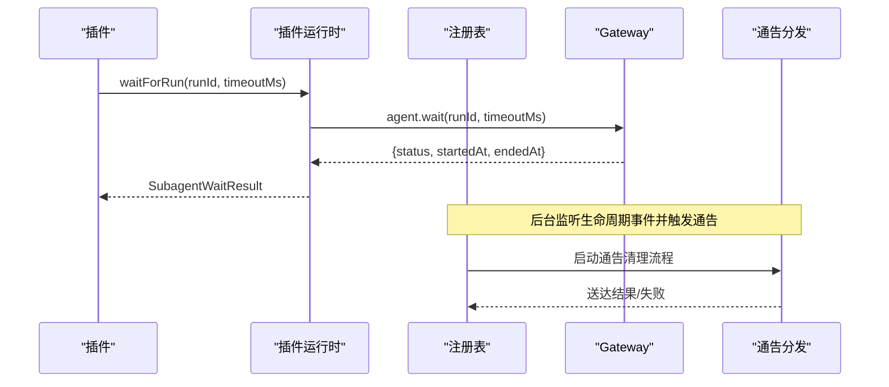
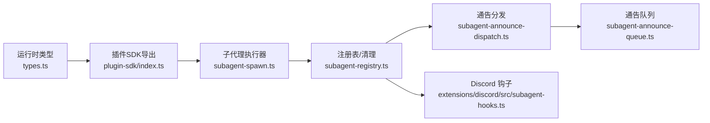

# 子代理API

<cite>
**本文引用的文件**
- [src/plugins/runtime/types.ts](file://src/plugins/runtime/types.ts)
- [src/plugin-sdk/index.ts](file://src/plugin-sdk/index.ts)
- [src/agents/subagent-spawn.ts](file://src/agents/subagent-spawn.ts)
- [src/agents/subagent-announce-dispatch.ts](file://src/agents/subagent-announce-dispatch.ts)
- [src/agents/subagent-announce-queue.ts](file://src/agents/subagent-announce-queue.ts)
- [extensions/discord/src/subagent-hooks.ts](file://extensions/discord/src/subagent-hooks.ts)
- [extensions/discord/src/subagent-hooks.test.ts](file://extensions/discord/src/subagent-hooks.test.ts)
- [src/agents/openclaw-tools.subagents.sessions-spawn.lifecycle.test.ts](file://src/agents/openclaw-tools.subagents.sessions-spawn.lifecycle.test.ts)
- [src/agents/subagent-registry.ts](file://src/agents/subagent-registry.ts)
</cite>

## 目录
1. [简介](#简介)
2. [项目结构](#项目结构)
3. [核心组件](#核心组件)
4. [架构总览](#架构总览)
5. [详细组件分析](#详细组件分析)
6. [依赖关系分析](#依赖关系分析)
7. [性能考量](#性能考量)
8. [故障排查指南](#故障排查指南)
9. [结论](#结论)
10. [附录：完整实现示例](#附录完整实现示例)

## 简介
本文件为 OpenClaw 子代理（Subagent）API 的完整参考文档，面向插件开发者与集成者，系统阐述以下内容：
- SubagentRunParams、SubagentWaitParams 及相关结果类型（SubagentRunResult、SubagentWaitResult、会话消息查询与删除接口）的用途与约束
- 子代理的创建、启动、等待与生命周期管理流程
- spawnSubagentDirect 与 waitForRun 的调用要点、参数配置、超时与清理策略
- 子代理间通信与“自动通告”机制（自动回传完成状态到请求者）
- 错误处理与超时管理最佳实践
- 在插件中正确使用子代理功能的完整实现示例

## 项目结构
围绕子代理能力的关键模块分布如下：
- 插件运行时类型定义：定义子代理 API 的参数与返回值契约
- 子代理执行器：负责实际创建子代理、线程绑定、系统提示注入、运行注册与生命周期钩子触发
- 通告分发与队列：负责将子代理完成结果以合适路径（直发/入队/引导）送达请求者
- 钩子扩展：通道插件（如 Discord）通过钩子实现线程绑定、目标解析与收尾解绑
- 注册表与清理：持久化记录、重试、过期与归档、通告与收尾流程编排
- 测试用例：覆盖生命周期、超时、清理策略与线程绑定场景

图表来源
- [src/plugins/runtime/types.ts:8-63](file://src/plugins/runtime/types.ts#L8-L63)
- [src/agents/subagent-spawn.ts:238-744](file://src/agents/subagent-spawn.ts#L238-L744)
- [src/agents/subagent-announce-dispatch.ts:42-104](file://src/agents/subagent-announce-dispatch.ts#L42-L104)
- [src/agents/subagent-announce-queue.ts:212-239](file://src/agents/subagent-announce-queue.ts#L212-L239)
- [extensions/discord/src/subagent-hooks.ts:19-152](file://extensions/discord/src/subagent-hooks.ts#L19-L152)

章节来源
- [src/plugins/runtime/types.ts:8-63](file://src/plugins/runtime/types.ts#L8-L63)
- [src/agents/subagent-spawn.ts:238-744](file://src/agents/subagent-spawn.ts#L238-L744)
- [src/agents/subagent-announce-dispatch.ts:42-104](file://src/agents/subagent-announce-dispatch.ts#L42-L104)
- [src/agents/subagent-announce-queue.ts:212-239](file://src/agents/subagent-announce-queue.ts#L212-L239)
- [extensions/discord/src/subagent-hooks.ts:19-152](file://extensions/discord/src/subagent-hooks.ts#L19-L152)

## 核心组件
- 运行时类型与API
  - SubagentRunParams：用于调用插件运行时的 subagent.run 接口，包含 sessionKey、message、extraSystemPrompt、lane、deliver、idempotencyKey 等字段
  - SubagentRunResult：返回 runId，作为后续等待与清理的凭证
  - SubagentWaitParams：用于调用 subagent.waitForRun，包含 runId 与可选 timeoutMs
  - SubagentWaitResult：返回状态 ok/error/timeout，并可携带错误信息
  - 会话消息查询与删除：getSessionMessages、deleteSession
- 子代理执行器
  - spawnSubagentDirect：完成任务解析、线程绑定准备、系统提示构建、运行注册、生命周期钩子触发与附件材料化
- 通告与交付
  - runSubagentAnnounceDispatch：根据是否期望完成消息决定直发或入队/回退策略
  - enqueueAnnounce：基于队列模式、抖动、容量与丢弃策略进行批量/汇总发送
- 钩子扩展（以 Discord 为例）
  - subagent_spawning：校验线程绑定开关与权限，创建/绑定线程并返回就绪状态
  - subagent_ended：收尾阶段解绑线程
  - subagent_delivery_target：当期望完成消息时，解析并返回线程目标上下文

章节来源
- [src/plugins/runtime/types.ts:8-63](file://src/plugins/runtime/types.ts#L8-L63)
- [src/agents/subagent-spawn.ts:238-744](file://src/agents/subagent-spawn.ts#L238-L744)
- [src/agents/subagent-announce-dispatch.ts:42-104](file://src/agents/subagent-announce-dispatch.ts#L42-L104)
- [src/agents/subagent-announce-queue.ts:212-239](file://src/agents/subagent-announce-queue.ts#L212-L239)
- [extensions/discord/src/subagent-hooks.ts:19-152](file://extensions/discord/src/subagent-hooks.ts#L19-L152)

## 架构总览
下图展示了从插件调用到子代理执行、通告与清理的端到端流程。

图表来源
- [src/plugins/runtime/types.ts:52-61](file://src/plugins/runtime/types.ts#L52-L61)
- [src/agents/subagent-spawn.ts:238-744](file://src/agents/subagent-spawn.ts#L238-L744)
- [src/agents/subagent-announce-dispatch.ts:42-104](file://src/agents/subagent-announce-dispatch.ts#L42-L104)
- [src/agents/subagent-announce-queue.ts:212-239](file://src/agents/subagent-announce-queue.ts#L212-L239)
- [extensions/discord/src/subagent-hooks.ts:41-91](file://extensions/discord/src/subagent-hooks.ts#L41-L91)

## 详细组件分析

### 类型与API契约
- SubagentRunParams
  - 必填：sessionKey、message
  - 可选：extraSystemPrompt、lane、deliver、idempotencyKey
  - 语义：指示在指定会话中以子代理身份执行任务，可附加额外系统提示、选择通道/线程投递、幂等键防重
- SubagentRunResult
  - 必填：runId
  - 语义：唯一标识本次子代理运行，用于后续等待与清理
- SubagentWaitParams
  - 必填：runId
  - 可选：timeoutMs
  - 语义：等待子代理运行结束，支持自定义超时
- SubagentWaitResult
  - 状态：ok | error | timeout
  - 可选：error
  - 语义：返回等待结果与错误信息
- 会话消息查询与删除
  - getSessionMessages：按 sessionKey 查询最近消息，支持 limit
  - deleteSession：删除会话（可选删除转录）

章节来源
- [src/plugins/runtime/types.ts:8-63](file://src/plugins/runtime/types.ts#L8-L63)

### 子代理创建与启动（spawnSubagentDirect）
- 参数与约束
  - task：必填，子代理要执行的任务描述
  - label：可选，用于标记运行
  - agentId：可选，目标子代理ID；若未允许则拒绝
  - model/thinking/runTimeoutSeconds：可选，模型/思考级别/运行超时
  - thread：可选，是否需要线程绑定（需通道钩子支持）
  - mode：可选，run/session；默认根据是否请求线程决定
  - cleanup：可选，delete/keep；session 模式默认 keep
  - sandbox：inherit/require；受运行时沙箱限制
  - expectsCompletionMessage：可选，是否期望完成消息回传
  - attachments/attachMountPath：可选，附件材料化与挂载路径提示
- 关键步骤
  - 校验 agentId 与最大深度/并发限制
  - 选择/应用模型与思考级别
  - 若请求线程绑定：调用全局钩子 runSubagentSpawning 并等待 threadBindingReady
  - 材料化附件并追加系统提示后，调用 gateway 发起 agent.run（子代理专用 lane）
  - 注册运行记录（含清理策略、标签、超时、工作空间等），触发 subagent_spawned 钩子
  - 返回 accepted 与 runId，附带 note 提示（非 cron 会话不建议轮询）

图表来源
- [src/agents/subagent-spawn.ts:238-744](file://src/agents/subagent-spawn.ts#L238-L744)

章节来源
- [src/agents/subagent-spawn.ts:238-744](file://src/agents/subagent-spawn.ts#L238-L744)

### 等待与生命周期管理（waitForRun 与注册表）
- waitForRun
  - 基于 runId 调用 gateway 的 agent.wait，返回 ok/timeout/error
  - 通常用于显式等待或与自动通告配合
- 注册表职责
  - 记录运行元数据（runId、子会话、请求者、清理策略、标签、超时、工作空间、期望完成消息等）
  - 监听生命周期事件（start/end/error），冻结完成文本，计算结果与原因
  - 启动通告清理流程：直发/入队/回退，支持重试与指数退避
  - 处理孤儿运行、过期与归档，确保资源回收
  - 支持线程绑定保留策略（session 模式）

图表来源
- [src/plugins/runtime/types.ts:21-29](file://src/plugins/runtime/types.ts#L21-L29)
- [src/agents/subagent-registry.ts:758-800](file://src/agents/subagent-registry.ts#L758-L800)
- [src/agents/subagent-announce-dispatch.ts:42-104](file://src/agents/subagent-announce-dispatch.ts#L42-L104)

章节来源
- [src/plugins/runtime/types.ts:21-29](file://src/plugins/runtime/types.ts#L21-L29)
- [src/agents/subagent-registry.ts:758-800](file://src/agents/subagent-registry.ts#L758-L800)
- [src/agents/subagent-announce-dispatch.ts:42-104](file://src/agents/subagent-announce-dispatch.ts#L42-L104)

### 通告分发与队列
- 分发策略
  - 若不需要完成消息：优先尝试入队，否则直发
  - 若需要完成消息：优先直发，失败后尝试入队回退
  - 支持阶段追踪（queue-primary/direct-primary/queue-fallback）
- 队列行为
  - 模式/抖动/容量/丢弃策略（summarize/new）
  - 跨通道项检测与汇总提示
  - 连续失败指数退避，上限保护
  - 清理与持久化

章节来源
- [src/agents/subagent-announce-dispatch.ts:42-104](file://src/agents/subagent-announce-dispatch.ts#L42-L104)
- [src/agents/subagent-announce-queue.ts:212-239](file://src/agents/subagent-announce-queue.ts#L212-L239)

### 通道钩子：Discord 线程绑定与目标解析
- subagent_spawning
  - 校验线程绑定开关与账户策略
  - 调用 autoBindSpawnedDiscordSubagent 创建/绑定线程
  - 返回 threadBindingReady 或错误
- subagent_ended
  - 解绑线程绑定
- subagent_delivery_target
  - 当期望完成消息且命中线程绑定时，返回线程目标上下文

章节来源
- [extensions/discord/src/subagent-hooks.ts:19-152](file://extensions/discord/src/subagent-hooks.ts#L19-L152)

### 生命周期与清理测试验证
- 测试覆盖
  - accepted 返回、标签补丁、直发/入队路径
  - 生命周期事件触发与清理（delete/keep）
  - agent.wait 超时回传至主代理消息
  - 请求者账号信息透传

章节来源
- [src/agents/openclaw-tools.subagents.sessions-spawn.lifecycle.test.ts:131-373](file://src/agents/openclaw-tools.subagents.sessions-spawn.lifecycle.test.ts#L131-L373)

## 依赖关系分析
- 运行时类型与SDK导出
  - 运行时类型定义位于 plugins/runtime/types.ts
  - 插件SDK在 plugin-sdk/index.ts 中导出运行时与子代理API类型
- 执行器与注册表
  - subagent-spawn.ts 负责创建与注册
  - subagent-registry.ts 负责生命周期、通告与清理
- 通告与队列
  - subagent-announce-dispatch.ts 与 subagent-announce-queue.ts 协作完成交付
- 钩子扩展
  - Discord 钩子在 extensions/discord/src 下实现线程绑定与目标解析

图表来源
- [src/plugins/runtime/types.ts:8-63](file://src/plugins/runtime/types.ts#L8-L63)
- [src/plugin-sdk/index.ts:113-124](file://src/plugin-sdk/index.ts#L113-L124)
- [src/agents/subagent-spawn.ts:238-744](file://src/agents/subagent-spawn.ts#L238-L744)
- [src/agents/subagent-registry.ts:1-120](file://src/agents/subagent-registry.ts#L1-L120)
- [src/agents/subagent-announce-dispatch.ts:42-104](file://src/agents/subagent-announce-dispatch.ts#L42-L104)
- [src/agents/subagent-announce-queue.ts:212-239](file://src/agents/subagent-announce-queue.ts#L212-L239)
- [extensions/discord/src/subagent-hooks.ts:19-152](file://extensions/discord/src/subagent-hooks.ts#L19-L152)

章节来源
- [src/plugin-sdk/index.ts:113-124](file://src/plugin-sdk/index.ts#L113-L124)
- [src/agents/subagent-spawn.ts:238-744](file://src/agents/subagent-spawn.ts#L238-L744)
- [src/agents/subagent-registry.ts:1-120](file://src/agents/subagent-registry.ts#L1-L120)
- [src/agents/subagent-announce-dispatch.ts:42-104](file://src/agents/subagent-announce-dispatch.ts#L42-L104)
- [src/agents/subagent-announce-queue.ts:212-239](file://src/agents/subagent-announce-queue.ts#L212-L239)
- [extensions/discord/src/subagent-hooks.ts:19-152](file://extensions/discord/src/subagent-hooks.ts#L19-L152)

## 性能考量
- 通告队列抖动与退避
  - 采用指数退避与最大延迟上限，避免风暴与抖动放大
  - 支持“new”丢弃策略在高负载时快速让路
- 注册表重试与过期
  - 最大重试次数与到期时间限制，防止无限等待
  - 完成消息流的硬性到期上限，避免悬挂
- 资源回收
  - 归档与清理：超过 archiveAfterMinutes 的运行会被清理并删除会话
  - 附件安全移除与生命周期钩子触发

[本节为通用指导，无需特定文件来源]

## 故障排查指南
- 常见错误与定位
  - 线程绑定不可用：检查通道钩子是否存在、线程绑定开关与账户策略
  - 深度/并发限制：超出最大深度或每会话最大子代理数将被拒绝
  - 模型/思考级别非法：输入不在允许集合内
  - 附件材料化失败：检查附件内容编码与大小
  - 生命周期错误宽限期：嵌入式运行可能先报错再被后续 start/end 覆盖
- 超时与等待
  - 使用 SubagentWaitParams.timeoutMs 控制等待时间
  - waitForRun 返回 timeout 时，主代理应生成“已超时”的通告消息
- 清理策略
  - cleanup=delete：等待完成后删除子代理会话
  - cleanup=keep：保留会话以便后续继续在该线程中对话

章节来源
- [src/agents/subagent-spawn.ts:238-744](file://src/agents/subagent-spawn.ts#L238-L744)
- [src/agents/subagent-registry.ts:714-751](file://src/agents/subagent-registry.ts#L714-L751)
- [src/agents/openclaw-tools.subagents.sessions-spawn.lifecycle.test.ts:310-336](file://src/agents/openclaw-tools.subagents.sessions-spawn.lifecycle.test.ts#L310-L336)

## 结论
OpenClaw 子代理API通过清晰的类型契约、严格的参数校验、灵活的通告与队列机制以及完善的生命周期与清理策略，为插件提供了可靠、可扩展的子代理执行与管理能力。遵循本文的参数配置、超时与清理策略、错误处理与线程绑定最佳实践，可在多通道环境中稳定地构建复杂的子代理协作流程。

[本节为总结，无需特定文件来源]

## 附录：完整实现示例
以下示例展示在插件中正确使用子代理功能的步骤（以 Discord 为例）：

- 步骤1：准备运行参数
  - 使用 SubagentRunParams 指定 sessionKey、message、可选 extraSystemPrompt、lane、deliver、idempotencyKey
- 步骤2：调用运行接口
  - 通过插件运行时的 subagent.run 发起子代理执行
  - 记录返回的 runId
- 步骤3：等待完成（可选）
  - 使用 SubagentWaitParams 指定 runId 与 timeoutMs
  - 调用 subagent.waitForRun 获取状态
- 步骤4：处理通告与清理
  - 若期望完成消息，等待自动通告到达请求者
  - 根据 cleanup 策略决定是否删除子代理会话
- 步骤5：错误与超时处理
  - 对 error/timeout 场景生成友好消息并记录日志
  - 必要时触发线程解绑与资源回收

章节来源
- [src/plugins/runtime/types.ts:8-63](file://src/plugins/runtime/types.ts#L8-L63)
- [src/agents/subagent-spawn.ts:238-744](file://src/agents/subagent-spawn.ts#L238-L744)
- [extensions/discord/src/subagent-hooks.ts:41-91](file://extensions/discord/src/subagent-hooks.ts#L41-L91)
- [src/agents/openclaw-tools.subagents.sessions-spawn.lifecycle.test.ts:131-373](file://src/agents/openclaw-tools.subagents.sessions-spawn.lifecycle.test.ts#L131-L373)