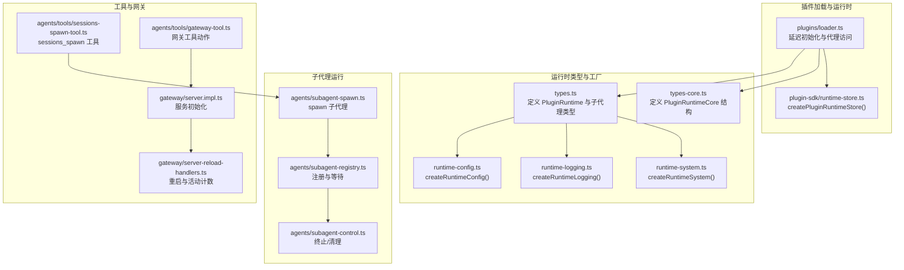
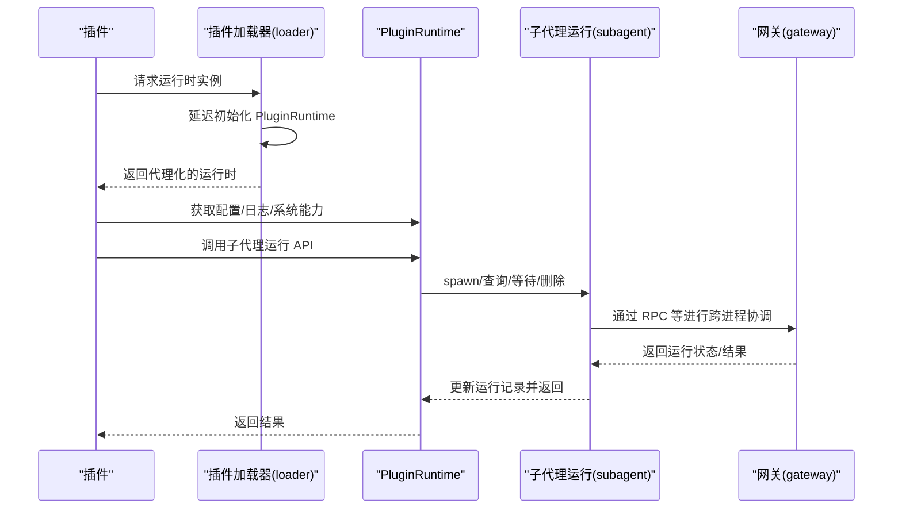
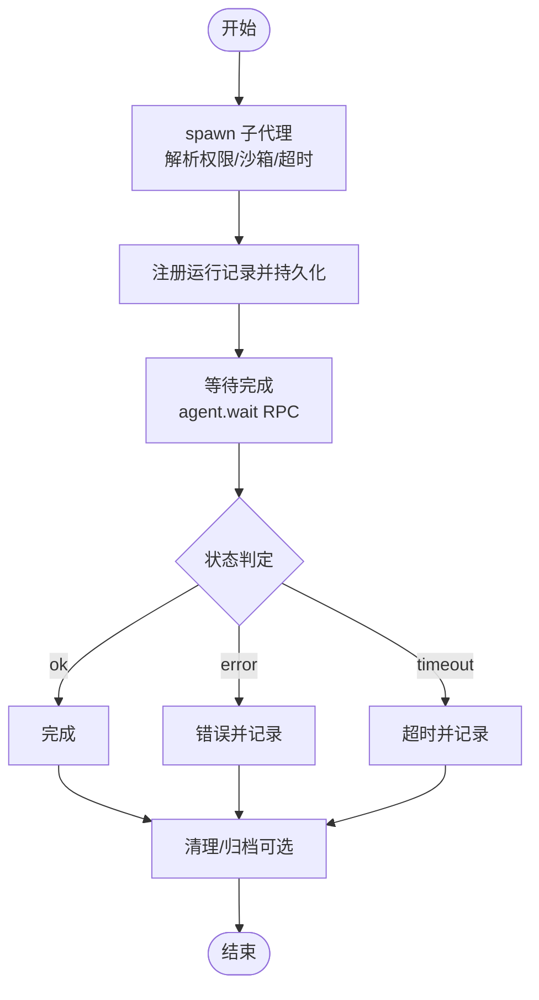
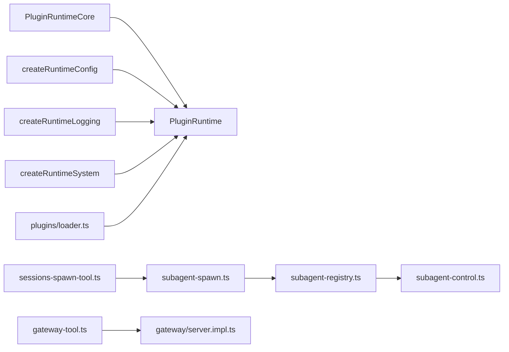

# 运行时API

<cite>
**本文引用的文件**
- [src/plugins/runtime/types.ts](file://src/plugins/runtime/types.ts)
- [src/plugins/runtime/types-core.ts](file://src/plugins/runtime/types-core.ts)
- [src/plugins/runtime/runtime-config.ts](file://src/plugins/runtime/runtime-config.ts)
- [src/plugins/runtime/runtime-logging.ts](file://src/plugins/runtime/runtime-logging.ts)
- [src/plugins/runtime/runtime-system.ts](file://src/plugins/runtime/runtime-system.ts)
- [src/plugin-sdk/runtime-store.ts](file://src/plugin-sdk/runtime-store.ts)
- [src/plugins/loader.ts](file://src/plugins/loader.ts)
- [src/agents/subagent-spawn.ts](file://src/agents/subagent-spawn.ts)
- [src/agents/subagent-registry.ts](file://src/agents/subagent-registry.ts)
- [src/agents/subagent-control.ts](file://src/agents/subagent-control.ts)
- [src/agents/tools/sessions-spawn-tool.ts](file://src/agents/tools/sessions-spawn-tool.ts)
- [src/agents/tools/sessions-spawn-tool.test.ts](file://src/agents/tools/sessions-spawn-tool.test.ts)
- [src/agents/tools/gateway-tool.ts](file://src/agents/tools/gateway-tool.ts)
- [src/gateway/server.impl.ts](file://src/gateway/server.impl.ts)
- [src/gateway/server-reload-handlers.ts](file://src/gateway/server-reload-handlers.ts)
- [src/cli/gateway-cli/run.ts](file://src/cli/gateway-cli/run.ts)
</cite>

## 目录
1. [简介](#简介)
2. [项目结构](#项目结构)
3. [核心组件](#核心组件)
4. [架构总览](#架构总览)
5. [详细组件分析](#详细组件分析)
6. [依赖关系分析](#依赖关系分析)
7. [性能考量](#性能考量)
8. [故障排查指南](#故障排查指南)
9. [结论](#结论)
10. [附录：实现示例与最佳实践](#附录实现示例与最佳实践)

## 简介
本文件为 OpenClaw 运行时 API 的完整参考文档，聚焦于插件运行时接口 PluginRuntime 的设计与使用。内容涵盖：
- PluginRuntime 接口的方法族：子代理运行（subagent）、会话管理、工具调用、配置与日志、系统能力、媒体与语音、事件订阅、状态路径解析、模型鉴权等。
- 运行时上下文获取与使用：getLogger()、getConfig()、getGateway() 等方法的正确姿势与适用场景。
- 子代理运行 API：SubagentRunParams、SubagentWaitParams 及相关结果类型。
- 运行时存储机制：createPluginRuntimeStore() 的使用场景与数据持久化策略。
- 生命周期管理：资源分配、清理与错误恢复。
- 调试与监控：日志记录与性能指标采集建议。
- 完整实现示例：如何在插件中正确使用运行时功能。

## 项目结构
围绕运行时 API 的关键文件组织如下：
- 类型定义：PluginRuntime 核心类型与子代理运行类型
- 运行时工厂与装配：各子域模块（config、logging、system 等）的 createRuntimeXxx 工厂函数
- 插件加载器：延迟初始化与代理访问 PluginRuntime
- 子代理运行链路：spawn、waitForRun、消息查询与删除
- 会话工具：sessions_spawn 工具与测试
- 网关集成：服务启动、TLS 加载、重启处理

图表来源
- [src/plugins/runtime/types.ts:51-63](file://src/plugins/runtime/types.ts#L51-L63)
- [src/plugins/runtime/types-core.ts:10-67](file://src/plugins/runtime/types-core.ts#L10-L67)
- [src/plugins/runtime/runtime-config.ts:4-8](file://src/plugins/runtime/runtime-config.ts#L4-L8)
- [src/plugins/runtime/runtime-logging.ts:6-20](file://src/plugins/runtime/runtime-logging.ts#L6-L20)
- [src/plugins/runtime/runtime-system.ts:7-13](file://src/plugins/runtime/runtime-system.ts#L7-L13)
- [src/plugins/loader.ts:470-502](file://src/plugins/loader.ts#L470-L502)
- [src/plugin-sdk/runtime-store.ts:1-26](file://src/plugin-sdk/runtime-store.ts#L1-L26)
- [src/agents/subagent-spawn.ts:286-365](file://src/agents/subagent-spawn.ts#L286-L365)
- [src/agents/subagent-registry.ts:1090-1256](file://src/agents/subagent-registry.ts#L1090-L1256)
- [src/agents/subagent-control.ts:331-371](file://src/agents/subagent-control.ts#L331-L371)
- [src/agents/tools/sessions-spawn-tool.ts:68-98](file://src/agents/tools/sessions-spawn-tool.ts#L68-L98)
- [src/agents/tools/gateway-tool.ts:173-210](file://src/agents/tools/gateway-tool.ts#L173-L210)
- [src/gateway/server.impl.ts:465-493](file://src/gateway/server.impl.ts#L465-L493)
- [src/gateway/server-reload-handlers.ts:158-201](file://src/gateway/server-reload-handlers.ts#L158-L201)

章节来源
- [src/plugins/runtime/types.ts:1-64](file://src/plugins/runtime/types.ts#L1-L64)
- [src/plugins/runtime/types-core.ts:1-68](file://src/plugins/runtime/types-core.ts#L1-L68)
- [src/plugins/runtime/runtime-config.ts:1-9](file://src/plugins/runtime/runtime-config.ts#L1-L9)
- [src/plugins/runtime/runtime-logging.ts:1-21](file://src/plugins/runtime/runtime-logging.ts#L1-L21)
- [src/plugins/runtime/runtime-system.ts:1-14](file://src/plugins/runtime/runtime-system.ts#L1-L14)
- [src/plugin-sdk/runtime-store.ts:1-27](file://src/plugin-sdk/runtime-store.ts#L1-L27)
- [src/plugins/loader.ts:470-507](file://src/plugins/loader.ts#L470-L507)

## 核心组件
- PluginRuntime 接口：由 PluginRuntimeCore 与扩展域组成，提供配置、系统、媒体、TTS/STT、工具、事件、日志、状态路径、模型鉴权等能力。
- 子代理运行域：提供 run、waitForRun、getSessionMessages、getSession（已废弃）、deleteSession 等方法。
- 运行时上下文：通过 createRuntimeConfig、createRuntimeLogging、createRuntimeSystem 等工厂函数装配；通过 createPluginRuntimeStore 提供运行时存储。
- 插件加载器：延迟初始化 PluginRuntime，并以 Proxy 暴露给插件注册流程，避免启动路径中过度加载依赖。

章节来源
- [src/plugins/runtime/types.ts:51-63](file://src/plugins/runtime/types.ts#L51-L63)
- [src/plugins/runtime/types-core.ts:10-67](file://src/plugins/runtime/types-core.ts#L10-L67)
- [src/plugins/runtime/runtime-config.ts:4-8](file://src/plugins/runtime/runtime-config.ts#L4-L8)
- [src/plugins/runtime/runtime-logging.ts:6-20](file://src/plugins/runtime/runtime-logging.ts#L6-L20)
- [src/plugins/runtime/runtime-system.ts:7-13](file://src/plugins/runtime/runtime-system.ts#L7-L13)
- [src/plugin-sdk/runtime-store.ts:1-26](file://src/plugin-sdk/runtime-store.ts#L1-L26)
- [src/plugins/loader.ts:470-502](file://src/plugins/loader.ts#L470-L502)

## 架构总览
下图展示了从插件到运行时、再到网关与系统组件的调用关系与职责边界。

图表来源
- [src/plugins/loader.ts:470-502](file://src/plugins/loader.ts#L470-L502)
- [src/agents/subagent-registry.ts:1209-1256](file://src/agents/subagent-registry.ts#L1209-L1256)
- [src/agents/subagent-spawn.ts:286-365](file://src/agents/subagent-spawn.ts#L286-L365)

## 详细组件分析

### PluginRuntime 接口与上下文
- 配置（config）：提供 loadConfig 与 writeConfigFile，用于读取与写入配置文件。
- 日志（logging）：提供 shouldLogVerbose 与 getChildLogger，支持按绑定与级别生成子日志器。
- 系统（system）：提供 enqueueSystemEvent、requestHeartbeatNow、runCommandWithTimeout、formatNativeDependencyHint 等系统级能力。
- 媒体（media）：提供 Web 媒体加载、MIME 检测、图像元数据、音频兼容性检测、图片压缩等能力。
- TTS/STT：提供电话级文本转语音与音频文件转录能力。
- 工具（tools）：提供内存检索工具与 CLI 注册能力。
- 事件（events）：提供代理事件与会话转录更新事件订阅。
- 状态（state）：提供状态目录解析能力。
- 模型鉴权（modelAuth）：提供按模型或提供商解析密钥的能力。

章节来源
- [src/plugins/runtime/types-core.ts:10-67](file://src/plugins/runtime/types-core.ts#L10-L67)
- [src/plugins/runtime/runtime-config.ts:4-8](file://src/plugins/runtime/runtime-config.ts#L4-L8)
- [src/plugins/runtime/runtime-logging.ts:6-20](file://src/plugins/runtime/runtime-logging.ts#L6-L20)
- [src/plugins/runtime/runtime-system.ts:7-13](file://src/plugins/runtime/runtime-system.ts#L7-L13)

### 子代理运行 API
- SubagentRunParams
  - sessionKey：目标会话键
  - message：要执行的任务消息
  - extraSystemPrompt：可选的额外系统提示
  - lane：可选的队列/通道标识
  - deliver：是否交付到通道
  - idempotencyKey：幂等键
- SubagentRunResult
  - runId：运行标识符
- SubagentWaitParams
  - runId：运行标识符
  - timeoutMs：可选超时毫秒数
- SubagentWaitResult
  - status：ok/error/timeout
  - error：可选错误信息
- SubagentGetSessionMessagesParams
  - sessionKey：会话键
  - limit：可选消息数量限制
- SubagentGetSessionMessagesResult
  - messages：消息数组
- SubagentDeleteSessionParams
  - sessionKey：会话键
  - deleteTranscript：可选是否同时删除转录

使用要点
- run 与 waitForRun：先发起一次 run，再根据 runId 使用 waitForRun 获取最终状态；若未设置超时，将依据配置默认值计算等待时间。
- getSessionMessages：用于读取会话最新消息，limit 控制返回条数。
- deleteSession：删除会话及可选转录，常用于清理临时会话。

章节来源
- [src/plugins/runtime/types.ts:8-49](file://src/plugins/runtime/types.ts#L8-L49)
- [src/agents/subagent-registry.ts:1209-1256](file://src/agents/subagent-registry.ts#L1209-L1256)
- [src/agents/subagent-spawn.ts:286-313](file://src/agents/subagent-spawn.ts#L286-L313)

### 运行时存储机制与生命周期
- createPluginRuntimeStore<T>(errorMessage)
  - setRuntime(next)：设置当前运行时实例
  - clearRuntime()：清空当前运行时
  - tryGetRuntime()：尝试获取运行时（可能为空）
  - getRuntime()：获取运行时，若不存在则抛出错误
  - 使用场景：插件在不同阶段保存/读取运行时上下文，确保线程安全与一致性。
- 生命周期管理
  - 资源分配：在插件初始化阶段调用 createPluginRuntimeStore 并注入运行时。
  - 清理：在插件卸载或会话结束时调用 clearRuntime。
  - 错误恢复：通过 tryGetRuntime 判断是否存在运行时，避免重复初始化；getRuntime 在缺失时抛错，便于快速失败定位问题。

章节来源
- [src/plugin-sdk/runtime-store.ts:1-26](file://src/plugin-sdk/runtime-store.ts#L1-L26)

### 插件加载与运行时装配
- 延迟初始化：插件加载器在首次访问时才创建 PluginRuntime，避免不必要的依赖加载。
- 代理访问：通过 Proxy 将所有属性访问转发至实际运行时，保证插件侧无需关心初始化时机。
- 工厂装配：各子域通过 createRuntimeConfig、createRuntimeLogging、createRuntimeSystem 等工厂函数装配到 PluginRuntime。

章节来源
- [src/plugins/loader.ts:470-502](file://src/plugins/loader.ts#L470-L502)
- [src/plugins/runtime/runtime-config.ts:4-8](file://src/plugins/runtime/runtime-config.ts#L4-L8)
- [src/plugins/runtime/runtime-logging.ts:6-20](file://src/plugins/runtime/runtime-logging.ts#L6-L20)
- [src/plugins/runtime/runtime-system.ts:7-13](file://src/plugins/runtime/runtime-system.ts#L7-L13)

### 子代理运行流程与错误处理
- spawn 子代理：根据请求者会话键与目标代理 ID 解析沙箱模式与权限，生成子代理会话键并创建运行记录。
- 等待完成：通过网关 RPC 调用 agent.wait，轮询运行状态，更新运行记录并持久化。
- 终止与清理：支持 killSubagentRun 终止运行、清理队列与标记终止状态。
- 超时与错误：waitForRun 返回 timeout 或 error，并记录对应错误信息；runTimeoutSeconds 可由参数或配置决定。

图表来源
- [src/agents/subagent-spawn.ts:286-365](file://src/agents/subagent-spawn.ts#L286-L365)
- [src/agents/subagent-registry.ts:1209-1256](file://src/agents/subagent-registry.ts#L1209-L1256)
- [src/agents/subagent-control.ts:331-371](file://src/agents/subagent-control.ts#L331-L371)

章节来源
- [src/agents/subagent-spawn.ts:286-365](file://src/agents/subagent-spawn.ts#L286-L365)
- [src/agents/subagent-registry.ts:1090-1256](file://src/agents/subagent-registry.ts#L1090-L1256)
- [src/agents/subagent-control.ts:331-371](file://src/agents/subagent-control.ts#L331-L371)

### 会话工具与网关交互
- sessions_spawn 工具：支持 runtime="subagent" 或 "acp"，mode="run" 一次性运行，"session" 持久化线程绑定；自动继承父工作区目录。
- 网关工具动作：支持 config.get、config.schema.lookup、config.apply、config.patch、update.run 等操作，用于配置读取与变更。

章节来源
- [src/agents/tools/sessions-spawn-tool.ts:68-98](file://src/agents/tools/sessions-spawn-tool.ts#L68-L98)
- [src/agents/tools/gateway-tool.ts:173-210](file://src/agents/tools/gateway-tool.ts#L173-L210)
- [src/agents/tools/sessions-spawn-tool.test.ts:1-46](file://src/agents/tools/sessions-spawn-tool.test.ts#L1-L46)

### 网关集成与重启处理
- 服务初始化：加载插件注册表、通道日志与运行时环境，合并基础与通道方法。
- TLS 加载：按配置加载网关 TLS 运行时。
- 重启处理：检测活动计数（队列、待回复、嵌入式运行），在有活动时延迟重启并记录详情。

章节来源
- [src/gateway/server.impl.ts:465-493](file://src/gateway/server.impl.ts#L465-L493)
- [src/gateway/server/tls.ts:9-14](file://src/gateway/server/tls.ts#L9-L14)
- [src/gateway/server-reload-handlers.ts:158-201](file://src/gateway/server-reload-handlers.ts#L158-L201)

## 依赖关系分析
- PluginRuntimeCore 作为基础能力集合，被 PluginRuntime 扩展；各工厂函数（config、logging、system）分别注入到 PluginRuntime 中。
- 插件加载器通过 Proxy 将运行时暴露给插件注册流程，避免启动路径中的过度依赖。
- 子代理运行链路依赖网关 RPC 协调跨进程状态，注册表负责持久化与状态更新。
- 会话工具与网关工具共同构成对外配置与运行控制的入口。

图表来源
- [src/plugins/runtime/types-core.ts:10-67](file://src/plugins/runtime/types-core.ts#L10-L67)
- [src/plugins/runtime/types.ts:51-63](file://src/plugins/runtime/types.ts#L51-L63)
- [src/plugins/runtime/runtime-config.ts:4-8](file://src/plugins/runtime/runtime-config.ts#L4-L8)
- [src/plugins/runtime/runtime-logging.ts:6-20](file://src/plugins/runtime/runtime-logging.ts#L6-L20)
- [src/plugins/runtime/runtime-system.ts:7-13](file://src/plugins/runtime/runtime-system.ts#L7-L13)
- [src/plugins/loader.ts:470-502](file://src/plugins/loader.ts#L470-L502)
- [src/agents/subagent-spawn.ts:286-365](file://src/agents/subagent-spawn.ts#L286-L365)
- [src/agents/subagent-registry.ts:1090-1256](file://src/agents/subagent-registry.ts#L1090-L1256)
- [src/agents/subagent-control.ts:331-371](file://src/agents/subagent-control.ts#L331-L371)
- [src/agents/tools/sessions-spawn-tool.ts:68-98](file://src/agents/tools/sessions-spawn-tool.ts#L68-L98)
- [src/agents/tools/gateway-tool.ts:173-210](file://src/agents/tools/gateway-tool.ts#L173-L210)
- [src/gateway/server.impl.ts:465-493](file://src/gateway/server.impl.ts#L465-L493)

## 性能考量
- 延迟初始化：插件加载器对 PluginRuntime 的延迟初始化可减少启动时的依赖加载开销。
- 超时与重试：waitForRun 的超时与重试预算由配置与运行参数共同决定，避免长时间阻塞。
- 活动计数与重启：在存在活动任务时延迟重启，减少中断影响。
- 媒体与语音：合理使用媒体工具与 STT/TTS 能力，避免频繁 I/O 与大文件处理。

## 故障排查指南
- 运行时缺失：使用 createPluginRuntimeStore.getRuntime 时若未设置运行时会抛错，检查插件初始化流程。
- 权限与沙箱：spawn 子代理时若目标代理不在允许列表或沙箱模式不匹配，会返回 forbidden，检查配置与权限。
- 等待超时：waitForRun 返回 timeout，确认 runTimeoutSeconds 设置与网关 RPC 是否可达。
- 终止与清理：killSubagentRun 成功后需检查会话队列清理与终止标记，避免残留状态。
- 网关重启：若配置变更触发重启，注意活动计数与延迟重启日志。

章节来源
- [src/plugin-sdk/runtime-store.ts:19-24](file://src/plugin-sdk/runtime-store.ts#L19-L24)
- [src/agents/subagent-spawn.ts:348-354](file://src/agents/subagent-spawn.ts#L348-L354)
- [src/agents/subagent-registry.ts:1209-1256](file://src/agents/subagent-registry.ts#L1209-L1256)
- [src/agents/subagent-control.ts:331-371](file://src/agents/subagent-control.ts#L331-L371)
- [src/gateway/server-reload-handlers.ts:189-201](file://src/gateway/server-reload-handlers.ts#L189-L201)

## 结论
PluginRuntime 为插件提供了统一、可扩展且强内聚的运行时能力集合。通过延迟初始化与工厂装配，既保证了启动性能，又确保了功能完整性。子代理运行 API 提供了从 spawn 到 waitForRun 的完整闭环，配合会话工具与网关交互，满足复杂场景下的运行与管理需求。结合运行时存储与生命周期管理，插件可在多变环境中保持稳定与可控。

## 附录：实现示例与最佳实践
- 获取运行时上下文
  - 使用 createPluginRuntimeStore 保存/读取运行时实例，避免重复初始化。
  - 通过 createRuntimeLogging.getChildLogger 生成子日志器，按模块/会话绑定日志上下文。
  - 通过 createRuntimeConfig.loadConfig 读取配置，writeConfigFile 写回配置。
- 子代理运行
  - 先调用 subagent.run 发起运行，再使用 subagent.waitForRun 获取结果；必要时设置 runTimeoutSeconds。
  - 使用 subagent.getSessionMessages 获取最新消息，limit 控制返回量。
  - 使用 subagent.deleteSession 删除会话与可选转录。
- 会话工具与网关
  - 使用 sessions_spawn 工具选择 runtime 与 mode，自动继承父工作区目录。
  - 使用网关工具动作进行配置读取与变更，注意参数校验与错误处理。
- 生命周期与错误恢复
  - 初始化阶段设置运行时，卸载或会话结束时清理运行时。
  - 对超时与错误进行分类处理，必要时重试或降级。
- CLI 与网关
  - 在开发模式下使用 --dev 与 --reset 等选项，结合日志与活动计数进行排障。

章节来源
- [src/plugin-sdk/runtime-store.ts:1-26](file://src/plugin-sdk/runtime-store.ts#L1-L26)
- [src/plugins/runtime/runtime-logging.ts:6-20](file://src/plugins/runtime/runtime-logging.ts#L6-L20)
- [src/plugins/runtime/runtime-config.ts:4-8](file://src/plugins/runtime/runtime-config.ts#L4-L8)
- [src/agents/subagent-spawn.ts:286-365](file://src/agents/subagent-spawn.ts#L286-L365)
- [src/agents/subagent-registry.ts:1209-1256](file://src/agents/subagent-registry.ts#L1209-L1256)
- [src/agents/tools/sessions-spawn-tool.ts:68-98](file://src/agents/tools/sessions-spawn-tool.ts#L68-L98)
- [src/agents/tools/gateway-tool.ts:173-210](file://src/agents/tools/gateway-tool.ts#L173-L210)
- [src/cli/gateway-cli/run.ts:139-167](file://src/cli/gateway-cli/run.ts#L139-L167)