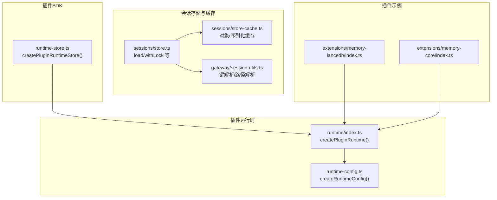
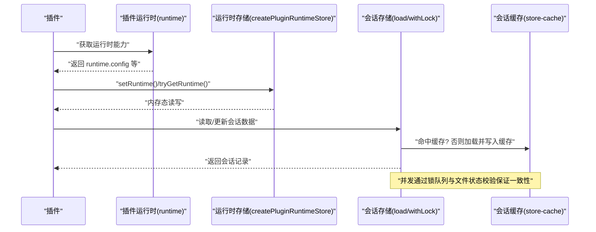
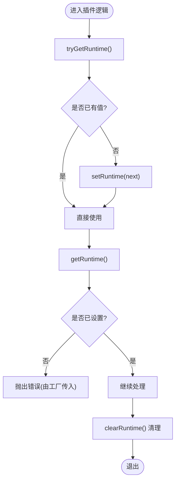
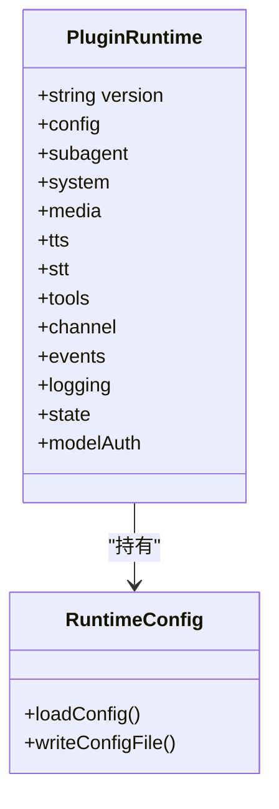
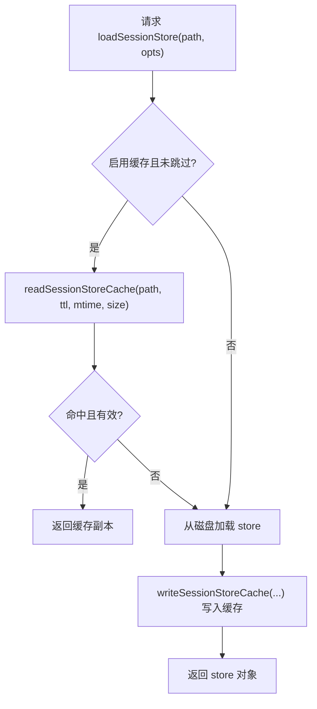
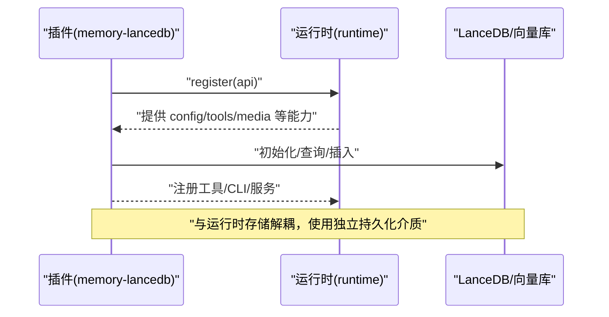
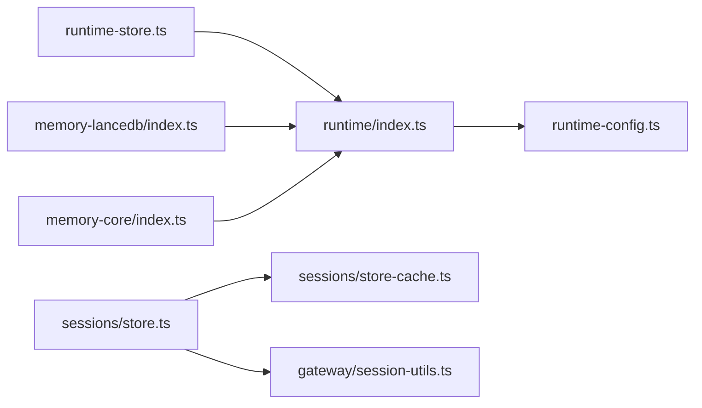

# 运行时存储

<cite>
**本文引用的文件**
- [runtime-store.ts](file://src/plugin-sdk/runtime-store.ts)
- [runtime.ts](file://src/plugins/runtime/index.ts)
- [runtime-config.ts](file://src/plugins/runtime/runtime-config.ts)
- [store.ts](file://src/config/sessions/store.ts)
- [store-cache.ts](file://src/config/sessions/store-cache.ts)
- [session-utils.ts](file://src/gateway/session-utils.ts)
- [memory-lancedb/index.ts](file://extensions/memory-lancedb/index.ts)
- [memory-core/index.ts](file://extensions/memory-core/index.ts)
</cite>

## 目录
1. [简介](#简介)
2. [项目结构](#项目结构)
3. [核心组件](#核心组件)
4. [架构总览](#架构总览)
5. [详细组件分析](#详细组件分析)
6. [依赖关系分析](#依赖关系分析)
7. [性能考量](#性能考量)
8. [故障排查指南](#故障排查指南)
9. [结论](#结论)
10. [附录：使用示例与最佳实践](#附录使用示例与最佳实践)

## 简介
本文件聚焦于 OpenClaw 的“运行时存储”机制，系统性阐述以下主题：
- createPluginRuntimeStore() 函数的用法与数据持久化策略
- 运行时存储的数据结构、访问模式与生命周期管理
- 存储键值的命名规范与数据组织方式
- 数据序列化与反序列化的最佳实践
- 并发访问控制与线程安全机制
- 性能优化与缓存策略
- 在插件中实现数据持久化的完整使用示例

## 项目结构
围绕运行时存储的相关代码主要分布在如下位置：
- 插件 SDK 层：提供 createPluginRuntimeStore() 工厂函数，用于创建轻量内存态的运行时存储实例
- 插件运行时层：聚合各类运行时能力（配置、事件、工具、日志等），并暴露给插件使用
- 会话存储与缓存：面向会话级数据的加载、缓存与并发保护
- 插件示例：memory-lancedb 与 memory-core 展示了如何在插件中使用运行时能力与持久化

**图表来源**
- [runtime-store.ts:1-27](file://src/plugin-sdk/runtime-store.ts#L1-L27)
- [runtime.ts:1-90](file://src/plugins/runtime/index.ts#L1-L90)
- [runtime-config.ts:1-9](file://src/plugins/runtime/runtime-config.ts#L1-L9)
- [store.ts:195-211](file://src/config/sessions/store.ts#L195-L211)
- [store-cache.ts:1-81](file://src/config/sessions/store-cache.ts#L1-L81)
- [session-utils.ts:480-503](file://src/gateway/session-utils.ts#L480-L503)
- [memory-lancedb/index.ts:1-679](file://extensions/memory-lancedb/index.ts#L1-L679)
- [memory-core/index.ts:1-39](file://extensions/memory-core/index.ts#L1-L39)

**章节来源**
- [runtime-store.ts:1-27](file://src/plugin-sdk/runtime-store.ts#L1-L27)
- [runtime.ts:1-90](file://src/plugins/runtime/index.ts#L1-L90)
- [runtime-config.ts:1-9](file://src/plugins/runtime/runtime-config.ts#L1-L9)
- [store.ts:195-211](file://src/config/sessions/store.ts#L195-L211)
- [store-cache.ts:1-81](file://src/config/sessions/store-cache.ts#L1-L81)
- [session-utils.ts:480-503](file://src/gateway/session-utils.ts#L480-L503)
- [memory-lancedb/index.ts:1-679](file://extensions/memory-lancedb/index.ts#L1-L679)
- [memory-core/index.ts:1-39](file://extensions/memory-core/index.ts#L1-L39)

## 核心组件
- 运行时存储工厂：createPluginRuntimeStore<T>(errorMessage) 返回一组操作器，用于在插件运行时内保存/读取/清理一个类型安全的对象实例。该存储为进程内内存态，不涉及磁盘持久化。
- 插件运行时：createPluginRuntime() 聚合配置、事件、工具、媒体、日志、子代理等能力，并通过 runtime.config 等接口与外部持久化系统交互。
- 会话存储与缓存：提供会话级数据的加载、缓存、并发锁队列与序列化支持，确保多请求下的数据一致性与性能。

**章节来源**
- [runtime-store.ts:1-27](file://src/plugin-sdk/runtime-store.ts#L1-L27)
- [runtime.ts:52-87](file://src/plugins/runtime/index.ts#L52-L87)
- [store.ts:195-211](file://src/config/sessions/store.ts#L195-L211)
- [store-cache.ts:1-81](file://src/config/sessions/store-cache.ts#L1-L81)

## 架构总览
下图展示了从插件调用到运行时存储再到会话存储的整体流程，以及并发控制与缓存策略的协作关系。

**图表来源**
- [runtime.ts:52-87](file://src/plugins/runtime/index.ts#L52-L87)
- [runtime-store.ts:1-27](file://src/plugin-sdk/runtime-store.ts#L1-L27)
- [store.ts:195-211](file://src/config/sessions/store.ts#L195-L211)
- [store-cache.ts:41-81](file://src/config/sessions/store-cache.ts#L41-L81)

## 详细组件分析

### 组件A：运行时存储工厂 createPluginRuntimeStore()
- 角色定位：为插件提供轻量内存态的“运行时上下文”容器，适合存放当前请求或当前插件生命周期内的临时状态。
- 数据结构：内部以可选泛型 T 的单值变量保存状态；对外暴露 set/clear/tryGet/get 四个操作器。
- 访问模式：
  - tryGetRuntime()：非阻塞读取，适合快速分支判断
  - getRuntime()：若未初始化则抛出错误，适合强约束场景
  - setRuntime()/clearRuntime()：写入与清理
- 生命周期：随插件注册/请求周期存在，进程重启后丢失；不参与磁盘持久化。
- 使用建议：仅存放短期状态；如需跨请求持久化，请结合 runtime.config 或会话存储模块。

**图表来源**
- [runtime-store.ts:1-27](file://src/plugin-sdk/runtime-store.ts#L1-L27)

**章节来源**
- [runtime-store.ts:1-27](file://src/plugin-sdk/runtime-store.ts#L1-L27)

### 组件B：插件运行时 createPluginRuntime()
- 能力聚合：版本信息、配置读写、子代理、系统、媒体、TTS/STT、工具、通道、事件、日志、状态目录解析、模型鉴权等。
- 与运行时存储的关系：运行时存储是“内存态”，而运行时通过 runtime.config 提供与磁盘/配置系统的桥接，实现真正的持久化。
- 与会话存储的关系：会话存储位于配置层，运行时通过其提供的 loadConfig/writeConfigFile 等接口间接影响持久化行为。

**图表来源**
- [runtime.ts:52-87](file://src/plugins/runtime/index.ts#L52-L87)
- [runtime-config.ts:4-9](file://src/plugins/runtime/runtime-config.ts#L4-L9)

**章节来源**
- [runtime.ts:52-87](file://src/plugins/runtime/index.ts#L52-L87)
- [runtime-config.ts:1-9](file://src/plugins/runtime/runtime-config.ts#L1-L9)

### 组件C：会话存储与缓存（面向磁盘的持久化）
- 加载与缓存：
  - loadSessionStore() 支持跳过缓存选项，优先从缓存读取；缓存项包含时间戳与大小，用于失效校验。
  - readSessionStoreCache()/writeSessionStoreCache() 提供对象缓存与序列化缓存双层缓存。
- 并发控制：
  - withSessionStoreLockForTest()/withSessionStoreLock() 提供锁队列，避免并发写导致的竞态。
  - 文件状态快照（mtime/size）用于缓存有效性校验。
- 键值与路径：
  - resolveGatewaySessionStoreTarget() 将输入 key 规范化为 canonicalKey，并解析 agentId 与 storePath。
  - 支持大小写不敏感匹配与遗留键扫描，便于迁移与兼容。

**图表来源**
- [store.ts:195-211](file://src/config/sessions/store.ts#L195-L211)
- [store-cache.ts:41-81](file://src/config/sessions/store-cache.ts#L41-L81)

**章节来源**
- [store.ts:195-211](file://src/config/sessions/store.ts#L195-L211)
- [store-cache.ts:1-81](file://src/config/sessions/store-cache.ts#L1-L81)
- [session-utils.ts:480-503](file://src/gateway/session-utils.ts#L480-L503)

### 组件D：插件中的持久化实践（示例）
- memory-lancedb：演示了如何在插件注册阶段创建数据库连接与表结构，以及在生命周期钩子中进行自动回忆与自动捕获。该插件侧重于向量数据库的长期记忆能力，但其持久化路径与运行时存储不同，属于独立的外部存储。
- memory-core：作为核心内存插件，展示了如何通过运行时工具注册 CLI 与工具，强调了运行时能力对插件生态的支持。

**图表来源**
- [memory-lancedb/index.ts:292-679](file://extensions/memory-lancedb/index.ts#L292-L679)
- [runtime.ts:52-87](file://src/plugins/runtime/index.ts#L52-L87)

**章节来源**
- [memory-lancedb/index.ts:1-679](file://extensions/memory-lancedb/index.ts#L1-L679)
- [memory-core/index.ts:1-39](file://extensions/memory-core/index.ts#L1-L39)
- [runtime.ts:52-87](file://src/plugins/runtime/index.ts#L52-L87)

## 依赖关系分析
- 运行时存储工厂与插件运行时：运行时存储为运行时能力的一部分，但不承担持久化职责；持久化由运行时的配置接口与会话存储共同完成。
- 会话存储与缓存：会话存储模块依赖缓存模块进行性能优化；同时通过文件状态校验与锁队列保障并发安全。
- 插件示例：memory-lancedb 与 memory-core 展示了如何在插件中组合使用运行时能力与外部持久化方案。

**图表来源**
- [runtime-store.ts:1-27](file://src/plugin-sdk/runtime-store.ts#L1-L27)
- [runtime.ts:1-90](file://src/plugins/runtime/index.ts#L1-L90)
- [runtime-config.ts:1-9](file://src/plugins/runtime/runtime-config.ts#L1-L9)
- [store.ts:195-211](file://src/config/sessions/store.ts#L195-L211)
- [store-cache.ts:1-81](file://src/config/sessions/store-cache.ts#L1-L81)
- [session-utils.ts:480-503](file://src/gateway/session-utils.ts#L480-L503)
- [memory-lancedb/index.ts:1-679](file://extensions/memory-lancedb/index.ts#L1-L679)
- [memory-core/index.ts:1-39](file://extensions/memory-core/index.ts#L1-L39)

**章节来源**
- [runtime-store.ts:1-27](file://src/plugin-sdk/runtime-store.ts#L1-L27)
- [runtime.ts:1-90](file://src/plugins/runtime/index.ts#L1-L90)
- [runtime-config.ts:1-9](file://src/plugins/runtime/runtime-config.ts#L1-L9)
- [store.ts:195-211](file://src/config/sessions/store.ts#L195-L211)
- [store-cache.ts:1-81](file://src/config/sessions/store-cache.ts#L1-L81)
- [session-utils.ts:480-503](file://src/gateway/session-utils.ts#L480-L503)
- [memory-lancedb/index.ts:1-679](file://extensions/memory-lancedb/index.ts#L1-L679)
- [memory-core/index.ts:1-39](file://extensions/memory-core/index.ts#L1-L39)

## 性能考量
- 缓存策略
  - 对象缓存与序列化缓存双层缓存，按 TTL 与文件元信息校验失效，减少重复解析与 IO。
  - 建议：合理设置 TTL，避免过长导致脏读，或过短导致频繁 IO。
- 并发控制
  - 使用锁队列与文件状态快照，确保同一 storePath 的并发写入不会互相覆盖。
  - 建议：在高并发场景下，尽量合并写入批次，降低锁竞争。
- 序列化与传输
  - 避免传输不可克隆的结构（如 TypedArray），应在序列化前剥离或转换。
  - 建议：对大对象采用分页/流式处理，减少一次性序列化开销。
- 生命周期管理
  - 运行时存储仅适用于短期状态；长期数据应落盘至会话存储或外部持久化介质。
  - 建议：在插件生命周期钩子中进行必要的持久化与清理。

[本节为通用指导，无需特定文件来源]

## 故障排查指南
- 运行时存储未初始化
  - 现象：调用 getRuntime() 抛错
  - 排查：确认是否先执行 setRuntime()；或改用 tryGetRuntime() 进行安全读取
  - 参考：[runtime-store.ts:19-24](file://src/plugin-sdk/runtime-store.ts#L19-L24)
- 会话存储缓存异常
  - 现象：读取到旧数据或缓存未生效
  - 排查：检查 TTL 设置、文件 mtime/size 是否变化；必要时禁用缓存或手动失效缓存
  - 参考：[store.ts:195-211](file://src/config/sessions/store.ts#L195-L211)、[store-cache.ts:41-81](file://src/config/sessions/store-cache.ts#L41-L81)
- 并发写入冲突
  - 现象：数据被覆盖或损坏
  - 排查：确认使用带锁的写入流程；检查锁队列状态与文件状态校验
  - 参考：[store.ts:195-211](file://src/config/sessions/store.ts#L195-L211)
- 键值规范问题
  - 现象：找不到会话或键值不一致
  - 排查：使用键解析与规范化流程，确保 canonicalKey 与 storePath 正确
  - 参考：[session-utils.ts:480-503](file://src/gateway/session-utils.ts#L480-L503)

**章节来源**
- [runtime-store.ts:19-24](file://src/plugin-sdk/runtime-store.ts#L19-L24)
- [store.ts:195-211](file://src/config/sessions/store.ts#L195-L211)
- [store-cache.ts:41-81](file://src/config/sessions/store-cache.ts#L41-L81)
- [session-utils.ts:480-503](file://src/gateway/session-utils.ts#L480-L503)

## 结论
- 运行时存储（createPluginRuntimeStore）提供轻量内存态的运行时上下文，适合短期状态管理；持久化应通过运行时的配置接口与会话存储模块完成。
- 会话存储具备完善的缓存与并发控制机制，配合键值规范化与路径解析，确保数据一致性与性能。
- 插件开发中应遵循“短期状态用运行时存储，长期数据走会话存储/外部持久化”的原则，并结合缓存与并发策略提升整体稳定性与吞吐。

[本节为总结性内容，无需特定文件来源]

## 附录：使用示例与最佳实践

### 示例一：使用运行时存储（短期状态）
- 场景：在一次请求中缓存中间结果，避免重复计算
- 步骤：
  - 创建运行时存储实例
  - 在处理前尝试读取，若无则计算并 setRuntime
  - 处理完成后根据需要清理 clearRuntime
- 参考路径：
  - [runtime-store.ts:1-27](file://src/plugin-sdk/runtime-store.ts#L1-L27)

**章节来源**
- [runtime-store.ts:1-27](file://src/plugin-sdk/runtime-store.ts#L1-L27)

### 示例二：使用运行时配置接口进行持久化
- 场景：在插件中读取/写入配置文件，实现数据持久化
- 步骤：
  - 通过运行时获取配置接口
  - 使用 loadConfig 读取配置
  - 使用 writeConfigFile 写回配置
- 参考路径：
  - [runtime.ts:52-87](file://src/plugins/runtime/index.ts#L52-L87)
  - [runtime-config.ts:4-9](file://src/plugins/runtime/runtime-config.ts#L4-L9)

**章节来源**
- [runtime.ts:52-87](file://src/plugins/runtime/index.ts#L52-L87)
- [runtime-config.ts:1-9](file://src/plugins/runtime/runtime-config.ts#L1-L9)

### 示例三：在插件中实现自动回忆与自动捕获（LanceDB）
- 场景：基于生命周期钩子自动注入/捕获对话记忆
- 步骤：
  - 注册 before_agent_start 与 agent_end 钩子
  - 在钩子中调用嵌入模型生成向量并查询/存储
  - 注意序列化剥离与去重校验
- 参考路径：
  - [memory-lancedb/index.ts:546-658](file://extensions/memory-lancedb/index.ts#L546-L658)

**章节来源**
- [memory-lancedb/index.ts:546-658](file://extensions/memory-lancedb/index.ts#L546-L658)

### 最佳实践清单
- 数据结构
  - 短期状态：使用运行时存储；长期数据：使用会话存储或外部持久化
  - 避免在持久化对象中携带不可克隆字段（如 TypedArray）
- 访问模式
  - tryGetRuntime() 用于快速分支；getRuntime() 用于强约束场景
  - 会话存储读取建议开启缓存，写入使用带锁流程
- 命名规范与组织
  - 键值规范化：统一使用 canonicalKey，避免大小写差异
  - 路径解析：依据 agentId 与 store 配置解析最终存储路径
- 并发与安全
  - 使用锁队列与文件状态校验，防止并发写入冲突
  - 在高并发场景合并写入批次，降低锁竞争
- 性能优化
  - 合理设置缓存 TTL，平衡新鲜度与性能
  - 对大对象采用分页/流式处理，减少一次性序列化成本

[本节为通用指导，无需特定文件来源]