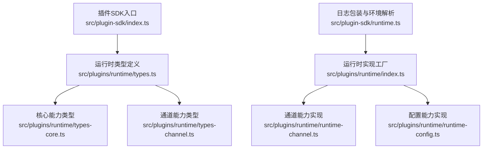
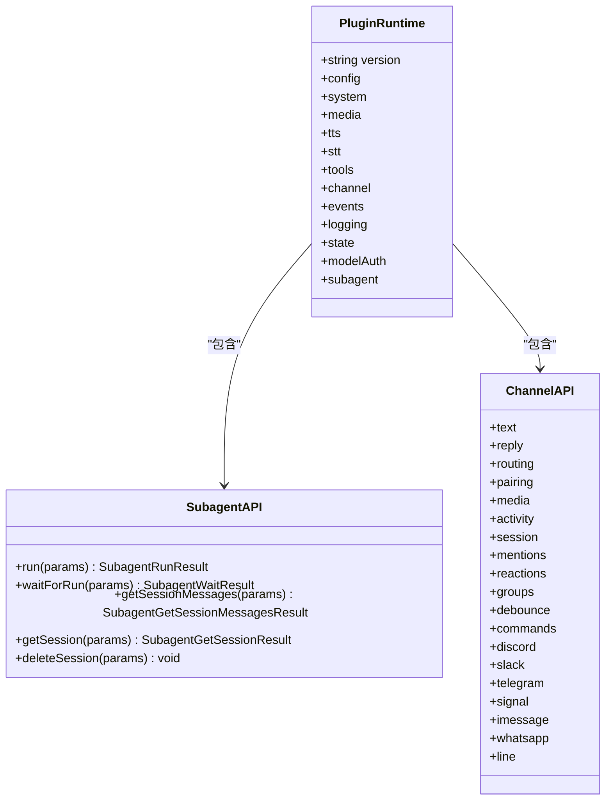
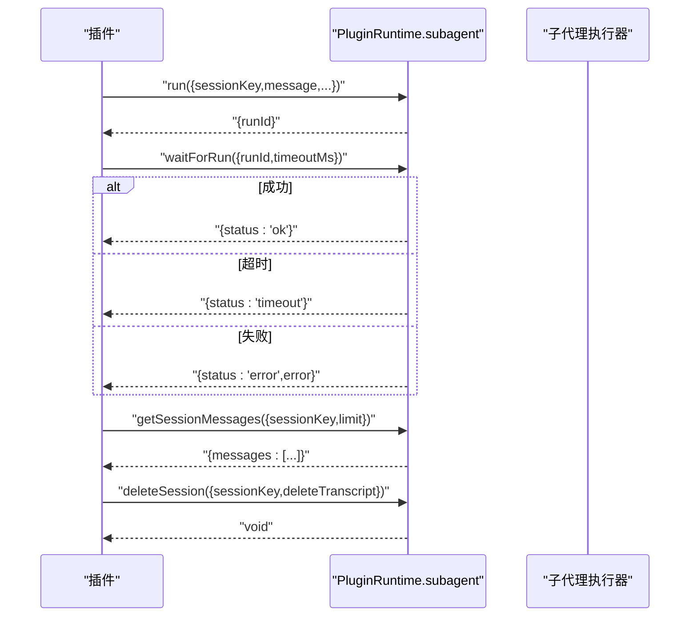
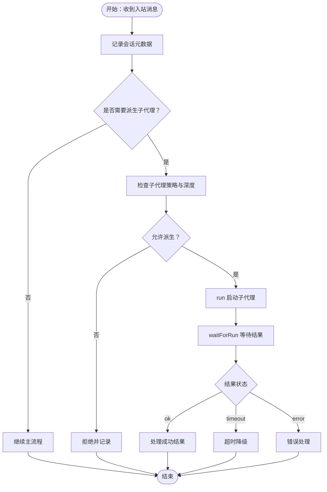
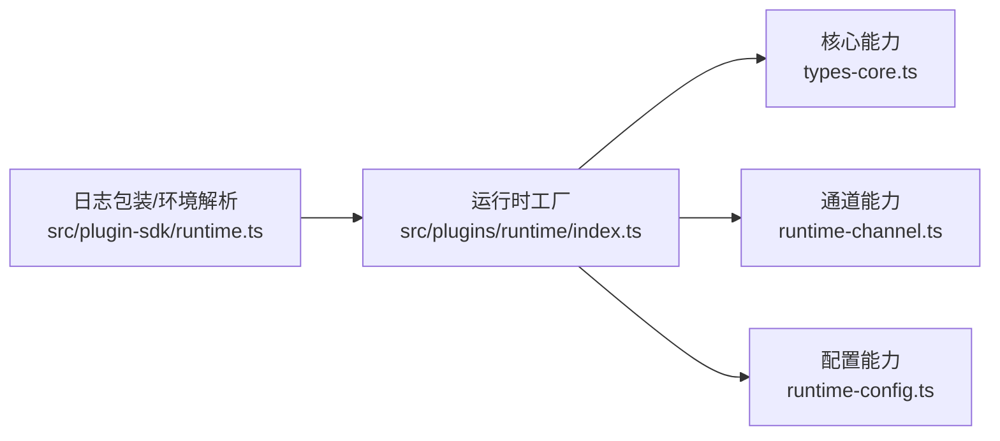

# 运行时接口

<cite>
**本文引用的文件**
- [src/plugin-sdk/index.ts](file://src/plugin-sdk/index.ts)
- [src/plugins/runtime/types.ts](file://src/plugins/runtime/types.ts)
- [src/plugins/runtime/types-core.ts](file://src/plugins/runtime/types-core.ts)
- [src/plugins/runtime/types-channel.ts](file://src/plugins/runtime/types-channel.ts)
- [src/plugins/runtime/index.ts](file://src/plugins/runtime/index.ts)
- [src/plugins/runtime/runtime-channel.ts](file://src/plugins/runtime/runtime-channel.ts)
- [src/plugins/runtime/runtime-config.ts](file://src/plugins/runtime/runtime-config.ts)
- [src/plugin-sdk/runtime.ts](file://src/plugin-sdk/runtime.ts)
- [src/plugins/hooks.ts](file://src/plugins/hooks.ts)
- [src/agents/subagent-spawn.ts](file://src/agents/subagent-spawn.ts)
- [src/agents/subagent-lifecycle-events.ts](file://src/agents/subagent-lifecycle-events.ts)
- [src/agents/subagent-capabilities.ts](file://src/agents/subagent-capabilities.ts)
</cite>

## 目录
1. [简介](#简介)
2. [项目结构](#项目结构)
3. [核心组件](#核心组件)
4. [架构总览](#架构总览)
5. [详细组件分析](#详细组件分析)
6. [依赖关系分析](#依赖关系分析)
7. [性能考量](#性能考量)
8. [故障排查指南](#故障排查指南)
9. [结论](#结论)
10. [附录](#附录)

## 简介
本文件为 OpenClaw 插件运行时接口（PluginRuntime）的权威 API 文档，聚焦于插件在网关请求生命周期内可使用的运行时能力，涵盖子代理运行、会话管理、工具调用与配置访问等核心功能。文档将逐项说明 PluginRuntime 接口的公共方法、参数类型、返回值、典型使用场景，并给出错误处理与异常流程的说明。同时，提供上下文获取方法（如 getLogger、getConfig、getGateway 等）的使用说明与示例路径，帮助插件开发者正确实现与集成。

## 项目结构
围绕 PluginRuntime 的相关源码主要分布在以下模块：
- 插件 SDK 导出入口：统一导出 PluginRuntime 类型与常用工具
- 运行时类型定义：核心能力、通道能力、子代理能力的类型声明
- 运行时实现：按能力域拆分的工厂函数，组合成完整的 PluginRuntime 实例
- 上下文与环境：日志包装器与运行时环境解析工具
- 子代理生命周期与策略：与子代理运行相关的钩子与权限控制

**图表来源**
- [src/plugin-sdk/index.ts:113-124](file://src/plugin-sdk/index.ts#L113-L124)
- [src/plugins/runtime/types.ts:51-63](file://src/plugins/runtime/types.ts#L51-L63)
- [src/plugins/runtime/types-core.ts:10-67](file://src/plugins/runtime/types-core.ts#L10-L67)
- [src/plugins/runtime/types-channel.ts:16-165](file://src/plugins/runtime/types-channel.ts#L16-L165)
- [src/plugins/runtime/index.ts:52-87](file://src/plugins/runtime/index.ts#L52-L87)
- [src/plugins/runtime/runtime-channel.ts:119-264](file://src/plugins/runtime/runtime-channel.ts#L119-L264)
- [src/plugins/runtime/runtime-config.ts:4-9](file://src/plugins/runtime/runtime-config.ts#L4-L9)
- [src/plugin-sdk/runtime.ts:9-44](file://src/plugin-sdk/runtime.ts#L9-L44)

**章节来源**
- [src/plugin-sdk/index.ts:113-124](file://src/plugin-sdk/index.ts#L113-L124)
- [src/plugins/runtime/types.ts:51-63](file://src/plugins/runtime/types.ts#L51-L63)
- [src/plugins/runtime/index.ts:52-87](file://src/plugins/runtime/index.ts#L52-L87)

## 核心组件
- PluginRuntime：插件在网关请求期间可用的统一运行时对象，包含版本信息、核心系统能力、媒体与语音能力、工具能力、事件订阅、日志、状态目录解析、模型认证等。
- 子代理能力（subagent.*）：用于在当前会话上下文中启动子代理任务、等待执行结果、查询会话消息、删除会话等。
- 通道能力（channel.*）：文本切分、回复派发、路由、配对、媒体下载与保存、会话元数据记录、提及与反应、群组策略、去抖动、命令授权、各渠道发送与监控等。
- 配置能力（config.*）：加载与写入配置文件。
- 日志能力（logging.*）：基础日志与子日志器创建。
- 系统能力（system.*）：系统事件入队、心跳触发、命令执行、原生依赖提示格式化。
- 媒体与语音（media.* / tts / stt）：远程媒体抓取、MIME 检测、媒体种类判定、音频兼容性、图像元数据、图片压缩、TTS、STT。
- 工具能力（tools.*）：内存检索工具与 CLI 注册。
- 事件（events.*）：代理事件与会话转录更新事件订阅。
- 模型认证（modelAuth.*）：按模型或提供商解析 API Key。

**章节来源**
- [src/plugins/runtime/types-core.ts:10-67](file://src/plugins/runtime/types-core.ts#L10-L67)
- [src/plugins/runtime/types-channel.ts:16-165](file://src/plugins/runtime/types-channel.ts#L16-L165)
- [src/plugins/runtime/types.ts:51-63](file://src/plugins/runtime/types.ts#L51-L63)

## 架构总览
PluginRuntime 是一个“能力聚合器”，通过工厂函数将各子系统的实现注入到统一接口中。其关键约束是：子代理能力仅在“网关请求期间”可用；否则会抛出不可用错误。通道能力按渠道进行模块化封装，便于插件按需调用。

**图表来源**
- [src/plugins/runtime/types.ts:51-63](file://src/plugins/runtime/types.ts#L51-L63)
- [src/plugins/runtime/types-channel.ts:16-165](file://src/plugins/runtime/types-channel.ts#L16-L165)

## 详细组件分析

### 子代理运行（subagent.*）
- run(params)
  - 参数：sessionKey（会话键）、message（消息内容）、extraSystemPrompt（可选附加系统提示）、lane（可选队列标识）、deliver（是否直接投递）、idempotencyKey（幂等键）
  - 返回：runId（运行标识）
  - 使用场景：在当前会话上下文中启动一次子代理任务，通常用于派生子任务或并行处理
  - 错误与限制：若非网关请求期间调用，将抛出“仅在网关请求期间可用”的错误
- waitForRun(params)
  - 参数：runId（由 run 返回）、timeoutMs（可选超时毫秒）
  - 返回：status（ok/error/timeout）、error（可选错误信息）
  - 使用场景：阻塞等待子代理任务完成或超时
- getSessionMessages(params)
  - 参数：sessionKey、limit（可选条数限制）
  - 返回：messages（消息数组）
  - 使用场景：读取指定会话的历史消息列表
- getSession(params) [已弃用]
  - 行为等价于 getSessionMessages
- deleteSession(params)
  - 参数：sessionKey、deleteTranscript（可选是否删除转录）
  - 返回：void
  - 使用场景：清理会话及其可选转录数据

**图表来源**
- [src/plugins/runtime/types.ts:8-49](file://src/plugins/runtime/types.ts#L8-L49)
- [src/plugins/runtime/index.ts:35-46](file://src/plugins/runtime/index.ts#L35-L46)

**章节来源**
- [src/plugins/runtime/types.ts:8-49](file://src/plugins/runtime/types.ts#L8-L49)
- [src/plugins/runtime/index.ts:35-46](file://src/plugins/runtime/index.ts#L35-L46)

### 会话管理（channel.session.*）
- resolveStorePath：解析会话存储路径
- readSessionUpdatedAt：读取会话最后更新时间
- recordSessionMetaFromInbound：基于入站消息记录会话元数据
- recordInboundSession：记录入站会话
- updateLastRoute：更新最近路由信息

典型使用场景：
- 在收到入站消息后，先记录会话元数据，再进行业务处理
- 查询会话最近更新时间，用于会话修剪或过期判断

**章节来源**
- [src/plugins/runtime/types-channel.ts:59-65](file://src/plugins/runtime/types-channel.ts#L59-L65)
- [src/plugins/runtime/runtime-channel.ts:172-178](file://src/plugins/runtime/runtime-channel.ts#L172-L178)

### 工具调用（tools.*）
- createMemoryGetTool：创建内存检索工具
- createMemorySearchTool：创建内存搜索工具
- registerMemoryCli：注册内存相关 CLI 命令

使用场景：
- 在插件中暴露内存检索能力给用户或自动化流程
- 通过 CLI 快速调试与验证内存工具行为

**章节来源**
- [src/plugins/runtime/types-core.ts:36-40](file://src/plugins/runtime/types-core.ts#L36-L40)

### 配置访问（config.*）
- loadConfig：加载配置
- writeConfigFile：写入配置文件

使用场景：
- 动态读取或修改 OpenClaw 配置（谨慎使用，遵循安全策略）

**章节来源**
- [src/plugins/runtime/types-core.ts:12-15](file://src/plugins/runtime/types-core.ts#L12-L15)
- [src/plugins/runtime/runtime-config.ts:4-9](file://src/plugins/runtime/runtime-config.ts#L4-L9)

### 上下文获取方法与使用示例
- getLogger（日志）
  - 作用：获取运行时日志器，支持 info/warn/error 等级别，以及可选元数据
  - 获取方式：通过运行时环境解析工具 resolveRuntimeEnv 或 createLoggerBackedRuntime 包装已有 Logger
  - 示例路径：[示例路径:9-32](file://src/plugin-sdk/runtime.ts#L9-L32)
- getConfig（配置）
  - 作用：通过 PluginRuntime.config 访问 loadConfig/writeConfigFile
  - 示例路径：[示例路径:4-9](file://src/plugins/runtime/runtime-config.ts#L4-L9)
- getGateway（网关上下文）
  - 说明：PluginRuntime 本身即网关请求期间的上下文载体；可通过运行时环境解析工具获得统一的日志与退出语义
  - 示例路径：[示例路径:26-44](file://src/plugin-sdk/runtime.ts#L26-L44)

注意：上述方法均在运行时环境中生效，且遵循 OpenClaw 的日志与错误处理约定。

**章节来源**
- [src/plugin-sdk/runtime.ts:9-44](file://src/plugin-sdk/runtime.ts#L9-L44)
- [src/plugins/runtime/runtime-config.ts:4-9](file://src/plugins/runtime/runtime-config.ts#L4-L9)

### 错误处理与异常情况
- 子代理能力不可用
  - 触发条件：在非网关请求期间调用 subagent.* 方法
  - 行为：抛出“仅在网关请求期间可用”的错误
  - 防护建议：在插件生命周期钩子中仅在请求回调中调用
  - 参考：[不可用子代理运行时实现:35-46](file://src/plugins/runtime/index.ts#L35-L46)
- 子代理等待超时/失败
  - waitForRun 返回 status 为 timeout/error 时，插件应根据 error 字段进行降级处理
  - 参考：[等待结果类型定义:21-29](file://src/plugins/runtime/types.ts#L21-L29)
- 会话不存在或权限不足
  - 删除会话时若传入非法 sessionKey，底层实现可能抛出错误；插件应捕获并记录
  - 参考：[会话删除参数定义:46-49](file://src/plugins/runtime/types.ts#L46-L49)

**章节来源**
- [src/plugins/runtime/index.ts:35-46](file://src/plugins/runtime/index.ts#L35-L46)
- [src/plugins/runtime/types.ts:21-29](file://src/plugins/runtime/types.ts#L21-L29)
- [src/plugins/runtime/types.ts:46-49](file://src/plugins/runtime/types.ts#L46-L49)

### 子代理生命周期与权限控制
- 生命周期事件
  - 结束原因映射为不同结局（成功、错误、超时、被杀、重置、删除），用于统计与可观测性
  - 参考：[生命周期结局映射:32-47](file://src/agents/subagent-lifecycle-events.ts#L32-L47)
- 权限与深度控制
  - 子代理最大生成深度与角色（主、编排者、叶子）影响工具与会话操作的可用性
  - 参考：[子代理能力与深度:1-67](file://src/agents/subagent-capabilities.ts#L1-L67)
- 启动与策略
  - 启动子代理时会检查目标代理是否被允许、沙箱模式要求等
  - 参考：[子代理启动与策略:334-365](file://src/agents/subagent-spawn.ts#L334-L365)
- 钩子与并发
  - 提供 session_start/session_end/subagent_spawning 等钩子，部分钩子顺序执行以保证确定性
  - 参考：[插件钩子:609-641](file://src/plugins/hooks.ts#L609-L641)

**图表来源**
- [src/plugins/hooks.ts:609-641](file://src/plugins/hooks.ts#L609-L641)
- [src/agents/subagent-spawn.ts:334-365](file://src/agents/subagent-spawn.ts#L334-L365)
- [src/agents/subagent-lifecycle-events.ts:32-47](file://src/agents/subagent-lifecycle-events.ts#L32-L47)

**章节来源**
- [src/agents/subagent-lifecycle-events.ts:32-47](file://src/agents/subagent-lifecycle-events.ts#L32-L47)
- [src/agents/subagent-capabilities.ts:1-67](file://src/agents/subagent-capabilities.ts#L1-L67)
- [src/agents/subagent-spawn.ts:334-365](file://src/agents/subagent-spawn.ts#L334-L365)
- [src/plugins/hooks.ts:609-641](file://src/plugins/hooks.ts#L609-L641)

## 依赖关系分析
- PluginRuntime 由工厂函数统一装配，核心能力来自独立模块，降低耦合度
- 子代理能力默认“不可用”，仅在请求上下文中替换为真实实现，避免误用
- 通道能力按渠道拆分，插件仅导入所需能力，减少体积与心智负担
- 日志包装器与运行时环境解析工具提供一致的日志与退出语义

**图表来源**
- [src/plugins/runtime/index.ts:52-87](file://src/plugins/runtime/index.ts#L52-L87)
- [src/plugins/runtime/types-core.ts:10-67](file://src/plugins/runtime/types-core.ts#L10-L67)
- [src/plugins/runtime/runtime-channel.ts:119-264](file://src/plugins/runtime/runtime-channel.ts#L119-L264)
- [src/plugins/runtime/runtime-config.ts:4-9](file://src/plugins/runtime/runtime-config.ts#L4-L9)
- [src/plugin-sdk/runtime.ts:9-44](file://src/plugin-sdk/runtime.ts#L9-L44)

**章节来源**
- [src/plugins/runtime/index.ts:52-87](file://src/plugins/runtime/index.ts#L52-L87)
- [src/plugin-sdk/runtime.ts:9-44](file://src/plugin-sdk/runtime.ts#L9-L44)

## 性能考量
- 子代理等待建议设置合理超时，避免长时间阻塞请求线程
- 会话消息读取建议限制 limit，防止一次性拉取过多历史导致延迟上升
- 媒体下载与转码应在必要时才执行，避免不必要的 IO 与 CPU 开销
- 使用通道能力的批处理与去抖动（debounce）接口，减少重复工作

## 故障排查指南
- 子代理方法报“仅在网关请求期间可用”
  - 排查：确认调用位置是否处于请求回调中
  - 参考：[不可用子代理运行时实现:35-46](file://src/plugins/runtime/index.ts#L35-L46)
- waitForRun 返回 timeout
  - 排查：检查上游任务耗时、队列负载、模型响应时间
  - 参考：[等待结果类型定义:21-29](file://src/plugins/runtime/types.ts#L21-L29)
- getSessionMessages 返回空列表
  - 排查：确认 sessionKey 是否正确、会话是否已建立、limit 设置是否过大
  - 参考：[会话消息类型定义:31-38](file://src/plugins/runtime/types.ts#L31-L38)
- 删除会话失败
  - 排查：确认 sessionKey 有效性、是否有删除权限、是否已删除
  - 参考：[会话删除类型定义:46-49](file://src/plugins/runtime/types.ts#L46-L49)

**章节来源**
- [src/plugins/runtime/index.ts:35-46](file://src/plugins/runtime/index.ts#L35-L46)
- [src/plugins/runtime/types.ts:21-29](file://src/plugins/runtime/types.ts#L21-L29)
- [src/plugins/runtime/types.ts:31-38](file://src/plugins/runtime/types.ts#L31-L38)
- [src/plugins/runtime/types.ts:46-49](file://src/plugins/runtime/types.ts#L46-L49)

## 结论
PluginRuntime 将 OpenClaw 的核心能力以清晰的类型与职责边界暴露给插件，既保证了易用性，又通过“请求上下文限定”与“能力域拆分”降低了误用风险。结合本文提供的 API 说明、错误处理与最佳实践，插件开发者可以稳定地实现子代理运行、会话管理、工具调用与配置访问等关键功能。

## 附录
- 入口导出与类型聚合：[插件SDK入口:113-124](file://src/plugin-sdk/index.ts#L113-L124)
- 运行时工厂与不可用子代理占位：[运行时工厂:52-87](file://src/plugins/runtime/index.ts#L52-L87)
- 通道能力实现样例：[通道能力实现:119-264](file://src/plugins/runtime/runtime-channel.ts#L119-L264)
- 日志包装与环境解析：[日志包装:9-44](file://src/plugin-sdk/runtime.ts#L9-L44)