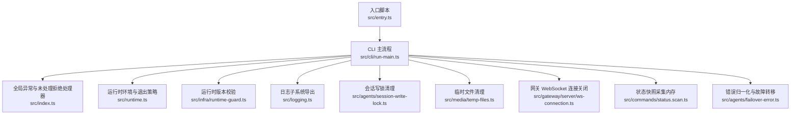
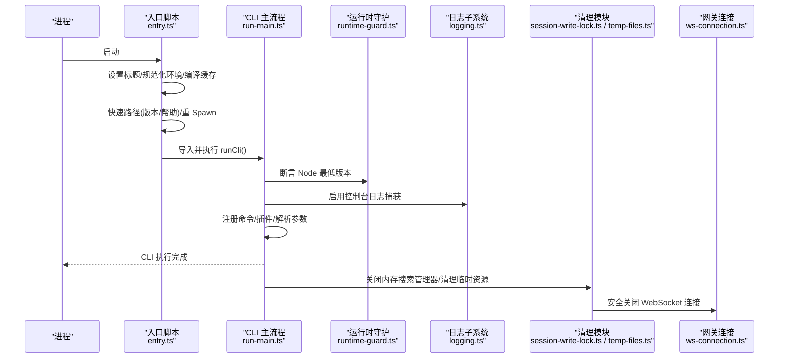
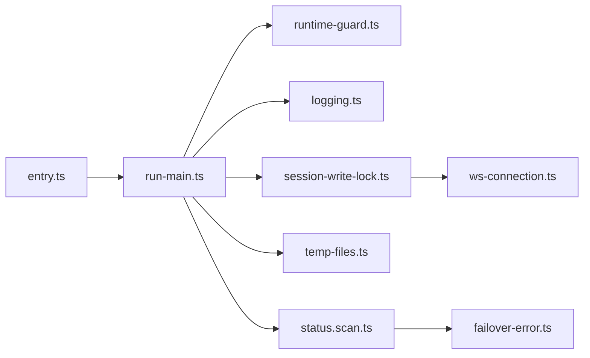

# 运行时生命周期

<cite>
**本文引用的文件**
- [src/entry.ts](file://src/entry.ts)
- [src/index.ts](file://src/index.ts)
- [src/cli/run-main.ts](file://src/cli/run-main.ts)
- [src/runtime.ts](file://src/runtime.ts)
- [src/infra/runtime-guard.ts](file://src/infra/runtime-guard.ts)
- [src/logging.ts](file://src/logging.ts)
- [src/agents/session-write-lock.ts](file://src/agents/session-write-lock.ts)
- [src/media/temp-files.ts](file://src/media/temp-files.ts)
- [src/gateway/server/ws-connection.ts](file://src/gateway/server/ws-connection.ts)
- [src/imessage/monitor/runtime.ts](file://src/imessage/monitor/runtime.ts)
- [src/commands/status.scan.ts](file://src/commands/status.scan.ts)
- [src/agents/failover-error.ts](file://src/agents/failover-error.ts)
- [scripts/test-perf-budget.mjs](file://scripts/test-perf-budget.mjs)
</cite>

## 目录
1. [简介](#简介)
2. [项目结构](#项目结构)
3. [核心组件](#核心组件)
4. [架构总览](#架构总览)
5. [详细组件分析](#详细组件分析)
6. [依赖分析](#依赖分析)
7. [性能考虑](#性能考虑)
8. [故障排查指南](#故障排查指南)
9. [结论](#结论)
10. [附录：生命周期示例与最佳实践](#附录生命周期示例与最佳实践)

## 简介
本文件系统性阐述 OpenClaw 的运行时生命周期管理，覆盖以下主题：
- 初始化流程、资源分配与配置加载机制
- 启动顺序、依赖关系与初始化参数
- 运行时状态管理 API（状态查询、切换与监控）
- 资源清理与释放（内存、文件句柄、网络连接）
- 错误恢复与故障转移策略
- 性能监控与调试工具使用
- 完整生命周期示例与最佳实践

## 项目结构
OpenClaw 的运行时生命周期由“入口层 → CLI 主流程 → 运行时环境与守护 → 日志与清理 → 状态与健康检查”构成。下图展示关键模块之间的关系与调用方向。

图表来源
- [src/entry.ts:1-195](file://src/entry.ts#L1-L195)
- [src/cli/run-main.ts:1-156](file://src/cli/run-main.ts#L1-L156)
- [src/index.ts:1-94](file://src/index.ts#L1-L94)
- [src/runtime.ts:1-54](file://src/runtime.ts#L1-L54)
- [src/infra/runtime-guard.ts:1-100](file://src/infra/runtime-guard.ts#L1-L100)
- [src/logging.ts:1-70](file://src/logging.ts#L1-L70)
- [src/agents/session-write-lock.ts:144-245](file://src/agents/session-write-lock.ts#L144-L245)
- [src/media/temp-files.ts:1-12](file://src/media/temp-files.ts#L1-L12)
- [src/gateway/server/ws-connection.ts:181-205](file://src/gateway/server/ws-connection.ts#L181-L205)
- [src/commands/status.scan.ts:157-180](file://src/commands/status.scan.ts#L157-L180)
- [src/agents/failover-error.ts:211-240](file://src/agents/failover-error.ts#L211-L240)

章节来源
- [src/entry.ts:1-195](file://src/entry.ts#L1-L195)
- [src/cli/run-main.ts:1-156](file://src/cli/run-main.ts#L1-L156)
- [src/index.ts:1-94](file://src/index.ts#L1-L94)

## 核心组件
- 入口与启动控制：负责进程标题设置、环境规范化、编译缓存启用、实验性警告抑制、快速路径帮助/版本输出、CLI 启动与错误兜底。
- CLI 主流程：解析参数、加载 dotenv、环境规范化、路径确保、运行时版本校验、命令路由、插件注册、日志捕获、异常处理与最终资源回收。
- 运行时环境：统一的日志接口与退出策略，支持“非退出式”运行时以适配测试或嵌入场景。
- 运行时守护：最小 Node 版本检测与断言，不满足条件时输出明确提示并退出。
- 日志子系统：集中化日志能力导出，便于在运行时阶段启用结构化日志。
- 资源清理：会话写锁同步清理、临时文件删除、WebSocket 连接安全关闭、内存搜索管理器收尾。
- 状态与健康：状态快照采集、通道健康评估、错误归一化与故障转移。

章节来源
- [src/entry.ts:1-195](file://src/entry.ts#L1-L195)
- [src/cli/run-main.ts:1-156](file://src/cli/run-main.ts#L1-L156)
- [src/runtime.ts:1-54](file://src/runtime.ts#L1-L54)
- [src/infra/runtime-guard.ts:1-100](file://src/infra/runtime-guard.ts#L1-L100)
- [src/logging.ts:1-70](file://src/logging.ts#L1-L70)
- [src/agents/session-write-lock.ts:144-245](file://src/agents/session-write-lock.ts#L144-L245)
- [src/media/temp-files.ts:1-12](file://src/media/temp-files.ts#L1-L12)
- [src/gateway/server/ws-connection.ts:181-205](file://src/gateway/server/ws-connection.ts#L181-L205)
- [src/commands/status.scan.ts:157-180](file://src/commands/status.scan.ts#L157-L180)
- [src/agents/failover-error.ts:211-240](file://src/agents/failover-error.ts#L211-L240)

## 架构总览
下图展示从进程入口到 CLI 解析再到运行时守护与清理的整体序列。

图表来源
- [src/entry.ts:1-195](file://src/entry.ts#L1-L195)
- [src/cli/run-main.ts:74-151](file://src/cli/run-main.ts#L74-L151)
- [src/infra/runtime-guard.ts:76-99](file://src/infra/runtime-guard.ts#L76-L99)
- [src/logging.ts:35-59](file://src/logging.ts#L35-L59)
- [src/agents/session-write-lock.ts:144-245](file://src/agents/session-write-lock.ts#L144-L245)
- [src/media/temp-files.ts:1-12](file://src/media/temp-files.ts#L1-L12)
- [src/gateway/server/ws-connection.ts:181-205](file://src/gateway/server/ws-connection.ts#L181-L205)

## 详细组件分析

### 组件A：入口与启动控制（src/entry.ts）
- 职责
  - 防止被二次导入导致重复启动
  - 设置进程标题、标记执行环境、安装警告过滤
  - 规范化环境变量、启用编译缓存（尽力而为）
  - 实验性警告抑制与“重 Spawn”策略，避免 Node CLI 选项限制
  - 快速路径：版本与帮助输出
  - 解析 CLI 配置文件并应用 CLI Profile 环境
  - 启动 CLI 主流程
- 关键点
  - 通过包装器对映表与主模块判定，避免打包器误触发
  - 对 NODE_OPTIONS 与 execArgv 的兼容处理
  - 子进程桥接与错误兜底

章节来源
- [src/entry.ts:1-195](file://src/entry.ts#L1-L195)

### 组件B：CLI 主流程（src/cli/run-main.ts）
- 职责
  - 参数解析与 CLI Profile 应用
  - 加载 .env、规范化环境、必要时确保 CLI 在 PATH 中
  - 运行时版本断言
  - 命令路由、核心命令与插件命令注册
  - 控制台日志捕获、未处理拒绝与异常处理
  - CLI 结束时关闭内存搜索管理器等资源
- 关键点
  - 惰性注册主命令，保证帮助与解析一致性
  - 插件命令注册前先加载并验证配置
  - 严格在 finally 中进行资源回收

章节来源
- [src/cli/run-main.ts:1-156](file://src/cli/run-main.ts#L1-L156)

### 组件C：运行时环境与退出策略（src/runtime.ts）
- 职责
  - 提供统一 RuntimeEnv 接口：log、error、exit
  - 支持“非退出式”运行时，便于测试或嵌入场景
  - 在 exit 时恢复终端状态，避免残留状态影响后续交互
- 关键点
  - 日志输出前清理活动进度线，避免 UI 干扰
  - 通过 createNonExitingRuntime 抛出带退出码的错误，便于上层捕获

章节来源
- [src/runtime.ts:1-54](file://src/runtime.ts#L1-L54)

### 组件D：运行时守护（src/infra/runtime-guard.ts）
- 职责
  - 检测当前运行时类型与版本
  - 断言 Node 版本不低于最低要求
  - 不满足时输出清晰提示并退出
- 关键点
  - 使用 semver 解析与比较逻辑
  - 输出 PATH 信息以便定位问题

章节来源
- [src/infra/runtime-guard.ts:1-100](file://src/infra/runtime-guard.ts#L1-L100)

### 组件E：日志子系统（src/logging.ts）
- 职责
  - 导出控制台与文件日志能力
  - 提供子系统日志器、级别与时间戳等配置
- 关键点
  - 在 CLI 主流程中启用控制台日志捕获，保持 stdout/stderr 行为一致

章节来源
- [src/logging.ts:1-70](file://src/logging.ts#L1-L70)

### 组件F：资源清理与释放
- 会话写锁清理（src/agents/session-write-lock.ts）
  - 同步释放所有已持有锁，防止僵尸锁
  - 终止信号处理时同步清理并可选择重新抛出信号
- 临时文件清理（src/media/temp-files.ts）
  - 异步删除临时文件，失败时尽力而为
- 网络连接关闭（src/gateway/server/ws-connection.ts）
  - 连接关闭时清理握手计时器、客户端集合，并优雅关闭 socket
- 内存搜索管理器收尾（src/cli/run-main.ts）
  - CLI 结束时关闭所有内存搜索管理器，避免资源泄漏

章节来源
- [src/agents/session-write-lock.ts:144-245](file://src/agents/session-write-lock.ts#L144-L245)
- [src/media/temp-files.ts:1-12](file://src/media/temp-files.ts#L1-L12)
- [src/gateway/server/ws-connection.ts:181-205](file://src/gateway/server/ws-connection.ts#L181-L205)
- [src/cli/run-main.ts:16-23](file://src/cli/run-main.ts#L16-L23)

### 组件G：状态管理与监控
- 状态快照采集（src/commands/status.scan.ts）
  - 在启用内存插件时，探测向量可用性并生成内存状态快照
  - 采集后关闭管理器，避免资源泄露
- 运行时状态注入（src/imessage/monitor/runtime.ts）
  - 默认使用“非退出式”运行时，便于监控器在后台运行而不中断进程
- 通道健康评估（概念性说明）
  - 可参考通道健康策略模块，结合运行时状态进行健康判断（此处为概念性说明）

章节来源
- [src/commands/status.scan.ts:157-180](file://src/commands/status.scan.ts#L157-L180)
- [src/imessage/monitor/runtime.ts:1-11](file://src/imessage/monitor/runtime.ts#L1-L11)

### 组件H：错误恢复与故障转移
- 错误归一化（src/agents/failover-error.ts）
  - 将底层错误转换为统一的故障转移错误对象，携带原因、状态码、提供商、模型等上下文
  - 用于上层策略（如切换后端、降级模型）进行恢复
- 故障转移策略（概念性说明）
  - 可基于错误原因与状态码选择备用模型/供应商，或回退到本地模型

章节来源
- [src/agents/failover-error.ts:211-240](file://src/agents/failover-error.ts#L211-L240)

## 依赖分析
- 入口层依赖 CLI 主流程；CLI 主流程依赖运行时守护、日志子系统与清理模块；清理模块进一步依赖网络连接关闭与临时文件删除。
- 运行时环境作为通用基础设施被多处使用（CLI、监控器等），确保日志与退出行为一致。
- 状态与健康检查依赖内存搜索管理器与通道健康策略，形成闭环监控。

图表来源
- [src/entry.ts:1-195](file://src/entry.ts#L1-L195)
- [src/cli/run-main.ts:1-156](file://src/cli/run-main.ts#L1-L156)
- [src/infra/runtime-guard.ts:1-100](file://src/infra/runtime-guard.ts#L1-L100)
- [src/logging.ts:1-70](file://src/logging.ts#L1-L70)
- [src/agents/session-write-lock.ts:144-245](file://src/agents/session-write-lock.ts#L144-L245)
- [src/media/temp-files.ts:1-12](file://src/media/temp-files.ts#L1-L12)
- [src/gateway/server/ws-connection.ts:181-205](file://src/gateway/server/ws-connection.ts#L181-L205)
- [src/commands/status.scan.ts:157-180](file://src/commands/status.scan.ts#L157-L180)
- [src/agents/failover-error.ts:211-240](file://src/agents/failover-error.ts#L211-L240)

## 性能考虑
- 编译缓存：入口层尝试启用 Node 编译缓存，提升启动速度（尽力而为，失败不阻塞）。
- 日志捕获：在 CLI 主流程启用控制台日志捕获，避免频繁 I/O 影响性能。
- 资源回收：在 CLI finally 中关闭内存搜索管理器，减少长生命周期进程的内存压力。
- 性能预算测试：提供性能预算脚本，支持最大耗时与基线回归阈值检查，便于持续集成中的性能门禁。

章节来源
- [src/entry.ts:48-54](file://src/entry.ts#L48-L54)
- [src/cli/run-main.ts:16-23](file://src/cli/run-main.ts#L16-L23)
- [scripts/test-perf-budget.mjs:98-127](file://scripts/test-perf-budget.mjs#L98-L127)

## 故障排查指南
- 运行时版本不满足要求
  - 现象：启动即退出并提示 Node 版本过低
  - 处理：升级 Node 至 22.12.0 或以上
- 实验性警告导致的启动异常
  - 现象：Node CLI 选项限制导致启动失败
  - 处理：入口层自动重 Spawn 并传递禁用警告标志
- CLI 异常崩溃
  - 现象：未捕获异常导致进程退出
  - 处理：CLI 主流程安装未处理拒绝与异常处理器，记录错误并退出
- 会话写锁未释放
  - 现象：进程退出后锁文件残留
  - 处理：终止信号触发同步释放所有锁；也可手动删除
- 临时文件未清理
  - 现象：磁盘空间占用增加
  - 处理：清理模块异步删除；若失败，可在安全时机再次清理
- WebSocket 连接异常
  - 现象：连接错误或无法关闭
  - 处理：连接关闭时清理握手计时器与客户端集合，并优雅关闭 socket

章节来源
- [src/infra/runtime-guard.ts:76-99](file://src/infra/runtime-guard.ts#L76-L99)
- [src/entry.ts:94-126](file://src/entry.ts#L94-L126)
- [src/cli/run-main.ts:109-112](file://src/cli/run-main.ts#L109-L112)
- [src/agents/session-write-lock.ts:229-245](file://src/agents/session-write-lock.ts#L229-L245)
- [src/media/temp-files.ts:3-11](file://src/media/temp-files.ts#L3-L11)
- [src/gateway/server/ws-connection.ts:181-205](file://src/gateway/server/ws-connection.ts#L181-L205)

## 结论
OpenClaw 的运行时生命周期围绕“入口控制 → CLI 主流程 → 运行时守护 → 日志与清理 → 状态与健康”的主线展开，具备完善的初始化、资源管理与错误恢复机制。通过统一的运行时环境与严格的版本断言，确保在不同平台与环境下的一致性与稳定性；通过资源回收与清理策略，降低长期运行的风险；通过状态快照与错误归一化，为上层策略提供可靠的数据基础。

## 附录：生命周期示例与最佳实践
- 生命周期示例（概念性流程）
  - 入口层：设置进程标题、规范化环境、启用编译缓存、重 Spawn（如需）、解析 CLI Profile
  - CLI 主流程：加载 .env、断言运行时版本、注册命令与插件、解析参数、执行命令
  - 清理阶段：关闭内存搜索管理器、释放会话写锁、删除临时文件、关闭 WebSocket 连接
- 最佳实践
  - 在生产环境中始终启用运行时版本断言
  - 使用“非退出式”运行时进行后台监控，避免中断前台进程
  - 在 CLI finally 中进行资源回收，确保短生命周期进程也能正确释放
  - 使用性能预算脚本在 CI 中设置性能门禁，防止回归
  - 对网络连接与外部资源采用“尽力而为”的清理策略，避免阻塞退出