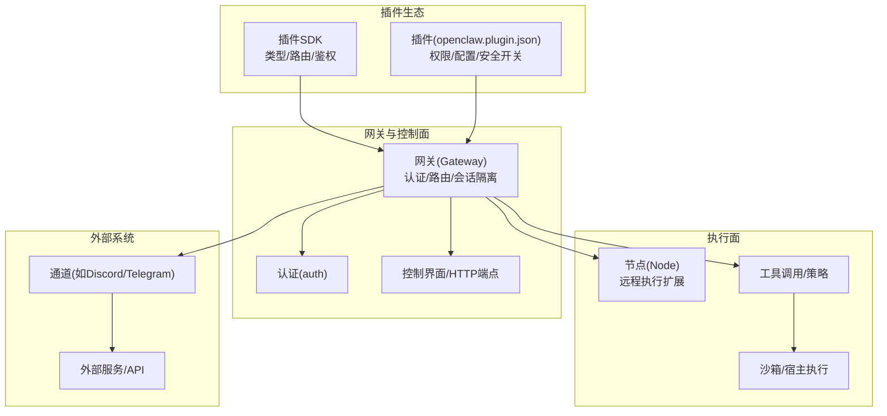
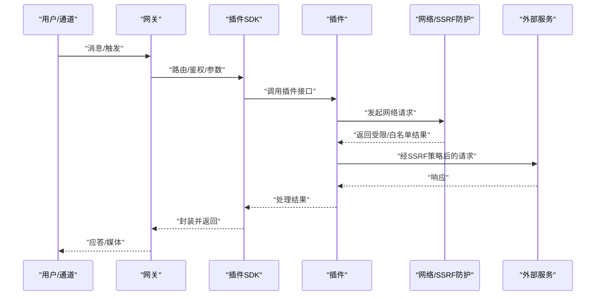
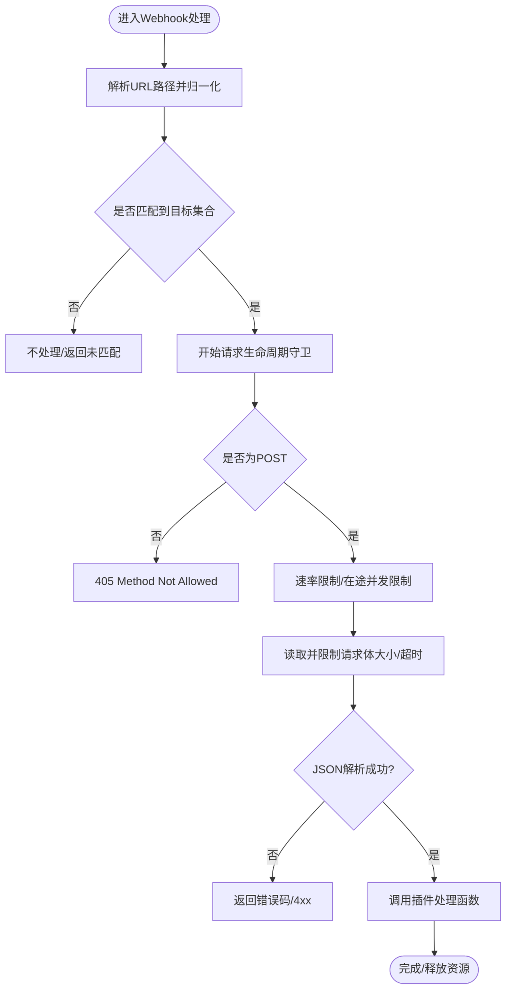
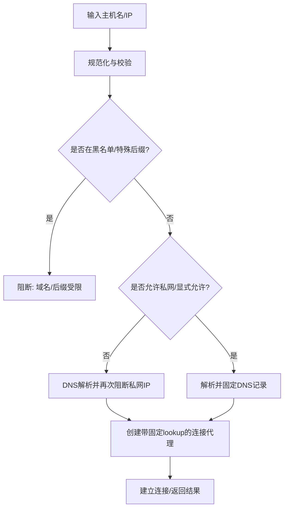
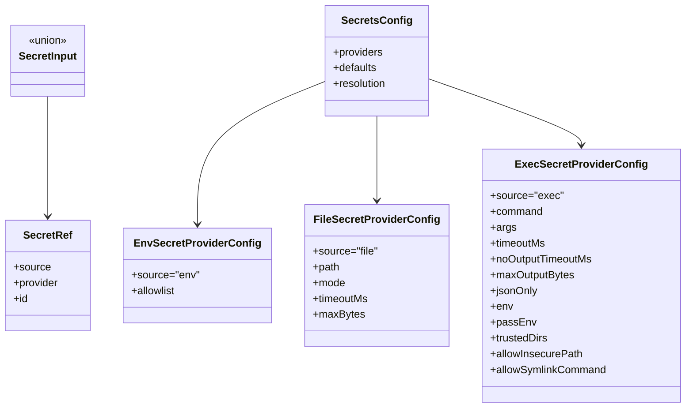
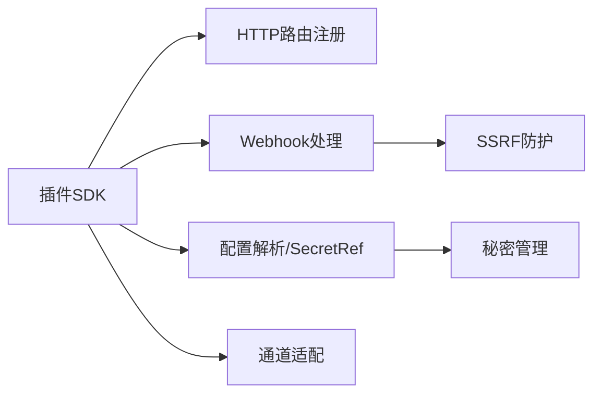

# 插件安全实践

<cite>
**本文引用的文件**
- [SECURITY.md](file://SECURITY.md)
- [docs/security/README.md](file://docs/security/README.md)
- [docs/security/CONTRIBUTING-THREAT-MODEL.md](file://docs/security/CONTRIBUTING-THREAT-MODEL.md)
- [docs/security/THREAT-MODEL-ATLAS.md](file://docs/security/THREAT-MODEL-ATLAS.md)
- [src/plugin-sdk/index.ts](file://src/plugin-sdk/index.ts)
- [src/plugin-sdk/webhook-targets.ts](file://src/plugin-sdk/webhook-targets.ts)
- [src/infra/net/ssrf.ts](file://src/infra/net/ssrf.ts)
- [src/infra/http-body.ts](file://src/infra/http-body.ts)
- [src/config/types.secrets.ts](file://src/config/types.secrets.ts)
- [extensions/diffs/openclaw.plugin.json](file://extensions/diffs/openclaw.plugin.json)
- [extensions/discord/openclaw.plugin.json](file://extensions/discord/openclaw.plugin.json)
- [extensions/telegram/openclaw.plugin.json](file://extensions/telegram/openclaw.plugin.json)
</cite>

## 目录
1. [引言](#引言)
2. [项目结构](#项目结构)
3. [核心组件](#核心组件)
4. [架构总览](#架构总览)
5. [详细组件分析](#详细组件分析)
6. [依赖关系分析](#依赖关系分析)
7. [性能考量](#性能考量)
8. [故障排查指南](#故障排查指南)
9. [结论](#结论)
10. [附录](#附录)

## 引言
本指南面向OpenClaw插件开发者，系统阐述插件开发与运行时的安全实践，覆盖权限最小化、输入验证与输出编码、访问控制、敏感数据保护、代码安全审计、与外部系统安全交互、部署与分发安全以及安全事件响应与修复流程。内容基于仓库内安全策略、威胁模型与核心SDK/基础设施模块，帮助在“受信任操作员”模型下构建安全、可审计且抗风险的插件。

## 项目结构
OpenClaw将安全与信任模型贯穿于网关、通道、工具执行与供应链等多层边界。插件作为网关内的可信计算基的一部分，具备与本地进程同等的系统权限，因此必须遵循严格的最小权限、输入校验与访问控制原则，并通过配置与运行时机制实现安全边界。

图示来源
- [src/plugin-sdk/index.ts:1-826](file://src/plugin-sdk/index.ts#L1-L826)
- [src/infra/net/ssrf.ts:1-364](file://src/infra/net/ssrf.ts#L1-L364)
- [extensions/discord/openclaw.plugin.json:1-10](file://extensions/discord/openclaw.plugin.json#L1-L10)
- [extensions/telegram/openclaw.plugin.json:1-10](file://extensions/telegram/openclaw.plugin.json#L1-L10)

章节来源
- [SECURITY.md:88-103](file://SECURITY.md#L88-L103)
- [docs/security/THREAT-MODEL-ATLAS.md:56-123](file://docs/security/THREAT-MODEL-ATLAS.md#L56-L123)

## 核心组件
- 网关与信任模型：网关是控制面，认证通过后即视为受信任操作员；会话键用于路由而非细粒度授权；推荐单用户/单网关模型，避免多租户共享主机带来的边界模糊。
- 插件信任边界：插件与网关同属受信任计算基，安装/启用即授予与本地代码相当的信任级别；仅安装可信插件，优先使用允许列表限定插件ID。
- SSRF防护：内置主机名/私有地址/特殊用途地址阻断与DNS固定解析，防止内部探测与回环攻击。
- Webhook与请求体防护：统一的请求体大小与超时限制、JSON解析与错误码映射，避免资源耗尽与解析异常。
- 秘密管理：SecretRef抽象与多种提供源（环境变量/文件/命令），支持解析前校验与默认提供者别名，减少硬编码与泄露面。
- 插件清单与安全开关：通过openclaw.plugin.json声明能力、UI提示与安全配置项（如远程查看器开关），便于最小化暴露面。

章节来源
- [SECURITY.md:88-103](file://SECURITY.md#L88-L103)
- [SECURITY.md:182-189](file://SECURITY.md#L182-L189)
- [src/infra/net/ssrf.ts:1-364](file://src/infra/net/ssrf.ts#L1-L364)
- [src/infra/http-body.ts:1-359](file://src/infra/http-body.ts#L1-L359)
- [src/config/types.secrets.ts:1-225](file://src/config/types.secrets.ts#L1-L225)
- [extensions/diffs/openclaw.plugin.json:1-183](file://extensions/diffs/openclaw.plugin.json#L1-L183)

## 架构总览
下图展示插件在OpenClaw中的位置与关键安全交互路径：从网关到插件SDK，再到通道与外部服务；同时强调SSRF与请求体防护在执行链路中的作用。

图示来源
- [src/plugin-sdk/index.ts:1-826](file://src/plugin-sdk/index.ts#L1-L826)
- [src/infra/net/ssrf.ts:276-330](file://src/infra/net/ssrf.ts#L276-L330)

## 详细组件分析

### 组件A：Webhook与请求体安全
- 能力概览
  - 注册Webhook目标与路径归一化，按路径匹配目标集合。
  - 请求生命周期：方法校验、速率限制、并发在途限制、JSON内容类型要求、请求体读取与超时控制。
  - 统一错误码与状态码映射，避免异常传播导致进程崩溃。
- 安全要点
  - 默认拒绝非POST请求，防止误用。
  - 严格限制请求体大小与超时，阻断慢读/大包DoS。
  - 对JSON解析失败与空载场景进行明确处理，避免误判。
- 最佳实践
  - 为每个插件Webhook设置独立路径与鉴权逻辑。
  - 启用速率限制与在途并发限制，结合来源IP或令牌维度。
  - 明确错误响应格式与日志记录，便于审计与排障。

图示来源
- [src/plugin-sdk/webhook-targets.ts:102-162](file://src/plugin-sdk/webhook-targets.ts#L102-L162)
- [src/infra/http-body.ts:101-195](file://src/infra/http-body.ts#L101-L195)

章节来源
- [src/plugin-sdk/webhook-targets.ts:1-282](file://src/plugin-sdk/webhook-targets.ts#L1-L282)
- [src/infra/http-body.ts:1-359](file://src/infra/http-body.ts#L1-L359)

### 组件B：SSRF防护与网络访问控制
- 能力概览
  - 主机名校验与通配模式匹配，阻断黑名单与特殊域名后缀。
  - 私有/特殊用途IP阻断，支持策略放宽与显式允许白名单。
  - DNS固定解析与连接代理，确保解析结果与连接一致。
- 安全要点
  - 解析阶段与DNS阶段双重阻断，防止通过公共解析转向私网。
  - 支持显式允许主机名与私网访问策略，满足合规需求。
- 最佳实践
  - 默认拒绝私网与特殊用途地址，除非业务必需。
  - 使用显式允许列表与严格主机名模式，避免通配符滥用。
  - 在插件中仅对必要外部域开放访问，并配合速率限制。

图示来源
- [src/infra/net/ssrf.ts:147-172](file://src/infra/net/ssrf.ts#L147-L172)
- [src/infra/net/ssrf.ts:276-330](file://src/infra/net/ssrf.ts#L276-L330)

章节来源
- [src/infra/net/ssrf.ts:1-364](file://src/infra/net/ssrf.ts#L1-L364)

### 组件C：秘密管理与凭据安全
- 能力概览
  - SecretRef抽象：支持env/file/exec三种来源，含提供者别名与标识符。
  - 输入归一化与解析：模板字符串、显式Ref、遗留格式兼容。
  - 提供者配置：环境变量白名单、文件模式(json/singleValue)、命令执行的超时/输出限制与可信目录约束。
- 安全要点
  - 避免硬编码密钥；通过SecretRef在运行时解析。
  - 对命令执行提供可信目录、符号链接与路径合法性限制。
- 最佳实践
  - 将所有敏感配置以SecretRef形式声明，避免明文存储。
  - 为不同提供者设置最小权限与访问范围，定期轮换密钥。
  - 在插件配置中仅暴露必要字段，隐藏敏感细节。

图示来源
- [src/config/types.secrets.ts:1-225](file://src/config/types.secrets.ts#L1-L225)

章节来源
- [src/config/types.secrets.ts:1-225](file://src/config/types.secrets.ts#L1-L225)

### 组件D：插件清单与安全开关
- 能力概览
  - openclaw.plugin.json声明插件ID、名称、描述、技能与UI提示。
  - configSchema定义默认行为与安全开关（如远程查看器）。
- 安全要点
  - 通过安全开关最小化暴露面，默认关闭高风险功能。
  - UI提示帮助操作员理解配置影响，降低误配风险。
- 最佳实践
  - 为每个潜在风险项提供显式开关，并默认关闭。
  - 在插件文档中明确各配置项的安全影响与建议值。

章节来源
- [extensions/diffs/openclaw.plugin.json:1-183](file://extensions/diffs/openclaw.plugin.json#L1-L183)
- [extensions/discord/openclaw.plugin.json:1-10](file://extensions/discord/openclaw.plugin.json#L1-L10)
- [extensions/telegram/openclaw.plugin.json:1-10](file://extensions/telegram/openclaw.plugin.json#L1-L10)

## 依赖关系分析
- 插件SDK与网关：插件通过SDK注册HTTP路由、处理Webhook、解析配置与鉴权，依赖网关提供的运行时上下文。
- 网络与安全：插件发起的外部请求需经过SSRF策略与DNS固定，避免内部可达性泄露。
- 配置与秘密：插件读取配置时应通过SecretRef解析，避免直接读取明文。
- 通道集成：插件与通道（如Discord/Telegram）交互时，需遵循通道侧的接入与鉴权策略。

图示来源
- [src/plugin-sdk/index.ts:125-127](file://src/plugin-sdk/index.ts#L125-L127)
- [src/plugin-sdk/webhook-targets.ts:27-42](file://src/plugin-sdk/webhook-targets.ts#L27-L42)
- [src/infra/net/ssrf.ts:332-338](file://src/infra/net/ssrf.ts#L332-L338)
- [src/config/types.secrets.ts:176-205](file://src/config/types.secrets.ts#L176-L205)

章节来源
- [src/plugin-sdk/index.ts:1-826](file://src/plugin-sdk/index.ts#L1-L826)
- [src/plugin-sdk/webhook-targets.ts:1-282](file://src/plugin-sdk/webhook-targets.ts#L1-L282)
- [src/infra/net/ssrf.ts:1-364](file://src/infra/net/ssrf.ts#L1-L364)
- [src/config/types.secrets.ts:1-225](file://src/config/types.secrets.ts#L1-L225)

## 性能考量
- Webhook处理：合理设置请求体大小与超时，避免过小导致合法负载被拒，过大导致资源占用；并发在途限制与速率限制平衡吞吐与稳定性。
- SSRF：DNS固定与连接代理增加少量开销，但显著提升安全性；可通过缓存与复用代理降低重复成本。
- 秘密解析：命令执行提供者应设置合理超时与输出上限，避免长时间阻塞；批量解析时注意并发与字节限制。

## 故障排查指南
- Webhook错误定位
  - 检查请求方法、内容类型与请求体大小/超时；确认速率限制与在途并发阈值。
  - 查看统一错误码映射与响应文本，结合日志定位问题。
- SSRF拦截
  - 核对主机名是否在允许列表；确认是否误用私网/特殊用途地址。
  - 使用固定DNS解析验证解析结果与连接一致性。
- 秘密解析失败
  - 校验SecretRef格式与提供者配置；检查环境变量白名单、文件路径与命令执行参数。
  - 关注解析前校验与默认提供者别名，避免遗漏。

章节来源
- [src/infra/http-body.ts:16-44](file://src/infra/http-body.ts#L16-L44)
- [src/infra/http-body.ts:252-358](file://src/infra/http-body.ts#L252-L358)
- [src/infra/net/ssrf.ts:276-330](file://src/infra/net/ssrf.ts#L276-L330)
- [src/config/types.secrets.ts:158-174](file://src/config/types.secrets.ts#L158-L174)

## 结论
OpenClaw的插件安全实践以“受信任操作员”模型为核心，通过严格的插件信任边界、最小权限原则、输入验证与输出编码、访问控制与秘密管理、SSRF防护与Webhook安全守卫，以及完善的威胁模型与响应流程，形成端到端的安全闭环。开发者应将安全设计融入插件的生命周期，从清单配置、接口实现到部署与运维，持续进行安全审计与加固。

## 附录

### 插件开发安全清单
- 权限与暴露面
  - 仅声明必要能力；默认关闭高风险开关；最小化公开路由。
- 输入与输出
  - 严格校验与限制输入长度/格式；对外输出进行安全过滤与编码。
- 认证与授权
  - Webhook请求必须鉴权；区分来源与令牌维度；拒绝非POST。
- 外部交互
  - 仅访问白名单域名；启用SSRF策略；限制请求体大小与超时。
- 秘密与配置
  - 使用SecretRef；避免硬编码；定期轮换；最小权限提供者。
- 审计与监控
  - 记录关键操作与错误；统一错误码与响应；保留可追溯日志。

### 安全事件响应与修复流程
- 快速评估
  - 明确影响范围与严重等级；确认是否跨越信任边界。
- 隔离与缓解
  - 临时禁用受影响插件/路由；收紧访问控制与速率限制。
- 修复与验证
  - 修复根因（输入校验/鉴权/SSRF/秘密管理）；回归测试与安全扫描。
- 通告与复盘
  - 通知相关方；更新威胁模型与加固建议；沉淀最佳实践。

章节来源
- [SECURITY.md:33-46](file://SECURITY.md#L33-L46)
- [SECURITY.md:69-74](file://SECURITY.md#L69-L74)
- [docs/security/THREAT-MODEL-ATLAS.md:505-527](file://docs/security/THREAT-MODEL-ATLAS.md#L505-L527)