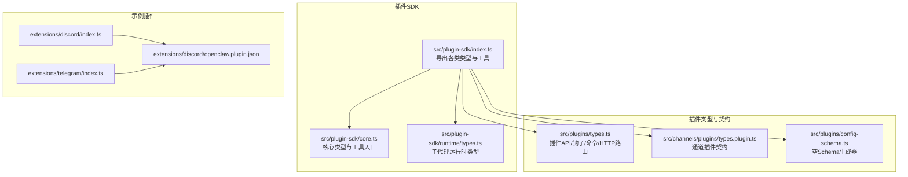
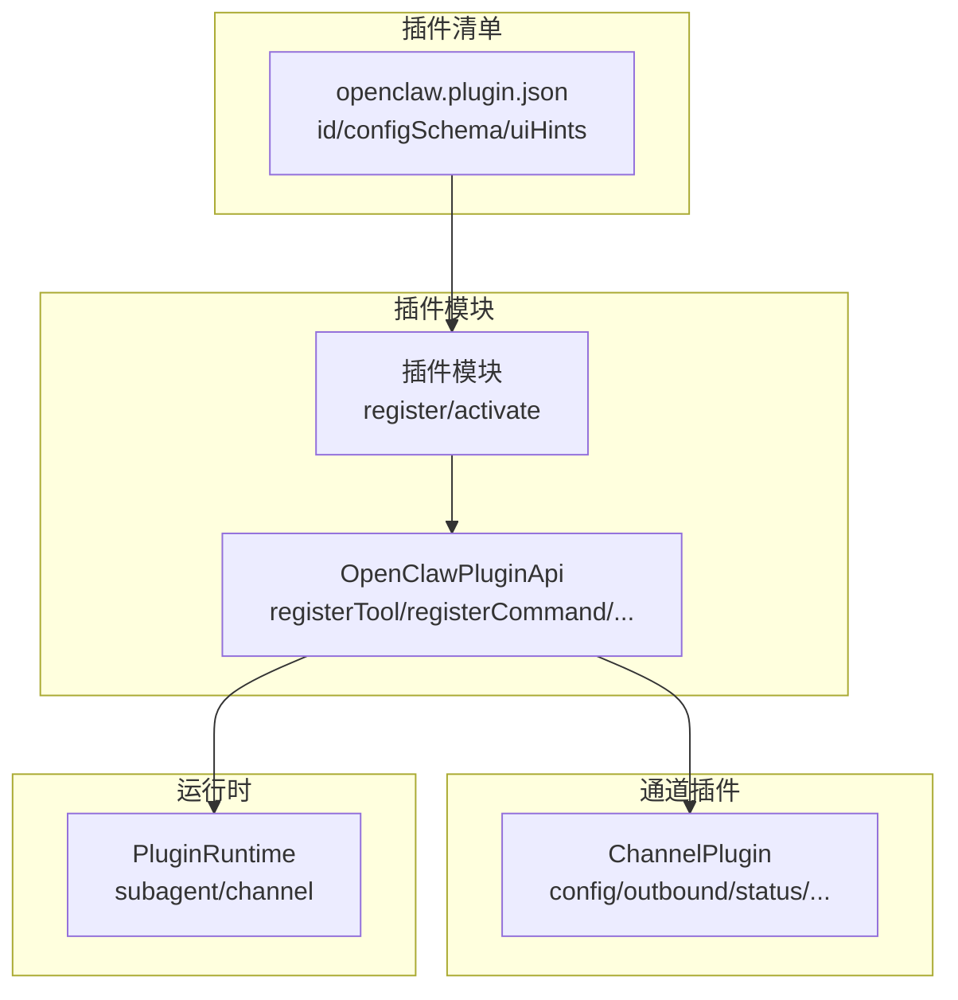
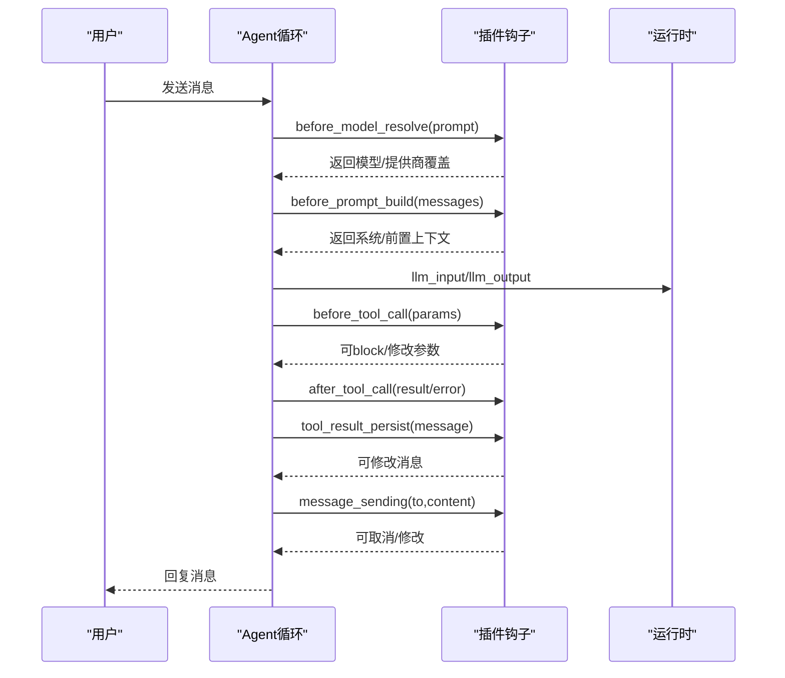
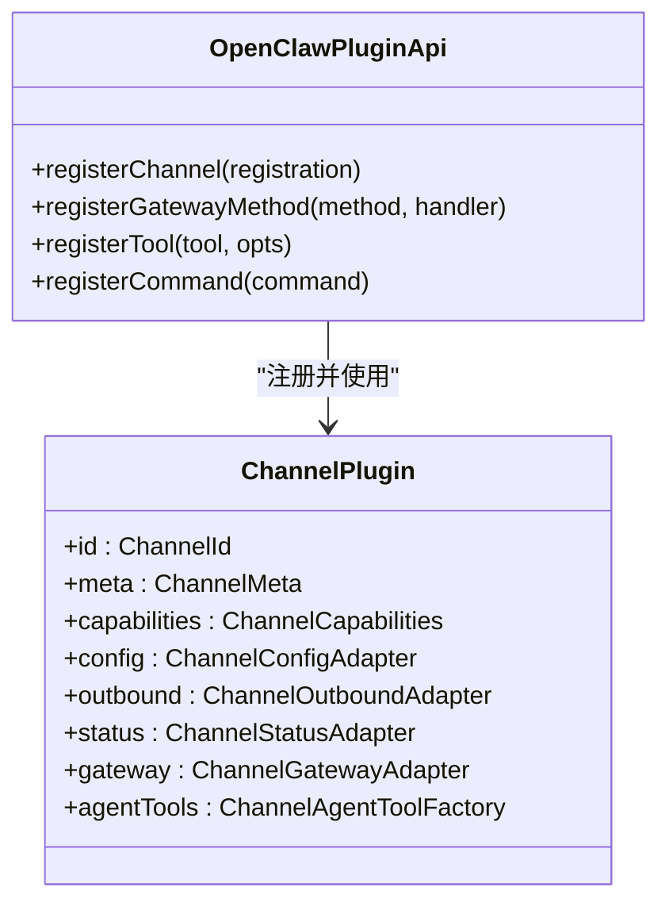
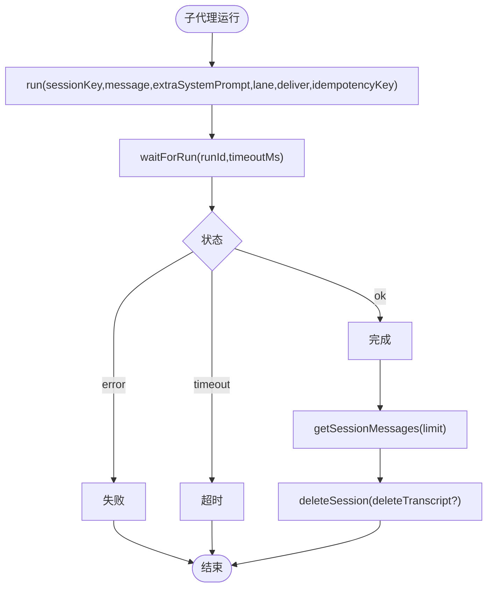
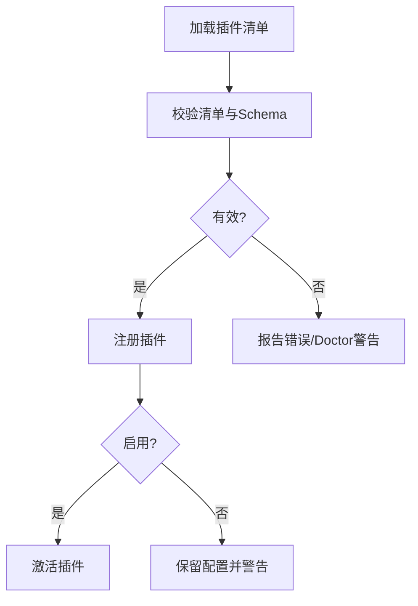
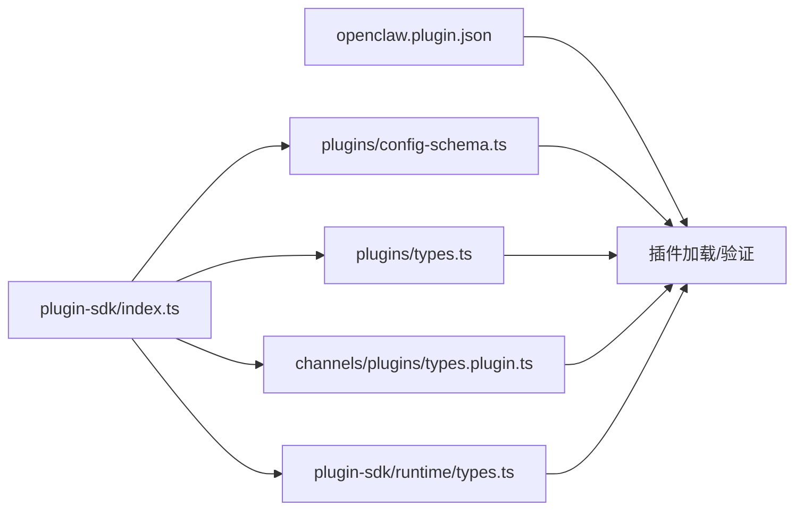

# 插件开发实践

<cite>
**本文引用的文件**
- [README.md](file://README.md)
- [docs/tools/plugin.md](file://docs/tools/plugin.md)
- [docs/plugins/manifest.md](file://docs/plugins/manifest.md)
- [src/plugin-sdk/index.ts](file://src/plugin-sdk/index.ts)
- [src/plugin-sdk/core.ts](file://src/plugin-sdk/core.ts)
- [src/plugin-sdk/runtime/types.ts](file://src/plugin-sdk/runtime/types.ts)
- [src/plugins/types.ts](file://src/plugins/types.ts)
- [src/channels/plugins/types.plugin.ts](file://src/channels/plugins/types.plugin.ts)
- [src/plugins/config-schema.ts](file://src/plugins/config-schema.ts)
- [extensions/discord/openclaw.plugin.json](file://extensions/discord/openclaw.plugin.json)
- [extensions/discord/index.ts](file://extensions/discord/index.ts)
- [extensions/telegram/index.ts](file://extensions/telegram/index.ts)
</cite>

## 目录
1. [引言](#引言)
2. [项目结构](#项目结构)
3. [核心组件](#核心组件)
4. [架构总览](#架构总览)
5. [详细组件分析](#详细组件分析)
6. [依赖关系分析](#依赖关系分析)
7. [性能考量](#性能考量)
8. [故障排查指南](#故障排查指南)
9. [结论](#结论)
10. [附录](#附录)

## 引言
本指南面向在 OpenClaw 平台上开发插件（扩展）的工程师，系统阐述插件开发最佳实践：从代码组织、错误处理与性能优化，到安全与调试、测试策略与常见陷阱，覆盖从需求分析到测试部署的全流程。OpenClaw 的插件体系以“声明式清单 + 运行时 SDK”为核心，强调严格配置校验、可插拔能力与可观测性。

## 项目结构
OpenClaw 将插件开发所需的基础能力集中在 plugin-sdk，并通过文档与示例插件（如 Discord、Telegram）展示如何注册通道、工具、HTTP 路由与命令等。

- 插件 SDK 入口导出大量类型与运行时工具，涵盖通道适配器、运行时子代理、HTTP 注册、Webhook 守卫、SSRF 策略、临时路径、命令执行等。
- 插件清单 openclaw.plugin.json 是强制要求的元数据文件，用于声明 id、配置 JSON Schema、渠道/提供商/技能等信息。
- 示例插件展示了最小化插件骨架：导出默认对象，声明 id、名称、描述、空配置 Schema，并在 register 钩子中注册通道或服务。

图表来源
- [src/plugin-sdk/index.ts:1-826](file://src/plugin-sdk/index.ts#L1-L826)
- [src/plugin-sdk/core.ts:1-44](file://src/plugin-sdk/core.ts#L1-L44)
- [src/plugin-sdk/runtime/types.ts:1-64](file://src/plugin-sdk/runtime/types.ts#L1-L64)
- [src/plugins/types.ts:1-893](file://src/plugins/types.ts#L1-L893)
- [src/channels/plugins/types.plugin.ts:1-86](file://src/channels/plugins/types.plugin.ts#L1-L86)
- [src/plugins/config-schema.ts:1-34](file://src/plugins/config-schema.ts#L1-L34)
- [extensions/discord/openclaw.plugin.json:1-10](file://extensions/discord/openclaw.plugin.json#L1-L10)
- [extensions/discord/index.ts:1-20](file://extensions/discord/index.ts#L1-L20)
- [extensions/telegram/index.ts:1-18](file://extensions/telegram/index.ts#L1-L18)

章节来源
- [README.md:1-560](file://README.md#L1-L560)
- [docs/tools/plugin.md:1-963](file://docs/tools/plugin.md#L1-L963)
- [docs/plugins/manifest.md:1-76](file://docs/plugins/manifest.md#L1-L76)

## 核心组件
- 插件 API 与生命周期
  - 插件通过 OpenClawPluginApi 注册工具、命令、HTTP 路由、通道、网关方法、CLI、服务与上下文引擎；支持 typed hooks（before_model_resolve、before_prompt_build、agent 生命周期、消息发送、工具调用、会话与子代理事件等）。
- 通道插件契约
  - ChannelPlugin 定义了通道插件的元数据、能力、配置、设置、配对、安全、群组、提及、出站、状态、网关、认证、提升权限、命令、流式、线程、消息、代理提示、目录、解析器、动作、心跳与代理工具等接口。
- 运行时与子代理
  - PluginRuntime 提供 subagent 子代理运行、等待、获取会话消息、删除会话等能力；channel 命名空间提供通道相关运行时能力。
- 配置 Schema 与清单
  - 每个插件必须提供 openclaw.plugin.json，包含 id、configSchema（严格 JSON Schema）、可选字段（kind、channels、providers、skills、name、description、uiHints、version）。空配置可用 emptyPluginConfigSchema 生成。
- 示例插件
  - Discord 与 Telegram 插件展示了最小实现：注册通道、设置运行时、注册子代理钩子（Discord）。

章节来源
- [src/plugins/types.ts:263-306](file://src/plugins/types.ts#L263-L306)
- [src/channels/plugins/types.plugin.ts:49-85](file://src/channels/plugins/types.plugin.ts#L49-L85)
- [src/plugin-sdk/runtime/types.ts:51-63](file://src/plugin-sdk/runtime/types.ts#L51-L63)
- [src/plugins/config-schema.ts:13-33](file://src/plugins/config-schema.ts#L13-L33)
- [extensions/discord/openclaw.plugin.json:1-10](file://extensions/discord/openclaw.plugin.json#L1-L10)
- [extensions/discord/index.ts:1-20](file://extensions/discord/index.ts#L1-L20)
- [extensions/telegram/index.ts:1-18](file://extensions/telegram/index.ts#L1-L18)

## 架构总览
OpenClaw 插件在进程内运行，通过插件 API 与核心系统交互。插件清单负责严格配置校验，通道插件实现具体消息面能力，运行时提供子代理与通道能力，SDK 提供统一的工具与类型支撑。

图表来源
- [docs/plugins/manifest.md:11-76](file://docs/plugins/manifest.md#L11-L76)
- [src/plugins/types.ts:263-306](file://src/plugins/types.ts#L263-L306)
- [src/channels/plugins/types.plugin.ts:49-85](file://src/channels/plugins/types.plugin.ts#L49-L85)
- [src/plugin-sdk/runtime/types.ts:51-63](file://src/plugin-sdk/runtime/types.ts#L51-L63)

## 详细组件分析

### 组件A：插件 API 与生命周期钩子
- 关键职责
  - 注册工具、命令、HTTP 路由、通道、网关方法、CLI、服务、上下文引擎。
  - 支持 typed agent lifecycle hooks（模型解析前、提示构建前、代理开始、LLM 输入/输出、工具调用前后、会话/子代理事件、网关启停等）。
- 最佳实践
  - 使用 api.on 注册生命周期钩子，优先使用明确的 before_model_resolve 与 before_prompt_build，避免使用已废弃的 before_agent_start。
  - 对于需要稳定系统上下文注入的静态内容，使用 prependSystemContext/appendSystemContext，动态内容使用 prependContext。
  - 通过 hooks.allowPromptInjection 控制是否允许提示注入。
- 错误处理
  - 钩子返回值中的 block/取消字段可用于阻断消息写入或工具调用。
  - 工具结果持久化钩子可修改写入的消息体，实现降噪与合规。

图表来源
- [src/plugins/types.ts:384-670](file://src/plugins/types.ts#L384-L670)

章节来源
- [src/plugins/types.ts:263-306](file://src/plugins/types.ts#L263-L306)
- [src/plugins/types.ts:384-670](file://src/plugins/types.ts#L384-L670)

### 组件B：通道插件契约与实现
- 关键职责
  - ChannelPlugin 定义通道元数据、能力、配置、设置、配对、安全、群组、提及、出站、状态、网关、认证、提升权限、命令、流式、线程、消息、代理提示、目录、解析器、动作、心跳与代理工具等。
- 实现建议
  - 优先实现 config.listAccountIds/resolveAccount 与 capabilities，确保多账户与能力声明正确。
  - 出站发送需实现 deliveryMode 与 sendText/sendMedia 等适配器。
  - 在 onboarding 中提供 configure/configureInteractive/configureWhenConfigured 以完善向导体验。
- 安全与合规
  - 使用 security.adapter 实现 DM 策略与配对控制。
  - 使用 status.adapter 提供健康检查与诊断。

图表来源
- [src/channels/plugins/types.plugin.ts:49-85](file://src/channels/plugins/types.plugin.ts#L49-L85)
- [src/plugins/types.ts:263-306](file://src/plugins/types.ts#L263-L306)

章节来源
- [src/channels/plugins/types.plugin.ts:1-86](file://src/channels/plugins/types.plugin.ts#L1-L86)
- [docs/tools/plugin.md:655-721](file://docs/tools/plugin.md#L655-L721)

### 组件C：运行时与子代理
- 关键职责
  - 提供子代理运行 run/waitForRun/getSessionMessages/deleteSession 能力。
  - 提供 channel 命名空间访问通道运行时能力。
- 性能与可靠性
  - 子代理运行支持 idempotencyKey，避免重复投递。
  - 通过 lane 参数隔离不同队列，降低争用。
  - 超时参数可按场景调整，避免长时间阻塞。

图表来源
- [src/plugin-sdk/runtime/types.ts:8-63](file://src/plugin-sdk/runtime/types.ts#L8-L63)

章节来源
- [src/plugin-sdk/runtime/types.ts:1-64](file://src/plugin-sdk/runtime/types.ts#L1-L64)

### 组件D：配置 Schema 与清单
- 清单要求
  - 必须提供 openclaw.plugin.json，包含 id 与 configSchema（严格 JSON Schema），可选字段包括 kind、channels、providers、skills、name、description、uiHints、version。
  - 未知 channels.* 键或未知插件 id 将触发错误；禁用插件的配置保留但发出警告。
- 空配置 Schema
  - emptyPluginConfigSchema 适用于不需要配置的插件，确保配置读写时严格校验。

图表来源
- [docs/plugins/manifest.md:53-76](file://docs/plugins/manifest.md#L53-L76)
- [src/plugins/config-schema.ts:13-33](file://src/plugins/config-schema.ts#L13-L33)

章节来源
- [docs/plugins/manifest.md:11-76](file://docs/plugins/manifest.md#L11-L76)
- [src/plugins/config-schema.ts:1-34](file://src/plugins/config-schema.ts#L1-L34)

### 组件E：示例插件（Discord/Telegram）
- 设计模式
  - 导出默认对象，声明 id/name/description/configSchema。
  - 在 register 中设置运行时、注册通道、注册子代理钩子（Discord）。
- 开发建议
  - 保持 configSchema 最小化，仅暴露必要字段。
  - 使用 uiHints 提升 UI 友好度（标签、占位符、敏感标记）。

章节来源
- [extensions/discord/openclaw.plugin.json:1-10](file://extensions/discord/openclaw.plugin.json#L1-L10)
- [extensions/discord/index.ts:1-20](file://extensions/discord/index.ts#L1-L20)
- [extensions/telegram/index.ts:1-18](file://extensions/telegram/index.ts#L1-L18)

## 依赖关系分析
- 插件 SDK 导出广泛，涵盖通道适配器、运行时子代理、HTTP 注册、Webhook 守卫、SSRF 策略、临时路径、命令执行等。
- 插件清单与配置 Schema 决定插件发现、加载与验证顺序。
- 通道插件与运行时紧密耦合，通过 ChannelPlugin 契约与 PluginRuntime 协作。

图表来源
- [src/plugin-sdk/index.ts:1-826](file://src/plugin-sdk/index.ts#L1-L826)
- [src/plugins/types.ts:1-893](file://src/plugins/types.ts#L1-L893)
- [src/channels/plugins/types.plugin.ts:1-86](file://src/channels/plugins/types.plugin.ts#L1-L86)
- [src/plugin-sdk/runtime/types.ts:1-64](file://src/plugin-sdk/runtime/types.ts#L1-L64)
- [src/plugins/config-schema.ts:1-34](file://src/plugins/config-schema.ts#L1-L34)

章节来源
- [src/plugin-sdk/index.ts:1-826](file://src/plugin-sdk/index.ts#L1-L826)
- [docs/tools/plugin.md:228-304](file://docs/tools/plugin.md#L228-L304)

## 性能考量
- 钩子与提示注入
  - 将静态系统上下文放入 prependSystemContext/appendSystemContext，减少每轮 token 成本。
  - 动态上下文使用 prependContext，避免污染可缓存系统提示。
- 子代理与队列
  - 使用 lane 区分不同任务队列，避免争用。
  - 合理设置 idempotencyKey，避免重复投递导致的资源浪费。
- 缓存与发现
  - 插件发现与清单元数据有短期缓存，可通过环境变量禁用或调节缓存窗口，减少启动/重载抖动。
- HTTP 与 Webhook
  - 使用 registerHttpRoute 与 Webhook 守卫（限流、异常追踪、请求体大小限制）降低资源消耗与风险。

章节来源
- [docs/tools/plugin.md:18-227](file://docs/tools/plugin.md#L18-L227)
- [src/plugins/types.ts:580-670](file://src/plugins/types.ts#L580-L670)
- [src/plugin-sdk/index.ts:440-472](file://src/plugin-sdk/index.ts#L440-L472)

## 故障排查指南
- 清单与配置错误
  - 未知 channels.* 键或未知插件 id：检查 openclaw.plugin.json 与 plugins.entries。
  - 禁用插件的配置：Doctor 会发出警告，确认是否需要启用或清理。
- 运行时问题
  - 钩子阻断：检查 before_tool_call/before_message_write 的 block 字段。
  - 工具调用异常：查看 after_tool_call 的 error 字段与 durationMs。
  - 子代理运行失败：检查 waitForRun 的状态与错误信息。
- 安全与 SSRF
  - 使用 fetchWithSsrFGuard 与 SSRF 策略，避免私网地址与不允许的主机名访问。
- 日志与诊断
  - 使用 PluginLogger 输出 debug/info/warn/error。
  - 启用诊断事件与日志传输，收集诊断事件（消息入队/出队、Webhook 处理、使用量等）。

章节来源
- [docs/plugins/manifest.md:53-76](file://docs/plugins/manifest.md#L53-L76)
- [src/plugins/types.ts:22-27](file://src/plugins/types.ts#L22-L27)
- [src/plugin-sdk/index.ts:454-461](file://src/plugin-sdk/index.ts#L454-L461)
- [src/plugin-sdk/index.ts:622-642](file://src/plugin-sdk/index.ts#L622-L642)

## 结论
OpenClaw 插件体系以“清单 + SDK + 契约”为核心，强调严格配置校验、可插拔能力与可观测性。遵循本文最佳实践，可在保证安全与性能的前提下，快速构建高质量插件，覆盖工具、通道、HTTP 路由、命令与上下文引擎等多类扩展场景。

## 附录

### A. 插件开发工作流程（从需求到部署）
- 需求分析
  - 明确扩展边界：工具、通道、HTTP 路由、命令、上下文引擎或服务。
  - 设计 openclaw.plugin.json 与 configSchema，最小化暴露字段。
- 开发实现
  - 选择合适的 SDK 子路径导入（core/telegram/discord 等）。
  - 实现必要的适配器（通道插件）或注册工具/命令/HTTP 路由。
  - 使用运行时能力（子代理、通道运行时）实现复杂逻辑。
- 测试与验证
  - 单元测试：针对工具/适配器/Schema。
  - 集成测试：通道发送/接收、命令执行、Webhook 请求。
  - 端到端测试：从消息入站到回复出站的完整链路。
- 部署与运维
  - 通过 CLI 安装/启用插件，配置 plugins.entries.<id>.config。
  - 使用 Doctor 检查清单与配置有效性，关注警告与错误。
  - 通过 hooks/list 与日志诊断运行问题。

章节来源
- [docs/tools/plugin.md:460-521](file://docs/tools/plugin.md#L460-L521)
- [docs/plugins/manifest.md:11-76](file://docs/plugins/manifest.md#L11-L76)

### B. 安全考虑（权限、输入验证、资源限制）
- 权限控制
  - 通道安全适配器实现 DM 策略与配对控制；设备配对 API 提供批准/拒绝/列表能力。
- 输入验证
  - 使用严格 JSON Schema 校验插件配置；unknown channels.* 键与未知插件 id 视为错误。
- 资源限制
  - Webhook 请求体大小限制、速率限制与异常追踪；SSRF 策略与私网地址拦截。
- 通道安全
  - 使用通道 onboarding 与 status adapter 提供健康检查与诊断。

章节来源
- [src/plugins/types.ts:101-132](file://src/plugins/types.ts#L101-L132)
- [src/plugin-sdk/core.ts:16-20](file://src/plugin-sdk/core.ts#L16-L20)
- [src/plugin-sdk/index.ts:431-472](file://src/plugin-sdk/index.ts#L431-L472)
- [docs/tools/plugin.md:699-721](file://docs/tools/plugin.md#L699-L721)

### C. 调试技巧（日志、断点、性能分析）
- 日志记录
  - 使用 PluginLogger 输出关键事件；结合日志传输与诊断事件收集。
- 断点调试
  - 在 register/activate 钩子中设置断点，观察上下文与配置。
  - 对工具与命令处理器进行单元测试与断点调试。
- 性能分析
  - 关注工具调用耗时（durationMs）、会话压缩前后消息数、子代理运行状态。
  - 使用 lane 与 idempotencyKey 优化并发与幂等性。

章节来源
- [src/plugins/types.ts:22-27](file://src/plugins/types.ts#L22-L27)
- [src/plugins/types.ts:490-517](file://src/plugins/types.ts#L490-L517)
- [src/plugins/types.ts:527-556](file://src/plugins/types.ts#L527-L556)
- [src/plugins/types.ts:716-728](file://src/plugins/types.ts#L716-L728)

### D. 测试策略（单元、集成、端到端）
- 单元测试
  - 验证工具函数、Schema 解析、适配器行为。
- 集成测试
  - 通道插件：模拟发送/接收、群组/提及、线程与媒体。
  - HTTP 路由：验证鉴权、匹配策略与响应。
  - Webhook：验证守卫、限流与异常追踪。
- 端到端测试
  - 从消息入站到回复出站的完整链路，覆盖钩子、工具与通道适配器。

章节来源
- [docs/tools/plugin.md:460-521](file://docs/tools/plugin.md#L460-L521)
- [src/plugin-sdk/index.ts:165-175](file://src/plugin-sdk/index.ts#L165-L175)

### E. 常见陷阱与避免方法
- 陷阱
  - 忽视清单与 Schema：导致 Doctor 报错或配置不生效。
  - 过度使用 before_agent_start：应迁移到 before_model_resolve 与 before_prompt_build。
  - 未设置 uiHints：影响 UI 表单友好度与敏感字段保护。
  - 未实现 read-only inspectAccount：导致状态命令崩溃或误报。
- 避免方法
  - 在开发阶段使用 Doctor 与 hooks list 辅助定位问题。
  - 采用最小化 Schema 与明确的 uiHints。
  - 为通道插件实现 inspectAccount 与 status adapter。

章节来源
- [docs/tools/plugin.md:187-227](file://docs/tools/plugin.md#L187-L227)
- [docs/tools/plugin.md:522-603](file://docs/tools/plugin.md#L522-L603)

### F. 代码审查要点
- 清单与 Schema
  - id 是否唯一且与配置一致；configSchema 是否严格；uiHints 是否完整。
- 安全
  - 是否存在 SSRF 风险；是否使用守卫与策略；是否正确处理敏感字段。
- 可靠性
  - 是否实现 read-only inspectAccount；是否提供 status adapter；钩子是否可禁用。
- 可维护性
  - 是否使用 SDK 子路径导入；是否最小化暴露字段；是否提供清晰的注释与文档链接。

章节来源
- [docs/plugins/manifest.md:11-76](file://docs/plugins/manifest.md#L11-L76)
- [docs/tools/plugin.md:146-186](file://docs/tools/plugin.md#L146-L186)