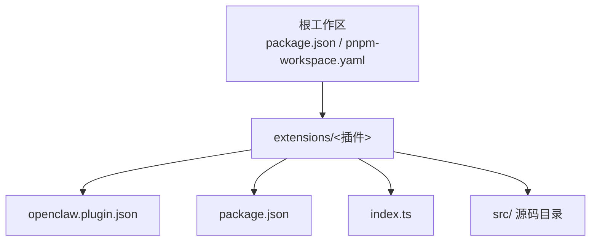
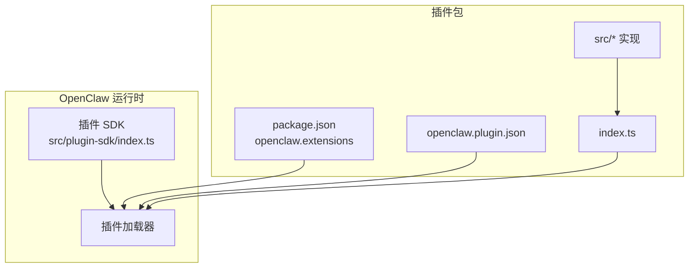
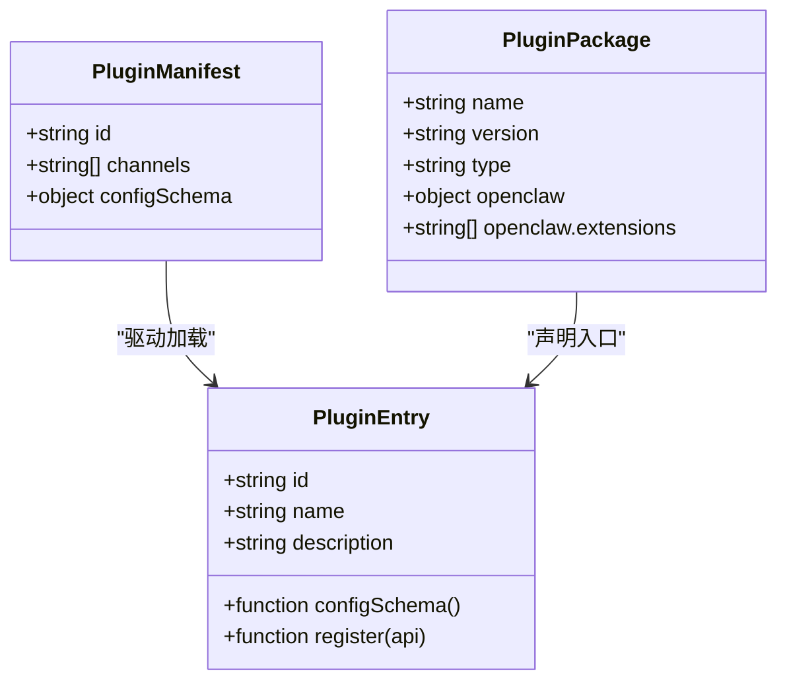
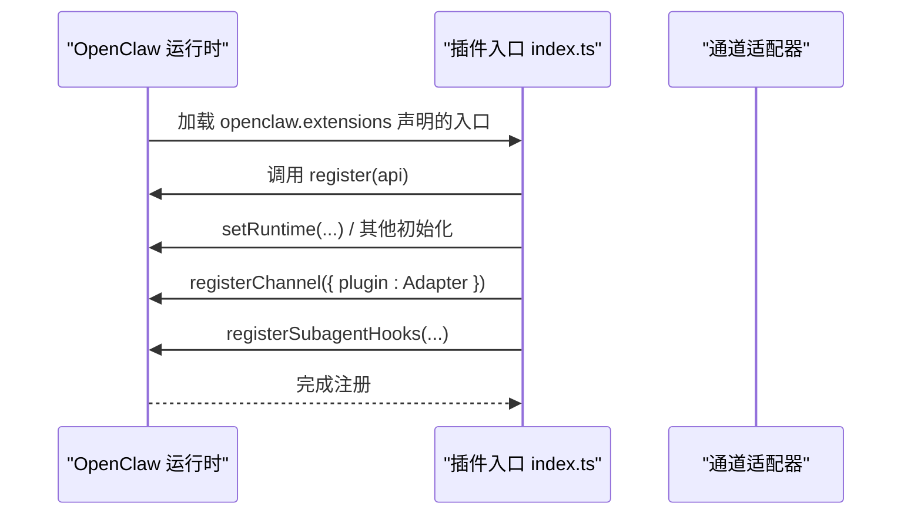
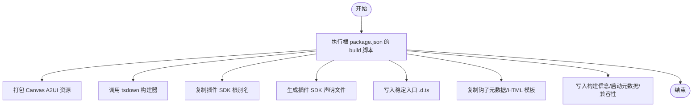
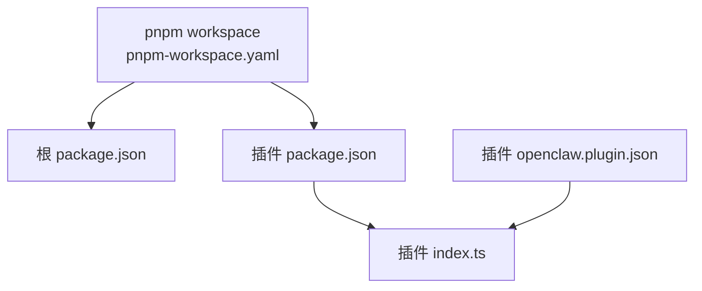

# 插件开发流程

<cite>
**本文档引用的文件**
- [README.md](file://README.md)
- [CONTRIBUTING.md](file://CONTRIBUTING.md)
- [package.json](file://package.json)
- [pnpm-workspace.yaml](file://pnpm-workspace.yaml)
- [src/plugin-sdk/index.ts](file://src/plugin-sdk/index.ts)
- [extensions/discord/openclaw.plugin.json](file://extensions/discord/openclaw.plugin.json)
- [extensions/discord/package.json](file://extensions/discord/package.json)
- [extensions/discord/index.ts](file://extensions/discord/index.ts)
- [extensions/telegram/openclaw.plugin.json](file://extensions/telegram/openclaw.plugin.json)
- [extensions/telegram/package.json](file://extensions/telegram/package.json)
- [scripts/tsdown-build.mjs](file://scripts/tsdown-build.mjs)
- [scripts/write-plugin-sdk-entry-dts.ts](file://scripts/write-plugin-sdk-entry-dts.ts)
</cite>

## 目录
1. [简介](#简介)
2. [项目结构](#项目结构)
3. [核心组件](#核心组件)
4. [架构总览](#架构总览)
5. [详细组件分析](#详细组件分析)
6. [依赖关系分析](#依赖关系分析)
7. [性能考虑](#性能考虑)
8. [故障排除指南](#故障排除指南)
9. [结论](#结论)
10. [附录](#附录)

## 简介
本指南面向在 OpenClaw 生态系统中开发插件（扩展）的开发者，覆盖从需求分析到插件发布的完整生命周期：项目初始化、代码编写、测试验证、打包与发布。文档基于仓库中的现有插件示例与构建脚本，总结了 OpenClaw 插件的标准结构、配置约定、版本控制最佳实践以及构建打包流程，并给出发布到 OpenClaw 生态系统的注意事项。

## 项目结构
OpenClaw 采用 monorepo 结构，根目录通过 pnpm workspace 管理多个包，其中 extensions 目录存放各类插件。每个插件通常包含以下要素：
- 插件清单文件：openclaw.plugin.json，声明插件 id、支持的通道及配置模式
- 包描述文件：package.json，定义插件名称、版本、导出入口
- 入口文件：index.ts，注册插件并接入 OpenClaw 插件 SDK
- 可选：源码目录（如 src），实现具体通道适配逻辑

图表来源
- [package.json:1-465](file://package.json#L1-L465)
- [pnpm-workspace.yaml:1-18](file://pnpm-workspace.yaml#L1-L18)

章节来源
- [package.json:1-465](file://package.json#L1-L465)
- [pnpm-workspace.yaml:1-18](file://pnpm-workspace.yaml#L1-L18)

## 核心组件
- 插件 SDK 导出入口：src/plugin-sdk/index.ts 提供统一的类型与工具，包括通道适配器、运行时接口、HTTP 路由注册、配置模式等。插件通过该入口访问 OpenClaw 的插件 API。
- 插件清单：openclaw.plugin.json 定义插件标识、支持的通道列表以及配置模式（JSON Schema）。这是 OpenClaw 识别与加载插件的关键元数据。
- 插件包配置：package.json 中的 openclaw.extensions 字段声明入口模块，使 OpenClaw 能按需加载插件代码。
- 构建与打包：根 package.json 提供 build 脚本，配合 tsdown 构建器与声明文件生成脚本，输出可分发的插件产物。

章节来源
- [src/plugin-sdk/index.ts:1-826](file://src/plugin-sdk/index.ts#L1-L826)
- [extensions/discord/openclaw.plugin.json:1-10](file://extensions/discord/openclaw.plugin.json#L1-L10)
- [extensions/discord/package.json:1-12](file://extensions/discord/package.json#L1-L12)
- [package.json:217-339](file://package.json#L217-L339)

## 架构总览
OpenClaw 插件通过插件 SDK 注册到运行时，实现对特定消息通道（如 Discord、Telegram）的适配与扩展。插件清单与包配置共同决定插件的发现与加载路径；构建脚本负责生成分发所需的产物。

图表来源
- [src/plugin-sdk/index.ts:1-826](file://src/plugin-sdk/index.ts#L1-L826)
- [extensions/discord/package.json:1-12](file://extensions/discord/package.json#L1-L12)
- [extensions/discord/openclaw.plugin.json:1-10](file://extensions/discord/openclaw.plugin.json#L1-L10)
- [extensions/discord/index.ts:1-20](file://extensions/discord/index.ts#L1-L20)

## 详细组件分析

### 插件清单与配置
- 插件清单（openclaw.plugin.json）
  - 必填字段：id、channels（字符串数组，声明支持的通道）
  - 可选字段：configSchema（JSON Schema，约束插件配置）
- 包配置（package.json）
  - openclaw.extensions：声明入口模块路径，用于运行时加载
  - 类型与版本：遵循 Node module 类型与语义化版本
- 入口文件（index.ts）
  - 导出插件对象：包含 id、name、description、configSchema 与 register 回调
  - 在 register 中调用 api.registerChannel 或其他注册方法完成集成

图表来源
- [extensions/discord/openclaw.plugin.json:1-10](file://extensions/discord/openclaw.plugin.json#L1-L10)
- [extensions/discord/package.json:1-12](file://extensions/discord/package.json#L1-L12)
- [extensions/discord/index.ts:1-20](file://extensions/discord/index.ts#L1-L20)

章节来源
- [extensions/discord/openclaw.plugin.json:1-10](file://extensions/discord/openclaw.plugin.json#L1-L10)
- [extensions/discord/package.json:1-12](file://extensions/discord/package.json#L1-L12)
- [extensions/discord/index.ts:1-20](file://extensions/discord/index.ts#L1-L20)

### 插件注册与运行时集成
插件通过 register 回调接入 OpenClaw 插件 API，典型流程如下：
- 设置运行时能力或上下文
- 注册通道适配器（registerChannel）
- 注册子代理钩子或其他扩展点

图表来源
- [extensions/discord/index.ts:1-20](file://extensions/discord/index.ts#L1-L20)
- [src/plugin-sdk/index.ts:1-826](file://src/plugin-sdk/index.ts#L1-L826)

章节来源
- [extensions/discord/index.ts:1-20](file://extensions/discord/index.ts#L1-L20)
- [src/plugin-sdk/index.ts:1-826](file://src/plugin-sdk/index.ts#L1-L826)

### 构建与打包流程
- 构建脚本：根 package.json 的 build 脚本会执行一系列任务，包括 Canvas A2UI 打包、tsdown 构建、复制插件 SDK 别名、生成插件 SDK 声明文件等
- tsdown 构建器：通过 scripts/tsdown-build.mjs 启动 tsdown，按配置进行 TypeScript 编译与产物生成
- 声明文件：scripts/write-plugin-sdk-entry-dts.ts 生成稳定入口的 .d.ts 文件，确保导出映射正确

图表来源
- [package.json:217-339](file://package.json#L217-L339)
- [scripts/tsdown-build.mjs:1-20](file://scripts/tsdown-build.mjs#L1-L20)
- [scripts/write-plugin-sdk-entry-dts.ts:1-61](file://scripts/write-plugin-sdk-entry-dts.ts#L1-L61)

章节来源
- [package.json:217-339](file://package.json#L217-L339)
- [scripts/tsdown-build.mjs:1-20](file://scripts/tsdown-build.mjs#L1-L20)
- [scripts/write-plugin-sdk-entry-dts.ts:1-61](file://scripts/write-plugin-sdk-entry-dts.ts#L1-L61)

### 版本控制最佳实践
- 分支策略
  - 使用功能分支开发插件特性，合并前通过主干同步与冲突解决
  - 发布前在 main 上打标签，遵循语义化版本
- 提交规范
  - 遵循仓库既定的提交风格与审查流程
  - 在 PR 描述中清晰说明变更内容与动机
- 标签管理
  - 使用 vYYYY.M.D 或 vYYYY.M.D-<patch> 格式
  - 与 npm 发布渠道（latest、beta、dev）保持一致

章节来源
- [README.md:83-90](file://README.md#L83-L90)
- [CONTRIBUTING.md:79-106](file://CONTRIBUTING.md#L79-L106)

### 测试验证
- 单元测试与端到端测试：根 package.json 提供多种测试脚本，涵盖通道、网关、UI、插件等维度
- 建议在本地使用 OpenClaw 实例进行集成测试，确保插件在真实环境下的行为符合预期

章节来源
- [package.json:303-338](file://package.json#L303-L338)

### 发布到 OpenClaw 生态系统
- npm 发布
  - 根据仓库文档，OpenClaw 支持多渠道发布（stable、beta、dev），可通过命令切换
  - 发布前确保构建产物齐全、测试通过、变更日志更新
- 渠道选择
  - stable：正式版本，使用最新标签
  - beta：预发布版本，使用 beta 标签
  - dev：主干 HEAD，使用 dev 标签

章节来源
- [README.md:83-90](file://README.md#L83-L90)

## 依赖关系分析
OpenClaw 通过 pnpm workspace 管理依赖，插件作为独立包被统一构建与分发。插件清单与包配置共同决定其在运行时的可见性与加载路径。

图表来源
- [pnpm-workspace.yaml:1-18](file://pnpm-workspace.yaml#L1-L18)
- [package.json:1-465](file://package.json#L1-L465)
- [extensions/discord/package.json:1-12](file://extensions/discord/package.json#L1-L12)
- [extensions/discord/openclaw.plugin.json:1-10](file://extensions/discord/openclaw.plugin.json#L1-L10)

章节来源
- [pnpm-workspace.yaml:1-18](file://pnpm-workspace.yaml#L1-L18)
- [package.json:1-465](file://package.json#L1-L465)

## 性能考虑
- 构建阶段
  - 使用并行任务与增量构建减少等待时间
  - 控制插件 SDK 声明文件数量，避免过度拆分导致查找成本上升
- 运行时
  - 插件应尽量轻量注册，避免在 register 中执行重负载操作
  - 合理使用运行时缓存与队列机制，降低重复计算与 I/O 开销

## 故障排除指南
- 构建失败
  - 检查 tsdown 配置与依赖版本是否匹配
  - 确认声明文件生成脚本已正确执行
- 插件未加载
  - 核对 openclaw.plugin.json 的 id 与 channels 是否正确
  - 确认 package.json 的 openclaw.extensions 路径有效
- 运行时错误
  - 在 register 中添加必要的日志与边界检查
  - 使用 OpenClaw 的诊断与日志工具定位问题

章节来源
- [scripts/tsdown-build.mjs:1-20](file://scripts/tsdown-build.mjs#L1-L20)
- [scripts/write-plugin-sdk-entry-dts.ts:1-61](file://scripts/write-plugin-sdk-entry-dts.ts#L1-L61)
- [extensions/discord/openclaw.plugin.json:1-10](file://extensions/discord/openclaw.plugin.json#L1-L10)
- [extensions/discord/package.json:1-12](file://extensions/discord/package.json#L1-L12)

## 结论
OpenClaw 插件开发遵循标准化的结构与流程：以 openclaw.plugin.json 与 package.json 作为元数据与入口声明，通过 src/plugin-sdk/index.ts 获取统一的插件 API，借助根构建脚本完成产物生成与分发。结合仓库提供的测试与发布渠道，开发者可以高效地完成从需求到上线的全生命周期管理。

## 附录
- 快速参考
  - 插件清单：openclaw.plugin.json
  - 包配置：package.json（openclaw.extensions）
  - 入口文件：index.ts
  - 构建脚本：根 package.json 的 build
  - 工作区：pnpm-workspace.yaml

章节来源
- [extensions/discord/openclaw.plugin.json:1-10](file://extensions/discord/openclaw.plugin.json#L1-L10)
- [extensions/discord/package.json:1-12](file://extensions/discord/package.json#L1-L12)
- [extensions/discord/index.ts:1-20](file://extensions/discord/index.ts#L1-L20)
- [package.json:217-339](file://package.json#L217-L339)
- [pnpm-workspace.yaml:1-18](file://pnpm-workspace.yaml#L1-L18)