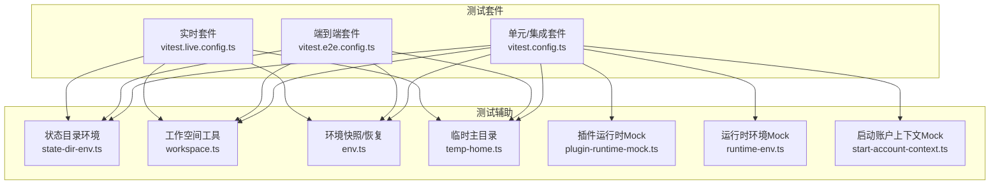
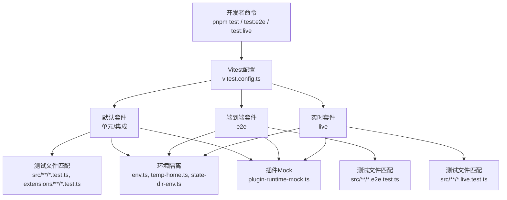
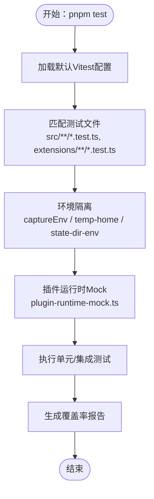
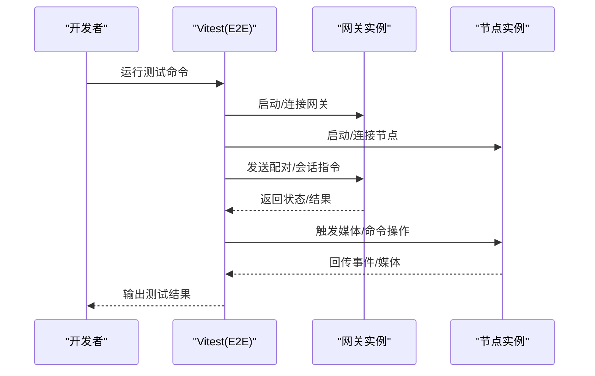
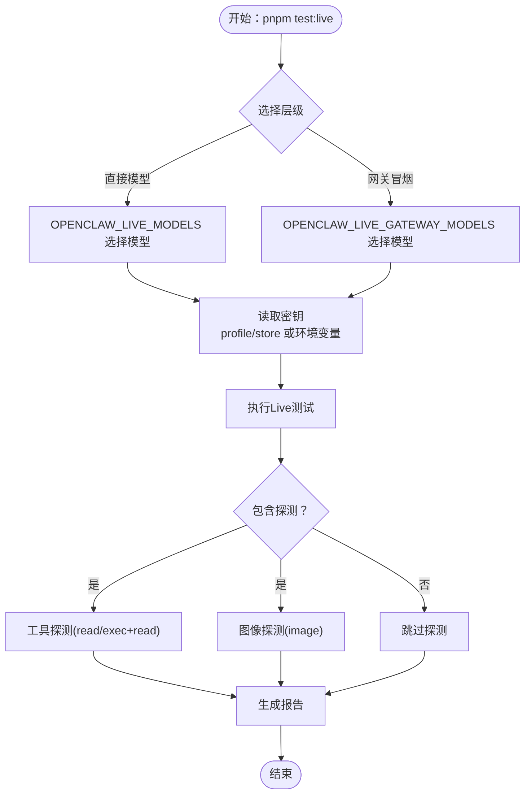
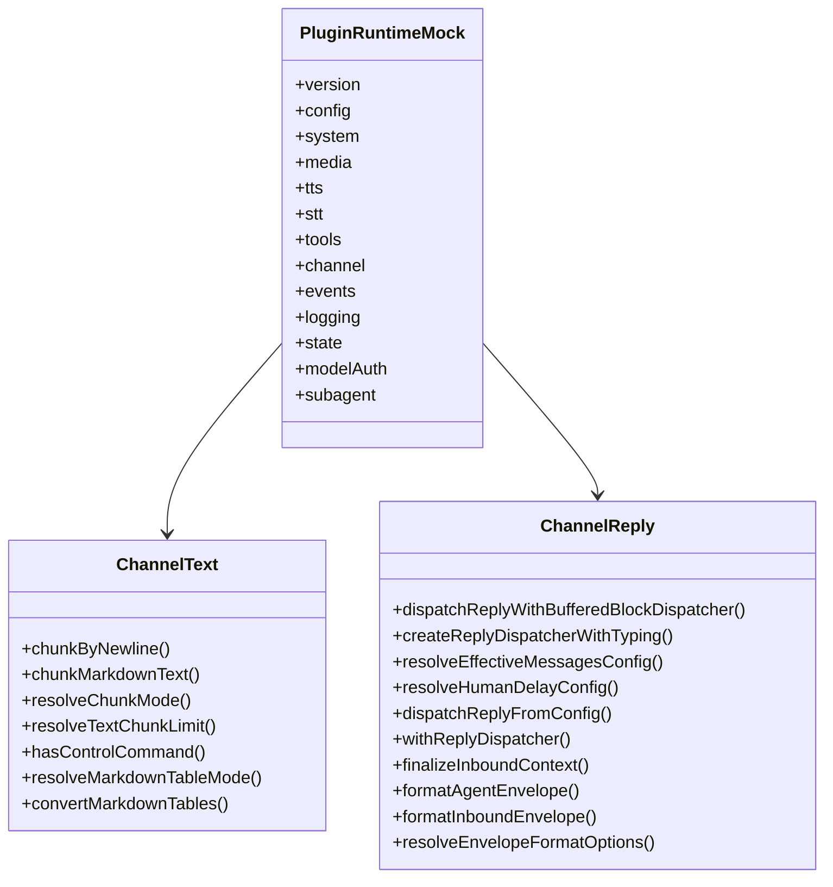
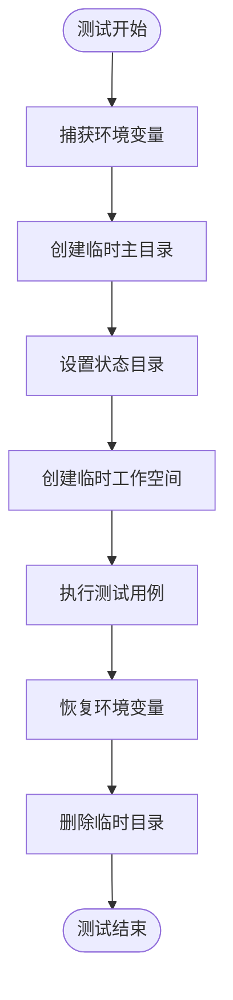
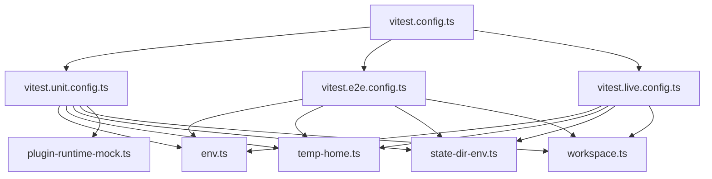

# 插件测试策略

<cite>
**本文档引用的文件**
- [README.md](file://README.md)
- [docs/help/testing.md](file://docs/help/testing.md)
- [vitest.config.ts](file://vitest.config.ts)
- [vitest.unit.config.ts](file://vitest.unit.config.ts)
- [vitest.e2e.config.ts](file://vitest.e2e.config.ts)
- [vitest.live.config.ts](file://vitest.live.config.ts)
- [src/test-helpers/state-dir-env.ts](file://src/test-helpers/state-dir-env.ts)
- [src/test-helpers/workspace.ts](file://src/test-helpers/workspace.ts)
- [src/test-utils/env.ts](file://src/test-utils/env.ts)
- [src/test-utils/temp-home.ts](file://src/test-utils/temp-home.ts)
- [extensions/test-utils/plugin-runtime-mock.ts](file://extensions/test-utils/plugin-runtime-mock.ts)
- [extensions/test-utils/runtime-env.ts](file://extensions/test-utils/runtime-env.ts)
- [extensions/test-utils/start-account-context.ts](file://extensions/test-utils/start-account-context.ts)
</cite>

## 目录
1. [引言](#引言)
2. [项目结构](#项目结构)
3. [核心组件](#核心组件)
4. [架构总览](#架构总览)
5. [详细组件分析](#详细组件分析)
6. [依赖关系分析](#依赖关系分析)
7. [性能考虑](#性能考虑)
8. [故障排除指南](#故障排除指南)
9. [结论](#结论)
10. [附录](#附录)

## 引言
本文件面向OpenClaw插件开发者，系统化阐述插件测试策略与实践，覆盖单元测试、集成测试与端到端测试（E2E）三层体系，以及真实提供商（Live）测试的组织方式。文档重点说明：
- 测试环境搭建：模拟对象、测试数据准备、隔离环境配置
- 功能测试方法：API调用、错误处理、边界条件
- 性能测试指标与方法：响应时间、内存使用、并发处理
- 兼容性测试策略：跨OpenClaw版本与平台的稳定性保障
- 自动化与持续集成配置：命令、变量与容器化运行器

## 项目结构
OpenClaw采用多包工作区与分层架构，测试体系由Vitest统一管理，按套件划分职责：
- 单元/集成套件：默认测试，覆盖纯单元与进程内集成场景
- 端到端套件：多实例网关与网络交互验证
- 实时套件：真实提供商与模型调用，用于回归与冒烟
- 扩展测试：各插件扩展的独立测试集

**图表来源**
- [vitest.config.ts:71-201](file://vitest.config.ts#L71-L201)
- [vitest.e2e.config.ts:20-32](file://vitest.e2e.config.ts#L20-L32)
- [vitest.live.config.ts:8-16](file://vitest.live.config.ts#L8-L16)
- [src/test-helpers/state-dir-env.ts:6-34](file://src/test-helpers/state-dir-env.ts#L6-L34)
- [src/test-helpers/workspace.ts:5-17](file://src/test-helpers/workspace.ts#L5-L17)
- [src/test-utils/env.ts:1-73](file://src/test-utils/env.ts#L1-L73)
- [src/test-utils/temp-home.ts:19-43](file://src/test-utils/temp-home.ts#L19-L43)
- [extensions/test-utils/plugin-runtime-mock.ts:35-271](file://extensions/test-utils/plugin-runtime-mock.ts#L35-L271)
- [extensions/test-utils/runtime-env.ts:4-12](file://extensions/test-utils/runtime-env.ts#L4-L12)
- [extensions/test-utils/start-account-context.ts:9-33](file://extensions/test-utils/start-account-context.ts#L9-L33)

**章节来源**
- [README.md:10-111](file://README.md#L10-L111)
- [docs/help/testing.md:38-95](file://docs/help/testing.md#L38-L95)
- [vitest.config.ts:57-201](file://vitest.config.ts#L57-L201)

## 核心组件
- 测试套件配置
  - 默认套件：包含单元与集成测试，支持VM Forks以提升并行效率，并在Node 24+自动回退至普通forks避免链接错误
  - 端到端套件：使用forks保证文件间模块状态隔离，支持自适应worker数量与静默输出控制
  - 实时套件：单worker串行执行，确保真实网络与配额行为可重复
- 测试辅助工具
  - 环境隔离：捕获/恢复环境变量，临时主目录与状态目录，确保测试不污染宿主环境
  - 工作空间：临时工作空间创建与文件写入，便于会话/配置类测试
  - 插件运行时Mock：完整覆盖PluginRuntime接口，便于对插件API进行可控测试
  - 运行时环境Mock：日志、错误、退出行为的可控模拟
  - 启动账户上下文Mock：通道账户生命周期与状态变更的模拟

**章节来源**
- [vitest.config.ts:71-201](file://vitest.config.ts#L71-L201)
- [vitest.e2e.config.ts:20-32](file://vitest.e2e.config.ts#L20-L32)
- [vitest.live.config.ts:8-16](file://vitest.live.config.ts#L8-L16)
- [src/test-helpers/state-dir-env.ts:6-34](file://src/test-helpers/state-dir-env.ts#L6-L34)
- [src/test-helpers/workspace.ts:5-17](file://src/test-helpers/workspace.ts#L5-L17)
- [src/test-utils/env.ts:1-73](file://src/test-utils/env.ts#L1-L73)
- [src/test-utils/temp-home.ts:19-43](file://src/test-utils/temp-home.ts#L19-L43)
- [extensions/test-utils/plugin-runtime-mock.ts:35-271](file://extensions/test-utils/plugin-runtime-mock.ts#L35-L271)
- [extensions/test-utils/runtime-env.ts:4-12](file://extensions/test-utils/runtime-env.ts#L4-L12)
- [extensions/test-utils/start-account-context.ts:9-33](file://extensions/test-utils/start-account-context.ts#L9-L33)

## 架构总览
下图展示OpenClaw测试体系的总体架构与关键交互：

**图表来源**
- [docs/help/testing.md:21-36](file://docs/help/testing.md#L21-L36)
- [vitest.config.ts:81-100](file://vitest.config.ts#L81-L100)
- [vitest.e2e.config.ts:29](file://vitest.e2e.config.ts#L29)
- [vitest.live.config.ts:13](file://vitest.live.config.ts#L13)
- [src/test-utils/env.ts:1-73](file://src/test-utils/env.ts#L1-L73)
- [src/test-utils/temp-home.ts:19-43](file://src/test-utils/temp-home.ts#L19-L43)
- [src/test-helpers/state-dir-env.ts:6-34](file://src/test-helpers/state-dir-env.ts#L6-L34)
- [extensions/test-utils/plugin-runtime-mock.ts:35-271](file://extensions/test-utils/plugin-runtime-mock.ts#L35-L271)

## 详细组件分析

### 单元/集成测试（默认套件）
- 范围与期望
  - 纯单元测试、进程内集成（网关认证、路由、工具、解析、配置）
  - 确定性已知问题回归
  - 无需真实密钥，CI稳定运行
- 并发与隔离
  - Node 22/23使用vmForks加速；Node 24+回退forks避免VM链接错误
  - 支持通过环境变量强制选择vmForks或forks
- 文件与排除
  - 包含src、extensions、test目录下的测试文件
  - 排除live/e2e测试与大型集成面（如agents、gateway等）

**图表来源**
- [docs/help/testing.md:21-36](file://docs/help/testing.md#L21-L36)
- [vitest.config.ts:71-201](file://vitest.config.ts#L71-L201)
- [src/test-utils/env.ts:1-73](file://src/test-utils/env.ts#L1-L73)
- [src/test-utils/temp-home.ts:19-43](file://src/test-utils/temp-home.ts#L19-L43)
- [src/test-helpers/state-dir-env.ts:6-34](file://src/test-helpers/state-dir-env.ts#L6-L34)
- [extensions/test-utils/plugin-runtime-mock.ts:35-271](file://extensions/test-utils/plugin-runtime-mock.ts#L35-L271)

**章节来源**
- [docs/help/testing.md:42-58](file://docs/help/testing.md#L42-L58)
- [vitest.config.ts:71-201](file://vitest.config.ts#L71-L201)

### 端到端测试（E2E）
- 范围与期望
  - 多实例网关端到端行为、WebSocket/HTTP表面、节点配对与重网络
  - 需要真实密钥的场景不在此套件中
- 并发与隔离
  - 使用forks保证文件间模块状态隔离
  - 支持通过环境变量设置worker数量与输出模式
- 文件与排除
  - 匹配src/**/*.e2e.test.ts
  - 排除live测试

**图表来源**
- [docs/help/testing.md:60-79](file://docs/help/testing.md#L60-L79)
- [vitest.e2e.config.ts:20-32](file://vitest.e2e.config.ts#L20-L32)

**章节来源**
- [docs/help/testing.md:60-79](file://docs/help/testing.md#L60-L79)
- [vitest.e2e.config.ts:20-32](file://vitest.e2e.config.ts#L20-L32)

### 实时测试（Live）
- 范围与期望
  - 验证真实提供商/模型在“今天”是否可用
  - 捕捉提供商格式变化、工具调用差异、鉴权问题与速率限制
  - 成本与配额消耗，建议窄化子集运行
- 分层设计
  - 直接模型层：仅验证提供商/模型可回答
  - 网关冒烟层：验证完整网关+代理流水线（会话、历史、工具、沙箱策略等）
- 关键变量
  - OPENCLAW_LIVE_TEST、OPENCLAW_LIVE_MODELS、OPENCLAW_LIVE_GATEWAY_MODELS、OPENCLAW_LIVE_PROVIDERS、OPENCLAW_LIVE_REQUIRE_PROFILE_KEYS等
  - 支持通过配置文件与环境变量组合选择模型与提供商

**图表来源**
- [docs/help/testing.md:80-184](file://docs/help/testing.md#L80-L184)
- [docs/help/testing.md:185-242](file://docs/help/testing.md#L185-L242)

**章节来源**
- [docs/help/testing.md:80-184](file://docs/help/testing.md#L80-L184)
- [docs/help/testing.md:185-242](file://docs/help/testing.md#L185-L242)

### 插件运行时Mock（PluginRuntime）
- 设计目标
  - 完整覆盖PluginRuntime接口，便于对插件API进行可控测试
  - 支持深度合并覆盖，便于局部定制
- 关键能力
  - 配置、系统、媒体、TTS/STT、工具、通道文本/回复/路由/配对/媒体/会话/提及/反应/群组/防抖/命令
  - 事件、日志、状态、模型鉴权、子代理等
- 使用建议
  - 在单元测试中优先使用此Mock，减少外部依赖
  - 对特定场景通过overrides参数微调行为

**图表来源**
- [extensions/test-utils/plugin-runtime-mock.ts:35-271](file://extensions/test-utils/plugin-runtime-mock.ts#L35-L271)

**章节来源**
- [extensions/test-utils/plugin-runtime-mock.ts:35-271](file://extensions/test-utils/plugin-runtime-mock.ts#L35-L271)

### 测试环境隔离与数据准备
- 环境隔离
  - captureEnv/captureFullEnv：捕获/恢复指定或全部环境变量
  - createTempHomeEnv：创建临时主目录与.openclaw目录，设置HOME/USERPROFILE等
  - setStateDirEnv/withStateDirEnv：设置/恢复OPENCLAW_STATE_DIR，清理临时目录
- 测试数据
  - makeTempWorkspace/writeWorkspaceFile：创建临时工作空间与文件，便于会话/配置测试
- 使用建议
  - 在每个测试前捕获环境，结束后恢复，避免跨测污染
  - 使用临时工作空间与状态目录，确保测试可重复

**图表来源**
- [src/test-utils/env.ts:1-73](file://src/test-utils/env.ts#L1-L73)
- [src/test-utils/temp-home.ts:19-43](file://src/test-utils/temp-home.ts#L19-L43)
- [src/test-helpers/state-dir-env.ts:6-34](file://src/test-helpers/state-dir-env.ts#L6-L34)
- [src/test-helpers/workspace.ts:5-17](file://src/test-helpers/workspace.ts#L5-L17)

**章节来源**
- [src/test-utils/env.ts:1-73](file://src/test-utils/env.ts#L1-L73)
- [src/test-utils/temp-home.ts:19-43](file://src/test-utils/temp-home.ts#L19-L43)
- [src/test-helpers/state-dir-env.ts:6-34](file://src/test-helpers/state-dir-env.ts#L6-L34)
- [src/test-helpers/workspace.ts:5-17](file://src/test-helpers/workspace.ts#L5-L17)

## 依赖关系分析
- 套件依赖
  - 默认套件依赖于通用测试配置与环境隔离工具
  - E2E套件依赖forks隔离与更少的排除项
  - Live套件依赖真实密钥与探测逻辑
- 插件Mock依赖
  - PluginRuntimeMock依赖Vitest的vi.fn进行函数桩
  - 运行时环境Mock与启动账户上下文Mock依赖PluginRuntime接口

**图表来源**
- [vitest.config.ts:57-201](file://vitest.config.ts#L57-L201)
- [vitest.unit.config.ts:11-30](file://vitest.unit.config.ts#L11-L30)
- [vitest.e2e.config.ts:20-32](file://vitest.e2e.config.ts#L20-L32)
- [vitest.live.config.ts:8-16](file://vitest.live.config.ts#L8-L16)
- [src/test-utils/env.ts:1-73](file://src/test-utils/env.ts#L1-L73)
- [src/test-utils/temp-home.ts:19-43](file://src/test-utils/temp-home.ts#L19-L43)
- [src/test-helpers/state-dir-env.ts:6-34](file://src/test-helpers/state-dir-env.ts#L6-L34)
- [src/test-helpers/workspace.ts:5-17](file://src/test-helpers/workspace.ts#L5-L17)
- [extensions/test-utils/plugin-runtime-mock.ts:35-271](file://extensions/test-utils/plugin-runtime-mock.ts#L35-L271)

**章节来源**
- [vitest.config.ts:57-201](file://vitest.config.ts#L57-L201)
- [vitest.unit.config.ts:11-30](file://vitest.unit.config.ts#L11-L30)
- [vitest.e2e.config.ts:20-32](file://vitest.e2e.config.ts#L20-L32)
- [vitest.live.config.ts:8-16](file://vitest.live.config.ts#L8-L16)

## 性能考虑
- 响应时间
  - 单元/集成测试：通过vmForks提升并发，缩短本地迭代周期
  - 端到端测试：使用forks隔离，避免跨文件状态泄漏导致的不稳定
  - 实时测试：单worker串行，避免并发带来的配额与网络波动
- 内存使用
  - 通过最小化测试范围与排除大型集成面，降低覆盖率统计与内存占用
  - 使用临时目录与工作空间，避免持久化数据影响后续测试
- 并发处理能力
  - 默认套件根据CPU核数动态调整workers，CI上Windows使用较少workers
  - E2E套件支持显式设置workers，便于在CI上平衡速度与稳定性
- 建议
  - 在本地优先运行单元/集成测试，快速反馈
  - 将E2E测试作为每日构建的一部分，确保网关与通道交互稳定
  - 实时测试按需窄化模型/提供商列表，避免成本与配额超支

**章节来源**
- [vitest.config.ts:71-201](file://vitest.config.ts#L71-L201)
- [vitest.e2e.config.ts:6-14](file://vitest.e2e.config.ts#L6-L14)
- [docs/help/testing.md:80-95](file://docs/help/testing.md#L80-L95)

## 故障排除指南
- 常见问题
  - 环境变量泄漏：使用captureEnv与withEnv确保测试前后恢复
  - 跨文件状态污染：E2E套件强制forks，避免vmForks下的模块状态泄漏
  - Node版本差异：默认套件在Node 24+自动回退forks，避免VM链接错误
- 定位手段
  - 使用verbose输出与worker数量控制定位资源竞争
  - 通过临时主目录与状态目录隔离，排除宿主配置干扰
  - 在实时测试中使用窄化模型/提供商列表，快速定位问题来源
- 参考路径
  - 环境隔离：[env.ts:1-73](file://src/test-utils/env.ts#L1-L73)、[temp-home.ts:19-43](file://src/test-utils/temp-home.ts#L19-L43)
  - 状态目录隔离：[state-dir-env.ts:6-34](file://src/test-helpers/state-dir-env.ts#L6-L34)
  - E2E隔离策略：[vitest.e2e.config.ts:20-32](file://vitest.e2e.config.ts#L20-L32)
  - 默认套件回退策略：[vitest.config.ts:56-58](file://vitest.config.ts#L56-L58)

**章节来源**
- [src/test-utils/env.ts:1-73](file://src/test-utils/env.ts#L1-L73)
- [src/test-utils/temp-home.ts:19-43](file://src/test-utils/temp-home.ts#L19-L43)
- [src/test-helpers/state-dir-env.ts:6-34](file://src/test-helpers/state-dir-env.ts#L6-L34)
- [vitest.e2e.config.ts:20-32](file://vitest.e2e.config.ts#L20-L32)
- [vitest.config.ts:56-58](file://vitest.config.ts#L56-L58)

## 结论
OpenClaw的测试体系以Vitest为核心，通过三层套件实现从单元到端到端再到实时的真实验证闭环。借助完善的环境隔离与Mock机制，插件开发者可以在本地高效地完成功能、错误处理与边界条件测试；通过实时套件与容器化运行器，确保在多平台与多版本OpenClaw上的稳定性与兼容性。建议在日常开发中优先使用单元/集成测试，在需要验证真实网络与工具链时再引入E2E与实时测试。

## 附录
- 快速命令
  - 全量检查：`pnpm build && pnpm check && pnpm test`
  - 覆盖率门禁：`pnpm test:coverage`
  - 端到端套件：`pnpm test:e2e`
  - 实时套件：`pnpm test:live`
- 关键变量
  - OPENCLAW_TEST_VM_FORKS、OPENCLAW_E2E_WORKERS、OPENCLAW_E2E_VERBOSE、OPENCLAW_LIVE_TEST、OPENCLAW_LIVE_MODELS、OPENCLAW_LIVE_GATEWAY_MODELS、OPENCLAW_LIVE_PROVIDERS、OPENCLAW_LIVE_REQUIRE_PROFILE_KEYS等
- 容器化运行器
  - 直接模型：`pnpm test:docker:live-models`
  - 网关冒烟：`pnpm test:docker:live-gateway`
  - 引导向导：`pnpm test:docker:onboard`
  - 网关网络：`pnpm test:docker:gateway-network`
  - 插件：`pnpm test:docker:plugins`

**章节来源**
- [docs/help/testing.md:21-36](file://docs/help/testing.md#L21-L36)
- [docs/help/testing.md:365-372](file://docs/help/testing.md#L365-L372)
- [docs/help/testing.md:346-359](file://docs/help/testing.md#L346-L359)