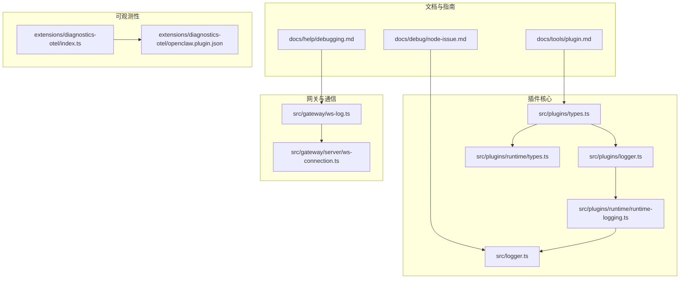
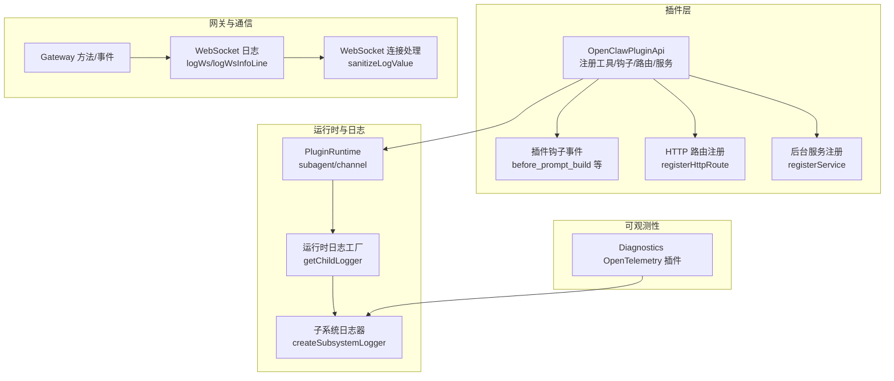
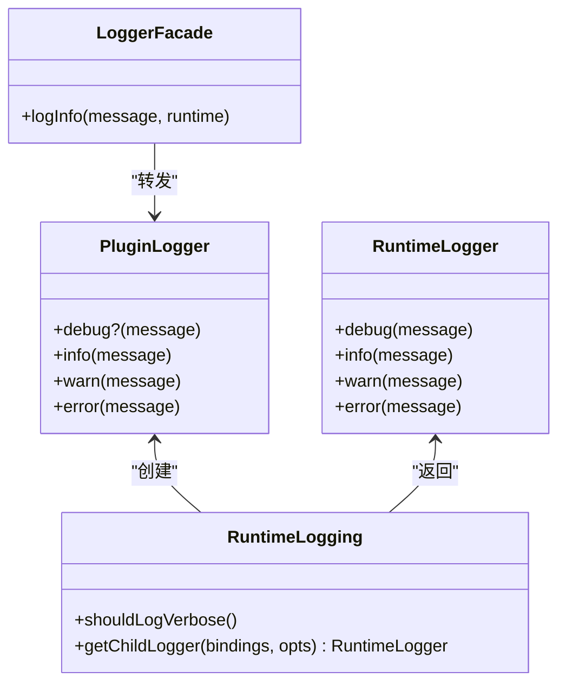
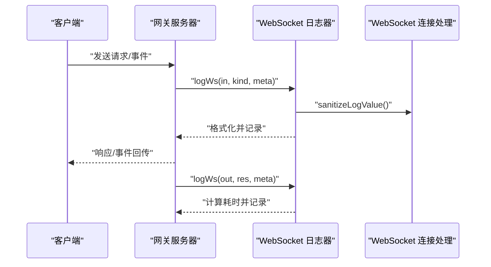
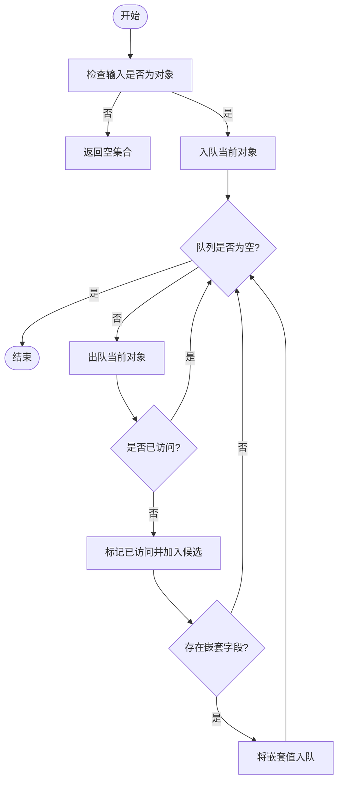
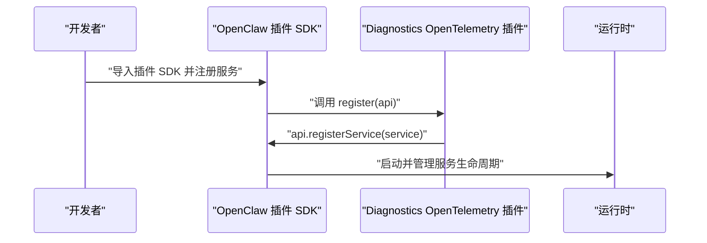
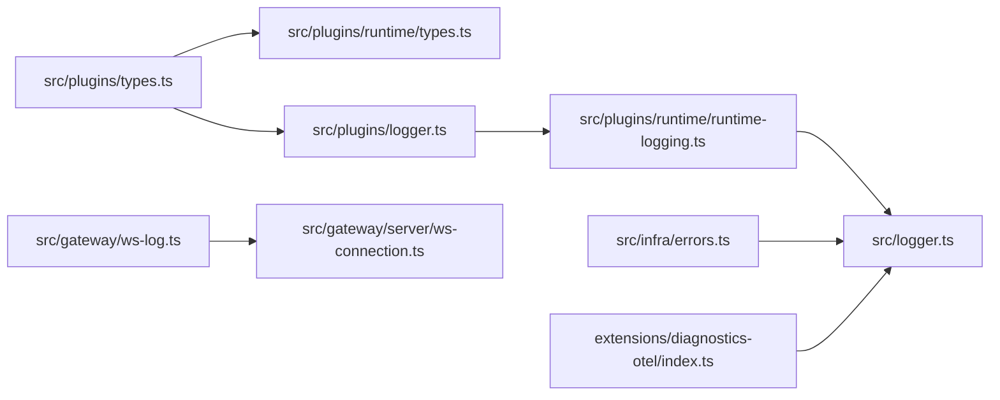

# 插件调试技巧

<cite>
**本文引用的文件**
- [docs/help/debugging.md](file://docs/help/debugging.md)
- [docs/debug/node-issue.md](file://docs/debug/node-issue.md)
- [docs/tools/plugin.md](file://docs/tools/plugin.md)
- [src/plugins/types.ts](file://src/plugins/types.ts)
- [src/plugins/runtime/types.ts](file://src/plugins/runtime/types.ts)
- [src/plugins/runtime/runtime-logging.ts](file://src/plugins/runtime/runtime-logging.ts)
- [src/plugins/logger.ts](file://src/plugins/logger.ts)
- [src/logger.ts](file://src/logger.ts)
- [src/gateway/ws-log.ts](file://src/gateway/ws-log.ts)
- [src/gateway/server/ws-connection.ts](file://src/gateway/server/ws-connection.ts)
- [src/infra/errors.ts](file://src/infra/errors.ts)
- [extensions/diagnostics-otel/index.ts](file://extensions/diagnostics-otel/index.ts)
- [extensions/diagnostics-otel/openclaw.plugin.json](file://extensions/diagnostics-otel/openclaw.plugin.json)
</cite>

## 目录
1. [简介](#简介)
2. [项目结构](#项目结构)
3. [核心组件](#核心组件)
4. [架构总览](#架构总览)
5. [详细组件分析](#详细组件分析)
6. [依赖关系分析](#依赖关系分析)
7. [性能考量](#性能考量)
8. [故障排查指南](#故障排查指南)
9. [结论](#结论)
10. [附录](#附录)

## 简介
本指南面向 OpenClaw 插件开发者，聚焦于插件开发与集成过程中的调试方法与最佳实践。内容覆盖编译与运行时问题诊断、性能瓶颈定位、日志与可观测性、WebSocket 通信调试、API 调用跟踪以及常见陷阱与规避策略。文中所有技术细节均基于仓库内现有实现与文档进行归纳总结。

## 项目结构
围绕插件调试的关键目录与文件如下：
- 文档与调试指南：docs/help/debugging.md、docs/debug/node-issue.md、docs/tools/plugin.md
- 插件类型与运行时：src/plugins/types.ts、src/plugins/runtime/types.ts
- 插件日志与子系统日志：src/plugins/runtime/runtime-logging.ts、src/plugins/logger.ts、src/logger.ts
- 网关 WebSocket 日志与连接：src/gateway/ws-log.ts、src/gateway/server/ws-connection.ts
- 错误处理与诊断：src/infra/errors.ts
- 可观测性扩展示例：extensions/diagnostics-otel/index.ts、extensions/diagnostics-otel/openclaw.plugin.json

图表来源
- [docs/help/debugging.md:1-163](file://docs/help/debugging.md#L1-L163)
- [docs/debug/node-issue.md:1-86](file://docs/debug/node-issue.md#L1-L86)
- [docs/tools/plugin.md:1-963](file://docs/tools/plugin.md#L1-L963)
- [src/plugins/types.ts:1-893](file://src/plugins/types.ts#L1-L893)
- [src/plugins/runtime/types.ts:1-64](file://src/plugins/runtime/types.ts#L1-L64)
- [src/plugins/runtime/runtime-logging.ts:1-21](file://src/plugins/runtime/runtime-logging.ts#L1-L21)
- [src/plugins/logger.ts:1-17](file://src/plugins/logger.ts#L1-L17)
- [src/logger.ts:1-46](file://src/logger.ts#L1-L46)
- [src/gateway/ws-log.ts:47-292](file://src/gateway/ws-log.ts#L47-L292)
- [src/gateway/server/ws-connection.ts:24-75](file://src/gateway/server/ws-connection.ts#L24-L75)
- [extensions/diagnostics-otel/index.ts:1-16](file://extensions/diagnostics-otel/index.ts#L1-L16)
- [extensions/diagnostics-otel/openclaw.plugin.json:1-9](file://extensions/diagnostics-otel/openclaw.plugin.json#L1-L9)

章节来源
- [docs/help/debugging.md:1-163](file://docs/help/debugging.md#L1-L163)
- [docs/tools/plugin.md:1-963](file://docs/tools/plugin.md#L1-L963)

## 核心组件
- 插件 API 类型与钩子体系：定义了插件注册能力、命令、HTTP 路由、服务、通道等接口，以及丰富的生命周期钩子事件，便于在不同阶段注入调试逻辑。
- 运行时日志与子系统日志：提供运行时日志工厂与子系统日志器，支持按绑定上下文生成子日志器，并可设置日志级别。
- 网关 WebSocket 日志：对入站/出站消息进行结构化记录，支持状态标记、耗时统计与精简输出模式，便于 WebSocket 通信调试。
- 错误提取与诊断：提供错误码提取、名称读取与错误图候选收集等辅助函数，帮助快速定位异常根因。
- 可观测性扩展：以 Diagnostics OpenTelemetry 插件为例，展示如何通过插件注册服务导出诊断事件到外部系统。

章节来源
- [src/plugins/types.ts:22-306](file://src/plugins/types.ts#L22-L306)
- [src/plugins/runtime/types.ts:51-64](file://src/plugins/runtime/types.ts#L51-L64)
- [src/plugins/runtime/runtime-logging.ts:6-21](file://src/plugins/runtime/runtime-logging.ts#L6-L21)
- [src/gateway/ws-log.ts:256-292](file://src/gateway/ws-log.ts#L256-L292)
- [src/infra/errors.ts:1-52](file://src/infra/errors.ts#L1-L52)
- [extensions/diagnostics-otel/index.ts:1-16](file://extensions/diagnostics-otel/index.ts#L1-L16)

## 架构总览
下图展示了插件调试相关的系统交互：插件通过 API 注册工具、钩子、HTTP 路由与服务；运行时日志与子系统日志贯穿插件执行链路；网关 WebSocket 提供通信层面的可观测性；错误处理与诊断函数为问题定位提供支撑；可观测性扩展可将诊断事件导出。

图表来源
- [src/plugins/types.ts:263-306](file://src/plugins/types.ts#L263-L306)
- [src/plugins/runtime/types.ts:51-64](file://src/plugins/runtime/types.ts#L51-L64)
- [src/plugins/runtime/runtime-logging.ts:6-21](file://src/plugins/runtime/runtime-logging.ts#L6-L21)
- [src/gateway/ws-log.ts:256-292](file://src/gateway/ws-log.ts#L256-L292)
- [src/gateway/server/ws-connection.ts:24-75](file://src/gateway/server/ws-connection.ts#L24-L75)
- [extensions/diagnostics-otel/index.ts:1-16](file://extensions/diagnostics-otel/index.ts#L1-L16)

## 详细组件分析

### 组件A：插件日志与子系统日志
- 插件加载器日志器：将 info/warn/error/debug 方法转发给宿主日志器，确保插件日志风格一致。
- 运行时日志工厂：根据绑定上下文生成子日志器，支持按需设置日志级别；是否启用详细日志由全局开关控制。
- 子系统日志器：统一处理带前缀的消息，便于在控制台中区分模块来源。

图表来源
- [src/plugins/logger.ts:10-17](file://src/plugins/logger.ts#L10-L17)
- [src/plugins/runtime/runtime-logging.ts:6-21](file://src/plugins/runtime/runtime-logging.ts#L6-L21)
- [src/logger.ts:20-46](file://src/logger.ts#L20-L46)

章节来源
- [src/plugins/logger.ts:1-17](file://src/plugins/logger.ts#L1-L17)
- [src/plugins/runtime/runtime-logging.ts:1-21](file://src/plugins/runtime/runtime-logging.ts#L1-L21)
- [src/logger.ts:1-46](file://src/logger.ts#L1-L46)

### 组件B：WebSocket 通信调试
- 入站/出站消息记录：支持状态标记（成功/失败）、方法名/事件名高亮、耗时统计与精简输出模式。
- 控制字符清洗与长度截断：保证日志安全与可读性。
- 适配器风格：通过样式配置选择紧凑或自动模式，提升可观测性体验。

图表来源
- [src/gateway/ws-log.ts:256-292](file://src/gateway/ws-log.ts#L256-L292)
- [src/gateway/server/ws-connection.ts:24-75](file://src/gateway/server/ws-connection.ts#L24-L75)

章节来源
- [src/gateway/ws-log.ts:47-292](file://src/gateway/ws-log.ts#L47-L292)
- [src/gateway/server/ws-connection.ts:24-75](file://src/gateway/server/ws-connection.ts#L24-L75)

### 组件C：错误追踪与诊断
- 错误码提取：从异常对象中提取字符串或数字形式的错误码。
- 名称读取：获取异常对象的名称，辅助快速识别错误类型。
- 错误图候选收集：广度优先遍历对象图，收集可能的错误节点，便于深入分析。

图表来源
- [src/infra/errors.ts:25-52](file://src/infra/errors.ts#L25-L52)

章节来源
- [src/infra/errors.ts:1-52](file://src/infra/errors.ts#L1-L52)

### 组件D：可观测性扩展（Diagnostics OpenTelemetry）
- 插件注册服务：通过 registerService 将服务注入运行时，用于导出诊断事件。
- 配置声明：插件清单中声明空配置模式，表示无需额外参数即可启用。

图表来源
- [extensions/diagnostics-otel/index.ts:1-16](file://extensions/diagnostics-otel/index.ts#L1-L16)
- [extensions/diagnostics-otel/openclaw.plugin.json:1-9](file://extensions/diagnostics-otel/openclaw.plugin.json#L1-L9)

章节来源
- [extensions/diagnostics-otel/index.ts:1-16](file://extensions/diagnostics-otel/index.ts#L1-L16)
- [extensions/diagnostics-otel/openclaw.plugin.json:1-9](file://extensions/diagnostics-otel/openclaw.plugin.json#L1-L9)

## 依赖关系分析
- 插件 API 依赖运行时类型与日志工厂，确保插件在运行时具备一致的日志与上下文能力。
- WebSocket 日志依赖连接处理与子系统日志器，形成端到端的通信可观测性。
- 错误处理函数被广泛用于诊断流程，作为问题定位的通用工具。
- 可观测性扩展通过插件服务机制与日志系统协同工作。

图表来源
- [src/plugins/types.ts:1-893](file://src/plugins/types.ts#L1-L893)
- [src/plugins/runtime/types.ts:1-64](file://src/plugins/runtime/types.ts#L1-L64)
- [src/plugins/logger.ts:1-17](file://src/plugins/logger.ts#L1-L17)
- [src/plugins/runtime/runtime-logging.ts:1-21](file://src/plugins/runtime/runtime-logging.ts#L1-L21)
- [src/logger.ts:1-46](file://src/logger.ts#L1-L46)
- [src/gateway/ws-log.ts:47-292](file://src/gateway/ws-log.ts#L47-L292)
- [src/gateway/server/ws-connection.ts:24-75](file://src/gateway/server/ws-connection.ts#L24-L75)
- [src/infra/errors.ts:1-52](file://src/infra/errors.ts#L1-L52)
- [extensions/diagnostics-otel/index.ts:1-16](file://extensions/diagnostics-otel/index.ts#L1-L16)

章节来源
- [src/plugins/types.ts:1-893](file://src/plugins/types.ts#L1-L893)
- [src/plugins/runtime/types.ts:1-64](file://src/plugins/runtime/types.ts#L1-L64)
- [src/plugins/runtime/runtime-logging.ts:1-21](file://src/plugins/runtime/runtime-logging.ts#L1-L21)
- [src/plugins/logger.ts:1-17](file://src/plugins/logger.ts#L1-L17)
- [src/logger.ts:1-46](file://src/logger.ts#L1-L46)
- [src/gateway/ws-log.ts:47-292](file://src/gateway/ws-log.ts#L47-L292)
- [src/gateway/server/ws-connection.ts:24-75](file://src/gateway/server/ws-connection.ts#L24-L75)
- [src/infra/errors.ts:1-52](file://src/infra/errors.ts#L1-L52)
- [extensions/diagnostics-otel/index.ts:1-16](file://extensions/diagnostics-otel/index.ts#L1-L16)

## 性能考量
- 日志开销控制：通过运行时日志工厂与子系统日志器，按需设置日志级别与绑定上下文，避免过度输出造成性能损耗。
- WebSocket 通信可观测性：在高并发场景下，建议使用紧凑输出模式与状态标记，减少冗余信息；必要时开启耗时统计以便定位慢路径。
- 错误诊断效率：利用错误图候选收集算法，快速收敛到可疑节点，缩短诊断时间。
- 插件注册与加载：遵循插件清单与配置校验流程，避免在运行时触发不必要的重载或回退逻辑。

## 故障排查指南
- 编译与运行时环境
  - Node + tsx 启动崩溃：若遇到“__name is not a function”类崩溃，优先尝试使用 Bun 或切换到 Node LTS 版本；如需继续使用 tsx，可考虑禁用 keepNames 或降级版本。
  - 参考：docs/debug/node-issue.md
- 插件加载与配置
  - 使用插件清单与 JSON Schema 校验配置，确保字段正确且未启用冲突功能；变更配置后需重启网关。
  - 参考：docs/tools/plugin.md
- 日志与诊断
  - 利用运行时日志工厂与子系统日志器输出结构化日志；在需要时开启详细日志模式以捕获更细粒度信息。
  - 参考：src/plugins/runtime/runtime-logging.ts、src/logger.ts
- WebSocket 通信调试
  - 通过网关 WebSocket 日志器记录入站/出站消息，结合状态标记与耗时统计定位异常；注意控制字符清洗与长度截断规则。
  - 参考：src/gateway/ws-log.ts、src/gateway/server/ws-connection.ts
- 错误追踪
  - 使用错误码提取与名称读取辅助函数快速识别异常类型；通过错误图候选收集算法遍历对象图，缩小问题范围。
  - 参考：src/infra/errors.ts
- 可观测性扩展
  - 通过注册服务导出诊断事件至外部系统，结合插件清单配置启用所需功能。
  - 参考：extensions/diagnostics-otel/index.ts、extensions/diagnostics-otel/openclaw.plugin.json

章节来源
- [docs/debug/node-issue.md:1-86](file://docs/debug/node-issue.md#L1-L86)
- [docs/tools/plugin.md:1-963](file://docs/tools/plugin.md#L1-L963)
- [src/plugins/runtime/runtime-logging.ts:1-21](file://src/plugins/runtime/runtime-logging.ts#L1-L21)
- [src/logger.ts:1-46](file://src/logger.ts#L1-L46)
- [src/gateway/ws-log.ts:47-292](file://src/gateway/ws-log.ts#L47-L292)
- [src/gateway/server/ws-connection.ts:24-75](file://src/gateway/server/ws-connection.ts#L24-L75)
- [src/infra/errors.ts:1-52](file://src/infra/errors.ts#L1-L52)
- [extensions/diagnostics-otel/index.ts:1-16](file://extensions/diagnostics-otel/index.ts#L1-L16)
- [extensions/diagnostics-otel/openclaw.plugin.json:1-9](file://extensions/diagnostics-otel/openclaw.plugin.json#L1-L9)

## 结论
通过对插件 API、运行时日志、WebSocket 通信与错误诊断等模块的系统梳理，开发者可以在插件开发与集成过程中建立一套完整的调试闭环：从日志与可观测性入手，借助钩子与服务扩展能力，配合 WebSocket 与 API 调用跟踪，最终实现对编译错误、运行时异常与性能瓶颈的高效定位与解决。

## 附录
- 快速参考
  - 插件 API 与钩子：src/plugins/types.ts
  - 运行时日志工厂：src/plugins/runtime/runtime-logging.ts
  - WebSocket 日志：src/gateway/ws-log.ts
  - 错误处理：src/infra/errors.ts
  - 插件指南：docs/tools/plugin.md
  - 调试指南：docs/help/debugging.md
  - Node + tsx 崩溃：docs/debug/node-issue.md
  - 可观测性扩展：extensions/diagnostics-otel/*