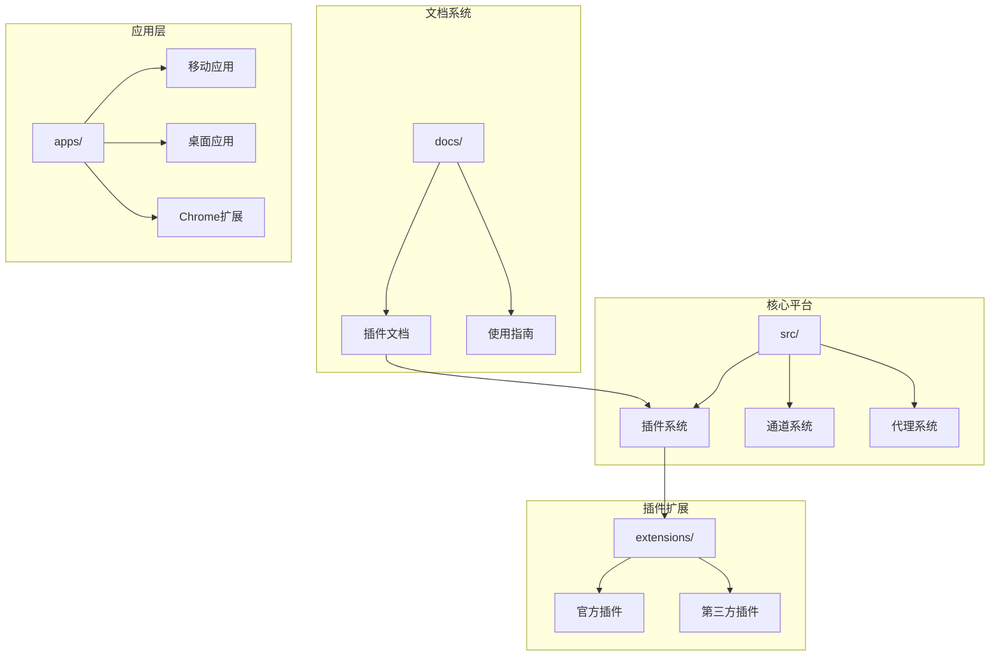
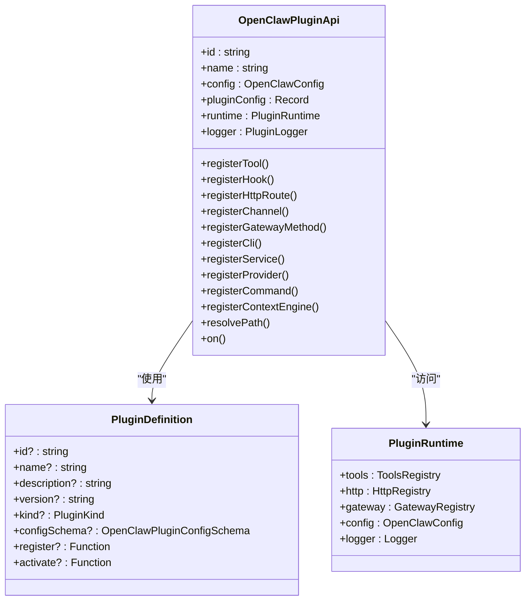
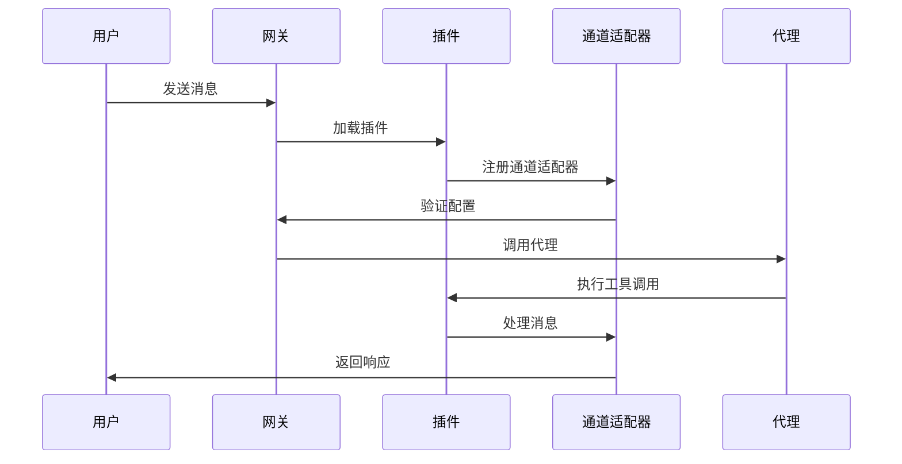
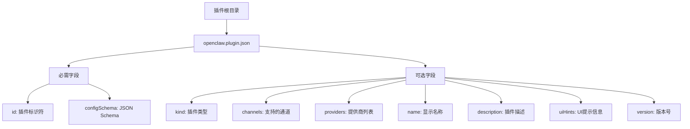
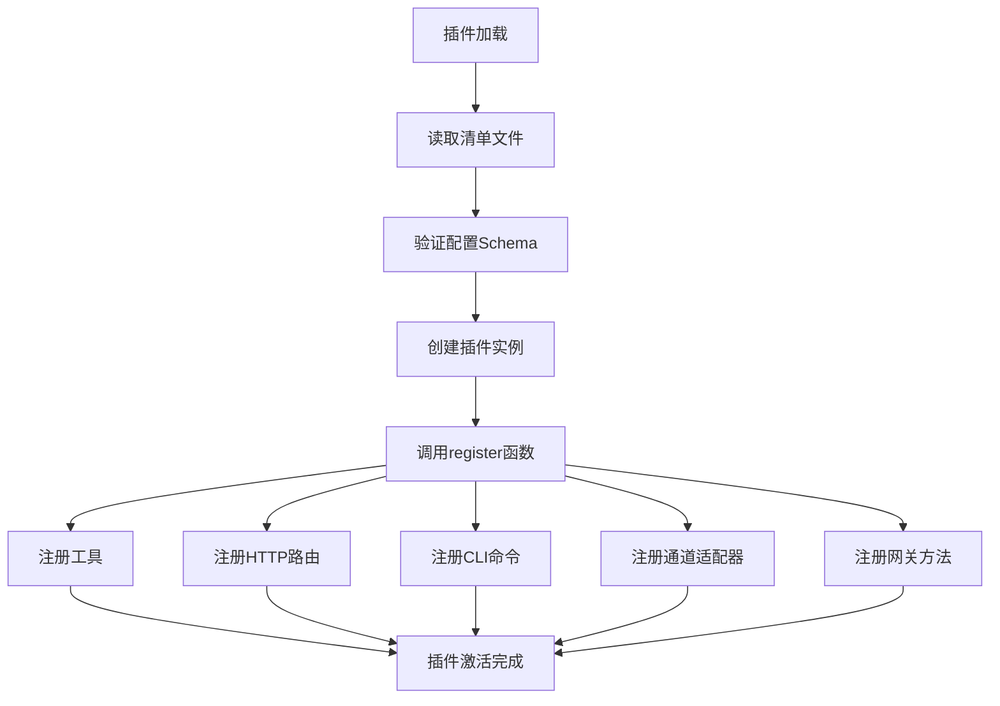
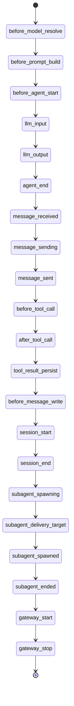
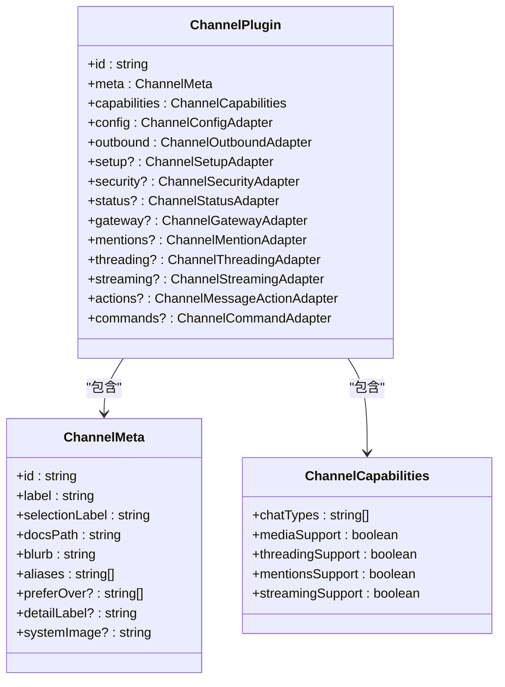
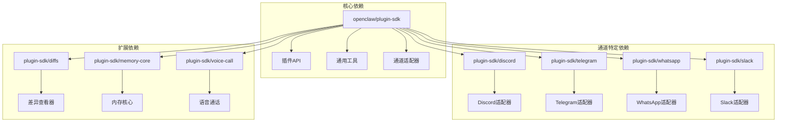
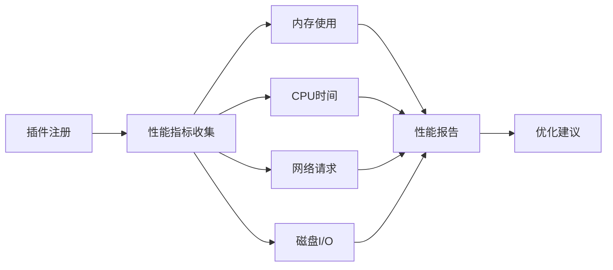

# 插件开发指南

<cite>
**本文档引用的文件**
- [README.md](file://README.md)
- [plugin-sdk/index.ts](file://src/plugin-sdk/index.ts)
- [plugins/types.ts](file://src/plugins/types.ts)
- [plugin.md](file://docs/tools/plugin.md)
- [manifest.md](file://docs/plugins/manifest.md)
- [bluebubbles/openclaw.plugin.json](file://extensions/bluebubbles/openclaw.plugin.json)
- [discord/openclaw.plugin.json](file://extensions/discord/openclaw.plugin.json)
- [telegram/openclaw.plugin.json](file://extensions/telegram/openclaw.plugin.json)
- [memory-core/openclaw.plugin.json](file://extensions/memory-core/openclaw.plugin.json)
- [diffs/openclaw.plugin.json](file://extensions/diffs/openclaw.plugin.json)
- [diffs/index.ts](file://extensions/diffs/index.ts)
- [memory-core/index.ts](file://extensions/memory-core/index.ts)
</cite>

## 目录
1. [简介](#简介)
2. [项目结构](#项目结构)
3. [核心组件](#核心组件)
4. [架构概览](#架构概览)
5. [详细组件分析](#详细组件分析)
6. [依赖分析](#依赖分析)
7. [性能考虑](#性能考虑)
8. [故障排除指南](#故障排除指南)
9. [结论](#结论)
10. [附录](#附录)

## 简介

OpenClaw是一个可在用户自己的设备上运行的个人AI助手。它支持多种消息渠道（WhatsApp、Telegram、Slack、Discord等），可以在macOS/iOS/Android上进行语音和监听，并能够渲染实时画布。本指南专注于OpenClaw插件开发，提供从环境搭建到部署发布的完整开发流程。

## 项目结构

OpenClaw采用模块化架构，主要包含以下关键目录：



**图表来源**
- [README.md:1-560](file://README.md#L1-L560)
- [plugin-sdk/index.ts:1-826](file://src/plugin-sdk/index.ts#L1-L826)

**章节来源**
- [README.md:1-560](file://README.md#L1-L560)
- [plugin-sdk/index.ts:1-826](file://src/plugin-sdk/index.ts#L1-L826)

## 核心组件

### 插件SDK架构

OpenClaw的插件系统基于TypeScript构建，提供了完整的插件开发框架：



**图表来源**
- [plugins/types.ts:248-306](file://src/plugins/types.ts#L248-L306)
- [plugins/types.ts:259-261](file://src/plugins/types.ts#L259-L261)

### 插件类型系统

插件系统支持多种类型的插件：

| 插件类型 | 描述 | 示例 |
|---------|------|------|
| `memory` | 内存插件 | memory-core, memory-lancedb |
| `context-engine` | 上下文引擎插件 | 自定义上下文处理器 |
| `channel` | 通道插件 | discord, telegram, whatsapp |
| `provider` | 模型提供商插件 | 各种AI服务提供商 |

**章节来源**
- [plugins/types.ts:38-38](file://src/plugins/types.ts#L38-L38)
- [plugin-sdk/index.ts:648-800](file://src/plugin-sdk/index.ts#L648-L800)

## 架构概览

OpenClaw插件系统采用插件化架构，支持动态加载和热重载：



**图表来源**
- [plugin.md:62-79](file://docs/tools/plugin.md#L62-L79)
- [plugin-sdk/index.ts:1-826](file://src/plugin-sdk/index.ts#L1-L826)

## 详细组件分析

### 插件清单文件

每个插件都必须包含`openclaw.plugin.json`清单文件，用于声明插件元数据和配置模式：



**图表来源**
- [manifest.md:18-46](file://docs/plugins/manifest.md#L18-L46)

#### 清单文件示例

不同类型的插件清单文件示例如下：

**基础插件清单**
```json
{
  "id": "voice-call",
  "configSchema": {
    "type": "object",
    "additionalProperties": false,
    "properties": {}
  }
}
```

**通道插件清单**
```json
{
  "id": "discord",
  "channels": ["discord"],
  "configSchema": {
    "type": "object",
    "additionalProperties": false,
    "properties": {}
  }
}
```

**内存插件清单**
```json
{
  "id": "memory-core",
  "kind": "memory",
  "configSchema": {
    "type": "object",
    "additionalProperties": false,
    "properties": {}
  }
}
```

**章节来源**
- [manifest.md:11-76](file://docs/plugins/manifest.md#L11-L76)
- [bluebubbles/openclaw.plugin.json:1-10](file://extensions/bluebubbles/openclaw.plugin.json#L1-L10)
- [discord/openclaw.plugin.json:1-10](file://extensions/discord/openclaw.plugin.json#L1-L10)
- [telegram/openclaw.plugin.json:1-10](file://extensions/telegram/openclaw.plugin.json#L1-L10)
- [memory-core/openclaw.plugin.json:1-10](file://extensions/memory-core/openclaw.plugin.json#L1-L10)

### 插件注册流程

插件通过`register`函数向OpenClaw注册其功能：



**图表来源**
- [plugin.md:484-521](file://docs/tools/plugin.md#L484-L521)

#### 插件注册示例

**内存核心插件注册**
```typescript
const memoryCorePlugin = {
  id: "memory-core",
  name: "Memory (Core)",
  description: "File-backed memory search tools and CLI",
  kind: "memory",
  configSchema: emptyPluginConfigSchema(),
  register(api: OpenClawPluginApi) {
    // 注册内存搜索工具
    api.registerTool(
      (ctx) => {
        const memorySearchTool = api.runtime.tools.createMemorySearchTool({
          config: ctx.config,
          agentSessionKey: ctx.sessionKey,
        });
        return memorySearchTool;
      },
      { names: ["memory_search"] }
    );
    
    // 注册CLI命令
    api.registerCli(
      ({ program }) => {
        api.runtime.tools.registerMemoryCli(program);
      },
      { commands: ["memory"] }
    );
  },
};
```

**差异查看器插件注册**
```typescript
const plugin = {
  id: "diffs",
  name: "Diffs",
  description: "Read-only diff viewer and PNG/PDF renderer for agents.",
  configSchema: diffsPluginConfigSchema,
  register(api: OpenClawPluginApi) {
    const defaults = resolveDiffsPluginDefaults(api.pluginConfig);
    const security = resolveDiffsPluginSecurity(api.pluginConfig);
    const store = new DiffArtifactStore({
      rootDir: path.join(resolvePreferredOpenClawTmpDir(), "openclaw-diffs"),
      logger: api.logger,
    });

    // 注册差异查看工具
    api.registerTool(createDiffsTool({ api, store, defaults }));
    
    // 注册HTTP路由
    api.registerHttpRoute({
      path: "/plugins/diffs",
      auth: "plugin",
      match: "prefix",
      handler: createDiffsHttpHandler({
        store,
        logger: api.logger,
        allowRemoteViewer: security.allowRemoteViewer,
      }),
    });
    
    // 注册生命周期钩子
    api.on("before_prompt_build", async () => ({
      prependSystemContext: DIFFS_AGENT_GUIDANCE,
    }));
  },
};
```

**章节来源**
- [memory-core/index.ts:1-39](file://extensions/memory-core/index.ts#L1-L39)
- [diffs/index.ts:14-45](file://extensions/diffs/index.ts#L14-L45)

### 插件钩子系统

OpenClaw提供了丰富的插件钩子，允许插件在代理生命周期中的关键节点执行自定义逻辑：



**图表来源**
- [plugins/types.ts:321-372](file://src/plugins/types.ts#L321-L372)

#### 常用钩子类型

| 钩子名称 | 触发时机 | 用途 |
|---------|----------|------|
| `before_model_resolve` | 会话开始前 | 覆盖模型或提供商选择 |
| `before_prompt_build` | 加载会话后 | 修改系统提示词和上下文 |
| `before_agent_start` | 代理启动前 | 兼容性钩子（推荐使用上面两个） |
| `llm_input` | LLM输入时 | 访问LLM输入参数 |
| `llm_output` | LLM输出时 | 处理LLM输出结果 |
| `agent_end` | 代理结束时 | 清理资源和记录统计 |
| `message_received` | 接收消息时 | 处理入站消息 |
| `message_sending` | 发送消息前 | 修改出站消息内容 |
| `message_sent` | 消息发送后 | 记录发送结果 |
| `before_tool_call` | 工具调用前 | 验证和修改工具参数 |
| `after_tool_call` | 工具调用后 | 处理工具调用结果 |
| `tool_result_persist` | 工具结果持久化前 | 修改要保存的消息内容 |
| `session_start` | 会话开始时 | 初始化会话状态 |
| `session_end` | 会话结束时 | 清理会话资源 |
| `subagent_spawning` | 子代理生成前 | 控制子代理创建 |
| `subagent_spawned` | 子代理生成后 | 处理子代理状态 |
| `subagent_ended` | 子代理结束时 | 清理子代理资源 |
| `gateway_start` | 网关启动时 | 初始化网关服务 |
| `gateway_stop` | 网关停止时 | 清理网关资源 |

**章节来源**
- [plugins/types.ts:384-800](file://src/plugins/types.ts#L384-L800)

### 通道插件开发

通道插件是OpenClaw插件系统中最复杂的类型，需要实现多个适配器接口：



**图表来源**
- [plugin-sdk/index.ts:1-62](file://src/plugin-sdk/index.ts#L1-L62)

#### 通道插件开发步骤

1. **定义插件元数据**
   - 设置插件ID和标签
   - 定义文档路径和别名
   - 配置UI显示选项

2. **实现配置适配器**
   - `listAccountIds()`: 列出所有账户ID
   - `resolveAccount()`: 解析指定账户配置

3. **实现能力声明**
   - 定义支持的聊天类型
   - 声明媒体、线程、提及等功能支持

4. **实现出站适配器**
   - `deliveryMode`: 交付模式（direct、threaded等）
   - `sendText()`: 发送文本消息

5. **可选适配器实现**
   - `setup`: 向导式设置
   - `security`: 安全策略（DM政策）
   - `status`: 健康检查
   - `gateway`: 网关生命周期管理
   - `mentions`: 提及处理
   - `threading`: 线程管理
   - `streaming`: 流式传输
   - `actions`: 消息动作
   - `commands`: 原生命令行为

**章节来源**
- [plugin.md:655-754](file://docs/tools/plugin.md#L655-L754)
- [plugin-sdk/index.ts:648-800](file://src/plugin-sdk/index.ts#L648-L800)

## 依赖分析

### 插件依赖关系



**图表来源**
- [plugin-sdk/index.ts:146-175](file://src/plugin-sdk/index.ts#L146-L175)

### 插件发现机制

OpenClaw按照优先级顺序发现插件：

1. **配置路径** (`plugins.load.paths`)
2. **工作区扩展** (`~/.openclaw/extensions/*.ts`)
3. **全局扩展** (`~/.openclaw/extensions/*/index.ts`)
4. **捆绑扩展** (`<openclaw>/extensions/*`)

**章节来源**
- [plugin.md:228-277](file://docs/tools/plugin.md#L228-L277)

## 性能考虑

### 插件性能优化

1. **懒加载策略**
   - 使用`register`函数延迟初始化重型资源
   - 在首次使用时才创建昂贵的对象

2. **缓存机制**
   - 利用内置缓存减少重复计算
   - 实现适当的内存管理避免泄漏

3. **异步处理**
   - 使用Promise和async/await避免阻塞
   - 实现超时和错误处理机制

4. **资源管理**
   - 及时清理定时器和事件监听器
   - 正确关闭网络连接和文件句柄

### 性能监控



## 故障排除指南

### 常见插件问题

| 问题类型 | 症状 | 解决方案 |
|---------|------|---------|
| 插件未加载 | 插件不在可用插件列表中 | 检查`openclaw.plugin.json`是否存在且格式正确 |
| 配置验证失败 | 插件配置被拒绝 | 确保JSON Schema与实际配置匹配 |
| 权限问题 | 插件无法访问系统资源 | 检查插件权限声明和系统权限设置 |
| 性能问题 | 插件导致系统变慢 | 实现懒加载和缓存机制 |
| 内存泄漏 | 插件占用内存持续增长 | 检查事件监听器和定时器的清理 |

### 调试技巧

1. **启用详细日志**
   ```bash
   OPENCLAW_LOG_LEVEL=debug openclaw gateway --verbose
   ```

2. **使用诊断命令**
   ```bash
   openclaw plugins doctor
   openclaw hooks list
   ```

3. **插件隔离测试**
   - 创建最小化插件副本进行测试
   - 逐步添加功能以定位问题
   - 使用单元测试验证核心逻辑

**章节来源**
- [plugin.md:957-963](file://docs/tools/plugin.md#L957-L963)

## 结论

OpenClaw插件系统提供了强大而灵活的扩展机制，支持从简单的工具插件到复杂的通道适配器。通过遵循本文档提供的开发指南，开发者可以快速创建高质量的OpenClaw插件。

关键要点：
- 严格遵守插件清单文件规范
- 充分利用插件钩子系统
- 注意性能和安全考虑
- 提供完善的测试和文档
- 遵循OpenClaw的设计原则和最佳实践

## 附录

### 开发环境设置

1. **系统要求**
   - Node.js ≥ 22
   - TypeScript支持
   - npm/pnpm/bun包管理器

2. **开发工具**
   - VS Code或类似IDE
   - TypeScript编译器
   - 单元测试框架（Vitest）
   - 代码格式化工具（Prettier）

3. **项目结构建议**
   ```
   my-plugin/
   ├── openclaw.plugin.json
   ├── package.json
   ├── src/
   │   └── index.ts
   ├── skills/
   │   └── my-skill/
   ├── tests/
   └── README.md
   ```

### 发布和分发

1. **npm包发布**
   - 创建独立的npm包
   - 包含`openclaw.extensions`字段
   - 提供TypeScript声明文件

2. **插件安装**
   ```bash
   openclaw plugins install @scope/my-plugin
   ```

3. **版本管理**
   - 使用语义化版本控制
   - 维护变更日志
   - 提供向后兼容性保证

### 学习资源

- OpenClaw官方文档：https://docs.openclaw.ai
- 插件开发指南：https://docs.openclaw.ai/tools/plugin
- 示例插件：extensions/ 目录下的各种插件实现
- 社区插件：https://docs.openclaw.ai/plugins/community