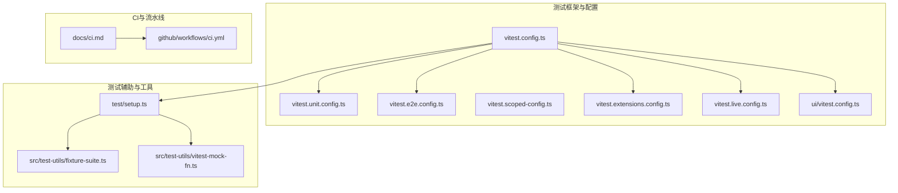
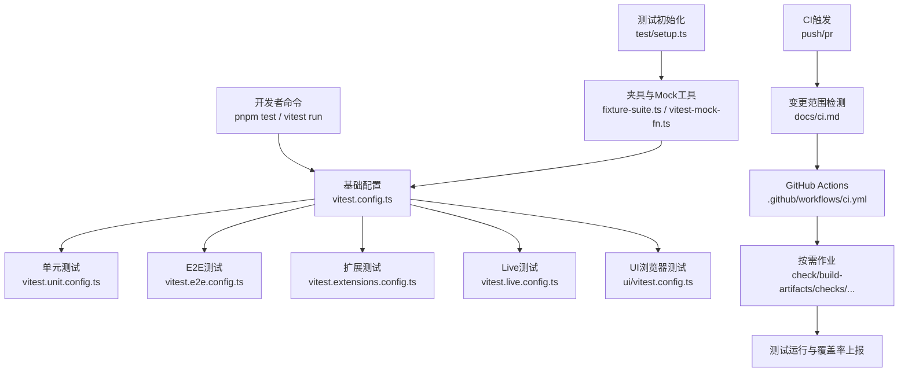
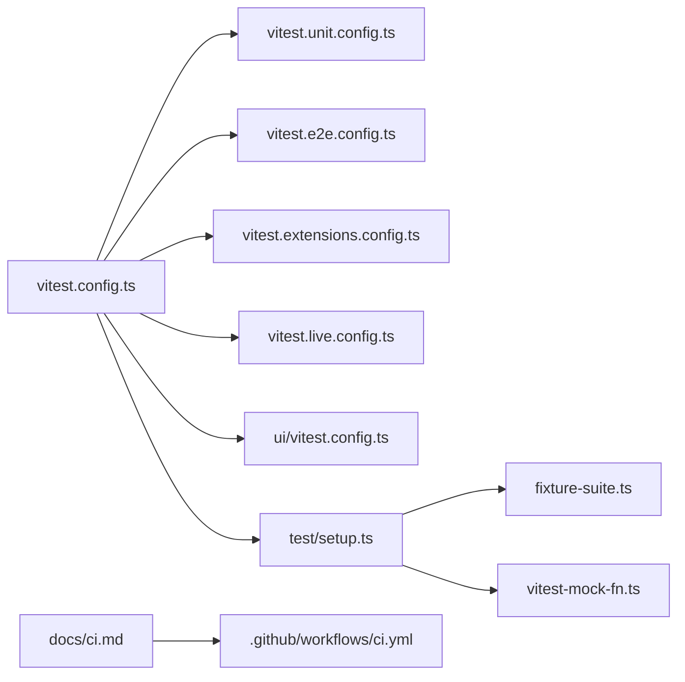

# 测试与调试

<cite>
**本文引用的文件**
- [vitest.config.ts](file://vitest.config.ts)
- [vitest.unit.config.ts](file://vitest.unit.config.ts)
- [vitest.e2e.config.ts](file://vitest.e2e.config.ts)
- [vitest.extensions.config.ts](file://vitest.extensions.config.ts)
- [vitest.live.config.ts](file://vitest.live.config.ts)
- [vitest.scoped-config.ts](file://vitest.scoped-config.ts)
- [setup.ts](file://test/setup.ts)
- [ci.md](file://docs/ci.md)
- [.github/workflows/ci.yml](file://.github/workflows/ci.yml)
- [fixture-suite.ts](file://src/test-utils/fixture-suite.ts)
- [vitest-mock-fn.ts](file://src/test-utils/vitest-mock-fn.ts)
- [service.runs-one-shot-main-job-disables-it.test.ts](file://src/cron/service.runs-one-shot-main-job-disables-it.test.ts)
- [diagnostic-events.ts](file://src/infra/diagnostic-events.ts)
- [logger.test.ts](file://src/logger.test.ts)
- [logger.ts](file://src/logger.ts)
- [logging.ts](file://src/logging.ts)
- [install.test.ts](file://src/plugins/install.test.ts)
- [ui/vitest.config.ts](file://ui/vitest.config.ts)
</cite>

## 目录
1. [简介](#简介)
2. [项目结构](#项目结构)
3. [核心组件](#核心组件)
4. [架构总览](#架构总览)
5. [详细组件分析](#详细组件分析)
6. [依赖关系分析](#依赖关系分析)
7. [性能考量](#性能考量)
8. [故障排查指南](#故障排查指南)
9. [结论](#结论)
10. [附录](#附录)

## 简介
本指南面向OpenClaw插件的测试与调试，覆盖单元测试、集成测试与端到端测试（E2E）的组织方式与运行策略；解释如何在开发与生产环境中进行调试、日志分析与性能监控；提供测试用例编写建议（测试数据准备、边界条件与异常处理）；并说明持续集成（CI）中的自动化测试与代码质量检查流程。文档同时给出可操作的工具与配置路径，帮助快速定位问题并提升测试效率。

## 项目结构
OpenClaw采用多平台与多语言混合工程：前端使用Vitest与Playwright进行浏览器测试；后端以TypeScript为主，通过Vitest执行单元与集成测试；扩展（extensions）作为插件生态的重要组成部分，拥有独立的测试套件与配置；CI由GitHub Actions驱动，按变更范围智能裁剪作业。

图表来源
- [vitest.config.ts:1-203](file://vitest.config.ts#L1-L203)
- [vitest.unit.config.ts:1-31](file://vitest.unit.config.ts#L1-L31)
- [vitest.e2e.config.ts:1-33](file://vitest.e2e.config.ts#L1-L33)
- [vitest.scoped-config.ts:1-17](file://vitest.scoped-config.ts#L1-L17)
- [vitest.extensions.config.ts:1-3](file://vitest.extensions.config.ts#L1-L3)
- [vitest.live.config.ts:1-16](file://vitest.live.config.ts#L1-L16)
- [ui/vitest.config.ts:1-15](file://ui/vitest.config.ts#L1-L15)
- [test/setup.ts:198-210](file://test/setup.ts#L198-L210)
- [src/test-utils/fixture-suite.ts:1-29](file://src/test-utils/fixture-suite.ts#L1-L29)
- [src/test-utils/vitest-mock-fn.ts:1-6](file://src/test-utils/vitest-mock-fn.ts#L1-L6)
- [docs/ci.md:1-29](file://docs/ci.md#L1-L29)
- [.github/workflows/ci.yml:1-737](file://.github/workflows/ci.yml#L1-L737)

章节来源
- [vitest.config.ts:1-203](file://vitest.config.ts#L1-L203)
- [.github/workflows/ci.yml:1-737](file://.github/workflows/ci.yml#L1-L737)

## 核心组件
- 测试运行器与配置
  - 基础Vitest配置集中于[vitest.config.ts](file://vitest.config.ts)，定义别名、超时、并发、覆盖率阈值与排除规则等。
  - 单元测试专用配置[vitest.unit.config.ts](file://vitest.unit.config.ts)用于隔离“非扩展”测试集。
  - E2E测试配置[vitest.e2e.config.ts](file://vitest.e2e.config.ts)控制进程池、并发与输出静默度。
  - 扩展测试专用配置[vitest.extensions.config.ts](file://vitest.extensions.config.ts)与[vitest.scoped-config.ts](file://vitest.scoped-config.ts)配合，限定匹配模式。
  - Live测试配置[vitest.live.config.ts](file://vitest.live.config.ts)聚焦带实时交互或外部依赖的场景。
  - UI浏览器测试配置[ui/vitest.config.ts](file://ui/vitest.config.ts)启用Playwright，支持无头浏览器测试。
- 测试初始化与环境
  - 全局初始化与清理逻辑位于[test/setup.ts](file://test/setup.ts)，确保插件注册表重置与定时器回退。
- 测试工具与辅助
  - 通用夹具管理[src/test-utils/fixture-suite.ts](file://src/test-utils/fixture-suite.ts)提供临时目录与用例隔离。
  - 统一的Vitest Mock类型[src/test-utils/vitest-mock-fn.ts](file://src/test-utils/vitest-mock-fn.ts)避免TS推断污染。
- CI与自动化
  - CI概览与作业矩阵见[docs/ci.md](file://docs/ci.md)。
  - GitHub Actions流水线定义于[.github/workflows/ci.yml](file://.github/workflows/ci.yml)，包含变更范围检测、分片与资源限制等。

章节来源
- [vitest.config.ts:1-203](file://vitest.config.ts#L1-L203)
- [vitest.unit.config.ts:1-31](file://vitest.unit.config.ts#L1-L31)
- [vitest.e2e.config.ts:1-33](file://vitest.e2e.config.ts#L1-L33)
- [vitest.extensions.config.ts:1-3](file://vitest.extensions.config.ts#L1-L3)
- [vitest.scoped-config.ts:1-17](file://vitest.scoped-config.ts#L1-L17)
- [vitest.live.config.ts:1-16](file://vitest.live.config.ts#L1-L16)
- [ui/vitest.config.ts:1-15](file://ui/vitest.config.ts#L1-L15)
- [test/setup.ts:198-210](file://test/setup.ts#L198-L210)
- [src/test-utils/fixture-suite.ts:1-29](file://src/test-utils/fixture-suite.ts#L1-L29)
- [src/test-utils/vitest-mock-fn.ts:1-6](file://src/test-utils/vitest-mock-fn.ts#L1-L6)
- [docs/ci.md:1-29](file://docs/ci.md#L1-L29)
- [.github/workflows/ci.yml:1-737](file://.github/workflows/ci.yml#L1-L737)

## 架构总览
下图展示测试体系在不同层级的职责与交互：基础配置统一调度，按场景拆分的子配置细化行为；CI根据变更范围选择性运行作业；测试工具与初始化脚本保障隔离与稳定性。

图表来源
- [vitest.config.ts:1-203](file://vitest.config.ts#L1-L203)
- [vitest.unit.config.ts:1-31](file://vitest.unit.config.ts#L1-L31)
- [vitest.e2e.config.ts:1-33](file://vitest.e2e.config.ts#L1-L33)
- [vitest.extensions.config.ts:1-3](file://vitest.extensions.config.ts#L1-L3)
- [vitest.live.config.ts:1-16](file://vitest.live.config.ts#L1-L16)
- [ui/vitest.config.ts:1-15](file://ui/vitest.config.ts#L1-L15)
- [docs/ci.md:1-29](file://docs/ci.md#L1-L29)
- [.github/workflows/ci.yml:1-737](file://.github/workflows/ci.yml#L1-L737)
- [test/setup.ts:198-210](file://test/setup.ts#L198-L210)
- [src/test-utils/fixture-suite.ts:1-29](file://src/test-utils/fixture-suite.ts#L1-L29)
- [src/test-utils/vitest-mock-fn.ts:1-6](file://src/test-utils/vitest-mock-fn.ts#L1-L6)

## 详细组件分析

### 单元测试（Unit）
- 配置要点
  - 基础超时与钩子超时、VM隔离与环境解桩策略，确保跨文件污染最小化。
  - 覆盖率锚定src根目录，排除大量集成面与入口文件，聚焦可单元测试模块。
- 运行建议
  - 使用[vitest.unit.config.ts](file://vitest.unit.config.ts)聚焦核心逻辑，避免扩展与网关等大面引入。
  - 对需要真实环境变量的用例，利用setup中解桩能力与隔离策略。
- 示例参考
  - 插件安装流程的单元级验证可参考[src/plugins/install.test.ts](file://src/plugins/install.test.ts)中的模板与夹具准备。

章节来源
- [vitest.config.ts:71-203](file://vitest.config.ts#L71-L203)
- [vitest.unit.config.ts:1-31](file://vitest.unit.config.ts#L1-L31)
- [src/plugins/install.test.ts:315-356](file://src/plugins/install.test.ts#L315-L356)

### 集成测试（Integration）
- 配置要点
  - 通过基础配置包含目标目录，结合排除列表隔离UI与网关等复杂集成面。
  - 在CI中按变更范围裁剪，仅对Node相关改动运行集成测试。
- 数据与夹具
  - 使用[src/test-utils/fixture-suite.ts](file://src/test-utils/fixture-suite.ts)创建临时目录，隔离每次用例的数据状态。
- 异常与边界
  - 可参考[src/cron/service.runs-one-shot-main-job-disables-it.test.ts](file://src/cron/service.runs-one-shot-main-job-disables-it.test.ts)中对文件系统模拟与错误码的处理，构建健壮的边界测试。

章节来源
- [vitest.config.ts:81-203](file://vitest.config.ts#L81-L203)
- [src/test-utils/fixture-suite.ts:1-29](file://src/test-utils/fixture-suite.ts#L1-L29)
- [src/cron/service.runs-one-shot-main-job-disables-it.test.ts:79-165](file://src/cron/service.runs-one-shot-main-job-disables-it.test.ts#L79-L165)

### 端到端测试（E2E）
- 配置要点
  - 强制进程隔离（forks）以避免模块状态泄漏；默认低并发，可通过环境变量调整。
  - 支持静默/详细输出切换，便于CI日志控制。
- 运行建议
  - 在本地调试时开启详细输出；CI中保持默认静默以减少噪音。
- 适用场景
  - 涉及真实进程、网络或外部服务的场景，如插件生命周期、IPC通信等。

章节来源
- [vitest.e2e.config.ts:1-33](file://vitest.e2e.config.ts#L1-L33)

### 扩展（插件）测试
- 配置要点
  - 通过[vitest.extensions.config.ts](file://vitest.extensions.config.ts)与[vitest.scoped-config.ts](file://vitest.scoped-config.ts)限定匹配范围，避免误跑其他测试。
- 实践建议
  - 为每个扩展建立独立的测试夹具与Mock策略，确保跨扩展测试隔离。
  - 对依赖外部服务的扩展，优先使用夹具与Mock，减少对外部系统的耦合。

章节来源
- [vitest.extensions.config.ts:1-3](file://vitest.extensions.config.ts#L1-L3)
- [vitest.scoped-config.ts:1-17](file://vitest.scoped-config.ts#L1-L17)

### Live测试
- 配置要点
  - 通过[vitest.live.config.ts](file://vitest.live.config.ts)聚焦需要实时交互或外部依赖的测试，限制并发以保证确定性。
- 适用场景
  - 需要与真实外部系统交互的测试，如第三方API调用、设备通信等。

章节来源
- [vitest.live.config.ts:1-16](file://vitest.live.config.ts#L1-L16)

### UI浏览器测试
- 配置要点
  - 通过[ui/vitest.config.ts](file://ui/vitest.config.ts)启用Playwright，支持Chromium无头浏览器，适合UI与交互测试。
- 适用场景
  - Web界面、聊天控制器、视图层的交互验证。

章节来源
- [ui/vitest.config.ts:1-15](file://ui/vitest.config.ts#L1-L15)

### 测试初始化与环境
- 初始化脚本[test/setup.ts](file://test/setup.ts)负责：
  - 重置插件注册表，避免跨用例污染。
  - 回退假定时器，防止跨文件/进程泄漏。
- 工具与类型
  - 夹具管理[src/test-utils/fixture-suite.ts](file://src/test-utils/fixture-suite.ts)提供临时目录与清理。
  - 统一Mock类型[src/test-utils/vitest-mock-fn.ts](file://src/test-utils/vitest-mock-fn.ts)避免类型推断问题。

章节来源
- [test/setup.ts:198-210](file://test/setup.ts#L198-L210)
- [src/test-utils/fixture-suite.ts:1-29](file://src/test-utils/fixture-suite.ts#L1-L29)
- [src/test-utils/vitest-mock-fn.ts:1-6](file://src/test-utils/vitest-mock-fn.ts#L1-L6)

### 日志与诊断事件
- 诊断事件系统[src/infra/diagnostic-events.ts](file://src/infra/diagnostic-events.ts)提供事件派发与监听，支持测试中重置状态，避免事件累积导致的副作用。
- 日志与诊断
  - 日志模块与诊断接口位于[src/logger.ts](file://src/logger.ts)、[src/logging.ts](file://src/logging.ts)与[src/logger.test.ts](file://src/logger.test.ts)，可用于测试中验证日志输出与级别。

章节来源
- [src/infra/diagnostic-events.ts:171-242](file://src/infra/diagnostic-events.ts#L171-L242)
- [src/logger.test.ts](file://src/logger.test.ts)
- [src/logger.ts](file://src/logger.ts)
- [src/logging.ts](file://src/logging.ts)

## 依赖关系分析
- 配置继承与复用
  - 各子配置基于基础配置进行include/exclude调整，降低重复与维护成本。
- CI与测试的耦合
  - CI按变更范围裁剪作业，测试配置中的排除列表与覆盖率锚定有助于稳定阈值与缩短耗时。
- 测试工具链
  - 夹具与Mock工具贯穿单元与集成测试，确保隔离与可控。

图表来源
- [vitest.config.ts:1-203](file://vitest.config.ts#L1-L203)
- [vitest.unit.config.ts:1-31](file://vitest.unit.config.ts#L1-L31)
- [vitest.e2e.config.ts:1-33](file://vitest.e2e.config.ts#L1-L33)
- [vitest.extensions.config.ts:1-3](file://vitest.extensions.config.ts#L1-L3)
- [vitest.live.config.ts:1-16](file://vitest.live.config.ts#L1-L16)
- [ui/vitest.config.ts:1-15](file://ui/vitest.config.ts#L1-L15)
- [test/setup.ts:198-210](file://test/setup.ts#L198-L210)
- [src/test-utils/fixture-suite.ts:1-29](file://src/test-utils/fixture-suite.ts#L1-L29)
- [src/test-utils/vitest-mock-fn.ts:1-6](file://src/test-utils/vitest-mock-fn.ts#L1-L6)
- [docs/ci.md:1-29](file://docs/ci.md#L1-L29)
- [.github/workflows/ci.yml:1-737](file://.github/workflows/ci.yml#L1-L737)

## 性能考量
- 并发与隔离
  - 基础配置根据CI/本地环境设置最大工作进程数，Windows与非Windows有差异化策略。
  - E2E强制进程隔离，避免VM上下文泄漏带来的不确定性。
- 覆盖率与排除
  - 覆盖率锚定src根目录，排除大量集成面与入口文件，有助于稳定阈值与减少计算开销。
- CI分片与缓存
  - Windows测试采用分片与缓存策略，减少重复安装与构建时间。

章节来源
- [vitest.config.ts:7-11, 79-81:7-11](file://vitest.config.ts#L7-L11)
- [vitest.e2e.config.ts:24-26](file://vitest.e2e.config.ts#L24-L26)
- [vitest.config.ts:101-200](file://vitest.config.ts#L101-L200)
- [.github/workflows/ci.yml:330-453](file://.github/workflows/ci.yml#L330-L453)

## 故障排查指南
- 常见问题与对策
  - 跨用例污染：确认[test/setup.ts](file://test/setup.ts)是否正确重置插件注册表与回退假定时器。
  - 覆盖率不稳定：检查[vitest.config.ts](file://vitest.config.ts)中覆盖率锚定与排除列表，避免过度排除。
  - Windows测试不稳定：参考[.github/workflows/ci.yml](file://.github/workflows/ci.yml)中的分片与资源限制，适当降低并发。
  - 外部依赖不可用：使用[src/test-utils/fixture-suite.ts](file://src/test-utils/fixture-suite.ts)与Mock策略替代真实依赖。
- 调试技巧
  - 使用[src/infra/diagnostic-events.ts](file://src/infra/diagnostic-events.ts)在测试中重置全局状态，避免事件累积。
  - 在UI测试中启用详细输出，定位交互问题。
- 日志与诊断
  - 通过[src/logger.test.ts](file://src/logger.test.ts)、[src/logger.ts](file://src/logger.ts)与[src/logging.ts](file://src/logging.ts)验证日志输出与级别，辅助定位问题。

章节来源
- [test/setup.ts:198-210](file://test/setup.ts#L198-L210)
- [vitest.config.ts:101-200](file://vitest.config.ts#L101-L200)
- [.github/workflows/ci.yml:330-453](file://.github/workflows/ci.yml#L330-L453)
- [src/test-utils/fixture-suite.ts:1-29](file://src/test-utils/fixture-suite.ts#L1-L29)
- [src/infra/diagnostic-events.ts:237-242](file://src/infra/diagnostic-events.ts#L237-L242)
- [src/logger.test.ts](file://src/logger.test.ts)
- [src/logger.ts](file://src/logger.ts)
- [src/logging.ts](file://src/logging.ts)

## 结论
OpenClaw的测试体系以Vitest为核心，辅以CI智能裁剪与多层级配置，覆盖从单元到E2E的全链路测试需求。通过夹具与Mock工具、严格的初始化与清理策略，以及清晰的CI作业矩阵，能够高效地发现与定位问题。建议在插件开发中遵循本文的测试与调试实践，结合日志与诊断事件系统，持续提升质量与稳定性。

## 附录
- 测试用例编写指南（摘要）
  - 测试数据准备：使用夹具工具创建隔离的临时目录，避免共享状态。
  - 边界条件测试：参考文件系统模拟实现，覆盖不存在文件、权限错误等场景。
  - 异常情况处理：通过Mock与解桩策略，主动注入错误路径，验证异常分支。
  - 日志与诊断：在测试中验证日志输出与级别，确保关键路径可追踪。
- 持续集成配置（摘要）
  - 变更范围检测：CI根据差异自动跳过无关作业，提高吞吐。
  - 作业矩阵：Node、Windows、macOS、Android等按需运行，确保关键平台覆盖。
  - 质量门禁：类型检查、格式化、Lint与覆盖率阈值共同构成质量门槛。

章节来源
- [src/test-utils/fixture-suite.ts:1-29](file://src/test-utils/fixture-suite.ts#L1-L29)
- [src/cron/service.runs-one-shot-main-job-disables-it.test.ts:79-165](file://src/cron/service.runs-one-shot-main-job-disables-it.test.ts#L79-L165)
- [docs/ci.md:1-29](file://docs/ci.md#L1-L29)
- [.github/workflows/ci.yml:1-737](file://.github/workflows/ci.yml#L1-L737)