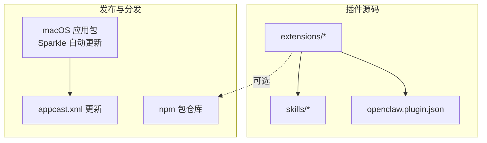
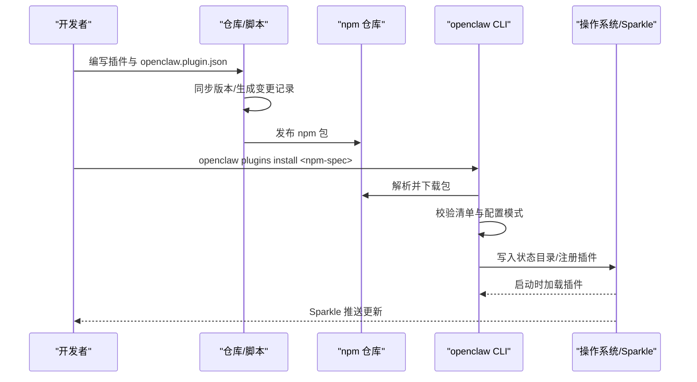
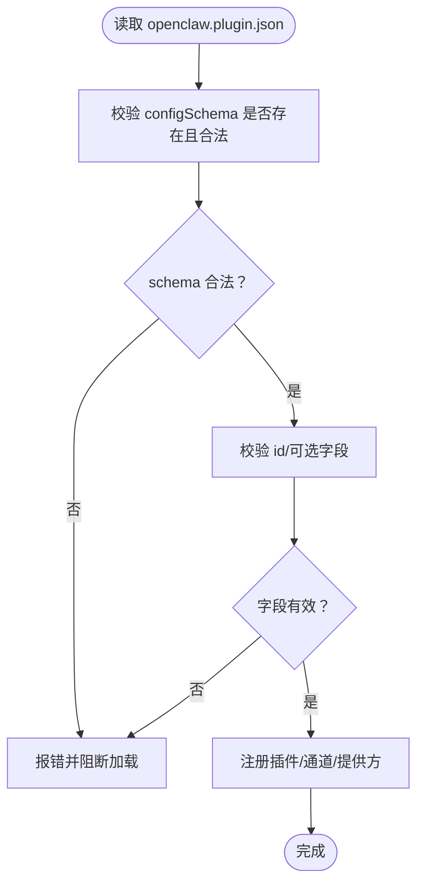
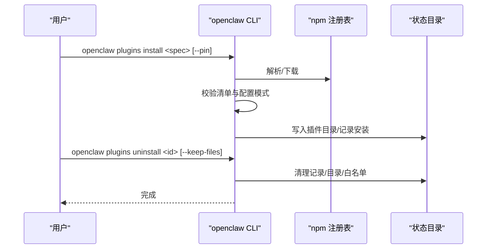
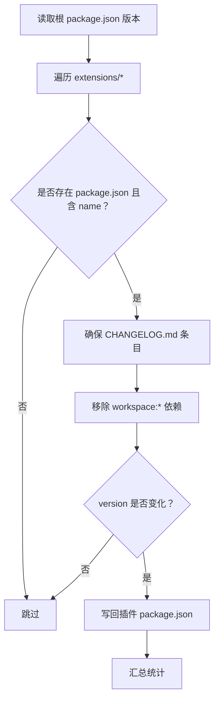
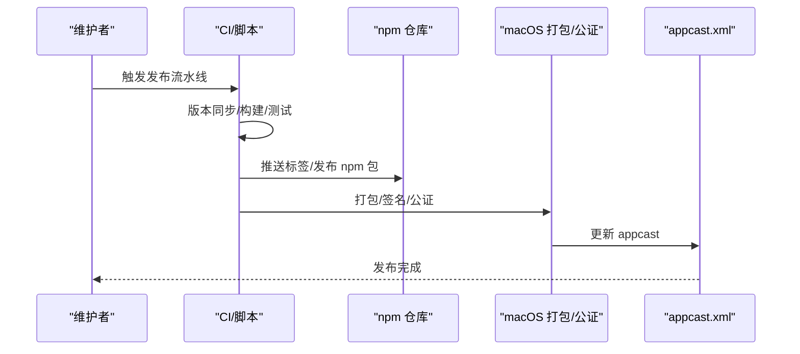
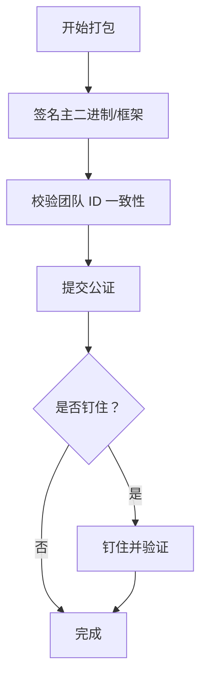
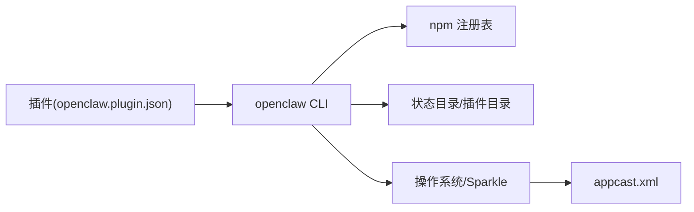

# 部署与分发

<cite>
**本文引用的文件**   
- [scripts/sync-plugin-versions.ts](file://scripts/sync-plugin-versions.ts)
- [docs/plugins/manifest.md](file://docs/plugins/manifest.md)
- [docs/cli/plugins.md](file://docs/cli/plugins.md)
- [extensions/discord/openclaw.plugin.json](file://extensions/discord/openclaw.plugin.json)
- [extensions/diffs/openclaw.plugin.json](file://extensions/diffs/openclaw.plugin.json)
- [scripts/package-mac-app.sh](file://scripts/package-mac-app.sh)
- [scripts/codesign-mac-app.sh](file://scripts/codesign-mac-app.sh)
- [scripts/notarize-mac-artifact.sh](file://scripts/notarize-mac-artifact.sh)
- [docs/plugins/community.md](file://docs/plugins/community.md)
- [docs/reference/RELEASING.md](file://docs/reference/RELEASING.md)
- [docs/install/uninstall.md](file://docs/install/uninstall.md)
</cite>

## 目录
1. [简介](#简介)
2. [项目结构](#项目结构)
3. [核心组件](#核心组件)
4. [架构总览](#架构总览)
5. [详细组件分析](#详细组件分析)
6. [依赖关系分析](#依赖关系分析)
7. [性能考量](#性能考量)
8. [故障排查指南](#故障排查指南)
9. [结论](#结论)
10. [附录](#附录)

## 简介
本指南面向 OpenClaw 插件的“打包、安装、升级、发布与安全”全流程，覆盖以下主题：
- 插件打包：清单校验、配置模式、资源打包与依赖处理
- 安装与卸载：本地路径安装、npm 规范安装、链接安装、更新与卸载
- 版本管理：版本号规则、同步策略、更新与回滚
- 发布流程：社区插件市场提交、审核与发布规范
- 安全考虑：签名验证、完整性校验、来源验证
- 更新通知与用户迁移：基于 Sparkle 的自动更新与迁移指引

## 项目结构
OpenClaw 将插件以独立扩展的形式组织在 extensions 目录下，每个插件包含一个 openclaw.plugin.json 清单与可选的技能目录、资源与包元数据。发布侧通过脚本完成 macOS 应用打包、签名与公证，并在 npm 上进行版本化发布。

图示来源
- [extensions/discord/openclaw.plugin.json:1-10](file://extensions/discord/openclaw.plugin.json#L1-L10)
- [extensions/diffs/openclaw.plugin.json:1-183](file://extensions/diffs/openclaw.plugin.json#L1-L183)
- [scripts/package-mac-app.sh:1-288](file://scripts/package-mac-app.sh#L1-L288)
- [scripts/notarize-mac-artifact.sh:1-66](file://scripts/notarize-mac-artifact.sh#L1-L66)

章节来源
- [extensions/discord/openclaw.plugin.json:1-10](file://extensions/discord/openclaw.plugin.json#L1-L10)
- [extensions/diffs/openclaw.plugin.json:1-183](file://extensions/diffs/openclaw.plugin.json#L1-L183)
- [scripts/package-mac-app.sh:1-288](file://scripts/package-mac-app.sh#L1-L288)
- [scripts/notarize-mac-artifact.sh:1-66](file://scripts/notarize-mac-artifact.sh#L1-L66)

## 核心组件
- 插件清单与配置模式
  - 每个插件必须提供 openclaw.plugin.json，包含 id 与 configSchema（严格校验），并可声明 kind、channels、providers、skills 等。
- 插件安装与管理 CLI
  - 支持 list/info/enable/disable/uninstall/update 等命令；支持 npm 规范安装、归档安装、本地链接安装；对裸 spec 与 @latest 有稳定轨道约束。
- 版本同步与发布
  - 提供脚本将插件版本与核心版本对齐，并生成变更记录；发布侧采用日期语义版本与 dist-tag 策略，macOS 使用 Sparkle 进行自动更新。
- 安全与合规
  - macOS 打包包含签名与公证流程；插件安装遵循最小权限与完整性校验原则。

章节来源
- [docs/plugins/manifest.md:1-76](file://docs/plugins/manifest.md#L1-L76)
- [docs/cli/plugins.md:1-103](file://docs/cli/plugins.md#L1-L103)
- [scripts/sync-plugin-versions.ts:1-109](file://scripts/sync-plugin-versions.ts#L1-L109)
- [docs/reference/RELEASING.md:1-152](file://docs/reference/RELEASING.md#L1-L152)

## 架构总览
下图展示从“插件开发到用户安装/更新”的端到端流程，涵盖清单校验、安装策略、签名与公证、以及 Sparkle 自动更新。

图示来源
- [scripts/sync-plugin-versions.ts:41-101](file://scripts/sync-plugin-versions.ts#L41-L101)
- [docs/cli/plugins.md:39-103](file://docs/cli/plugins.md#L39-L103)
- [scripts/package-mac-app.sh:1-288](file://scripts/package-mac-app.sh#L1-L288)
- [scripts/notarize-mac-artifact.sh:1-66](file://scripts/notarize-mac-artifact.sh#L1-L66)

## 详细组件分析

### 组件A：插件清单与配置模式
- 必备字段与校验
  - id 与 configSchema 为必填；configSchema 为空对象也允许，但必须存在。
  - 未知 channels.* 或未知插件 id 会触发错误；禁用插件的配置会保留并在诊断中告警。
- 建议实践
  - 为所有配置项提供默认值与枚举约束，提升 UI 呈现与稳定性。
  - 对于需要外部能力的插件，明确列出 channels/providers/kind 并在 UIHints 中提供标签与帮助信息。

图示来源
- [docs/plugins/manifest.md:18-76](file://docs/plugins/manifest.md#L18-L76)
- [extensions/discord/openclaw.plugin.json:1-10](file://extensions/discord/openclaw.plugin.json#L1-L10)
- [extensions/diffs/openclaw.plugin.json:68-182](file://extensions/diffs/openclaw.plugin.json#L68-L182)

章节来源
- [docs/plugins/manifest.md:1-76](file://docs/plugins/manifest.md#L1-L76)
- [extensions/discord/openclaw.plugin.json:1-10](file://extensions/discord/openclaw.plugin.json#L1-L10)
- [extensions/diffs/openclaw.plugin.json:1-183](file://extensions/diffs/openclaw.plugin.json#L1-L183)

### 组件B：插件安装与卸载流程
- 安装方式
  - npm 规范：仅支持注册表安装，裸 spec 与 @latest 走稳定轨道；可使用 --pin 固定解析结果。
  - 归档安装：支持 .zip/.tgz/.tar/.tar.gz。
  - 本地链接：--link 避免复制，直接添加到插件加载路径。
- 卸载与更新
  - 卸载会清理 plugins.entries、plugins.installs、白名单与链接路径；可选择保留磁盘文件。
  - 更新仅适用于已跟踪的 npm 插件；若存在完整性哈希且变更，会提示确认。

图示来源
- [docs/cli/plugins.md:39-103](file://docs/cli/plugins.md#L39-L103)

章节来源
- [docs/cli/plugins.md:1-103](file://docs/cli/plugins.md#L1-L103)

### 组件C：版本管理与同步
- 版本规则
  - 核心采用日期语义版本（YYYY.M.D）；beta 以 YYYY.M.D-beta.N 表示；dist-tag 分别映射到 latest 与 beta。
- 同步策略
  - 脚本扫描 extensions 下各插件 package.json，将 version 对齐至根 package.json，并在对应 CHANGELOG.md 中追加条目；移除 workspace:* 开发依赖。
- 回滚建议
  - 使用 --pin 固定 npm 安装版本；如需回滚，重新 pin 至目标版本并执行安装。

图示来源
- [scripts/sync-plugin-versions.ts:41-101](file://scripts/sync-plugin-versions.ts#L41-L101)

章节来源
- [scripts/sync-plugin-versions.ts:1-109](file://scripts/sync-plugin-versions.ts#L1-L109)
- [docs/reference/RELEASING.md:22-47](file://docs/reference/RELEASING.md#L22-L47)

### 组件D：发布与分发（npm 与 macOS）
- npm 发布
  - 日期语义版本与 dist-tag 策略；发布前执行构建、校验与测试；发布后通过 GitHub Actions 触发 npm 流水线。
- macOS 应用分发
  - 打包脚本负责构建、复制资源、签名、嵌入 Sparkle 并输出 .app；公证脚本提交并钉住结果，必要时对 app 也进行钉住校验。
- 社区插件市场
  - 在社区页提交 PR，满足 npm 发布、源码托管、文档与维护信号等要求。

图示来源
- [docs/reference/RELEASING.md:48-122](file://docs/reference/RELEASING.md#L48-L122)
- [scripts/package-mac-app.sh:1-288](file://scripts/package-mac-app.sh#L1-L288)
- [scripts/codesign-mac-app.sh:1-290](file://scripts/codesign-mac-app.sh#L1-L290)
- [scripts/notarize-mac-artifact.sh:1-66](file://scripts/notarize-mac-artifact.sh#L1-L66)
- [docs/plugins/community.md:15-36](file://docs/plugins/community.md#L15-L36)

章节来源
- [docs/reference/RELEASING.md:1-152](file://docs/reference/RELEASING.md#L1-L152)
- [scripts/package-mac-app.sh:1-288](file://scripts/package-mac-app.sh#L1-L288)
- [scripts/codesign-mac-app.sh:1-290](file://scripts/codesign-mac-app.sh#L1-L290)
- [scripts/notarize-mac-artifact.sh:1-66](file://scripts/notarize-mac-artifact.sh#L1-L66)
- [docs/plugins/community.md:1-52](file://docs/plugins/community.md#L1-L52)

### 组件E：安全与完整性
- 签名与权限
  - macOS 应用签名脚本支持自动选择证书、运行时选项与团队 ID 校验；建议使用正式证书以保持 TCC 权限持久性。
- 公证与钉住
  - 公证脚本支持凭据配置，提交后可对 dmg/pkg 钉住并验证，必要时对 app 也进行钉住。
- 插件安装安全
  - CLI 强制使用 --ignore-scripts 安装依赖，优先固定版本；对预发布解析有显式 opt-in 要求。

图示来源
- [scripts/codesign-mac-app.sh:209-248](file://scripts/codesign-mac-app.sh#L209-L248)
- [scripts/notarize-mac-artifact.sh:32-63](file://scripts/notarize-mac-artifact.sh#L32-L63)

章节来源
- [scripts/codesign-mac-app.sh:1-290](file://scripts/codesign-mac-app.sh#L1-L290)
- [scripts/notarize-mac-artifact.sh:1-66](file://scripts/notarize-mac-artifact.sh#L1-L66)
- [docs/cli/plugins.md:46-56](file://docs/cli/plugins.md#L46-L56)

### 组件F：更新通知与用户迁移
- 自动更新
  - macOS 应用内置 Sparkle，通过 appcast.xml 提供更新流；打包脚本设置 SUFeedURL 与 SUPublicEDKey，支持自动检查。
- 用户迁移
  - 升级前建议备份状态目录；如涉及配置结构变更，应在发布说明中提供迁移步骤与兼容性提示。

章节来源
- [scripts/package-mac-app.sh:180-188](file://scripts/package-mac-app.sh#L180-L188)
- [docs/reference/RELEASING.md:113-122](file://docs/reference/RELEASING.md#L113-L122)

## 依赖关系分析
- 插件对清单的强依赖：缺失或非法清单会导致加载失败。
- CLI 对 npm 注册表与本地缓存的依赖：安装流程受网络与认证配置影响。
- macOS 分发对 Apple 工具链与凭据的依赖：签名与公证需正确配置环境变量与钥匙串。

图示来源
- [docs/cli/plugins.md:39-103](file://docs/cli/plugins.md#L39-L103)
- [scripts/package-mac-app.sh:180-188](file://scripts/package-mac-app.sh#L180-L188)

章节来源
- [docs/cli/plugins.md:1-103](file://docs/cli/plugins.md#L1-L103)
- [scripts/package-mac-app.sh:1-288](file://scripts/package-mac-app.sh#L1-L288)

## 性能考量
- 安装性能
  - 使用 --link 避免大体积复制；对本地开发推荐链接安装。
- 更新性能
  - Sparkle 增量更新与 appcast 缓存可减少带宽占用。
- 构建性能
  - macOS 打包脚本支持多架构合并与条件跳过，按需设置 SKIP_UI_BUILD 等环境变量。

## 故障排查指南
- 插件无法加载
  - 检查 openclaw.plugin.json 是否存在、id 与 channels/providers 是否声明一致、configSchema 是否通过校验。
- 安装失败
  - 确认 npm 认证与网络；对裸 spec 与 @latest 需遵循稳定轨道；必要时使用 --pin。
- 卸载残留
  - 使用 --keep-files 保留磁盘文件；检查状态目录与链接路径是否清理干净。
- macOS 签名/公证问题
  - 确认签名身份与团队 ID 一致性；如使用 ad-hoc 签名，注意 TCC 权限不会持久。
- 卸载 OpenClaw
  - 按文档顺序停止服务、卸载系统服务、删除状态与工作区、移除 CLI。

章节来源
- [docs/plugins/manifest.md:53-76](file://docs/plugins/manifest.md#L53-L76)
- [docs/cli/plugins.md:72-103](file://docs/cli/plugins.md#L72-L103)
- [scripts/codesign-mac-app.sh:73-108](file://scripts/codesign-mac-app.sh#L73-L108)
- [docs/install/uninstall.md:1-129](file://docs/install/uninstall.md#L1-L129)

## 结论
通过严格的清单校验、规范化的安装与更新流程、完善的版本同步与发布策略，以及严谨的签名与公证流程，OpenClaw 为插件生态提供了安全、可控、可演进的部署与分发基座。建议维护者遵循本文档的版本规则、清单规范与安全流程，确保插件质量与用户体验。

## 附录
- 社区插件市场提交要点
  - npm 包发布、源码托管、文档与问题跟踪、维护信号。
- 发布检查清单
  - 版本与元数据、构建与产物、变更日志与文档、验证与测试、macOS Sparkle、npm 发布与 GitHub Release。

章节来源
- [docs/plugins/community.md:15-36](file://docs/plugins/community.md#L15-L36)
- [docs/reference/RELEASING.md:48-122](file://docs/reference/RELEASING.md#L48-L122)