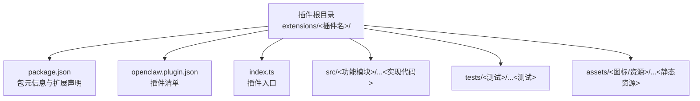
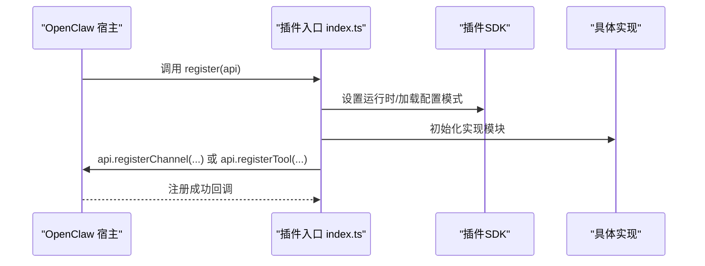
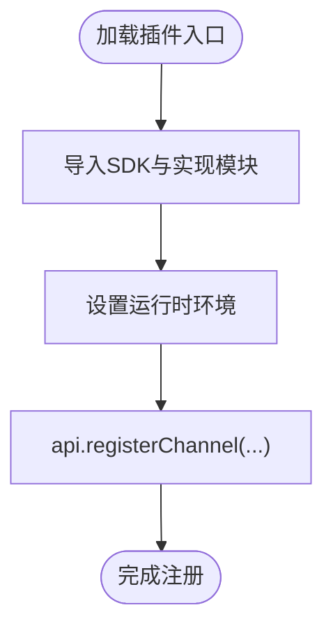
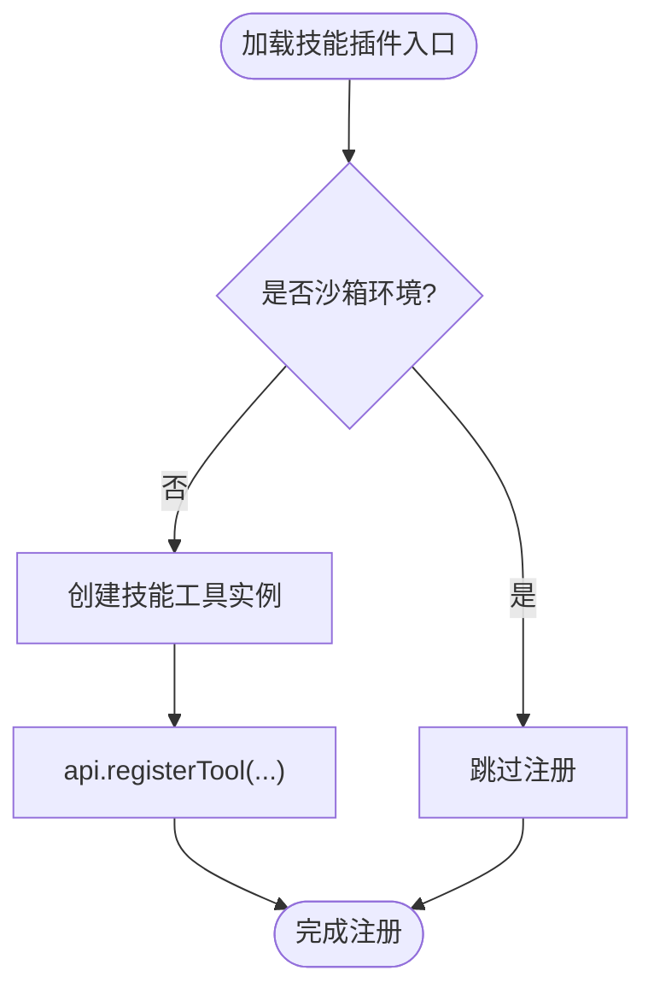
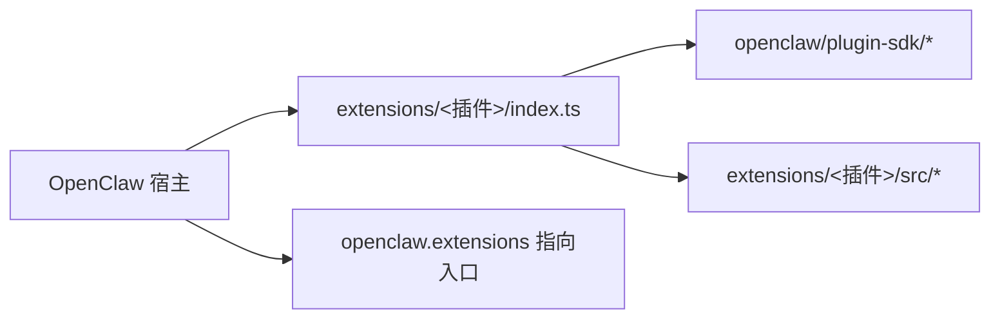

# 项目结构与模板

<cite>
**本文引用的文件**
- [package.json](file://package.json)
- [tsconfig.json](file://tsconfig.json)
- [extensions/bluebubbles/package.json](file://extensions/bluebubbles/package.json)
- [extensions/bluebubbles/openclaw.plugin.json](file://extensions/bluebubbles/openclaw.plugin.json)
- [extensions/bluebubbles/index.ts](file://extensions/bluebubbles/index.ts)
- [extensions/discord/package.json](file://extensions/discord/package.json)
- [extensions/discord/openclaw.plugin.json](file://extensions/discord/openclaw.plugin.json)
- [extensions/discord/index.ts](file://extensions/discord/index.ts)
- [extensions/lobster/package.json](file://extensions/lobster/package.json)
- [extensions/lobster/openclaw.plugin.json](file://extensions/lobster/openclaw.plugin.json)
- [extensions/lobster/index.ts](file://extensions/lobster/index.ts)
- [extensions/feishu/package.json](file://extensions/feishu/package.json)
- [extensions/feishu/openclaw.plugin.json](file://extensions/feishu/openclaw.plugin.json)
- [extensions/signal/package.json](file://extensions/signal/package.json)
- [extensions/signal/openclaw.plugin.json](file://extensions/signal/openclaw.plugin.json)
- [extensions/telegram/package.json](file://extensions/telegram/package.json)
- [extensions/telegram/openclaw.plugin.json](file://extensions/telegram/openclaw.plugin.json)
</cite>

## 目录
1. [简介](#简介)
2. [项目结构](#项目结构)
3. [核心组件](#核心组件)
4. [架构总览](#架构总览)
5. [详细组件分析](#详细组件分析)
6. [依赖关系分析](#依赖关系分析)
7. [性能考虑](#性能考虑)
8. [故障排查指南](#故障排查指南)
9. [结论](#结论)
10. [附录：模板与规范](#附录模板与规范)

## 简介
本指南面向希望基于 OpenClaw 构建插件的开发者，系统性地说明插件项目的目录结构、初始化模板、清单配置、命名与版本管理规范，并提供渠道插件、技能插件与工具插件三类模板的结构参考。内容直接来源于仓库中的真实插件与配置文件，确保可落地、可复用。

## 项目结构
OpenClaw 插件遵循“单插件一目录”的组织方式，每个插件位于 extensions/<插件名>/ 下，包含以下关键要素：
- package.json：插件包元信息与 OpenClaw 扩展声明
- openclaw.plugin.json：插件清单（ID、通道/技能暴露、配置模式）
- index.ts：插件入口，导出注册函数或插件对象
- src/：实现代码（按功能拆分）
- tests/：单元测试与集成测试
- assets/：图标、静态资源等（部分插件使用）

下图展示典型插件目录与其职责映射：

图表来源
- [extensions/bluebubbles/package.json:1-37](file://extensions/bluebubbles/package.json#L1-L37)
- [extensions/bluebubbles/openclaw.plugin.json:1-10](file://extensions/bluebubbles/openclaw.plugin.json#L1-L10)
- [extensions/bluebubbles/index.ts:1-18](file://extensions/bluebubbles/index.ts#L1-L18)

章节来源
- [extensions/bluebubbles/package.json:1-37](file://extensions/bluebubbles/package.json#L1-L37)
- [extensions/bluebubbles/openclaw.plugin.json:1-10](file://extensions/bluebubbles/openclaw.plugin.json#L1-L10)
- [extensions/bluebubbles/index.ts:1-18](file://extensions/bluebubbles/index.ts#L1-L18)

## 核心组件
- 包元信息与扩展声明（package.json）
  - 必填字段：name、version、type
  - OpenClaw 扩展字段：openclaw.extensions（数组，指向入口文件）、openclaw.channel（可选，用于渠道插件）、openclaw.install（可选，安装指引）
- 插件清单（openclaw.plugin.json）
  - 必填字段：id；可选字段：channels、skills、configSchema
- 插件入口（index.ts）
  - 导出插件对象或注册函数，调用 api.registerChannel 或 api.registerTool 完成注册

章节来源
- [extensions/discord/package.json:1-12](file://extensions/discord/package.json#L1-L12)
- [extensions/discord/openclaw.plugin.json:1-10](file://extensions/discord/openclaw.plugin.json#L1-L10)
- [extensions/discord/index.ts:1-20](file://extensions/discord/index.ts#L1-L20)
- [extensions/lobster/package.json:1-15](file://extensions/lobster/package.json#L1-L15)
- [extensions/lobster/openclaw.plugin.json:1-11](file://extensions/lobster/openclaw.plugin.json#L1-L11)
- [extensions/lobster/index.ts:1-19](file://extensions/lobster/index.ts#L1-L19)

## 架构总览
OpenClaw 插件通过入口文件在运行时向宿主注册能力。以渠道插件为例，入口会设置运行时并注册通道；以工具插件为例，入口会在非沙箱环境下注册工具。

图表来源
- [extensions/discord/index.ts:1-20](file://extensions/discord/index.ts#L1-L20)
- [extensions/bluebubbles/index.ts:1-18](file://extensions/bluebubbles/index.ts#L1-L18)
- [extensions/lobster/index.ts:1-19](file://extensions/lobster/index.ts#L1-L19)

## 详细组件分析

### 渠道插件（Channel Plugin）模板
- 典型结构
  - package.json：声明 openclaw.extensions、openclaw.channel（可选）
  - openclaw.plugin.json：声明 id、channels、configSchema
  - index.ts：导出插件对象，包含 register 方法，内部调用 api.registerChannel
  - src/：通道实现与运行时设置
- 示例参考
  - Discord 渠道插件：展示了注册通道与子代理钩子的完整流程
  - BlueBubbles 渠道插件：展示了最小化通道注册与空配置模式

图表来源
- [extensions/discord/index.ts:1-20](file://extensions/discord/index.ts#L1-L20)
- [extensions/bluebubbles/index.ts:1-18](file://extensions/bluebubbles/index.ts#L1-L18)

章节来源
- [extensions/discord/package.json:1-12](file://extensions/discord/package.json#L1-L12)
- [extensions/discord/openclaw.plugin.json:1-10](file://extensions/discord/openclaw.plugin.json#L1-L10)
- [extensions/discord/index.ts:1-20](file://extensions/discord/index.ts#L1-L20)
- [extensions/bluebubbles/package.json:1-37](file://extensions/bluebubbles/package.json#L1-L37)
- [extensions/bluebubbles/openclaw.plugin.json:1-10](file://extensions/bluebubbles/openclaw.plugin.json#L1-L10)
- [extensions/bluebubbles/index.ts:1-18](file://extensions/bluebubbles/index.ts#L1-L18)

### 技能插件（Skill Plugin）模板
- 典型结构
  - package.json：声明 openclaw.extensions
  - openclaw.plugin.json：声明 id、skills（指向技能目录）、configSchema
  - index.ts：导出注册函数，按需注册技能
  - skills/：技能实现与资源
- 示例参考
  - Feishu 插件：同时声明 channels 与 skills，体现“多面手”插件形态

图表来源
- [extensions/lobster/index.ts:1-19](file://extensions/lobster/index.ts#L1-L19)

章节来源
- [extensions/feishu/package.json:1-36](file://extensions/feishu/package.json#L1-L36)
- [extensions/feishu/openclaw.plugin.json:1-11](file://extensions/feishu/openclaw.plugin.json#L1-L11)
- [extensions/lobster/package.json:1-15](file://extensions/lobster/package.json#L1-L15)
- [extensions/lobster/openclaw.plugin.json:1-11](file://extensions/lobster/openclaw.plugin.json#L1-L11)
- [extensions/lobster/index.ts:1-19](file://extensions/lobster/index.ts#L1-L19)

### 工具插件（Tool Plugin）模板
- 典型结构
  - package.json：声明 openclaw.extensions
  - openclaw.plugin.json：声明 id、configSchema
  - index.ts：导出注册函数，按需注册工具
- 示例参考
  - Lobster 工具插件：在非沙箱环境下注册工具

章节来源
- [extensions/lobster/package.json:1-15](file://extensions/lobster/package.json#L1-L15)
- [extensions/lobster/openclaw.plugin.json:1-11](file://extensions/lobster/openclaw.plugin.json#L1-L11)
- [extensions/lobster/index.ts:1-19](file://extensions/lobster/index.ts#L1-L19)

### 渠道插件清单字段详解
- id：插件唯一标识
- channels：该插件暴露的渠道 ID 列表
- skills：该插件暴露的技能目录路径（可选）
- configSchema：插件配置的 JSON Schema（可选）

章节来源
- [extensions/discord/openclaw.plugin.json:1-10](file://extensions/discord/openclaw.plugin.json#L1-L10)
- [extensions/bluebubbles/openclaw.plugin.json:1-10](file://extensions/bluebubbles/openclaw.plugin.json#L1-L10)
- [extensions/feishu/openclaw.plugin.json:1-11](file://extensions/feishu/openclaw.plugin.json#L1-L11)
- [extensions/signal/openclaw.plugin.json:1-10](file://extensions/signal/openclaw.plugin.json#L1-L10)
- [extensions/telegram/openclaw.plugin.json:1-10](file://extensions/telegram/openclaw.plugin.json#L1-L10)

### 技能插件清单字段详解
- id：插件唯一标识
- name：插件显示名称（可选）
- description：插件描述（可选）
- skills：技能目录路径（可选）
- configSchema：插件配置的 JSON Schema（可选）

章节来源
- [extensions/lobster/openclaw.plugin.json:1-11](file://extensions/lobster/openclaw.plugin.json#L1-L11)
- [extensions/feishu/openclaw.plugin.json:1-11](file://extensions/feishu/openclaw.plugin.json#L1-L11)

### 工具插件清单字段详解
- id：插件唯一标识
- configSchema：插件配置的 JSON Schema（可选）

章节来源
- [extensions/lobster/openclaw.plugin.json:1-11](file://extensions/lobster/openclaw.plugin.json#L1-L11)

## 依赖关系分析
- 插件入口对 SDK 的依赖：通过 openclaw/plugin-sdk/* 命名空间导出的 SDK 模块
- 插件对实现模块的依赖：通过 src/ 内部模块组织与导入
- 宿主对插件的依赖：通过 openclaw.extensions 数组解析入口文件

图表来源
- [package.json:37-215](file://package.json#L37-L215)
- [extensions/discord/index.ts:1-20](file://extensions/discord/index.ts#L1-L20)
- [extensions/bluebubbles/index.ts:1-18](file://extensions/bluebubbles/index.ts#L1-L18)
- [extensions/lobster/index.ts:1-19](file://extensions/lobster/index.ts#L1-L19)

章节来源
- [package.json:37-215](file://package.json#L37-L215)

## 性能考虑
- 将插件实现拆分为细粒度模块，避免一次性加载过多代码
- 在工具插件中按运行环境（如沙箱）动态决定是否注册，减少不必要的初始化
- 使用配置模式（configSchema）约束配置项，降低运行期校验成本

## 故障排查指南
- 插件未被识别
  - 检查 openclaw.extensions 是否正确指向入口文件
  - 确认 openclaw.plugin.json 的 id 与 channels/skills 字段无误
- 注册失败
  - 确认入口导出的是插件对象或注册函数
  - 检查运行时设置与 api.registerChannel/api.registerTool 的调用时机
- 配置错误
  - 使用 configSchema 对输入进行约束与提示
  - 在开发阶段启用严格类型检查与格式化

章节来源
- [extensions/discord/openclaw.plugin.json:1-10](file://extensions/discord/openclaw.plugin.json#L1-L10)
- [extensions/discord/index.ts:1-20](file://extensions/discord/index.ts#L1-L20)
- [extensions/bluebubbles/openclaw.plugin.json:1-10](file://extensions/bluebubbles/openclaw.plugin.json#L1-L10)
- [extensions/bluebubbles/index.ts:1-18](file://extensions/bluebubbles/index.ts#L1-L18)
- [extensions/lobster/index.ts:1-19](file://extensions/lobster/index.ts#L1-L19)

## 结论
OpenClaw 插件体系以“清单 + 入口 + 实现”为核心，通过标准化的目录与配置，实现了渠道、技能与工具的统一扩展模型。遵循本文模板与规范，可快速搭建高质量插件并融入生态。

## 附录：模板与规范

### 目录结构模板
- 渠道插件
  - extensions/<渠道名>/
    - package.json
    - openclaw.plugin.json
    - index.ts
    - src/
    - tests/
    - assets/
- 技能插件
  - extensions/<技能名>/
    - package.json
    - openclaw.plugin.json
    - index.ts
    - skills/
    - tests/
- 工具插件
  - extensions/<工具名>/
    - package.json
    - openclaw.plugin.json
    - index.ts
    - src/
    - tests/

### 初始化模板要点
- package.json
  - 必填：name、version、type
  - 可选：openclaw.channel（渠道插件）、openclaw.install（安装指引）
  - openclaw.extensions 指向入口文件
- openclaw.plugin.json
  - 必填：id
  - 渠道插件：channels
  - 技能插件：skills
  - 工具插件：configSchema
- index.ts
  - 导出插件对象或注册函数
  - 在 register 中调用 api.registerChannel 或 api.registerTool

章节来源
- [extensions/discord/package.json:1-12](file://extensions/discord/package.json#L1-L12)
- [extensions/discord/openclaw.plugin.json:1-10](file://extensions/discord/openclaw.plugin.json#L1-L10)
- [extensions/discord/index.ts:1-20](file://extensions/discord/index.ts#L1-L20)
- [extensions/lobster/package.json:1-15](file://extensions/lobster/package.json#L1-L15)
- [extensions/lobster/openclaw.plugin.json:1-11](file://extensions/lobster/openclaw.plugin.json#L1-L11)
- [extensions/lobster/index.ts:1-19](file://extensions/lobster/index.ts#L1-L19)
- [extensions/feishu/package.json:1-36](file://extensions/feishu/package.json#L1-L36)
- [extensions/feishu/openclaw.plugin.json:1-11](file://extensions/feishu/openclaw.plugin.json#L1-L11)

### 命名规范与版本管理
- 包名与插件 ID
  - 建议采用统一前缀（如 @openclaw/<插件名>），便于生态识别与发布
  - 插件 ID 与渠道/技能 ID 应保持一致，避免歧义
- 版本号
  - 使用语义化版本（建议主版本与宿主大版本对齐策略）
  - 在 CI 中同步插件版本与宿主版本，确保兼容性
- 元数据
  - name、version、description、type 必填
  - openclaw.channel（渠道插件）应包含 id、label、docsPath 等关键字段

章节来源
- [extensions/bluebubbles/package.json:1-37](file://extensions/bluebubbles/package.json#L1-L37)
- [extensions/feishu/package.json:1-36](file://extensions/feishu/package.json#L1-L36)
- [package.json:1-465](file://package.json#L1-L465)

### TypeScript 与构建配置参考
- tsconfig.json
  - 使用 NodeNext 模块与解析策略
  - 严格模式开启，目标 ES2023
  - 通过 paths 映射 openclaw/plugin-sdk 以支持本地开发

章节来源
- [tsconfig.json:1-29](file://tsconfig.json#L1-L29)