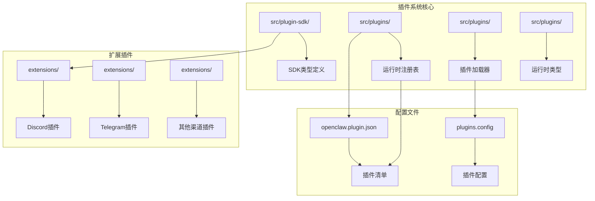
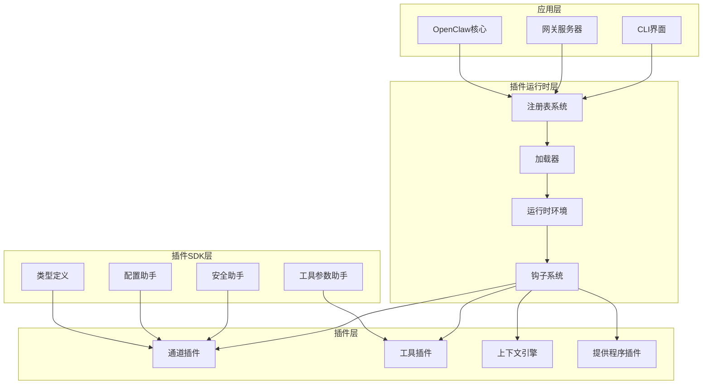
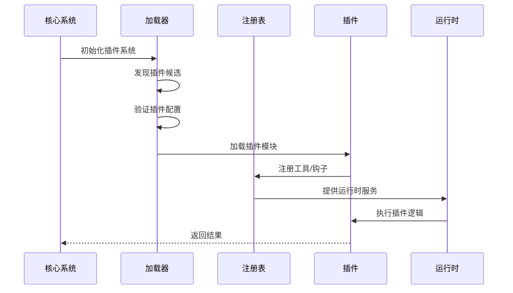
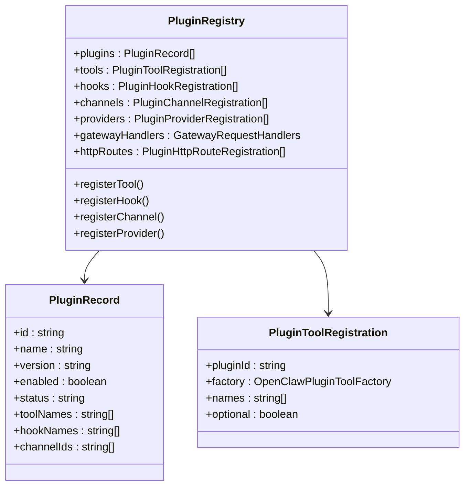
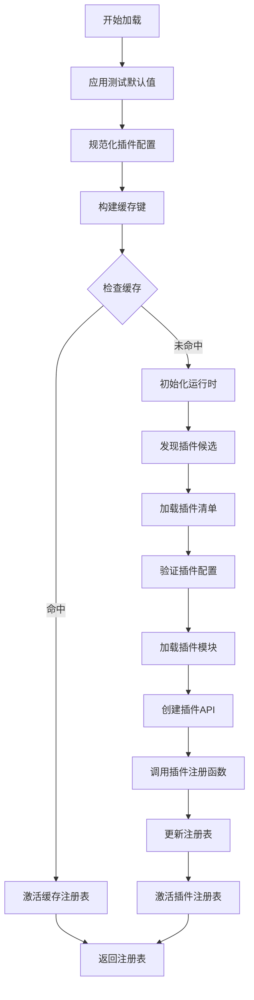
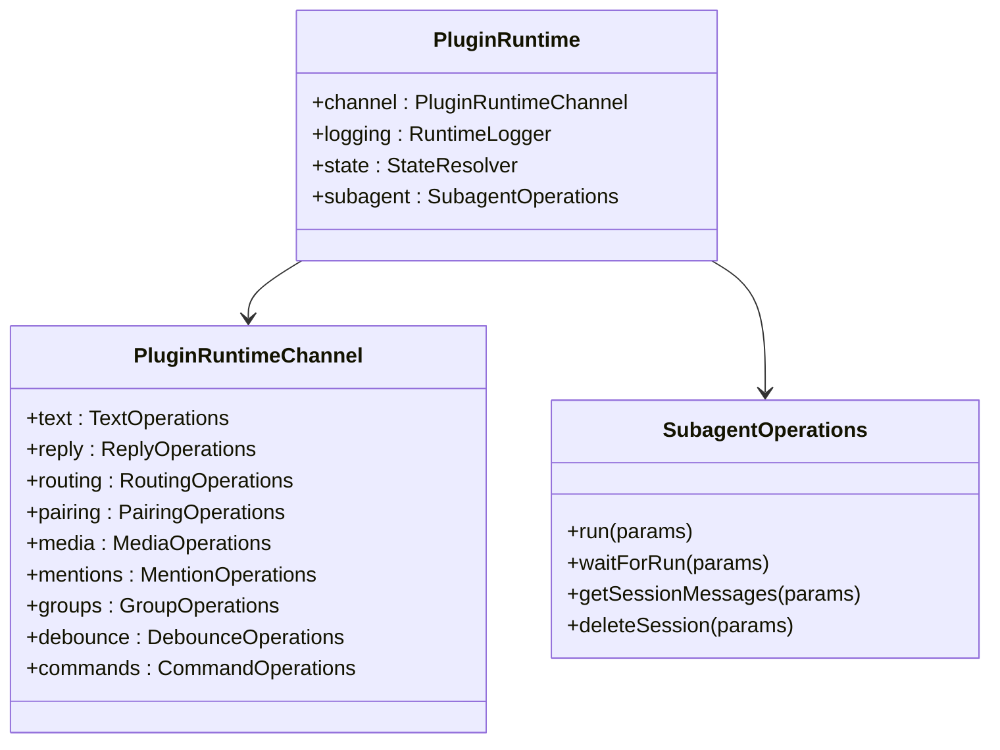
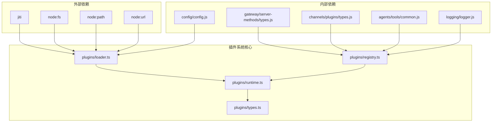
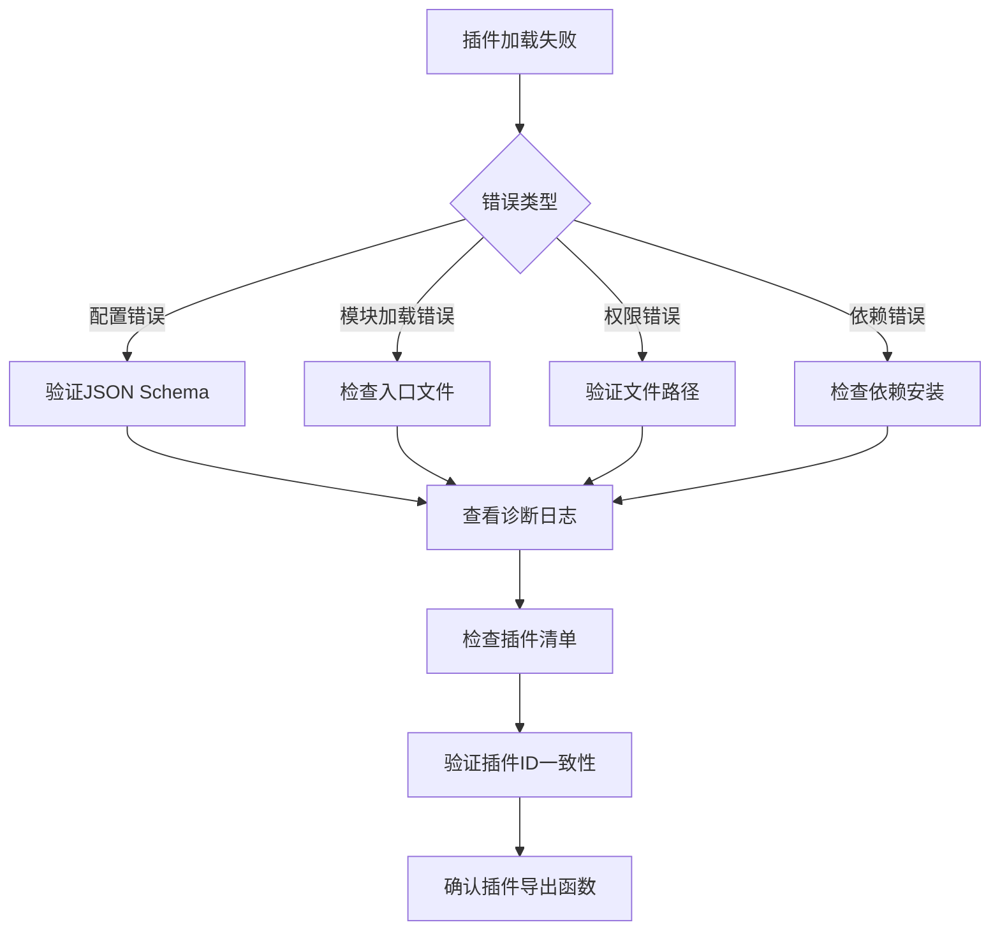

# 插件架构设计

<cite>
**本文档引用的文件**
- [README.md](file://README.md)
- [plugin-sdk.md](file://docs/refactor/plugin-sdk.md)
- [index.ts](file://src/plugin-sdk/index.ts)
- [registry.ts](file://src/plugins/registry.ts)
- [loader.ts](file://src/plugins/loader.ts)
- [runtime.ts](file://src/plugins/runtime.ts)
- [types.ts](file://src/plugins/types.ts)
- [types.ts](file://src/plugins/runtime/types.ts)
- [openclaw.plugin.json](file://extensions/discord/openclaw.plugin.json)
</cite>

## 目录
1. [引言](#引言)
2. [项目结构](#项目结构)
3. [核心组件](#核心组件)
4. [架构概览](#架构概览)
5. [详细组件分析](#详细组件分析)
6. [依赖分析](#依赖分析)
7. [性能考虑](#性能考虑)
8. [故障排除指南](#故障排除指南)
9. [结论](#结论)

## 引言

OpenClaw是一个个人AI助手平台，其插件架构设计旨在提供统一的扩展机制，支持多种消息渠道和工具集成。该架构的核心目标是实现：

- 统一的插件接口规范和扩展机制
- 清晰的插件生命周期管理
- 安全的依赖注入和版本兼容性处理
- 灵活的插件注册和发现机制

根据项目文档，OpenClaw正在实施一个两层架构的插件系统：SDK层（编译时、稳定、可发布）和运行时层（执行表面、注入式）。这种设计确保了插件开发的一致性和稳定性。

## 项目结构

OpenClaw的插件系统采用模块化设计，主要包含以下关键目录和文件：

**图表来源**
- [plugin-sdk.md](file://docs/refactor/plugin-sdk.md)
- [index.ts](file://src/plugin-sdk/index.ts)
- [registry.ts](file://src/plugins/registry.ts)
- [loader.ts](file://src/plugins/loader.ts)

**章节来源**
- [README.md](file://README.md)
- [plugin-sdk.md](file://docs/refactor/plugin-sdk.md)

## 核心组件

### 插件SDK层

SDK层提供了稳定的API接口和类型定义，确保插件开发的一致性：

- **类型定义**：包括通道插件、配置模式、工具接口等
- **辅助函数**：配置帮助器、配对助手、引导助手等
- **工具参数助手**：参数读取、动作门控等
- **文档链接助手**：格式化文档链接

### 插件运行时层

运行时层负责插件的实际执行和生命周期管理：

- **注册表系统**：管理插件注册、工具、钩子等
- **加载器**：发现、验证和加载插件模块
- **运行时环境**：提供插件执行所需的运行时服务

### 插件类型系统

OpenClaw定义了完整的插件类型系统，包括：

- **OpenClawPluginApi**：插件API接口
- **PluginRuntime**：运行时接口
- **Hook系统**：生命周期钩子
- **工具系统**：代理工具注册

**章节来源**
- [index.ts](file://src/plugin-sdk/index.ts)
- [types.ts](file://src/plugins/types.ts)
- [types.ts](file://src/plugins/runtime/types.ts)

## 架构概览

OpenClaw的插件架构采用分层设计，实现了清晰的关注点分离：

**图表来源**
- [plugin-sdk.md](file://docs/refactor/plugin-sdk.md)
- [registry.ts](file://src/plugins/registry.ts)
- [loader.ts](file://src/plugins/loader.ts)

### 插件生命周期流程

**图表来源**
- [loader.ts](file://src/plugins/loader.ts)
- [registry.ts](file://src/plugins/registry.ts)

## 详细组件分析

### 插件注册表系统

注册表系统是插件架构的核心组件，负责管理所有已注册的插件及其资源：

**图表来源**
- [registry.ts](file://src/plugins/registry.ts)

注册表系统的主要功能包括：

- **插件记录管理**：跟踪每个插件的状态和元数据
- **工具注册**：管理插件提供的代理工具
- **钩子注册**：维护生命周期钩子的注册信息
- **HTTP路由管理**：处理插件自定义HTTP端点
- **通道插件管理**：协调不同消息渠道的插件

### 插件加载器

插件加载器负责发现、验证和加载插件模块：

**图表来源**
- [loader.ts](file://src/plugins/loader.ts)

加载器的关键特性：

- **智能缓存**：避免重复加载相同的插件配置
- **延迟初始化**：仅在需要时创建运行时环境
- **路径安全**：确保插件文件访问的安全性
- **配置验证**：使用JSON Schema验证插件配置

### 插件运行时环境

运行时环境为插件提供执行所需的基础设施：

**图表来源**
- [types.ts](file://src/plugins/runtime/types.ts)

运行时环境提供以下核心功能：

- **通道操作**：文本处理、回复发送、媒体管理等
- **会话管理**：子代理运行和会话生命周期管理
- **日志记录**：结构化日志输出
- **状态解析**：配置和状态文件路径解析

**章节来源**
- [registry.ts](file://src/plugins/registry.ts)
- [loader.ts](file://src/plugins/loader.ts)
- [runtime.ts](file://src/plugins/runtime.ts)
- [types.ts](file://src/plugins/runtime/types.ts)

## 依赖分析

### 插件系统依赖关系

**图表来源**
- [loader.ts](file://src/plugins/loader.ts)
- [registry.ts](file://src/plugins/registry.ts)
- [runtime.ts](file://src/plugins/runtime.ts)

### 版本兼容性管理

插件系统实现了多层次的版本兼容性控制：

1. **SDK版本控制**：语义化版本管理，确保向后兼容
2. **运行时版本**：与核心版本同步，提供运行时API版本
3. **插件声明**：插件声明所需运行时范围
4. **迁移策略**：渐进式迁移计划

**章节来源**
- [plugin-sdk.md](file://docs/refactor/plugin-sdk.md)

## 性能考虑

### 插件加载优化

OpenClaw插件系统采用了多项性能优化措施：

- **延迟加载**：运行时环境采用Proxy包装，仅在实际访问时才初始化
- **智能缓存**：基于配置和工作区目录的缓存键，避免重复加载
- **路径安全检查**：防止插件访问不受信任的文件系统位置
- **内存槽优化**：针对内存插件的快速路径，避免不必要的模块加载

### 并发处理

插件系统支持并发操作：

- **异步钩子**：生命周期钩子支持Promise返回
- **并行验证**：插件配置验证可以并行执行
- **无阻塞操作**：运行时操作尽量避免阻塞主线程

## 故障排除指南

### 常见问题诊断

插件系统提供了完善的诊断机制：

**图表来源**
- [loader.ts](file://src/plugins/loader.ts)

### 调试工具

插件系统提供了多种调试工具：

- **详细日志记录**：结构化的插件加载和执行日志
- **诊断事件**：插件生命周期事件的监控
- **配置验证**：实时配置变更验证
- **性能指标**：插件执行时间和资源使用情况

**章节来源**
- [loader.ts](file://src/plugins/loader.ts)
- [registry.ts](file://src/plugins/registry.ts)

## 结论

OpenClaw的插件架构设计体现了现代软件架构的最佳实践：

### 设计优势

1. **清晰的分层架构**：SDK层和运行时层的职责分离
2. **强类型系统**：完整的TypeScript类型定义确保开发体验
3. **灵活的扩展机制**：支持多种类型的插件和扩展点
4. **安全的执行环境**：严格的路径安全检查和权限控制
5. **完善的生命周期管理**：从发现到卸载的完整生命周期

### 技术创新

- **代理模式**：通过OpenClawPluginApi实现松耦合的插件通信
- **钩子系统**：提供丰富的生命周期钩子点
- **运行时注入**：动态注入运行时服务，避免硬编码依赖
- **版本兼容性**：多层版本控制确保系统的稳定性

### 未来发展方向

随着插件系统的成熟，OpenClaw将继续演进：

1. **插件生态建设**：建立插件市场和认证机制
2. **性能优化**：进一步提升插件加载和执行性能
3. **安全性增强**：加强插件沙箱和权限控制
4. **开发工具完善**：提供更好的插件开发和调试工具

这个插件架构为OpenClaw平台提供了强大的扩展能力，支持各种消息渠道和工具集成，同时保持了系统的稳定性和安全性。