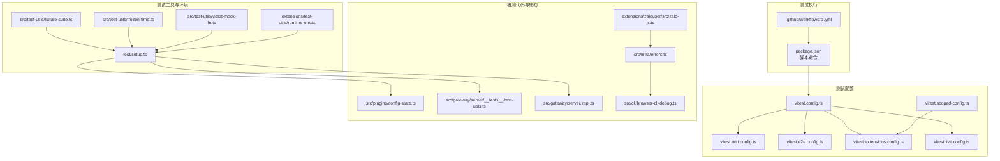
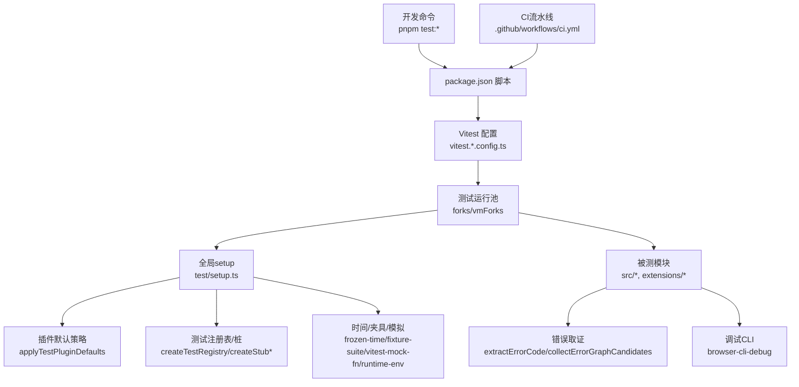
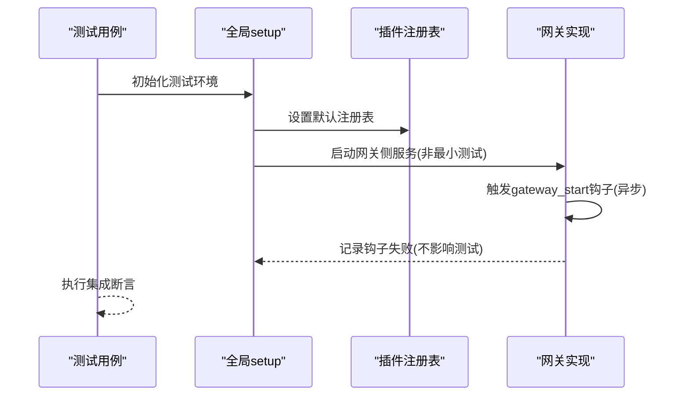
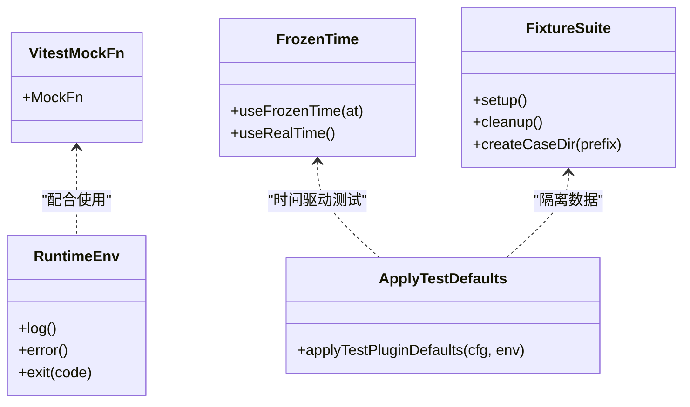
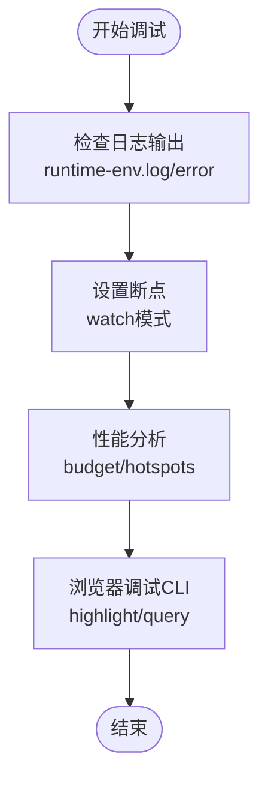
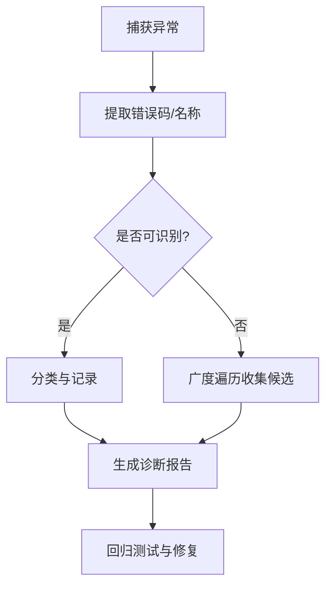
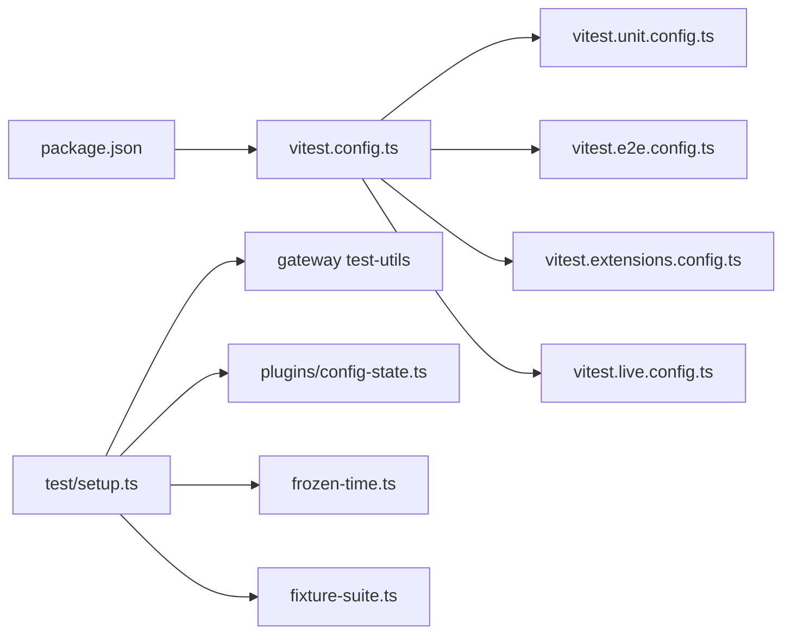

# 插件测试与调试

<cite>
**本文引用的文件**
- [vitest.config.ts](file://vitest.config.ts)
- [vitest.unit.config.ts](file://vitest.unit.config.ts)
- [vitest.e2e.config.ts](file://vitest.e2e.config.ts)
- [vitest.extensions.config.ts](file://vitest.extensions.config.ts)
- [vitest.live.config.ts](file://vitest.live.config.ts)
- [vitest.scoped-config.ts](file://vitest.scoped-config.ts)
- [package.json](file://package.json)
- [.github/workflows/ci.yml](file://.github/workflows/ci.yml)
- [test/setup.ts](file://test/setup.ts)
- [src/test-utils/fixture-suite.ts](file://src/test-utils/fixture-suite.ts)
- [src/test-utils/frozen-time.ts](file://src/test-utils/frozen-time.ts)
- [src/test-utils/vitest-mock-fn.ts](file://src/test-utils/vitest-mock-fn.ts)
- [extensions/test-utils/runtime-env.ts](file://extensions/test-utils/runtime-env.ts)
- [src/plugins/config-state.ts](file://src/plugins/config-state.ts)
- [src/gateway/server/__tests__/test-utils.ts](file://src/gateway/server/__tests__/test-utils.ts)
- [src/gateway/server.impl.ts](file://src/gateway/server.impl.ts)
- [src/infra/errors.ts](file://src/infra/errors.ts)
- [src/cli/browser-cli-debug.ts](file://src/cli/browser-cli-debug.ts)
- [extensions/zalouser/src/zalo-js.ts](file://extensions/zalouser/src/zalo-js.ts)
- [docs/ci.md](file://docs/ci.md)
</cite>

## 目录
1. [简介](#简介)
2. [项目结构](#项目结构)
3. [核心组件](#核心组件)
4. [架构总览](#架构总览)
5. [详细组件分析](#详细组件分析)
6. [依赖分析](#依赖分析)
7. [性能考虑](#性能考虑)
8. [故障排查指南](#故障排查指南)
9. [结论](#结论)
10. [附录](#附录)

## 简介
本文件面向OpenClaw插件开发者，系统化阐述插件测试与调试的技术实践，覆盖单元测试、集成测试与端到端测试（E2E）策略；测试工具链与模拟对象（mock/stub）体系；测试环境搭建与隔离；调试技巧（日志、断点、性能分析）；错误处理与故障诊断；测试覆盖率与质量标准；以及持续集成（CI）配置与最佳实践。目标是帮助开发者高效构建稳定、可维护的插件生态。

## 项目结构
OpenClaw采用多包工作区与分层模块组织，测试体系围绕Vitest进行统一配置，并通过多种专用配置文件实现不同场景的测试运行策略。关键目录与文件如下：
- 测试运行器与配置：vitest.config.ts、vitest.unit.config.ts、vitest.e2e.config.ts、vitest.extensions.config.ts、vitest.live.config.ts、vitest.scoped-config.ts
- 测试入口与全局设置：test/setup.ts
- 工具与辅助：src/test-utils/*、extensions/test-utils/*
- 插件默认与测试隔离：src/plugins/config-state.ts
- 网关与通道测试辅助：src/gateway/server/__tests__/test-utils.ts、src/gateway/server.impl.ts
- 错误处理与取证：src/infra/errors.ts
- 调试CLI：src/cli/browser-cli-debug.ts
- 扩展示例：extensions/zalouser/src/zalo-js.ts
- CI流水线：.github/workflows/ci.yml、docs/ci.md

**图表来源**
- [vitest.config.ts:57-203](file://vitest.config.ts#L57-L203)
- [vitest.unit.config.ts:1-31](file://vitest.unit.config.ts#L1-L31)
- [vitest.e2e.config.ts:1-33](file://vitest.e2e.config.ts#L1-L33)
- [vitest.extensions.config.ts:1-4](file://vitest.extensions.config.ts#L1-L4)
- [vitest.live.config.ts:1-16](file://vitest.live.config.ts#L1-L16)
- [vitest.scoped-config.ts:1-17](file://vitest.scoped-config.ts#L1-L17)
- [package.json:300-339](file://package.json#L300-L339)
- [.github/workflows/ci.yml:1-737](file://.github/workflows/ci.yml#L1-L737)
- [test/setup.ts:1-211](file://test/setup.ts#L1-L211)
- [src/test-utils/fixture-suite.ts:1-29](file://src/test-utils/fixture-suite.ts#L1-L29)
- [src/test-utils/frozen-time.ts:1-10](file://src/test-utils/frozen-time.ts#L1-L10)
- [src/test-utils/vitest-mock-fn.ts:1-6](file://src/test-utils/vitest-mock-fn.ts#L1-L6)
- [extensions/test-utils/runtime-env.ts:1-12](file://extensions/test-utils/runtime-env.ts#L1-L12)
- [src/plugins/config-state.ts:112-173](file://src/plugins/config-state.ts#L112-L173)
- [src/gateway/server/__tests__/test-utils.ts:1-10](file://src/gateway/server/__tests__/test-utils.ts#L1-L10)
- [src/gateway/server.impl.ts:924-947](file://src/gateway/server.impl.ts#L924-L947)
- [src/infra/errors.ts:1-52](file://src/infra/errors.ts#L1-L52)
- [src/cli/browser-cli-debug.ts:53-96](file://src/cli/browser-cli-debug.ts#L53-L96)
- [extensions/zalouser/src/zalo-js.ts:106-160](file://extensions/zalouser/src/zalo-js.ts#L106-L160)

**章节来源**
- [vitest.config.ts:57-203](file://vitest.config.ts#L57-L203)
- [package.json:300-339](file://package.json#L300-L339)
- [.github/workflows/ci.yml:1-737](file://.github/workflows/ci.yml#L1-L737)

## 核心组件
- 测试运行器与配置
  - 基础配置：统一解析别名、超时、隔离策略、include/exclude、覆盖率阈值与排除范围等。
  - 场景化配置：单元测试、E2E、扩展测试、实时测试等专用配置，按需覆盖基础配置。
- 测试环境与隔离
  - 全局setup：安装进程警告过滤、隔离测试HOME、注册默认插件注册表、清理假定时器。
  - 插件默认策略：在Vitest环境下自动应用插件禁用与内存槽位默认值，避免真实外部依赖。
- 测试工具与模拟
  - 固定时间：冻结/恢复系统时间，便于时间敏感逻辑测试。
  - 夹具套件：临时目录与用例目录生成，支持测试数据隔离与清理。
  - Vitest类型化mock：集中定义MockFn类型，避免TS推断问题。
  - 运行时环境桩：日志、错误输出、退出行为的可控桩。
- 网关与通道测试辅助
  - 测试注册表：创建最小可用注册表，注入通道插件桩，屏蔽真实网络调用。
  - 网关启动钩子：在非最小测试网关中安全地触发gateway_start钩子并记录失败。
- 错误处理与取证
  - 错误码提取、名称读取、错误图谱候选收集，支撑定位与报告。
- 调试CLI
  - 浏览器调试命令：高亮元素、查询参数解析、调试请求封装与结果打印。
- 扩展示例
  - 超时控制、延迟、消息体转换、错误转字符串等实用函数，体现插件侧常见模式。

**章节来源**
- [test/setup.ts:1-211](file://test/setup.ts#L1-L211)
- [src/plugins/config-state.ts:112-173](file://src/plugins/config-state.ts#L112-L173)
- [src/test-utils/frozen-time.ts:1-10](file://src/test-utils/frozen-time.ts#L1-L10)
- [src/test-utils/fixture-suite.ts:1-29](file://src/test-utils/fixture-suite.ts#L1-L29)
- [src/test-utils/vitest-mock-fn.ts:1-6](file://src/test-utils/vitest-mock-fn.ts#L1-L6)
- [extensions/test-utils/runtime-env.ts:1-12](file://extensions/test-utils/runtime-env.ts#L1-L12)
- [src/gateway/server/__tests__/test-utils.ts:1-10](file://src/gateway/server/__tests__/test-utils.ts#L1-L10)
- [src/gateway/server.impl.ts:924-947](file://src/gateway/server.impl.ts#L924-L947)
- [src/infra/errors.ts:1-52](file://src/infra/errors.ts#L1-L52)
- [src/cli/browser-cli-debug.ts:53-96](file://src/cli/browser-cli-debug.ts#L53-L96)
- [extensions/zalouser/src/zalo-js.ts:106-160](file://extensions/zalouser/src/zalo-js.ts#L106-L160)

## 架构总览
下图展示测试与调试在OpenClaw中的整体关系：从package.json脚本触发，经由Vitest配置选择测试场景，借助全局setup与工具集完成隔离与模拟，最终在被测模块上执行断言与验证；CI流水线对不同平台与任务进行分层与并行调度。

**图表来源**
- [package.json:300-339](file://package.json#L300-L339)
- [vitest.config.ts:57-203](file://vitest.config.ts#L57-L203)
- [test/setup.ts:1-211](file://test/setup.ts#L1-L211)
- [src/plugins/config-state.ts:112-173](file://src/plugins/config-state.ts#L112-L173)
- [src/gateway/server/__tests__/test-utils.ts:1-10](file://src/gateway/server/__tests__/test-utils.ts#L1-L10)
- [src/infra/errors.ts:1-52](file://src/infra/errors.ts#L1-L52)
- [src/cli/browser-cli-debug.ts:53-96](file://src/cli/browser-cli-debug.ts#L53-L96)
- [.github/workflows/ci.yml:1-737](file://.github/workflows/ci.yml#L1-L737)

## 详细组件分析

### 单元测试策略与配置
- 配置要点
  - include/exclude精准限定源码范围，避免无关目录进入覆盖率统计。
  - unstubEnvs/unstubGlobals确保环境变量与全局污染隔离，尤其在vmForks模式下。
  - 覆盖率阈值：lines/functions/branches/statements均为中高门槛，强调“只统计被测试套件实际覆盖的文件”。
- 场景化配置
  - 单元测试专用配置剔除大模块与集成面，聚焦纯函数与小模块。
  - 扩展测试配置仅扫描extensions目录，便于独立验证插件生态。
- 最佳实践
  - 使用固定时间与夹具套件，保证可重复性与隔离性。
  - 对外部依赖使用桩或mock，结合插件默认策略关闭真实加载。

**章节来源**
- [vitest.config.ts:71-203](file://vitest.config.ts#L71-L203)
- [vitest.unit.config.ts:1-31](file://vitest.unit.config.ts#L1-L31)
- [vitest.extensions.config.ts:1-4](file://vitest.extensions.config.ts#L1-L4)
- [test/setup.ts:198-211](file://test/setup.ts#L198-L211)
- [src/test-utils/frozen-time.ts:1-10](file://src/test-utils/frozen-time.ts#L1-L10)
- [src/test-utils/fixture-suite.ts:1-29](file://src/test-utils/fixture-suite.ts#L1-L29)

### 集成测试策略与网关辅助
- 注册表与桩
  - 创建默认通道插件桩，统一注入到活跃注册表，屏蔽真实网络调用。
  - 提供createTestRegistry工具，便于快速构造最小可用测试环境。
- 网关启动钩子
  - 在非最小测试网关中触发gateway_start钩子，失败时仅记录告警，不中断测试。
- 实践建议
  - 将真实网关作为集成测试基座，结合插件默认策略降低副作用。
  - 对HTTP路由、网桥、协议等集成面编写针对性测试。

**图表来源**
- [test/setup.ts:198-211](file://test/setup.ts#L198-L211)
- [src/gateway/server/__tests__/test-utils.ts:1-10](file://src/gateway/server/__tests__/test-utils.ts#L1-L10)
- [src/gateway/server.impl.ts:924-947](file://src/gateway/server.impl.ts#L924-L947)

**章节来源**
- [src/gateway/server/__tests__/test-utils.ts:1-10](file://src/gateway/server/__tests__/test-utils.ts#L1-L10)
- [src/gateway/server.impl.ts:924-947](file://src/gateway/server.impl.ts#L924-L947)
- [test/setup.ts:198-211](file://test/setup.ts#L198-L211)

### 端到端测试策略与环境
- 配置要点
  - 强制使用process fork以避免VM上下文泄漏导致的状态污染。
  - 默认串行或受控并发，可通过环境变量调整工作进程数。
  - include精确匹配e2e测试文件，exclude剔除非e2e文件。
- 环境准备
  - 通过脚本与Docker编排进行端到端场景准备与清理。
  - CI中对不同平台（Windows/macOS/Android）进行分层并行。
- 最佳实践
  - 将真实用户路径与外部系统（模型、网关、渠道）纳入E2E验证。
  - 使用固定时间与夹具，确保跨平台一致性。

**章节来源**
- [vitest.e2e.config.ts:1-33](file://vitest.e2e.config.ts#L1-L33)
- [package.json:300-339](file://package.json#L300-L339)
- [.github/workflows/ci.yml:329-737](file://.github/workflows/ci.yml#L329-L737)

### 测试工具链与模拟对象
- 类型化Mock
  - 统一导出MockFn类型，避免vi.fn()类型推断带来的TS2742问题。
- 运行时环境桩
  - 提供可控的日志、错误输出与退出行为，便于断言与隔离。
- 时间与夹具
  - 冻结系统时间，便于定时器、节流、缓存过期等逻辑验证。
  - 临时目录与用例目录生成，保障数据隔离与资源回收。
- 插件默认策略
  - 在Vitest环境中自动禁用插件加载并设置内存槽位为“none”，避免真实外部依赖。

**图表来源**
- [src/test-utils/vitest-mock-fn.ts:1-6](file://src/test-utils/vitest-mock-fn.ts#L1-L6)
- [extensions/test-utils/runtime-env.ts:1-12](file://extensions/test-utils/runtime-env.ts#L1-L12)
- [src/test-utils/frozen-time.ts:1-10](file://src/test-utils/frozen-time.ts#L1-L10)
- [src/test-utils/fixture-suite.ts:1-29](file://src/test-utils/fixture-suite.ts#L1-L29)
- [src/plugins/config-state.ts:112-173](file://src/plugins/config-state.ts#L112-L173)

**章节来源**
- [src/test-utils/vitest-mock-fn.ts:1-6](file://src/test-utils/vitest-mock-fn.ts#L1-L6)
- [extensions/test-utils/runtime-env.ts:1-12](file://extensions/test-utils/runtime-env.ts#L1-L12)
- [src/test-utils/frozen-time.ts:1-10](file://src/test-utils/frozen-time.ts#L1-L10)
- [src/test-utils/fixture-suite.ts:1-29](file://src/test-utils/fixture-suite.ts#L1-L29)
- [src/plugins/config-state.ts:112-173](file://src/plugins/config-state.ts#L112-L173)

### 调试技巧与工具
- 日志记录
  - 使用运行时环境桩的log/error接口，结合断言验证日志内容与级别。
- 断点调试
  - 在Vitest中启用watch模式，结合IDE断点进行交互式调试。
- 性能分析
  - 使用性能预算与热点分析脚本，识别耗时瓶颈。
- 浏览器调试CLI
  - 通过高亮元素、查询参数解析与调试请求封装，快速定位前端交互问题。

**图表来源**
- [extensions/test-utils/runtime-env.ts:1-12](file://extensions/test-utils/runtime-env.ts#L1-L12)
- [src/cli/browser-cli-debug.ts:53-96](file://src/cli/browser-cli-debug.ts#L53-L96)
- [package.json:300-339](file://package.json#L300-L339)

**章节来源**
- [extensions/test-utils/runtime-env.ts:1-12](file://extensions/test-utils/runtime-env.ts#L1-L12)
- [src/cli/browser-cli-debug.ts:53-96](file://src/cli/browser-cli-debug.ts#L53-L96)
- [package.json:300-339](file://package.json#L300-L339)

### 错误处理、异常捕获与故障诊断
- 错误提取
  - 从异常对象中提取错误码、名称，便于分类与报告。
- 错误图谱
  - 广度优先遍历收集候选错误对象，辅助定位深层嵌套问题。
- 故障诊断流程
  - 通过错误码与名称快速缩小范围，结合日志与断点复现，最终回归修复。

**图表来源**
- [src/infra/errors.ts:1-52](file://src/infra/errors.ts#L1-L52)

**章节来源**
- [src/infra/errors.ts:1-52](file://src/infra/errors.ts#L1-L52)

### 测试覆盖率要求与质量标准
- 覆盖率提供者与格式：v8 + lcov。
- 阈值：lines/functions/branches/statements均不低于70%（部分场景有专门的单元测试配置）。
- 排除策略：仅统计被测试套件实际覆盖的文件，排除扩展、应用、UI、测试自身与入口/桥接等。
- CI门禁：CI中对不同平台与任务进行分层并行，确保质量门禁一致。

**章节来源**
- [vitest.config.ts:101-200](file://vitest.config.ts#L101-L200)
- [.github/workflows/ci.yml:1-737](file://.github/workflows/ci.yml#L1-L737)

### 持续集成配置
- 作业分层
  - 文档变更检测、变更范围检测、构建产物、检查（类型/lint/format）、技能Python检查、密钥审计、Windows/macOS/Android专项。
- 并行与分片
  - Windows使用分片策略，macOS合并为单一作业，Android使用Gradle任务矩阵。
- 本地等价命令
  - package.json中提供与CI等价的本地测试命令，便于本地复现与调试。

**章节来源**
- [.github/workflows/ci.yml:1-737](file://.github/workflows/ci.yml#L1-L737)
- [docs/ci.md:1-12](file://docs/ci.md#L1-L12)
- [package.json:300-339](file://package.json#L300-L339)

## 依赖分析
- 组件耦合
  - 测试配置与脚本强耦合，通过场景化配置实现低耦合扩展。
  - 全局setup对插件注册表、通道桩、时间与夹具形成中心化依赖。
- 外部依赖
  - CI依赖GitHub Actions与各平台Runner能力；测试依赖Vitest、Node与Docker。
- 循环依赖
  - 未见直接循环导入；工具与桩通过显式类型与工厂函数解耦。

**图表来源**
- [package.json:300-339](file://package.json#L300-L339)
- [vitest.config.ts:57-203](file://vitest.config.ts#L57-L203)
- [test/setup.ts:1-211](file://test/setup.ts#L1-L211)
- [src/plugins/config-state.ts:112-173](file://src/plugins/config-state.ts#L112-L173)
- [src/gateway/server/__tests__/test-utils.ts:1-10](file://src/gateway/server/__tests__/test-utils.ts#L1-L10)
- [src/test-utils/frozen-time.ts:1-10](file://src/test-utils/frozen-time.ts#L1-L10)
- [src/test-utils/fixture-suite.ts:1-29](file://src/test-utils/fixture-suite.ts#L1-L29)

**章节来源**
- [package.json:300-339](file://package.json#L300-L339)
- [vitest.config.ts:57-203](file://vitest.config.ts#L57-L203)
- [test/setup.ts:1-211](file://test/setup.ts#L1-L211)

## 性能考虑
- 测试并发与隔离
  - 在fork池中运行E2E，避免VM上下文状态泄漏；在单元测试中合理设置maxWorkers。
- 资源限制
  - CI中为不同平台设置最大旧空间大小与工作进程数，防止内存溢出。
- 性能分析
  - 提供性能预算与热点分析脚本，辅助定位慢点与优化方向。

**章节来源**
- [vitest.e2e.config.ts:1-33](file://vitest.e2e.config.ts#L1-L33)
- [.github/workflows/ci.yml:329-737](file://.github/workflows/ci.yml#L329-L737)
- [package.json:300-339](file://package.json#L300-L339)

## 故障排查指南
- 常见问题
  - 真实外部依赖导致测试不稳定：通过插件默认策略禁用插件加载与内存槽位。
  - 环境变量泄漏：启用unstubEnvs/unstubGlobals，确保隔离。
  - 时间相关逻辑不可预测：使用冻结时间工具。
  - E2E状态污染：强制fork池，避免VM上下文共享。
- 诊断步骤
  - 采集错误码与名称，必要时广度遍历收集候选。
  - 结合日志桩与断点，逐步缩小范围。
  - 使用浏览器调试CLI高亮元素与查询参数，定位前端问题。

**章节来源**
- [src/plugins/config-state.ts:112-173](file://src/plugins/config-state.ts#L112-L173)
- [test/setup.ts:198-211](file://test/setup.ts#L198-L211)
- [src/test-utils/frozen-time.ts:1-10](file://src/test-utils/frozen-time.ts#L1-L10)
- [src/infra/errors.ts:1-52](file://src/infra/errors.ts#L1-L52)
- [src/cli/browser-cli-debug.ts:53-96](file://src/cli/browser-cli-debug.ts#L53-L96)

## 结论
OpenClaw的测试与调试体系以Vitest为核心，通过场景化配置、全局setup与丰富的工具集，实现了从单元到端到端的全栈覆盖。插件默认策略与桩化设计有效降低了外部依赖风险；CI流水线在多平台与多任务间取得平衡。遵循本文策略与最佳实践，可显著提升插件质量与交付效率。

## 附录
- 快速参考
  - 单元测试：pnpm test:fast 或 vitest run --config vitest.unit.config.ts
  - 扩展测试：pnpm test:extensions 或 vitest run --config vitest.extensions.config.ts
  - E2E测试：pnpm test:e2e 或 vitest run --config vitest.e2e.config.ts
  - 实时测试：pnpm test:live 或 OPENCLAW_LIVE_TEST=1 vitest run --config vitest.live.config.ts
  - 覆盖率：pnpm test:coverage 或 vitest run --config vitest.unit.config.ts --coverage
  - CI等价命令：pnpm test 或 pnpm test:all

**章节来源**
- [package.json:300-339](file://package.json#L300-L339)
- [vitest.config.ts:57-203](file://vitest.config.ts#L57-L203)
- [vitest.unit.config.ts:1-31](file://vitest.unit.config.ts#L1-L31)
- [vitest.e2e.config.ts:1-33](file://vitest.e2e.config.ts#L1-L33)
- [vitest.live.config.ts:1-16](file://vitest.live.config.ts#L1-L16)