# 插件系统

<cite>
**本文引用的文件**
- [index.ts](file://src/plugin-sdk/index.ts)
- [types.ts](file://src/plugins/types.ts)
- [core.ts](file://src/plugin-sdk/core.ts)
- [types.ts](file://src/plugins/runtime/types.ts)
- [manifest.md](file://docs/plugins/manifest.md)
- [agent-tools.md](file://docs/plugins/agent-tools.md)
- [voice-call.md](file://docs/plugins/voice-call.md)
- [community.md](file://docs/plugins/community.md)
- [extensions/voice-call/index.ts](file://extensions/voice-call/index.ts)
- [extensions/discord/index.ts](file://extensions/discord/index.ts)
</cite>

## 目录
1. [简介](#简介)
2. [项目结构](#项目结构)
3. [核心组件](#核心组件)
4. [架构总览](#架构总览)
5. [详细组件分析](#详细组件分析)
6. [依赖关系分析](#依赖关系分析)
7. [性能考量](#性能考量)
8. [故障排查指南](#故障排查指南)
9. [结论](#结论)
10. [附录](#附录)

## 简介
本文件面向第三方开发者与维护者，系统化阐述 OpenClaw 插件体系的设计理念、统一接口与扩展机制，覆盖渠道插件、技能插件与工具插件的开发规范与实现模式，并提供 SDK 使用、生命周期管理、配置系统、安全模型、注册机制、依赖管理与版本兼容处理、打包与分发安装等完整指南。

## 项目结构
OpenClaw 的插件系统由“插件 SDK”“插件运行时”“插件清单与配置”“官方扩展样例”四部分组成：
- 插件 SDK：对外暴露统一 API，封装通道适配、HTTP 路由、命令行、服务、工具、钩子、运行时能力等。
- 插件运行时：提供子代理运行、会话查询、通道桥接等能力。
- 插件清单与配置：通过 openclaw.plugin.json 提供严格校验的 JSON Schema，确保在不执行插件代码的前提下完成配置验证。
- 官方扩展样例：如 voice-call、discord 等，展示如何注册通道、工具、CLI、服务与网关方法。

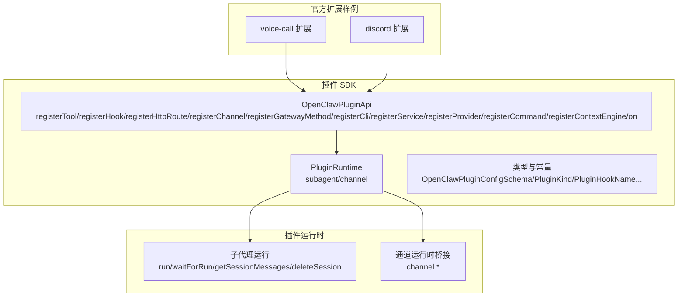

图表来源
- [index.ts:1-826](file://src/plugin-sdk/index.ts#L1-L826)
- [types.ts:263-306](file://src/plugins/types.ts#L263-L306)
- [types.ts:51-63](file://src/plugins/runtime/types.ts#L51-L63)
- [extensions/voice-call/index.ts:1-543](file://extensions/voice-call/index.ts#L1-L543)
- [extensions/discord/index.ts:1-20](file://extensions/discord/index.ts#L1-L20)

章节来源
- [index.ts:1-826](file://src/plugin-sdk/index.ts#L1-L826)
- [types.ts:263-306](file://src/plugins/types.ts#L263-L306)
- [types.ts:51-63](file://src/plugins/runtime/types.ts#L51-L63)
- [extensions/voice-call/index.ts:1-543](file://extensions/voice-call/index.ts#L1-L543)
- [extensions/discord/index.ts:1-20](file://extensions/discord/index.ts#L1-L20)

## 核心组件
- 统一插件接口 OpenClawPluginApi
  - 注册工具、钩子、HTTP 路由、通道、网关方法、CLI、服务、提供商、命令、上下文引擎、生命周期钩子等。
  - 暴露 runtime、logger、config、resolvePath 等能力。
- 插件运行时 PluginRuntime
  - 子代理运行与等待、会话消息读取、会话删除；通道运行时桥接。
- 插件类型与钩子
  - 定义插件种类、配置校验接口、工具工厂、命令上下文与结果、HTTP 路由参数、服务接口、提供商认证方法等。
  - 钩子覆盖模型解析、提示构建、消息收发、工具调用、会话生命周期、网关启停等阶段。
- 插件清单与配置
  - openclaw.plugin.json 必须提供 id 与 configSchema；支持 kind、channels、providers、skills、uiHints、version 等字段；严格校验规则与错误处理。
- 官方扩展样例
  - voice-call：演示注册多个网关方法、工具、CLI、服务，以及按需延迟初始化运行时。
  - discord：演示注册通道与子代理钩子。

章节来源
- [types.ts:263-306](file://src/plugins/types.ts#L263-L306)
- [types.ts:51-63](file://src/plugins/runtime/types.ts#L51-L63)
- [manifest.md:1-76](file://docs/plugins/manifest.md#L1-L76)
- [extensions/voice-call/index.ts:146-543](file://extensions/voice-call/index.ts#L146-L543)
- [extensions/discord/index.ts:7-19](file://extensions/discord/index.ts#L7-L19)

## 架构总览
OpenClaw 插件系统采用“SDK + 运行时 + 清单 + 扩展”的分层设计：
- SDK 层：提供统一 API 与工具集，屏蔽底层差异。
- 运行时层：提供子代理与通道桥接能力，保障跨进程/跨模块协作。
- 清单层：在不加载插件代码的情况下完成配置校验，确保安全性与稳定性。
- 扩展层：官方与社区插件遵循统一规范，快速集成。

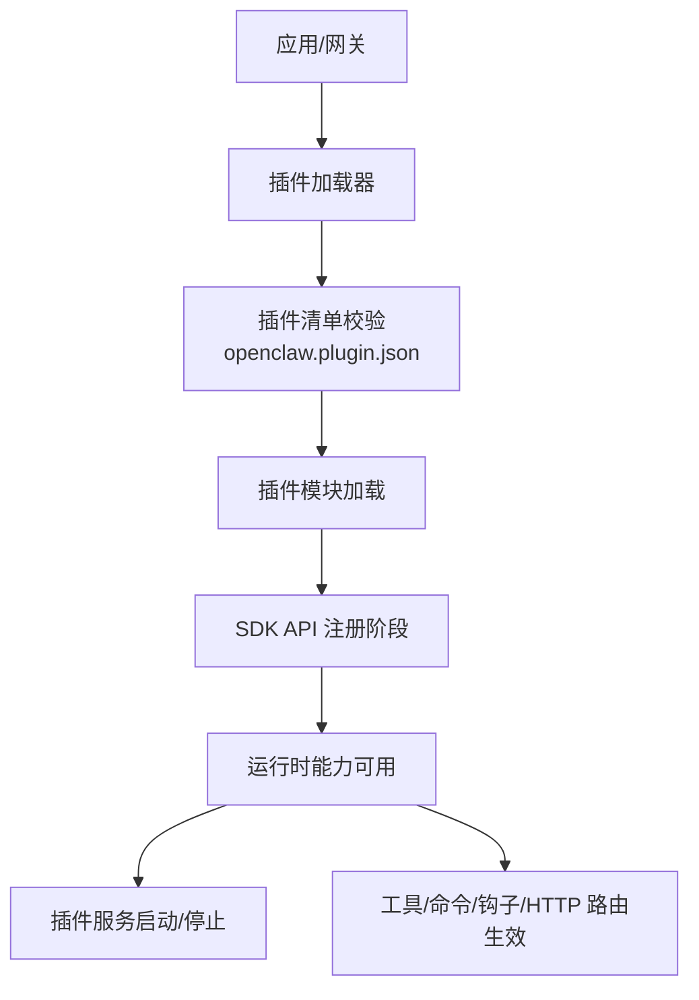

图表来源
- [manifest.md:11-14](file://docs/plugins/manifest.md#L11-L14)
- [types.ts:248-257](file://src/plugins/types.ts#L248-L257)
- [types.ts:51-63](file://src/plugins/runtime/types.ts#L51-L63)

## 详细组件分析

### 组件 A：插件 API 与生命周期
- 关键职责
  - 工具注册：支持必需与可选工具，可按插件 id 或工具名启用。
  - 钩子注册：覆盖提示构建、消息收发、工具调用、会话生命周期、网关启停等。
  - HTTP 路由注册：支持 exact/prefix 匹配与鉴权策略。
  - 通道注册：注入 ChannelPlugin 与 Dock。
  - 网关方法注册：RPC 接口由网关统一调度。
  - CLI 注册：扩展命令行能力。
  - 服务注册：声明式启动/停止的服务。
  - 提供商注册：OAuth/Token/API Key 等认证流程。
  - 命令注册：绕过 LLM 的简单命令。
  - 上下文引擎注册：独占槽位。
  - 生命周期钩子：on(hookName, handler, opts)。
- 开发建议
  - 将复杂初始化延迟到首次使用（如 voice-call），避免启动阻塞。
  - 对敏感配置使用 uiHints 标记 sensitive，便于 UI 呈现。
  - 使用空配置 Schema 作为占位，逐步完善。

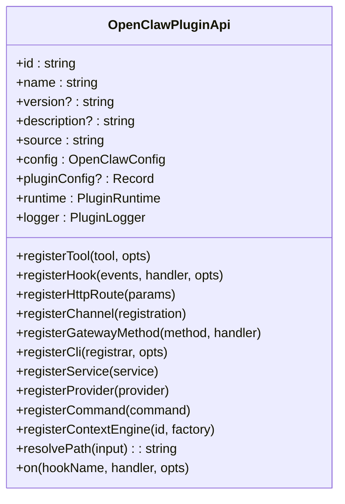

图表来源
- [types.ts:263-306](file://src/plugins/types.ts#L263-L306)

章节来源
- [types.ts:263-306](file://src/plugins/types.ts#L263-L306)
- [agent-tools.md:19-36](file://docs/plugins/agent-tools.md#L19-L36)
- [agent-tools.md:38-63](file://docs/plugins/agent-tools.md#L38-L63)

### 组件 B：插件运行时（子代理与通道）
- 子代理运行
  - run：发起一次子代理运行，返回 runId。
  - waitForRun：等待运行结束，返回状态与错误信息。
  - getSessionMessages：按会话键获取消息列表。
  - deleteSession：删除会话及可选转录。
- 通道运行时
  - 通过 runtime.channel 暴露通道相关能力（由具体通道插件实现）。

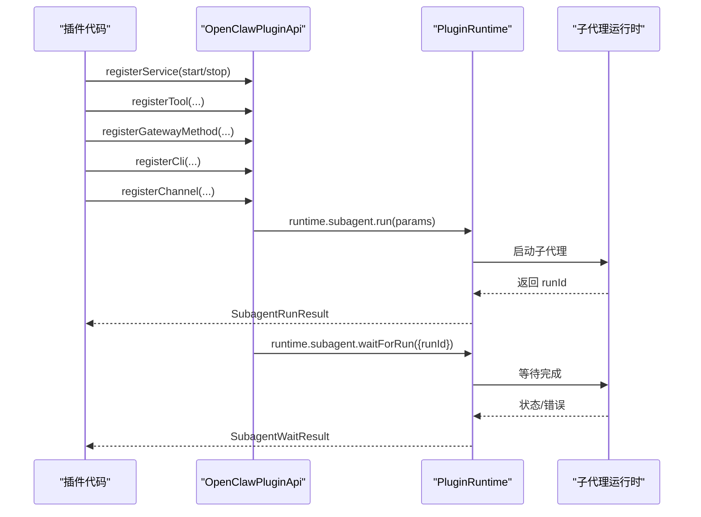

图表来源
- [types.ts:8-39](file://src/plugins/runtime/types.ts#L8-L39)
- [types.ts:51-63](file://src/plugins/runtime/types.ts#L51-L63)

章节来源
- [types.ts:8-39](file://src/plugins/runtime/types.ts#L8-L39)
- [types.ts:51-63](file://src/plugins/runtime/types.ts#L51-L63)

### 组件 C：渠道插件（以 Discord 为例）
- 设计要点
  - 通过 registerChannel 注册 ChannelPlugin 与 Dock。
  - 通过 setDiscordRuntime 注入运行时。
  - 可额外注册子代理钩子以增强多轮/线程绑定等能力。
- 实践建议
  - 将通道能力拆分为独立模块，保持低耦合。
  - 在注册前进行最小化初始化，避免阻塞主流程。

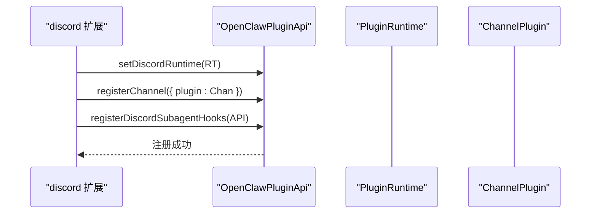

图表来源
- [extensions/discord/index.ts:1-20](file://extensions/discord/index.ts#L1-L20)

章节来源
- [extensions/discord/index.ts:7-19](file://extensions/discord/index.ts#L7-L19)

### 组件 D：工具插件（Agent 工具）
- 规范
  - 工具可为必需或可选；可选工具必须出现在允许列表中才可被调用。
  - 工具名称不可与核心工具冲突；插件 id 用于批量启用。
  - 工具参数建议使用 JSON Schema（TypeBox 等）。
- 示例
  - 基础工具与可选工具的注册与启用方式见文档示例。

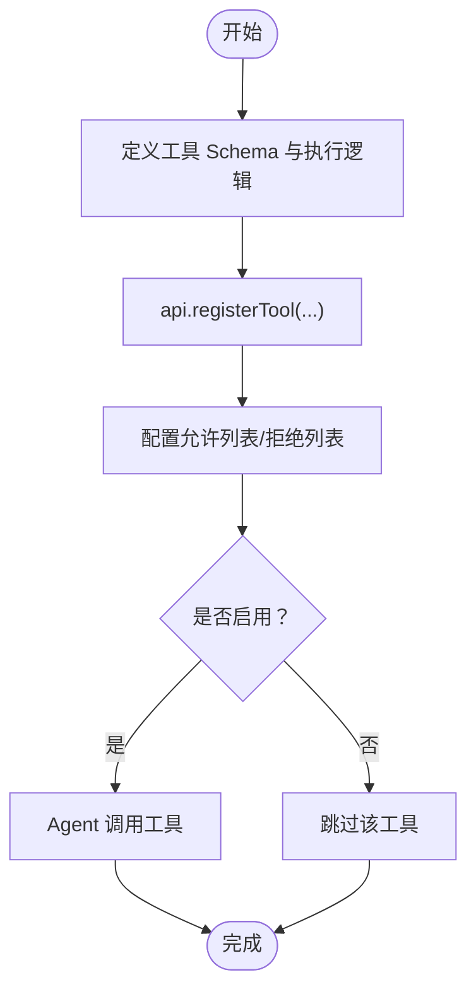

图表来源
- [agent-tools.md:19-36](file://docs/plugins/agent-tools.md#L19-L36)
- [agent-tools.md:38-63](file://docs/plugins/agent-tools.md#L38-L63)

章节来源
- [agent-tools.md:19-36](file://docs/plugins/agent-tools.md#L19-L36)
- [agent-tools.md:38-63](file://docs/plugins/agent-tools.md#L38-L63)

### 组件 E：网关方法与 HTTP 路由
- 网关方法
  - 通过 registerGatewayMethod 注册 RPC 方法，由网关统一调度。
  - voice-call 演示了多个方法的注册与错误处理。
- HTTP 路由
  - 支持 exact/prefix 匹配与鉴权策略（gateway/plugin）。
  - 提供请求体限制、速率限制、异常追踪等安全与防护能力。

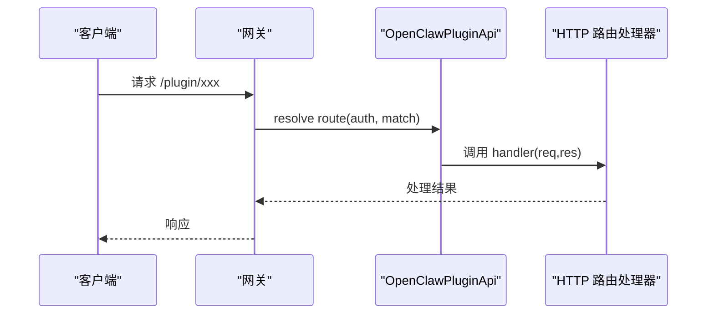

图表来源
- [types.ts:208-219](file://src/plugins/types.ts#L208-L219)
- [extensions/voice-call/index.ts:230-352](file://extensions/voice-call/index.ts#L230-L352)

章节来源
- [types.ts:208-219](file://src/plugins/types.ts#L208-L219)
- [extensions/voice-call/index.ts:230-352](file://extensions/voice-call/index.ts#L230-L352)

### 组件 F：服务与 CLI
- 服务
  - 通过 registerService 注册 start/stop 服务；适合需要后台常驻的任务（如 webhook 服务器）。
- CLI
  - 通过 registerCli 注册命令行子系统，扩展 openclaw 命令。

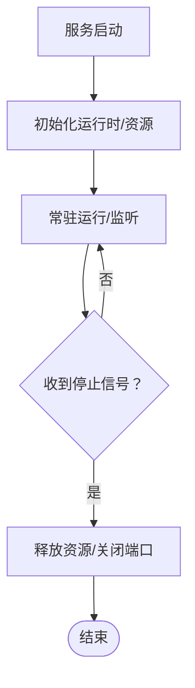

图表来源
- [extensions/voice-call/index.ts:510-538](file://extensions/voice-call/index.ts#L510-L538)

章节来源
- [extensions/voice-call/index.ts:499-508](file://extensions/voice-call/index.ts#L499-L508)
- [extensions/voice-call/index.ts:510-538](file://extensions/voice-call/index.ts#L510-L538)

### 组件 G：提供商与认证
- 提供商插件
  - 定义 id、label、docsPath、aliases、envVars、models、auth 等。
  - 支持多种认证方式（OAuth、Token、API Key、Device Code、Custom）。
- 认证上下文
  - 提供 prompter、runtime、openUrl、oauth 等能力，便于引导用户完成认证。

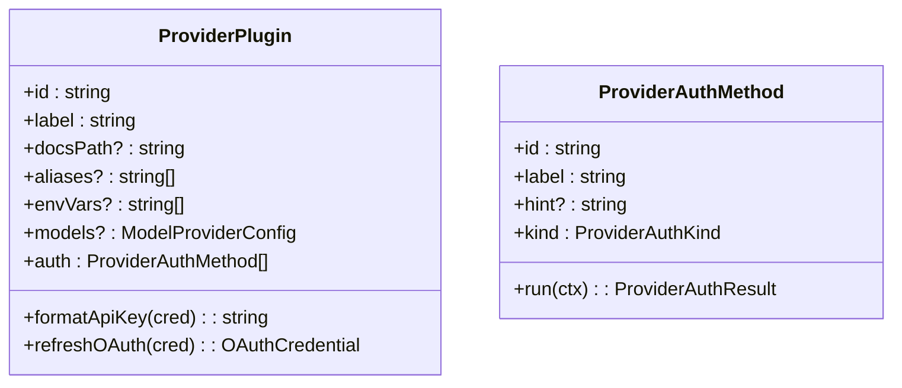

图表来源
- [types.ts:122-132](file://src/plugins/types.ts#L122-L132)
- [types.ts:114-121](file://src/plugins/types.ts#L114-L121)

章节来源
- [types.ts:122-132](file://src/plugins/types.ts#L122-L132)
- [types.ts:114-121](file://src/plugins/types.ts#L114-L121)

### 组件 H：钩子系统
- 钩子覆盖范围
  - 模型解析、提示构建、消息收发、工具调用、会话生命周期、网关启停等。
- 使用建议
  - 优先使用明确的钩子名称；对提示构建类钩子可同时修改系统提示与上下文。
  - 对工具调用可进行参数拦截与阻断，结合 block/blockReason 实施安全策略。

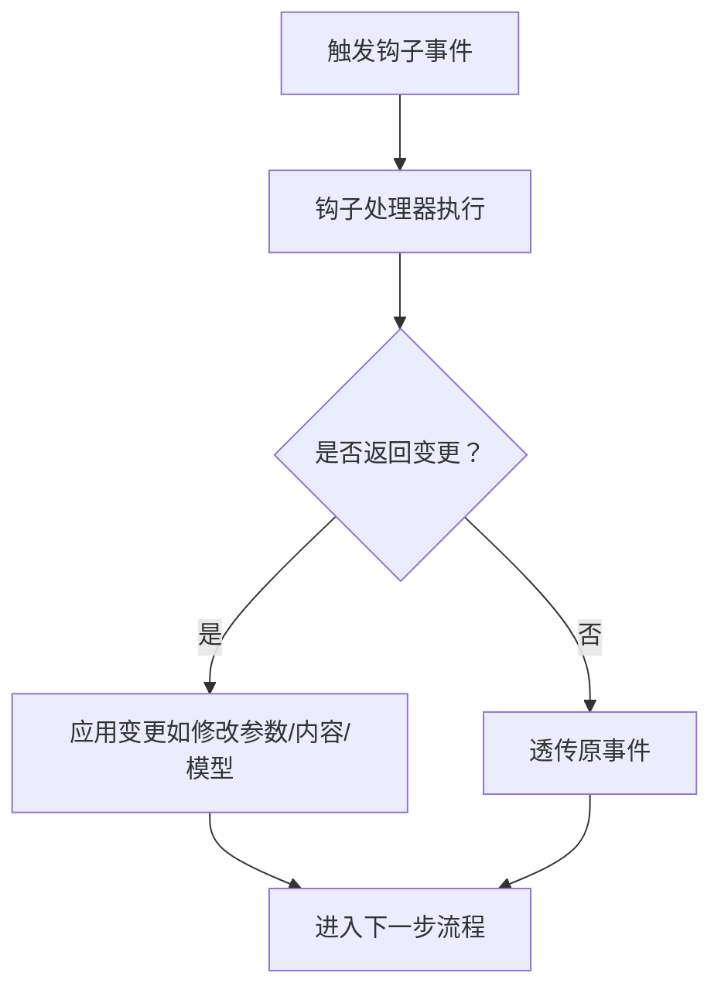

图表来源
- [types.ts:321-372](file://src/plugins/types.ts#L321-L372)
- [types.ts:422-442](file://src/plugins/types.ts#L422-L442)

章节来源
- [types.ts:321-372](file://src/plugins/types.ts#L321-L372)
- [types.ts:422-442](file://src/plugins/types.ts#L422-L442)

### 组件 I：配置系统与清单
- openclaw.plugin.json
  - 必填：id、configSchema。
  - 可选：kind、channels、providers、skills、name、description、uiHints、version。
  - 严格校验：未知字段/未知插件 id 视为错误；禁用插件保留配置并告警。
- 配置 Schema
  - 即使无配置也必须提供 Schema；支持 uiHints 标注标签、帮助、敏感字段等。
- 运行时验证
  - 配置读写时即时校验，失败即刻反馈。

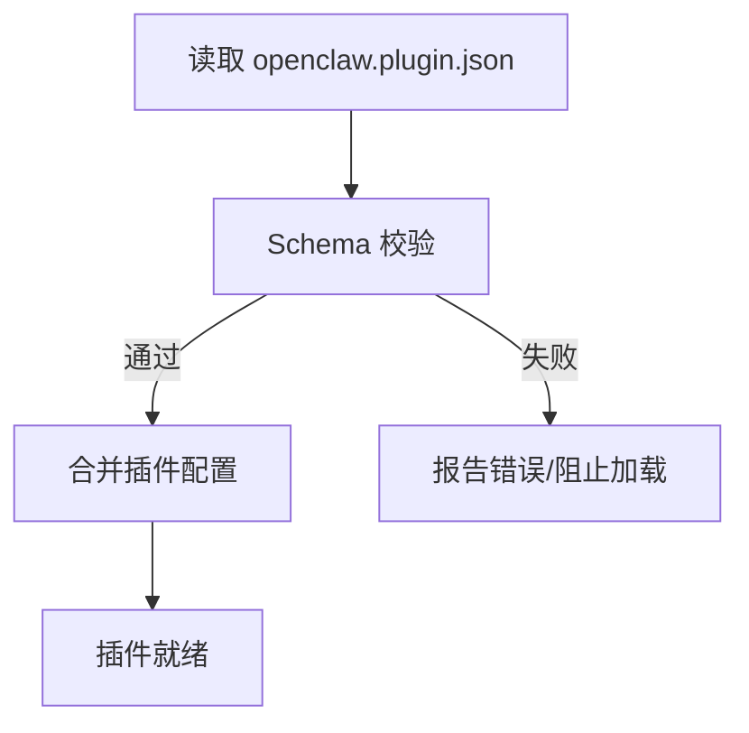

图表来源
- [manifest.md:11-14](file://docs/plugins/manifest.md#L11-L14)
- [manifest.md:47-51](file://docs/plugins/manifest.md#L47-L51)
- [manifest.md:53-62](file://docs/plugins/manifest.md#L53-L62)

章节来源
- [manifest.md:11-14](file://docs/plugins/manifest.md#L11-L14)
- [manifest.md:36-46](file://docs/plugins/manifest.md#L36-L46)
- [manifest.md:47-51](file://docs/plugins/manifest.md#L47-L51)
- [manifest.md:53-62](file://docs/plugins/manifest.md#L53-L62)

### 组件 J：安全模型与防护
- HTTP 安全
  - 请求体大小限制、速率限制、异常追踪、SSRF 策略、主机白名单。
- Webhook 安全
  - 签名验证、重放保护（Twilio/Plivo）、受信代理 IP 与 Hosts 白名单。
- 通道安全
  - 允许列表/拒绝列表、DM/群组策略、提及门控、打字指示与 ACK 反应。
- 最佳实践
  - 生产环境开启签名验证与 Hosts 白名单；避免使用免费隧道的动态域名；合理设置超时与连接上限。

章节来源
- [types.ts:440-447](file://src/plugin-sdk/index.ts#L440-L447)
- [types.ts:454-461](file://src/plugin-sdk/index.ts#L454-L461)
- [voice-call.md:167-182](file://docs/plugins/voice-call.md#L167-L182)
- [voice-call.md:122-137](file://docs/plugins/voice-call.md#L122-L137)

## 依赖关系分析
- 组件内聚与耦合
  - SDK API 与运行时解耦，通过接口契约交互。
  - 清单与配置独立于插件代码，降低加载风险。
  - 扩展样例遵循统一注册模式，便于复用。
- 外部依赖与集成点
  - 网关方法与 HTTP 路由由网关统一调度。
  - 提供商认证通过 OAuth/Token 流程对接外部平台。
- 循环依赖
  - 未发现直接循环依赖；各模块通过导出类型与函数边界清晰。

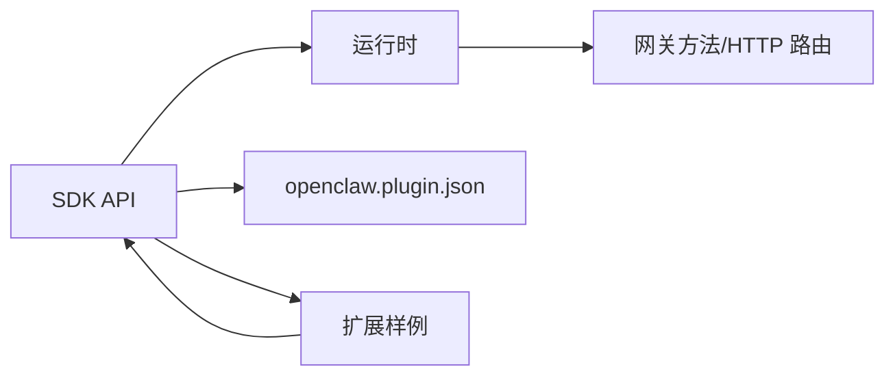

图表来源
- [index.ts:1-826](file://src/plugin-sdk/index.ts#L1-L826)
- [types.ts:263-306](file://src/plugins/types.ts#L263-L306)
- [extensions/voice-call/index.ts:146-543](file://extensions/voice-call/index.ts#L146-L543)

章节来源
- [index.ts:1-826](file://src/plugin-sdk/index.ts#L1-L826)
- [types.ts:263-306](file://src/plugins/types.ts#L263-L306)
- [extensions/voice-call/index.ts:146-543](file://extensions/voice-call/index.ts#L146-L543)

## 性能考量
- 延迟初始化
  - 将昂贵资源（网络服务器、外部 SDK 初始化）延迟到首次使用，减少启动时间。
- 并发与限流
  - 使用 keyed 异步队列、固定窗口限流、请求体大小限制等手段控制并发与资源占用。
- 会话与压缩
  - 利用会话压缩钩子与历史清理策略，降低内存与带宽压力。
- I/O 优化
  - 合理设置媒体流连接上限、预连接超时、每 IP 限额，避免资源枯竭。

## 故障排查指南
- 清单与配置问题
  - 缺失或无效 openclaw.plugin.json：阻止加载；检查 id 与 configSchema。
  - 未知插件 id/通道 id：校验 plugins.entries.plugins、plugins.allow、plugins.deny、plugins.slots。
- 运行时错误
  - 网关方法返回错误：检查参数校验与运行时状态。
  - 子代理运行失败：查看 waitForRun 返回的状态与错误信息。
- 安全与防护
  - Webhook 签名失败：确认 allowedHosts/trustForwardingHeaders/trustedProxyIPs 设置正确。
  - 请求体过大：调整默认限制或自定义读取配置。
- 常见症状与定位
  - 插件未生效：确认已重启网关；检查日志与 Doctor 报告。
  - 工具未启用：核对允许列表与插件 id 是否正确。

章节来源
- [manifest.md:53-62](file://docs/plugins/manifest.md#L53-L62)
- [extensions/voice-call/index.ts:169-197](file://extensions/voice-call/index.ts#L169-L197)
- [types.ts:21-29](file://src/plugins/runtime/types.ts#L21-L29)
- [voice-call.md:167-182](file://docs/plugins/voice-call.md#L167-L182)

## 结论
OpenClaw 插件系统通过统一 SDK、严格的清单与配置校验、完善的运行时与安全防护，为第三方开发者提供了高扩展性与强一致性的开发体验。遵循本文档的规范与最佳实践，可在保证安全与稳定的前提下，快速构建高质量的渠道、技能与工具插件。

## 附录

### A. 开发指南（步骤清单）
- 准备 openclaw.plugin.json
  - 填写 id、configSchema；必要时补充 kind、channels、providers、skills、uiHints、version。
- 编写插件入口
  - 导出插件定义对象，实现 register/activate；在 register 中完成 API 注册。
- 注册工具与命令
  - 工具：按需启用可选工具；命令：注册绕过 LLM 的简单命令。
- 注册通道/网关方法/HTTP 路由/CLI/服务
  - 通道：通过 registerChannel 注册 ChannelPlugin。
  - 网关方法：通过 registerGatewayMethod 注册 RPC。
  - HTTP 路由：通过 registerHttpRoute 注册路由与鉴权。
  - CLI：通过 registerCli 注册命令行。
  - 服务：通过 registerService 注册 start/stop。
- 配置与安全
  - 提供完整的 JSON Schema；标注敏感字段；启用必要的安全策略。
- 测试与调试
  - 使用 Doctor 检查清单与配置；观察日志与诊断事件；验证工具与命令行为。

章节来源
- [manifest.md:18-46](file://docs/plugins/manifest.md#L18-L46)
- [types.ts:248-257](file://src/plugins/types.ts#L248-L257)
- [agent-tools.md:19-36](file://docs/plugins/agent-tools.md#L19-L36)
- [extensions/voice-call/index.ts:146-543](file://extensions/voice-call/index.ts#L146-L543)
- [voice-call.md:305-315](file://docs/plugins/voice-call.md#L305-L315)

### B. 安装与分发（最佳实践）
- 安装
  - 推荐通过 npm 安装；本地开发可直接安装本地目录。
- 分发
  - 发布至 npmjs；提供 GitHub 仓库与使用文档；明确维护信号。
- 版本与兼容
  - 使用语义化版本；在 SDK 文档中明确稳定性与兼容性承诺。
- 社区插件
  - 满足质量门槛后可提交至社区插件列表。

章节来源
- [voice-call.md:34-52](file://docs/plugins/voice-call.md#L34-L52)
- [community.md:15-21](file://docs/plugins/community.md#L15-L21)
- [community.md:22-31](file://docs/plugins/community.md#L22-L31)
- [index.ts:42-46](file://src/plugin-sdk/index.ts#L42-L46)