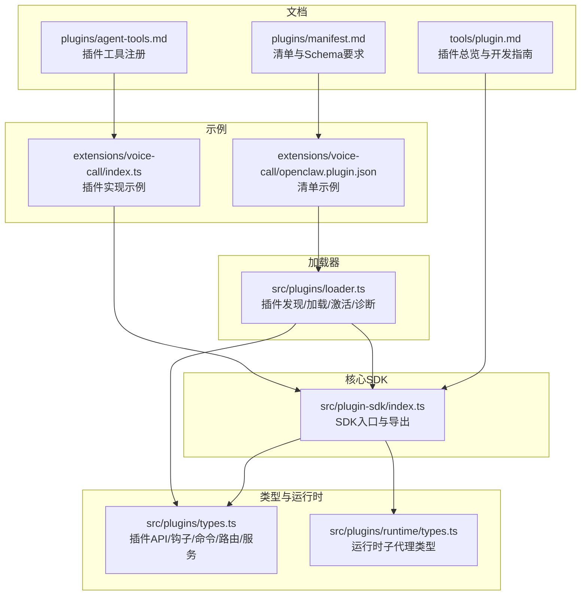
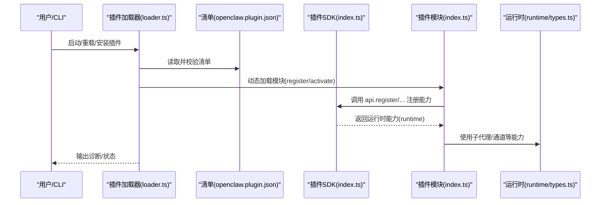
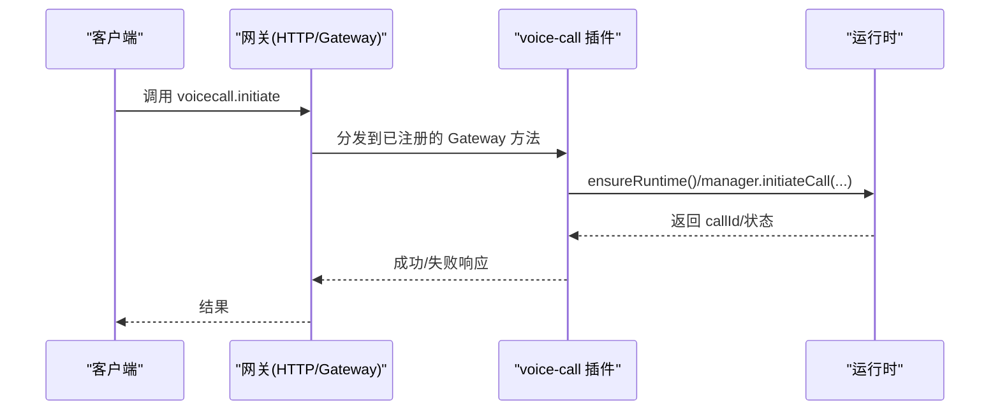
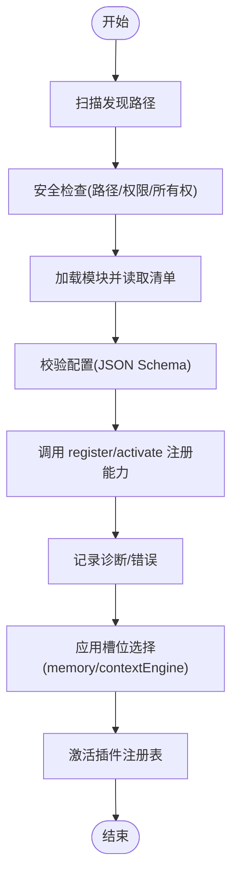
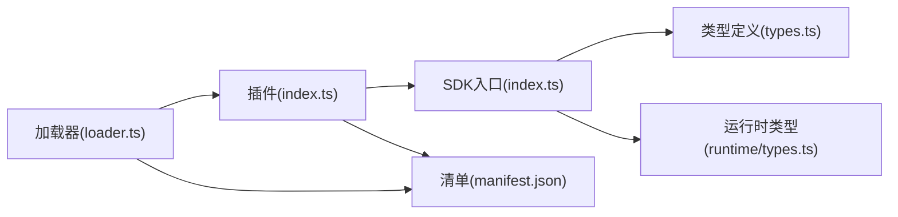

# 插件开发基础

<cite>
**本文引用的文件**
- [docs/tools/plugin.md](file://docs/tools/plugin.md)
- [docs/plugins/manifest.md](file://docs/plugins/manifest.md)
- [docs/plugins/agent-tools.md](file://docs/plugins/agent-tools.md)
- [src/plugin-sdk/index.ts](file://src/plugin-sdk/index.ts)
- [src/plugins/types.ts](file://src/plugins/types.ts)
- [src/plugins/runtime/types.ts](file://src/plugins/runtime/types.ts)
- [src/plugins/loader.ts](file://src/plugins/loader.ts)
- [extensions/voice-call/openclaw.plugin.json](file://extensions/voice-call/openclaw.plugin.json)
- [extensions/voice-call/index.ts](file://extensions/voice-call/index.ts)
- [docs/start/getting-started.md](file://docs/start/getting-started.md)
</cite>

## 目录
1. [简介](#简介)
2. [项目结构](#项目结构)
3. [核心组件](#核心组件)
4. [架构总览](#架构总览)
5. [详细组件分析](#详细组件分析)
6. [依赖分析](#依赖分析)
7. [性能考虑](#性能考虑)
8. [故障排查指南](#故障排查指南)
9. [结论](#结论)
10. [附录](#附录)

## 简介
本指南面向希望在 OpenClaw 平台上开发插件（扩展）的开发者，系统讲解插件系统的整体架构与设计理念、生命周期、接口规范与配置管理，并提供从项目初始化到打包发布的完整流程。文档还详解插件清单文件 openclaw.plugin.json 的配置项、插件 SDK 的核心接口与工具函数、基础开发模板与示例、最佳实践、常见陷阱与调试技巧。

## 项目结构
OpenClaw 将插件开发所需的知识与实现分布在多个目录与文档中：
- 文档侧：tools/plugin.md 提供插件总体使用与开发指南；plugins/manifest.md 说明清单与 JSON Schema 要求；plugins/agent-tools.md 介绍插件工具注册与策略。
- 核心 SDK：src/plugin-sdk/index.ts 汇总导出插件 SDK 的公共 API、类型与工具函数。
- 类型与运行时：src/plugins/types.ts 定义插件 API、钩子、命令、HTTP 路由、服务等核心类型；src/plugins/runtime/types.ts 定义运行时子代理（subagent）相关类型。
- 加载器：src/plugins/loader.ts 实现插件发现、加载、激活与错误处理流程。
- 示例：extensions/voice-call 展示一个完整的插件实现，包含 openclaw.plugin.json 清单与 TypeScript 入口。

**图表来源**
- [docs/tools/plugin.md:1-963](file://docs/tools/plugin.md#L1-L963)
- [src/plugin-sdk/index.ts:1-826](file://src/plugin-sdk/index.ts#L1-L826)
- [src/plugins/types.ts:1-893](file://src/plugins/types.ts#L1-L893)
- [src/plugins/runtime/types.ts:1-64](file://src/plugins/runtime/types.ts#L1-L64)
- [src/plugins/loader.ts:412-828](file://src/plugins/loader.ts#L412-L828)
- [extensions/voice-call/openclaw.plugin.json:1-612](file://extensions/voice-call/openclaw.plugin.json#L1-L612)
- [extensions/voice-call/index.ts:1-543](file://extensions/voice-call/index.ts#L1-L543)

**章节来源**
- [docs/tools/plugin.md:1-963](file://docs/tools/plugin.md#L1-L963)
- [src/plugin-sdk/index.ts:1-826](file://src/plugin-sdk/index.ts#L1-L826)
- [src/plugins/types.ts:1-893](file://src/plugins/types.ts#L1-L893)
- [src/plugins/runtime/types.ts:1-64](file://src/plugins/runtime/types.ts#L1-L64)
- [src/plugins/loader.ts:412-828](file://src/plugins/loader.ts#L412-L828)
- [extensions/voice-call/openclaw.plugin.json:1-612](file://extensions/voice-call/openclaw.plugin.json#L1-L612)
- [extensions/voice-call/index.ts:1-543](file://extensions/voice-call/index.ts#L1-L543)

## 核心组件
- 插件 API（OpenClawPluginApi）：插件通过该对象注册工具、命令、HTTP 路由、网关方法、CLI、服务、上下文引擎、通道插件、钩子等，并访问运行时能力与日志。
- 配置与清单：每个插件必须提供 openclaw.plugin.json，其中包含 id、configSchema、可选的 kind、channels、providers、skills、uiHints 等字段。
- 运行时（PluginRuntime）：提供子代理运行、等待、会话消息读取、删除会话以及通道相关能力。
- 钩子系统：支持 agent 生命周期钩子（如 before_prompt_build、before_agent_start、before_model_resolve 等），并允许按优先级合并结果。
- 加载器：负责扫描路径、解析清单、验证配置、调用插件 register/activate、记录诊断信息与错误。

**章节来源**
- [src/plugins/types.ts:263-306](file://src/plugins/types.ts#L263-L306)
- [src/plugins/runtime/types.ts:51-63](file://src/plugins/runtime/types.ts#L51-L63)
- [docs/plugins/manifest.md:18-76](file://docs/plugins/manifest.md#L18-L76)
- [src/plugins/loader.ts:769-800](file://src/plugins/loader.ts#L769-L800)

## 架构总览
下图展示了插件从发现、加载、注册到运行的整体流程，以及与 SDK、运行时的关系。

**图表来源**
- [src/plugins/loader.ts:769-800](file://src/plugins/loader.ts#L769-L800)
- [src/plugin-sdk/index.ts:1-826](file://src/plugin-sdk/index.ts#L1-L826)
- [src/plugins/runtime/types.ts:51-63](file://src/plugins/runtime/types.ts#L51-L63)
- [extensions/voice-call/index.ts:146-543](file://extensions/voice-call/index.ts#L146-L543)

## 详细组件分析

### 插件清单文件 openclaw.plugin.json
- 必填字段
  - id：插件标识符（字符串）
  - configSchema：JSON Schema（用于配置校验）
- 可选字段
  - kind：插件种类（如 memory/context-engine）
  - channels：插件注册的通道 id 列表
  - providers：插件注册的模型提供商 id 列表
  - skills：相对插件根目录的技能目录数组
  - name/description/uiHints/version：显示名、描述、UI 提示与版本
- 校验行为
  - 缺失或无效清单即视为插件错误并阻断配置校验
  - 未知 channels.* 且未被任何插件清单声明则报错
  - plugins.entries.<id>、plugins.allow、plugins.deny、plugins.slots.* 必须引用“可发现”的插件 id

**章节来源**
- [docs/plugins/manifest.md:18-76](file://docs/plugins/manifest.md#L18-L76)
- [extensions/voice-call/openclaw.plugin.json:1-612](file://extensions/voice-call/openclaw.plugin.json#L1-L612)

### 插件 SDK 核心接口与工具
- SDK 入口导出
  - 类型与适配器：通道账户/消息/线程/安全/心跳等类型与工具
  - 运行时能力：TTS/STT、SSRF 策略、请求体限制、键控队列、Webhook 目标与请求守卫、媒体负载构建等
  - 工具函数：时间格式化、去重缓存、临时路径、Windows 程序策略、命令执行、网关绑定地址解析等
- 插件 API（OpenClawPluginApi）
  - 基础属性：id/name/version/description/source/config/pluginConfig/runtime/logger
  - 注册方法：registerTool/registerHook/registerHttpRoute/registerChannel/registerGatewayMethod/registerCli/registerService/registerProvider/registerCommand/registerContextEngine/on
  - 路径解析：resolvePath
- 运行时（PluginRuntime）
  - 子代理：run/waitForRun/getSessionMessages/getSession/deleteSession
  - 通道：通道相关运行时能力

**章节来源**
- [src/plugin-sdk/index.ts:1-826](file://src/plugin-sdk/index.ts#L1-L826)
- [src/plugins/types.ts:263-306](file://src/plugins/types.ts#L263-L306)
- [src/plugins/runtime/types.ts:51-63](file://src/plugins/runtime/types.ts#L51-L63)

### 插件开发流程（从零到发布）
- 初始化项目
  - 创建插件根目录与 openclaw.plugin.json（至少包含 id 与 configSchema）
  - 在根目录编写 index.ts（默认导出函数或对象形式的插件定义）
- 开发与调试
  - 使用 api.register* 注册工具、命令、HTTP 路由、网关方法、CLI、服务、上下文引擎、通道插件
  - 通过 api.runtime 访问运行时能力（如 TTS/STT、子代理）
  - 使用 uiHints 在控制 UI 中优化配置表单
- 配置与验证
  - 在主配置中启用插件并设置 plugins.entries.<id>.config
  - 配置变更需重启网关
- 打包与分发
  - 若为 npm 包，遵循官方插件命名与 dist-tag 规范
  - 若为本地/私有插件，可通过 plugins.load.paths 或安装至全局/工作区扩展目录
  - 如需多扩展打包，可在 package.json 中使用 openclaw.extensions 指定入口

**章节来源**
- [docs/tools/plugin.md:20-44](file://docs/tools/plugin.md#L20-L44)
- [docs/tools/plugin.md:347-440](file://docs/tools/plugin.md#L347-L440)
- [docs/tools/plugin.md:460-483](file://docs/tools/plugin.md#L460-L483)
- [docs/tools/plugin.md:484-521](file://docs/tools/plugin.md#L484-L521)
- [docs/tools/plugin.md:522-603](file://docs/tools/plugin.md#L522-L603)
- [docs/tools/plugin.md:604-654](file://docs/tools/plugin.md#L604-L654)
- [docs/tools/plugin.md:655-800](file://docs/tools/plugin.md#L655-L800)

### 插件清单配置详解（以 voice-call 为例）
- id：voice-call
- uiHints：为配置字段提供标签、占位符、敏感标记等，便于 UI 呈现
- configSchema：定义插件配置的 JSON Schema，覆盖 provider、号码、入站策略、出站模式、隧道、Webhook 安全、实时流、TTS/STT、存储、响应模型等
- 作用：在不执行插件代码的前提下完成配置校验，保障安全性与一致性

**章节来源**
- [extensions/voice-call/openclaw.plugin.json:1-612](file://extensions/voice-call/openclaw.plugin.json#L1-L612)

### 插件实现示例（voice-call）
- 清单与入口
  - openclaw.plugin.json：定义 id、uiHints、configSchema
  - index.ts：导出插件定义，注册网关方法、工具、CLI、服务等
- 关键点
  - 解析与校验配置，按需抛出错误
  - 通过 ensureRuntime 延迟初始化运行时，失败时重置 promise 以避免端口孤儿问题
  - 注册多个 Gateway 方法（initiate/continue/speak/end/status/start）
  - 注册工具与 CLI，暴露语音通话能力
  - 注册服务，在启动时初始化运行时，停止时清理资源

**图表来源**
- [extensions/voice-call/index.ts:230-375](file://extensions/voice-call/index.ts#L230-L375)
- [extensions/voice-call/index.ts:169-197](file://extensions/voice-call/index.ts#L169-L197)

**章节来源**
- [extensions/voice-call/index.ts:146-543](file://extensions/voice-call/index.ts#L146-L543)

### 插件工具与策略
- 基本工具：使用 api.registerTool 注册 JSON Schema 函数，支持同步/异步执行
- 可选工具：通过选项 optional: true 标记，需在 agents.tools.allow 中显式启用
- 策略控制：通过 tools.allow/tools.deny、byProvider、sandbox 等策略影响可用性
- 最佳实践：避免与核心工具名称冲突；对有副作用或需要额外凭据/二进制的工具建议设为可选

**章节来源**
- [docs/plugins/agent-tools.md:19-100](file://docs/plugins/agent-tools.md#L19-L100)

### 插件钩子与生命周期
- 支持的钩子：before_model_resolve、before_prompt_build、before_agent_start、llm_input、llm_output、agent_end、before_compaction、after_compaction、before_reset、message_received、message_sending、message_sent、before_tool_call、after_tool_call、tool_result_persist、before_message_write、session_start、session_end、subagent_spawning、subagent_delivery_target、subagent_spawned、subagent_ended、gateway_start、gateway_stop
- typed 钩子：使用 api.on(name, handler, { priority }) 注册，返回值可用于修改提示上下文或覆盖模型/提供方
- 核心策略：操作者可禁用特定插件的提示注入钩子；before_prompt_build 的结果字段按顺序合并

**章节来源**
- [src/plugins/types.ts:321-394](file://src/plugins/types.ts#L321-L394)
- [src/plugins/types.ts:484-520](file://src/plugins/types.ts#L484-L520)
- [src/plugins/types.ts:558-670](file://src/plugins/types.ts#L558-L670)
- [src/plugins/types.ts:787-794](file://src/plugins/types.ts#L787-L794)

### 插件加载与生命周期（Loader）
- 发现顺序：配置路径 -> 工作区扩展 -> 全局扩展 -> 内置扩展
- 安全检查：拒绝越权路径、世界可写目录、可疑所有权
- 加载过程：读取清单 -> 校验配置 -> 调用 register/activate -> 记录诊断与错误
- 槽位选择：通过 plugins.slots.memory/contextEngine 选择唯一生效的插件

**图表来源**
- [src/plugins/loader.ts:412-828](file://src/plugins/loader.ts#L412-L828)

**章节来源**
- [src/plugins/loader.ts:412-828](file://src/plugins/loader.ts#L412-L828)

## 依赖分析
- 插件与 SDK：插件通过 SDK 获取运行时能力与工具函数，避免直接导入核心源码（src/**），确保信任边界与隔离性
- 插件与运行时：插件通过 PluginRuntime 访问子代理与通道能力，实现会话管理与消息投递
- 插件与清单：清单决定插件可见性、可发现性与配置校验，是插件安全与稳定性的前置条件

**图表来源**
- [src/plugin-sdk/index.ts:1-826](file://src/plugin-sdk/index.ts#L1-L826)
- [src/plugins/types.ts:1-893](file://src/plugins/types.ts#L1-L893)
- [src/plugins/runtime/types.ts:1-64](file://src/plugins/runtime/types.ts#L1-L64)
- [src/plugins/loader.ts:769-800](file://src/plugins/loader.ts#L769-L800)
- [extensions/voice-call/index.ts:146-543](file://extensions/voice-call/index.ts#L146-L543)

**章节来源**
- [src/plugin-sdk/index.ts:1-826](file://src/plugin-sdk/index.ts#L1-L826)
- [src/plugins/types.ts:1-893](file://src/plugins/types.ts#L1-L893)
- [src/plugins/runtime/types.ts:1-64](file://src/plugins/runtime/types.ts#L1-L64)
- [src/plugins/loader.ts:769-800](file://src/plugins/loader.ts#L769-L800)
- [extensions/voice-call/index.ts:146-543](file://extensions/voice-call/index.ts#L146-L543)

## 性能考虑
- 插件发现与清单缓存：可通过环境变量禁用或调整缓存窗口，减少启动/重载时的重复工作
- 子代理运行：合理设置 lane/idempotencyKey，避免并发风暴；必要时使用 waitForRun 控制时序
- Webhook 与请求体限制：利用内置守卫与限流器，防止过载与异常流量
- 钩子合并：高优先级钩子先执行，注意合并顺序与字段覆盖

**章节来源**
- [docs/tools/plugin.md:219-227](file://docs/tools/plugin.md#L219-L227)
- [src/plugin-sdk/index.ts:431-447](file://src/plugin-sdk/index.ts#L431-L447)

## 故障排查指南
- 清单缺失或无效：检查 openclaw.plugin.json 是否存在、id 与 configSchema 是否正确
- 配置校验失败：根据错误列表定位具体字段；确认 plugins.entries.<id>.config 与 JSON Schema 一致
- 插件未加载：查看 plugins.allow/plugins.deny/plugins.slots 的配置是否正确；确认发现路径与安全检查未拦截
- 运行时错误：关注插件服务启动/停止日志；对于 voice-call 等插件，注意 ensureRuntime 失败后的 promise 重置
- 钩子不生效：确认未被操作者禁用提示注入；检查钩子优先级与合并逻辑

**章节来源**
- [docs/plugins/manifest.md:53-63](file://docs/plugins/manifest.md#L53-L63)
- [src/plugins/loader.ts:751-755](file://src/plugins/loader.ts#L751-L755)
- [src/plugins/loader.ts:412-440](file://src/plugins/loader.ts#L412-L440)
- [extensions/voice-call/index.ts:169-197](file://extensions/voice-call/index.ts#L169-L197)

## 结论
OpenClaw 的插件体系以“清单驱动 + SDK 注入 + 运行时隔离”为核心设计，既保证了扩展能力的灵活性，又维护了安全性与可运维性。开发者应严格遵循清单与 Schema 要求，善用 SDK 提供的工具与运行时能力，结合钩子与策略实现高质量的插件功能。通过本文提供的流程、模板与最佳实践，可高效完成从开发到发布的全流程。

## 附录
- 快速上手：参考 Getting Started，快速安装与启动 OpenClaw，体验控制 UI 与网关
- 插件命令：使用 openclaw plugins list/info/install/update/enable/disable/doctor 等命令管理插件
- 官方插件：参考 tools/plugin.md 的官方插件列表与安装方式

**章节来源**
- [docs/start/getting-started.md:1-136](file://docs/start/getting-started.md#L1-L136)
- [docs/tools/plugin.md:460-483](file://docs/tools/plugin.md#L460-L483)