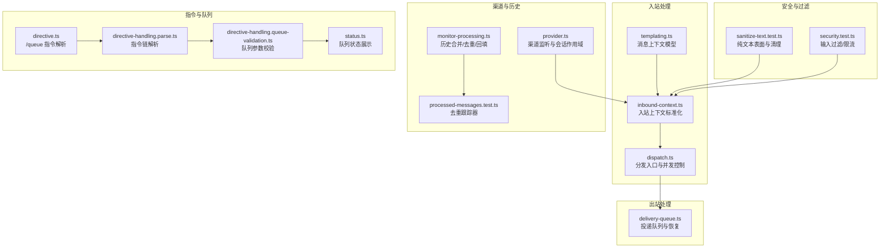
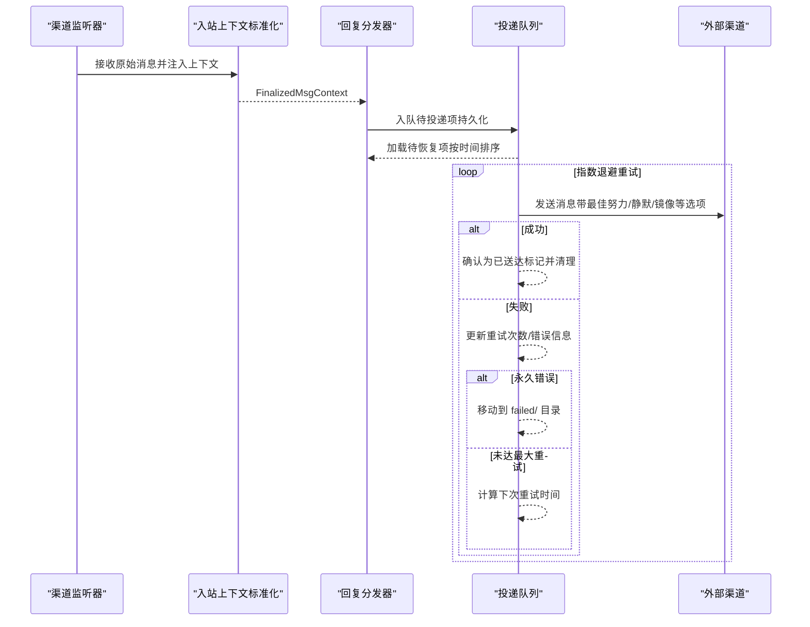
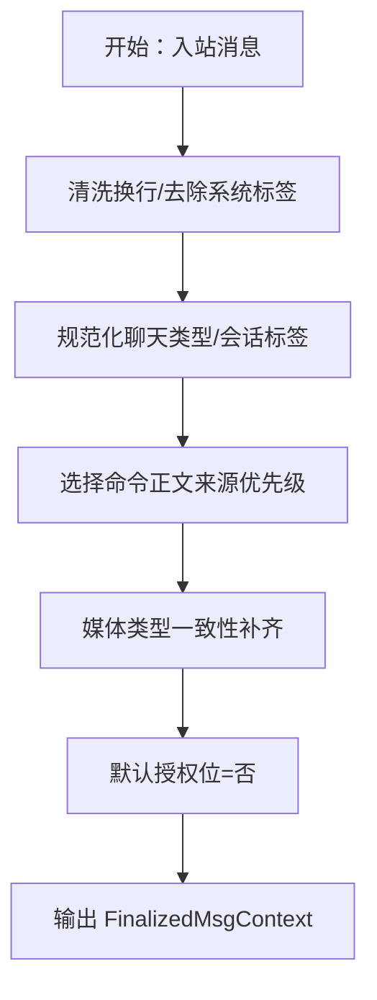
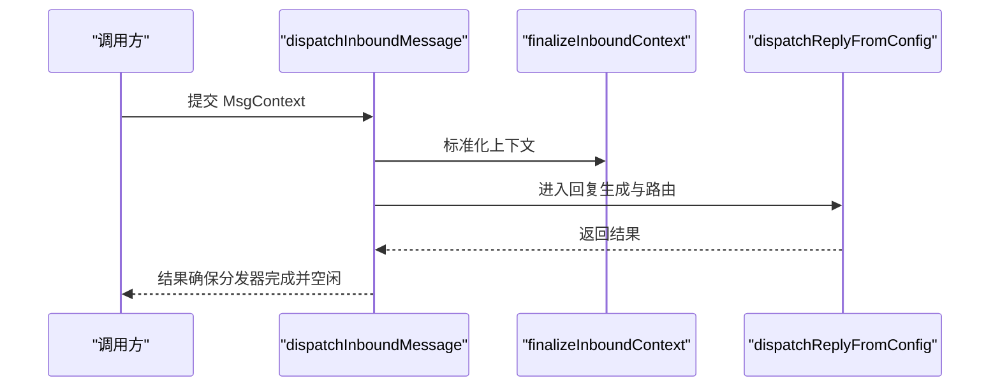
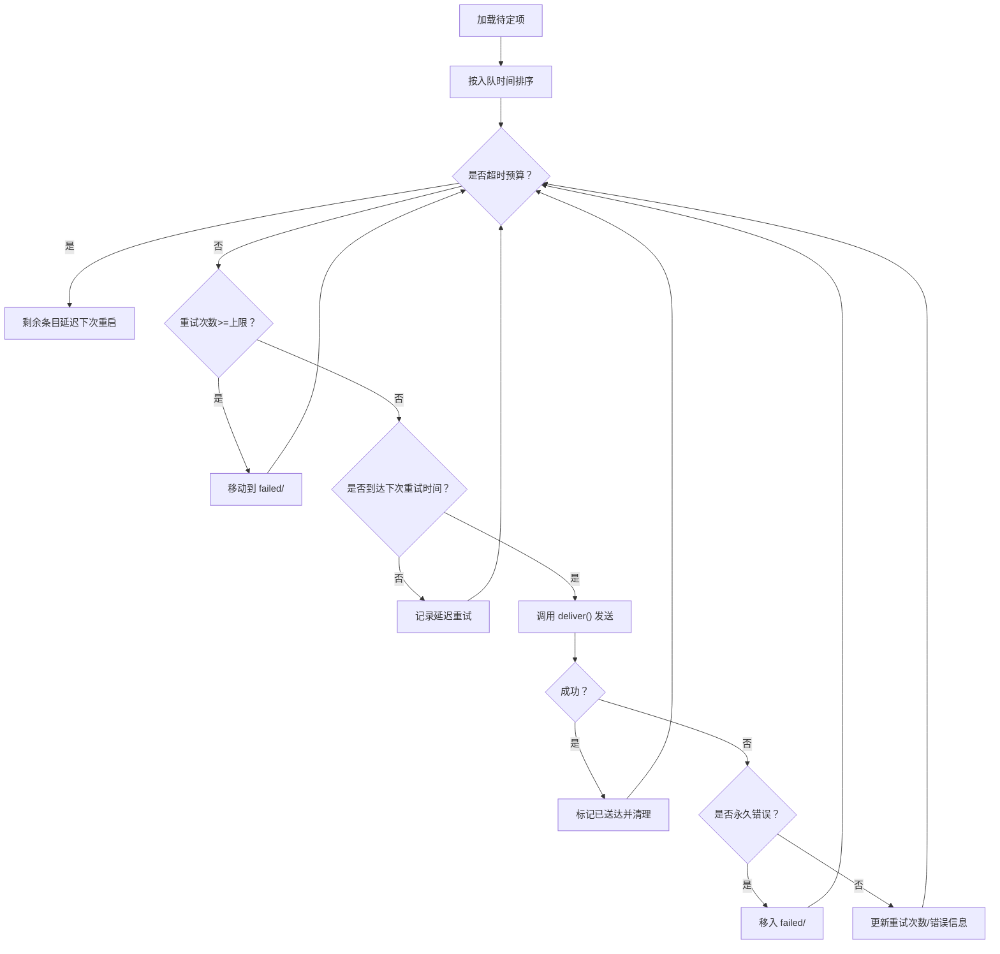
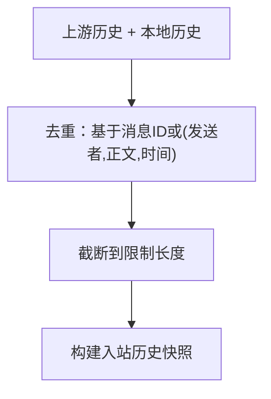
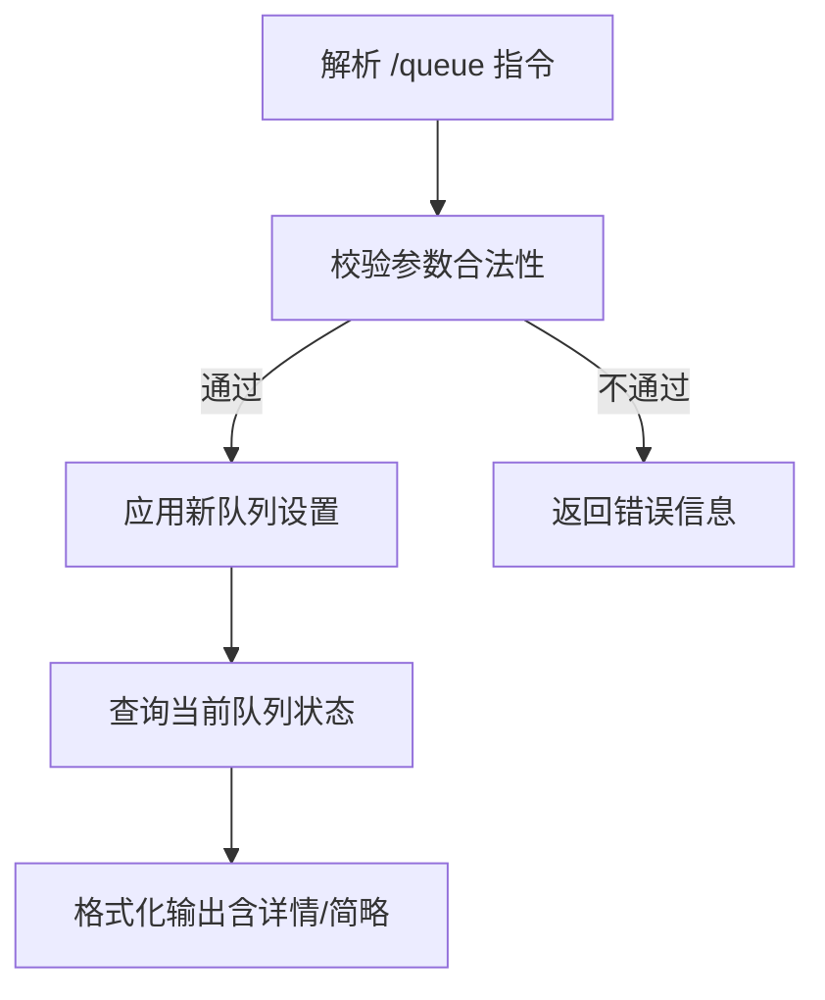
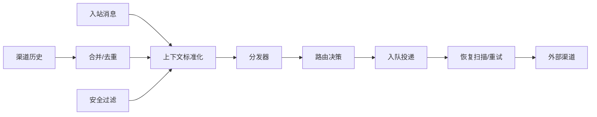

# 消息处理机制

<cite>
**本文引用的文件**
- [templating.ts](file://src/auto-reply/templating.ts)
- [inbound-context.ts](file://src/auto-reply/reply/inbound-context.ts)
- [dispatch.ts](file://src/auto-reply/dispatch.ts)
- [delivery-queue.ts](file://src/infra/outbound/delivery-queue.ts)
- [sanitize-text.test.ts](file://src/infra/outbound/sanitize-text.test.ts)
- [security.test.ts](file://extensions/synology-chat/src/security.test.ts)
- [processed-messages.test.ts](file://extensions/tlon/src/monitor/processed-messages.test.ts)
- [monitor-processing.ts](file://extensions/bluebubbles/src/monitor-processing.ts)
- [message-handler.inbound-contract.test.ts](file://src/discord/monitor/message-handler.inbound-contract.test.ts)
- [directive.ts](file://src/auto-reply/reply/queue/directive.ts)
- [directive-handling.parse.ts](file://src/auto-reply/reply/directive-handling.parse.ts)
- [directive-handling.queue-validation.ts](file://src/auto-reply/reply/directive-handling.queue-validation.ts)
- [status.ts](file://src/auto-reply/status.ts)
- [provider.ts](file://src/slack/monitor/provider.ts)
- [imessage.ts](file://src/channels/plugins/normalize/imessage.ts)
- [location.md](file://docs/zh-CN/channels/location.md)
- [bot.media.downloads-media-file-path-no-file-download.e2e.test.ts](file://src/telegram/bot.media.downloads-media-file-path-no-file-download.e2e.test.ts)
</cite>

## 目录
1. [引言](#引言)
2. [项目结构](#项目结构)
3. [核心组件](#核心组件)
4. [架构总览](#架构总览)
5. [详细组件分析](#详细组件分析)
6. [依赖关系分析](#依赖关系分析)
7. [性能考量](#性能考量)
8. [故障排查指南](#故障排查指南)
9. [结论](#结论)
10. [附录](#附录)

## 引言
本技术指南围绕 OpenClaw 的消息处理机制展开，系统性阐述从“消息接收—解析—路由—响应”的全链路设计，覆盖消息队列、并发处理、错误恢复、中间件与过滤器、消息转换与格式标准化、内容安全检查、消息历史管理与去重、批量处理优化、流控与背压以及性能监控等主题。文档以代码级事实为基础，结合可视化图示帮助读者快速理解并落地实施。

## 项目结构
OpenClaw 将消息处理拆分为“入站上下文标准化”“回复分发器”“出站投递队列”“渠道适配与历史/去重”“安全与过滤”等多个模块，形成高内聚、低耦合的处理流水线。下图给出与消息处理直接相关的子系统与文件映射：

**图表来源**
- [templating.ts:14-182](file://src/auto-reply/templating.ts#L14-L182)
- [inbound-context.ts:37-128](file://src/auto-reply/reply/inbound-context.ts#L37-L128)
- [dispatch.ts:35-54](file://src/auto-reply/dispatch.ts#L35-L54)
- [delivery-queue.ts:109-136](file://src/infra/outbound/delivery-queue.ts#L109-L136)
- [monitor-processing.ts:273-327](file://extensions/bluebubbles/src/monitor-processing.ts#L273-L327)
- [processed-messages.test.ts:1-23](file://extensions/tlon/src/monitor/processed-messages.test.ts#L1-L23)
- [provider.ts:97-128](file://src/slack/monitor/provider.ts#L97-L128)
- [sanitize-text.test.ts:1-40](file://src/infra/outbound/sanitize-text.test.ts#L1-L40)
- [security.test.ts:100-146](file://extensions/synology-chat/src/security.test.ts#L100-L146)
- [directive.ts:124-176](file://src/auto-reply/reply/queue/directive.ts#L124-L176)
- [directive-handling.parse.ts:113-144](file://src/auto-reply/reply/directive-handling.parse.ts#L113-L144)
- [directive-handling.queue-validation.ts:19-78](file://src/auto-reply/reply/directive-handling.queue-validation.ts#L19-L78)
- [status.ts:183-208](file://src/auto-reply/status.ts#L183-L208)

**章节来源**
- [templating.ts:1-243](file://src/auto-reply/templating.ts#L1-L243)
- [inbound-context.ts:1-129](file://src/auto-reply/reply/inbound-context.ts#L1-L129)
- [dispatch.ts:1-98](file://src/auto-reply/dispatch.ts#L1-L98)
- [delivery-queue.ts:1-440](file://src/infra/outbound/delivery-queue.ts#L1-L440)
- [monitor-processing.ts:273-1103](file://extensions/bluebubbles/src/monitor-processing.ts#L273-L1103)
- [processed-messages.test.ts:1-23](file://extensions/tlon/src/monitor/processed-messages.test.ts#L1-L23)
- [provider.ts:97-128](file://src/slack/monitor/provider.ts#L97-L128)
- [sanitize-text.test.ts:1-40](file://src/infra/outbound/sanitize-text.test.ts#L1-L40)
- [security.test.ts:100-146](file://extensions/synology-chat/src/security.test.ts#L100-L146)
- [directive.ts:124-176](file://src/auto-reply/reply/queue/directive.ts#L124-L176)
- [directive-handling.parse.ts:113-144](file://src/auto-reply/reply/directive-handling.parse.ts#L113-L144)
- [directive-handling.queue-validation.ts:19-78](file://src/auto-reply/reply/directive-handling.queue-validation.ts#L19-L78)
- [status.ts:183-208](file://src/auto-reply/status.ts#L183-L208)

## 核心组件
- 消息上下文模型（MsgContext/FinalizedMsgContext）：统一承载消息体、历史、媒体、线程、来源渠道、会话键等字段，支持模板渲染与命令解析。
- 入站上下文标准化：清洗换行、去除系统标签、统一媒体类型与数量、设置会话标签、默认授权位等。
- 分发入口与并发控制：在进入回复生成前完成上下文标准化，并通过分发器进行并发与打字态控制。
- 出站投递队列：持久化待投递项、指数退避重试、永久失败转移、恢复扫描与背压控制。
- 渠道历史与去重：按账户与会话维度构建历史快照，合并上游与本地条目，基于消息标识或内容指纹去重。
- 安全与过滤：针对纯文本表面进行 HTML 特殊字符清理，对输入进行截断与敏感词过滤，配合限流防止滥用。
- 队列指令与状态：/queue 指令解析与校验，动态调整去抖、容量与丢弃策略，并可查询当前队列配置。

**章节来源**
- [templating.ts:14-182](file://src/auto-reply/templating.ts#L14-L182)
- [inbound-context.ts:37-128](file://src/auto-reply/reply/inbound-context.ts#L37-L128)
- [dispatch.ts:35-54](file://src/auto-reply/dispatch.ts#L35-L54)
- [delivery-queue.ts:109-136](file://src/infra/outbound/delivery-queue.ts#L109-L136)
- [monitor-processing.ts:273-327](file://extensions/bluebubbles/src/monitor-processing.ts#L273-L327)
- [sanitize-text.test.ts:1-40](file://src/infra/outbound/sanitize-text.test.ts#L1-L40)
- [security.test.ts:100-146](file://extensions/synology-chat/src/security.test.ts#L100-L146)
- [directive.ts:124-176](file://src/auto-reply/reply/queue/directive.ts#L124-L176)
- [directive-handling.queue-validation.ts:19-78](file://src/auto-reply/reply/directive-handling.queue-validation.ts#L19-L78)
- [status.ts:183-208](file://src/auto-reply/status.ts#L183-L208)

## 架构总览
下图展示了典型消息从入站到出站的端到端流程，包括并发与队列控制、错误恢复与安全过滤的关键节点。

**图表来源**
- [dispatch.ts:35-54](file://src/auto-reply/dispatch.ts#L35-L54)
- [delivery-queue.ts:323-421](file://src/infra/outbound/delivery-queue.ts#L323-L421)

## 详细组件分析

### 组件A：消息上下文模型与标准化
- 上下文字段覆盖：正文、代理提示正文、入站历史、原始正文、命令正文、消息标识、回复引用、线程元数据、媒体路径/URL/类型、贴纸元数据、会话键、来源渠道与目标、输入溯源、未信任上下文、钩子消息等。
- 标准化流程：
  - 文本清洗：统一换行、去除系统标签、保留真实换行。
  - 聊类型与会话标签：规范化聊天类型，按需解析对话标签。
  - 命令正文优先级：BodyForAgent/BodyForCommands/CommandBody/RawBody 的降级策略。
  - 媒体类型一致性：当存在媒体时，确保 MediaType/MediaTypes 对齐长度与默认值。
  - 授权位默认值：缺失时默认拒绝，避免越权执行。

**图表来源**
- [inbound-context.ts:37-128](file://src/auto-reply/reply/inbound-context.ts#L37-L128)

**章节来源**
- [templating.ts:14-182](file://src/auto-reply/templating.ts#L14-L182)
- [inbound-context.ts:37-128](file://src/auto-reply/reply/inbound-context.ts#L37-L128)

### 组件B：分发入口与并发控制
- 入口函数负责：
  - 调用标准化函数产出 FinalizedMsgContext。
  - 包裹分发器生命周期：确保在任何退出路径均释放资源并等待空闲。
  - 支持带打字态的缓冲分发器，用于提升用户体验。
- 并发与资源回收：通过“预留—完成—等待空闲”模式保证资源释放与有序退出。

**图表来源**
- [dispatch.ts:35-54](file://src/auto-reply/dispatch.ts#L35-L54)

**章节来源**
- [dispatch.ts:1-98](file://src/auto-reply/dispatch.ts#L1-L98)

### 组件C：出站投递队列与恢复
- 数据结构：每个投递项包含通道、目标、账号、负载、线程/回复ID、最佳努力/静默/镜像等元信息。
- 持久化策略：原子重命名标记“已送达”，崩溃后重启自动清理残留标记。
- 恢复扫描：启动时加载所有待定项，按最早入队优先，带时间预算，超时则延迟至下次重启。
- 指数退避：基于重试次数计算下次尝试时间，首播无延迟。
- 永久错误识别：命中预设正则的错误直接移入 failed/，不再重试。
- 错误分类：永久失败与临时失败分别处理，临时失败更新重试计数与错误信息。

**图表来源**
- [delivery-queue.ts:323-421](file://src/infra/outbound/delivery-queue.ts#L323-L421)

**章节来源**
- [delivery-queue.ts:1-440](file://src/infra/outbound/delivery-queue.ts#L1-L440)

### 组件D：渠道监听与会话作用域
- 渠道监听器根据账户启用状态与配置决定是否启动。
- 会话作用域与主键归一化：支持 per-sender 等作用域策略，便于历史与队列隔离。
- 历史限制：按账户或全局配置设置组聊历史条数上限。

**章节来源**
- [provider.ts:97-128](file://src/slack/monitor/provider.ts#L97-L128)

### 组件E：消息历史管理与去重
- 历史合并：将上游接口返回的历史与本地内存条目合并，去重后截断到限制长度。
- 去重键：优先使用消息 ID，否则使用发送者、正文与时间戳组合。
- 回填与退避：对未解析的历史采用最大尝试次数与指数退避策略，失败记录日志并保留下次重试时间。

**图表来源**
- [monitor-processing.ts:296-327](file://extensions/bluebubbles/src/monitor-processing.ts#L296-L327)

**章节来源**
- [monitor-processing.ts:273-1103](file://extensions/bluebubbles/src/monitor-processing.ts#L273-L1103)
- [processed-messages.test.ts:1-23](file://extensions/tlon/src/monitor/processed-messages.test.ts#L1-L23)

### 组件F：安全与内容过滤
- 纯文本表面识别：针对 WhatsApp、Signal、SMS、IRC、Telegram、iMessage、Google Chat 等纯文本表面进行清理。
- 输入清理：将 HTML 换行符转换为真实换行，过滤特殊令牌模式，超长文本截断并标注。
- 限流：按用户维度独立计数，超过阈值拒绝请求，同时限制跟踪用户规模防止内存膨胀。

**章节来源**
- [sanitize-text.test.ts:1-40](file://src/infra/outbound/sanitize-text.test.ts#L1-L40)
- [security.test.ts:100-146](file://extensions/synology-chat/src/security.test.ts#L100-L146)

### 组件G：消息转换与格式标准化
- 文本换行与标签：统一换行符，去除系统标签，保留真实换行，避免被模型误读为指令。
- 媒体类型：当存在媒体时，确保 MediaType/MediaTypes 一致且有默认值，避免下游解析歧义。
- 会话标签：按渠道规则解析对话标签，增强上下文可读性。

**章节来源**
- [inbound-context.ts:15-128](file://src/auto-reply/reply/inbound-context.ts#L15-L128)

### 组件H：队列指令与状态查询
- /queue 指令解析：支持模式、去抖、容量、丢弃策略等参数，解析后清理指令文本。
- 参数校验：对非法模式、时间单位、整数、策略枚举进行校验并返回错误信息。
- 状态展示：以可读字符串展示当前队列设置，含模式、去抖、容量、丢弃策略等。

**图表来源**
- [directive.ts:124-176](file://src/auto-reply/reply/queue/directive.ts#L124-L176)
- [directive-handling.queue-validation.ts:19-78](file://src/auto-reply/reply/directive-handling.queue-validation.ts#L19-L78)
- [status.ts:183-208](file://src/auto-reply/status.ts#L183-L208)

**章节来源**
- [directive.ts:124-176](file://src/auto-reply/reply/queue/directive.ts#L124-L176)
- [directive-handling.parse.ts:113-144](file://src/auto-reply/reply/directive-handling.parse.ts#L113-L144)
- [directive-handling.queue-validation.ts:19-78](file://src/auto-reply/reply/directive-handling.queue-validation.ts#L19-L78)
- [status.ts:183-208](file://src/auto-reply/status.ts#L183-L208)

### 组件I：不同类型消息的处理逻辑
- 文本消息：经入站上下文标准化后，进入命令解析与回复生成；纯文本表面进行换行与标签清理。
- 媒体文件：标准化媒体类型与数量，支持多文件场景；Telegram 场景包含位置信息与场所信息的提取与映射。
- 位置信息：不同渠道对位置字段映射不同，如 Telegram 的经纬度与场所、WhatsApp 的实时位置等。
- 系统通知：通过未信任上下文传递，经清洗后注入提示词或旁路处理，避免被误读为用户指令。

**章节来源**
- [bot.media.downloads-media-file-path-no-file-download.e2e.test.ts:170-210](file://src/telegram/bot.media.downloads-media-file-path-no-file-download.e2e.test.ts#L170-L210)
- [location.md:59-64](file://docs/zh-CN/channels/location.md#L59-L64)

### 组件J：中间件架构与过滤器实现
- 中间件职责：在消息进入回复生成前，完成上下文标准化、安全过滤、格式转换与指令解析；在投递前完成队列持久化与重试控制。
- 过滤器实现：
  - 输入过滤：识别并替换敏感令牌，超长文本截断。
  - 表面清理：针对纯文本表面进行 HTML 换行与标签清理。
  - 限流：按用户维度独立计数，超过阈值拒绝请求。

**章节来源**
- [inbound-context.ts:15-128](file://src/auto-reply/reply/inbound-context.ts#L15-L128)
- [sanitize-text.test.ts:1-40](file://src/infra/outbound/sanitize-text.test.ts#L1-L40)
- [security.test.ts:100-146](file://extensions/synology-chat/src/security.test.ts#L100-L146)

### 组件K：消息路由与目标归一化
- 目标归一化：针对 iMessage 等渠道，保留服务前缀与聊天标识，确保路由正确性。
- 来源渠道与目标：在上下文中显式记录来源渠道与目标，便于回复路由与镜像投递。

**章节来源**
- [imessage.ts:9-33](file://src/channels/plugins/normalize/imessage.ts#L9-L33)
- [templating.ts:14-182](file://src/auto-reply/templating.ts#L14-L182)

## 依赖关系分析
- 入站处理依赖渠道适配层提供的原始消息与上下文字段，标准化后再进入分发器。
- 分发器依赖回复生成器与路由策略，最终落到投递队列。
- 投递队列依赖配置与状态目录，实现持久化与恢复。
- 历史与去重依赖渠道侧的会话作用域与历史回填策略。
- 安全与过滤贯穿入站与出站，作为中间件插入到关键节点。

**图表来源**
- [dispatch.ts:35-54](file://src/auto-reply/dispatch.ts#L35-L54)
- [delivery-queue.ts:323-421](file://src/infra/outbound/delivery-queue.ts#L323-L421)
- [monitor-processing.ts:296-327](file://extensions/bluebubbles/src/monitor-processing.ts#L296-L327)
- [inbound-context.ts:37-128](file://src/auto-reply/reply/inbound-context.ts#L37-L128)

**章节来源**
- [dispatch.ts:1-98](file://src/auto-reply/dispatch.ts#L1-L98)
- [delivery-queue.ts:1-440](file://src/infra/outbound/delivery-queue.ts#L1-L440)
- [monitor-processing.ts:273-1103](file://extensions/bluebubbles/src/monitor-processing.ts#L273-L1103)
- [inbound-context.ts:1-129](file://src/auto-reply/reply/inbound-context.ts#L1-L129)

## 性能考量
- 批量处理优化：
  - 恢复扫描按最早入队优先，减少尾延迟。
  - 指数退避降低对外部系统的压力峰值。
- 背压与流控：
  - 恢复扫描设置时间预算，超时延迟至下次重启，避免阻塞启动。
  - 限流器限制用户维度请求数量，防止突发流量。
- 存储与IO：
  - 原子重命名标记“已送达”，避免重复投递与竞态。
  - 失败项迁移至独立目录，便于离线诊断与二次处理。
- 内存占用：
  - 历史合并与去重时限制长度，避免无限增长。
  - 限流跟踪用户规模上限，防止内存膨胀。

[本节为通用指导，无需列出具体文件来源]

## 故障排查指南
- 永久失败定位：查看失败目录中的条目，确认错误信息是否匹配永久错误模式。
- 重试异常：检查重试次数与最后错误，确认是否因网络波动或配置错误导致。
- 恢复超时：若恢复扫描频繁超时，考虑缩短扫描预算或分批启动。
- 去重失效：核对去重键生成逻辑（消息ID优先，否则基于发送者/正文/时间），确保上游消息ID稳定。
- 安全过滤误伤：检查输入过滤规则与长度限制，必要时调整阈值或白名单。

**章节来源**
- [delivery-queue.ts:425-439](file://src/infra/outbound/delivery-queue.ts#L425-L439)
- [delivery-queue.ts:348-415](file://src/infra/outbound/delivery-queue.ts#L348-L415)
- [monitor-processing.ts:1065-1090](file://extensions/bluebubbles/src/monitor-processing.ts#L1065-L1090)
- [security.test.ts:100-146](file://extensions/synology-chat/src/security.test.ts#L100-L146)

## 结论
OpenClaw 的消息处理机制以“标准化—分发—队列—恢复—安全”为主线，通过严格的上下文模型、持久化队列与指数退避、渠道侧历史与去重、以及输入过滤与限流，实现了高可靠、可扩展、可观测的消息处理流水线。建议在生产环境中结合业务特性对队列参数、历史长度与安全阈值进行调优，并建立完善的监控与告警体系。

[本节为总结性内容，无需列出具体文件来源]

## 附录
- 入站合同验证：渠道处理器在完成消息处理后，应确保向分发器传递的上下文满足入站合同，便于上层一致性校验。
- 媒体与位置：不同渠道对媒体与位置的表达差异较大，需在标准化阶段统一为内部模型，再由下游消费。

**章节来源**
- [message-handler.inbound-contract.test.ts:11-24](file://src/discord/monitor/message-handler.inbound-contract.test.ts#L11-L24)