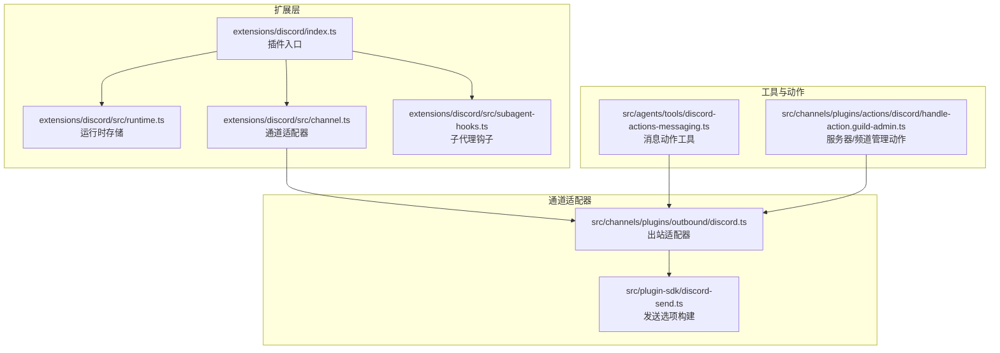
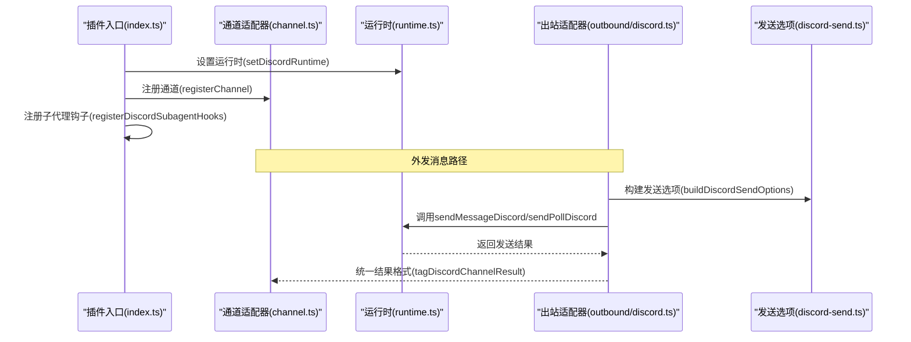
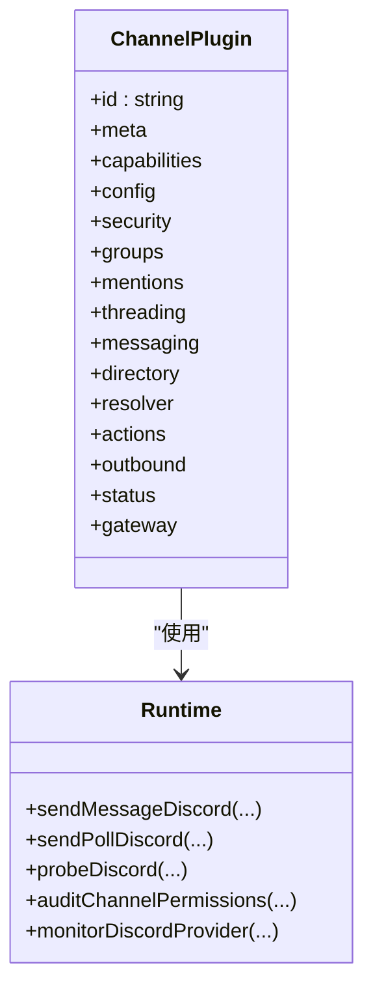
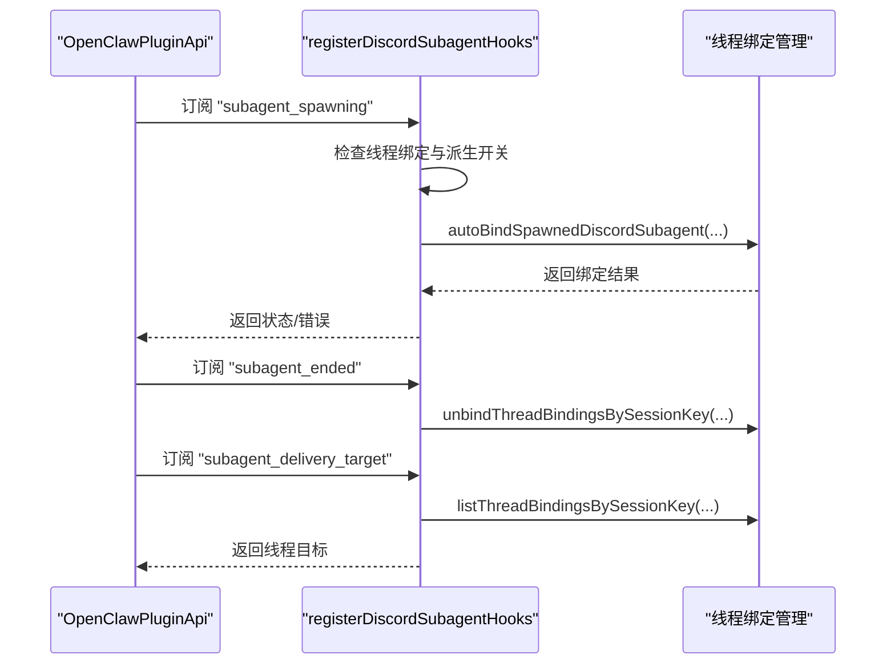
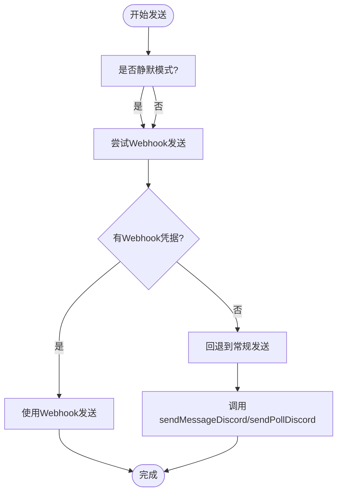
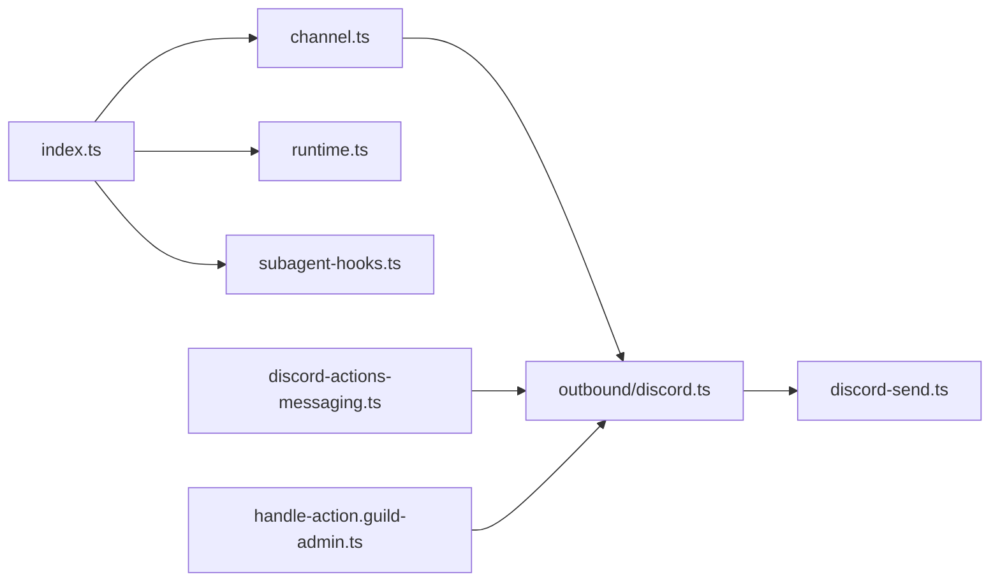

# Discord插件实现

<cite>
**本文引用的文件**
- [extensions/discord/index.ts](file://extensions/discord/index.ts)
- [extensions/discord/openclaw.plugin.json](file://extensions/discord/openclaw.plugin.json)
- [extensions/discord/src/channel.ts](file://extensions/discord/src/channel.ts)
- [extensions/discord/src/runtime.ts](file://extensions/discord/src/runtime.ts)
- [extensions/discord/src/subagent-hooks.ts](file://extensions/discord/src/subagent-hooks.ts)
- [src/channels/plugins/outbound/discord.ts](file://src/channels/plugins/outbound/discord.ts)
- [src/plugin-sdk/discord-send.ts](file://src/plugin-sdk/discord-send.ts)
- [src/agents/tools/discord-actions-messaging.ts](file://src/agents/tools/discord-actions-messaging.ts)
- [src/channels/plugins/actions/discord/handle-action.guild-admin.ts](file://src/channels/plugins/actions/discord/handle-action.guild-admin.ts)
- [src/discord/monitor/message-handler.test-helpers.ts](file://src/discord/monitor/message-handler.test-helpers.ts)
</cite>

## 目录
1. [简介](#简介)
2. [项目结构](#项目结构)
3. [核心组件](#核心组件)
4. [架构总览](#架构总览)
5. [详细组件分析](#详细组件分析)
6. [依赖关系分析](#依赖关系分析)
7. [性能考量](#性能考量)
8. [故障排查指南](#故障排查指南)
9. [结论](#结论)
10. [附录](#附录)

## 简介
本文件面向OpenClaw的Discord插件实现，系统性阐述其与Discord API的集成架构与运行机制，覆盖WebSocket事件监听、消息处理、服务器/频道管理、角色权限、嵌入消息与附件处理、OAuth2认证流程、Bot令牌配置与权限范围、消息与速率限制、缓存策略以及最佳实践。文档以“可操作”的方式组织内容，既适合开发者深入理解实现细节，也便于非技术读者把握整体架构。

## 项目结构
OpenClaw通过“扩展”（extension）机制为各渠道（如Discord）提供统一的插件接口。Discord插件位于extensions目录下，核心入口负责注册插件、通道适配器与运行时；通道适配器定义了消息发送、目标解析、权限审计、状态监控等能力；运行时存储负责在插件生命周期内共享底层SDK能力；子代理钩子负责线程绑定与会话生命周期管理；出站适配器负责实际的消息发送与Webhook优先投递。

图表来源
- [extensions/discord/index.ts:1-20](file://extensions/discord/index.ts#L1-L20)
- [extensions/discord/src/runtime.ts:1-7](file://extensions/discord/src/runtime.ts#L1-L7)
- [extensions/discord/src/channel.ts:74-463](file://extensions/discord/src/channel.ts#L74-L463)
- [extensions/discord/src/subagent-hooks.ts:19-153](file://extensions/discord/src/subagent-hooks.ts#L19-L153)
- [src/channels/plugins/outbound/discord.ts:81-148](file://src/channels/plugins/outbound/discord.ts#L81-L148)
- [src/plugin-sdk/discord-send.ts:14-34](file://src/plugin-sdk/discord-send.ts#L14-L34)
- [src/agents/tools/discord-actions-messaging.ts:318-357](file://src/agents/tools/discord-actions-messaging.ts#L318-L357)
- [src/channels/plugins/actions/discord/handle-action.guild-admin.ts:132-178](file://src/channels/plugins/actions/discord/handle-action.guild-admin.ts#L132-L178)

章节来源
- [extensions/discord/index.ts:1-20](file://extensions/discord/index.ts#L1-L20)
- [extensions/discord/src/channel.ts:74-463](file://extensions/discord/src/channel.ts#L74-L463)
- [extensions/discord/src/runtime.ts:1-7](file://extensions/discord/src/runtime.ts#L1-L7)
- [extensions/discord/src/subagent-hooks.ts:19-153](file://extensions/discord/src/subagent-hooks.ts#L19-L153)
- [src/channels/plugins/outbound/discord.ts:81-148](file://src/channels/plugins/outbound/discord.ts#L81-L148)
- [src/plugin-sdk/discord-send.ts:14-34](file://src/plugin-sdk/discord-send.ts#L14-L34)
- [src/agents/tools/discord-actions-messaging.ts:318-357](file://src/agents/tools/discord-actions-messaging.ts#L318-L357)
- [src/channels/plugins/actions/discord/handle-action.guild-admin.ts:132-178](file://src/channels/plugins/actions/discord/handle-action.guild-admin.ts#L132-L178)

## 核心组件
- 插件入口：注册通道、设置运行时、注册子代理钩子。
- 通道适配器：定义消息能力、目标解析、安全策略、目录查询、解析器、动作、出站发送、状态与网关启动。
- 运行时存储：全局保存Discord运行时能力（消息发送、探测、权限审计、监控等）。
- 子代理钩子：在子代理会话创建/结束/交付目标阶段进行线程绑定与路由。
- 出站适配器：统一文本/媒体/投票发送，支持Webhook优先投递与线程目标解析。
- 发送选项构建：标准化发送参数（回复、静默、媒体、账户ID等）。

章节来源
- [extensions/discord/index.ts:7-17](file://extensions/discord/index.ts#L7-L17)
- [extensions/discord/src/channel.ts:74-463](file://extensions/discord/src/channel.ts#L74-L463)
- [extensions/discord/src/runtime.ts:4-6](file://extensions/discord/src/runtime.ts#L4-L6)
- [extensions/discord/src/subagent-hooks.ts:19-153](file://extensions/discord/src/subagent-hooks.ts#L19-L153)
- [src/channels/plugins/outbound/discord.ts:81-148](file://src/channels/plugins/outbound/discord.ts#L81-L148)
- [src/plugin-sdk/discord-send.ts:14-34](file://src/plugin-sdk/discord-send.ts#L14-L34)

## 架构总览
OpenClaw的Discord插件采用“插件+通道适配器+运行时”的分层设计。插件入口负责装配，通道适配器集中定义能力边界，运行时承载底层SDK能力，出站适配器封装发送细节，子代理钩子保障线程化会话的连贯性。

图表来源
- [extensions/discord/index.ts:12-16](file://extensions/discord/index.ts#L12-L16)
- [extensions/discord/src/runtime.ts:4-6](file://extensions/discord/src/runtime.ts#L4-L6)
- [extensions/discord/src/channel.ts:296-342](file://extensions/discord/src/channel.ts#L296-L342)
- [src/channels/plugins/outbound/discord.ts:87-146](file://src/channels/plugins/outbound/discord.ts#L87-L146)
- [src/plugin-sdk/discord-send.ts:14-33](file://src/plugin-sdk/discord-send.ts#L14-L33)

## 详细组件分析

### 插件入口与注册
- 插件ID、名称、描述与空配置模式由入口定义。
- 注册通道适配器、设置运行时、注册子代理钩子。
- 配置模式与清单文件声明支持的通道类型与空配置。

章节来源
- [extensions/discord/index.ts:7-17](file://extensions/discord/index.ts#L7-L17)
- [extensions/discord/openclaw.plugin.json:1-10](file://extensions/discord/openclaw.plugin.json#L1-L10)

### 通道适配器（ChannelPlugin）
- 元数据与引导：包含聊天类型、投票、反应、线程、媒体、原生命令等能力开关。
- 配置与安全：构建通道配置模式、账户级DM策略、组策略警告收集、提及剥离规则、回帖模式解析。
- 解析与目录：目标规范化、用户/群组解析器、在线目录查询。
- 动作：消息动作列表、提取与处理。
- 出站：文本/媒体/投票发送，目标解析与静默发送支持。
- 状态与网关：默认状态快照、问题收集、摘要构建、探测与权限审计、启动监控。

图表来源
- [extensions/discord/src/channel.ts:74-463](file://extensions/discord/src/channel.ts#L74-L463)
- [extensions/discord/src/runtime.ts:4-6](file://extensions/discord/src/runtime.ts#L4-L6)

章节来源
- [extensions/discord/src/channel.ts:74-463](file://extensions/discord/src/channel.ts#L74-L463)

### 运行时存储
- 提供全局运行时存储，确保插件在不同模块间共享底层能力（消息发送、监控、探测、审计等）。
- 初始化时抛出未初始化错误，避免空引用。

章节来源
- [extensions/discord/src/runtime.ts:4-6](file://extensions/discord/src/runtime.ts#L4-L6)

### 子代理钩子（Subagent Hooks）
- 在子代理“生成前/结束后/交付目标”三个生命周期事件中执行线程绑定与路由决策。
- 支持按账户/全局启用线程绑定与自动派生子代理会话。
- 若无法绑定或线程绑定被禁用，返回明确错误信息。

图表来源
- [extensions/discord/src/subagent-hooks.ts:41-151](file://extensions/discord/src/subagent-hooks.ts#L41-L151)

章节来源
- [extensions/discord/src/subagent-hooks.ts:19-153](file://extensions/discord/src/subagent-hooks.ts#L19-L153)

### 出站适配器（Outbound Adapter）
- 目标解析：支持普通频道与线程目标（channel:threadId）。
- Webhook优先：若线程已绑定Webhook凭据，则优先使用Webhook发送文本。
- 文本/媒体/投票：统一封装发送逻辑，支持回复、静默、媒体URL与本地根目录、账户ID。
- 结果标签：统一为“channel: discord”并返回消息ID与频道ID。

图表来源
- [src/channels/plugins/outbound/discord.ts:87-146](file://src/channels/plugins/outbound/discord.ts#L87-L146)

章节来源
- [src/channels/plugins/outbound/discord.ts:81-148](file://src/channels/plugins/outbound/discord.ts#L81-L148)
- [src/plugin-sdk/discord-send.ts:14-33](file://src/plugin-sdk/discord-send.ts#L14-L33)

### 消息动作与服务器/频道管理
- 消息动作工具：支持发送、编辑、删除消息等动作，并根据配置开关控制可用性。
- 服务器/频道管理动作：支持频道信息、频道列表、创建频道等操作，参数校验与转发至底层动作处理器。

章节来源
- [src/agents/tools/discord-actions-messaging.ts:318-357](file://src/agents/tools/discord-actions-messaging.ts#L318-L357)
- [src/channels/plugins/actions/discord/handle-action.guild-admin.ts:132-178](file://src/channels/plugins/actions/discord/handle-action.guild-admin.ts#L132-L178)

### WebSocket事件监听与消息处理
- 测试辅助函数提供预检上下文，包含消息与频道ID、会话键等，便于事件驱动的处理链路测试。
- 实际事件监听与处理由底层运行时与监控器负责，通道适配器通过“网关启动”进入监控循环。

章节来源
- [src/discord/monitor/message-handler.test-helpers.ts:55-76](file://src/discord/monitor/message-handler.test-helpers.ts#L55-L76)
- [extensions/discord/src/channel.ts:416-461](file://extensions/discord/src/channel.ts#L416-L461)

## 依赖关系分析
- 插件入口依赖通道适配器与运行时存储。
- 通道适配器依赖运行时能力（消息发送、探测、审计、监控）。
- 出站适配器依赖通道适配器的目标解析与运行时发送能力。
- 子代理钩子依赖线程绑定管理与通道适配器的账户解析。
- 工具与动作依赖通道适配器的动作处理链路。

图表来源
- [extensions/discord/index.ts:12-16](file://extensions/discord/index.ts#L12-L16)
- [extensions/discord/src/channel.ts:296-342](file://extensions/discord/src/channel.ts#L296-L342)
- [extensions/discord/src/runtime.ts:4-6](file://extensions/discord/src/runtime.ts#L4-L6)
- [extensions/discord/src/subagent-hooks.ts:41-151](file://extensions/discord/src/subagent-hooks.ts#L41-L151)
- [src/channels/plugins/outbound/discord.ts:87-146](file://src/channels/plugins/outbound/discord.ts#L87-L146)
- [src/plugin-sdk/discord-send.ts:14-33](file://src/plugin-sdk/discord-send.ts#L14-L33)
- [src/agents/tools/discord-actions-messaging.ts:318-357](file://src/agents/tools/discord-actions-messaging.ts#L318-L357)
- [src/channels/plugins/actions/discord/handle-action.guild-admin.ts:132-178](file://src/channels/plugins/actions/discord/handle-action.guild-admin.ts#L132-L178)

章节来源
- [extensions/discord/index.ts:12-16](file://extensions/discord/index.ts#L12-L16)
- [extensions/discord/src/channel.ts:296-342](file://extensions/discord/src/channel.ts#L296-L342)
- [extensions/discord/src/runtime.ts:4-6](file://extensions/discord/src/runtime.ts#L4-L6)
- [extensions/discord/src/subagent-hooks.ts:41-151](file://extensions/discord/src/subagent-hooks.ts#L41-L151)
- [src/channels/plugins/outbound/discord.ts:87-146](file://src/channels/plugins/outbound/discord.ts#L87-L146)
- [src/plugin-sdk/discord-send.ts:14-33](file://src/plugin-sdk/discord-send.ts#L14-L33)
- [src/agents/tools/discord-actions-messaging.ts:318-357](file://src/agents/tools/discord-actions-messaging.ts#L318-L357)
- [src/channels/plugins/actions/discord/handle-action.guild-admin.ts:132-178](file://src/channels/plugins/actions/discord/handle-action.guild-admin.ts#L132-L178)

## 性能考量
- 文本分块与投票选项上限：出站适配器设置文本分块上限与投票最大选项数，避免单次请求过大。
- 流式输出合并：通道适配器提供流式合并阈值（字符数与空闲时间），平衡实时性与网络开销。
- Webhook优先：在具备线程Webhook凭据时优先使用Webhook发送，降低主通道压力并提升一致性。
- 缓存策略：通道适配器提供“按配置前缀重载”，便于在配置变更后快速生效，减少重启成本。

章节来源
- [extensions/discord/src/channel.ts:98-101](file://extensions/discord/src/channel.ts#L98-L101)
- [src/channels/plugins/outbound/discord.ts:82-86](file://src/channels/plugins/outbound/discord.ts#L82-L86)

## 故障排查指南
- 令牌与环境变量：默认账户可使用环境变量注入令牌，其他账户必须显式提供令牌；否则解析器返回缺失令牌提示。
- 权限与意图：启动时探测消息内容意图状态，若禁用可能无法响应普通消息；建议开启或改为“需提及”模式。
- 线程绑定：若线程绑定或子代理派生被禁用，将返回明确错误；检查账户/全局线程绑定配置。
- 审计与问题：使用状态审计收集未解析频道数量与权限问题，结合日志定位具体频道与权限不足项。

章节来源
- [extensions/discord/src/channel.ts:240-248](file://extensions/discord/src/channel.ts#L240-L248)
- [extensions/discord/src/channel.ts:434-443](file://extensions/discord/src/channel.ts#L434-L443)
- [extensions/discord/src/subagent-hooks.ts:52-65](file://extensions/discord/src/subagent-hooks.ts#L52-L65)
- [extensions/discord/src/channel.ts:363-388](file://extensions/discord/src/channel.ts#L363-L388)

## 结论
OpenClaw的Discord插件通过清晰的分层设计与统一的通道适配器，实现了对Discord API的稳定集成。其特性覆盖消息发送、线程化会话、服务器/频道管理、权限审计与意图探测，并提供Webhook优先发送与流式合并优化。配合完善的配置与诊断能力，可在生产环境中可靠运行。

## 附录

### OAuth2认证流程与Bot令牌配置
- Bot令牌：通过通道设置应用令牌，支持环境变量注入（仅默认账户）。
- 权限范围：由运行时探测应用与机器人信息，结合权限审计确定可用范围。
- 最佳实践：为默认账户启用令牌注入，为多账户场景显式配置令牌；开启消息内容意图或改为“需提及”模式以保证响应能力。

章节来源
- [extensions/discord/src/channel.ts:240-248](file://extensions/discord/src/channel.ts#L240-L248)
- [extensions/discord/src/channel.ts:419-449](file://extensions/discord/src/channel.ts#L419-L449)
- [extensions/discord/src/channel.ts:363-388](file://extensions/discord/src/channel.ts#L363-L388)

### 服务器管理与角色权限
- 服务器/频道管理：通过动作工具与通道动作适配器实现频道信息、列表与创建等操作。
- 角色权限：结合组策略与目录查询，支持基于服务器/频道的访问控制与工具策略解析。

章节来源
- [src/channels/plugins/actions/discord/handle-action.guild-admin.ts:132-178](file://src/channels/plugins/actions/discord/handle-action.guild-admin.ts#L132-L178)
- [extensions/discord/src/channel.ts:158-161](file://extensions/discord/src/channel.ts#L158-L161)

### 嵌入消息与附件处理
- 嵌入消息：通道适配器在消息动作中支持组件与表单等高级能力。
- 附件处理：出站适配器支持媒体URL与本地根目录，统一发送选项构建。

章节来源
- [extensions/discord/src/channel.ts:168-173](file://extensions/discord/src/channel.ts#L168-L173)
- [src/channels/plugins/outbound/discord.ts:114-138](file://src/channels/plugins/outbound/discord.ts#L114-L138)
- [src/plugin-sdk/discord-send.ts:23-29](file://src/plugin-sdk/discord-send.ts#L23-L29)

### 消息限制、速率限制与缓存策略
- 消息限制：文本分块上限与投票选项上限由适配器设定。
- 速率限制：通过流式合并与Webhook优先策略降低突发流量。
- 缓存策略：按配置前缀重载，快速生效新配置。

章节来源
- [src/channels/plugins/outbound/discord.ts:82-86](file://src/channels/plugins/outbound/discord.ts#L82-L86)
- [extensions/discord/src/channel.ts:98-101](file://extensions/discord/src/channel.ts#L98-L101)
- [extensions/discord/src/channel.ts:101](file://extensions/discord/src/channel.ts#L101)