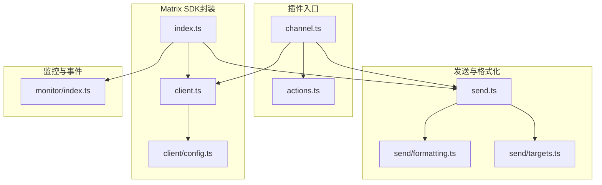
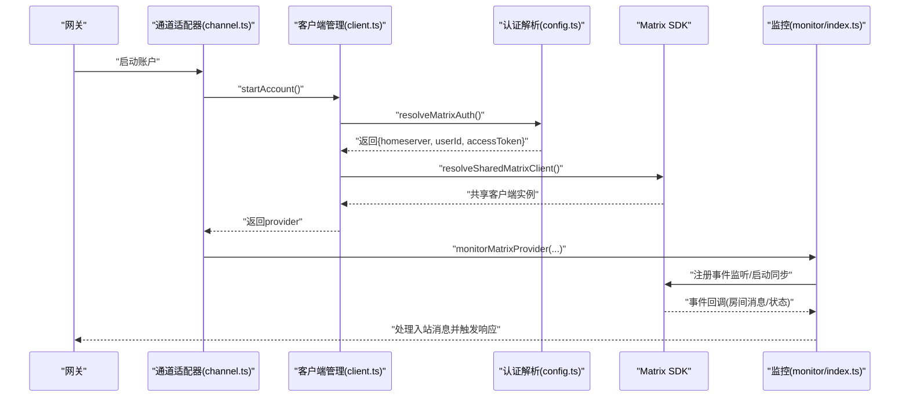
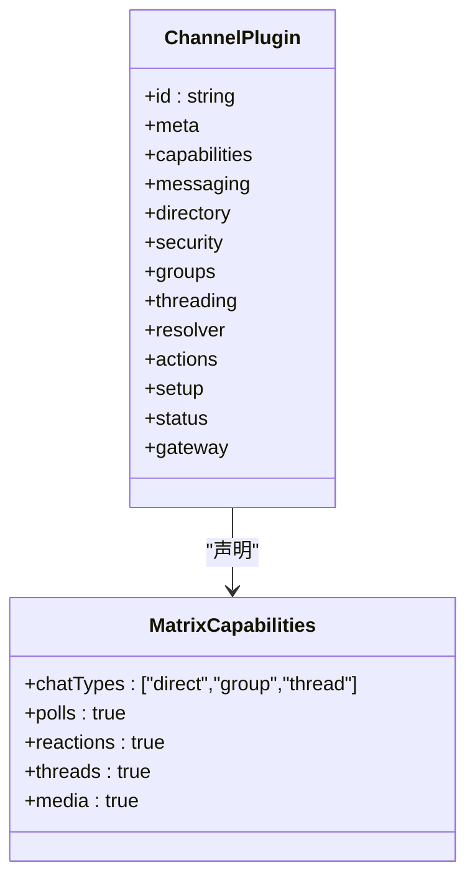
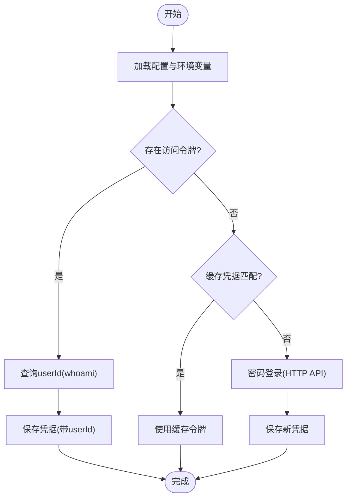
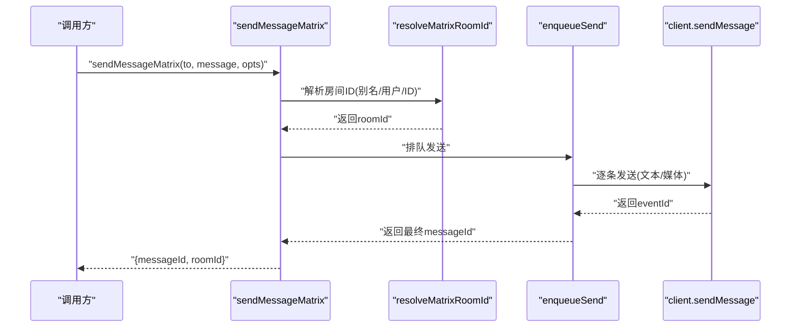
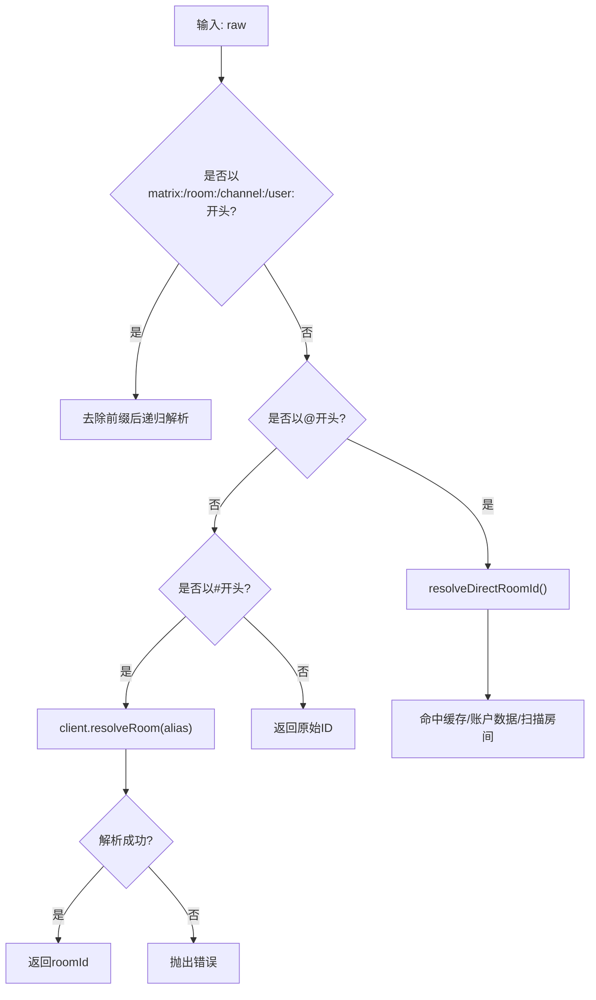
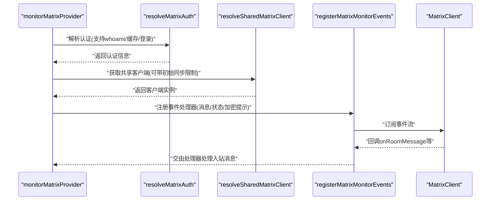
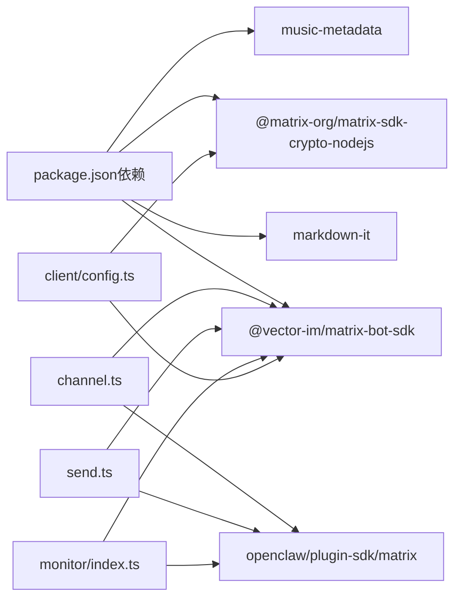

# Matrix插件实现

<cite>
**本文档引用的文件**
- [extensions/matrix/openclaw.plugin.json](file://extensions/matrix/openclaw.plugin.json)
- [extensions/matrix/package.json](file://extensions/matrix/package.json)
- [extensions/matrix/src/channel.ts](file://extensions/matrix/src/channel.ts)
- [extensions/matrix/src/actions.ts](file://extensions/matrix/src/actions.ts)
- [extensions/matrix/src/matrix/index.ts](file://extensions/matrix/src/matrix/index.ts)
- [extensions/matrix/src/matrix/client.ts](file://extensions/matrix/src/matrix/client.ts)
- [extensions/matrix/src/matrix/send.ts](file://extensions/matrix/src/matrix/send.ts)
- [extensions/matrix/src/matrix/actions.ts](file://extensions/matrix/src/matrix/actions.ts)
- [extensions/matrix/src/matrix/monitor/index.ts](file://extensions/matrix/src/matrix/monitor/index.ts)
- [extensions/matrix/src/matrix/client/config.ts](file://extensions/matrix/src/matrix/client/config.ts)
- [extensions/matrix/src/matrix/send/formatting.ts](file://extensions/matrix/src/matrix/send/formatting.ts)
- [extensions/matrix/src/matrix/send/targets.ts](file://extensions/matrix/src/matrix/send/targets.ts)
</cite>

## 目录
1. [简介](#简介)
2. [项目结构](#项目结构)
3. [核心组件](#核心组件)
4. [架构总览](#架构总览)
5. [详细组件分析](#详细组件分析)
6. [依赖关系分析](#依赖关系分析)
7. [性能考量](#性能考量)
8. [故障排除指南](#故障排除指南)
9. [结论](#结论)
10. [附录](#附录)

## 简介
本指南面向在OpenClaw中实现Matrix插件的开发者，系统性阐述Matrix协议的集成方式与实现细节，覆盖以下方面：
- 客户端-服务器API与认证流程（含访问令牌管理与homeserver配置）
- 同步API与增量同步策略（初始同步限制与运行时同步）
- 房间管理机制（房间解析、别名解析、直接聊天室发现）
- Matrix特有能力：加密消息、房间别名、成员管理、主题变更、反应与投票
- 消息回溯与线程回复模式
- 安全最佳实践与客户端配置建议

## 项目结构
Matrix插件位于extensions/matrix目录，采用按功能域分层的组织方式：
- 插件入口与通道适配：src/channel.ts、src/actions.ts
- Matrix SDK封装与客户端管理：src/matrix/client.ts、src/matrix/index.ts
- 发送与格式化：src/matrix/send.ts、src/matrix/send/formatting.ts、src/matrix/send/targets.ts
- 监控与事件处理：src/matrix/monitor/index.ts
- 配置与凭据：src/matrix/client/config.ts
- 包与元数据：package.json、openclaw.plugin.json

**图表来源**
- [extensions/matrix/src/channel.ts:132-462](file://extensions/matrix/src/channel.ts#L132-L462)
- [extensions/matrix/src/matrix/index.ts:1-12](file://extensions/matrix/src/matrix/index.ts#L1-L12)
- [extensions/matrix/src/matrix/client.ts:1-15](file://extensions/matrix/src/matrix/client.ts#L1-L15)
- [extensions/matrix/src/matrix/send.ts:37-268](file://extensions/matrix/src/matrix/send.ts#L37-L268)
- [extensions/matrix/src/matrix/monitor/index.ts:233-415](file://extensions/matrix/src/matrix/monitor/index.ts#L233-L415)

**章节来源**
- [extensions/matrix/package.json:1-42](file://extensions/matrix/package.json#L1-L42)
- [extensions/matrix/openclaw.plugin.json:1-10](file://extensions/matrix/openclaw.plugin.json#L1-L10)

## 核心组件
- 通道插件适配器：定义Matrix通道能力、目标解析、目录查询、安全策略、线程模式、状态探测等。
- 客户端与认证：统一解析homeserver、用户ID、访问令牌或密码登录，缓存与刷新凭据，支持多账户配置。
- 发送管线：文本分块、Markdown到HTML转换、媒体上传与加密、线程/回复关系构建、投票事件发送。
- 监控与事件：监听房间事件、处理入站消息、自动加入房间、设备加密验证提示、增量同步与启动宽限。

**章节来源**
- [extensions/matrix/src/channel.ts:132-462](file://extensions/matrix/src/channel.ts#L132-L462)
- [extensions/matrix/src/matrix/client/config.ts:103-246](file://extensions/matrix/src/matrix/client/config.ts#L103-L246)
- [extensions/matrix/src/matrix/send.ts:37-268](file://extensions/matrix/src/matrix/send.ts#L37-L268)
- [extensions/matrix/src/matrix/monitor/index.ts:233-415](file://extensions/matrix/src/matrix/monitor/index.ts#L233-L415)

## 架构总览
下图展示从通道适配器到SDK调用的关键路径，以及认证与发送流程：

**图表来源**
- [extensions/matrix/src/channel.ts:417-461](file://extensions/matrix/src/channel.ts#L417-L461)
- [extensions/matrix/src/matrix/client.ts:1-15](file://extensions/matrix/src/matrix/client.ts#L1-L15)
- [extensions/matrix/src/matrix/client/config.ts:103-246](file://extensions/matrix/src/matrix/client/config.ts#L103-L246)
- [extensions/matrix/src/matrix/monitor/index.ts:233-415](file://extensions/matrix/src/matrix/monitor/index.ts#L233-L415)

## 详细组件分析

### 通道适配器与能力声明
- 能力：支持direct/group/thread聊天类型、投票、反应、线程、媒体。
- 目标解析：支持room:、channel:、user:前缀与Matrix ID/别名；提供提示字符串。
- 安全：DM策略解析、允许列表警告收集、组策略（开放/白名单）。
- 线程：根据上下文构建工具上下文，支持回复模式配置。
- 目录：动态列举用户与群组，支持实时查询。
- 动作：通过矩阵消息动作适配器暴露send/read/edit/delete/react/pin/list-pins等操作。

**图表来源**
- [extensions/matrix/src/channel.ts:143-217](file://extensions/matrix/src/channel.ts#L143-L217)

**章节来源**
- [extensions/matrix/src/channel.ts:132-462](file://extensions/matrix/src/channel.ts#L132-L462)

### 认证与访问令牌管理
- 配置解析：支持单账户与多账户配置合并，环境变量回退（MATRIX_*）。
- 凭据加载：优先使用已缓存的访问令牌；若无则通过密码登录获取并持久化。
- whoami校验：当提供访问令牌但未提供userId时，通过SDK查询并补全。
- 登录流程：向/_matrix/client/v3/login发起POST请求，保存返回的access_token与device_id。

**图表来源**
- [extensions/matrix/src/matrix/client/config.ts:103-246](file://extensions/matrix/src/matrix/client/config.ts#L103-L246)

**章节来源**
- [extensions/matrix/src/matrix/client/config.ts:103-246](file://extensions/matrix/src/matrix/client/config.ts#L103-L246)

### 发送管线与格式化
- 文本发送：Markdown转HTML，按限制分块，构建回复/线程关系，逐条发送。
- 媒体发送：加载Web媒体，按需加密上传，识别语音消息，补充图像信息，必要时追加文本块。
- 投票发送：构造m.poll.start事件，支持线程关联。
- 反应发送：构造m.reaction事件，基于被反应事件ID与emoji键。
- 读回执与打字指示：分别发送read receipt与typing状态。

**图表来源**
- [extensions/matrix/src/matrix/send.ts:37-158](file://extensions/matrix/src/matrix/send.ts#L37-L158)
- [extensions/matrix/src/matrix/send/targets.ts:124-151](file://extensions/matrix/src/matrix/send/targets.ts#L124-L151)

**章节来源**
- [extensions/matrix/src/matrix/send.ts:37-268](file://extensions/matrix/src/matrix/send.ts#L37-L268)
- [extensions/matrix/src/matrix/send/formatting.ts:16-94](file://extensions/matrix/src/matrix/send/formatting.ts#L16-L94)
- [extensions/matrix/src/matrix/send/targets.ts:124-151](file://extensions/matrix/src/matrix/send/targets.ts#L124-L151)

### 房间解析与别名处理
- 支持多种输入形式：matrix:、room:、channel:前缀，用户ID(@user:server)，房间别名(#alias:server)，纯ID。
- 用户ID解析：优先使用m.direct账户数据；若缺失，则扫描已加入房间，寻找与该用户匹配的1:1房间。
- 别名解析：通过client.resolveRoom进行解析，失败抛出错误。

**图表来源**
- [extensions/matrix/src/matrix/send/targets.ts:124-151](file://extensions/matrix/src/matrix/send/targets.ts#L124-L151)

**章节来源**
- [extensions/matrix/src/matrix/send/targets.ts:124-151](file://extensions/matrix/src/matrix/send/targets.ts#L124-L151)

### 监控与事件处理
- 运行时要求：Node运行时（不支持bun）。
- 配置解析：允许列表、房间配置、组策略、回复模式、线程回复策略、媒体大小限制。
- 启动流程：解析认证与配置，建立共享客户端，注册事件监听，自动加入房间，触发设备验证请求（若启用E2EE）。
- 增量同步：通过共享客户端维持长连接，结合initialSyncLimit控制初始拉取规模。

**图表来源**
- [extensions/matrix/src/matrix/monitor/index.ts:233-415](file://extensions/matrix/src/matrix/monitor/index.ts#L233-L415)
- [extensions/matrix/src/matrix/client/config.ts:103-246](file://extensions/matrix/src/matrix/client/config.ts#L103-L246)

**章节来源**
- [extensions/matrix/src/matrix/monitor/index.ts:233-415](file://extensions/matrix/src/matrix/monitor/index.ts#L233-L415)

### 矩阵特有能力实现要点
- 加密消息：启用encryption时，SDK会进行端到端加密；插件在登录后尝试请求自身用户验证。
- 房间别名：通过client.resolveRoom解析别名为房间ID。
- 成员管理：通过client.getJoinedRoomMembers获取成员列表，用于直接房间推断与显示名解析。
- 主题变更：通过Room对象的state事件监听主题变化（在监控事件注册中处理）。
- 反应与投票：发送Reaction与m.poll.start事件；支持删除/列出反应与投票结果查询。

**章节来源**
- [extensions/matrix/src/matrix/monitor/index.ts:333-356](file://extensions/matrix/src/matrix/monitor/index.ts#L333-L356)
- [extensions/matrix/src/matrix/send.ts:240-268](file://extensions/matrix/src/matrix/send.ts#L240-L268)
- [extensions/matrix/src/matrix/send.ts:160-197](file://extensions/matrix/src/matrix/send.ts#L160-L197)

## 依赖关系分析
- 外部SDK：@vector-im/matrix-bot-sdk用于客户端与事件处理；@matrix-org/matrix-sdk-crypto-nodejs用于端到端加密。
- 内部SDK：openclaw/plugin-sdk/matrix提供通道适配、运行时环境、文本处理、提及解析等通用能力。
- 工具库：markdown-it用于Markdown到HTML转换；music-metadata用于媒体元数据解析。

**图表来源**
- [extensions/matrix/package.json:6-13](file://extensions/matrix/package.json#L6-L13)
- [extensions/matrix/src/channel.ts:1-41](file://extensions/matrix/src/channel.ts#L1-L41)
- [extensions/matrix/src/matrix/send.ts:1-30](file://extensions/matrix/src/matrix/send.ts#L1-L30)
- [extensions/matrix/src/matrix/monitor/index.ts:1-28](file://extensions/matrix/src/matrix/monitor/index.ts#L1-L28)
- [extensions/matrix/src/matrix/client/config.ts:1-11](file://extensions/matrix/src/matrix/client/config.ts#L1-L11)

**章节来源**
- [extensions/matrix/package.json:6-13](file://extensions/matrix/package.json#L6-L13)

## 性能考量
- 初始同步限制：通过initialSyncLimit控制首次拉取的消息数量，避免启动时过量内存占用。
- 发送队列：enqueueSend确保同一房间内消息串行发送，减少速率限制与并发冲突。
- 缓存优化：m.direct房间ID缓存，避免重复扫描已加入房间；媒体最大字节限制防止超大文件。
- 文本分块：按Markdown表格模式与文本块限制分片发送，兼顾兼容性与长度约束。
- 增量同步：共享客户端常驻，事件驱动处理，降低轮询开销。

[本节为通用指导，无需具体文件引用]

## 故障排除指南
- 认证失败
  - 确认homeserver、userId、accessToken或password配置正确。
  - 若仅提供访问令牌但未提供userId，系统会通过whoami自动补全并保存。
  - 若使用密码登录，检查/_matrix/client/v3/login返回内容与网络连通性。
- 房间解析失败
  - 别名解析失败：确认别名格式(#alias:server)与权限。
  - 直接房间缺失：检查m.direct账户数据或是否存在与目标用户匹配的1:1房间。
- 运行时错误
  - Node运行时要求：确保在Node环境中运行，避免bun运行时。
  - 设备验证：启用E2EE时，可在其他客户端确认验证请求。
- 媒体发送异常
  - 检查媒体大小限制与内容类型；对语音消息进行兼容性判断。
  - 确认加密上传流程与文件对象完整性。

**章节来源**
- [extensions/matrix/src/matrix/client/config.ts:103-246](file://extensions/matrix/src/matrix/client/config.ts#L103-L246)
- [extensions/matrix/src/matrix/send/targets.ts:124-151](file://extensions/matrix/src/matrix/send/targets.ts#L124-L151)
- [extensions/matrix/src/matrix/monitor/index.ts:233-415](file://extensions/matrix/src/matrix/monitor/index.ts#L233-L415)

## 结论
本实现通过清晰的模块划分与严格的职责边界，将Matrix协议的复杂性封装在客户端管理、发送管线与监控事件三大支柱之下。认证流程支持访问令牌与密码两种模式，并具备凭据缓存与刷新能力；发送管线兼顾文本、媒体与线程/回复关系；监控模块提供增量同步与事件驱动的高效处理。配合安全策略与多账户配置，能够满足生产级部署的安全与性能需求。

[本节为总结性内容，无需具体文件引用]

## 附录

### 配置项与环境变量
- 单账户配置键：homeserver、userId、accessToken、password、deviceName、initialSyncLimit、encryption、dm、actions、groups/rooms、replyToMode、threadReplies、mediaMaxMb、groupPolicy、allowlistOnly、groupAllowFrom、dm.policy、dm.allowFrom。
- 多账户配置键：accounts.<accountId>下同上，支持部分覆盖。
- 环境变量回退：MATRIX_HOMESERVER、MATRIX_USER_ID、MATRIX_ACCESS_TOKEN、MATRIX_PASSWORD、MATRIX_DEVICE_NAME。

**章节来源**
- [extensions/matrix/src/matrix/client/config.ts:36-91](file://extensions/matrix/src/matrix/client/config.ts#L36-L91)

### 最佳实践
- homeserver选择：优先选择稳定、低延迟且支持所需功能的公共或私有homeserver。
- 访问令牌管理：尽量使用短期令牌并定期轮换；在CI/CD中通过受控渠道注入。
- 加密启用：建议开启E2EE并完成设备验证；对敏感房间启用严格成员策略。
- 同步策略：合理设置initialSyncLimit，避免启动风暴；在高负载场景下分账户运行。
- 目标解析：优先使用完整Matrix ID；对别名与用户ID进行预解析与缓存。

[本节为通用指导，无需具体文件引用]