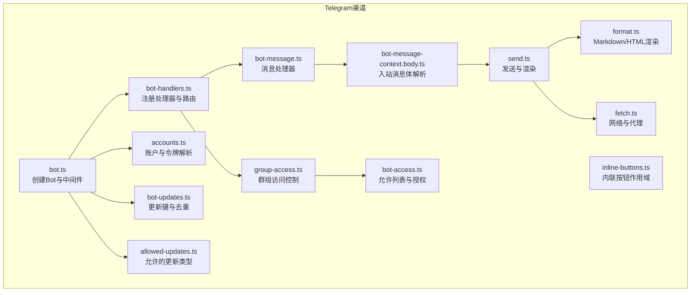
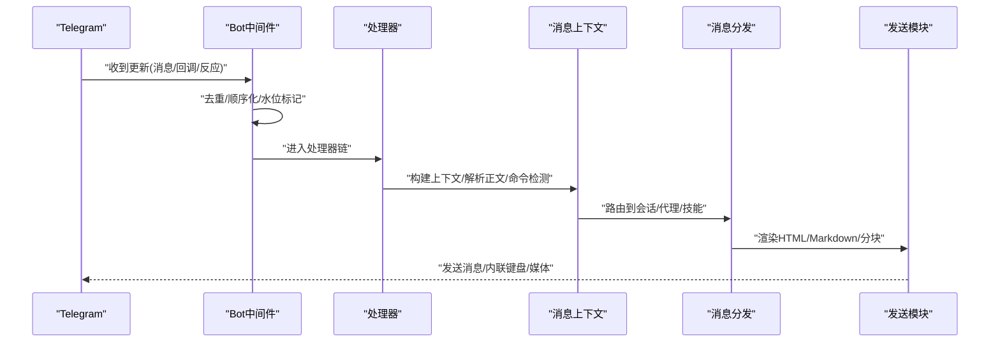
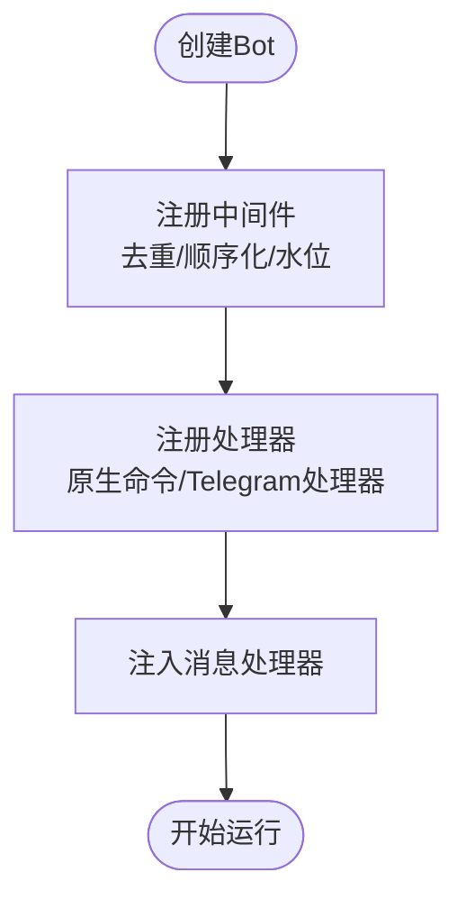
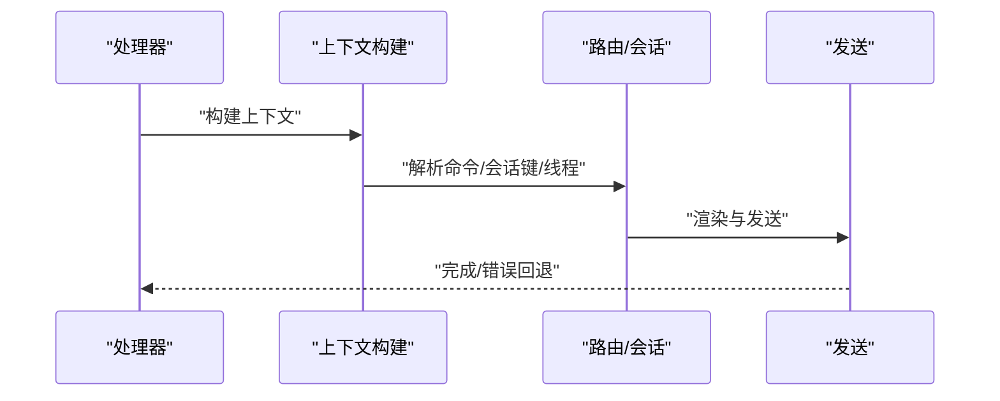
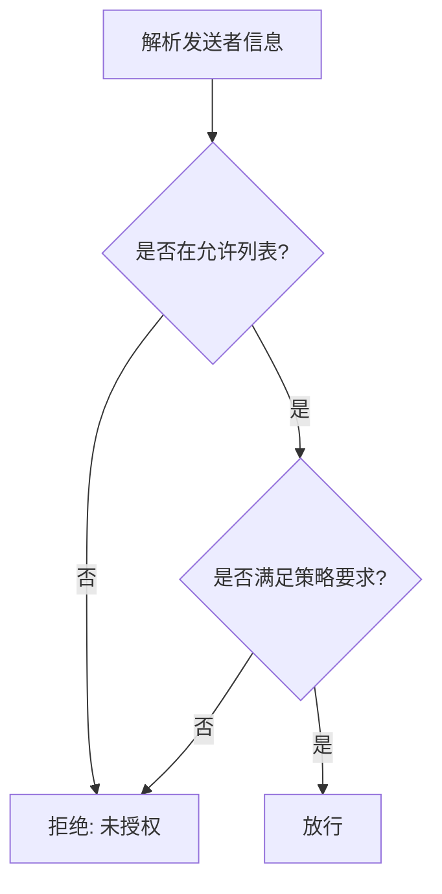
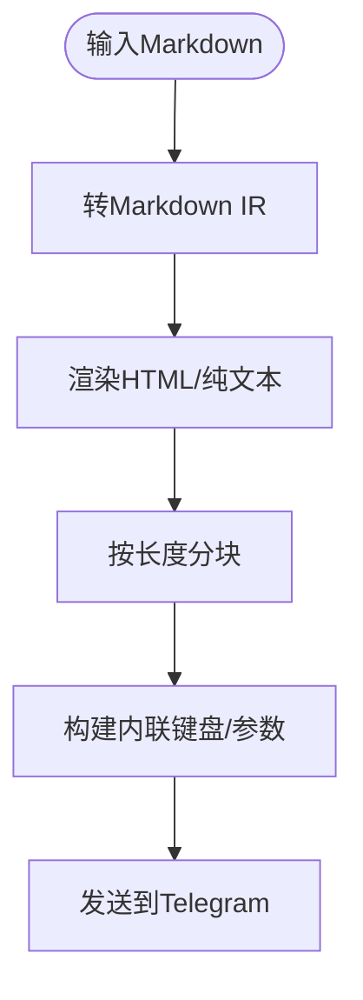
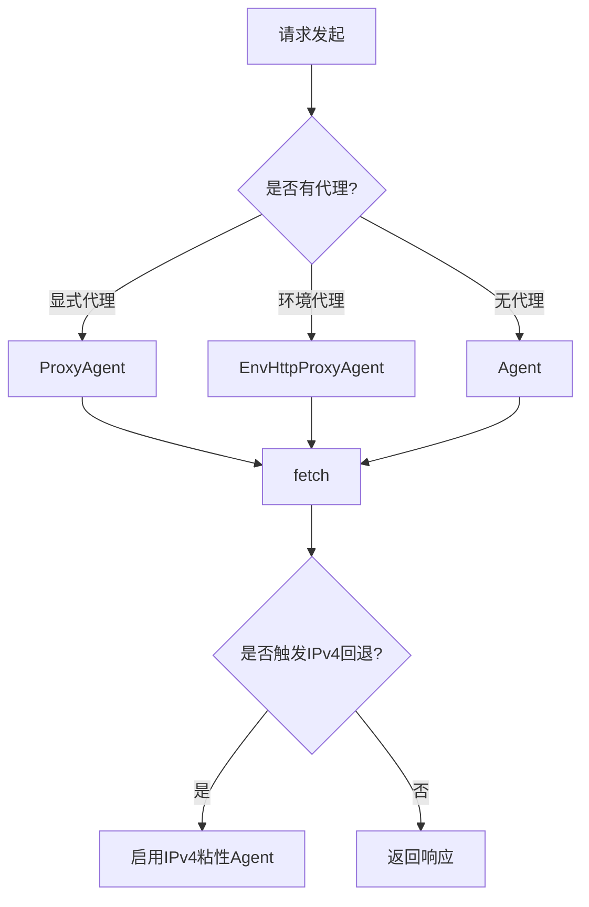
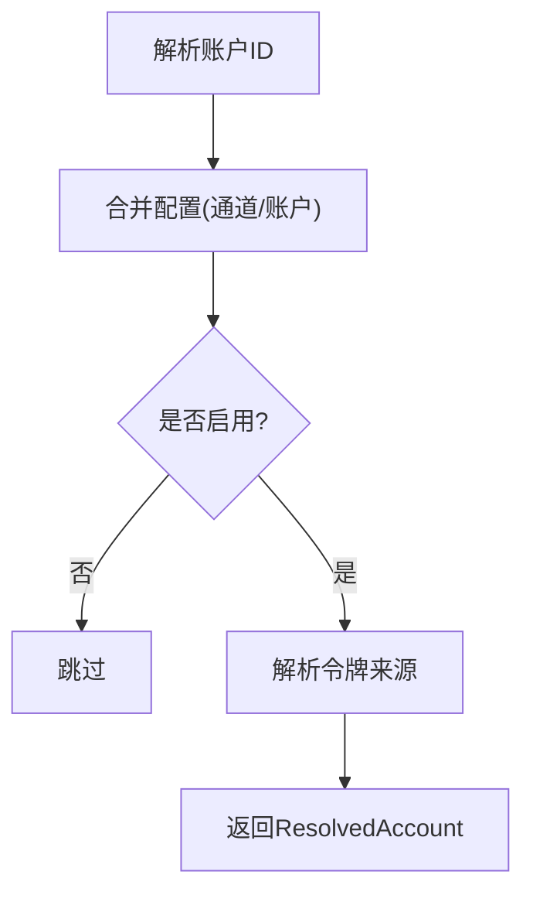
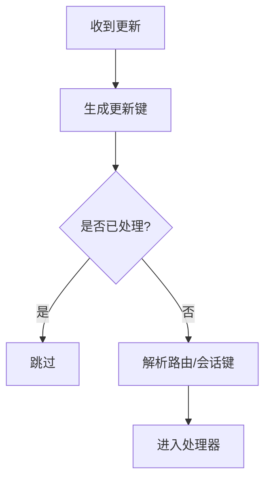
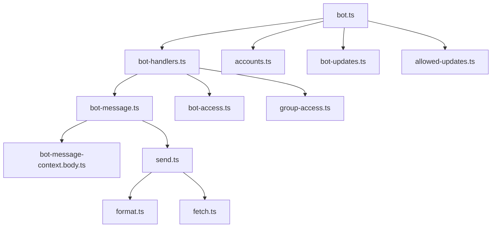

# Telegram插件实现

<cite>
**本文档引用的文件**
- [extensions/telegram/openclaw.plugin.json](file://extensions/telegram/openclaw.plugin.json)
- [src/telegram/bot.ts](file://src/telegram/bot.ts)
- [src/telegram/bot-handlers.ts](file://src/telegram/bot-handlers.ts)
- [src/telegram/bot-access.ts](file://src/telegram/bot-access.ts)
- [src/telegram/bot-message-context.body.ts](file://src/telegram/bot-message-context.body.ts)
- [src/telegram/allowed-updates.ts](file://src/telegram/allowed-updates.ts)
- [src/telegram/bot-updates.ts](file://src/telegram/bot-updates.ts)
- [src/telegram/send.ts](file://src/telegram/send.ts)
- [src/telegram/group-access.ts](file://src/telegram/group-access.ts)
- [src/telegram/inline-buttons.ts](file://src/telegram/inline-buttons.ts)
- [src/telegram/format.ts](file://src/telegram/format.ts)
- [src/telegram/caption.ts](file://src/telegram/caption.ts)
- [src/telegram/fetch.ts](file://src/telegram/fetch.ts)
- [src/telegram/accounts.ts](file://src/telegram/accounts.ts)
- [src/telegram/bot-message.ts](file://src/telegram/bot-message.ts)
</cite>

## 目录
1. [简介](#简介)
2. [项目结构](#项目结构)
3. [核心组件](#核心组件)
4. [架构总览](#架构总览)
5. [详细组件分析](#详细组件分析)
6. [依赖关系分析](#依赖关系分析)
7. [性能考虑](#性能考虑)
8. [故障排除指南](#故障排除指南)
9. [结论](#结论)
10. [附录](#附录)

## 简介
本技术指南面向在OpenClaw中实现Telegram渠道适配器的开发者，系统性阐述Telegram插件的架构设计与实现要点，覆盖Bot API集成、Webhook配置、消息路由、内联键盘、文件上传下载、频道订阅与群组管理、认证流程、API密钥管理、安全配置、消息格式转换与Markdown渲染、富文本支持、BotFather配置、Webhook URL设置与调试技巧等主题。

## 项目结构
Telegram插件位于`src/telegram/`目录下，采用按职责分层的模块化组织方式：
- 渠道入口与Bot实例：负责创建grammy Bot、注册中间件、处理更新去重与顺序化、注入消息处理器。
- 消息处理管线：从原始Telegram更新解析到上下文构建、授权校验、命令检测、会话路由、内容分片与发送。
- 安全与访问控制：允许列表、DM策略、群组策略、事件授权规则。
- 发送与渲染：HTML/Markdown渲染、富文本分块、内联键盘、媒体上传、链接预览控制。
- 网络与代理：自定义fetch封装、IPv4回退、DNS结果排序、环境代理兼容。
- 账户与令牌：账户解析、默认账户选择、令牌来源（环境变量、文件、配置）。

**图表来源**
- [src/telegram/bot.ts:71-462](file://src/telegram/bot.ts#L71-L462)
- [src/telegram/bot-handlers.ts:121-800](file://src/telegram/bot-handlers.ts#L121-L800)
- [src/telegram/bot-message.ts:27-107](file://src/telegram/bot-message.ts#L27-L107)
- [src/telegram/bot-message-context.body.ts:76-284](file://src/telegram/bot-message-context.body.ts#L76-L284)
- [src/telegram/send.ts:588-800](file://src/telegram/send.ts#L588-L800)
- [src/telegram/format.ts:110-242](file://src/telegram/format.ts#L110-L242)
- [src/telegram/group-access.ts:43-205](file://src/telegram/group-access.ts#L43-L205)
- [src/telegram/bot-access.ts:42-95](file://src/telegram/bot-access.ts#L42-L95)
- [src/telegram/inline-buttons.ts:43-67](file://src/telegram/inline-buttons.ts#L43-L67)
- [src/telegram/fetch.ts:332-424](file://src/telegram/fetch.ts#L332-L424)
- [src/telegram/accounts.ts:166-209](file://src/telegram/accounts.ts#L166-L209)
- [src/telegram/bot-updates.ts:32-68](file://src/telegram/bot-updates.ts#L32-L68)
- [src/telegram/allowed-updates.ts:5-14](file://src/telegram/allowed-updates.ts#L5-L14)

**章节来源**
- [src/telegram/bot.ts:71-462](file://src/telegram/bot.ts#L71-L462)
- [src/telegram/bot-handlers.ts:121-800](file://src/telegram/bot-handlers.ts#L121-L800)
- [src/telegram/bot-message.ts:27-107](file://src/telegram/bot-message.ts#L27-L107)
- [src/telegram/bot-message-context.body.ts:76-284](file://src/telegram/bot-message-context.body.ts#L76-L284)
- [src/telegram/send.ts:588-800](file://src/telegram/send.ts#L588-L800)
- [src/telegram/format.ts:110-242](file://src/telegram/format.ts#L110-L242)
- [src/telegram/group-access.ts:43-205](file://src/telegram/group-access.ts#L43-L205)
- [src/telegram/bot-access.ts:42-95](file://src/telegram/bot-access.ts#L42-L95)
- [src/telegram/inline-buttons.ts:43-67](file://src/telegram/inline-buttons.ts#L43-L67)
- [src/telegram/fetch.ts:332-424](file://src/telegram/fetch.ts#L332-L424)
- [src/telegram/accounts.ts:166-209](file://src/telegram/accounts.ts#L166-L209)
- [src/telegram/bot-updates.ts:32-68](file://src/telegram/bot-updates.ts#L32-L68)
- [src/telegram/allowed-updates.ts:5-14](file://src/telegram/allowed-updates.ts#L5-L14)

## 核心组件
- Bot实例与中间件
  - 创建grammy Bot，启用API限流与错误捕获，注入顺序执行与更新去重中间件，记录原始更新日志，注册消息处理器与原生命令。
- 消息处理器
  - 构建Telegram消息上下文，解析入站正文、提及检测、命令授权、历史记录、会话键与线程绑定，调用分发器执行后续动作。
- 访问控制
  - 允许列表归一化与匹配，DM策略与群组策略评估，事件授权规则（反应、回调作用域、回调允许列表）。
- 发送与渲染
  - HTML/Markdown渲染与分块，内联键盘构建，媒体上传与分段发送，链接预览控制，线程回复参数与回退逻辑。
- 网络与代理
  - 自定义fetch封装，自动选择IPv4/IPv6族、DNS结果排序、环境代理与显式代理支持、IPv4粘性回退。
- 账户与令牌
  - 多账户解析、默认账户选择、令牌来源优先级与安全存储。

**章节来源**
- [src/telegram/bot.ts:71-462](file://src/telegram/bot.ts#L71-L462)
- [src/telegram/bot-message.ts:27-107](file://src/telegram/bot-message.ts#L27-L107)
- [src/telegram/bot-access.ts:42-95](file://src/telegram/bot-access.ts#L42-L95)
- [src/telegram/group-access.ts:43-205](file://src/telegram/group-access.ts#L43-L205)
- [src/telegram/send.ts:588-800](file://src/telegram/send.ts#L588-L800)
- [src/telegram/format.ts:110-242](file://src/telegram/format.ts#L110-L242)
- [src/telegram/fetch.ts:332-424](file://src/telegram/fetch.ts#L332-L424)
- [src/telegram/accounts.ts:166-209](file://src/telegram/accounts.ts#L166-L209)

## 架构总览
Telegram插件以grammy为核心，围绕“更新接收—上下文构建—授权校验—命令与会话路由—内容渲染与发送”的流水线组织。Bot中间件负责全局去重、顺序化与水位标记；消息处理器负责将Telegram消息映射为OpenClaw内部上下文并分发执行；发送模块负责渲染与输出，同时处理线程、内联键盘、媒体与错误回退。

**图表来源**
- [src/telegram/bot.ts:221-279](file://src/telegram/bot.ts#L221-L279)
- [src/telegram/bot-handlers.ts:121-800](file://src/telegram/bot-handlers.ts#L121-L800)
- [src/telegram/bot-message.ts:51-107](file://src/telegram/bot-message.ts#L51-L107)
- [src/telegram/send.ts:588-800](file://src/telegram/send.ts#L588-L800)

## 详细组件分析

### Bot实例与中间件
- 中间件职责
  - 更新去重：基于update_id/message键缓存，避免重复处理。
  - 顺序化：按聊天或话题键串行执行，保证并发一致性。
  - 水位标记：持久化最高已完成update_id，避免重启后重复处理。
  - 原始更新日志：可选记录原始更新，便于调试。
- Bot配置
  - API限流、超时、自定义fetch（支持代理与IPv4回退）、长轮询中断信号。
- 注册处理器
  - 注册原生命令与Telegram处理器，注入消息处理器、线程绑定管理器、发送ChatAction回退器。

**图表来源**
- [src/telegram/bot.ts:163-239](file://src/telegram/bot.ts#L163-L239)
- [src/telegram/bot.ts:417-453](file://src/telegram/bot.ts#L417-L453)

**章节来源**
- [src/telegram/bot.ts:71-462](file://src/telegram/bot.ts#L71-L462)

### 消息处理管线
- 上下文构建
  - 解析消息正文、提及检测、命令授权、历史记录、线程绑定、会话键生成。
- 分发执行
  - 将上下文分发给代理、技能或内置命令，支持流式模式与文本长度限制。
- 错误回退
  - 处理失败时向用户发送友好提示，并记录错误。

**图表来源**
- [src/telegram/bot-message.ts:51-107](file://src/telegram/bot-message.ts#L51-L107)
- [src/telegram/bot-message-context.body.ts:76-284](file://src/telegram/bot-message-context.body.ts#L76-L284)

**章节来源**
- [src/telegram/bot-message.ts:27-107](file://src/telegram/bot-message.ts#L27-L107)
- [src/telegram/bot-message-context.body.ts:76-284](file://src/telegram/bot-message-context.body.ts#L76-L284)

### 访问控制与授权
- 允许列表
  - 归一化ID与通配符，校验无效条目并告警，支持合并多源允许列表。
- DM策略
  - 支持禁用、开放、配对三种策略，结合组配置覆盖。
- 群组策略
  - 支持禁用、开放、白名单策略，结合聊天允许列表与发送者匹配。
- 事件授权规则
  - 反应事件、回调作用域、回调允许列表三类规则，分别决定是否放行。

**图表来源**
- [src/telegram/bot-access.ts:42-95](file://src/telegram/bot-access.ts#L42-L95)
- [src/telegram/group-access.ts:43-205](file://src/telegram/group-access.ts#L43-L205)
- [src/telegram/bot-handlers.ts:612-743](file://src/telegram/bot-handlers.ts#L612-L743)

**章节来源**
- [src/telegram/bot-access.ts:42-95](file://src/telegram/bot-access.ts#L42-L95)
- [src/telegram/group-access.ts:43-205](file://src/telegram/group-access.ts#L43-L205)
- [src/telegram/bot-handlers.ts:612-743](file://src/telegram/bot-handlers.ts#L612-L743)

### 发送与渲染
- 渲染策略
  - Markdown转HTML，支持Spoiler、代码块、表格、链接等；自动包裹文件引用防止域名预览。
- 分块策略
  - HTML与纯文本双轨分块，确保标签闭合与实体边界安全；根据渲染长度动态分割。
- 内联键盘
  - 构建内联键盘markup，支持样式与回调数据。
- 媒体与回复
  - 支持视频注、语音消息、链接预览开关、线程回复参数与回退。
- 错误处理
  - HTML解析错误回退为纯文本；线程不存在回退至无线程；聊天不存在包装错误信息。

**图表来源**
- [src/telegram/format.ts:110-242](file://src/telegram/format.ts#L110-L242)
- [src/telegram/format.ts:565-582](file://src/telegram/format.ts#L565-L582)
- [src/telegram/send.ts:588-800](file://src/telegram/send.ts#L588-L800)

**章节来源**
- [src/telegram/format.ts:110-242](file://src/telegram/format.ts#L110-L242)
- [src/telegram/format.ts:565-582](file://src/telegram/format.ts#L565-L582)
- [src/telegram/send.ts:588-800](file://src/telegram/send.ts#L588-L800)

### 网络与代理
- 自定义fetch
  - 支持环境代理与显式代理，自动选择IPv4/IPv6族，DNS结果排序（ipv4first/verbatim），IPv4粘性回退。
- 传输优化
  - 通过dispatcher隔离代理路由与直连行为，避免代理约束影响端点选择。

**图表来源**
- [src/telegram/fetch.ts:332-424](file://src/telegram/fetch.ts#L332-L424)

**章节来源**
- [src/telegram/fetch.ts:332-424](file://src/telegram/fetch.ts#L332-L424)

### 账户与令牌
- 账户解析
  - 合并通道级与账户级配置，多账户场景下避免继承通道级群组配置导致跨账户失败。
- 默认账户
  - 优先绑定默认代理账户，其次配置的默认账户，最后回退到"DEFAULT"。
- 令牌来源
  - 环境变量、令牌文件、配置项，按优先级解析并记录来源。

**图表来源**
- [src/telegram/accounts.ts:166-209](file://src/telegram/accounts.ts#L166-L209)

**章节来源**
- [src/telegram/accounts.ts:166-209](file://src/telegram/accounts.ts#L166-L209)

### Webhook配置与消息路由
- 允许的更新类型
  - 在默认更新类型基础上补充message_reaction与channel_post，确保反应与频道文章被处理。
- 更新键与去重
  - 基于update_id、callback_query、message键生成唯一键，结合TTL与容量限制缓存。
- 路由机制
  - 依据聊天类型、论坛主题、DM/群组/话题配置解析路由与会话键，支持线程绑定与激活策略。

**图表来源**
- [src/telegram/allowed-updates.ts:5-14](file://src/telegram/allowed-updates.ts#L5-L14)
- [src/telegram/bot-updates.ts:32-68](file://src/telegram/bot-updates.ts#L32-L68)
- [src/telegram/bot-handlers.ts:314-362](file://src/telegram/bot-handlers.ts#L314-L362)

**章节来源**
- [src/telegram/allowed-updates.ts:5-14](file://src/telegram/allowed-updates.ts#L5-L14)
- [src/telegram/bot-updates.ts:32-68](file://src/telegram/bot-updates.ts#L32-L68)
- [src/telegram/bot-handlers.ts:314-362](file://src/telegram/bot-handlers.ts#L314-L362)

### Telegram特有功能实现
- 内联键盘
  - 通过buildInlineKeyboard将按钮数组转为Telegram InlineKeyboardMarkup，支持样式与回调数据。
- 文件上传下载
  - 媒体加载与类型推断，支持gif、视频注、音频转语音等；超过caption限制时拆分为后续文本。
- 频道订阅与群组管理
  - 通过群组策略与允许列表控制频道文章与群组消息的接收与处理。
- 认证与安全
  - 令牌来源解析与安全存储，允许列表与策略组合确保仅授权用户/群组生效。

**章节来源**
- [src/telegram/inline-buttons.ts:563-586](file://src/telegram/inline-buttons.ts#L563-L586)
- [src/telegram/send.ts:760-800](file://src/telegram/send.ts#L760-L800)
- [src/telegram/group-access.ts:120-205](file://src/telegram/group-access.ts#L120-L205)
- [src/telegram/bot-access.ts:42-95](file://src/telegram/bot-access.ts#L42-L95)

### 消息格式转换、Markdown渲染与富文本支持
- Markdown到HTML
  - 支持粗体、斜体、删除线、代码、代码块、Spoiler、引用、链接等；自动包裹文件引用避免域名预览。
- 分块策略
  - 按HTML长度与标签闭合安全进行分块，必要时回退为纯文本。
- 表格模式
  - 可配置表格渲染模式，影响Markdown表格的HTML输出。

**章节来源**
- [src/telegram/format.ts:110-242](file://src/telegram/format.ts#L110-L242)
- [src/telegram/format.ts:565-582](file://src/telegram/format.ts#L565-L582)

### BotFather配置、Webhook URL设置与调试技巧
- BotFather配置
  - 创建Bot，获取令牌；配置@BotFather的命令与能力（如inlineButtons）。
- Webhook URL设置
  - 使用OpenClaw提供的托管服务或自建反向代理指向网关的Webhook端点；确保TLS可用与防火墙放行。
- 调试技巧
  - 开启原始更新日志与HTTP诊断标志，检查线程ID、回复参数、HTML解析错误与网络回退日志。

**章节来源**
- [src/telegram/bot.ts:241-279](file://src/telegram/bot.ts#L241-L279)
- [src/telegram/send.ts:166-178](file://src/telegram/send.ts#L166-L178)

## 依赖关系分析

**图表来源**
- [src/telegram/bot.ts:71-462](file://src/telegram/bot.ts#L71-L462)
- [src/telegram/bot-handlers.ts:121-800](file://src/telegram/bot-handlers.ts#L121-L800)
- [src/telegram/bot-message.ts:27-107](file://src/telegram/bot-message.ts#L27-L107)
- [src/telegram/bot-message-context.body.ts:76-284](file://src/telegram/bot-message-context.body.ts#L76-L284)
- [src/telegram/send.ts:588-800](file://src/telegram/send.ts#L588-L800)
- [src/telegram/format.ts:110-242](file://src/telegram/format.ts#L110-L242)
- [src/telegram/bot-access.ts:42-95](file://src/telegram/bot-access.ts#L42-L95)
- [src/telegram/group-access.ts:43-205](file://src/telegram/group-access.ts#L43-L205)
- [src/telegram/fetch.ts:332-424](file://src/telegram/fetch.ts#L332-L424)
- [src/telegram/accounts.ts:166-209](file://src/telegram/accounts.ts#L166-L209)
- [src/telegram/bot-updates.ts:32-68](file://src/telegram/bot-updates.ts#L32-L68)
- [src/telegram/allowed-updates.ts:5-14](file://src/telegram/allowed-updates.ts#L5-L14)

**章节来源**
- [src/telegram/bot.ts:71-462](file://src/telegram/bot.ts#L71-L462)
- [src/telegram/bot-handlers.ts:121-800](file://src/telegram/bot-handlers.ts#L121-L800)
- [src/telegram/bot-message.ts:27-107](file://src/telegram/bot-message.ts#L27-L107)
- [src/telegram/bot-message-context.body.ts:76-284](file://src/telegram/bot-message-context.body.ts#L76-L284)
- [src/telegram/send.ts:588-800](file://src/telegram/send.ts#L588-L800)
- [src/telegram/format.ts:110-242](file://src/telegram/format.ts#L110-L242)
- [src/telegram/bot-access.ts:42-95](file://src/telegram/bot-access.ts#L42-L95)
- [src/telegram/group-access.ts:43-205](file://src/telegram/group-access.ts#L43-L205)
- [src/telegram/fetch.ts:332-424](file://src/telegram/fetch.ts#L332-L424)
- [src/telegram/accounts.ts:166-209](file://src/telegram/accounts.ts#L166-L209)
- [src/telegram/bot-updates.ts:32-68](file://src/telegram/bot-updates.ts#L32-L68)
- [src/telegram/allowed-updates.ts:5-14](file://src/telegram/allowed-updates.ts#L5-L14)

## 性能考虑
- 并发控制
  - 通过顺序化中间件按聊天/话题键串行处理，避免竞态与重复工作。
- 去重与水位
  - 去重缓存与安全水位标记减少重复处理与重启抖动。
- 文本分块
  - 按HTML长度与标签安全分块，避免Telegram实体边界错误导致重试风暴。
- 网络优化
  - IPv4粘性回退与DNS结果排序降低连接失败率，提升稳定性。

[本节为通用指导，无需特定文件分析]

## 故障排除指南
- 常见错误与回退
  - HTML解析错误：自动回退为纯文本；线程不存在：移除thread_id重试；聊天不存在：包装明确错误信息。
- 日志与诊断
  - 启用原始更新日志与HTTP诊断标志，定位网络与解析问题。
- 令牌与账户
  - 检查令牌来源与账户启用状态，确认多账户默认账户解析正确。

**章节来源**
- [src/telegram/send.ts:400-543](file://src/telegram/send.ts#L400-L543)
- [src/telegram/bot.ts:241-279](file://src/telegram/bot.ts#L241-L279)
- [src/telegram/accounts.ts:166-209](file://src/telegram/accounts.ts#L166-L209)

## 结论
OpenClaw的Telegram插件以grammy为基础，构建了高可靠的消息处理流水线：从更新接收、上下文构建、授权校验到渲染与发送，均具备完善的错误回退与可观测性。通过允许列表、策略与线程绑定等机制，实现了对DM、群组与论坛主题的精细化管理；通过Markdown/HTML渲染与分块策略，保障了富文本与长消息的稳定输出。配合网络层的IPv4回退与代理支持，整体在复杂网络环境下具备良好的鲁棒性与可维护性。

[本节为总结，无需特定文件分析]

## 附录
- 插件清单与渠道声明
  - 插件清单声明支持telegram渠道，作为OpenClaw插件生态的一部分。

**章节来源**
- [extensions/telegram/openclaw.plugin.json:1-10](file://extensions/telegram/openclaw.plugin.json#L1-L10)