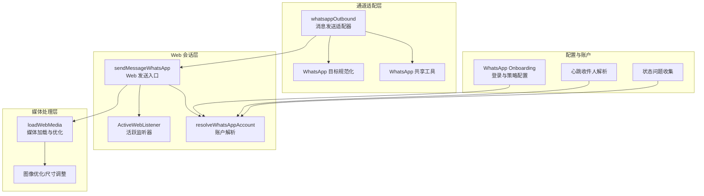
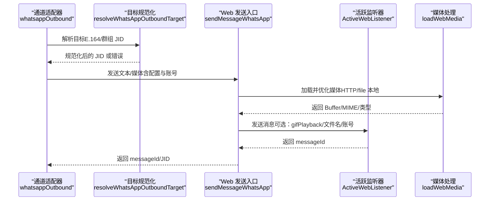
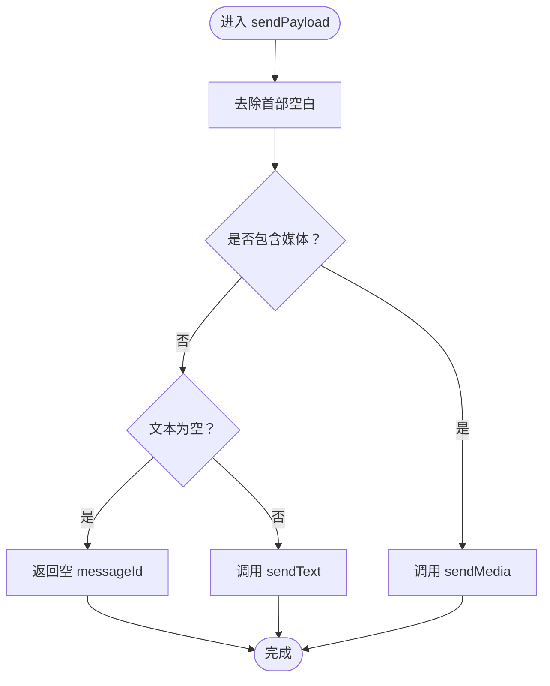
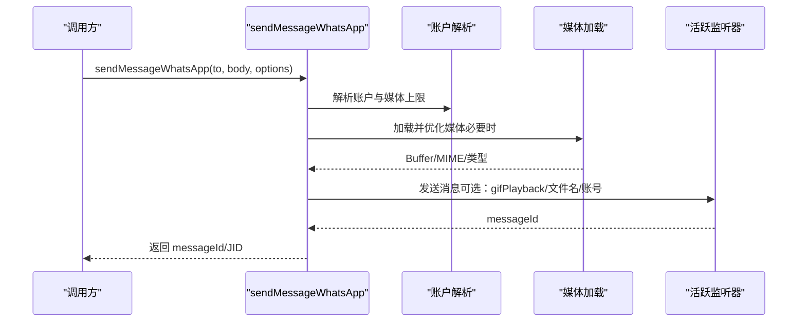
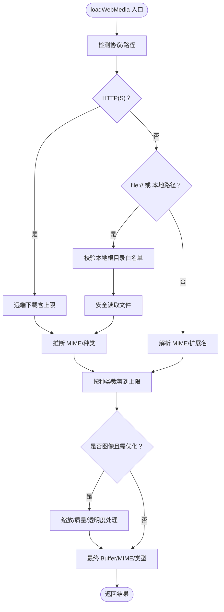
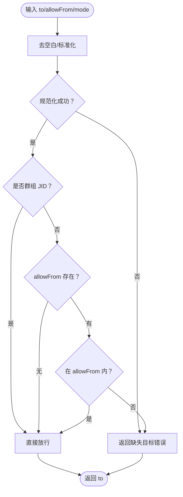
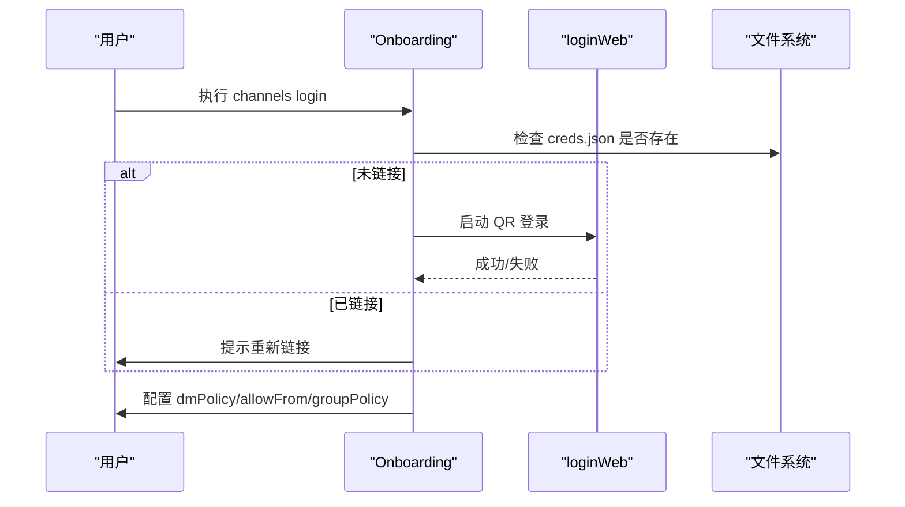
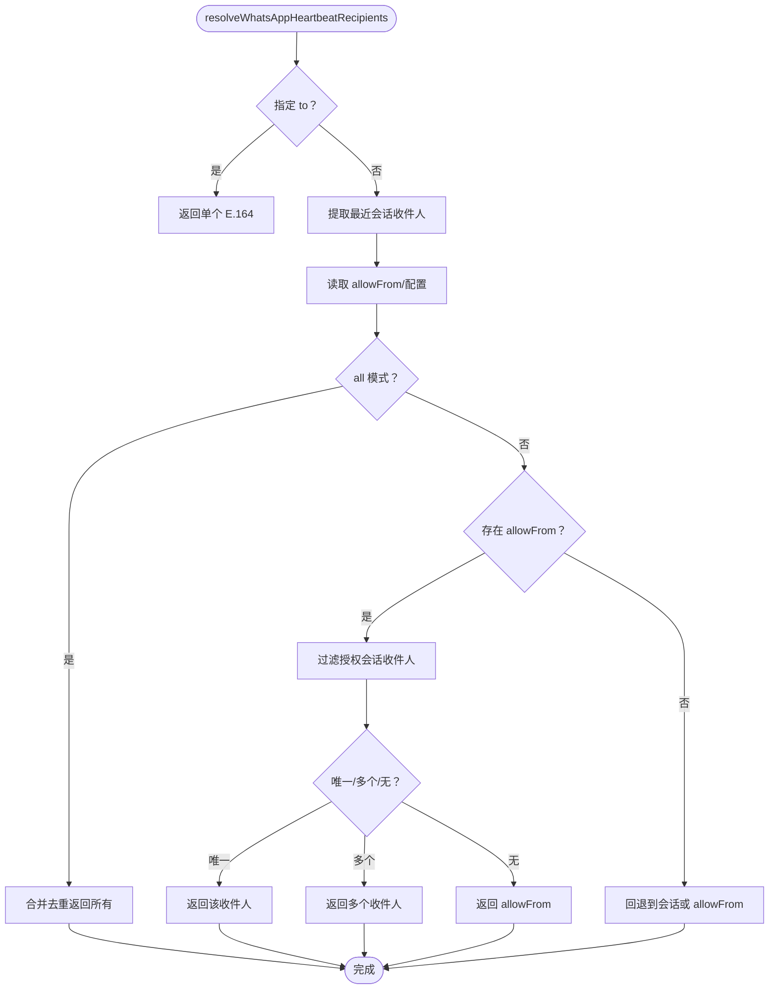
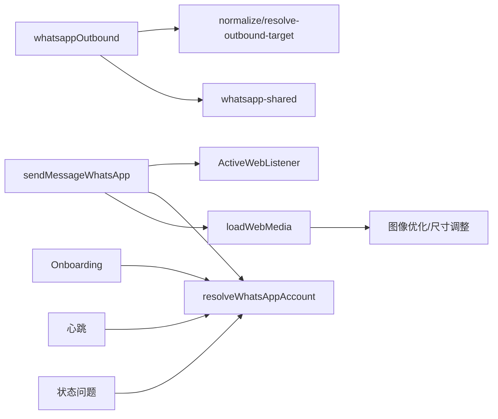

# WhatsApp插件实现

<cite>
**本文档引用的文件**
- [src/channels/plugins/outbound/whatsapp.ts](file://src/channels/plugins/outbound/whatsapp.ts)
- [src/web/outbound.ts](file://src/web/outbound.ts)
- [src/web/media.ts](file://src/web/media.ts)
- [src/web/accounts.ts](file://src/web/accounts.ts)
- [src/web/active-listener.ts](file://src/web/active-listener.ts)
- [src/whatsapp/normalize.ts](file://src/whatsapp/normalize.ts)
- [src/whatsapp/resolve-outbound-target.ts](file://src/whatsapp/resolve-outbound-target.ts)
- [src/channels/plugins/normalize/whatsapp.ts](file://src/channels/plugins/normalize/whatsapp.ts)
- [src/channels/plugins/whatsapp-shared.ts](file://src/channels/plugins/whatsapp-shared.ts)
- [src/channels/plugins/onboarding/whatsapp.ts](file://src/channels/plugins/onboarding/whatsapp.ts)
- [src/channels/plugins/whatsapp-heartbeat.ts](file://src/channels/plugins/whatsapp-heartbeat.ts)
- [src/channels/plugins/status-issues/whatsapp.ts](file://src/channels/plugins/status-issues/whatsapp.ts)
- [docs/channels/whatsapp.md](file://docs/channels/whatsapp.md)
- [extensions/whatsapp/src/channel.test.ts](file://extensions/whatsapp/src/channel.test.ts)
- [src/channels/plugins/outbound/whatsapp.sendpayload.test.ts](file://src/channels/plugins/outbound/whatsapp.sendpayload.test.ts)
- [src/channels/plugins/outbound/whatsapp.poll.test.ts](file://src/channels/plugins/outbound/whatsapp.poll.test.ts)
</cite>

## 目录
1. [简介](#简介)
2. [项目结构](#项目结构)
3. [核心组件](#核心组件)
4. [架构总览](#架构总览)
5. [详细组件分析](#详细组件分析)
6. [依赖关系分析](#依赖关系分析)
7. [性能考虑](#性能考虑)
8. [故障排除指南](#故障排除指南)
9. [结论](#结论)
10. [附录](#附录)

## 简介
本文件为 OpenClaw WhatsApp 插件实现的详细技术文档，聚焦于 WhatsApp 渠道适配器的核心架构与实现细节，涵盖消息接收、发送、媒体处理与状态管理的完整流程；深入解析 WhatsApp API 的集成方式（基于 Baileys 的 WhatsApp Web 通道）、Webhook 配置与消息验证、错误处理机制；提供完整的插件配置 schema、认证流程与连接管理策略；解释 WhatsApp 特有功能（位置共享、语音消息、视频消息）的处理逻辑，并给出性能优化建议、重连机制与故障排除指南。

## 项目结构
WhatsApp 插件在 OpenClaw 中采用“通道适配层 + Web 会话层 + 媒体处理层 + 配置与账户层”的分层设计：
- 通道适配层：负责消息路由、目标解析、文本分块与轮询等适配逻辑
- Web 会话层：维护活跃的 WhatsApp Web 监听器，执行实际的消息发送、反应与轮询
- 媒体处理层：统一处理远程/本地媒体加载、格式转换、尺寸压缩与大小限制
- 账户与配置层：解析多账户配置、认证目录、媒体上限与运行参数

**图表来源**
- [src/channels/plugins/outbound/whatsapp.ts:12-74](file://src/channels/plugins/outbound/whatsapp.ts#L12-L74)
- [src/web/outbound.ts:17-115](file://src/web/outbound.ts#L17-L115)
- [src/web/media.ts:404-424](file://src/web/media.ts#L404-L424)
- [src/web/accounts.ts:116-167](file://src/web/accounts.ts#L116-L167)
- [src/channels/plugins/onboarding/whatsapp.ts:254-355](file://src/channels/plugins/onboarding/whatsapp.ts#L254-L355)
- [src/channels/plugins/whatsapp-heartbeat.ts:47-99](file://src/channels/plugins/whatsapp-heartbeat.ts#L47-L99)
- [src/channels/plugins/status-issues/whatsapp.ts:30-67](file://src/channels/plugins/status-issues/whatsapp.ts#L30-L67)

**章节来源**
- [src/channels/plugins/outbound/whatsapp.ts:12-74](file://src/channels/plugins/outbound/whatsapp.ts#L12-L74)
- [src/web/outbound.ts:17-115](file://src/web/outbound.ts#L17-L115)
- [src/web/media.ts:404-424](file://src/web/media.ts#L404-L424)
- [src/web/accounts.ts:116-167](file://src/web/accounts.ts#L116-L167)
- [src/channels/plugins/onboarding/whatsapp.ts:254-355](file://src/channels/plugins/onboarding/whatsapp.ts#L254-L355)
- [src/channels/plugins/whatsapp-heartbeat.ts:47-99](file://src/channels/plugins/whatsapp-heartbeat.ts#L47-L99)
- [src/channels/plugins/status-issues/whatsapp.ts:30-67](file://src/channels/plugins/status-issues/whatsapp.ts#L30-L67)

## 核心组件
- 通道适配器（whatsappOutbound）
  - 文本分块与轮询支持，统一处理文本与媒体混合消息
  - 目标解析：支持 E.164 号码与群组 JID，结合 allowFrom 白名单控制
  - 多媒体发送：图片、视频、音频（PTT 语音）、文档，支持 GIF 播放与首图标题
- Web 发送入口（sendMessageWhatsApp）
  - 将 Markdown 表格与样式转换为 WhatsApp 兼容格式
  - 统一媒体加载与类型修正（PTT 使用 opus 编解码）
  - 发送前发送“正在输入”提示，提升交互体验
- 媒体处理（loadWebMedia）
  - 支持 HTTP(S)/file:// 与本地路径，自动检测 MIME 类型与媒体种类
  - 图像自动优化（缩放、质量、透明度处理），超限抛错或降级
  - 严格本地根目录白名单，防止越权访问
- 账户与认证（resolveWhatsAppAccount）
  - 解析多账户配置，支持自定义认证目录与兼容旧版目录
  - 默认媒体上限 50MB，支持按账户覆盖
- 心跳与状态（resolveWhatsAppHeartbeatRecipients / collectWhatsAppStatusIssues）
  - 基于会话存储与 allowFrom 列表生成心跳收件人
  - 自动识别未链接、断连等状态问题并提供修复建议

**章节来源**
- [src/channels/plugins/outbound/whatsapp.ts:12-74](file://src/channels/plugins/outbound/whatsapp.ts#L12-L74)
- [src/web/outbound.ts:17-115](file://src/web/outbound.ts#L17-L115)
- [src/web/media.ts:404-424](file://src/web/media.ts#L404-L424)
- [src/web/accounts.ts:116-167](file://src/web/accounts.ts#L116-L167)
- [src/channels/plugins/whatsapp-heartbeat.ts:47-99](file://src/channels/plugins/whatsapp-heartbeat.ts#L47-L99)
- [src/channels/plugins/status-issues/whatsapp.ts:30-67](file://src/channels/plugins/status-issues/whatsapp.ts#L30-L67)

## 架构总览
WhatsApp 插件通过“通道适配器 → Web 发送入口 → 活跃监听器”的链路完成消息发送；媒体处理贯穿其中，确保合规与性能；账户解析与认证目录决定会话生命周期与权限边界。

**图表来源**
- [src/channels/plugins/outbound/whatsapp.ts:18-72](file://src/channels/plugins/outbound/whatsapp.ts#L18-L72)
- [src/whatsapp/resolve-outbound-target.ts:8-52](file://src/whatsapp/resolve-outbound-target.ts#L8-L52)
- [src/web/outbound.ts:17-115](file://src/web/outbound.ts#L17-L115)
- [src/web/media.ts:404-424](file://src/web/media.ts#L404-L424)
- [src/web/active-listener.ts:11-29](file://src/web/active-listener.ts#L11-L29)

## 详细组件分析

### 通道适配器（whatsappOutbound）
- 功能要点
  - 文本分块：使用通用分块器，限制单次文本长度
  - 目标解析：支持显式 to 地址与模式，结合 allowFrom 白名单
  - 发送接口：sendText、sendMedia、sendPoll，统一路由至 sendMessageWhatsApp
  - 空内容处理：纯空白文本直接返回空 messageId
- 关键行为
  - trimLeadingWhitespace：去除首部空白，避免无意义字符
  - sendPayload：统一处理文本与媒体组合场景

**图表来源**
- [src/channels/plugins/outbound/whatsapp.ts:20-37](file://src/channels/plugins/outbound/whatsapp.ts#L20-L37)

**章节来源**
- [src/channels/plugins/outbound/whatsapp.ts:12-74](file://src/channels/plugins/outbound/whatsapp.ts#L12-L74)
- [src/channels/plugins/outbound/whatsapp.sendpayload.test.ts:31-126](file://src/channels/plugins/outbound/whatsapp.sendpayload.test.ts#L31-L126)

### Web 发送入口（sendMessageWhatsApp）
- 功能要点
  - 目标 JID 规范化：toWhatsappJid
  - Markdown 转换：表格与样式适配 WhatsApp
  - 媒体处理：根据 kind 设置 caption、PTT 编解码、文档文件名
  - 发送选项：gifPlayback、fileName、accountId
  - 错误日志：失败时记录错误与收件人信息
- 关键行为
  - requireActiveWebListener：若无活跃监听器则抛错
  - 发送前发送“正在输入”提示，提升交互体验

**图表来源**
- [src/web/outbound.ts:17-115](file://src/web/outbound.ts#L17-L115)
- [src/web/media.ts:404-424](file://src/web/media.ts#L404-L424)
- [src/web/active-listener.ts:39-51](file://src/web/active-listener.ts#L39-L51)

**章节来源**
- [src/web/outbound.ts:17-115](file://src/web/outbound.ts#L17-L115)
- [src/web/media.ts:404-424](file://src/web/media.ts#L404-L424)
- [src/web/active-listener.ts:39-51](file://src/web/active-listener.ts#L39-L51)

### 媒体处理（loadWebMedia）
- 功能要点
  - 远程媒体：HTTPS/HTTP 下载，带下载上限，避免内存膨胀
  - 本地媒体：file:// 与 ~ 展开，严格根目录白名单校验
  - 类型检测：自动推断 MIME 与媒体种类
  - 图像优化：HEIC → JPEG、透明度保留、多尺寸/质量组合尝试
  - 超限处理：超过 cap 抛出明确错误
- 安全性
  - LocalMediaAccessError：路径不在允许范围内、非法根目录、文件不存在等
  - SSRF 策略可选注入（通过 options.ssrfPolicy）

**图表来源**
- [src/web/media.ts:404-424](file://src/web/media.ts#L404-L424)
- [src/web/media.ts:233-402](file://src/web/media.ts#L233-L402)

**章节来源**
- [src/web/media.ts:404-424](file://src/web/media.ts#L404-L424)

### 目标规范化与解析
- 目标规范化（normalize）
  - 支持 JID（用户/群组）、LID、E.164，统一输出 E.164 或规范群组 JID
- 出站目标解析（resolve-outbound-target）
  - 校验 to 是否合法，群组直接放行，直聊受 allowFrom 限制
  - 支持通配符“*”，但群组不受此限制

**图表来源**
- [src/whatsapp/normalize.ts:55-80](file://src/whatsapp/normalize.ts#L55-L80)
- [src/whatsapp/resolve-outbound-target.ts:8-52](file://src/whatsapp/resolve-outbound-target.ts#L8-L52)

**章节来源**
- [src/whatsapp/normalize.ts:55-80](file://src/whatsapp/normalize.ts#L55-L80)
- [src/whatsapp/resolve-outbound-target.ts:8-52](file://src/whatsapp/resolve-outbound-target.ts#L8-L52)
- [src/channels/plugins/normalize/whatsapp.ts:4-26](file://src/channels/plugins/normalize/whatsapp.ts#L4-L26)

### 认证与登录（Onboarding）
- 登录流程
  - 检测认证目录是否存在 creds.json
  - 通过 loginWeb 启动 QR 登录，凭据保存在账户专属目录
  - 支持个人号与专用号两种模式，写入自聊天保护基线
- 配置策略
  - dmPolicy：pairing/allowlist/open/disabled
  - allowFrom：E.164 列表，支持通配符“*”
  - groupPolicy/groupAllowFrom/groups：群组访问控制
  - 多账户：accounts.<id> 覆盖默认

**图表来源**
- [src/channels/plugins/onboarding/whatsapp.ts:317-343](file://src/channels/plugins/onboarding/whatsapp.ts#L317-L343)
- [src/channels/plugins/onboarding/whatsapp.ts:254-355](file://src/channels/plugins/onboarding/whatsapp.ts#L254-L355)

**章节来源**
- [src/channels/plugins/onboarding/whatsapp.ts:254-355](file://src/channels/plugins/onboarding/whatsapp.ts#L254-L355)

### 心跳与状态管理
- 心跳收件人解析
  - 优先最近会话收件人，再合并 allowFrom 与配置允许列表
  - 支持单收件人、多收件人与全部收件人模式
- 状态问题收集
  - 未链接：提示扫描二维码
  - 已链接但未连接：提示 doctor 诊断与重连
  - lastError 与 reconnectAttempts 辅助定位问题

**图表来源**
- [src/channels/plugins/whatsapp-heartbeat.ts:47-99](file://src/channels/plugins/whatsapp-heartbeat.ts#L47-L99)
- [src/channels/plugins/status-issues/whatsapp.ts:30-67](file://src/channels/plugins/status-issues/whatsapp.ts#L30-L67)

**章节来源**
- [src/channels/plugins/whatsapp-heartbeat.ts:47-99](file://src/channels/plugins/whatsapp-heartbeat.ts#L47-L99)
- [src/channels/plugins/status-issues/whatsapp.ts:30-67](file://src/channels/plugins/status-issues/whatsapp.ts#L30-L67)

## 依赖关系分析
- 组件耦合
  - 通道适配器依赖目标规范化与共享工具，耦合度低、内聚性强
  - Web 发送入口依赖活跃监听器与账户解析，形成清晰的外部依赖边界
  - 媒体处理模块独立，仅通过 Buffer/MIME 接口与上层交互
- 外部依赖
  - Baileys WhatsApp Web（通过活跃监听器抽象）
  - 文件系统与网络（媒体加载）
  - 配置系统（channels.whatsapp.*）

**图表来源**
- [src/channels/plugins/outbound/whatsapp.ts:1-10](file://src/channels/plugins/outbound/whatsapp.ts#L1-L10)
- [src/web/outbound.ts:1-15](file://src/web/outbound.ts#L1-L15)
- [src/web/media.ts:1-18](file://src/web/media.ts#L1-L18)
- [src/web/accounts.ts:1-11](file://src/web/accounts.ts#L1-L11)
- [src/channels/plugins/onboarding/whatsapp.ts:1-17](file://src/channels/plugins/onboarding/whatsapp.ts#L1-L17)
- [src/channels/plugins/whatsapp-heartbeat.ts:1-9](file://src/channels/plugins/whatsapp-heartbeat.ts#L1-L9)
- [src/channels/plugins/status-issues/whatsapp.ts:1-3](file://src/channels/plugins/status-issues/whatsapp.ts#L1-L3)

**章节来源**
- [src/channels/plugins/outbound/whatsapp.ts:1-10](file://src/channels/plugins/outbound/whatsapp.ts#L1-L10)
- [src/web/outbound.ts:1-15](file://src/web/outbound.ts#L1-L15)
- [src/web/media.ts:1-18](file://src/web/media.ts#L1-L18)
- [src/web/accounts.ts:1-11](file://src/web/accounts.ts#L1-L11)
- [src/channels/plugins/onboarding/whatsapp.ts:1-17](file://src/channels/plugins/onboarding/whatsapp.ts#L1-L17)
- [src/channels/plugins/whatsapp-heartbeat.ts:1-9](file://src/channels/plugins/whatsapp-heartbeat.ts#L1-L9)
- [src/channels/plugins/status-issues/whatsapp.ts:1-3](file://src/channels/plugins/status-issues/whatsapp.ts#L1-L3)

## 性能考虑
- 文本分块
  - 默认文本块上限 4000 字符，newline 模式优先段落边界，减少截断
- 媒体优化
  - 图像自动压缩与缩放，优先 JPEG；PNG 保留透明度时降级为 JPEG
  - HEIC 自动转换为 JPEG，扩展名同步更新
- 发送前提示
  - 发送前触发“正在输入”提示，降低感知延迟
- 并发与重连
  - 基于活跃监听器的多账户隔离，避免阻塞
  - 心跳与状态问题收集辅助快速定位断连与重连循环

[本节为通用性能建议，无需特定文件引用]

## 故障排除指南
- 未链接（需要 QR）
  - 现象：状态显示未链接
  - 处理：执行 `openclaw channels login` 扫码登录
- 已链接但断连/重连循环
  - 现象：reconnectAttempts 上升，lastError 存在
  - 处理：运行 `openclaw doctor` 诊断，必要时重新登录
- 发送时报无活跃监听器
  - 现象：发送失败，提示无活跃监听器
  - 处理：确认网关已启动且对应账户已登录
- 群消息被忽略
  - 检查顺序：groupPolicy → groupAllowFrom/allowFrom → groups → mention gating
- 媒体发送失败
  - 检查媒体大小是否超过账户上限（默认 50MB），必要时启用本地根目录白名单或优化

**章节来源**
- [src/channels/plugins/status-issues/whatsapp.ts:44-63](file://src/channels/plugins/status-issues/whatsapp.ts#L44-L63)
- [src/web/active-listener.ts:39-51](file://src/web/active-listener.ts#L39-L51)
- [docs/channels/whatsapp.md:374-424](file://docs/channels/whatsapp.md#L374-L424)

## 结论
OpenClaw 的 WhatsApp 插件以通道适配器为核心，结合 Web 会话层与媒体处理层，实现了稳定、可扩展的消息发送能力。通过严格的账户与认证管理、目标规范化与白名单控制、媒体优化与大小限制，以及心跳与状态问题收集，整体方案在安全性、可用性与性能之间取得良好平衡。针对 WhatsApp 特有功能（轮询、PTT、GIF 播放、文档命名）均有明确实现与测试覆盖，适合生产环境部署与运维。

[本节为总结性内容，无需特定文件引用]

## 附录

### 配置 Schema（关键字段）
- 访问控制
  - channels.whatsapp.dmPolicy：pairing/allowlist/open/disabled
  - channels.whatsapp.allowFrom：E.164 列表，支持“*”
  - channels.whatsapp.groupPolicy：open/allowlist/disabled
  - channels.whatsapp.groupAllowFrom：群组发送者白名单
  - channels.whatsapp.groups：群组允许列表
- 交付与媒体
  - channels.whatsapp.textChunkLimit：文本分块上限（默认 4000）
  - channels.whatsapp.chunkMode：length/newline
  - channels.whatsapp.mediaMaxMb：媒体上限（默认 50MB）
  - channels.whatsapp.sendReadReceipts：是否发送已读回执
  - channels.whatsapp.ackReaction：即时确认表情（emoji/direct/group）
- 多账户
  - channels.whatsapp.accounts.<id>.enabled/name/authDir/messagePrefix/selfChatMode
  - accounts.<id>.dmPolicy/allowFrom/groupPolicy/groupAllowFrom/groups/textChunkLimit/chunkMode/mediaMaxMb/sendReadReceipts/ackReaction
- 运维
  - channels.whatsapp.configWrites：是否允许通道发起配置写入
  - channels.whatsapp.debounceMs：去抖时间
  - channels.whatsapp.web.enabled/heartbeatSeconds/reconnect.*

**章节来源**
- [docs/channels/whatsapp.md:24-446](file://docs/channels/whatsapp.md#L24-L446)

### 认证流程与连接管理
- 认证目录
  - 默认：~/.openclaw/credentials/whatsapp/<accountId>/creds.json
  - 兼容：旧版默认目录仍可识别与迁移
- 连接管理
  - requireActiveWebListener：无监听器即刻报错
  - setActiveWebListener：注册/注销活跃监听器
  - resolveWhatsAppAuthDir：解析账户认证目录（含兼容旧版）

**章节来源**
- [src/web/accounts.ts:94-114](file://src/web/accounts.ts#L94-L114)
- [src/web/active-listener.ts:39-84](file://src/web/active-listener.ts#L39-L84)

### WhatsApp 特有功能处理
- 位置共享：通过媒体占位符与上下文拼接，路由前进行占位符替换
- 语音消息（PTT）：强制 opus 编解码，确保兼容性
- 视频消息：支持 GIF 播放（gifPlayback），自动移除标题以符合媒体类型要求
- 轮询：sendPollWhatsApp 支持最多 12 个选项，标准化输入后发送

**章节来源**
- [src/web/outbound.ts:70-84](file://src/web/outbound.ts#L70-L84)
- [src/web/outbound.ts:160-197](file://src/web/outbound.ts#L160-L197)
- [src/channels/plugins/outbound/whatsapp.ts:67-72](file://src/channels/plugins/outbound/whatsapp.ts#L67-L72)

### 测试与契约
- 单元测试覆盖
  - sendPayload 文本/媒体混合、首部空白修剪、空文本跳过
  - sendPoll 配置透传与 accountId 支持
  - 扩展测试：sendMedia 透传 mediaLocalRoots
- 合同测试
  - sendPayload 分块契约、长文本拆分与上限约束

**章节来源**
- [src/channels/plugins/outbound/whatsapp.sendpayload.test.ts:31-126](file://src/channels/plugins/outbound/whatsapp.sendpayload.test.ts#L31-L126)
- [src/channels/plugins/outbound/whatsapp.poll.test.ts:18-41](file://src/channels/plugins/outbound/whatsapp.poll.test.ts#L18-L41)
- [extensions/whatsapp/src/channel.test.ts:4-40](file://extensions/whatsapp/src/channel.test.ts#L4-L40)