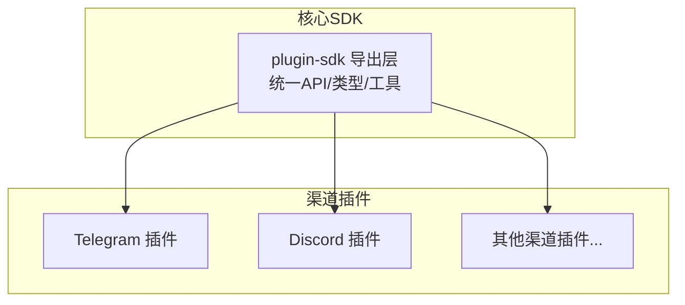
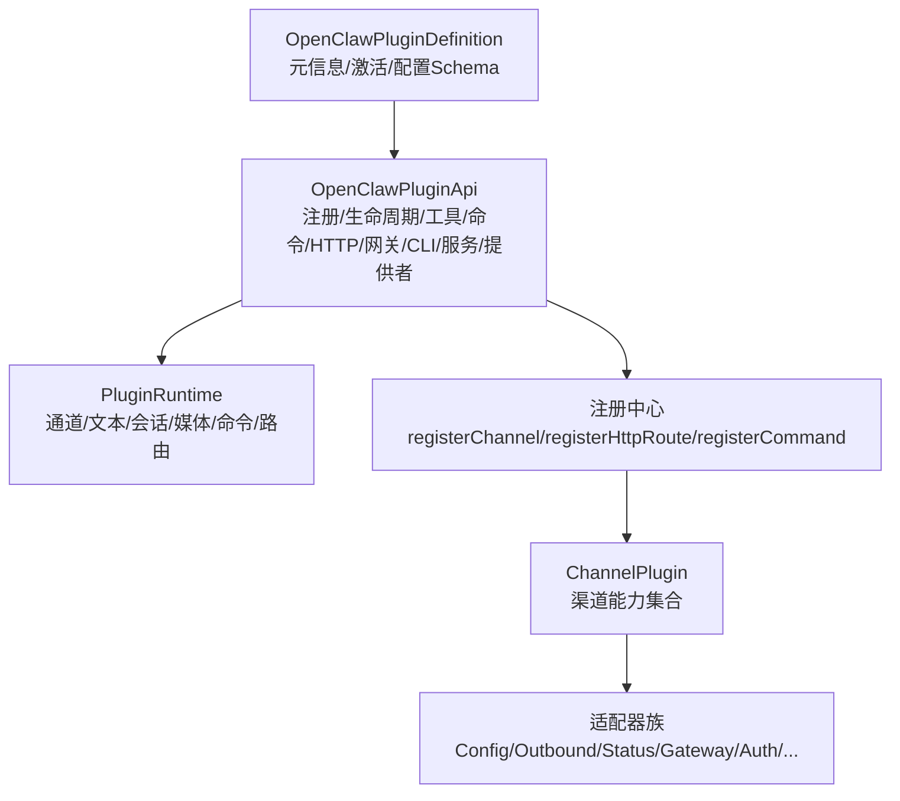
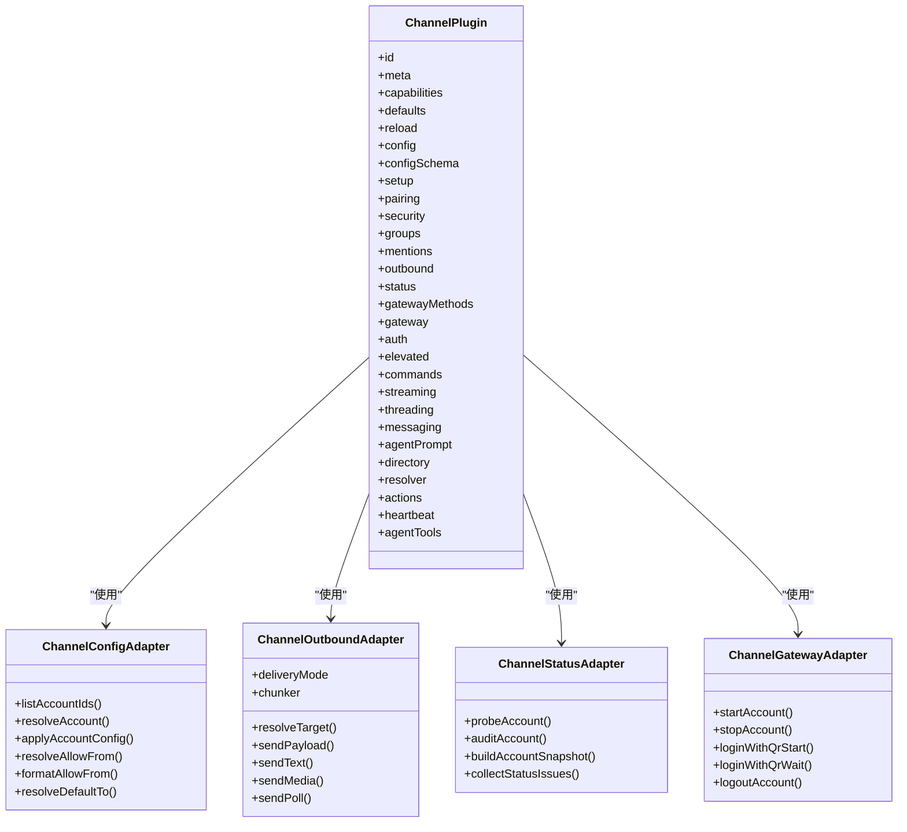
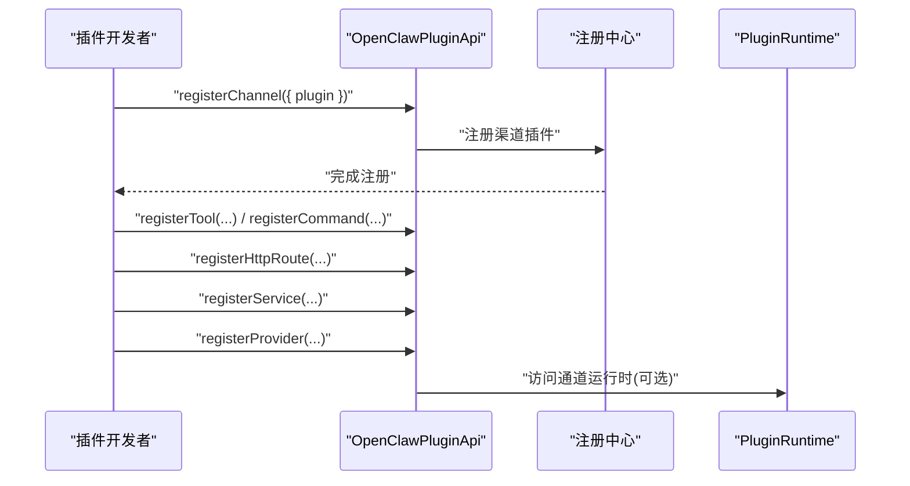
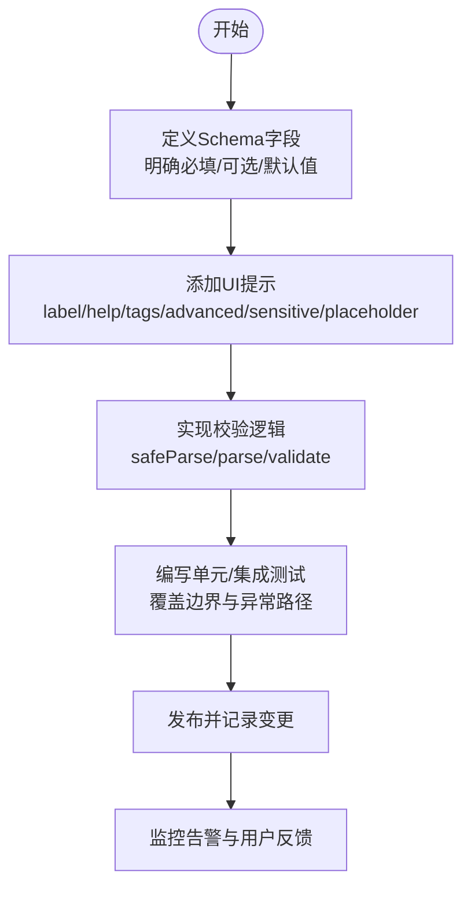
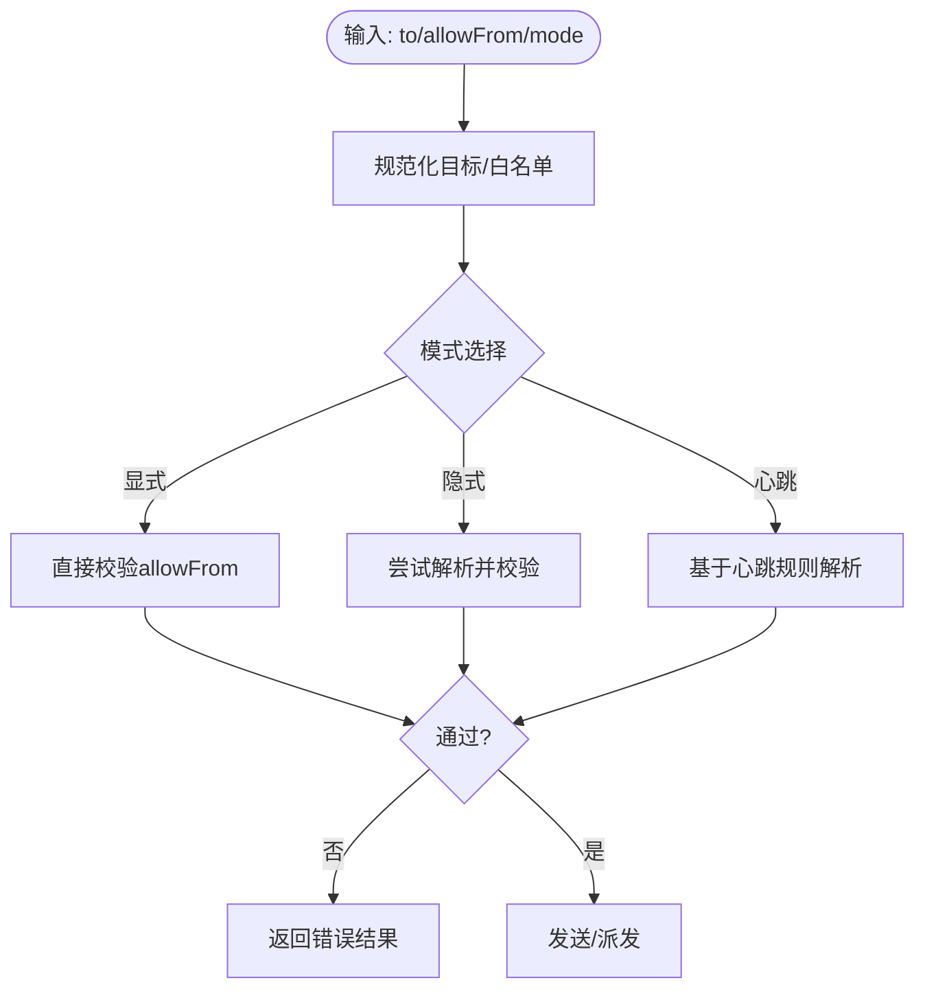
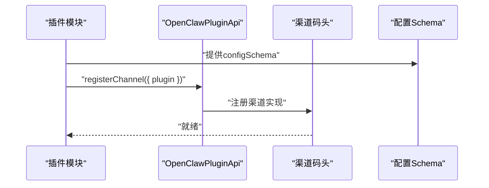
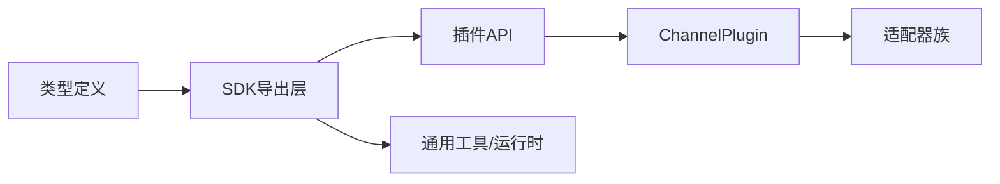

# 插件开发模板

<cite>
**本文引用的文件**
- [index.ts](file://src/plugin-sdk/index.ts)
- [types.plugin.ts](file://src/channels/plugins/types.plugin.ts)
- [types.adapters.ts](file://src/channels/plugins/types.adapters.ts)
- [types.core.ts](file://src/channels/plugins/types.core.ts)
- [types.ts](file://src/plugins/types.ts)
- [openclaw.plugin.json](file://extensions/discord/openclaw.plugin.json)
- [index.ts](file://extensions/telegram/index.ts)
- [resolve-target-test-helpers.ts](file://extensions/shared/resolve-target-test-helpers.ts)
</cite>

## 目录
1. [简介](#简介)
2. [项目结构](#项目结构)
3. [核心组件](#核心组件)
4. [架构总览](#架构总览)
5. [详细组件分析](#详细组件分析)
6. [依赖关系分析](#依赖关系分析)
7. [性能考量](#性能考量)
8. [故障排查指南](#故障排查指南)
9. [结论](#结论)
10. [附录](#附录)

## 简介
本指南面向OpenClaw渠道插件开发者，提供标准化的插件开发模板与最佳实践。内容覆盖基础类继承、接口实现、生命周期管理、配置Schema设计与验证、消息适配器标准实现模式、插件注册机制与依赖管理、版本兼容性处理，以及测试策略、调试与性能监控建议。目标是帮助你在最短时间内搭建可维护、可扩展且符合OpenClaw规范的渠道插件。

## 项目结构
OpenClaw采用“核心SDK + 外部渠道插件”的分层架构：
- 核心SDK位于src/plugin-sdk，导出统一的插件API、类型定义与通用工具。
- 渠道插件位于extensions目录下，每个渠道独立包，通过openclaw.plugin.json声明元数据与配置Schema。
- 插件通过registerChannel向OpenClaw注册自身能力，SDK负责生命周期调度与运行时集成。

图表来源
- [index.ts:1-826](file://src/plugin-sdk/index.ts#L1-L826)
- [index.ts:1-18](file://extensions/telegram/index.ts#L1-L18)
- [openclaw.plugin.json:1-10](file://extensions/discord/openclaw.plugin.json#L1-L10)

章节来源
- [index.ts:1-826](file://src/plugin-sdk/index.ts#L1-L826)
- [index.ts:1-18](file://extensions/telegram/index.ts#L1-L18)
- [openclaw.plugin.json:1-10](file://extensions/discord/openclaw.plugin.json#L1-L10)

## 核心组件
- 插件定义与API：OpenClawPluginDefinition与OpenClawPluginApi，用于声明插件元信息、注册工具、命令、HTTP路由、通道、网关方法、CLI与服务等。
- 渠道插件契约：ChannelPlugin，定义渠道能力边界（配置、安全、群组、消息、心跳、目录、解析器、代理等）。
- 适配器族：ChannelConfigAdapter、ChannelOutboundAdapter、ChannelStatusAdapter、ChannelGatewayAdapter等，承载渠道具体实现。
- 生命周期与运行时：PluginRuntime、通道生命周期管理、账户状态快照与问题收集。
- 配置Schema：OpenClawPluginConfigSchema与ChannelConfigSchema，支持JSON Schema与TypeBox风格校验，提供UI提示。

章节来源
- [types.ts:248-306](file://src/plugins/types.ts#L248-L306)
- [types.plugin.ts:49-85](file://src/channels/plugins/types.plugin.ts#L49-L85)
- [types.adapters.ts:24-384](file://src/channels/plugins/types.adapters.ts#L24-L384)
- [types.core.ts:76-403](file://src/channels/plugins/types.core.ts#L76-L403)

## 架构总览
OpenClaw插件体系以“插件API”为中心，围绕“渠道插件契约”展开，通过适配器实现不同渠道的能力映射；SDK提供统一的注册、路由、日志、运行时与诊断事件能力。

图表来源
- [types.ts:248-306](file://src/plugins/types.ts#L248-L306)
- [types.plugin.ts:49-85](file://src/channels/plugins/types.plugin.ts#L49-L85)
- [types.adapters.ts:24-384](file://src/channels/plugins/types.adapters.ts#L24-L384)
- [index.ts:125-134](file://src/plugin-sdk/index.ts#L125-L134)

## 详细组件分析

### 组件A：渠道插件契约与适配器族
- ChannelPlugin：声明渠道id、元信息、能力集、默认参数、重载策略、各适配器入口与代理工具。
- 适配器族职责：
  - 配置：解析账户、允许列表、默认收件人等。
  - 出站：目标解析、文本/媒体发送、轮询投票。
  - 状态：探针、审计、快照、问题收集。
  - 网关：账户启停、二维码登录、登出。
  - 安全：DM策略、警告收集。
  - 目录/解析：自描述、成员查询、目标解析。
  - 命令/动作：命令授权、消息动作处理。
  - 线程：回复模式、上下文构建。
  - 流式：阻塞合并策略。
- 设计要点：
  - 适配器按需实现，未实现的字段留空或返回空实现。
  - 通道运行时channelRuntime为外部插件提供高级能力（可选）。
  - 目标解析支持显式/隐式/心跳三种模式，结合allowFrom进行白名单控制。

图表来源
- [types.plugin.ts:49-85](file://src/channels/plugins/types.plugin.ts#L49-L85)
- [types.adapters.ts:52-384](file://src/channels/plugins/types.adapters.ts#L52-L384)
- [types.core.ts:181-403](file://src/channels/plugins/types.core.ts#L181-L403)

章节来源
- [types.plugin.ts:49-85](file://src/channels/plugins/types.plugin.ts#L49-L85)
- [types.adapters.ts:24-384](file://src/channels/plugins/types.adapters.ts#L24-L384)
- [types.core.ts:181-403](file://src/channels/plugins/types.core.ts#L181-L403)

### 组件B：插件API与生命周期
- OpenClawPluginApi：提供注册工具、钩子、HTTP路由、通道、网关方法、CLI、服务、提供者与命令等能力。
- 生命周期钩子：before_model_resolve/before_prompt_build/before_agent_start/llm_input/llm_output/agent_end/消息收发/工具调用/会话/子代理/网关启停等。
- 运行时：PluginRuntime封装通道相关能力（回复派发、路由、文本、会话、媒体、命令、群组、配对等），供外部插件在channelRuntime可用时使用。

图表来源
- [types.ts:263-306](file://src/plugins/types.ts#L263-L306)
- [index.ts:125-134](file://src/plugin-sdk/index.ts#L125-L134)

章节来源
- [types.ts:248-306](file://src/plugins/types.ts#L248-L306)
- [index.ts:125-134](file://src/plugin-sdk/index.ts#L125-L134)

### 组件C：配置Schema设计与验证
- OpenClawPluginConfigSchema：支持safeParse/parse/validate/jsonSchema/uiHints，便于统一校验与UI渲染。
- ChannelConfigSchema：针对渠道的schema与UI提示，配合emptyPluginConfigSchema快速声明无配置插件。
- 典型Schema示例：参考discord/openclaw.plugin.json中的最小Schema，确保额外属性禁用、属性显式声明。
- 设计原则：
  - 明确必填/可选字段，提供合理默认值。
  - 使用UI提示（label/help/tags/advanced/sensitive/placeholder）提升配置体验。
  - 将敏感信息标记为sensitive，避免泄露。
  - 保持向后兼容，新增字段应可选并提供默认行为。

图表来源
- [types.ts:44-56](file://src/plugins/types.ts#L44-L56)
- [openclaw.plugin.json:4-8](file://extensions/discord/openclaw.plugin.json#L4-L8)

章节来源
- [types.ts:44-56](file://src/plugins/types.ts#L44-L56)
- [openclaw.plugin.json:1-10](file://extensions/discord/openclaw.plugin.json#L1-L10)

### 组件D：消息适配器标准实现模式
- 输入验证：在resolveTarget中结合allowFrom执行白名单校验，支持显式/隐式/心跳模式，失败时返回错误结果。
- 输出格式化：利用SDK提供的文本分片、Markdown处理、媒体加载与带附件链接格式化等工具，保证跨渠道一致性。
- 错误处理：在适配器中捕获并转换为统一的错误对象，记录上下文与堆栈，必要时回退到安全策略（如静默失败、降级发送）。
- 示例流程：目标解析失败、空目标、仅空白字符等场景均应被测试覆盖。

图表来源
- [resolve-target-test-helpers.ts:17-66](file://extensions/shared/resolve-target-test-helpers.ts#L17-L66)
- [types.adapters.ts:108-125](file://src/channels/plugins/types.adapters.ts#L108-L125)

章节来源
- [resolve-target-test-helpers.ts:1-66](file://extensions/shared/resolve-target-test-helpers.ts#L1-L66)
- [types.adapters.ts:108-125](file://src/channels/plugins/types.adapters.ts#L108-L125)

### 组件E：插件注册机制与依赖管理
- 渠道注册：插件模块导出OpenClawPluginDefinition或函数形式，通过api.registerChannel({ plugin })完成注册。
- 依赖声明：通过openclaw.plugin.json声明id与channels，SDK据此建立渠道映射。
- 版本兼容性：遵循SDK版本号语义，对外部插件暴露的API进行稳定性承诺；内部SDK更新时，优先保持向后兼容或提供迁移指引。
- 服务与CLI：插件可注册服务与CLI命令，SDK负责生命周期与执行环境隔离。

图表来源
- [index.ts:6-15](file://extensions/telegram/index.ts#L6-L15)
- [openclaw.plugin.json:1-10](file://extensions/discord/openclaw.plugin.json#L1-L10)
- [types.plugin.ts:49-85](file://src/channels/plugins/types.plugin.ts#L49-L85)

章节来源
- [index.ts:1-18](file://extensions/telegram/index.ts#L1-L18)
- [openclaw.plugin.json:1-10](file://extensions/discord/openclaw.plugin.json#L1-L10)
- [types.plugin.ts:49-85](file://src/channels/plugins/types.plugin.ts#L49-L85)

## 依赖关系分析
- 内聚性：ChannelPlugin将同一渠道的能力聚合在一个契约内，降低调用方复杂度。
- 耦合性：适配器按需实现，未强制实现的字段留空，减少不必要的耦合。
- 外部依赖：SDK提供统一的运行时、日志、网络、SSRF防护、去重缓存、Webhook内存守卫等基础设施。
- 循环依赖：通过导出层index.ts集中导出，避免直接相互导入。

图表来源
- [index.ts:1-826](file://src/plugin-sdk/index.ts#L1-L826)
- [types.ts:248-306](file://src/plugins/types.ts#L248-L306)
- [types.plugin.ts:49-85](file://src/channels/plugins/types.plugin.ts#L49-L85)
- [types.adapters.ts:24-384](file://src/channels/plugins/types.adapters.ts#L24-L384)

章节来源
- [index.ts:1-826](file://src/plugin-sdk/index.ts#L1-L826)
- [types.ts:248-306](file://src/plugins/types.ts#L248-L306)
- [types.plugin.ts:49-85](file://src/channels/plugins/types.plugin.ts#L49-L85)
- [types.adapters.ts:24-384](file://src/channels/plugins/types.adapters.ts#L24-L384)

## 性能考量
- 发送吞吐：合理设置文本分片与媒体加载策略，避免超大负载一次性发送。
- 并发控制：使用键控异步队列（KeyedAsyncQueue）对同一流水线进行限流与去重。
- 缓存与去重：利用持久化去重缓存（PersistentDedupe）避免重复处理。
- 网络与SSRF：启用SSRF防护与HTTPS限制，避免私网地址与不安全主机。
- Webhook防护：限制请求体大小、速率与异常计数，防止滥用与资源耗尽。
- 日志与诊断：开启诊断事件与日志传输，记录关键指标（延迟、错误率、重试次数）。

## 故障排查指南
- 配置校验失败：检查OpenClawPluginConfigSchema与ChannelConfigSchema的字段与默认值，确保UI提示与实际结构一致。
- 目标解析失败：使用resolve-target-test-helpers中的通用断言覆盖常见错误场景（规范化失败、无目标、仅空白字符）。
- 发送异常：确认OutboundAdapter的sendPayload/sendText/sendMedia实现是否正确处理错误与回退。
- 状态问题：通过ChannelStatusAdapter的probeAccount/auditAccount/buildAccountSnapshot收集问题线索。
- 日志与诊断：启用registerLogTransport与诊断事件，定位消息收发、工具调用与会话阶段的问题。

章节来源
- [resolve-target-test-helpers.ts:17-66](file://extensions/shared/resolve-target-test-helpers.ts#L17-L66)
- [types.adapters.ts:127-166](file://src/channels/plugins/types.adapters.ts#L127-L166)
- [index.ts:620-642](file://src/plugin-sdk/index.ts#L620-L642)

## 结论
通过遵循本模板与最佳实践，你可以快速构建一个功能完备、易于维护与扩展的OpenClaw渠道插件。重点在于：
- 严格遵守ChannelPlugin契约与适配器族职责；
- 设计清晰的配置Schema并提供完善的校验与UI提示；
- 在消息适配器中实现稳健的输入验证、输出格式化与错误处理；
- 利用SDK提供的注册机制、运行时与诊断能力，保障插件生命周期稳定；
- 通过测试与监控持续改进质量与性能。

## 附录
- 快速开始清单
  - 创建插件模块，导出OpenClawPluginDefinition或函数形式。
  - 实现ChannelPlugin所需适配器（至少配置与出站）。
  - 提供openclaw.plugin.json与configSchema。
  - 在register中调用api.registerChannel与api.registerHttpRoute/registerCommand/registerService等。
  - 编写单元/集成测试，覆盖目标解析与错误路径。
  - 开启日志与诊断事件，持续监控性能与稳定性。