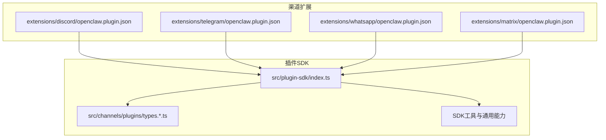
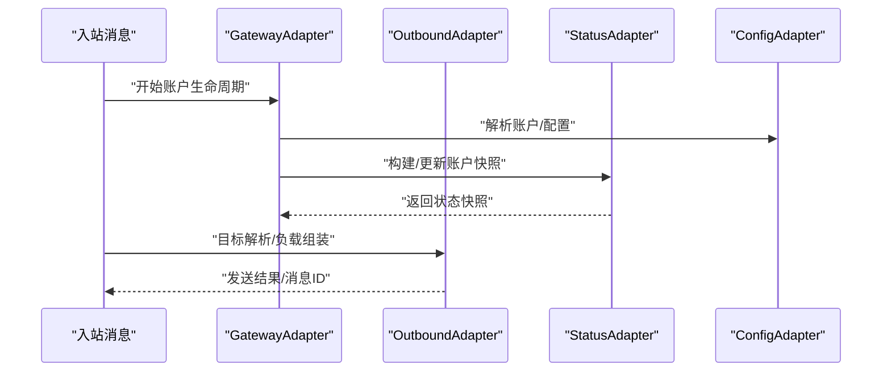
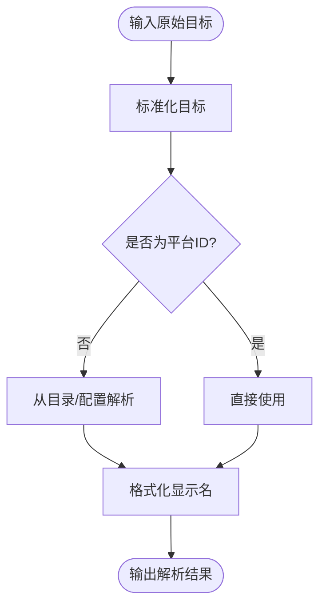
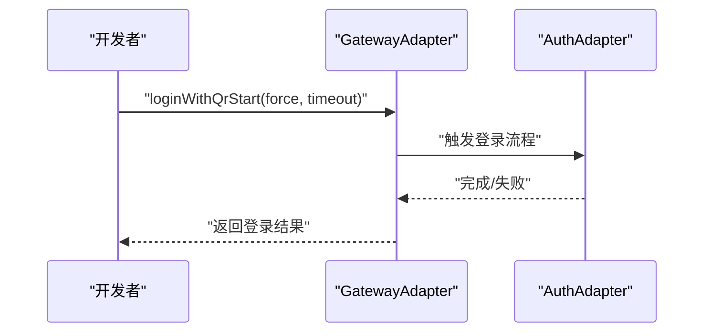
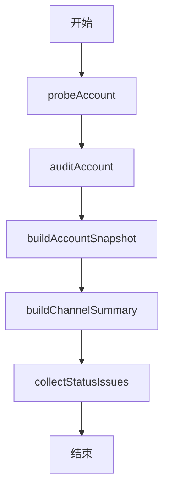
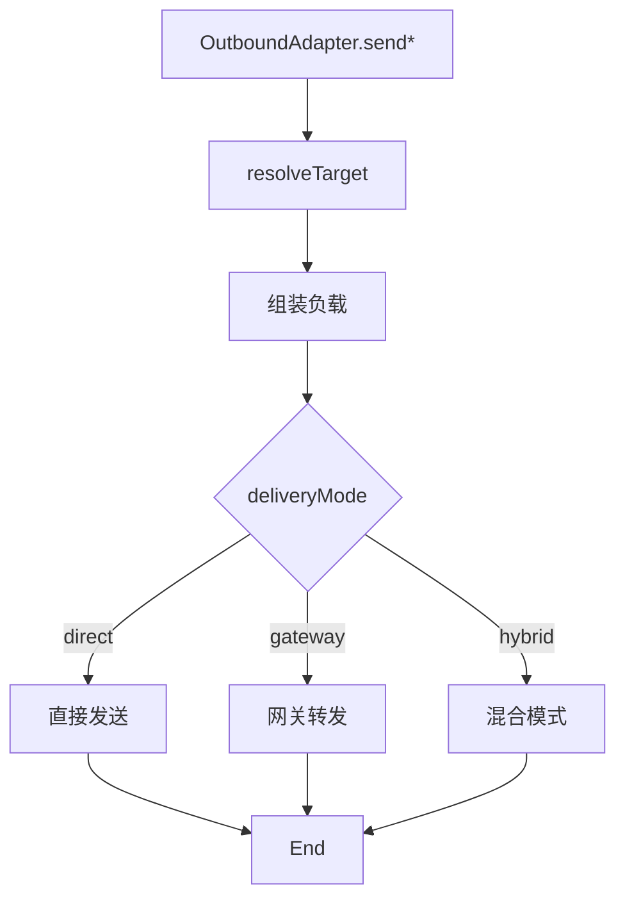
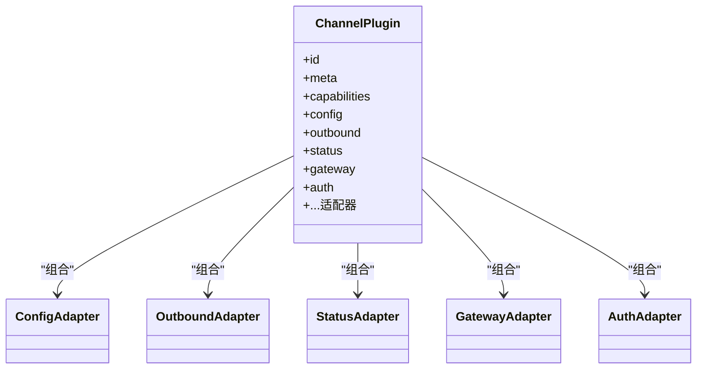

# 渠道插件实现

<cite>
**本文引用的文件**
- [src/plugin-sdk/index.ts](file://src/plugin-sdk/index.ts)
- [src/channels/plugins/types.ts](file://src/channels/plugins/types.ts)
- [src/channels/plugins/types.plugin.ts](file://src/channels/plugins/types.plugin.ts)
- [src/channels/plugins/types.adapters.ts](file://src/channels/plugins/types.adapters.ts)
- [src/channels/plugins/types.core.ts](file://src/channels/plugins/types.core.ts)
- [extensions/discord/openclaw.plugin.json](file://extensions/discord/openclaw.plugin.json)
- [extensions/telegram/openclaw.plugin.json](file://extensions/telegram/openclaw.plugin.json)
- [extensions/whatsapp/openclaw.plugin.json](file://extensions/whatsapp/openclaw.plugin.json)
- [extensions/matrix/openclaw.plugin.json](file://extensions/matrix/openclaw.plugin.json)
</cite>

## 目录
1. [引言](#引言)
2. [项目结构](#项目结构)
3. [核心组件](#核心组件)
4. [架构总览](#架构总览)
5. [详细组件分析](#详细组件分析)
6. [依赖分析](#依赖分析)
7. [性能考虑](#性能考虑)
8. [故障排查指南](#故障排查指南)
9. [结论](#结论)
10. [附录：开发模板与规范](#附录开发模板与规范)

## 引言
本指南面向希望在 OpenClaw 中实现“渠道插件”的开发者，系统性讲解渠道插件的核心架构与实现模式，覆盖消息适配器、认证处理器、状态管理器等关键模块；并对 WhatsApp、Telegram、Discord、Matrix 等主流渠道的差异化实现进行对比说明；最后提供可复用的开发模板、配置 schema、验证规则、部署要求、认证流程、连接管理、重连机制与性能优化策略。

## 项目结构
OpenClaw 的渠道插件体系由“插件 SDK”和“各渠道扩展”两部分组成：
- 插件 SDK：定义统一的插件契约、类型、工具函数与通用能力（如状态构建、Webhook 守卫、去重缓存、媒体加载等）
- 各渠道扩展：以独立插件包形式实现具体渠道的适配器、配置 schema、登录/心跳/目录/消息等适配逻辑

**图表来源**
- [src/plugin-sdk/index.ts:1-826](file://src/plugin-sdk/index.ts#L1-L826)
- [src/channels/plugins/types.ts:1-66](file://src/channels/plugins/types.ts#L1-L66)
- [src/channels/plugins/types.plugin.ts:1-86](file://src/channels/plugins/types.plugin.ts#L1-L86)
- [extensions/discord/openclaw.plugin.json:1-10](file://extensions/discord/openclaw.plugin.json#L1-L10)
- [extensions/telegram/openclaw.plugin.json:1-10](file://extensions/telegram/openclaw.plugin.json#L1-L10)
- [extensions/whatsapp/openclaw.plugin.json:1-10](file://extensions/whatsapp/openclaw.plugin.json#L1-L10)
- [extensions/matrix/openclaw.plugin.json:1-10](file://extensions/matrix/openclaw.plugin.json#L1-L10)

**章节来源**
- [src/plugin-sdk/index.ts:1-826](file://src/plugin-sdk/index.ts#L1-L826)
- [src/channels/plugins/types.ts:1-66](file://src/channels/plugins/types.ts#L1-L66)
- [src/channels/plugins/types.plugin.ts:1-86](file://src/channels/plugins/types.plugin.ts#L1-L86)
- [extensions/discord/openclaw.plugin.json:1-10](file://extensions/discord/openclaw.plugin.json#L1-L10)
- [extensions/telegram/openclaw.plugin.json:1-10](file://extensions/telegram/openclaw.plugin.json#L1-L10)
- [extensions/whatsapp/openclaw.plugin.json:1-10](file://extensions/whatsapp/openclaw.plugin.json#L1-L10)
- [extensions/matrix/openclaw.plugin.json:1-10](file://extensions/matrix/openclaw.plugin.json#L1-L10)

## 核心组件
- 插件契约与类型
  - ChannelPlugin：统一的插件入口，声明 id、meta、capabilities、以及可选的适配器集合（config、setup、pairing、security、groups、mentions、outbound、status、gateway、auth、elevated、commands、streaming、threading、messaging、agentPrompt、directory、resolver、actions、heartbeat、agentTools）
  - 适配器族：ConfigAdapter、OutboundAdapter、StatusAdapter、GatewayAdapter、AuthAdapter、PairingAdapter、SecurityAdapter、ResolverAdapter、DirectoryAdapter、ThreadingAdapter、MessagingAdapter、MessageActionAdapter、HeartbeatAdapter、ElevatedAdapter、CommandAdapter、StreamingAdapter、AgentPromptAdapter 等
  - 核心数据模型：ChannelMeta、ChannelCapabilities、ChannelAccountSnapshot、ChannelAccountState、ChannelGroupContext、ChannelDirectoryEntry、ChannelMessageActionContext、ChannelPollContext 等

- SDK 工具与通用能力
  - 状态构建与汇总：状态快照、运行时快照、探测结果、令牌解析等
  - Webhook 请求守卫：请求体大小限制、速率限制、异常计数器
  - 去重与幂等：内存与持久化去重缓存
  - 媒体加载与回复拼装：远程媒体下载、分块文本与媒体发送、附件链接格式化
  - 允许列表与安全策略：允许来自解析、DM 策略、群组路由访问决策
  - 会话与线程：会话键解析、线程绑定管理、回复前缀上下文
  - OAuth 与鉴权：PKCE、Bearer 鉴权回退、SSRF 策略
  - 运行时与日志：运行时环境解析、日志传输注册、诊断事件

**章节来源**
- [src/channels/plugins/types.ts:1-66](file://src/channels/plugins/types.ts#L1-L66)
- [src/channels/plugins/types.plugin.ts:1-86](file://src/channels/plugins/types.plugin.ts#L1-L86)
- [src/channels/plugins/types.adapters.ts:1-384](file://src/channels/plugins/types.adapters.ts#L1-L384)
- [src/channels/plugins/types.core.ts:1-403](file://src/channels/plugins/types.core.ts#L1-L403)
- [src/plugin-sdk/index.ts:180-470](file://src/plugin-sdk/index.ts#L180-L470)

## 架构总览
OpenClaw 的渠道插件采用“契约驱动 + 适配器模式”，通过 ChannelPlugin 统一挂载各适配器，SDK 提供跨渠道一致的能力与工具。下图展示了从入站消息到出站发送的关键流转：

**图表来源**
- [src/channels/plugins/types.adapters.ts:275-289](file://src/channels/plugins/types.adapters.ts#L275-L289)
- [src/channels/plugins/types.adapters.ts:108-125](file://src/channels/plugins/types.adapters.ts#L108-L125)
- [src/channels/plugins/types.adapters.ts:127-166](file://src/channels/plugins/types.adapters.ts#L127-L166)
- [src/channels/plugins/types.adapters.ts:52-81](file://src/channels/plugins/types.adapters.ts#L52-L81)

## 详细组件分析

### 消息适配器（MessagingAdapter）
- 职责
  - 目标标准化与解析：将用户输入的目标字符串标准化为平台 ID，并支持从目录或已标准化输入解析
  - 显示格式化：根据目录项或标准化结果生成可读显示名
- 关键点
  - 支持 targetResolver.looksLikeId、hint、resolveTarget 等钩子
  - 可选的 normalizeTarget 用于预处理原始输入
- 差异化
  - 不同渠道对“目标”的语义不同（如 Slack 的频道/用户 ID、Telegram 的 chat id、WhatsApp 的 JID），需在适配器中实现对应解析逻辑

**图表来源**
- [src/channels/plugins/types.core.ts:286-309](file://src/channels/plugins/types.core.ts#L286-L309)

**章节来源**
- [src/channels/plugins/types.core.ts:286-309](file://src/channels/plugins/types.core.ts#L286-L309)

### 认证处理器（AuthAdapter）
- 职责
  - 提供登录入口，按渠道需要执行 token 获取、刷新或 QR 登录等流程
- 关键点
  - login 方法接收 cfg、accountId、runtime 等参数，按需执行认证步骤
  - 与 GatewayAdapter 的 loginWithQrStart/loginWithQrWait 结合，支持二维码登录流程
- 差异化
  - 不同渠道的认证方式差异较大（如 Telegram 使用 Bot Token、Discord 使用应用/机器人令牌、WhatsApp 使用设备端登录）

**图表来源**
- [src/channels/plugins/types.adapters.ts:275-289](file://src/channels/plugins/types.adapters.ts#L275-L289)
- [src/channels/plugins/types.adapters.ts:291-299](file://src/channels/plugins/types.adapters.ts#L291-L299)

**章节来源**
- [src/channels/plugins/types.adapters.ts:291-299](file://src/channels/plugins/types.adapters.ts#L291-L299)

### 状态管理器（StatusAdapter）
- 职责
  - 探测账户健康（probe）、审计账户行为（audit）、构建账户快照（snapshot）、汇总状态摘要
- 关键点
  - 默认运行时快照、构建通道摘要、收集状态问题
  - 支持自定义 resolveAccountState、logSelfId 等
- 差异化
  - 不同渠道的探测与审计侧重点不同（如 Discord 的服务器/频道权限、Telegram 的 bot 权限、WhatsApp 的设备状态）

**图表来源**
- [src/channels/plugins/types.adapters.ts:127-166](file://src/channels/plugins/types.adapters.ts#L127-L166)

**章节来源**
- [src/channels/plugins/types.adapters.ts:127-166](file://src/channels/plugins/types.adapters.ts#L127-L166)

### 出站适配器（OutboundAdapter）
- 职责
  - 解析目标、发送文本/媒体/投票、分块策略、轮询选项
- 关键点
  - deliveryMode 支持 direct/gateway/hybrid
  - 支持 chunker、chunkerMode、textChunkLimit、pollMaxOptions
  - sendPayload/sendText/sendMedia/sendPoll 分别处理不同内容类型
- 差异化
  - 不同渠道对媒体大小、分块策略、投票能力支持不同（如 Telegram 的媒体组、Discord 的文件上传限制）

**图表来源**
- [src/channels/plugins/types.adapters.ts:108-125](file://src/channels/plugins/types.adapters.ts#L108-L125)

**章节来源**
- [src/channels/plugins/types.adapters.ts:108-125](file://src/channels/plugins/types.adapters.ts#L108-L125)

### 心跳适配器（HeartbeatAdapter）
- 职责
  - 检查就绪状态、解析心跳收件人
- 关键点
  - checkReady 返回就绪状态与原因
  - resolveRecipients 支持指定 to 或 all

**章节来源**
- [src/channels/plugins/types.adapters.ts:301-311](file://src/channels/plugins/types.adapters.ts#L301-L311)

### 线程适配器（ThreadingAdapter）
- 职责
  - 解析回复到模式（off/first/all）、构建工具上下文
- 关键点
  - 支持当 off 时保留显式回复标签
  - buildToolContext 为工具调用提供当前线程上下文

**章节来源**
- [src/channels/plugins/types.core.ts:232-255](file://src/channels/plugins/types.core.ts#L232-L255)

### 目录适配器（DirectoryAdapter）
- 职责
  - 自身信息、列出用户/群组、列出群成员
- 关键点
  - 支持 live 列表与静态列表
  - 与 ResolverAdapter 协作解析目标

**章节来源**
- [src/channels/plugins/types.adapters.ts:335-344](file://src/channels/plugins/types.adapters.ts#L335-L344)

### 消息动作适配器（MessageActionAdapter）
- 职责
  - 声明可用动作、提取工具发送参数、处理动作执行
- 关键点
  - listActions、supportsAction、supportsButtons、supportsCards
  - extractToolSend、handleAction

**章节来源**
- [src/channels/plugins/types.core.ts:359-372](file://src/channels/plugins/types.core.ts#L359-L372)

### 配置适配器（ConfigAdapter）
- 职责
  - 账户列表、解析账户、启用/删除账户、检查配置状态、描述账户快照、允许列表解析与格式化
- 关键点
  - 支持默认账户、启用状态、未配置原因、允许列表解析

**章节来源**
- [src/channels/plugins/types.adapters.ts:52-81](file://src/channels/plugins/types.adapters.ts#L52-L81)

### 安全适配器（SecurityAdapter）
- 职责
  - 解析 DM 策略、收集安全警告
- 关键点
  - resolveDmPolicy 返回策略与允许列表
  - collectWarnings 返回安全建议

**章节来源**
- [src/channels/plugins/types.adapters.ts:378-383](file://src/channels/plugins/types.adapters.ts#L378-L383)

## 依赖分析
- 插件 SDK 对各适配器的依赖关系
  - ChannelPlugin 作为聚合入口，组合多个适配器
  - SDK 提供状态构建、Webhook 守卫、去重、媒体加载、会话与线程、OAuth/SSRF 等通用能力
- 渠道扩展与 SDK 的耦合
  - 各渠道扩展通过 openclaw.plugin.json 声明 id 与 channels，遵循 SDK 类型契约
  - 扩展内部实现各自适配器，复用 SDK 工具

**图表来源**
- [src/channels/plugins/types.plugin.ts:49-85](file://src/channels/plugins/types.plugin.ts#L49-L85)
- [src/channels/plugins/types.adapters.ts:52-81](file://src/channels/plugins/types.adapters.ts#L52-L81)
- [src/channels/plugins/types.adapters.ts:108-125](file://src/channels/plugins/types.adapters.ts#L108-L125)
- [src/channels/plugins/types.adapters.ts:127-166](file://src/channels/plugins/types.adapters.ts#L127-L166)
- [src/channels/plugins/types.adapters.ts:275-289](file://src/channels/plugins/types.adapters.ts#L275-L289)
- [src/channels/plugins/types.adapters.ts:291-299](file://src/channels/plugins/types.adapters.ts#L291-L299)

**章节来源**
- [src/channels/plugins/types.plugin.ts:49-85](file://src/channels/plugins/types.plugin.ts#L49-L85)
- [extensions/discord/openclaw.plugin.json:1-10](file://extensions/discord/openclaw.plugin.json#L1-L10)
- [extensions/telegram/openclaw.plugin.json:1-10](file://extensions/telegram/openclaw.plugin.json#L1-L10)
- [extensions/whatsapp/openclaw.plugin.json:1-10](file://extensions/whatsapp/openclaw.plugin.json#L1-L10)
- [extensions/matrix/openclaw.plugin.json:1-10](file://extensions/matrix/openclaw.plugin.json#L1-L10)

## 性能考虑
- 发送与分块
  - 使用 OutboundAdapter 的分块策略与文本/Markdown 分块模式，避免超限发送
  - 合理设置 textChunkLimit，结合 SDK 的文本分块工具
- 去重与幂等
  - 使用去重缓存避免重复处理入站消息与重复发送
- 并发与队列
  - 使用 keyed 异步队列保证同一目标的并发有序
- 媒体优化
  - 使用远程媒体加载与本地缓存，减少重复下载
- Webhook 护卫
  - 启用请求体大小限制、速率限制与异常追踪，防止过载

**章节来源**
- [src/plugin-sdk/index.ts:146-175](file://src/plugin-sdk/index.ts#L146-L175)
- [src/plugin-sdk/index.ts:416-452](file://src/plugin-sdk/index.ts#L416-L452)
- [src/channels/plugins/types.adapters.ts:108-125](file://src/channels/plugins/types.adapters.ts#L108-L125)

## 故障排查指南
- 状态问题收集
  - 使用 StatusAdapter.collectStatusIssues 汇总账户状态问题，定位配置/权限/认证/运行时等问题类别
- 日志与诊断
  - 使用 SDK 的日志传输与诊断事件，记录入站丢弃、打字指示失败、确认反应失败等事件
- Webhook 错误
  - 使用 Webhook 内存守卫（异常计数、速率限制）快速识别异常流量
- 去重与幂等
  - 若出现重复消息，检查去重缓存配置与命中情况

**章节来源**
- [src/channels/plugins/types.adapters.ts:127-166](file://src/channels/plugins/types.adapters.ts#L127-L166)
- [src/plugin-sdk/index.ts:500-501](file://src/plugin-sdk/index.ts#L500-L501)
- [src/plugin-sdk/index.ts:440-452](file://src/plugin-sdk/index.ts#L440-L452)
- [src/plugin-sdk/index.ts:416-423](file://src/plugin-sdk/index.ts#L416-L423)

## 结论
OpenClaw 的渠道插件体系通过统一的 ChannelPlugin 契约与丰富的适配器族，实现了跨渠道的一致性与可扩展性。借助 SDK 的通用能力（状态构建、Webhook 守卫、去重、媒体加载、会话与线程、OAuth/SSRF），开发者可以快速实现新渠道插件，并针对不同渠道的特性进行差异化适配。建议在实现过程中严格遵循适配器职责边界、合理设计分块与并发策略、完善认证与心跳机制，并持续关注状态问题与日志诊断。

## 附录：开发模板与规范

### 开发模板（步骤清单）
- 创建插件包
  - 在 extensions 下新建目录，编写 openclaw.plugin.json，声明 id 与 channels
  - 实现 ChannelPlugin，至少包含 config、outbound、status、gateway、auth、messaging 等适配器
- 配置 schema
  - 在插件内提供 ChannelConfigSchema，使用 UI 提示（label/help/tags/advanced/sensitive 等）
  - 使用 SDK 的 Zod Schema 工具进行校验
- 认证流程
  - 实现 AuthAdapter.login 与 GatewayAdapter 的 QR 登录方法
  - 处理 token 获取/刷新、错误重试与退出清理
- 连接与心跳
  - 实现 HeartbeatAdapter.checkReady 与 resolveRecipients
  - 设计合理的重连策略与指数退避
- 消息收发
  - MessagingAdapter：标准化与解析目标
  - OutboundAdapter：目标解析、负载组装、分块发送、投票发送
- 状态与诊断
  - StatusAdapter：probe/audit/buildSnapshot/collectStatusIssues
  - 使用 SDK 日志与诊断事件记录关键路径
- 安全与合规
  - SecurityAdapter：解析 DM 策略、收集安全警告
  - SSRF 策略与鉴权范围回退
- 部署与验证
  - 提供最小可运行配置示例
  - 编写 E2E 测试用例（入站/出站/认证/心跳）

**章节来源**
- [src/channels/plugins/types.plugin.ts:32-85](file://src/channels/plugins/types.plugin.ts#L32-L85)
- [src/channels/plugins/types.adapters.ts:291-299](file://src/channels/plugins/types.adapters.ts#L291-L299)
- [src/channels/plugins/types.adapters.ts:301-311](file://src/channels/plugins/types.adapters.ts#L301-L311)
- [src/channels/plugins/types.adapters.ts:108-125](file://src/channels/plugins/types.adapters.ts#L108-L125)
- [src/channels/plugins/types.adapters.ts:127-166](file://src/channels/plugins/types.adapters.ts#L127-L166)
- [src/channels/plugins/types.adapters.ts:378-383](file://src/channels/plugins/types.adapters.ts#L378-L383)
- [src/plugin-sdk/index.ts:250-283](file://src/plugin-sdk/index.ts#L250-L283)
- [src/plugin-sdk/index.ts:454-470](file://src/plugin-sdk/index.ts#L454-L470)

### 渠道特定差异与特殊处理逻辑

- WhatsApp
  - 目标标准化与 JID 规范化、群组引入提示与提及剥离模式解析
  - 心跳收件人解析、允许列表条目规范化
  - 状态问题收集与探测

- Telegram
  - 目标解析（聊天 ID）、回复到消息 ID与线程 ID解析
  - 状态问题收集与探测

- Discord
  - 账户列表与默认账户解析、目录分组/成员列举
  - 状态问题收集与探测

- Matrix
  - 插件 JSON 声明 channels 为 matrix，适配器实现需遵循 SDK 契约

**章节来源**
- [src/plugin-sdk/index.ts:745-766](file://src/plugin-sdk/index.ts#L745-L766)
- [src/plugin-sdk/index.ts:711-731](file://src/plugin-sdk/index.ts#L711-L731)
- [src/plugin-sdk/index.ts:648-666](file://src/plugin-sdk/index.ts#L648-L666)
- [extensions/whatsapp/openclaw.plugin.json:1-10](file://extensions/whatsapp/openclaw.plugin.json#L1-L10)
- [extensions/telegram/openclaw.plugin.json:1-10](file://extensions/telegram/openclaw.plugin.json#L1-L10)
- [extensions/discord/openclaw.plugin.json:1-10](file://extensions/discord/openclaw.plugin.json#L1-L10)
- [extensions/matrix/openclaw.plugin.json:1-10](file://extensions/matrix/openclaw.plugin.json#L1-L10)

### 配置 schema、验证规则与部署要求
- 配置 schema
  - 使用 ChannelConfigSchema 定义字段与 UI 提示
  - 使用 SDK 的 Zod Schema 工具进行强类型校验
- 验证规则
  - 使用 SDK 的 SecretInput/SecretRef 规范化与断言
  - 允许列表解析与格式化工具
- 部署要求
  - 插件包内含 openclaw.plugin.json，声明 id 与 channels
  - 遵循 ChannelPlugin 契约，提供必要适配器
  - 在 CI/CD 中集成 E2E 测试与文档校验

**章节来源**
- [src/channels/plugins/types.plugin.ts:43-46](file://src/channels/plugins/types.plugin.ts#L43-L46)
- [src/plugin-sdk/index.ts:250-283](file://src/plugin-sdk/index.ts#L250-L283)
- [src/plugin-sdk/index.ts:275-282](file://src/plugin-sdk/index.ts#L275-L282)
- [extensions/discord/openclaw.plugin.json:1-10](file://extensions/discord/openclaw.plugin.json#L1-L10)
- [extensions/telegram/openclaw.plugin.json:1-10](file://extensions/telegram/openclaw.plugin.json#L1-L10)
- [extensions/whatsapp/openclaw.plugin.json:1-10](file://extensions/whatsapp/openclaw.plugin.json#L1-L10)
- [extensions/matrix/openclaw.plugin.json:1-10](file://extensions/matrix/openclaw.plugin.json#L1-L10)