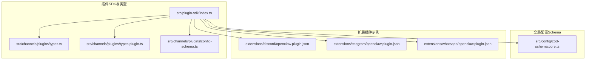
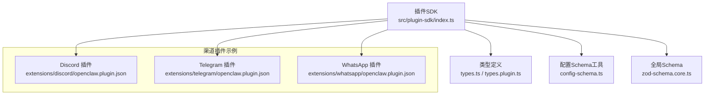
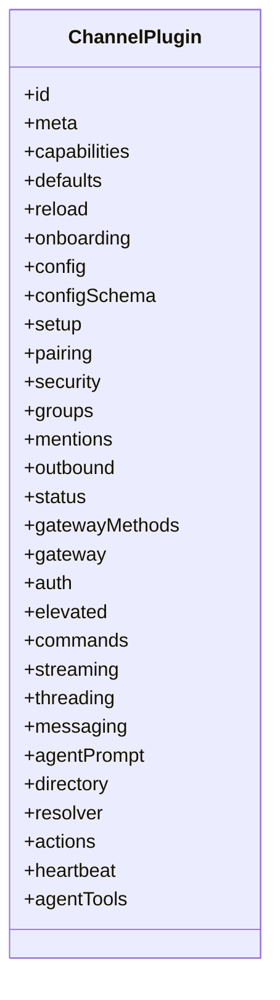
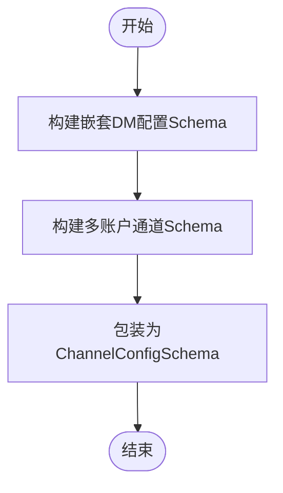
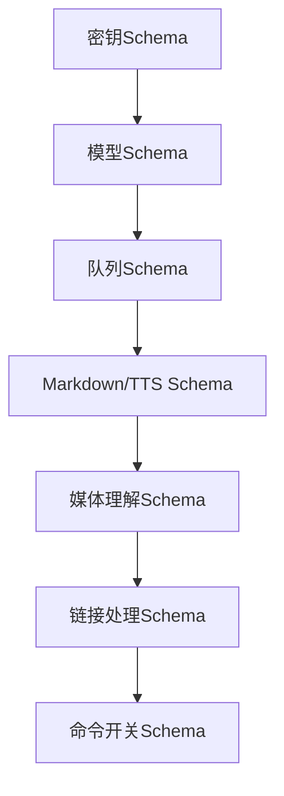
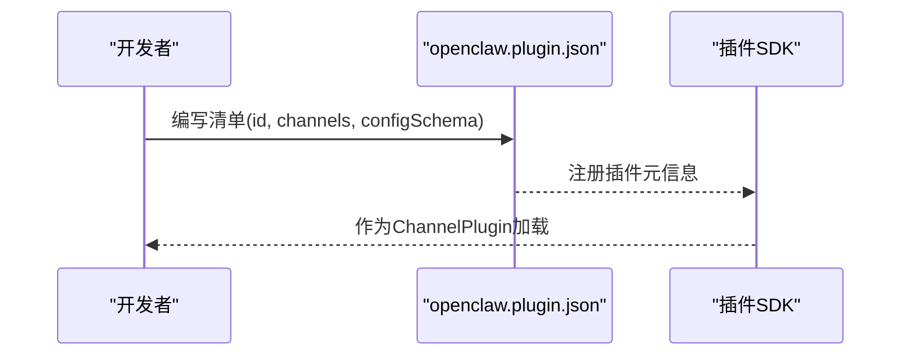
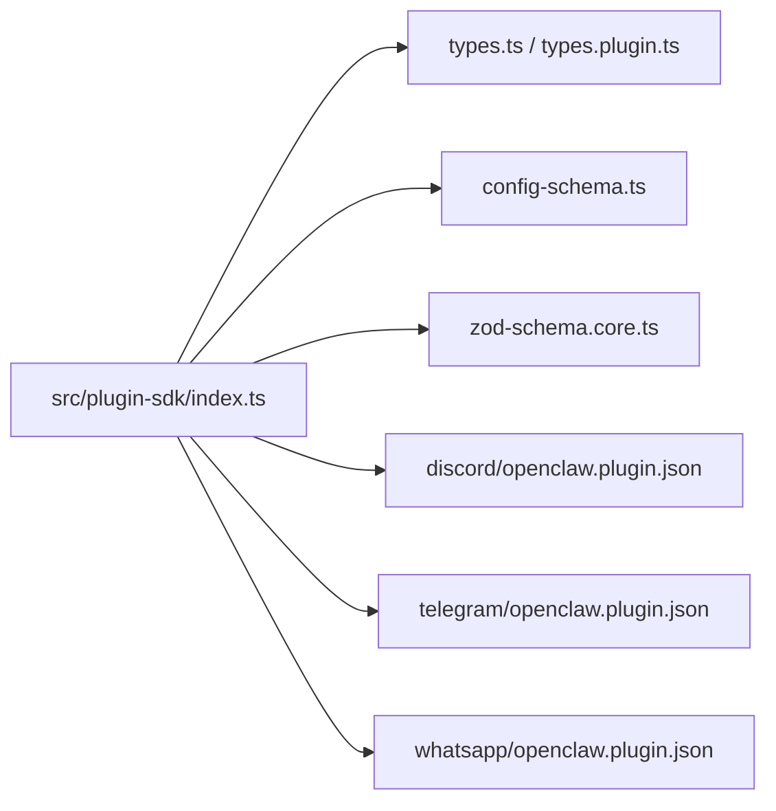

# 渠道插件开发

<cite>
**本文引用的文件**
- [src/plugin-sdk/index.ts](file://src/plugin-sdk/index.ts)
- [src/channels/plugins/types.ts](file://src/channels/plugins/types.ts)
- [src/channels/plugins/types.plugin.ts](file://src/channels/plugins/types.plugin.ts)
- [src/channels/plugins/config-schema.ts](file://src/channels/plugins/config-schema.ts)
- [src/config/zod-schema.core.ts](file://src/config/zod-schema.core.ts)
- [extensions/discord/openclaw.plugin.json](file://extensions/discord/openclaw.plugin.json)
- [extensions/telegram/openclaw.plugin.json](file://extensions/telegram/openclaw.plugin.json)
- [extensions/whatsapp/openclaw.plugin.json](file://extensions/whatsapp/openclaw.plugin.json)
</cite>

## 目录
1. [简介](#简介)
2. [项目结构](#项目结构)
3. [核心组件](#核心组件)
4. [架构总览](#架构总览)
5. [详细组件分析](#详细组件分析)
6. [依赖分析](#依赖分析)
7. [性能考虑](#性能考虑)
8. [故障排查指南](#故障排查指南)
9. [结论](#结论)
10. [附录](#附录)

## 简介
本指南面向为 OpenClaw 开发“渠道插件”的工程师与技术作者，系统性讲解插件开发规范、接口实现、配置管理、认证适配、消息处理、工具集成与状态管理等主题。文档以仓库中的插件 SDK、类型定义、配置 Schema 与现有渠道插件（如 Discord、Telegram、WhatsApp）为例，帮助你快速构建可维护、可扩展且符合 OpenClaw 设计约束的渠道适配层。

## 项目结构
OpenClaw 将“渠道插件”抽象为统一的插件契约与 SDK，通过标准化的适配器接口对接不同即时通讯平台。核心位置如下：
- 插件 SDK 与导出入口：src/plugin-sdk/index.ts
- 渠道插件类型定义：src/channels/plugins/types.ts、src/channels/plugins/types.plugin.ts
- 配置 Schema 构建工具：src/channels/plugins/config-schema.ts
- 全局配置 Schema（含密钥、队列、TTS、模型等）：src/config/zod-schema.core.ts
- 扩展插件清单样例：extensions/*/openclaw.plugin.json

**图示来源**
- [src/plugin-sdk/index.ts:1-826](file://src/plugin-sdk/index.ts#L1-L826)
- [src/channels/plugins/types.ts:1-66](file://src/channels/plugins/types.ts#L1-L66)
- [src/channels/plugins/types.plugin.ts:1-86](file://src/channels/plugins/types.plugin.ts#L1-L86)
- [src/channels/plugins/config-schema.ts:1-55](file://src/channels/plugins/config-schema.ts#L1-L55)
- [src/config/zod-schema.core.ts:1-732](file://src/config/zod-schema.core.ts#L1-L732)
- [extensions/discord/openclaw.plugin.json:1-10](file://extensions/discord/openclaw.plugin.json#L1-L10)
- [extensions/telegram/openclaw.plugin.json:1-10](file://extensions/telegram/openclaw.plugin.json#L1-L10)
- [extensions/whatsapp/openclaw.plugin.json:1-10](file://extensions/whatsapp/openclaw.plugin.json#L1-L10)

**章节来源**
- [src/plugin-sdk/index.ts:1-826](file://src/plugin-sdk/index.ts#L1-L826)
- [src/channels/plugins/types.ts:1-66](file://src/channels/plugins/types.ts#L1-L66)
- [src/channels/plugins/types.plugin.ts:1-86](file://src/channels/plugins/types.plugin.ts#L1-L86)
- [src/channels/plugins/config-schema.ts:1-55](file://src/channels/plugins/config-schema.ts#L1-L55)
- [src/config/zod-schema.core.ts:1-732](file://src/config/zod-schema.core.ts#L1-L732)
- [extensions/discord/openclaw.plugin.json:1-10](file://extensions/discord/openclaw.plugin.json#L1-L10)
- [extensions/telegram/openclaw.plugin.json:1-10](file://extensions/telegram/openclaw.plugin.json#L1-L10)
- [extensions/whatsapp/openclaw.plugin.json:1-10](file://extensions/whatsapp/openclaw.plugin.json#L1-L10)

## 核心组件
- 插件契约（ChannelPlugin）
  - 定义插件标识、元数据、能力集与可选的适配器集合（认证、网关、消息、分组、提及、安全、心跳、目录、解析器、动作、流式、线程、命令、代理提示、提升权限等）。
  - 支持配置 Schema 与 UI 提示、默认队列参数、重载前缀等。
- 适配器接口族
  - 认证与配对：ChannelAuthAdapter、ChannelPairingAdapter
  - 消息与线程：ChannelMessagingAdapter、ChannelThreadingAdapter
  - 分组与提及：ChannelGroupAdapter、ChannelMentionAdapter
  - 安全与状态：ChannelSecurityAdapter、ChannelStatusAdapter
  - 网关与命令：ChannelGatewayAdapter、ChannelCommandAdapter
  - 提升权限与代理工具：ChannelElevatedAdapter、agentTools
- 配置 Schema 工具
  - 构建嵌套 DM 配置、多账户通道 Schema、通用 JSON Schema 化封装。
- 全局配置 Schema
  - 密钥与密钥提供者、模型与兼容性、队列与去抖、Markdown/TTS、媒体理解、链接处理、命令开关等。

**章节来源**
- [src/channels/plugins/types.plugin.ts:49-86](file://src/channels/plugins/types.plugin.ts#L49-L86)
- [src/channels/plugins/types.ts:7-63](file://src/channels/plugins/types.ts#L7-L63)
- [src/channels/plugins/config-schema.ts:16-54](file://src/channels/plugins/config-schema.ts#L16-L54)
- [src/config/zod-schema.core.ts:263-732](file://src/config/zod-schema.core.ts#L263-L732)

## 架构总览
下图展示 OpenClaw 插件体系如何通过 SDK 统一接入各渠道，以及关键适配器之间的协作关系。

**图示来源**
- [src/plugin-sdk/index.ts:1-826](file://src/plugin-sdk/index.ts#L1-L826)
- [src/channels/plugins/types.ts:1-66](file://src/channels/plugins/types.ts#L1-L66)
- [src/channels/plugins/types.plugin.ts:1-86](file://src/channels/plugins/types.plugin.ts#L1-L86)
- [src/channels/plugins/config-schema.ts:1-55](file://src/channels/plugins/config-schema.ts#L1-L55)
- [src/config/zod-schema.core.ts:1-732](file://src/config/zod-schema.core.ts#L1-L732)
- [extensions/discord/openclaw.plugin.json:1-10](file://extensions/discord/openclaw.plugin.json#L1-L10)
- [extensions/telegram/openclaw.plugin.json:1-10](file://extensions/telegram/openclaw.plugin.json#L1-L10)
- [extensions/whatsapp/openclaw.plugin.json:1-10](file://extensions/whatsapp/openclaw.plugin.json#L1-L10)

## 详细组件分析

### 插件契约与适配器接口族
- 契约字段概览
  - id、meta、capabilities、defaults、reload
  - 可选适配器：onboarding、config、configSchema、setup、pairing、security、groups、mentions、outbound、status、gatewayMethods、gateway、auth、elevated、commands、streaming、threading、messaging、agentPrompt、directory、resolver、actions、heartbeat、agentTools
- 设计要点
  - 通过可选适配器表达渠道差异；未实现的适配器由运行时按需降级或报错。
  - defaults.queue.debounceMs 用于统一控制入站/出站节流。
  - reload.configPrefixes 用于热重载监听路径前缀。

**图示来源**
- [src/channels/plugins/types.plugin.ts:49-86](file://src/channels/plugins/types.plugin.ts#L49-L86)

**章节来源**
- [src/channels/plugins/types.plugin.ts:1-86](file://src/channels/plugins/types.plugin.ts#L1-L86)
- [src/channels/plugins/types.ts:1-66](file://src/channels/plugins/types.ts#L1-L66)

### 配置Schema与UI提示
- 构建嵌套 DM 配置：支持 enabled、policy、allowFrom
- 多账户通道 Schema：在账户对象上追加 accounts 与 defaultAccount
- 通用 Schema 化：将 Zod Schema 转换为 JSON Schema（Draft-07），兼容旧版本

**图示来源**
- [src/channels/plugins/config-schema.ts:16-54](file://src/channels/plugins/config-schema.ts#L16-L54)

**章节来源**
- [src/channels/plugins/config-schema.ts:1-55](file://src/channels/plugins/config-schema.ts#L1-L55)

### 全局配置Schema（密钥、队列、TTS、模型等）
- 密钥与密钥提供者：支持 env/file/exec 三类提供者，严格校验 ID 与路径安全性
- 模型与兼容性：模型定义、兼容性标记、成本与上下文窗口
- 队列与去抖：按渠道与全局维度设置队列模式、去抖毫秒数、丢弃策略
- Markdown/TTS：表格渲染模式、自动朗读开关与提供商配置
- 媒体理解与链接处理：CLI/Provider 模式、超时、语言、附件策略、模型列表
- 命令开关：原生命令与技能命令的启用策略

**图示来源**
- [src/config/zod-schema.core.ts:26-179](file://src/config/zod-schema.core.ts#L26-L179)
- [src/config/zod-schema.core.ts:254-492](file://src/config/zod-schema.core.ts#L254-L492)
- [src/config/zod-schema.core.ts:546-732](file://src/config/zod-schema.core.ts#L546-L732)

**章节来源**
- [src/config/zod-schema.core.ts:1-732](file://src/config/zod-schema.core.ts#L1-L732)

### 渠道插件清单与最小Schema
- 扩展清单字段：id、channels、configSchema
- 示例清单展示了空对象 Schema 的占位写法，便于后续扩展

**图示来源**
- [extensions/discord/openclaw.plugin.json:1-10](file://extensions/discord/openclaw.plugin.json#L1-L10)
- [extensions/telegram/openclaw.plugin.json:1-10](file://extensions/telegram/openclaw.plugin.json#L1-L10)
- [extensions/whatsapp/openclaw.plugin.json:1-10](file://extensions/whatsapp/openclaw.plugin.json#L1-L10)

**章节来源**
- [extensions/discord/openclaw.plugin.json:1-10](file://extensions/discord/openclaw.plugin.json#L1-L10)
- [extensions/telegram/openclaw.plugin.json:1-10](file://extensions/telegram/openclaw.plugin.json#L1-L10)
- [extensions/whatsapp/openclaw.plugin.json:1-10](file://extensions/whatsapp/openclaw.plugin.json#L1-L10)

## 依赖分析
- 插件 SDK 对类型与工具的依赖
  - 类型：ChannelPlugin、适配器接口、能力集、上下文类型
  - 工具：配置Schema构建、JSON Schema 化、密钥解析、队列与限流、SSRF/HTTP 限制、诊断事件、会话键、允许白名单匹配、回复负载构造、媒体加载、持久化去重、时间格式化、错误格式化等
- 渠道插件对全局Schema的依赖
  - 密钥、队列、Markdown/TTS、媒体理解、链接处理、命令开关等

**图示来源**
- [src/plugin-sdk/index.ts:1-826](file://src/plugin-sdk/index.ts#L1-L826)
- [src/channels/plugins/types.ts:1-66](file://src/channels/plugins/types.ts#L1-L66)
- [src/channels/plugins/types.plugin.ts:1-86](file://src/channels/plugins/types.plugin.ts#L1-L86)
- [src/channels/plugins/config-schema.ts:1-55](file://src/channels/plugins/config-schema.ts#L1-L55)
- [src/config/zod-schema.core.ts:1-732](file://src/config/zod-schema.core.ts#L1-L732)
- [extensions/discord/openclaw.plugin.json:1-10](file://extensions/discord/openclaw.plugin.json#L1-L10)
- [extensions/telegram/openclaw.plugin.json:1-10](file://extensions/telegram/openclaw.plugin.json#L1-L10)
- [extensions/whatsapp/openclaw.plugin.json:1-10](file://extensions/whatsapp/openclaw.plugin.json#L1-L10)

**章节来源**
- [src/plugin-sdk/index.ts:1-826](file://src/plugin-sdk/index.ts#L1-L826)

## 性能考虑
- 队列与去抖
  - 使用 defaults.queue.debounceMs 与按渠道去抖配置，避免风暴式消息导致下游拥塞。
  - 合理设置 cap 与 drop 策略，保障系统稳定性。
- 文本分块与媒体限制
  - 出站文本分块与媒体大小限制，减少单次传输失败与带宽浪费。
- 流式输出与合并
  - blockStreaming 与 blockStreamingCoalesce 控制流式响应节奏，降低网络抖动影响。
- 去重与幂等
  - 使用持久化去重缓存，避免重复处理同一入站消息。
- SSRF/HTTP 限制
  - 严格限制外部请求域名与协议，避免资源滥用与安全风险。

**章节来源**
- [src/config/zod-schema.core.ts:576-586](file://src/config/zod-schema.core.ts#L576-L586)
- [src/plugin-sdk/index.ts:357-358](file://src/plugin-sdk/index.ts#L357-L358)
- [src/plugin-sdk/index.ts:418-423](file://src/plugin-sdk/index.ts#L418-L423)
- [src/plugin-sdk/index.ts:440-452](file://src/plugin-sdk/index.ts#L440-L452)

## 故障排查指南
- 配置校验失败
  - 使用 buildChannelConfigSchema 生成 JSON Schema 并结合全局 Schema 进行校验；关注 allowFrom、dmPolicy、队列模式等字段。
- 密钥解析问题
  - 检查 SecretRef 与密钥提供者配置是否正确；确认执行命令绝对路径与安全策略。
- 响应慢或阻塞
  - 检查队列模式、去抖设置、流式合并参数；必要时开启 blockStreaming 或调整合并阈值。
- 媒体发送异常
  - 校验媒体大小上限、URL 可达性与 MIME 类型；使用媒体加载工具进行下载与格式化。
- 诊断事件
  - 启用诊断事件收集，定位入站/出站瓶颈与异常路径。

**章节来源**
- [src/channels/plugins/config-schema.ts:35-54](file://src/channels/plugins/config-schema.ts#L35-L54)
- [src/config/zod-schema.core.ts:148-179](file://src/config/zod-schema.core.ts#L148-L179)
- [src/plugin-sdk/index.ts:622-642](file://src/plugin-sdk/index.ts#L622-L642)

## 结论
通过统一的插件契约与 SDK，OpenClaw 为多渠道适配提供了清晰的扩展点与强约束的配置校验机制。遵循本文档的开发规范与最佳实践，你可以高效地实现新的渠道插件，并确保其在认证、消息、工具、状态与配置层面的一致性与可维护性。

## 附录

### 开发流程（概念步骤）
- 设计适配器接口映射：确定需要实现的适配器（认证、消息、线程、安全、状态等）
- 编写配置Schema：使用工具函数构建嵌套 DM 与多账户 Schema，并生成 JSON Schema
- 实现插件契约：填充 ChannelPlugin 字段，注册 agentTools（如有）
- 编写扩展清单：定义 id、channels、configSchema
- 集成全局Schema：复用密钥、队列、Markdown/TTS、媒体理解等配置
- 测试与调试：利用诊断事件与日志定位问题，优化性能参数

[本节为概念性内容，不直接分析具体文件]