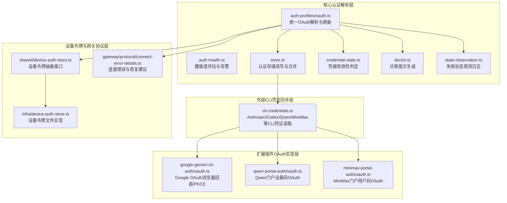
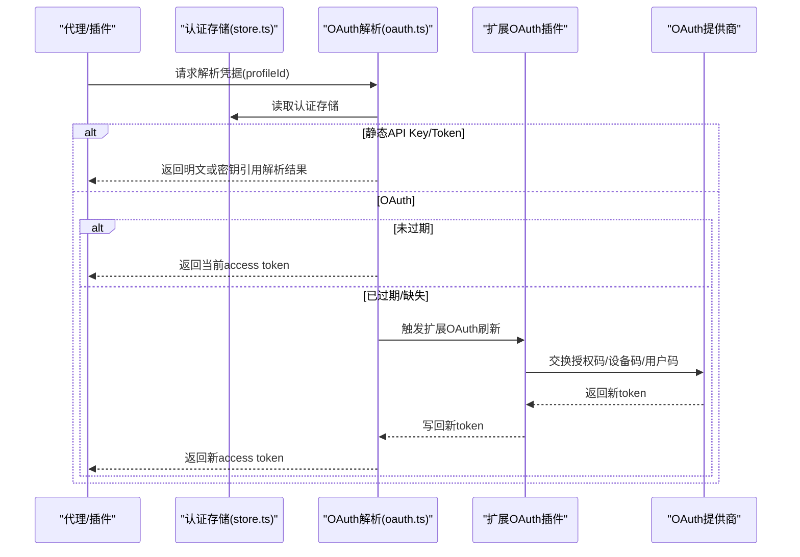
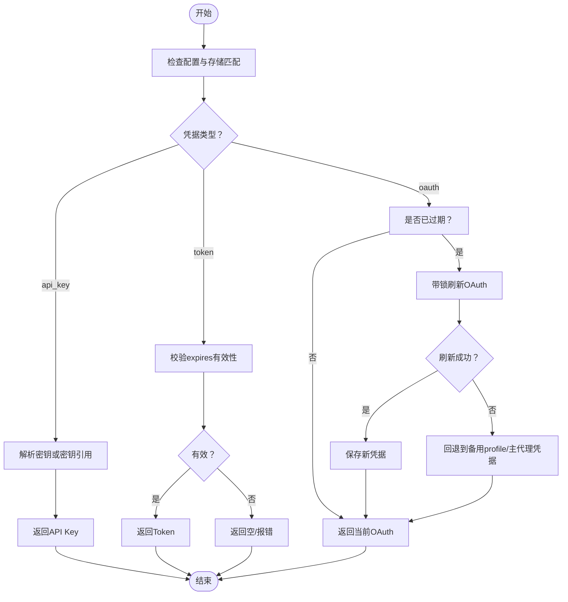
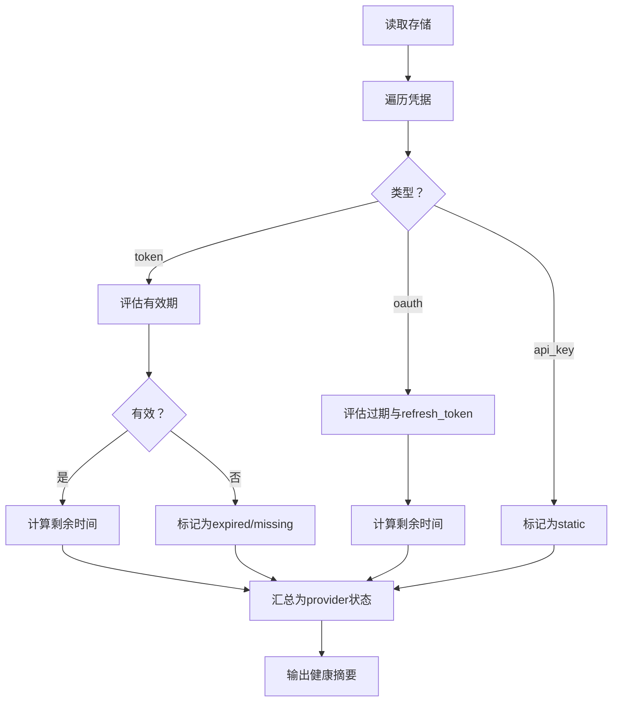
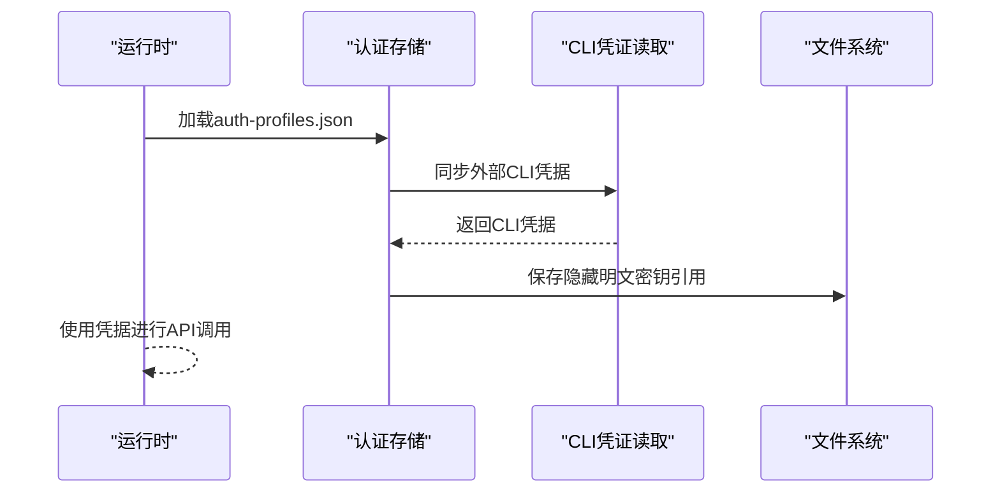
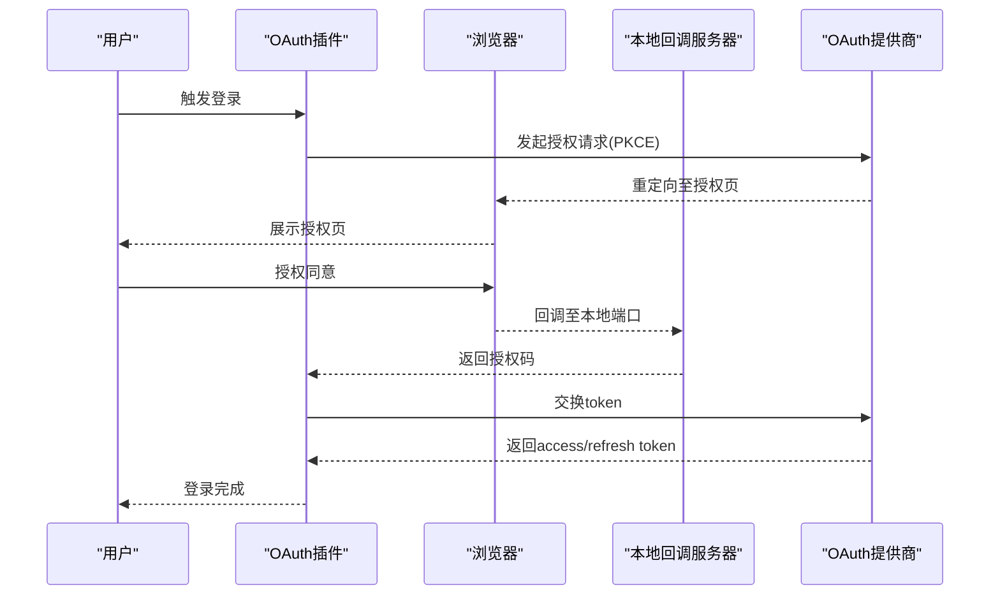
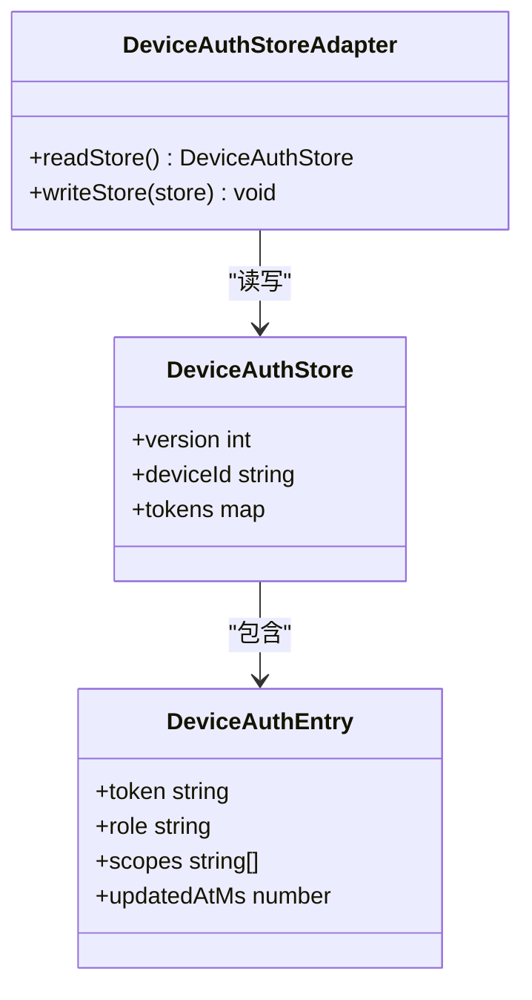
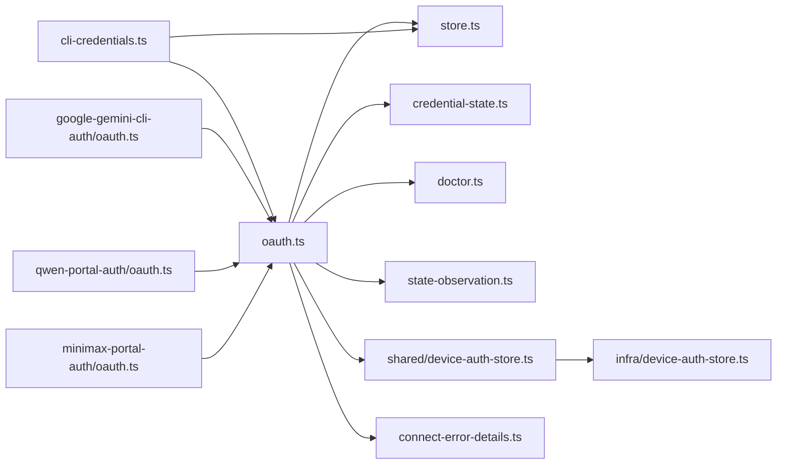

# 认证适配器

<cite>
**本文引用的文件**
- [oauth.ts](file://src/agents/auth-profiles/oauth.ts)
- [cli-credentials.ts](file://src/agents/cli-credentials.ts)
- [auth-health.ts](file://src/agents/auth-health.ts)
- [store.ts](file://src/agents/auth-profiles/store.ts)
- [credential-state.ts](file://src/agents/auth-profiles/credential-state.ts)
- [doctor.ts](file://src/agents/auth-profiles/doctor.ts)
- [state-observation.ts](file://src/agents/auth-profiles/state-observation.ts)
- [oauth.ts（Google Gemini CLI）](file://extensions/google-gemini-cli-auth/oauth.ts)
- [oauth.ts（Qwen 门户）](file://extensions/qwen-portal-auth/oauth.ts)
- [oauth.ts（MiniMax 门户）](file://extensions/minimax-portal-auth/oauth.ts)
- [twitch-client.ts](file://extensions/twitch/src/twitch-client.ts)
- [device-auth-store.ts（共享）](file://src/shared/device-auth-store.ts)
- [device-auth-store.ts（基础设施）](file://src/infra/device-auth-store.ts)
- [connect-error-details.ts](file://src/gateway/protocol/connect-error-details.ts)
- [auth-monitor.sh](file://scripts/auth-monitor.sh)
- [systemd/openclaw-auth-monitor.service](file://scripts/systemd/openclaw-auth-monitor.service)
- [systemd/openclaw-auth-monitor.timer](file://scripts/systemd/openclaw-auth-monitor.timer)
</cite>

## 目录
1. [简介](#简介)
2. [项目结构](#项目结构)
3. [核心组件](#核心组件)
4. [架构总览](#架构总览)
5. [详细组件分析](#详细组件分析)
6. [依赖关系分析](#依赖关系分析)
7. [性能考量](#性能考量)
8. [故障排查指南](#故障排查指南)
9. [结论](#结论)
10. [附录](#附录)

## 简介
本文件面向OpenClaw认证适配器的开发者与维护者，系统性阐述认证适配器的设计模式与实现原理，覆盖OAuth流程、API密钥管理、令牌刷新机制、认证状态与会话持久化、多账户支持、失败恢复与安全审计等主题。文档同时提供认证适配器开发模板与最佳实践，帮助在不同平台与提供商之间快速构建一致且安全的认证体验。

## 项目结构
OpenClaw的认证体系由“核心认证解析层”“外部CLI凭证同步层”“扩展插件OAuth实现层”“设备令牌与网关协议层”四部分组成，形成从配置到运行时的完整闭环。

图示来源
- [oauth.ts:1-488](file://src/agents/auth-profiles/oauth.ts#L1-L488)
- [cli-credentials.ts:1-573](file://src/agents/cli-credentials.ts#L1-L573)
- [auth-health.ts:1-284](file://src/agents/auth-health.ts#L1-L284)
- [store.ts:1-510](file://src/agents/auth-profiles/store.ts#L1-L510)
- [credential-state.ts:1-75](file://src/agents/auth-profiles/credential-state.ts#L1-L75)
- [doctor.ts:1-48](file://src/agents/auth-profiles/doctor.ts#L1-L48)
- [state-observation.ts:1-59](file://src/agents/auth-profiles/state-observation.ts#L1-L59)
- [oauth.ts（Google Gemini CLI）:1-735](file://extensions/google-gemini-cli-auth/oauth.ts#L1-L735)
- [oauth.ts（Qwen 门户）:1-183](file://extensions/qwen-portal-auth/oauth.ts#L1-L183)
- [oauth.ts（MiniMax 门户）:1-245](file://extensions/minimax-portal-auth/oauth.ts#L1-L245)
- [device-auth-store.ts（共享）:1-79](file://src/shared/device-auth-store.ts#L1-L79)
- [device-auth-store.ts（基础设施）:47-94](file://src/infra/device-auth-store.ts#L47-L94)
- [connect-error-details.ts:28-49](file://src/gateway/protocol/connect-error-details.ts#L28-L49)

章节来源
- [oauth.ts:1-488](file://src/agents/auth-profiles/oauth.ts#L1-L488)
- [cli-credentials.ts:1-573](file://src/agents/cli-credentials.ts#L1-L573)
- [auth-health.ts:1-284](file://src/agents/auth-health.ts#L1-L284)
- [store.ts:1-510](file://src/agents/auth-profiles/store.ts#L1-L510)
- [credential-state.ts:1-75](file://src/agents/auth-profiles/credential-state.ts#L1-L75)
- [doctor.ts:1-48](file://src/agents/auth-profiles/doctor.ts#L1-L48)
- [state-observation.ts:1-59](file://src/agents/auth-profiles/state-observation.ts#L1-L59)
- [oauth.ts（Google Gemini CLI）:1-735](file://extensions/google-gemini-cli-auth/oauth.ts#L1-L735)
- [oauth.ts（Qwen 门户）:1-183](file://extensions/qwen-portal-auth/oauth.ts#L1-L183)
- [oauth.ts（MiniMax 门户）:1-245](file://extensions/minimax-portal-auth/oauth.ts#L1-L245)
- [device-auth-store.ts（共享）:1-79](file://src/shared/device-auth-store.ts#L1-L79)
- [device-auth-store.ts（基础设施）:47-94](file://src/infra/device-auth-store.ts#L47-L94)
- [connect-error-details.ts:28-49](file://src/gateway/protocol/connect-error-details.ts#L28-L49)

## 核心组件
- 统一OAuth解析与刷新：负责从认证存储中解析凭据、兼容不同模式（api_key/token/oauth）、在过期或缺失时触发刷新，并保证并发安全。
- 健康度评估：对OAuth与静态凭据进行状态评估，输出“ok/expiring/expired/missing/static”等状态，用于诊断与自动修复。
- 存储与合并：支持主/子代理的认证存储合并、只读运行时加载、外部CLI工具同步，以及安全落盘（隐藏明文密钥引用）。
- 凭据有效性判定：对token型凭据的expires字段进行合法性校验，避免无效或过期令牌被使用。
- 诊断与提示：针对常见问题生成可操作的修复建议，辅助用户自助排障。
- 失败状态观测：记录认证失败的冷却/禁用窗口变化，便于审计与自动化恢复策略。
- 扩展插件OAuth：提供Google Gemini CLI、Qwen门户、MiniMax门户等不同OAuth流程的实现（浏览器回调/PKCE、设备码、用户码）。
- 设备令牌与网关协议：抽象设备令牌存储与读取，定义连接错误恢复建议，支撑网关侧认证失败后的降级与重试。

章节来源
- [oauth.ts:305-487](file://src/agents/auth-profiles/oauth.ts#L305-L487)
- [auth-health.ts:80-184](file://src/agents/auth-health.ts#L80-L184)
- [store.ts:443-509](file://src/agents/auth-profiles/store.ts#L443-L509)
- [credential-state.ts:34-74](file://src/agents/auth-profiles/credential-state.ts#L34-L74)
- [doctor.ts:8-47](file://src/agents/auth-profiles/doctor.ts#L8-L47)
- [state-observation.ts:8-58](file://src/agents/auth-profiles/state-observation.ts#L8-L58)
- [oauth.ts（Google Gemini CLI）:659-734](file://extensions/google-gemini-cli-auth/oauth.ts#L659-L734)
- [oauth.ts（Qwen 门户）:132-182](file://extensions/qwen-portal-auth/oauth.ts#L132-L182)
- [oauth.ts（MiniMax 门户）:184-244](file://extensions/minimax-portal-auth/oauth.ts#L184-L244)
- [device-auth-store.ts（共享）:9-79](file://src/shared/device-auth-store.ts#L9-L79)
- [device-auth-store.ts（基础设施）:47-94](file://src/infra/device-auth-store.ts#L47-L94)
- [connect-error-details.ts:28-49](file://src/gateway/protocol/connect-error-details.ts#L28-L49)

## 架构总览
OpenClaw认证适配器采用“集中式存储 + 分布式刷新”的设计：认证信息统一存放在auth-profiles.json中，按provider与profileId组织；运行时通过锁保护的读写操作访问；对于OAuth，首次调用API时触发自动刷新；扩展插件提供多种OAuth流程以适配不同提供商。

图示来源
- [store.ts:443-509](file://src/agents/auth-profiles/store.ts#L443-L509)
- [oauth.ts:213-252](file://src/agents/auth-profiles/oauth.ts#L213-L252)
- [oauth.ts（Google Gemini CLI）:659-734](file://extensions/google-gemini-cli-auth/oauth.ts#L659-L734)
- [oauth.ts（Qwen 门户）:132-182](file://extensions/qwen-portal-auth/oauth.ts#L132-L182)
- [oauth.ts（MiniMax 门户）:184-244](file://extensions/minimax-portal-auth/oauth.ts#L184-L244)

## 详细组件分析

### 组件A：统一OAuth解析与刷新（oauth.ts）
- 职责
  - 解析配置与存储中的凭据，兼容api_key/token/oauth三种模式。
  - 在凭据过期或缺失时，按provider选择对应刷新路径（内置或扩展插件）。
  - 并发安全：使用文件锁确保同一时间仅一个进程刷新。
  - 主/子代理凭据继承：子代理可继承主代理的最新OAuth凭据。
  - 降级与回退：刷新失败时尝试回退到备用profile或主代理凭据。
- 关键流程
  - resolveApiKeyForProfile：根据配置与存储决定返回类型与值。
  - refreshOAuthTokenWithLock：带锁刷新OAuth token。
  - adoptNewerMainOAuthCredential：从主代理复制更新的凭据。
- 错误处理
  - 刷新失败时生成可诊断的错误消息与修复提示。
  - 对特定provider（如openai-codex）提供特殊回退逻辑。

图示来源
- [oauth.ts:305-487](file://src/agents/auth-profiles/oauth.ts#L305-L487)
- [credential-state.ts:34-74](file://src/agents/auth-profiles/credential-state.ts#L34-L74)
- [store.ts:443-509](file://src/agents/auth-profiles/store.ts#L443-L509)

章节来源
- [oauth.ts:305-487](file://src/agents/auth-profiles/oauth.ts#L305-L487)
- [credential-state.ts:34-74](file://src/agents/auth-profiles/credential-state.ts#L34-L74)
- [store.ts:443-509](file://src/agents/auth-profiles/store.ts#L443-L509)

### 组件B：健康度评估与自动修复（auth-health.ts）
- 职责
  - 将存储中的凭据转换为可读的健康状态报告。
  - 对OAuth与token型凭据分别计算剩余有效期与状态。
  - 提供“provider级别”的聚合状态（ok/expiring/expired/missing/static）。
- 特性
  - 对带refresh_token的OAuth凭据，若已过期但可自动刷新，则不标记为警告。
  - 支持按provider过滤与排序，便于批量诊断。

图示来源
- [auth-health.ts:98-184](file://src/agents/auth-health.ts#L98-L184)
- [auth-health.ts:187-283](file://src/agents/auth-health.ts#L187-L283)

章节来源
- [auth-health.ts:98-184](file://src/agents/auth-health.ts#L98-L184)
- [auth-health.ts:187-283](file://src/agents/auth-health.ts#L187-L283)

### 组件C：认证存储与外部CLI同步（store.ts、cli-credentials.ts）
- 职责
  - 加载/保存auth-profiles.json，支持主/子代理合并与只读运行时加载。
  - 同步外部CLI工具（Anthropic/Codex/Qwen/MiniMax）的凭据，优先使用CLI缓存与密钥链。
  - 安全落盘：当凭据包含密钥引用时，保存时不暴露明文。
- 外部CLI同步
  - Claude/Codex/Qwen/MiniMax等CLI工具的凭据读取与缓存，支持跨平台与键值对写入。

图示来源
- [store.ts:346-441](file://src/agents/auth-profiles/store.ts#L346-L441)
- [cli-credentials.ts:224-332](file://src/agents/cli-credentials.ts#L224-L332)

章节来源
- [store.ts:346-441](file://src/agents/auth-profiles/store.ts#L346-L441)
- [cli-credentials.ts:224-332](file://src/agents/cli-credentials.ts#L224-L332)

### 组件D：扩展插件OAuth实现（Google/Qwen/MiniMax）
- Google Gemini CLI OAuth
  - 流程：PKCE + 本地回调服务器，支持远程/VPS环境的手动粘贴URL。
  - 功能：自动发现客户端ID/Secret、获取用户邮箱与项目ID、负载均衡多个后端。
- Qwen门户OAuth
  - 流程：设备码OAuth，用户在门户输入一次性验证码完成授权。
- MiniMax门户OAuth
  - 流程：用户码OAuth，用户在门户输入一次性验证码完成授权。
- 共同特性
  - 统一使用PKCE与安全的HTTP客户端封装。
  - 明确的轮询策略与超时控制，保障用户体验。

图示来源
- [oauth.ts（Google Gemini CLI）:659-734](file://extensions/google-gemini-cli-auth/oauth.ts#L659-L734)
- [oauth.ts（Qwen 门户）:132-182](file://extensions/qwen-portal-auth/oauth.ts#L132-L182)
- [oauth.ts（MiniMax 门户）:184-244](file://extensions/minimax-portal-auth/oauth.ts#L184-L244)

章节来源
- [oauth.ts（Google Gemini CLI）:659-734](file://extensions/google-gemini-cli-auth/oauth.ts#L659-L734)
- [oauth.ts（Qwen 门户）:132-182](file://extensions/qwen-portal-auth/oauth.ts#L132-L182)
- [oauth.ts（MiniMax 门户）:184-244](file://extensions/minimax-portal-auth/oauth.ts#L184-L244)

### 组件E：设备令牌与网关协议（device-auth-store.ts、connect-error-details.ts）
- 设备令牌抽象
  - 提供统一的读取/写入/清理接口，屏蔽平台差异。
- 网关连接错误
  - 定义连接错误码与恢复建议（如使用设备令牌重试、更新认证配置等），指导自动化恢复。

图示来源
- [device-auth-store.ts（共享）:9-79](file://src/shared/device-auth-store.ts#L9-L79)
- [device-auth-store.ts（基础设施）:47-94](file://src/infra/device-auth-store.ts#L47-L94)
- [connect-error-details.ts:28-49](file://src/gateway/protocol/connect-error-details.ts#L28-L49)

章节来源
- [device-auth-store.ts（共享）:9-79](file://src/shared/device-auth-store.ts#L9-L79)
- [device-auth-store.ts（基础设施）:47-94](file://src/infra/device-auth-store.ts#L47-L94)
- [connect-error-details.ts:28-49](file://src/gateway/protocol/connect-error-details.ts#L28-L49)

## 依赖关系分析
- 模块耦合
  - oauth.ts高度依赖store.ts与credential-state.ts，用于读取与校验凭据。
  - doctor.ts与state-observation.ts为上层诊断与可观测性提供支持。
  - 扩展插件oauth.ts独立于核心逻辑，通过统一接口接入。
- 外部依赖
  - 扩展插件依赖HTTP客户端封装与PKCE工具，确保安全与跨平台兼容。
- 循环依赖
  - 未见循环依赖迹象；各模块职责清晰，接口稳定。

图示来源
- [oauth.ts:1-488](file://src/agents/auth-profiles/oauth.ts#L1-L488)
- [store.ts:1-510](file://src/agents/auth-profiles/store.ts#L1-L510)
- [credential-state.ts:1-75](file://src/agents/auth-profiles/credential-state.ts#L1-L75)
- [doctor.ts:1-48](file://src/agents/auth-profiles/doctor.ts#L1-L48)
- [state-observation.ts:1-59](file://src/agents/auth-profiles/state-observation.ts#L1-L59)
- [cli-credentials.ts:1-573](file://src/agents/cli-credentials.ts#L1-L573)
- [oauth.ts（Google Gemini CLI）:1-735](file://extensions/google-gemini-cli-auth/oauth.ts#L1-L735)
- [oauth.ts（Qwen 门户）:1-183](file://extensions/qwen-portal-auth/oauth.ts#L1-L183)
- [oauth.ts（MiniMax 门户）:1-245](file://extensions/minimax-portal-auth/oauth.ts#L1-L245)
- [device-auth-store.ts（共享）:1-79](file://src/shared/device-auth-store.ts#L1-L79)
- [device-auth-store.ts（基础设施）:47-94](file://src/infra/device-auth-store.ts#L47-L94)
- [connect-error-details.ts:28-49](file://src/gateway/protocol/connect-error-details.ts#L28-L49)

章节来源
- [oauth.ts:1-488](file://src/agents/auth-profiles/oauth.ts#L1-L488)
- [store.ts:1-510](file://src/agents/auth-profiles/store.ts#L1-L510)
- [credential-state.ts:1-75](file://src/agents/auth-profiles/credential-state.ts#L1-L75)
- [doctor.ts:1-48](file://src/agents/auth-profiles/doctor.ts#L1-L48)
- [state-observation.ts:1-59](file://src/agents/auth-profiles/state-observation.ts#L1-L59)
- [cli-credentials.ts:1-573](file://src/agents/cli-credentials.ts#L1-L573)
- [oauth.ts（Google Gemini CLI）:1-735](file://extensions/google-gemini-cli-auth/oauth.ts#L1-L735)
- [oauth.ts（Qwen 门户）:1-183](file://extensions/qwen-portal-auth/oauth.ts#L1-L183)
- [oauth.ts（MiniMax 门户）:1-245](file://extensions/minimax-portal-auth/oauth.ts#L1-L245)
- [device-auth-store.ts（共享）:1-79](file://src/shared/device-auth-store.ts#L1-L79)
- [device-auth-store.ts（基础设施）:47-94](file://src/infra/device-auth-store.ts#L47-L94)
- [connect-error-details.ts:28-49](file://src/gateway/protocol/connect-error-details.ts#L28-L49)

## 性能考量
- 并发与锁
  - 使用文件锁保护认证存储的读写与刷新，避免竞态条件，降低冲突概率。
- 缓存与延迟
  - CLI凭据读取提供缓存（TTL），减少频繁系统调用与磁盘IO。
- 轮询与超时
  - 设备码/用户码OAuth设置合理的轮询间隔与超时，平衡用户体验与资源消耗。
- 存储合并
  - 主/子代理合并策略避免重复加载与冗余写入，提升启动与运行时性能。

## 故障排查指南
- 常见问题定位
  - 健康度报告：使用健康度评估快速识别“expired/expiring/missing/static”状态。
  - 诊断提示：doctor模块生成修复建议，如切换profile或执行修复命令。
  - 失败观测：state-observation记录失败状态变更，便于审计与自动化恢复。
- 自动化监控
  - 提供auth-monitor脚本与systemd定时任务，定期扫描与修复认证问题。
- 连接错误恢复
  - 网关协议定义了连接错误码与恢复建议，指导使用设备令牌或更新配置。

章节来源
- [auth-health.ts:187-283](file://src/agents/auth-health.ts#L187-L283)
- [doctor.ts:8-47](file://src/agents/auth-profiles/doctor.ts#L8-L47)
- [state-observation.ts:8-58](file://src/agents/auth-profiles/state-observation.ts#L8-L58)
- [auth-monitor.sh](file://scripts/auth-monitor.sh)
- [openclaw-auth-monitor.service](file://scripts/systemd/openclaw-auth-monitor.service)
- [openclaw-auth-monitor.timer](file://scripts/systemd/openclaw-auth-monitor.timer)
- [connect-error-details.ts:28-49](file://src/gateway/protocol/connect-error-details.ts#L28-L49)

## 结论
OpenClaw认证适配器通过统一的解析与刷新机制、完善的健康度评估与诊断提示、灵活的扩展插件OAuth实现，以及设备令牌与网关协议的协同，实现了跨平台、跨提供商的一致认证体验。配合自动化监控与可观测性，能够有效提升系统的稳定性与可维护性。

## 附录

### 开发模板与最佳实践
- 设计模式
  - 抽象与实现分离：共享接口（shared/device-auth-store.ts）与平台实现（infra/device-auth-store.ts）解耦。
  - 插件化OAuth：扩展插件遵循统一的PKCE与轮询策略，便于新增提供商。
- 安全存储
  - 优先使用密钥引用而非明文存储；落盘前移除明文字段。
  - CLI凭据读取支持平台密钥链与文件两种方式，优先密钥链。
- 错误处理
  - 刷新失败时生成可诊断的错误消息与修复提示；必要时回退到备用profile或主代理凭据。
- 用户体验
  - 提供健康度报告与自动修复建议；对远程/VPS环境提供手动粘贴URL的降级路径。
- 会话持久化与多账户
  - 通过profileId区分多账户；主/子代理凭据继承与合并策略确保一致性。
- 安全审计
  - 记录认证失败状态变更与关键事件，结合日志脱敏策略，满足审计要求。

### 认证方式实现要点
- CLI认证
  - Anthropic/Codex/Qwen/MiniMax等CLI工具的凭据读取与缓存，支持跨平台与键值对写入。
- 门户认证
  - Google Gemini CLI：浏览器回调/PKCE；Qwen门户：设备码；MiniMax门户：用户码。
- 直接API密钥认证
  - 通过配置与密钥引用解析，直接返回API Key；适用于无需OAuth的场景。

章节来源
- [cli-credentials.ts:224-332](file://src/agents/cli-credentials.ts#L224-L332)
- [oauth.ts（Google Gemini CLI）:659-734](file://extensions/google-gemini-cli-auth/oauth.ts#L659-L734)
- [oauth.ts（Qwen 门户）:132-182](file://extensions/qwen-portal-auth/oauth.ts#L132-L182)
- [oauth.ts（MiniMax 门户）:184-244](file://extensions/minimax-portal-auth/oauth.ts#L184-L244)
- [store.ts:484-509](file://src/agents/auth-profiles/store.ts#L484-L509)