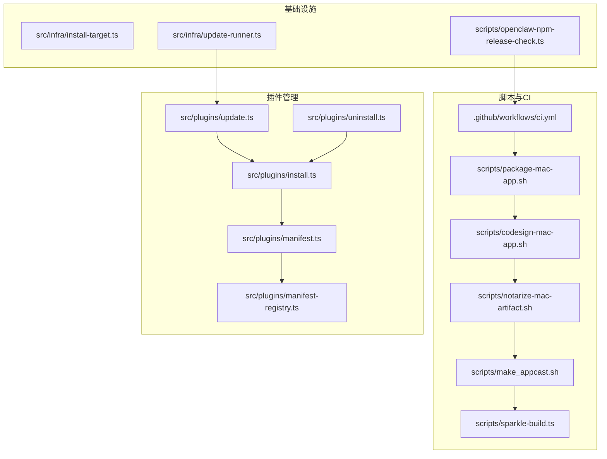
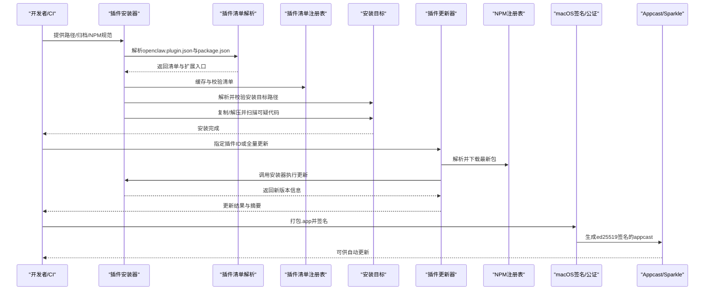
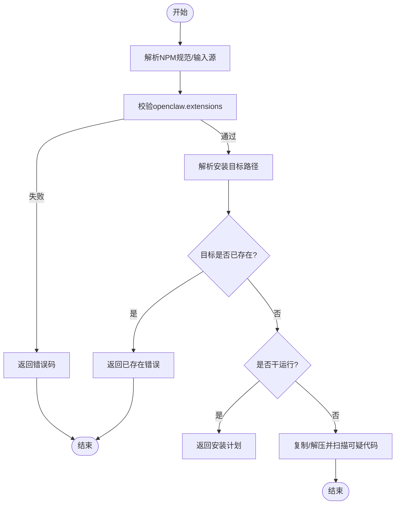
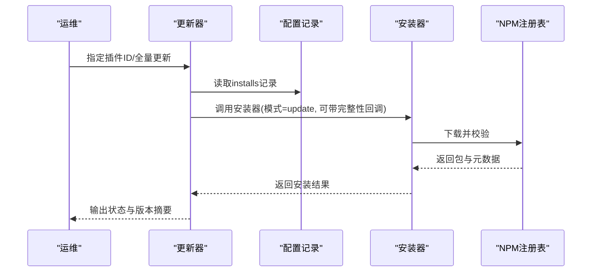
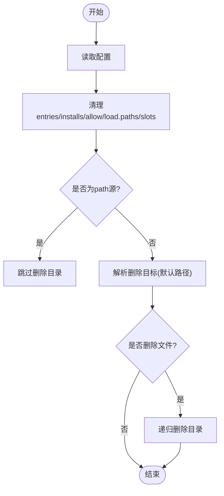
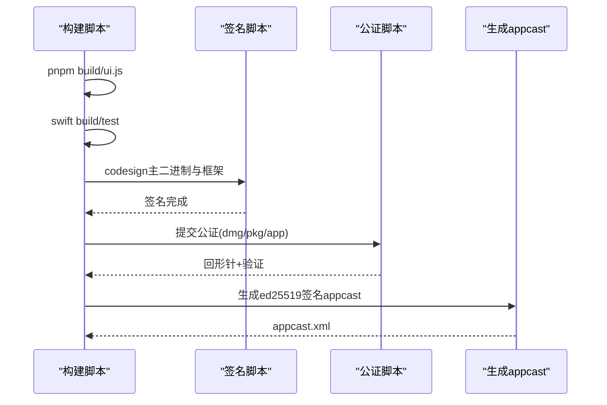
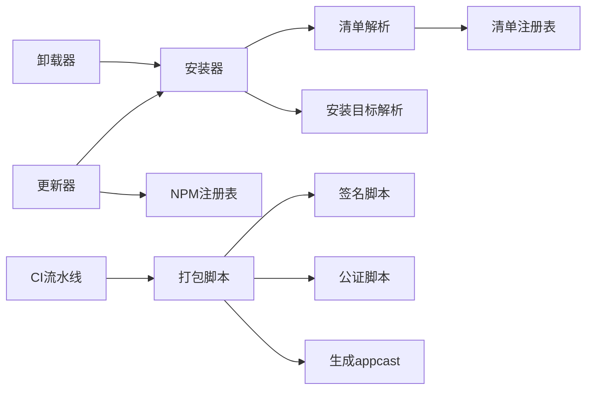

# 部署与打包

<cite>
**本文引用的文件**
- [scripts/package-mac-app.sh](file://scripts/package-mac-app.sh)
- [.github/workflows/ci.yml](file://.github/workflows/ci.yml)
- [src/plugins/install.ts](file://src/plugins/install.ts)
- [src/plugins/update.ts](file://src/plugins/update.ts)
- [src/plugins/uninstall.ts](file://src/plugins/uninstall.ts)
- [scripts/codesign-mac-app.sh](file://scripts/codesign-mac-app.sh)
- [scripts/notarize-mac-artifact.sh](file://scripts/notarize-mac-artifact.sh)
- [scripts/make_appcast.sh](file://scripts/make_appcast.sh)
- [scripts/sparkle-build.ts](file://scripts/sparkle-build.ts)
- [src/infra/install-package-dir.test.ts](file://src/infra/install-package-dir.test.ts)
- [src/plugins/install.test.ts](file://src/plugins/install.test.ts)
- [src/plugins/update.test.ts](file://src/plugins/update.test.ts)
- [src/plugins/manifest.ts](file://src/plugins/manifest.ts)
- [src/plugins/manifest-registry.ts](file://src/plugins/manifest-registry.ts)
- [src/infra/update-runner.ts](file://src/infra/update-runner.ts)
- [scripts/openclaw-npm-release-check.ts](file://scripts/openclaw-npm-release-check.ts)
- [src/infra/install-target.ts](file://src/infra/install-target.ts)
- [src/commands/uninstall.test.ts](file://src/commands/uninstall.test.ts)
- [apps/android/app/src/main/java/ai/openclaw/app/node/DebugHandler.kt](file://apps/android/app/src/main/java/ai/openclaw/app/node/DebugHandler.kt)
- [extensions/voice-call/src/webhook-security.ts](file://extensions/voice-call/src/webhook-security.ts)
- [src/infra/device-identity.ts](file://src/infra/device-identity.ts)
</cite>

## 目录
1. [简介](#简介)
2. [项目结构](#项目结构)
3. [核心组件](#核心组件)
4. [架构总览](#架构总览)
5. [详细组件分析](#详细组件分析)
6. [依赖关系分析](#依赖关系分析)
7. [性能考虑](#性能考虑)
8. [故障排查指南](#故障排查指南)
9. [结论](#结论)
10. [附录](#附录)

## 简介
本指南面向OpenClaw渠道插件的运维团队，系统化阐述插件的打包、发布、安装、更新与卸载流程，以及版本管理、依赖处理、兼容性校验、完整性与安全校验、分发渠道与安装包管理最佳实践、监控与健康检查、故障恢复策略，以及性能监控与容量规划建议。内容基于仓库中的脚本、测试与源码实现进行提炼与可视化呈现，帮助读者在不同平台（macOS、Android等）与不同生命周期阶段（开发、测试、发布、运维）高效落地。

## 项目结构
OpenClaw采用多语言混合工程：Node/TypeScript负责核心逻辑与插件管理；Swift用于macOS应用；Kotlin用于Android节点调试；GitHub Actions支撑CI流水线；脚本工具链覆盖打包、签名、公证、自动更新与发布校验。

图示来源
- [.github/workflows/ci.yml](file://.github/workflows/ci.yml)
- [scripts/package-mac-app.sh](file://scripts/package-mac-app.sh)
- [scripts/codesign-mac-app.sh](file://scripts/codesign-mac-app.sh)
- [scripts/notarize-mac-artifact.sh](file://scripts/notarize-mac-artifact.sh)
- [scripts/make_appcast.sh](file://scripts/make_appcast.sh)
- [scripts/sparkle-build.ts](file://scripts/sparkle-build.ts)
- [src/plugins/install.ts](file://src/plugins/install.ts)
- [src/plugins/update.ts](file://src/plugins/update.ts)
- [src/plugins/uninstall.ts](file://src/plugins/uninstall.ts)
- [src/plugins/manifest.ts](file://src/plugins/manifest.ts)
- [src/plugins/manifest-registry.ts](file://src/plugins/manifest-registry.ts)
- [src/infra/install-target.ts](file://src/infra/install-target.ts)
- [src/infra/update-runner.ts](file://src/infra/update-runner.ts)
- [scripts/openclaw-npm-release-check.ts](file://scripts/openclaw-npm-release-check.ts)

章节来源
- [.github/workflows/ci.yml](file://.github/workflows/ci.yml)
- [scripts/package-mac-app.sh](file://scripts/package-mac-app.sh)

## 核心组件
- 插件安装器：支持从目录、归档、NPM规范安装，含扩展入口校验、依赖扫描、目标路径解析与可用性检查、超时控制与干运行模式。
- 插件更新器：按配置记录对已安装NPM插件执行就地更新，支持完整性漂移回调、干运行探测、通道同步（开发/发布）。
- 插件卸载器：清理配置项、允许列表、加载路径、内存槽位，并可选择删除安装目录（受安全边界保护）。
- macOS打包与分发：构建.app、嵌入Sparkle框架、签名、公证、生成appcast与ed25519签名，支持自动更新。
- 版本与发布校验：CalVer格式校验、标签与版本一致性检查、发布内容检查。
- 安全与完整性：NPM包完整性校验、Webhook签名验证（Ed25519/Twilio/Plivo）、设备签名验证、代码扫描告警。

章节来源
- [src/plugins/install.ts](file://src/plugins/install.ts)
- [src/plugins/update.ts](file://src/plugins/update.ts)
- [src/plugins/uninstall.ts](file://src/plugins/uninstall.ts)
- [scripts/package-mac-app.sh](file://scripts/package-mac-app.sh)
- [scripts/codesign-mac-app.sh](file://scripts/codesign-mac-app.sh)
- [scripts/notarize-mac-artifact.sh](file://scripts/notarize-mac-artifact.sh)
- [scripts/make_appcast.sh](file://scripts/make_appcast.sh)
- [scripts/sparkle-build.ts](file://scripts/sparkle-build.ts)
- [scripts/openclaw-npm-release-check.ts](file://scripts/openclaw-npm-release-check.ts)
- [src/plugins/manifest.ts](file://src/plugins/manifest.ts)
- [src/plugins/manifest-registry.ts](file://src/plugins/manifest-registry.ts)
- [src/infra/install-target.ts](file://src/infra/install-target.ts)
- [src/infra/update-runner.ts](file://src/infra/update-runner.ts)
- [extensions/voice-call/src/webhook-security.ts](file://extensions/voice-call/src/webhook-security.ts)
- [src/infra/device-identity.ts](file://src/infra/device-identity.ts)

## 架构总览
下图展示插件从安装到更新、卸载的关键流程与交互点，以及与CI、签名与公证、自动更新机制的衔接。

图示来源
- [src/plugins/install.ts](file://src/plugins/install.ts)
- [src/plugins/manifest.ts](file://src/plugins/manifest.ts)
- [src/plugins/manifest-registry.ts](file://src/plugins/manifest-registry.ts)
- [src/plugins/update.ts](file://src/plugins/update.ts)
- [scripts/package-mac-app.sh](file://scripts/package-mac-app.sh)
- [scripts/codesign-mac-app.sh](file://scripts/codesign-mac-app.sh)
- [scripts/make_appcast.sh](file://scripts/make_appcast.sh)

## 详细组件分析

### 组件A：插件安装流程（安装器）
- 关键职责
  - 校验openclaw.extensions存在且非空，避免无入口导致无法加载。
  - 解析并校验NPM规范，仅支持受信注册表规范。
  - 解析安装目标目录，确保路径安全与未占用。
  - 支持从目录、归档、文件三种输入源安装。
  - 对扩展入口进行安全扫描（可疑模式告警），不阻断安装。
  - 支持干运行模式，便于预检。
- 错误码与异常
  - 不支持的NPM规范、缺失openclaw.extensions、空扩展列表、包不存在、ID不匹配等。
- 性能与可靠性
  - 超时控制、异步复制、归档提取、边界文件读取，避免阻塞与越界。

图示来源
- [src/plugins/install.ts](file://src/plugins/install.ts)
- [src/infra/install-target.ts](file://src/infra/install-target.ts)

章节来源
- [src/plugins/install.ts](file://src/plugins/install.ts)
- [src/infra/install-target.ts](file://src/infra/install-target.ts)
- [src/plugins/install.test.ts](file://src/plugins/install.test.ts)

### 组件B：插件更新流程（更新器）
- 关键职责
  - 基于配置记录逐个插件执行更新，支持干运行探测当前/下一版本。
  - 对NPM安装的插件执行完整性漂移回调，允许运维决策是否接受变更。
  - 支持通道同步：开发通道优先本地捆绑源，发布通道保持稳定。
- 干运行与完整性
  - 干运行仅探测，不写入；对精确版本spec保留完整性校验。
- 结果汇总
  - 返回每个插件的状态（已更新/未变更/跳过/错误）与版本号。

图示来源
- [src/plugins/update.ts](file://src/plugins/update.ts)
- [src/plugins/install.ts](file://src/plugins/install.ts)

章节来源
- [src/plugins/update.ts](file://src/plugins/update.ts)
- [src/plugins/update.test.ts](file://src/plugins/update.test.ts)

### 组件C：插件卸载流程（卸载器）
- 关键职责
  - 清理配置：entries、installs、allow、load.paths、slots。
  - 安全删除：仅对非链接（非path源）插件删除安装目录；默认路径优先于用户配置路径。
  - 行为可审计：返回动作清单与警告（如删除失败）。
- 测试与推荐
  - 单测覆盖“卸载前建议备份”提示与服务模式卸载不触发备份建议。

图示来源
- [src/plugins/uninstall.ts](file://src/plugins/uninstall.ts)
- [src/commands/uninstall.test.ts](file://src/commands/uninstall.test.ts)

章节来源
- [src/plugins/uninstall.ts](file://src/plugins/uninstall.ts)
- [src/commands/uninstall.test.ts](file://src/commands/uninstall.test.ts)

### 组件D：macOS打包与自动更新
- 打包步骤
  - 构建JS/UI、编译Swift、复制资源、合并Sparkle框架、签名、嵌入ed25519公钥与自动更新配置。
- 签名与公证
  - 自动选择证书、深度签名Sparkle框架、校验Team ID一致性、可选时间戳。
- 公证与回形针
  - 提交公证、对dmg/pkg与.app执行回形针与验证。
- Appcast生成
  - 使用ed25519私钥生成appcast，内嵌发布说明HTML，输出至根目录。

图示来源
- [scripts/package-mac-app.sh](file://scripts/package-mac-app.sh)
- [scripts/codesign-mac-app.sh](file://scripts/codesign-mac-app.sh)
- [scripts/notarize-mac-artifact.sh](file://scripts/notarize-mac-artifact.sh)
- [scripts/make_appcast.sh](file://scripts/make_appcast.sh)
- [scripts/sparkle-build.ts](file://scripts/sparkle-build.ts)

章节来源
- [scripts/package-mac-app.sh](file://scripts/package-mac-app.sh)
- [scripts/codesign-mac-app.sh](file://scripts/codesign-mac-app.sh)
- [scripts/notarize-mac-artifact.sh](file://scripts/notarize-mac-artifact.sh)
- [scripts/make_appcast.sh](file://scripts/make_appcast.sh)
- [scripts/sparkle-build.ts](file://scripts/sparkle-build.ts)

### 组件E：版本管理与发布校验
- CalVer格式与日期窗口校验、标签与package.json一致性检查、发布内容检查。
- CI中通过pnpm release:check与校验脚本联动，确保发布合规。

章节来源
- [scripts/openclaw-npm-release-check.ts](file://scripts/openclaw-npm-release-check.ts)
- [.github/workflows/ci.yml](file://.github/workflows/ci.yml)

### 组件F：安全与完整性校验
- NPM包完整性：安装前解析元数据，支持完整性漂移回调，拒绝不一致包。
- Webhook签名：支持Ed25519、Twilio、Plivo等多种签名算法与重放检测。
- 设备签名：支持PEM与Base64Url两种公钥格式，统一验证流程。

章节来源
- [src/plugins/install.ts](file://src/plugins/install.ts)
- [src/plugins/install.test.ts](file://src/plugins/install.test.ts)
- [extensions/voice-call/src/webhook-security.ts](file://extensions/voice-call/src/webhook-security.ts)
- [src/infra/device-identity.ts](file://src/infra/device-identity.ts)

## 依赖关系分析
- 插件安装器依赖清单解析与清单注册表缓存，确保manifest与package.json一致性；同时依赖安装目标解析与边界文件读取，保障路径安全。
- 更新器依赖安装器执行更新，同时与NPM注册表交互；支持通道同步以切换捆绑源或npm源。
- 卸载器依赖安装器解析默认安装路径，避免误删非默认位置。
- CI流水线驱动打包、签名、公证与发布校验，形成闭环。

图示来源
- [src/plugins/install.ts](file://src/plugins/install.ts)
- [src/plugins/manifest.ts](file://src/plugins/manifest.ts)
- [src/plugins/manifest-registry.ts](file://src/plugins/manifest-registry.ts)
- [src/plugins/update.ts](file://src/plugins/update.ts)
- [.github/workflows/ci.yml](file://.github/workflows/ci.yml)
- [scripts/package-mac-app.sh](file://scripts/package-mac-app.sh)
- [scripts/codesign-mac-app.sh](file://scripts/codesign-mac-app.sh)
- [scripts/notarize-mac-artifact.sh](file://scripts/notarize-mac-artifact.sh)
- [scripts/make_appcast.sh](file://scripts/make_appcast.sh)

章节来源
- [src/plugins/install.ts](file://src/plugins/install.ts)
- [src/plugins/manifest.ts](file://src/plugins/manifest.ts)
- [src/plugins/manifest-registry.ts](file://src/plugins/manifest-registry.ts)
- [src/plugins/update.ts](file://src/plugins/update.ts)
- [src/plugins/uninstall.ts](file://src/plugins/uninstall.ts)
- [.github/workflows/ci.yml](file://.github/workflows/ci.yml)

## 性能考虑
- 安装/更新超时与并发：安装器支持超时参数，避免长时间阻塞；CI中Windows测试通过分片降低并发压力。
- 扫描与验证开销：安全扫描为告警型，不影响安装主流程；签名与公证为离散步骤，可在CI中并行化。
- Sparkle合并与架构：多架构合并使用lipo，减少重复构建成本；CFBundleVersion需为数字以便比较。
- 依赖安装：更新器在更新前先探测，干运行可避免不必要的依赖安装。

章节来源
- [src/plugins/install.ts](file://src/plugins/install.ts)
- [.github/workflows/ci.yml](file://.github/workflows/ci.yml)
- [scripts/package-mac-app.sh](file://scripts/package-mac-app.sh)

## 故障排查指南
- 安装失败
  - openclaw.extensions缺失或为空：检查package.json与openclaw.plugin.json一致性。
  - 路径越界或目标已存在：确认插件ID与安装边界，避免硬链接与非法路径。
  - NPM包不存在或规范不受支持：核对NPM规范与注册表可达性。
- 更新失败
  - 完整性漂移：根据回调决定是否接受新版本；干运行可预判差异。
  - 通道切换问题：开发通道优先捆绑源，发布通道保持稳定。
- 卸载失败
  - 删除失败：查看警告信息，确认权限与磁盘空间；必要时手动清理。
- macOS签名与公证
  - 证书选择与Team ID不一致：按脚本提示修正；ad-hoc签名权限不会持久。
  - 公证失败：检查凭证与网络；对dmg/pkg执行回形针与验证。
- Webhook与设备签名
  - Ed25519签名验证失败：检查公钥、时间戳与重放缓存；确认请求头与URL变体。
  - 设备签名：支持PEM与Base64Url两种格式，统一验证流程。

章节来源
- [src/plugins/install.ts](file://src/plugins/install.ts)
- [src/plugins/install.test.ts](file://src/plugins/install.test.ts)
- [src/plugins/update.ts](file://src/plugins/update.ts)
- [src/plugins/uninstall.ts](file://src/plugins/uninstall.ts)
- [scripts/codesign-mac-app.sh](file://scripts/codesign-mac-app.sh)
- [scripts/notarize-mac-artifact.sh](file://scripts/notarize-mac-artifact.sh)
- [extensions/voice-call/src/webhook-security.ts](file://extensions/voice-call/src/webhook-security.ts)
- [src/infra/device-identity.ts](file://src/infra/device-identity.ts)

## 结论
本指南将OpenClaw插件的部署与打包流程系统化为可操作的运维手册：从安装、更新、卸载到签名、公证与自动更新，再到版本与安全校验，均以仓库现有脚本与源码为依据。建议在生产环境严格执行完整性校验、签名与公证流程，结合CI发布校验与干运行更新策略，确保稳定性与可追溯性。

## 附录
- 最佳实践清单
  - 版本管理：遵循CalVer与标签一致性规则，发布前执行release:check。
  - 依赖处理：在更新前先干运行探测，避免不必要的依赖安装。
  - 兼容性检查：多架构合并后验证Sparkle与资源完整性。
  - 分发渠道：使用ed25519签名的appcast，启用自动更新；对dmg/pkg执行公证与回形针。
  - 安全扫描：对插件源码进行可疑模式扫描，出现critical告警需人工复核。
  - 监控与健康检查：结合心跳间隔与全局钩子，确保插件生命周期事件正确处理。
  - 故障恢复：对签名失败、公证失败、Webhook签名失败建立明确回退与报警机制。