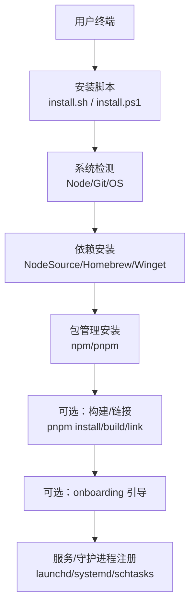
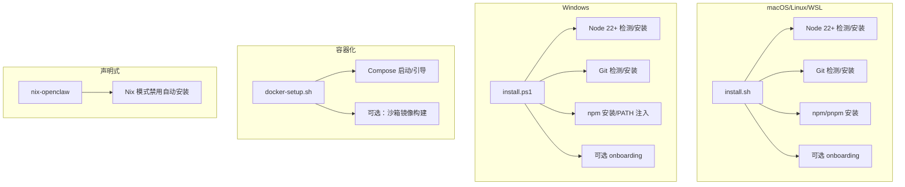
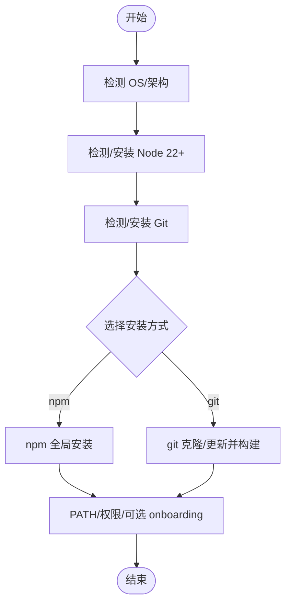
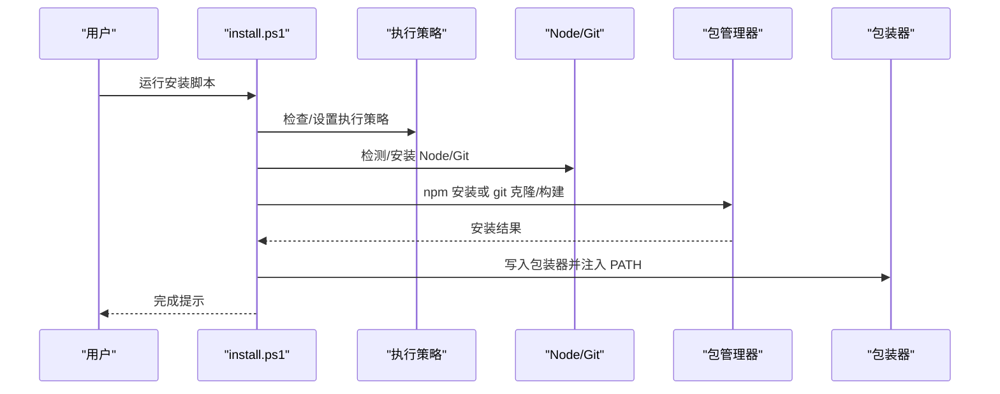
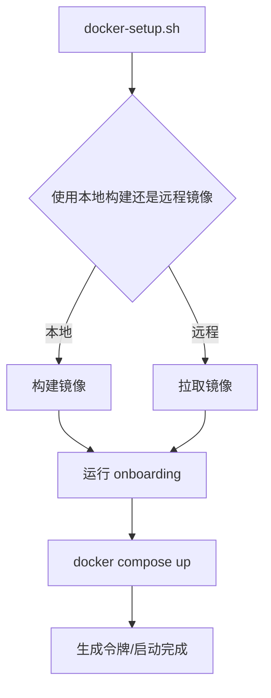
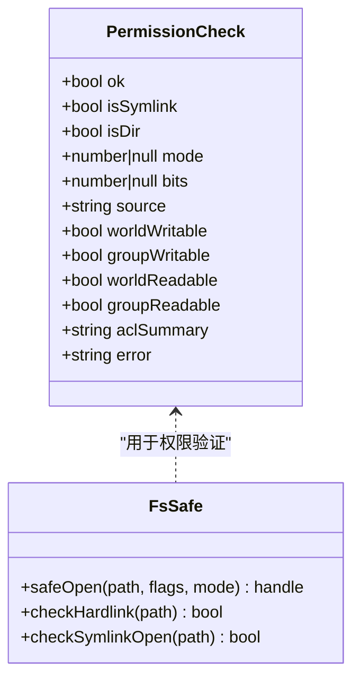
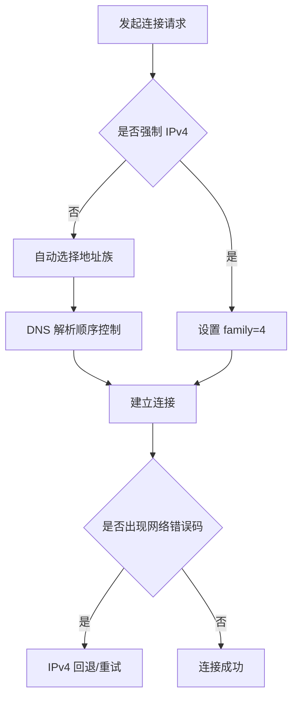
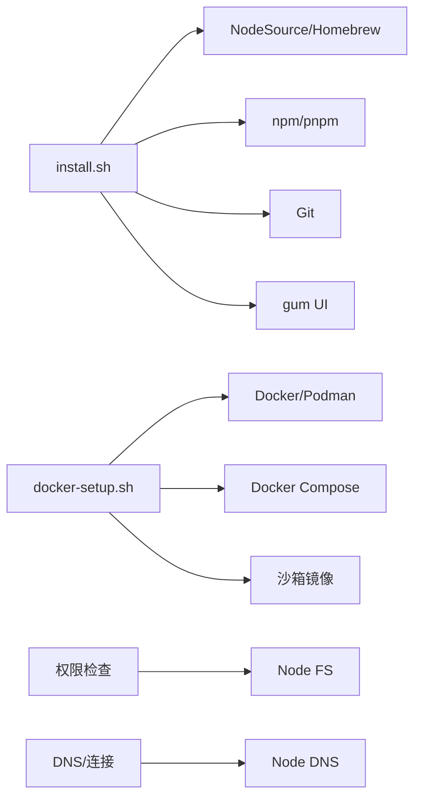

# 安装问题

<cite>
**本文引用的文件**
- [scripts/install.sh](file://scripts/install.sh)
- [scripts/install.ps1](file://scripts/install.ps1)
- [docs/install/index.md](file://docs/install/index.md)
- [docs/install/docker.md](file://docs/install/docker.md)
- [docs/install/nix.md](file://docs/install/nix.md)
- [docs/install/uninstall.md](file://docs/install/uninstall.md)
- [docs/install/installer.md](file://docs/install/installer.md)
- [src/daemon/runtime-paths.ts](file://src/daemon/runtime-paths.ts)
- [src/telegram/fetch.ts](file://src/telegram/fetch.ts)
- [src/infra/fs-safe.ts](file://src/infra/fs-safe.ts)
- [src/security/audit-fs.ts](file://src/security/audit-fs.ts)
- [src/daemon/systemd.test.ts](file://src/daemon/systemd.test.ts)
- [src/agents/skills-install-output.ts](file://src/agents/skills-install-output.ts)
- [Dockerfile](file://Dockerfile)
- [docker-setup.sh](file://docker-setup.sh)
- [scripts/e2e/onboard-docker.sh](file://scripts/e2e/onboard-docker.sh)
- [scripts/e2e/qr-import-docker.sh](file://scripts/e2e/qr-import-docker.sh)
- [scripts/shell-helpers/clawdock-helpers.sh](file://scripts/shell-helpers/clawdock-helpers.sh)
- [docs/help/troubleshooting.md](file://docs/help/troubleshooting.md)
</cite>

## 目录
1. [简介](#简介)
2. [项目结构](#项目结构)
3. [核心组件](#核心组件)
4. [架构总览](#架构总览)
5. [详细组件分析](#详细组件分析)
6. [依赖关系分析](#依赖关系分析)
7. [性能考量](#性能考量)
8. [故障排除指南](#故障排除指南)
9. [结论](#结论)
10. [附录](#附录)

## 简介
本指南聚焦于 OpenClaw 的安装问题，覆盖系统兼容性、依赖缺失、权限与路径、网络连接、容器与沙箱、以及卸载与回滚等常见障碍。文档基于仓库内安装脚本、安装文档与故障排除文档，提供面向不同操作系统（macOS、Windows、Linux）与安装方式（Docker、Nix、直接安装）的诊断与修复步骤，并给出安装前检查清单、预检步骤与回滚策略。

## 项目结构
OpenClaw 提供多条安装路径：官方脚本（install.sh、install.ps1）、包管理器（npm/pnpm）、源码构建、容器化（Docker/Podman）、声明式安装（Nix），以及卸载与迁移文档。安装脚本会自动检测系统环境、安装 Node 与 Git、执行 npm/pnpm 安装、并在必要时引导 onboarding 流程。

图表来源
- [scripts/install.sh:67-88](file://scripts/install.sh#L67-L88)
- [scripts/install.ps1:248-264](file://scripts/install.ps1#L248-L264)
- [docs/install/installer.md:67-88](file://docs/install/installer.md#L67-L88)

章节来源
- [docs/install/index.md:14-219](file://docs/install/index.md#L14-L219)
- [docs/install/installer.md:10-406](file://docs/install/installer.md#L10-L406)

## 核心组件
- 安装脚本与自动化
  - install.sh：macOS/Linux/WSL 主推脚本，负责 Node/Git 检测与安装、npm/pnpm 安装、onboarding、PATH 与权限处理。
  - install.ps1：Windows 脚本，负责 Node/Git 检测与安装、npm/git 安装、PATH 注入与执行策略处理。
- 容器化与沙箱
  - Docker/Podman：提供容器化网关与端到端 smoke 测试；支持额外挂载、持久化卷、浏览器沙箱镜像。
  - Sandbox：非主会话工具在 Docker 隔离容器中执行，支持网络限制、资源限制与自动修剪。
- 权限与安全
  - 文件权限检查与 ACL 验证，确保敏感文件不被其他用户读写。
  - 安全路径打开与硬链接/符号链接保护。
- 网络与 DNS
  - Telegram 连接选项与 IPv4 回退规则，DNS 结果顺序控制与超时配置。
- 升级与卸载
  - 内置卸载命令与跨平台服务移除步骤；Nix 模式下禁用自动安装以实现可复现性与回滚。

章节来源
- [scripts/install.sh:1252-1300](file://scripts/install.sh#L1252-L1300)
- [docs/install/docker.md:1-844](file://docs/install/docker.md#L1-L844)
- [src/security/audit-fs.ts:62-96](file://src/security/audit-fs.ts#L62-L96)
- [src/infra/fs-safe.ts:418-452](file://src/infra/fs-safe.ts#L418-L452)
- [src/telegram/fetch.ts:107-138](file://src/telegram/fetch.ts#L107-L138)
- [docs/install/uninstall.md:1-129](file://docs/install/uninstall.md#L1-L129)
- [docs/install/nix.md:46-99](file://docs/install/nix.md#L46-L99)

## 架构总览
安装流程在不同平台上的关键差异与共同点如下：

图表来源
- [scripts/install.sh:67-88](file://scripts/install.sh#L67-L88)
- [scripts/install.ps1:248-264](file://scripts/install.ps1#L248-L264)
- [docs/install/docker.md:35-125](file://docs/install/docker.md#L35-L125)
- [docs/install/nix.md:46-81](file://docs/install/nix.md#L46-L81)

## 详细组件分析

### 组件 A：安装脚本（install.sh）
- 功能要点
  - 自动检测 OS 与架构，下载并校验 gum UI 工具（若可用）。
  - 检测 Node 版本，必要时通过 NodeSource 或 Homebrew 安装 Node 22+。
  - 自动安装 Git；对 npm 失败场景自动尝试安装构建工具（make/cmake/gcc 等）。
  - 支持 npm 与 git 两种安装方式；默认 npm 全局安装；git 方式生成本地 wrapper。
  - 输出 npm 失败诊断（错误码、syscall、errno、调试日志路径、首行错误）。
- 关键流程图

图表来源
- [scripts/install.sh:67-88](file://scripts/install.sh#L67-L88)
- [scripts/install.sh:784-800](file://scripts/install.sh#L784-L800)

章节来源
- [scripts/install.sh:1252-1300](file://scripts/install.sh#L1252-L1300)
- [scripts/install.sh:568-672](file://scripts/install.sh#L568-L672)
- [scripts/install.sh:743-782](file://scripts/install.sh#L743-L782)
- [docs/install/installer.md:67-88](file://docs/install/installer.md#L67-L88)

### 组件 B：安装脚本（install.ps1）
- 功能要点
  - 检查 PowerShell 执行策略，必要时设置为 RemoteSigned（当前进程）。
  - 检测 Node 与 Git，按 winget/choco/scoop 顺序尝试安装 Node。
  - 支持 npm 与 git 两种安装方式；git 安装后生成 .cmd 包装器。
  - 将 npm prefix 目录加入用户 PATH，便于全局命令可用。
- 序列图（安装流程）

图表来源
- [scripts/install.ps1:56-80](file://scripts/install.ps1#L56-L80)
- [scripts/install.ps1:151-162](file://scripts/install.ps1#L151-L162)
- [scripts/install.ps1:202-258](file://scripts/install.ps1#L202-L258)

章节来源
- [scripts/install.ps1:102-149](file://scripts/install.ps1#L102-L149)
- [scripts/install.ps1:202-258](file://scripts/install.ps1#L202-L258)
- [docs/install/installer.md:248-264](file://docs/install/installer.md#L248-L264)

### 组件 C：容器化与沙箱（Docker/Podman）
- 功能要点
  - docker-setup.sh：一键构建/拉取镜像、运行 onboarding、启动网关、生成令牌。
  - 支持额外挂载、命名卷、apt 包、扩展依赖预装、Docker CLI 可选安装。
  - 沙箱：非主会话工具在隔离容器中执行，支持网络 none、资源限制、自动修剪。
  - 健康检查与端点探测；提供 ClawDock 辅助脚本简化日常操作。
- 流程图（容器化安装）

图表来源
- [docs/install/docker.md:35-125](file://docs/install/docker.md#L35-L125)
- [docs/install/docker.md:149-205](file://docs/install/docker.md#L149-L205)
- [Dockerfile:173-203](file://Dockerfile#L173-L203)

章节来源
- [docs/install/docker.md:1-844](file://docs/install/docker.md#L1-L844)
- [docker-setup.sh](file://docker-setup.sh)
- [scripts/shell-helpers/clawdock-helpers.sh](file://scripts/shell-helpers/clawdock-helpers.sh)

### 组件 D：权限与安全（文件系统与 ACL）
- 功能要点
  - 安全打开文件：禁止符号链接打开、禁止硬链接、要求常规文件类型。
  - 权限检查：POSIX 模式下检查所有者 UID，Windows 下检查 ACL 并提供摘要。
  - 敏感文件权限过宽将触发错误，避免世界可读/写风险。
- 类图（权限与安全）

图表来源
- [src/security/audit-fs.ts:62-96](file://src/security/audit-fs.ts#L62-L96)
- [src/infra/fs-safe.ts:418-452](file://src/infra/fs-safe.ts#L418-L452)

章节来源
- [src/security/audit-fs.ts:62-96](file://src/security/audit-fs.ts#L62-L96)
- [src/infra/fs-safe.ts:418-452](file://src/infra/fs-safe.ts#L418-L452)

### 组件 E：网络与 DNS（Telegram 连接）
- 功能要点
  - 支持强制 IPv4、自动选择地址族、DNS 结果顺序控制（ipv4first/verbatim）。
  - 对已知网络错误码进行回退重试策略，提升弱网环境稳定性。
- 流程图（DNS 与连接选项）

图表来源
- [src/telegram/fetch.ts:107-138](file://src/telegram/fetch.ts#L107-L138)
- [src/telegram/fetch.ts:43-70](file://src/telegram/fetch.ts#L43-L70)

章节来源
- [src/telegram/fetch.ts:107-138](file://src/telegram/fetch.ts#L107-L138)
- [src/telegram/fetch.ts:43-70](file://src/telegram/fetch.ts#L43-L70)

## 依赖关系分析
- 安装脚本依赖系统工具链（curl/wget、tar、gum、NodeSource/Homebrew、包管理器）。
- 容器化依赖 Docker/Podman 与 Compose；沙箱镜像依赖 Docker CLI。
- 权限与安全模块依赖 Node FS 与平台特定能力（POSIX UID/Windows ACL）。
- 网络模块依赖 Node DNS 与底层网络栈。

图表来源
- [scripts/install.sh:140-217](file://scripts/install.sh#L140-L217)
- [docs/install/docker.md:35-125](file://docs/install/docker.md#L35-L125)
- [src/security/audit-fs.ts:30-61](file://src/security/audit-fs.ts#L30-L61)
- [src/telegram/fetch.ts:79-105](file://src/telegram/fetch.ts#L79-L105)

章节来源
- [scripts/install.sh:140-217](file://scripts/install.sh#L140-L217)
- [docs/install/docker.md:35-125](file://docs/install/docker.md#L35-L125)
- [src/security/audit-fs.ts:30-61](file://src/security/audit-fs.ts#L30-L61)
- [src/telegram/fetch.ts:79-105](file://src/telegram/fetch.ts#L79-L105)

## 性能考量
- 容器镜像构建缓存：将依赖层前置，避免锁文件变更时重复安装。
- 沙箱资源限制：通过内存、CPU、PID 限制与 seccomp/AppArmor 降低攻击面。
- DNS 顺序与回退：减少解析失败导致的重试延迟。
- 日志与健康检查：容器健康探针与深度健康快照有助于快速定位异常。

## 故障排除指南

### 通用症状与诊断
- 症状：安装后命令不可用
  - 排查：确认 npm prefix/bin 是否在 PATH 中；Windows 需要将 npm prefix 加入用户 PATH。
  - 参考：[安装文档 - PATH 诊断:181-204](file://docs/install/index.md#L181-L204)
- 症状：npm 安装失败
  - 排查：查看 npm 错误码、syscall、errno、调试日志路径与首行错误。
  - 自动修复：脚本可自动安装构建工具（make/cmake/gcc 等）后重试。
  - 参考：[install.sh 诊断函数:743-782](file://scripts/install.sh#L743-L782)、[npm 失败摘要:33-40](file://src/agents/skills-install-output.ts#L33-L40)
- 症状：sharp/libvips 构建失败
  - 排查：系统已安装 libvips 导致 sharp 试图链接系统库。
  - 修复：设置环境变量忽略全局 libvips。
  - 参考：[安装文档 - sharp 说明:76-90](file://docs/install/index.md#L76-L90)
- 症状：Windows 执行策略限制
  - 排查：执行策略为 Restricted/AllSigned。
  - 修复：设置为 RemoteSigned（当前进程或本地机器），或以管理员身份运行。
  - 参考：[install.ps1 执行策略处理:56-80](file://scripts/install.ps1#L56-L80)
- 症状：Windows “openclaw 不是内部或外部命令”
  - 排查：npm prefix 未加入 PATH。
  - 修复：添加 npm prefix 到用户 PATH 并重启终端。
  - 参考：[install.ps1 PATH 注入:312-318](file://scripts/install.ps1#L312-L318)
- 症状：Linux EACCES 权限错误
  - 排查：npm 全局前缀指向 root 所有路径。
  - 修复：切换到用户目录前缀并追加 PATH。
  - 参考：[安装文档 - EACCES 说明:369-371](file://docs/install/installer.md#L369-L371)
- 症状：系统 Node 版本过低
  - 排查：Node 版本低于 22.12。
  - 修复：使用 NodeSource 或 Homebrew 安装 Node 22+。
  - 参考：[Node 版本检测:1252-1300](file://scripts/install.sh#L1252-L1300)、[系统 Node 解析:109-123](file://src/daemon/runtime-paths.ts#L109-L123)
- 症状：PATH 未包含全局二进制目录
  - 排查：输出 npm prefix 并检查 PATH。
  - 修复：将 $(npm prefix -g)/bin 追加到 PATH。
  - 参考：[安装文档 - PATH 诊断:181-204](file://docs/install/index.md#L181-L204)

### 系统兼容性与平台特定问题
- macOS
  - Xcode 命令行工具缺失会导致构建失败；脚本会提示安装并等待就绪。
  - 参考：[install.sh macOS 构建工具安装:622-654](file://scripts/install.sh#L622-L654)
- Linux
  - 不同发行版使用不同包管理器（apt/pacman/dnf/yum/apk），脚本自动识别并安装构建工具。
  - 参考：[install.sh Linux 构建工具安装:568-620](file://scripts/install.sh#L568-L620)
- Windows
  - 需要 PowerShell 5+；Git 缺失时脚本会提示安装链接。
  - 参考：[install.ps1 要求与 Git 安装:14-100](file://scripts/install.ps1#L14-L100)

### 容器化安装问题
- 症状：容器启动后无法访问 Dashboard
  - 排查：确认绑定模式与端口发布；使用本地 loopback 模式。
  - 修复：设置 gateway.mode=local 与 gateway.bind=lan。
  - 参考：[Docker 文档 - LAN vs loopback:508-532](file://docs/install/docker.md#L508-L532)
- 症状：权限错误（/home/node/.openclaw）
  - 排查：宿主机挂载目录所有权与 UID。
  - 修复：chown -R 1000:1000 或改为 root（不推荐）。
  - 参考：[Docker 文档 - 权限与 EACCES:392-404](file://docs/install/docker.md#L392-L404)
- 症状：沙箱容器无法联网
  - 排查：默认 network:none；需要显式允许。
  - 修复：agents.defaults.sandbox.docker.network 设置为 host 或自定义网络。
  - 参考：[Docker 文档 - 沙箱网络:591-600](file://docs/install/docker.md#L591-L600)
- 症状：健康检查失败
  - 排查：/healthz 与 /readyz 端点状态；容器重启策略。
  - 修复：检查日志与通道连接状态。
  - 参考：[Docker 文档 - 健康检查:469-495](file://docs/install/docker.md#L469-L495)

### 卸载与回滚
- 正常卸载
  - 使用内置卸载命令停止服务、卸载服务、删除状态与工作区、移除 CLI。
  - 参考：[卸载文档:16-77](file://docs/install/uninstall.md#L16-L77)
- 手动卸载（服务仍在运行）
  - macOS：launchctl bootout 与移除 LaunchAgents。
  - Linux：systemctl --user disable/enable 与删除 unit 文件。
  - Windows：schtasks 删除任务与脚本文件。
  - 参考：[卸载文档 - 手动服务移除:78-114](file://docs/install/uninstall.md#L78-L114)
- Nix 模式回滚
  - 禁用自动安装与自我变异；通过 home-manager switch --rollback 快速回滚。
  - 参考：[Nix 文档 - 运行时行为:76-81](file://docs/install/nix.md#L76-L81)

### 安装前检查清单
- 系统要求
  - Node 22+、Git、pnpm（源码构建时）。
  - 参考：[安装文档 - 系统要求:14-22](file://docs/install/index.md#L14-L22)
- 路径与权限
  - npm prefix/bin 在 PATH；敏感文件权限不过宽。
  - 参考：[安装文档 - PATH 诊断:181-204](file://docs/install/index.md#L181-L204)、[权限检查:62-96](file://src/security/audit-fs.ts#L62-L96)
- 网络连通性
  - DNS 解析与代理；必要时启用 IPv4 回退。
  - 参考：[Telegram 连接选项:107-138](file://src/telegram/fetch.ts#L107-L138)
- 容器环境
  - Docker/Podman 可用；必要时安装 Docker CLI；正确设置挂载与卷。
  - 参考：[Docker 文档 - Docker CLI 安装:173-203](file://Dockerfile#L173-L203)、[docker-setup.sh](file://docker-setup.sh)

### 预检步骤
- macOS/Linux/WSL
  - 运行：node -v；npm -v；npm prefix -g；echo $PATH
  - 若 PATH 不包含 npm prefix/bin，追加并重新加载 shell。
- Windows
  - 运行：node -v；npm -v；npm config get prefix；检查执行策略。
- 容器化
  - 运行：docker compose ps；curl -fsS http://127.0.0.1:18789/healthz
  - 参考：[Docker 文档 - 健康检查:469-495](file://docs/install/docker.md#L469-L495)

### 回滚策略
- Nix 模式：home-manager switch --rollback。
- 非 Nix：卸载后重新安装指定版本标签；必要时使用 install-cli.sh 指定版本与前缀。
- 参考：[Nix 文档 - 回滚:40-43](file://docs/install/nix.md#L40-L43)、[install-cli.sh 说明:168-242](file://docs/install/installer.md#L168-L242)

## 结论
OpenClaw 的安装问题通常源于系统依赖缺失、权限不当、网络不稳定或容器环境配置错误。通过安装脚本的自动检测与修复、容器化的标准化部署、严格的权限与安全检查，以及完善的卸载与回滚机制，可以有效降低安装门槛并提升可维护性。建议在安装前完成系统与网络预检，遇到问题时优先参考对应平台的诊断与修复步骤。

## 附录
- 相关文档与脚本
  - [安装总览:1-219](file://docs/install/index.md#L1-L219)
  - [安装脚本内部原理:1-406](file://docs/install/installer.md#L1-L406)
  - [Docker 安装与沙箱:1-844](file://docs/install/docker.md#L1-L844)
  - [Nix 安装与回滚:1-99](file://docs/install/nix.md#L1-L99)
  - [卸载与迁移:1-129](file://docs/install/uninstall.md#L1-L129)
  - [端到端 Docker smoke 测试](file://scripts/e2e/onboard-docker.sh)、[二维码导入测试](file://scripts/e2e/qr-import-docker.sh)
  - [ClawDock 辅助脚本](file://scripts/shell-helpers/clawdock-helpers.sh)
  - [系统诊断与排错总览:1-299](file://docs/help/troubleshooting.md#L1-L299)