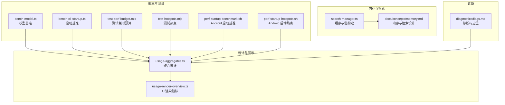
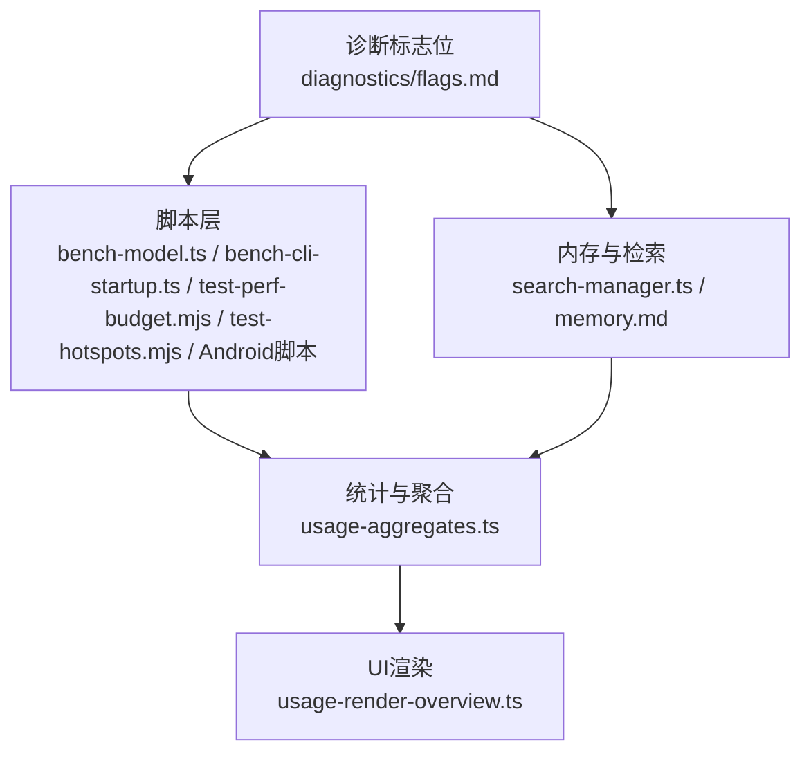
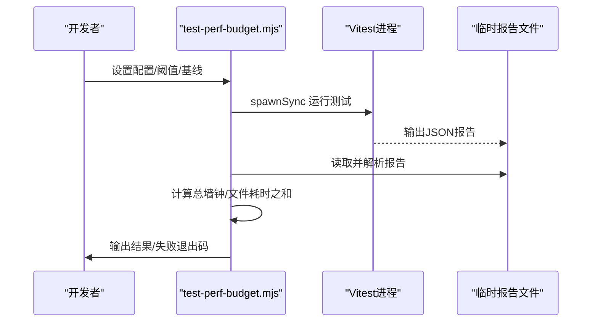
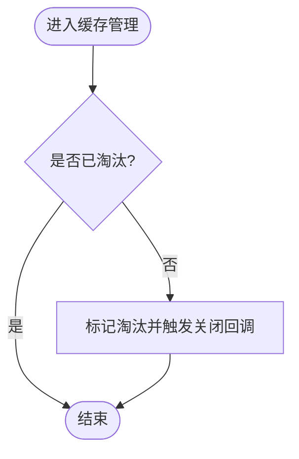
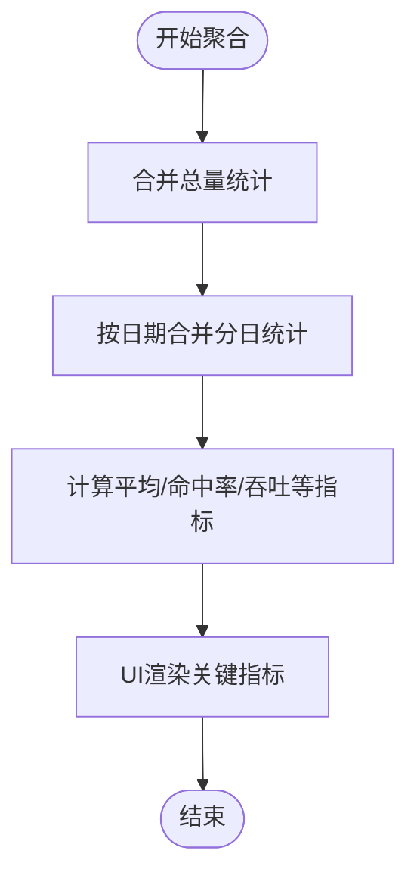
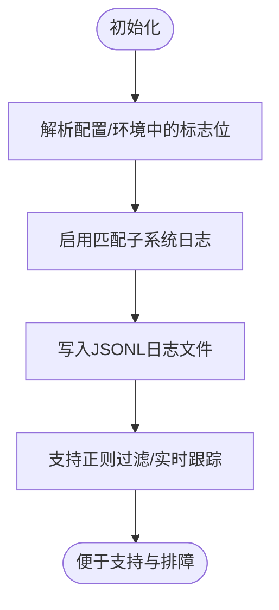
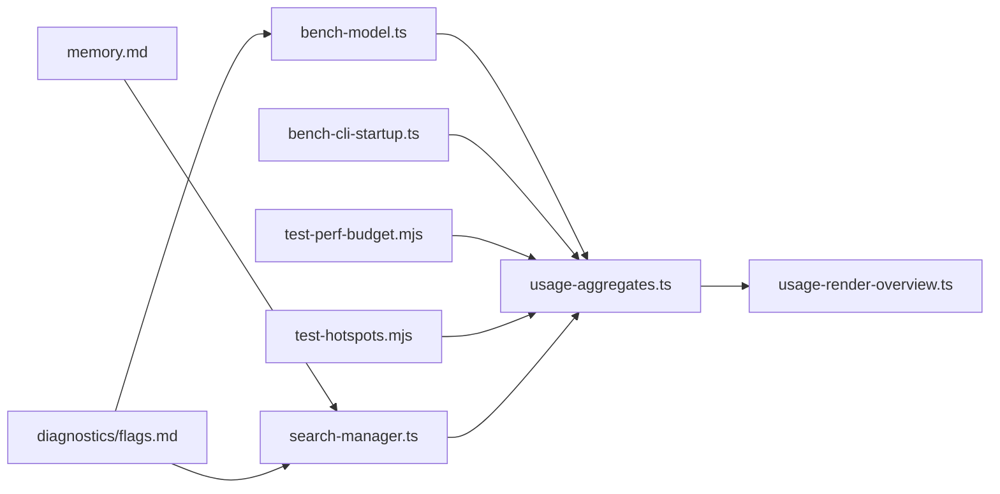

# 性能问题

<cite>
**本文引用的文件**
- [scripts/bench-model.ts](file://scripts/bench-model.ts)
- [scripts/bench-cli-startup.ts](file://scripts/bench-cli-startup.ts)
- [scripts/test-perf-budget.mjs](file://scripts/test-perf-budget.mjs)
- [scripts/test-hotspots.mjs](file://scripts/test-hotspots.mjs)
- [apps/android/scripts/perf-startup-benchmark.sh](file://apps/android/scripts/perf-startup-benchmark.sh)
- [apps/android/scripts/perf-startup-hotspots.sh](file://apps/android/scripts/perf-startup-hotspots.sh)
- [src/memory/search-manager.ts](file://src/memory/search-manager.ts)
- [src/auto-reply/status.ts](file://src/auto-reply/status.ts)
- [src/shared/usage-aggregates.ts](file://src/shared/usage-aggregates.ts)
- [ui/src/ui/views/usage-render-overview.ts](file://ui/src/ui/views/usage-render-overview.ts)
- [docs/concepts/memory.md](file://docs/concepts/memory.md)
- [docs/diagnostics/flags.md](file://docs/diagnostics/flags.md)
</cite>

## 目录
1. [简介](#简介)
2. [项目结构](#项目结构)
3. [核心组件](#核心组件)
4. [架构总览](#架构总览)
5. [详细组件分析](#详细组件分析)
6. [依赖关系分析](#依赖关系分析)
7. [性能考量](#性能考量)
8. [故障排除指南](#故障排除指南)
9. [结论](#结论)
10. [附录](#附录)

## 简介
本指南面向系统管理员与开发者，聚焦OpenClaw在实际运行中出现的系统响应缓慢、内存占用过高、CPU使用率异常、网络延迟等问题，提供可操作的诊断流程、性能监控与资源分析方法，并覆盖内存管理、缓存策略、并发控制、I/O优化等关键领域。文档同时给出基准测试、负载测试与压力测试的实施建议，帮助建立持续的性能回归防护体系。

## 项目结构
OpenClaw仓库包含多平台应用（Android/iOS/macOS）、网关与CLI、插件生态、以及大量文档与脚本。与性能直接相关的关键位置包括：
- 脚本层：用于模型与启动性能基准、测试耗时预算与热点定位
- 内存子系统：向量化检索、缓存与索引策略
- UI与统计：吞吐、成本、缓存命中率等指标渲染
- 文档：内存机制、诊断标志位等

**图表来源**
- [scripts/bench-model.ts:1-147](file://scripts/bench-model.ts#L1-L147)
- [scripts/bench-cli-startup.ts:156-200](file://scripts/bench-cli-startup.ts#L156-L200)
- [scripts/test-perf-budget.mjs:1-128](file://scripts/test-perf-budget.mjs#L1-L128)
- [scripts/test-hotspots.mjs:54-83](file://scripts/test-hotspots.mjs#L54-L83)
- [apps/android/scripts/perf-startup-benchmark.sh:115-124](file://apps/android/scripts/perf-startup-benchmark.sh#L115-L124)
- [apps/android/scripts/perf-startup-hotspots.sh:1-200](file://apps/android/scripts/perf-startup-hotspots.sh#L1-L200)
- [src/memory/search-manager.ts:239-252](file://src/memory/search-manager.ts#L239-L252)
- [src/shared/usage-aggregates.ts:1-66](file://src/shared/usage-aggregates.ts#L1-L66)
- [ui/src/ui/views/usage-render-overview.ts:380-406](file://ui/src/ui/views/usage-render-overview.ts#L380-L406)
- [docs/concepts/memory.md:1-801](file://docs/concepts/memory.md#L1-L801)
- [docs/diagnostics/flags.md:1-92](file://docs/diagnostics/flags.md#L1-L92)

**章节来源**
- [scripts/bench-model.ts:1-147](file://scripts/bench-model.ts#L1-L147)
- [scripts/bench-cli-startup.ts:156-200](file://scripts/bench-cli-startup.ts#L156-L200)
- [scripts/test-perf-budget.mjs:1-128](file://scripts/test-perf-budget.mjs#L1-L128)
- [scripts/test-hotspots.mjs:54-83](file://scripts/test-hotspots.mjs#L54-L83)
- [apps/android/scripts/perf-startup-benchmark.sh:115-124](file://apps/android/scripts/perf-startup-benchmark.sh#L115-L124)
- [apps/android/scripts/perf-startup-hotspots.sh:1-200](file://apps/android/scripts/perf-startup-hotspots.sh#L1-L200)
- [src/memory/search-manager.ts:239-252](file://src/memory/search-manager.ts#L239-L252)
- [src/shared/usage-aggregates.ts:1-66](file://src/shared/usage-aggregates.ts#L1-L66)
- [ui/src/ui/views/usage-render-overview.ts:380-406](file://ui/src/ui/views/usage-render-overview.ts#L380-L406)
- [docs/concepts/memory.md:1-801](file://docs/concepts/memory.md#L1-L801)
- [docs/diagnostics/flags.md:1-92](file://docs/diagnostics/flags.md#L1-L92)

## 核心组件
- 模型性能基准脚本：对不同模型执行多次推理，输出中位数/最小/最大耗时，便于横向对比与回归基线设定
- CLI启动性能基准：测量主入口与备选入口的启动耗时差异，辅助定位冷启动瓶颈
- 测试耗时预算：通过Vitest运行并统计总墙钟时间与文件级耗时，支持基于“最大阈值”和“基线回归上限”的双重约束
- 测试热点：解析Vitest JSON报告，按文件维度排序耗时，快速定位最慢用例
- Android启动基准/热点：移动端启动路径的基准与热点提取脚本，便于跨平台对比
- 内存检索与缓存：缓存淘汰触发、键构建、命中率计算与展示
- 统计聚合与UI渲染：吞吐、成本、缓存命中率等指标的聚合与可视化
- 诊断标志位：按子系统启用细粒度调试日志，便于定位网络/通道等特定环节的异常

**章节来源**
- [scripts/bench-model.ts:1-147](file://scripts/bench-model.ts#L1-L147)
- [scripts/bench-cli-startup.ts:156-200](file://scripts/bench-cli-startup.ts#L156-L200)
- [scripts/test-perf-budget.mjs:1-128](file://scripts/test-perf-budget.mjs#L1-L128)
- [scripts/test-hotspots.mjs:54-83](file://scripts/test-hotspots.mjs#L54-L83)
- [apps/android/scripts/perf-startup-benchmark.sh:115-124](file://apps/android/scripts/perf-startup-benchmark.sh#L115-L124)
- [apps/android/scripts/perf-startup-hotspots.sh:1-200](file://apps/android/scripts/perf-startup-hotspots.sh#L1-L200)
- [src/memory/search-manager.ts:239-252](file://src/memory/search-manager.ts#L239-L252)
- [src/shared/usage-aggregates.ts:1-66](file://src/shared/usage-aggregates.ts#L1-L66)
- [ui/src/ui/views/usage-render-overview.ts:380-406](file://ui/src/ui/views/usage-render-overview.ts#L380-L406)
- [docs/diagnostics/flags.md:1-92](file://docs/diagnostics/flags.md#L1-L92)

## 架构总览
下图展示了性能相关组件之间的交互关系：脚本负责采集与回归检测；内存子系统承担I/O与向量检索开销；统计模块汇总指标；UI呈现关键KPI；诊断标志位提供定向日志。

**图表来源**
- [scripts/bench-model.ts:1-147](file://scripts/bench-model.ts#L1-L147)
- [scripts/bench-cli-startup.ts:156-200](file://scripts/bench-cli-startup.ts#L156-L200)
- [scripts/test-perf-budget.mjs:1-128](file://scripts/test-perf-budget.mjs#L1-L128)
- [scripts/test-hotspots.mjs:54-83](file://scripts/test-hotspots.mjs#L54-L83)
- [apps/android/scripts/perf-startup-benchmark.sh:115-124](file://apps/android/scripts/perf-startup-benchmark.sh#L115-L124)
- [apps/android/scripts/perf-startup-hotspots.sh:1-200](file://apps/android/scripts/perf-startup-hotspots.sh#L1-L200)
- [src/memory/search-manager.ts:239-252](file://src/memory/search-manager.ts#L239-L252)
- [src/shared/usage-aggregates.ts:1-66](file://src/shared/usage-aggregates.ts#L1-L66)
- [ui/src/ui/views/usage-render-overview.ts:380-406](file://ui/src/ui/views/usage-render-overview.ts#L380-L406)
- [docs/diagnostics/flags.md:1-92](file://docs/diagnostics/flags.md#L1-L92)

## 详细组件分析

### 组件A：性能基准与回归检测
- 模型基准：对多个模型执行固定轮次推理，记录每轮耗时与用量，输出中位数/最小/最大，便于建立稳定基线
- CLI启动基准：比较主入口与备选入口的平均耗时差与百分比变化，辅助定位启动路径差异
- 测试耗时预算：以Vitest运行为基准，统计总墙钟时间与文件级耗时之和，支持“最大阈值”和“基线回归上限”双约束
- 测试热点：解析Vitest JSON报告，按文件耗时降序输出Top-N，快速发现最慢用例

**图表来源**
- [scripts/test-perf-budget.mjs:62-82](file://scripts/test-perf-budget.mjs#L62-L82)
- [scripts/test-perf-budget.mjs:84-96](file://scripts/test-perf-budget.mjs#L84-L96)

**章节来源**
- [scripts/bench-model.ts:1-147](file://scripts/bench-model.ts#L1-L147)
- [scripts/bench-cli-startup.ts:156-200](file://scripts/bench-cli-startup.ts#L156-L200)
- [scripts/test-perf-budget.mjs:1-128](file://scripts/test-perf-budget.mjs#L1-L128)
- [scripts/test-hotspots.mjs:54-83](file://scripts/test-hotspots.mjs#L54-L83)

### 组件B：内存检索与缓存
- 缓存淘汰与关闭回调：在满足条件时触发缓存淘汰逻辑并执行清理回调
- 键构建：基于agentId与配置生成稳定缓存键，避免深度序列化带来的额外开销
- 命中率与缓存效率：结合输入/缓存读写统计，计算命中率与读写比例，支撑性能优化决策

**图表来源**
- [src/memory/search-manager.ts:239-245](file://src/memory/search-manager.ts#L239-L245)

**章节来源**
- [src/memory/search-manager.ts:239-252](file://src/memory/search-manager.ts#L239-L252)
- [src/auto-reply/status.ts:315-343](file://src/auto-reply/status.ts#L315-L343)
- [docs/concepts/memory.md:676-720](file://docs/concepts/memory.md#L676-L720)

### 组件C：统计聚合与UI渲染
- 聚合函数：合并总量与分日统计数据，支持按日期维度聚合与加权平均
- UI指标：计算平均耗时、吞吐（令牌/分钟）、成本/分钟、缓存命中率等，提供直观的性能视图

**图表来源**
- [src/shared/usage-aggregates.ts:32-66](file://src/shared/usage-aggregates.ts#L32-L66)
- [ui/src/ui/views/usage-render-overview.ts:380-406](file://ui/src/ui/views/usage-render-overview.ts#L380-L406)

**章节来源**
- [src/shared/usage-aggregates.ts:1-66](file://src/shared/usage-aggregates.ts#L1-L66)
- [ui/src/ui/views/usage-render-overview.ts:380-406](file://ui/src/ui/views/usage-render-overview.ts#L380-L406)

### 组件D：诊断标志位与日志
- 诊断标志位：按子系统启用细粒度调试日志，支持通配符匹配与环境变量覆盖
- 日志位置：默认输出到/tmp目录下的JSONL日志文件，支持过滤与实时跟踪

**图表来源**
- [docs/diagnostics/flags.md:13-92](file://docs/diagnostics/flags.md#L13-L92)

**章节来源**
- [docs/diagnostics/flags.md:1-92](file://docs/diagnostics/flags.md#L1-L92)

## 依赖关系分析
- 脚本依赖：基准与回归脚本依赖Node进程与外部工具链（如Vitest），并通过环境变量或参数控制阈值与基线
- 内存子系统：检索与缓存依赖稳定的键构建与淘汰策略，避免不必要的I/O与重复计算
- 统计与UI：聚合模块为UI提供统一的数据源，确保指标一致性
- 诊断：日志标志位独立于业务逻辑，仅在子系统检查时生效，降低全局日志噪声

**图表来源**
- [scripts/bench-model.ts:1-147](file://scripts/bench-model.ts#L1-L147)
- [scripts/bench-cli-startup.ts:156-200](file://scripts/bench-cli-startup.ts#L156-L200)
- [scripts/test-perf-budget.mjs:1-128](file://scripts/test-perf-budget.mjs#L1-L128)
- [scripts/test-hotspots.mjs:54-83](file://scripts/test-hotspots.mjs#L54-L83)
- [src/memory/search-manager.ts:239-252](file://src/memory/search-manager.ts#L239-L252)
- [src/shared/usage-aggregates.ts:1-66](file://src/shared/usage-aggregates.ts#L1-L66)
- [ui/src/ui/views/usage-render-overview.ts:380-406](file://ui/src/ui/views/usage-render-overview.ts#L380-L406)
- [docs/concepts/memory.md:1-801](file://docs/concepts/memory.md#L1-L801)
- [docs/diagnostics/flags.md:1-92](file://docs/diagnostics/flags.md#L1-L92)

**章节来源**
- [scripts/bench-model.ts:1-147](file://scripts/bench-model.ts#L1-L147)
- [scripts/bench-cli-startup.ts:156-200](file://scripts/bench-cli-startup.ts#L156-L200)
- [scripts/test-perf-budget.mjs:1-128](file://scripts/test-perf-budget.mjs#L1-L128)
- [scripts/test-hotspots.mjs:54-83](file://scripts/test-hotspots.mjs#L54-L83)
- [src/memory/search-manager.ts:239-252](file://src/memory/search-manager.ts#L239-L252)
- [src/shared/usage-aggregates.ts:1-66](file://src/shared/usage-aggregates.ts#L1-L66)
- [ui/src/ui/views/usage-render-overview.ts:380-406](file://ui/src/ui/views/usage-render-overview.ts#L380-L406)
- [docs/concepts/memory.md:1-801](file://docs/concepts/memory.md#L1-L801)
- [docs/diagnostics/flags.md:1-92](file://docs/diagnostics/flags.md#L1-L92)

## 性能考量
- 内存管理
  - 使用稳定的缓存键与淘汰策略，减少重复I/O与重建开销
  - 在高并发场景下，合理设置缓存容量与淘汰时机，避免内存峰值
- 缓存策略
  - 结合命中率与读写比例评估缓存效果，必要时调整缓存大小与更新频率
  - 对向量化检索启用本地/远程嵌入缓存，降低重复嵌入成本
- 并发控制
  - 通过测试耗时预算与热点分析，识别阻塞点与串行化瓶颈，优化并发路径
  - 对I/O密集型任务采用异步与背压策略，避免线程池过载
- I/O优化
  - 利用sqlite-vec等扩展加速向量距离查询，减少内存拷贝与全表扫描
  - 对大文件/会话日志采用增量同步与去抖策略，降低索引与检索压力
- 网络延迟
  - 通过诊断标志位定位HTTP/通道层延迟，结合回源与重试策略优化
  - 对远程嵌入与模型API设置合理的超时与并发限制，避免雪崩效应

[本节为通用指导，不直接分析具体文件]

## 故障排除指南

### 系统响应缓慢
- 步骤1：确认是否存在长时间运行的测试或基准任务
  - 使用测试耗时预算脚本评估整体耗时与文件级耗时之和
  - 若超过阈值，结合测试热点脚本定位最慢用例
- 步骤2：检查内存检索与缓存
  - 关注缓存淘汰触发与键构建逻辑，避免频繁重建
  - 评估命中率与读写比例，必要时扩大缓存或优化查询
- 步骤3：启用诊断标志位
  - 针对特定子系统（如通道/网关）开启细粒度日志，定位异常路径

**章节来源**
- [scripts/test-perf-budget.mjs:98-127](file://scripts/test-perf-budget.mjs#L98-L127)
- [scripts/test-hotspots.mjs:54-83](file://scripts/test-hotspots.mjs#L54-L83)
- [src/memory/search-manager.ts:239-252](file://src/memory/search-manager.ts#L239-L252)
- [docs/diagnostics/flags.md:13-92](file://docs/diagnostics/flags.md#L13-L92)

### 内存占用过高
- 步骤1：评估缓存规模与淘汰策略
  - 检查缓存容量与淘汰时机，避免长期持有大对象
- 步骤2：审查检索与索引
  - 关注向量化索引与嵌入缓存的存储与刷新策略
- 步骤3：结合UI指标观察吞吐与成本趋势，判断是否由高频检索导致

**章节来源**
- [src/memory/search-manager.ts:239-252](file://src/memory/search-manager.ts#L239-L252)
- [docs/concepts/memory.md:676-720](file://docs/concepts/memory.md#L676-L720)
- [ui/src/ui/views/usage-render-overview.ts:380-406](file://ui/src/ui/views/usage-render-overview.ts#L380-L406)

### CPU使用率异常
- 步骤1：使用启动基准脚本对比主/备入口的启动耗时差异
- 步骤2：结合测试耗时预算与热点分析，识别CPU热点路径
- 步骤3：启用诊断标志位，缩小问题范围至特定子系统

**章节来源**
- [scripts/bench-cli-startup.ts:156-200](file://scripts/bench-cli-startup.ts#L156-L200)
- [scripts/test-perf-budget.mjs:98-127](file://scripts/test-perf-budget.mjs#L98-L127)
- [scripts/test-hotspots.mjs:54-83](file://scripts/test-hotspots.mjs#L54-L83)
- [docs/diagnostics/flags.md:13-92](file://docs/diagnostics/flags.md#L13-L92)

### 网络延迟问题
- 步骤1：启用诊断标志位，筛选目标子系统的HTTP错误与延迟日志
- 步骤2：评估远程嵌入与模型API的超时与并发设置
- 步骤3：对高延迟路径引入重试与退避策略，避免放大效应

**章节来源**
- [docs/diagnostics/flags.md:55-92](file://docs/diagnostics/flags.md#L55-L92)
- [docs/concepts/memory.md:115-125](file://docs/concepts/memory.md#L115-L125)

### 基准测试与回归防护
- 模型基准：定期运行模型基准脚本，建立稳定基线，监控中位数/最大耗时波动
- CLI启动基准：对比主/备入口，识别启动路径差异
- 测试耗时预算：CI中加入最大阈值与基线回归上限检查
- 测试热点：定期分析Top-N用例，持续优化热点路径

**章节来源**
- [scripts/bench-model.ts:1-147](file://scripts/bench-model.ts#L1-L147)
- [scripts/bench-cli-startup.ts:156-200](file://scripts/bench-cli-startup.ts#L156-L200)
- [scripts/test-perf-budget.mjs:1-128](file://scripts/test-perf-budget.mjs#L1-L128)
- [scripts/test-hotspots.mjs:54-83](file://scripts/test-hotspots.mjs#L54-L83)

### 移动端性能
- 启动基准与热点：使用Android脚本收集冷启动与热启动数据，对比基线并定位热点
- 与服务端指标联动：结合UI渲染的吞吐/成本/命中率，综合评估移动端体验

**章节来源**
- [apps/android/scripts/perf-startup-benchmark.sh:115-124](file://apps/android/scripts/perf-startup-benchmark.sh#L115-L124)
- [apps/android/scripts/perf-startup-hotspots.sh:1-200](file://apps/android/scripts/perf-startup-hotspots.sh#L1-L200)
- [ui/src/ui/views/usage-render-overview.ts:380-406](file://ui/src/ui/views/usage-render-overview.ts#L380-L406)

## 结论
通过脚本化的基准与回归检测、有针对性的诊断标志位、以及对内存检索与缓存策略的精细化治理，OpenClaw能够在多平台环境下实现可观测、可回归、可优化的性能保障体系。建议将上述流程纳入CI/CD与日常运维，形成持续的性能健康度监控与优化闭环。

[本节为总结性内容，不直接分析具体文件]

## 附录
- 关键指标说明
  - 缓存命中率：缓存读取/(输入+缓存读取)，越高越好
  - 吞吐：活跃时间段内的令牌/分钟，越高越好
  - 成本/分钟：按提供商计费的成本，越低越好
- 常见优化方向
  - 减少不必要的I/O与重复计算
  - 合理设置缓存容量与淘汰策略
  - 引入异步与背压，避免线程池过载
  - 使用向量加速扩展（如sqlite-vec）提升检索性能

[本节为通用附录，不直接分析具体文件]