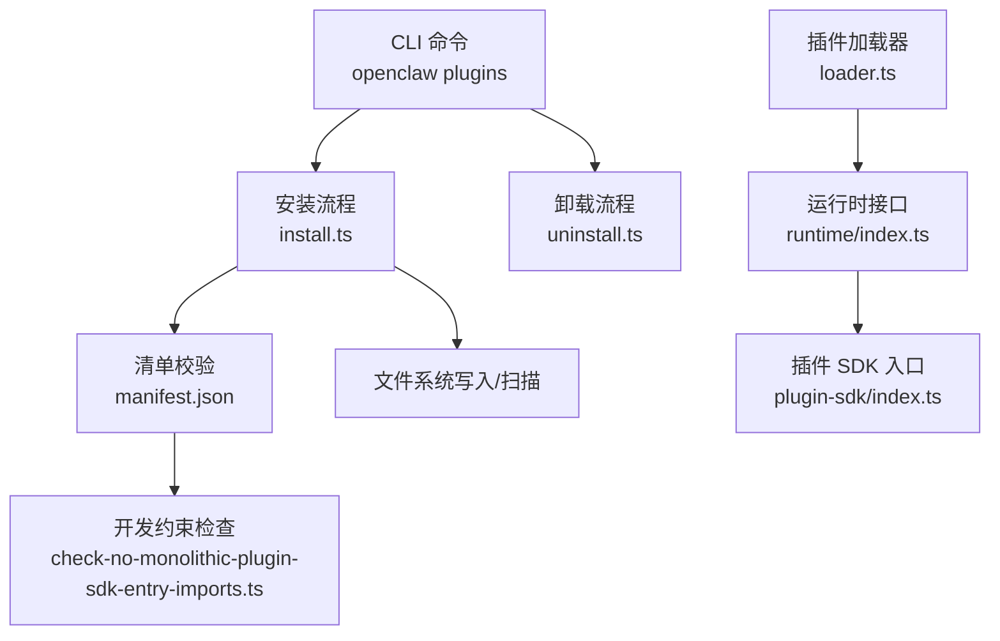
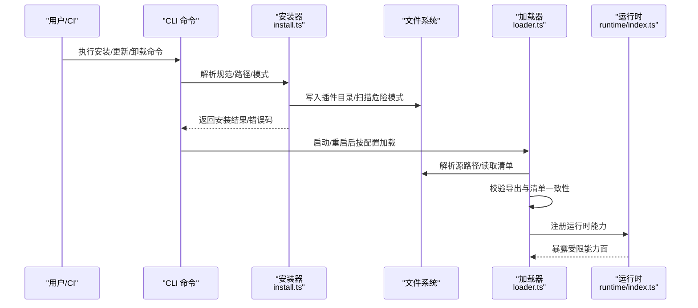
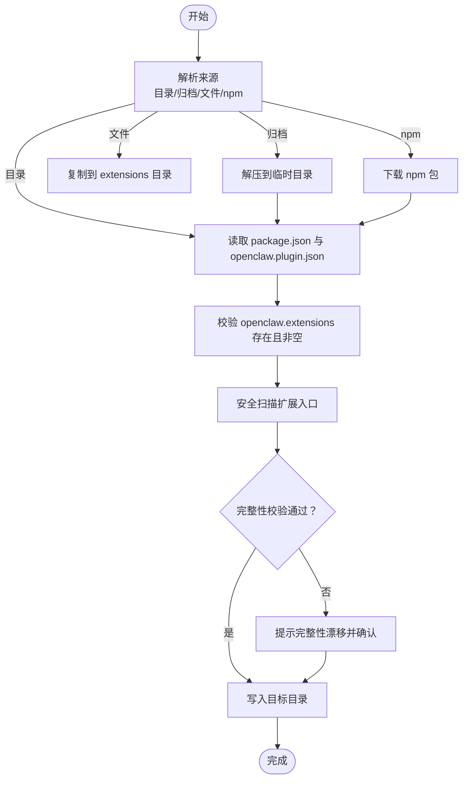
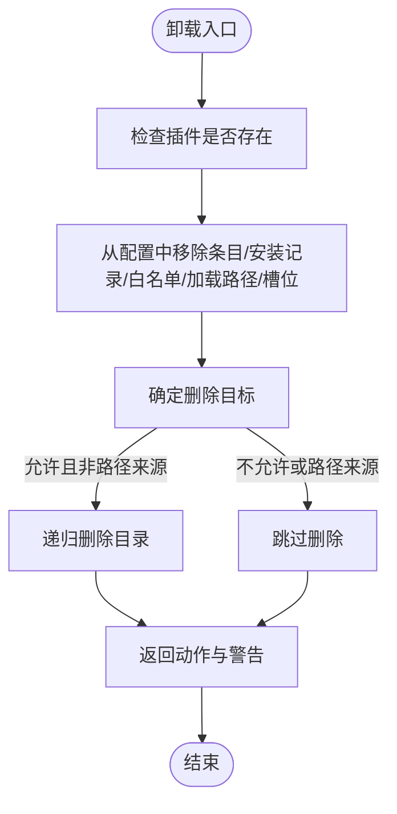
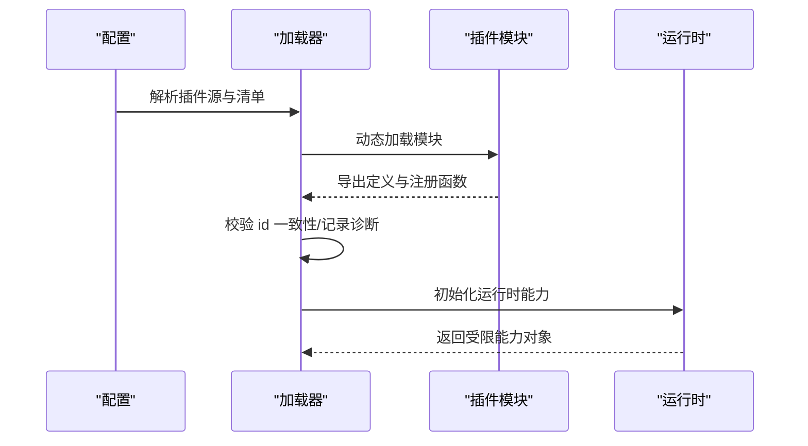
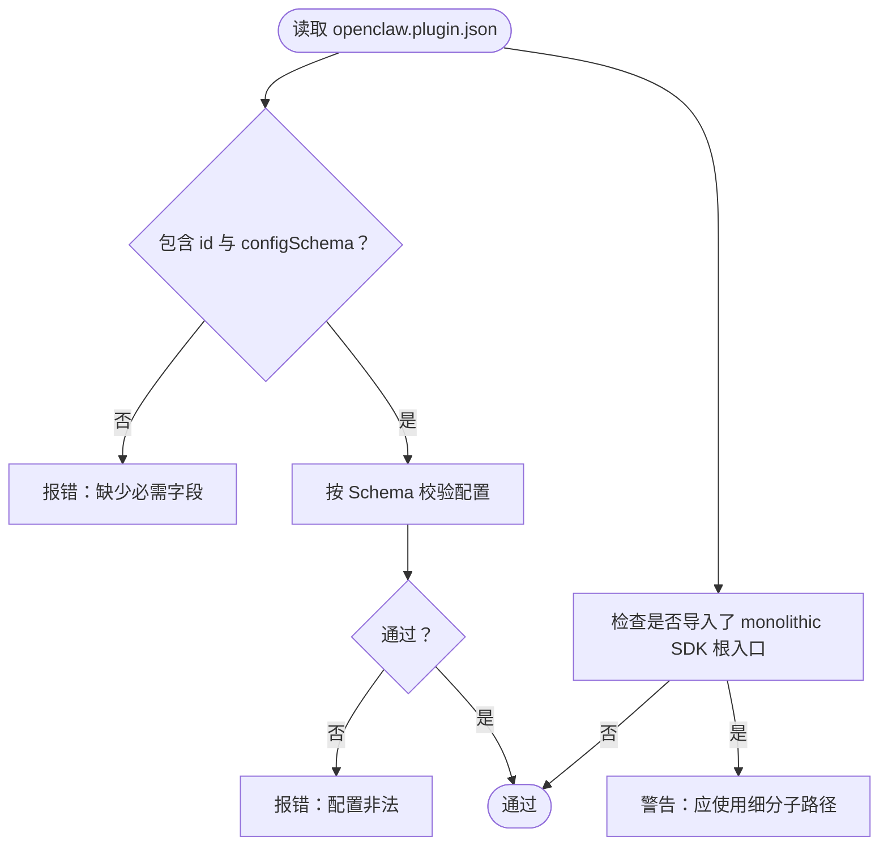
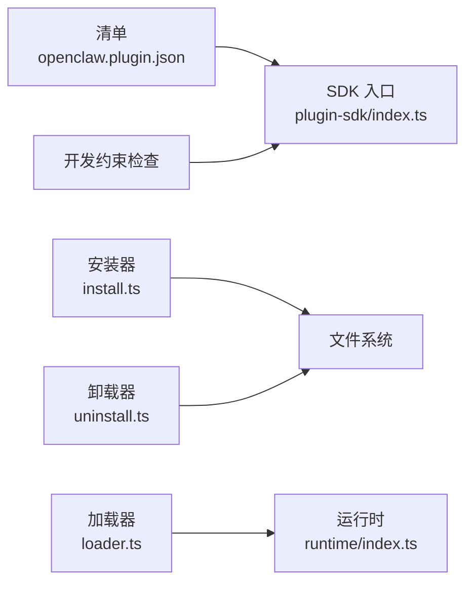

# 插件问题

<cite>
**本文引用的文件**
- [src/plugin-sdk/index.ts](file://src/plugin-sdk/index.ts)
- [docs/cli/plugins.md](file://docs/cli/plugins.md)
- [docs/plugins/manifest.md](file://docs/plugins/manifest.md)
- [extensions/diffs/openclaw.plugin.json](file://extensions/diffs/openclaw.plugin.json)
- [extensions/discord/openclaw.plugin.json](file://extensions/discord/openclaw.plugin.json)
- [src/plugins/runtime/index.ts](file://src/plugins/runtime/index.ts)
- [src/plugins/config-schema.ts](file://src/plugins/config-schema.ts)
- [src/plugins/install.ts](file://src/plugins/install.ts)
- [src/plugins/uninstall.ts](file://src/plugins/uninstall.ts)
- [src/plugins/loader.ts](file://src/plugins/loader.ts)
- [scripts/check-no-monolithic-plugin-sdk-entry-imports.ts](file://scripts/check-no-monolithic-plugin-sdk-entry-imports.ts)
- [src/config/plugin-auto-enable.ts](file://src/config/plugin-auto-enable.ts)
- [src/security/audit.ts](file://src/security/audit.ts)
</cite>

## 目录
1. [简介](#简介)
2. [项目结构](#项目结构)
3. [核心组件](#核心组件)
4. [架构总览](#架构总览)
5. [详细组件分析](#详细组件分析)
6. [依赖关系分析](#依赖关系分析)
7. [性能考量](#性能考量)
8. [故障排除指南](#故障排除指南)
9. [结论](#结论)
10. [附录](#附录)

## 简介
本指南聚焦于 OpenClaw 插件系统的常见问题与排障流程，覆盖插件安装失败、加载错误、兼容性问题、性能影响、包格式错误、依赖缺失、权限配置不当、冲突检测、版本兼容性检查以及卸载清理等场景。同时提供插件开发、测试与部署的最佳实践与常见陷阱规避策略，帮助开发者与用户快速定位并解决问题。

## 项目结构
OpenClaw 的插件体系由“插件 SDK”“插件清单（manifest）”“安装/更新/卸载流程”“运行时环境”“加载器与诊断”等多个模块协同组成。CLI 提供统一入口管理插件生命周期；扩展目录（extensions/*）存放官方或社区插件及其清单；核心运行时为插件提供受限但功能完备的能力面。

图示来源
- [src/plugins/install.ts:1-573](file://src/plugins/install.ts#L1-L573)
- [src/plugins/uninstall.ts:1-238](file://src/plugins/uninstall.ts#L1-L238)
- [src/plugins/loader.ts:675-704](file://src/plugins/loader.ts#L675-L704)
- [src/plugins/runtime/index.ts:1-90](file://src/plugins/runtime/index.ts#L1-L90)
- [src/plugin-sdk/index.ts:1-826](file://src/plugin-sdk/index.ts#L1-L826)
- [scripts/check-no-monolithic-plugin-sdk-entry-imports.ts:73-103](file://scripts/check-no-monolithic-plugin-sdk-entry-imports.ts#L73-L103)

章节来源
- [docs/cli/plugins.md:1-103](file://docs/cli/plugins.md#L1-L103)
- [docs/plugins/manifest.md:1-76](file://docs/plugins/manifest.md#L1-L76)

## 核心组件
- 插件 SDK 入口：聚合导出插件开发所需类型、运行时能力、通道适配、Webhook、OAuth 工具、状态辅助等，是插件实现与集成的统一接口。
- 插件清单（openclaw.plugin.json）：每个插件必须提供，用于在不执行代码的前提下完成配置校验与发现。
- 安装/更新/卸载：负责从本地目录/归档/文件或 npm 规范解析安装，进行安全扫描、完整性校验、目标路径选择与清理。
- 运行时：在请求上下文中暴露配置、工具、媒体、TTS/STT、事件、日志、模型鉴权等能力，并限制插件对敏感资源的访问范围。
- 加载器：按配置解析插件源（已安装目录、链接路径等），动态加载模块，校验导出与清单一致性并记录诊断信息。

章节来源
- [src/plugin-sdk/index.ts:1-826](file://src/plugin-sdk/index.ts#L1-L826)
- [docs/plugins/manifest.md:1-76](file://docs/plugins/manifest.md#L1-L76)
- [src/plugins/install.ts:1-573](file://src/plugins/install.ts#L1-L573)
- [src/plugins/uninstall.ts:1-238](file://src/plugins/uninstall.ts#L1-L238)
- [src/plugins/runtime/index.ts:1-90](file://src/plugins/runtime/index.ts#L1-L90)
- [src/plugins/loader.ts:675-704](file://src/plugins/loader.ts#L675-L704)

## 架构总览
下图展示插件从安装到运行的关键交互路径与职责边界：

图示来源
- [src/plugins/install.ts:1-573](file://src/plugins/install.ts#L1-L573)
- [src/plugins/loader.ts:675-704](file://src/plugins/loader.ts#L675-L704)
- [src/plugins/runtime/index.ts:1-90](file://src/plugins/runtime/index.ts#L1-L90)

## 详细组件分析

### 组件A：插件安装与更新流程
- 支持多种来源：本地目录、归档（zip/tgz/tar/tar.gz）、单文件、npm 规范（仅注册表、精确版本或 dist-tag）。
- 安全扫描：对扩展入口进行扫描，发现高危/可疑模式发出警告，不阻断安装。
- 完整性校验：npm 安装支持完整性哈希比对，漂移时提示确认。
- 路径与权限：严格校验插件 id 与路径安全性，避免目录穿越；默认安装目录受配置控制。
- 错误码：对无效 npm 规范、缺失 openclaw.extensions、空扩展列表、包不存在、id 不匹配等情况给出明确错误码。

图示来源
- [src/plugins/install.ts:1-573](file://src/plugins/install.ts#L1-L573)

章节来源
- [src/plugins/install.ts:1-573](file://src/plugins/install.ts#L1-L573)
- [docs/cli/plugins.md:39-102](file://docs/cli/plugins.md#L39-L102)

### 组件B：插件卸载与清理
- 清理配置：从 entries、installs、allow 列表、load.paths、slots 中移除插件记录。
- 目录删除：默认删除安装目录；对于“路径来源”的插件（--link）不删除源目录，仅移除加载路径。
- 记忆槽位回退：若插件被选中为内存槽位，卸载后回退到默认实现。
- 失败容忍：目录删除失败仅记录警告，不影响配置层面的清理结果。

图示来源
- [src/plugins/uninstall.ts:1-238](file://src/plugins/uninstall.ts#L1-L238)

章节来源
- [src/plugins/uninstall.ts:1-238](file://src/plugins/uninstall.ts#L1-L238)
- [docs/cli/plugins.md:72-88](file://docs/cli/plugins.md#L72-L88)

### 组件C：插件加载与运行时
- 动态加载：使用 jiti 加载插件源，捕获加载异常并记录诊断。
- 导出校验：比较配置中的 id 与模块导出的 id 是否一致，不一致则记录警告。
- 运行时能力：提供配置、系统、媒体、TTS/STT、工具、通道、事件、日志、状态目录解析、模型鉴权等受限接口。
- 版本解析：运行时会解析 OpenClaw 版本号，便于诊断与兼容性追踪。

图示来源
- [src/plugins/loader.ts:675-704](file://src/plugins/loader.ts#L675-L704)
- [src/plugins/runtime/index.ts:1-90](file://src/plugins/runtime/index.ts#L1-L90)

章节来源
- [src/plugins/loader.ts:675-704](file://src/plugins/loader.ts#L675-L704)
- [src/plugins/runtime/index.ts:1-90](file://src/plugins/runtime/index.ts#L1-L90)

### 组件D：插件清单与配置校验
- 必填字段：id、configSchema（内联 JSON Schema）。
- 配置校验：在运行前以清单 Schema 对配置进行验证，未知键或非法值即报错。
- 开发约束：禁止从插件源导入“巨无霸” SDK 根入口，需使用细分子路径，降低打包体积与耦合风险。

图示来源
- [docs/plugins/manifest.md:1-76](file://docs/plugins/manifest.md#L1-L76)
- [src/plugins/config-schema.ts:1-34](file://src/plugins/config-schema.ts#L1-L34)
- [scripts/check-no-monolithic-plugin-sdk-entry-imports.ts:73-103](file://scripts/check-no-monolithic-plugin-sdk-entry-imports.ts#L73-L103)

章节来源
- [docs/plugins/manifest.md:1-76](file://docs/plugins/manifest.md#L1-L76)
- [src/plugins/config-schema.ts:1-34](file://src/plugins/config-schema.ts#L1-L34)
- [scripts/check-no-monolithic-plugin-sdk-entry-imports.ts:73-103](file://scripts/check-no-monolithic-plugin-sdk-entry-imports.ts#L73-L103)

## 依赖关系分析
- 插件清单与 SDK：清单决定插件可发现性与配置校验；SDK 提供开发与运行时能力。
- 安装器与文件系统：安装器负责把插件写入目标位置并进行安全扫描；卸载器负责清理配置与目录。
- 加载器与运行时：加载器负责模块加载与一致性校验；运行时提供受限能力，避免插件越权。
- 开发约束：脚本检查确保插件源不直接引入巨无霸 SDK 根入口，鼓励按需导入。

图示来源
- [src/plugins/install.ts:1-573](file://src/plugins/install.ts#L1-L573)
- [src/plugins/uninstall.ts:1-238](file://src/plugins/uninstall.ts#L1-L238)
- [src/plugins/loader.ts:675-704](file://src/plugins/loader.ts#L675-L704)
- [src/plugins/runtime/index.ts:1-90](file://src/plugins/runtime/index.ts#L1-L90)
- [src/plugin-sdk/index.ts:1-826](file://src/plugin-sdk/index.ts#L1-L826)
- [scripts/check-no-monolithic-plugin-sdk-entry-imports.ts:73-103](file://scripts/check-no-monolithic-plugin-sdk-entry-imports.ts#L73-L103)

章节来源
- [src/plugins/install.ts:1-573](file://src/plugins/install.ts#L1-L573)
- [src/plugins/uninstall.ts:1-238](file://src/plugins/uninstall.ts#L1-L238)
- [src/plugins/loader.ts:675-704](file://src/plugins/loader.ts#L675-L704)
- [src/plugins/runtime/index.ts:1-90](file://src/plugins/runtime/index.ts#L1-L90)
- [src/plugin-sdk/index.ts:1-826](file://src/plugin-sdk/index.ts#L1-L826)
- [scripts/check-no-monolithic-plugin-sdk-entry-imports.ts:73-103](file://scripts/check-no-monolithic-plugin-sdk-entry-imports.ts#L73-L103)

## 性能考量
- 安装阶段：归档解压与依赖安装可能耗时，建议使用固定版本与缓存策略；对大插件可考虑分层依赖与增量更新。
- 运行阶段：插件运行时能力受限，避免在插件侧做重 IO 或 CPU 密集操作；必要时通过工具/事件机制与核心协作。
- 升级与回滚：更新前保留旧版本，遇到问题可快速回滚；对关键插件采用灰度发布策略。
- 日志与诊断：启用诊断事件与运行时日志，定位瓶颈与异常路径。

## 故障排除指南

### 一、安装失败
常见原因与处理步骤：
- 缺少 openclaw.plugin.json 或字段不完整
  - 现象：安装报错，提示缺少必需字段或清单无效。
  - 排查：确认清单存在且包含 id 与 configSchema；参考清单规范与示例。
  - 参考
    - [docs/plugins/manifest.md:11-16](file://docs/plugins/manifest.md#L11-L16)
    - [extensions/discord/openclaw.plugin.json:1-10](file://extensions/discord/openclaw.plugin.json#L1-L10)
- openclaw.extensions 缺失或为空
  - 现象：安装器返回缺失或空扩展列表错误码。
  - 排查：检查 package.json 中 openclaw.extensions 字段，确保指向有效入口。
  - 参考
    - [src/plugins/install.ts:100-129](file://src/plugins/install.ts#L100-L129)
- npm 规范无效或包不存在
  - 现象：返回无效 npm 规范或包未找到错误码。
  - 排查：仅使用注册表规范、精确版本或 dist-tag；确认网络与镜像可用。
  - 参考
    - [src/plugins/install.ts:48-57](file://src/plugins/install.ts#L48-L57)
    - [src/plugins/install.ts:501-538](file://src/plugins/install.ts#L501-L538)
- 完整性漂移未确认
  - 现象：npm 下载产物哈希变化，安装器提示确认。
  - 排查：在 CI 中使用全局确认参数；本地核对变更后再确认。
  - 参考
    - [src/plugins/install.ts:496-538](file://src/plugins/install.ts#L496-L538)
- 路径穿越或非法字符
  - 现象：插件 id 校验失败或安装目标不可用。
  - 排查：避免路径分隔符与保留段；使用安全目录名。
  - 参考
    - [src/plugins/install.ts:87-98](file://src/plugins/install.ts#L87-L98)
    - [src/plugins/install.ts:186-203](file://src/plugins/install.ts#L186-L203)
- 权限问题
  - 现象：写入 extensions 目录失败。
  - 排查：确保状态目录可写；在 CI 中使用只读根但可写状态目录。
  - 参考
    - [src/plugins/install.ts:447-450](file://src/plugins/install.ts#L447-L450)

章节来源
- [docs/plugins/manifest.md:1-76](file://docs/plugins/manifest.md#L1-L76)
- [src/plugins/install.ts:1-573](file://src/plugins/install.ts#L1-L573)
- [extensions/discord/openclaw.plugin.json:1-10](file://extensions/discord/openclaw.plugin.json#L1-L10)

### 二、加载错误
常见原因与处理步骤：
- 模块加载异常
  - 现象：动态加载抛出异常，记录诊断信息。
  - 排查：查看加载器记录的错误堆栈；确认入口文件可执行且无语法错误。
  - 参考
    - [src/plugins/loader.ts:675-704](file://src/plugins/loader.ts#L675-L704)
- 插件 id 不一致
  - 现象：配置 id 与模块导出 id 不一致，记录警告。
  - 排查：保持清单 id 与导出一致；避免混淆不同包名。
  - 参考
    - [src/plugins/loader.ts:697-704](file://src/plugins/loader.ts#L697-L704)
- 运行时不可用
  - 现象：子代理运行时仅在请求期间可用，其他时机调用会抛错。
  - 排查：仅在请求回调中使用子代理相关方法。
  - 参考
    - [src/plugins/runtime/index.ts:35-46](file://src/plugins/runtime/index.ts#L35-L46)

章节来源
- [src/plugins/loader.ts:675-704](file://src/plugins/loader.ts#L675-L704)
- [src/plugins/runtime/index.ts:1-90](file://src/plugins/runtime/index.ts#L1-L90)

### 三、兼容性问题
- 渠道/提供商/技能声明不一致
  - 现象：channels/providers/skills 未在清单中声明或与实际不符。
  - 排查：在清单中正确声明；确保运行时路由与清单一致。
  - 参考
    - [docs/plugins/manifest.md:36-45](file://docs/plugins/manifest.md#L36-L45)
- 版本不匹配
  - 现象：插件版本与核心版本不一致导致行为异常。
  - 排查：同步插件版本；使用版本同步脚本对齐。
  - 参考
    - [scripts/release-check.ts:221-267](file://scripts/release-check.ts#L221-L267)
- 开发约束违规
  - 现象：导入了巨无霸 SDK 根入口，导致打包体积增大或耦合度高。
  - 排查：改为按需导入细分子路径。
  - 参考
    - [scripts/check-no-monolithic-plugin-sdk-entry-imports.ts:73-103](file://scripts/check-no-monolithic-plugin-sdk-entry-imports.ts#L73-L103)

章节来源
- [docs/plugins/manifest.md:1-76](file://docs/plugins/manifest.md#L1-L76)
- [scripts/release-check.ts:221-267](file://scripts/release-check.ts#L221-L267)
- [scripts/check-no-monolithic-plugin-sdk-entry-imports.ts:73-103](file://scripts/check-no-monolithic-plugin-sdk-entry-imports.ts#L73-L103)

### 四、性能影响
- 安装阶段耗时
  - 建议：固定版本、缓存依赖、优先使用归档安装；拆分大型插件的依赖。
- 运行阶段开销
  - 建议：避免在插件内做重 IO/网络请求；通过运行时工具与事件机制与核心协作。
- 升级风险
  - 建议：灰度发布、保留旧版本、完善回归测试。

### 五、包格式错误
- 归档格式不支持
  - 现象：安装器无法识别归档类型。
  - 排查：使用受支持的格式（.zip/.tgz/.tar/.tar.gz）。
  - 参考
    - [src/plugins/install.ts:560-566](file://src/plugins/install.ts#L560-L566)
- 文件入口缺失
  - 现象：扩展入口不在插件目录内或不存在。
  - 排查：修正 openclaw.extensions 指向；确保入口文件存在。
  - 参考
    - [src/plugins/install.ts:353-362](file://src/plugins/install.ts#L353-L362)

章节来源
- [src/plugins/install.ts:1-573](file://src/plugins/install.ts#L1-L573)

### 六、依赖缺失
- 本地目录安装
  - 现象：依赖未安装导致运行时缺失模块。
  - 排查：在安装前安装依赖；或使用 npm 安装方式自动处理依赖。
  - 参考
    - [src/plugins/install.ts:341-351](file://src/plugins/install.ts#L341-L351)
- npm 安装
  - 现象：网络/镜像问题导致包拉取失败。
  - 排查：检查网络与镜像；使用固定版本或 dist-tag。
  - 参考
    - [src/plugins/install.ts:501-538](file://src/plugins/install.ts#L501-L538)

章节来源
- [src/plugins/install.ts:1-573](file://src/plugins/install.ts#L1-L573)

### 七、权限配置不当
- 配置文件权限
  - 现象：配置文件权限过高导致安全审计告警。
  - 排查：调整为 0600；避免组读或世界读。
  - 参考
    - [src/security/audit.ts:307-334](file://src/security/audit.ts#L307-L334)
- 插件目录写权限
  - 现象：安装/卸载失败。
  - 排查：确保状态目录可写；在容器/CI 环境中挂载可写卷。
  - 参考
    - [src/plugins/install.ts:447-450](file://src/plugins/install.ts#L447-L450)

章节来源
- [src/security/audit.ts:307-334](file://src/security/audit.ts#L307-L334)
- [src/plugins/install.ts:1-573](file://src/plugins/install.ts#L1-L573)

### 八、冲突检测与版本兼容性检查
- 冲突检测
  - 方法：检查 plugins.allow/plugins.deny/plugins.entries 中的重复/冲突项；关注渠道/提供商/技能声明是否与现有插件重复。
  - 参考
    - [docs/plugins/manifest.md:53-62](file://docs/plugins/manifest.md#L53-L62)
- 版本兼容性
  - 方法：使用版本同步脚本检查插件版本与根版本是否一致；必要时对齐。
  - 参考
    - [scripts/release-check.ts:221-267](file://scripts/release-check.ts#L221-L267)

章节来源
- [docs/plugins/manifest.md:1-76](file://docs/plugins/manifest.md#L1-L76)
- [scripts/release-check.ts:221-267](file://scripts/release-check.ts#L221-L267)

### 九、插件卸载与清理
- 清理步骤
  - 从配置移除 entries/installs/allow/load.paths/slots；
  - 删除安装目录（非路径来源）；
  - 记忆槽位回退至默认实现。
- 异常处理
  - 目录删除失败仅记录警告，不影响配置清理。
- 参考
  - [src/plugins/uninstall.ts:1-238](file://src/plugins/uninstall.ts#L1-L238)
  - [docs/cli/plugins.md:72-88](file://docs/cli/plugins.md#L72-L88)

章节来源
- [src/plugins/uninstall.ts:1-238](file://src/plugins/uninstall.ts#L1-L238)
- [docs/cli/plugins.md:72-88](file://docs/cli/plugins.md#L72-L88)

### 十、开发、测试与部署最佳实践
- 清单规范
  - 必须包含 id 与 configSchema；合理声明 channels/providers/skills；提供 UI 提示与版本信息。
  - 参考
    - [docs/plugins/manifest.md:18-46](file://docs/plugins/manifest.md#L18-L46)
    - [extensions/diffs/openclaw.plugin.json:1-183](file://extensions/diffs/openclaw.plugin.json#L1-L183)
- 导入约束
  - 禁止导入巨无霸 SDK 根入口；改用细分子路径。
  - 参考
    - [scripts/check-no-monolithic-plugin-sdk-entry-imports.ts:73-103](file://scripts/check-no-monolithic-plugin-sdk-entry-imports.ts#L73-L103)
- 安全扫描
  - 安装阶段对扩展入口进行扫描；发现高危/可疑模式及时修复。
  - 参考
    - [src/plugins/install.ts:284-306](file://src/plugins/install.ts#L284-L306)
- 自动启用
  - 当相关提供商或 ACP 后端配置存在时，某些插件会被自动启用，注意观察 Doctor 报告。
  - 参考
    - [src/config/plugin-auto-enable.ts:349-391](file://src/config/plugin-auto-enable.ts#L349-L391)
- 更新策略
  - 使用固定版本与完整性校验；在 CI 中使用确认参数；灰度发布。
  - 参考
    - [docs/cli/plugins.md:90-102](file://docs/cli/plugins.md#L90-L102)

章节来源
- [docs/plugins/manifest.md:1-76](file://docs/plugins/manifest.md#L1-L76)
- [extensions/diffs/openclaw.plugin.json:1-183](file://extensions/diffs/openclaw.plugin.json#L1-L183)
- [scripts/check-no-monolithic-plugin-sdk-entry-imports.ts:73-103](file://scripts/check-no-monolithic-plugin-sdk-entry-imports.ts#L73-L103)
- [src/plugins/install.ts:284-306](file://src/plugins/install.ts#L284-L306)
- [src/config/plugin-auto-enable.ts:349-391](file://src/config/plugin-auto-enable.ts#L349-L391)
- [docs/cli/plugins.md:90-102](file://docs/cli/plugins.md#L90-L102)

## 结论
OpenClaw 插件系统通过严格的清单校验、安装安全扫描、运行时能力限制与完善的卸载清理流程，为插件生态提供了高可靠与可维护性。遵循本文提供的排障步骤与最佳实践，可显著降低安装失败、加载错误、兼容性问题与性能影响的风险，提升插件开发与运维效率。

## 附录
- 常用 CLI 命令
  - 列表、信息、启用/禁用、卸载、医生检查、更新
  - 参考
    - [docs/cli/plugins.md:19-30](file://docs/cli/plugins.md#L19-L30)
- 清单字段与校验规则
  - 必填字段、JSON Schema 要求、验证行为
  - 参考
    - [docs/plugins/manifest.md:18-62](file://docs/plugins/manifest.md#L18-L62)
- 示例清单
  - 参考
    - [extensions/diffs/openclaw.plugin.json:1-183](file://extensions/diffs/openclaw.plugin.json#L1-L183)
    - [extensions/discord/openclaw.plugin.json:1-10](file://extensions/discord/openclaw.plugin.json#L1-L10)