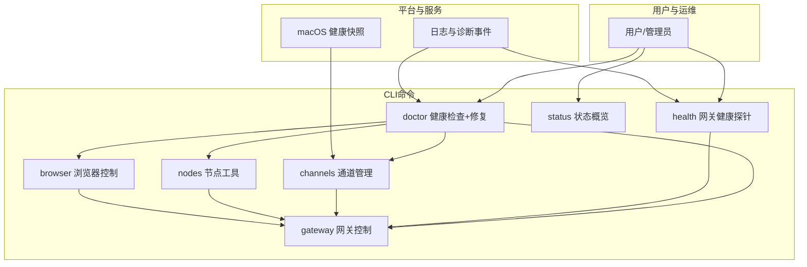
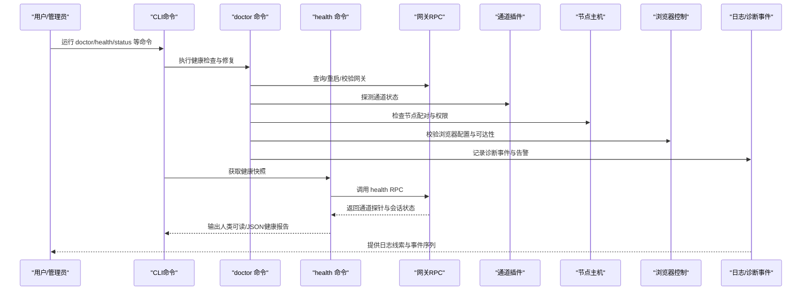
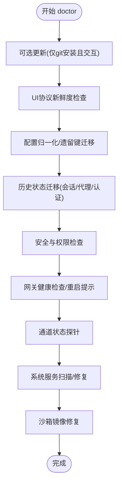
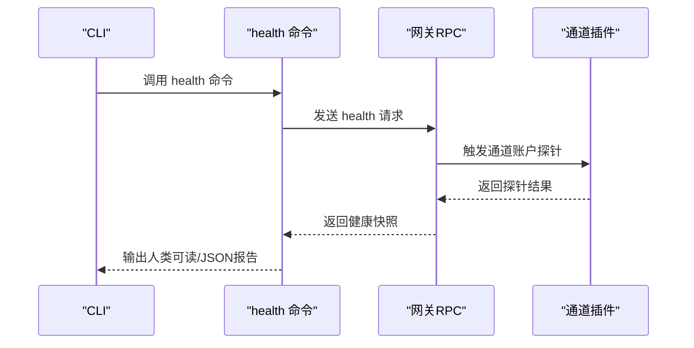
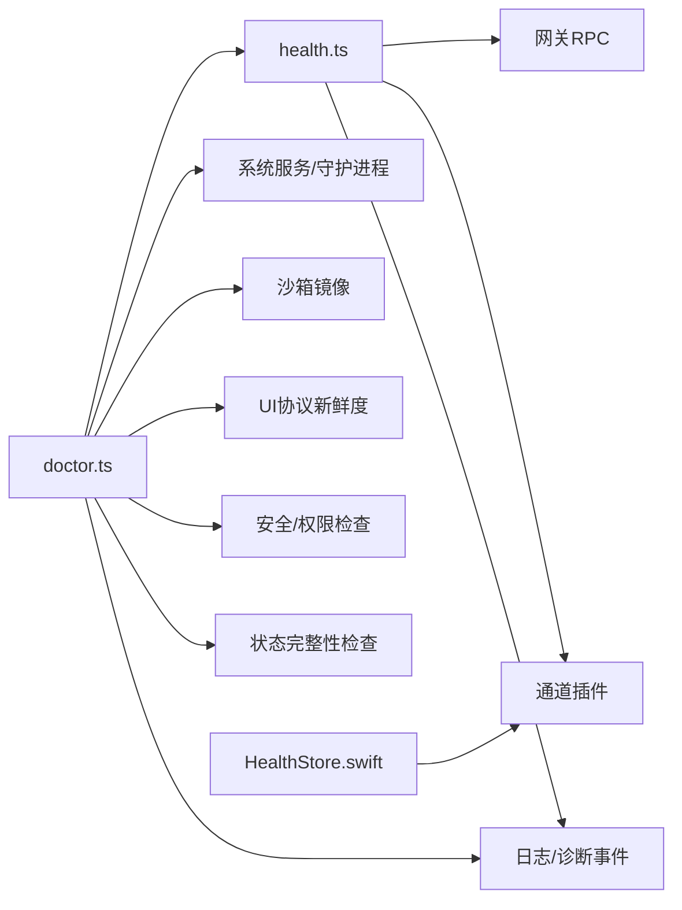

# 故障排除

<cite>
**本文引用的文件**
- [docs/help/troubleshooting.md](file://docs/help/troubleshooting.md)
- [docs/gateway/troubleshooting.md](file://docs/gateway/troubleshooting.md)
- [docs/channels/troubleshooting.md](file://docs/channels/troubleshooting.md)
- [docs/nodes/troubleshooting.md](file://docs/nodes/troubleshooting.md)
- [docs/cli/doctor.md](file://docs/cli/doctor.md)
- [docs/gateway/doctor.md](file://docs/gateway/doctor.md)
- [docs/tools/browser.md](file://docs/tools/browser.md)
- [docs/tools/browser-linux-troubleshooting.md](file://docs/tools/browser-linux-troubleshooting.md)
- [docs/tools/browser-wsl2-windows-remote-cdp-troubleshooting.md](file://docs/tools/browser-wsl2-windows-remote-cdp-troubleshooting.md)
- [src/commands/doctor.ts](file://src/commands/doctor.ts)
- [src/commands/health.ts](file://src/commands/health.ts)
- [src/commands/health-format.ts](file://src/commands/health-format.ts)
- [src/commands/doctor.runs-legacy-state-migrations-yes-mode-without.e2e.test.ts](file://src/commands/doctor.runs-legacy-state-migrations-yes-mode-without.e2e.test.ts)
- [src/commands/doctor.e2e-harness.ts](file://src/commands/doctor.e2e-harness.ts)
- [src/gateway/ws-log.ts](file://src/gateway/ws-log.ts)
- [src/infra/errors.ts](file://src/infra/errors.ts)
- [src/infra/diagnostic-events.ts](file://src/infra/diagnostic-events.ts)
- [src/logger.ts](file://src/logger.ts)
- [apps/macos/Sources/OpenClaw/HealthStore.swift](file://apps/macos/Sources/OpenClaw/HealthStore.swift)
</cite>

## 目录
1. [简介](#简介)
2. [项目结构](#项目结构)
3. [核心组件](#核心组件)
4. [架构总览](#架构总览)
5. [详细组件分析](#详细组件分析)
6. [依赖关系分析](#依赖关系分析)
7. [性能考虑](#性能考虑)
8. [故障排除指南](#故障排除指南)
9. [结论](#结论)
10. [附录](#附录)

## 简介
本指南面向OpenClaw用户与管理员，提供系统化、可操作的故障排除流程与实战建议。内容覆盖：网关连通性、通道（渠道）消息流、浏览器控制、节点工具执行、代理与认证、插件与扩展、日志与诊断事件、doctor健康检查与自动修复等。通过“症状—原因—修复”的三段式方法，帮助快速定位并解决问题。

## 项目结构
OpenClaw的故障排除能力由多层文档与命令行工具共同构成：
- 文档层：帮助页、网关排障、通道排障、节点排障、浏览器排障、doctor参考等，提供症状清单与修复步骤。
- 命令层：doctor、health、status、gateway、channels、nodes、browser等CLI命令，用于自检、探针、状态展示与修复。
- 平台层：macOS端健康快照与错误描述逻辑，辅助诊断通道健康度与超时/失败原因。

图示来源
- [docs/help/troubleshooting.md](file://docs/help/troubleshooting.md)
- [docs/gateway/troubleshooting.md](file://docs/gateway/troubleshooting.md)
- [docs/channels/troubleshooting.md](file://docs/channels/troubleshooting.md)
- [docs/nodes/troubleshooting.md](file://docs/nodes/troubleshooting.md)
- [docs/tools/browser.md](file://docs/tools/browser.md)
- [src/commands/doctor.ts](file://src/commands/doctor.ts)
- [src/commands/health.ts](file://src/commands/health.ts)
- [apps/macos/Sources/OpenClaw/HealthStore.swift](file://apps/macos/Sources/OpenClaw/HealthStore.swift)

章节来源
- [docs/help/troubleshooting.md](file://docs/help/troubleshooting.md)
- [docs/gateway/troubleshooting.md](file://docs/gateway/troubleshooting.md)
- [docs/channels/troubleshooting.md](file://docs/channels/troubleshooting.md)
- [docs/nodes/troubleshooting.md](file://docs/nodes/troubleshooting.md)
- [docs/tools/browser.md](file://docs/tools/browser.md)

## 核心组件
- doctor命令：集中执行配置归一化、历史状态迁移、服务与守护进程检查、安全与权限检查、网关健康检查与重启提示、通道状态警告、UI协议新鲜度检查、沙箱镜像修复、系统服务扫描与清理等。
- health命令：向运行中的网关查询健康快照，汇总通道探针结果、心跳间隔、会话存储状态，并以人类可读或JSON格式输出；支持详细模式输出连接详情与绑定映射。
- 症状诊断：基于通道探针结果与错误码解析，给出“超时/失败/未知”等描述；macOS端对探针失败进行更细致的超时/状态/错误组合描述。
- 日志与诊断事件：统一的日志接口与诊断事件分发，便于聚合与回溯；错误对象提取错误码与名称，辅助定位。

章节来源
- [src/commands/doctor.ts](file://src/commands/doctor.ts)
- [src/commands/health.ts](file://src/commands/health.ts)
- [src/commands/health-format.ts](file://src/commands/health-format.ts)
- [apps/macos/Sources/OpenClaw/HealthStore.swift](file://apps/macos/Sources/OpenClaw/HealthStore.swift)
- [src/gateway/ws-log.ts](file://src/gateway/ws-log.ts)
- [src/infra/errors.ts](file://src/infra/errors.ts)
- [src/infra/diagnostic-events.ts](file://src/infra/diagnostic-events.ts)
- [src/logger.ts](file://src/logger.ts)

## 架构总览
下图展示了从用户发起排障到各组件响应的交互路径，以及doctor与health在诊断链路中的关键作用。

图示来源
- [src/commands/doctor.ts](file://src/commands/doctor.ts)
- [src/commands/health.ts](file://src/commands/health.ts)
- [src/infra/diagnostic-events.ts](file://src/infra/diagnostic-events.ts)
- [src/gateway/ws-log.ts](file://src/gateway/ws-log.ts)

## 详细组件分析

### doctor 健康检查与自动修复
- 配置归一化与遗留键迁移：将旧配置键转换为新schema，避免后续命令阻塞。
- 历史状态迁移：对会话、代理目录、WhatsApp认证等旧布局进行迁移，保证数据完整性。
- 系统服务与守护进程：检测额外网关实例、扫描supervisor配置差异并可选修复；Linux需开启linger以保持服务常驻。
- 安全与权限：检查配置文件权限、云同步状态目录、SD/eMMC慢盘风险、DM开放策略等。
- 网关健康与重启：调用健康检查，必要时提示重启；对内存搜索可用性进行探测。
- 通道状态警告：在网关健康时进一步探针通道，输出建议修复项。
- UI协议新鲜度：当协议schema更新时重建控制UI。
- 沙箱镜像修复：在启用沙箱时检查并修复缺失的容器镜像。
- 环境变量与启动优化：提示macOS launchctl环境覆盖问题、源码安装缺失依赖等。

图示来源
- [docs/gateway/doctor.md](file://docs/gateway/doctor.md)
- [src/commands/doctor.ts](file://src/commands/doctor.ts)

章节来源
- [docs/cli/doctor.md](file://docs/cli/doctor.md)
- [docs/gateway/doctor.md](file://docs/gateway/doctor.md)
- [src/commands/doctor.ts](file://src/commands/doctor.ts)

### health 健康快照与通道探针
- 通过网关RPC获取健康快照，包含通道账户级探针、心跳间隔、会话统计等。
- 支持详细模式输出连接详情、绑定映射、最近会话列表等。
- 对通道探针结果进行格式化输出，区分“已链接/未配置/失败/未知”等状态，并在失败时附加状态码与耗时信息。

图示来源
- [src/commands/health.ts](file://src/commands/health.ts)
- [src/commands/health-format.ts](file://src/commands/health-format.ts)

章节来源
- [src/commands/health.ts](file://src/commands/health.ts)
- [src/commands/health-format.ts](file://src/commands/health-format.ts)

### macOS 通道健康快照与错误描述
- 基于通道探针结果判断健康状态，若缺少探针则视为“已配置但未知健康”。
- 对超时/状态缺失/错误信息进行人性化描述，包含耗时与状态码，便于快速定位。

章节来源
- [apps/macos/Sources/OpenClaw/HealthStore.swift](file://apps/macos/Sources/OpenClaw/HealthStore.swift)

### 日志与诊断事件
- 统一日志接口：提供warn/info/error/success/debug等不同级别输出。
- 错误对象解析：提取错误码与名称，支持嵌套对象遍历收集候选错误。
- 诊断事件：全局事件分发器，带序号与时间戳，递归保护与监听器错误隔离。

章节来源
- [src/logger.ts](file://src/logger.ts)
- [src/infra/errors.ts](file://src/infra/errors.ts)
- [src/infra/diagnostic-events.ts](file://src/infra/diagnostic-events.ts)
- [src/gateway/ws-log.ts](file://src/gateway/ws-log.ts)

## 依赖关系分析
- doctor依赖health进行网关健康检查；health依赖网关RPC与通道插件。
- doctor还依赖系统服务、沙箱、UI协议、安全策略、状态完整性检查等子模块。
- macOS端HealthStore对通道探针结果进行二次描述，增强用户体验。
- 日志与诊断事件贯穿doctor与health，形成可观测性闭环。

图示来源
- [src/commands/doctor.ts](file://src/commands/doctor.ts)
- [src/commands/health.ts](file://src/commands/health.ts)
- [apps/macos/Sources/OpenClaw/HealthStore.swift](file://apps/macos/Sources/OpenClaw/HealthStore.swift)
- [src/infra/diagnostic-events.ts](file://src/infra/diagnostic-events.ts)

章节来源
- [src/commands/doctor.ts](file://src/commands/doctor.ts)
- [src/commands/health.ts](file://src/commands/health.ts)
- [apps/macos/Sources/OpenClaw/HealthStore.swift](file://apps/macos/Sources/OpenClaw/HealthStore.swift)
- [src/infra/diagnostic-events.ts](file://src/infra/diagnostic-events.ts)

## 性能考虑
- 健康检查默认超时约10秒，可通过参数调整；非交互模式缩短至3秒以提升CI效率。
- 通道探针按账户维度并发执行，失败时记录耗时与状态码，便于识别慢通道或网络抖动。
- 状态完整性检查涉及磁盘I/O与权限验证，建议避免在云同步目录或慢盘上运行。
- 诊断事件分发设置递归深度保护，避免深层递归导致的性能问题。

章节来源
- [src/commands/health.ts](file://src/commands/health.ts)
- [src/commands/health-format.ts](file://src/commands/health-format.ts)
- [src/infra/diagnostic-events.ts](file://src/infra/diagnostic-events.ts)

## 故障排除指南

### 快速排障流程（症状优先）
- 使用“症状—命令—预期输出”三步法，先用基础命令快速确认健康基线，再逐步深入。
- 建议顺序：status、gateway status、gateway probe、doctor、channels status --probe、logs --follow。
- 若出现“无回复/无连接/无响应”，优先检查网关运行态、通道探针、设备/配对状态与日志重复致命错误。

章节来源
- [docs/help/troubleshooting.md](file://docs/help/troubleshooting.md)

### 网关相关问题
- 网关未启动/服务未运行：检查本地模式是否启用、绑定地址与鉴权配置、端口占用与URL目标。
- 控制UI无法连接：核对URL/端口、鉴权模式、安全上下文（HTTP/HTTPS）、设备身份挑战与重试令牌。
- 升级后异常：关注URL覆盖行为变化、绑定与鉴权加固、设备/配对状态变更；必要时强制重装服务元数据。

章节来源
- [docs/gateway/troubleshooting.md](file://docs/gateway/troubleshooting.md)
- [docs/help/troubleshooting.md](file://docs/help/troubleshooting.md)

### 通道（渠道）问题
- 已连接但消息不流动：检查提及要求、允许名单、权限/作用域、DM策略与发送者批准状态。
- 典型签名：提及被拒、待配对、被过滤、401/403等；可结合通道特定排障页深挖。

章节来源
- [docs/channels/troubleshooting.md](file://docs/channels/troubleshooting.md)
- [docs/help/troubleshooting.md](file://docs/help/troubleshooting.md)

### 节点工具与屏幕/相机/位置执行失败
- 前台限制：iOS/Android上的canvas/screen/camera需前台运行；如遇“后台不可用”，请将节点应用置前。
- 权限矩阵：相机/屏幕/位置分别对应不同系统权限；缺失或拒绝会触发相应错误码。
- 执行审批：system.run需显式批准与允许名单匹配；Windows节点主机的shell包装可能被视为未命中。

章节来源
- [docs/nodes/troubleshooting.md](file://docs/nodes/troubleshooting.md)
- [docs/help/troubleshooting.md](file://docs/help/troubleshooting.md)

### 浏览器控制问题
- 本地浏览器启动失败（Linux snap Chromium）：推荐安装官方Chrome或改用attach-only模式手动启动。
- WSL2+Windows Chrome跨命名空间：先验证Windows端CDP可达性，再在WSL2侧测试相同地址；若使用扩展中继，确保relayBindHost正确暴露。
- 扩展中继但无标签连接：切换到managed浏览器或正确安装/附加扩展。

章节来源
- [docs/tools/browser.md](file://docs/tools/browser.md)
- [docs/tools/browser-linux-troubleshooting.md](file://docs/tools/browser-linux-troubleshooting.md)
- [docs/tools/browser-wsl2-windows-remote-cdp-troubleshooting.md](file://docs/tools/browser-wsl2-windows-remote-cdp-troubleshooting.md)

### doctor 健康检查与自动修复
- 常用选项：--repair/--yes/--non-interactive/--deep；headless与自动化场景建议使用--yes/--non-interactive。
- 交互与非交互：TTY存在且未设置--non-interactive时才弹出交互提示；macOS launchctl环境变量覆盖可能导致“未授权”持续错误，需unset。
- 自动迁移：legacy状态迁移、cron存储迁移、遗留配置键归一化、UI协议新鲜度、沙箱镜像修复、系统服务扫描与清理等。

章节来源
- [docs/cli/doctor.md](file://docs/cli/doctor.md)
- [docs/gateway/doctor.md](file://docs/gateway/doctor.md)
- [src/commands/doctor.ts](file://src/commands/doctor.ts)

### 日志分析与诊断事件
- 日志级别：warn/info/error/success/debug；错误对象提取错误码与名称，便于脚本化处理。
- 诊断事件：带序号与时间戳，递归深度保护，监听器错误不影响主流程。
- 建议：使用logs --follow持续观察，结合doctor/health输出的“Gateway连接详情”与“通道探针”定位问题根因。

章节来源
- [src/logger.ts](file://src/logger.ts)
- [src/infra/errors.ts](file://src/infra/errors.ts)
- [src/infra/diagnostic-events.ts](file://src/infra/diagnostic-events.ts)
- [src/commands/health.ts](file://src/commands/health.ts)

### doctor 命令端到端测试要点（参考）
- 在非交互模式下跳过确认与提示；在yes模式下直接执行legacy状态迁移。
- 通过模拟配置快照与运行时，验证doctor在不同模式下的行为一致性。

章节来源
- [src/commands/doctor.runs-legacy-state-migrations-yes-mode-without.e2e.test.ts](file://src/commands/doctor.runs-legacy-state-migrations-yes-mode-without.e2e.test.ts)
- [src/commands/doctor.e2e-harness.ts](file://src/commands/doctor.e2e-harness.ts)

## 结论
通过doctor与health命令的组合使用，辅以文档提供的症状清单与分层排障流程，大多数OpenClaw相关问题可在较短时间内定位并修复。建议在日常运维中定期运行doctor进行健康巡检，升级前后务必执行doctor以规避兼容性风险；遇到复杂问题时，结合日志与诊断事件进行回溯分析，必要时参考平台特定排障文档（如浏览器与WSL2/Windows跨主机场景）。

## 附录
- 常用命令速查
  - doctor：健康检查与自动修复
  - health：网关健康快照
  - status：状态概览
  - gateway：网关控制与探针
  - channels：通道状态与探针
  - nodes：节点状态与工具
  - browser：浏览器控制与调试
- 关键配置与环境
  - gateway.mode、gateway.auth、browser、gateway.bind、OPENCLAW_*环境变量
  - macOS launchctl环境变量覆盖（OPENCLAW_GATEWAY_TOKEN/PASSWORD）