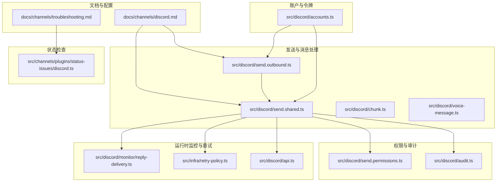
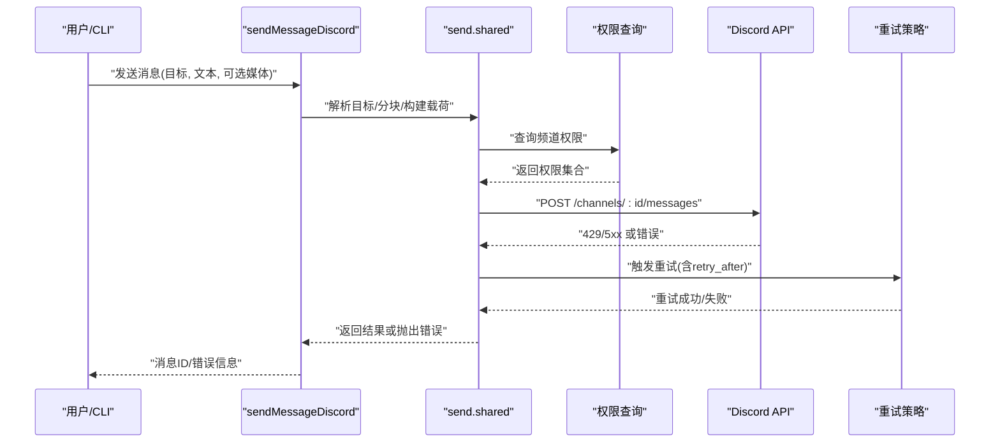
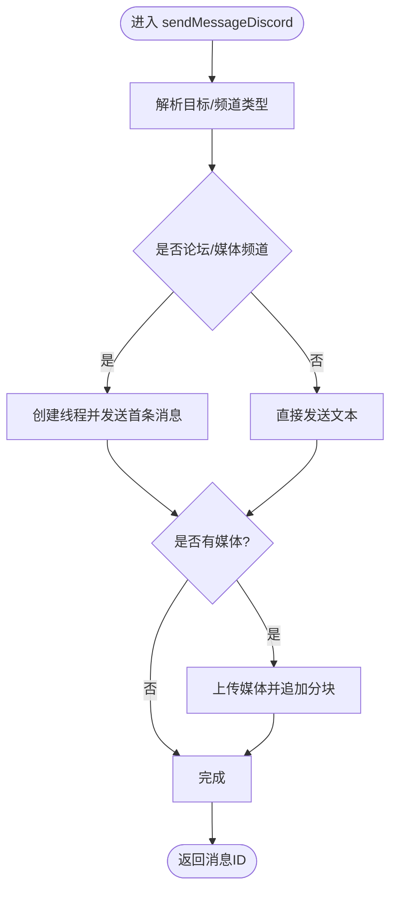
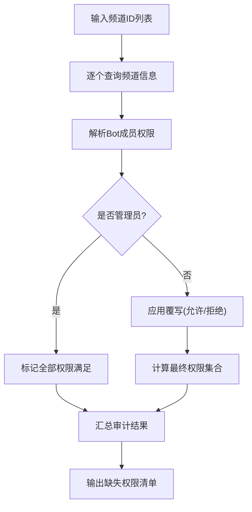
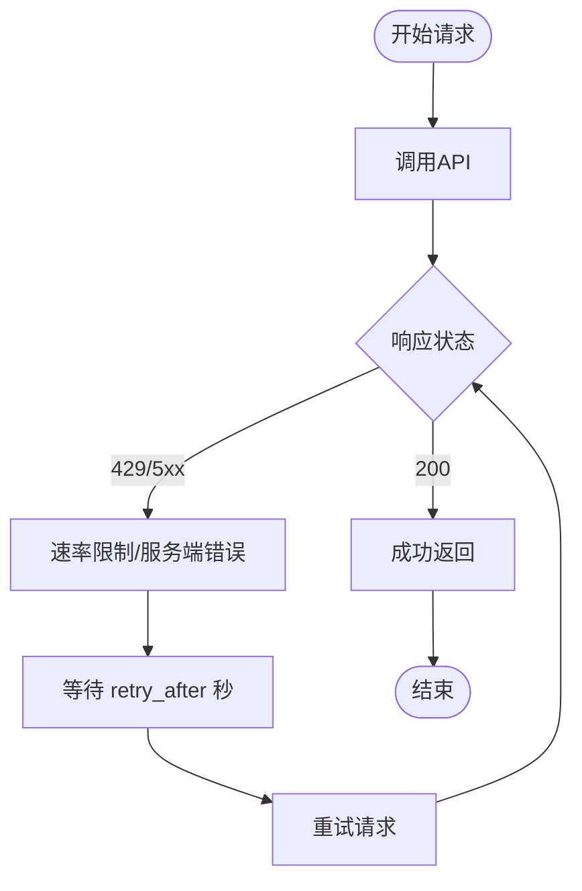
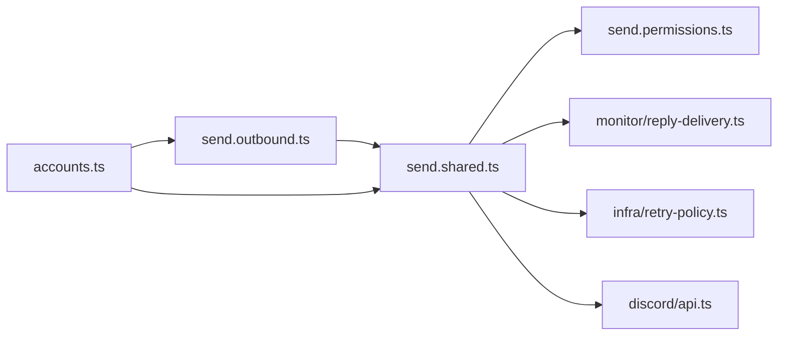

# Discord问题

<cite>
**本文引用的文件**
- [docs/channels/discord.md](file://docs/channels/discord.md)
- [docs/channels/troubleshooting.md](file://docs/channels/troubleshooting.md)
- [src/discord/send.outbound.ts](file://src/discord/send.outbound.ts)
- [src/discord/send.shared.ts](file://src/discord/send.shared.ts)
- [src/discord/send.permissions.ts](file://src/discord/send.permissions.ts)
- [src/discord/audit.ts](file://src/discord/audit.ts)
- [src/discord/accounts.ts](file://src/discord/accounts.ts)
- [src/discord/monitor/reply-delivery.ts](file://src/discord/monitor/reply-delivery.ts)
- [src/infra/retry-policy.ts](file://src/infra/retry-policy.ts)
- [src/discord/api.ts](file://src/discord/api.ts)
- [src/discord/send.creates-thread.test.ts](file://src/discord/send.creates-thread.test.ts)
- [src/discord/send.sends-basic-channel-messages.test.ts](file://src/discord/send.sends-basic-channel-messages.test.ts)
- [src/discord/voice-message.ts](file://src/discord/voice-message.ts)
- [src/discord/chunk.ts](file://src/discord/chunk.ts)
- [src/channels/plugins/status-issues/discord.ts](file://src/channels/plugins/status-issues/discord.ts)
</cite>

## 目录
1. [简介](#简介)
2. [项目结构](#项目结构)
3. [核心组件](#核心组件)
4. [架构总览](#架构总览)
5. [详细组件分析](#详细组件分析)
6. [依赖关系分析](#依赖关系分析)
7. [性能考量](#性能考量)
8. [故障排除指南](#故障排除指南)
9. [结论](#结论)
10. [附录](#附录)

## 简介
本指南聚焦于Discord渠道在OpenClaw中的问题排查与修复，覆盖Bot连接、服务器权限、消息处理、OAuth与权限范围、服务器集成、API限制（文本长度、文件上传）、速率限制与重试策略、以及消息路由与状态检查等关键环节。针对“Bot在线但公会回复缺失”“群组消息被忽略”“DM回复缺失”等典型症状，提供可执行的快速检查清单与修复步骤。

## 项目结构
围绕Discord渠道的关键代码分布在以下模块：
- 文档与配置：Discord通道文档、故障排除速查表、OAuth与权限范围说明
- 发送与消息处理：消息发送、分块、媒体上传、投票、语音消息、错误构建与提示
- 权限与审计：频道权限查询、管理员位检测、权限审计报告
- 账户与令牌：多账户解析、令牌来源、动作开关
- 运行时监控与重试：速率限制重试、重试策略、错误格式化
- 状态检查：意图与权限状态收集

图表来源
- [docs/channels/discord.md:1-800](file://docs/channels/discord.md#L1-L800)
- [docs/channels/troubleshooting.md:1-118](file://docs/channels/troubleshooting.md#L1-L118)
- [src/discord/send.outbound.ts:1-578](file://src/discord/send.outbound.ts#L1-L578)
- [src/discord/send.shared.ts:1-510](file://src/discord/send.shared.ts#L1-L510)
- [src/discord/chunk.ts:104-254](file://src/discord/chunk.ts#L104-L254)
- [src/discord/voice-message.ts:253-286](file://src/discord/voice-message.ts#L253-L286)
- [src/discord/send.permissions.ts:1-233](file://src/discord/send.permissions.ts#L1-L233)
- [src/discord/audit.ts:87-141](file://src/discord/audit.ts#L87-L141)
- [src/discord/accounts.ts:1-90](file://src/discord/accounts.ts#L1-L90)
- [src/discord/monitor/reply-delivery.ts:30-76](file://src/discord/monitor/reply-delivery.ts#L30-L76)
- [src/infra/retry-policy.ts:61-86](file://src/infra/retry-policy.ts#L61-L86)
- [src/discord/api.ts:52-94](file://src/discord/api.ts#L52-L94)
- [src/channels/plugins/status-issues/discord.ts:110-134](file://src/channels/plugins/status-issues/discord.ts#L110-L134)

章节来源
- [docs/channels/discord.md:1-800](file://docs/channels/discord.md#L1-L800)
- [docs/channels/troubleshooting.md:1-118](file://docs/channels/troubleshooting.md#L1-L118)

## 核心组件
- 消息发送与路由
  - sendMessageDiscord：统一入口，负责目标解析、频道类型判断、文本分块、媒体上传、投票与语音消息、错误包装与活动记录
  - sendWebhookMessageDiscord：通过Webhook发送消息
- 分块与内容管理
  - buildDiscordTextChunks/chunkDiscordText：按字符数与行数分块，保持代码围栏与斜体一致性
- 权限与审计
  - fetchChannelPermissionsDiscord：计算Bot在频道中的有效权限集合
  - auditDiscordChannelPermissions：批量审计频道所需权限
- 多账户与令牌
  - resolveDiscordAccount：合并全局与账户级配置，解析令牌来源
- 速率限制与重试
  - createDiscordRetryRunner：基于RateLimitError的重试策略
  - reply-delivery重试：对429与5xx进行指数退避重试
- 错误提示与修复建议
  - buildDiscordSendError：根据错误码与上下文生成缺失权限提示
  - DiscordApiError/formatDiscordApiErrorText：格式化API错误与重试时间

章节来源
- [src/discord/send.outbound.ts:132-317](file://src/discord/send.outbound.ts#L132-L317)
- [src/discord/send.shared.ts:253-482](file://src/discord/send.shared.ts#L253-L482)
- [src/discord/chunk.ts:104-254](file://src/discord/chunk.ts#L104-L254)
- [src/discord/send.permissions.ts:154-232](file://src/discord/send.permissions.ts#L154-L232)
- [src/discord/audit.ts:87-141](file://src/discord/audit.ts#L87-L141)
- [src/discord/accounts.ts:51-69](file://src/discord/accounts.ts#L51-L69)
- [src/infra/retry-policy.ts:61-86](file://src/infra/retry-policy.ts#L61-L86)
- [src/discord/monitor/reply-delivery.ts:39-76](file://src/discord/monitor/reply-delivery.ts#L39-L76)
- [src/discord/api.ts:80-94](file://src/discord/api.ts#L80-L94)

## 架构总览
下图展示从命令到消息发送、权限校验、错误处理与重试的整体流程。

图表来源
- [src/discord/send.outbound.ts:132-317](file://src/discord/send.outbound.ts#L132-L317)
- [src/discord/send.shared.ts:172-225](file://src/discord/send.shared.ts#L172-L225)
- [src/discord/monitor/reply-delivery.ts:63-76](file://src/discord/monitor/reply-delivery.ts#L63-L76)
- [src/infra/retry-policy.ts:61-86](file://src/infra/retry-policy.ts#L61-L86)

## 详细组件分析

### 组件A：消息发送与错误提示
- 功能要点
  - 自动识别论坛/媒体频道并创建线程发布
  - 文本分块与媒体上传分离处理，避免重复发送溢出文本
  - 基于错误码构建缺失权限提示，并补充线程/媒体所需的额外权限
  - 记录通道活动用于健康度统计
- 关键路径
  - sendMessageDiscord主流程
  - buildDiscordSendError错误包装
  - sendDiscordMedia媒体发送

图表来源
- [src/discord/send.outbound.ts:132-317](file://src/discord/send.outbound.ts#L132-L317)
- [src/discord/send.shared.ts:412-482](file://src/discord/send.shared.ts#L412-L482)

章节来源
- [src/discord/send.outbound.ts:132-317](file://src/discord/send.outbound.ts#L132-L317)
- [src/discord/send.shared.ts:172-225](file://src/discord/send.shared.ts#L172-L225)

### 组件B：权限查询与审计
- 功能要点
  - 计算Bot在频道中的有效权限（含角色叠加、覆写优先）
  - 审计多个频道所需权限（默认视图/发消息/附件等）
  - 管理员位直接放行
- 关键路径
  - fetchChannelPermissionsDiscord
  - auditDiscordChannelPermissions

图表来源
- [src/discord/send.permissions.ts:154-232](file://src/discord/send.permissions.ts#L154-L232)
- [src/discord/audit.ts:87-141](file://src/discord/audit.ts#L87-L141)

章节来源
- [src/discord/send.permissions.ts:154-232](file://src/discord/send.permissions.ts#L154-L232)
- [src/discord/audit.ts:87-141](file://src/discord/audit.ts#L87-L141)

### 组件C：速率限制与重试
- 功能要点
  - 基于RateLimitError与retry_after进行指数退避重试
  - 对429/5xx进行自动重试；非速率限制错误不重试
  - 格式化API错误文本，包含retry-after提示
- 关键路径
  - createDiscordRetryRunner
  - reply-delivery重试逻辑
  - DiscordApiError

图表来源
- [src/infra/retry-policy.ts:61-86](file://src/infra/retry-policy.ts#L61-L86)
- [src/discord/monitor/reply-delivery.ts:39-76](file://src/discord/monitor/reply-delivery.ts#L39-L76)
- [src/discord/api.ts:80-94](file://src/discord/api.ts#L80-L94)

章节来源
- [src/infra/retry-policy.ts:61-86](file://src/infra/retry-policy.ts#L61-L86)
- [src/discord/monitor/reply-delivery.ts:39-76](file://src/discord/monitor/reply-delivery.ts#L39-L76)
- [src/discord/api.ts:80-94](file://src/discord/api.ts#L80-L94)

### 组件D：OAuth配置与权限范围
- 关键点
  - OAuth scopes：bot、applications.commands
  - 基础权限：查看频道、发送消息、读取历史、嵌入链接、附件、添加表情（可选）
  - 开发者门户：启用Message Content Intent、Server Members Intent（推荐）
- 快速核对清单
  - 已启用Message Content Intent？
  - 已授予bot与applications.commands权限？
  - 已开启View Channels/Send Messages/Read Message History/Embed Links/Attach Files？

章节来源
- [docs/channels/discord.md:510-526](file://docs/channels/discord.md#L510-L526)
- [docs/channels/discord.md:500-507](file://docs/channels/discord.md#L500-L507)

## 依赖关系分析
- 模块耦合
  - send.outbound依赖send.shared进行目标解析、分块、载荷构建与错误包装
  - send.shared依赖send.permissions进行权限探测，依赖monitor/reply-delivery与retry-policy进行重试
  - accounts提供令牌解析与账户级配置合并
- 外部依赖
  - Discord Bot API（REST/速率限制）
  - Carbon RequestClient序列化与重试机制

图表来源
- [src/discord/send.outbound.ts:132-317](file://src/discord/send.outbound.ts#L132-L317)
- [src/discord/send.shared.ts:172-225](file://src/discord/send.shared.ts#L172-L225)
- [src/discord/send.permissions.ts:154-232](file://src/discord/send.permissions.ts#L154-L232)
- [src/discord/monitor/reply-delivery.ts:63-76](file://src/discord/monitor/reply-delivery.ts#L63-L76)
- [src/infra/retry-policy.ts:61-86](file://src/infra/retry-policy.ts#L61-L86)
- [src/discord/api.ts:80-94](file://src/discord/api.ts#L80-L94)
- [src/discord/accounts.ts:51-69](file://src/discord/accounts.ts#L51-L69)

章节来源
- [src/discord/send.outbound.ts:132-317](file://src/discord/send.outbound.ts#L132-L317)
- [src/discord/send.shared.ts:172-225](file://src/discord/send.shared.ts#L172-L225)
- [src/discord/send.permissions.ts:154-232](file://src/discord/send.permissions.ts#L154-L232)
- [src/discord/monitor/reply-delivery.ts:63-76](file://src/discord/monitor/reply-delivery.ts#L63-L76)
- [src/infra/retry-policy.ts:61-86](file://src/infra/retry-policy.ts#L61-L86)
- [src/discord/api.ts:80-94](file://src/discord/api.ts#L80-L94)
- [src/discord/accounts.ts:51-69](file://src/discord/accounts.ts#L51-L69)

## 性能考量
- 文本分块策略
  - 默认按字符上限与行数限制分块，保持代码围栏与斜体平衡，避免跨块破坏渲染
- 媒体上传
  - 先发送媒体，再追加分块文本，避免重复发送溢出文本
- 速率限制
  - 使用retry_after精确等待，减少无效重试
- 重试策略
  - 仅对429/5xx与RateLimitError重试，避免对业务错误无限重试

章节来源
- [src/discord/chunk.ts:104-254](file://src/discord/chunk.ts#L104-L254)
- [src/discord/send.creates-thread.test.ts:496-520](file://src/discord/send.creates-thread.test.ts#L496-L520)
- [src/discord/monitor/reply-delivery.ts:39-76](file://src/discord/monitor/reply-delivery.ts#L39-L76)
- [src/infra/retry-policy.ts:61-86](file://src/infra/retry-policy.ts#L61-L86)

## 故障排除指南

### 快速检查清单
- 服务器状态与意图
  - Message Content Intent是否已启用？（否则无法看到普通消息）
  - Server Members Intent是否启用以支持角色白名单与名称匹配？
- 连接与可见性
  - openclaw status/gateway status是否显示通道已连接/就绪？
  - openclaw channels status --probe是否通过？
- 权限与覆写
  - 频道/线程是否具备ViewChannel/SendMessages/AttachFiles等必要权限？
  - 是否存在角色/用户覆写导致权限被拒绝？
- 消息路由
  - requireMention是否开启且未提及Bot？
  - DM策略是否为pairing/allowlist且未批准发送者？
- API限制
  - 文本长度是否超过2000字符？是否正确分块？
  - 文件大小是否超过限制？是否使用了受支持的格式？
- 速率限制
  - 是否出现429/5xx错误？是否正确等待retry_after？

章节来源
- [docs/channels/troubleshooting.md:56-66](file://docs/channels/troubleshooting.md#L56-L66)
- [src/channels/plugins/status-issues/discord.ts:110-134](file://src/channels/plugins/status-issues/discord.ts#L110-L134)
- [src/discord/send.shared.ts:25-31](file://src/discord/send.shared.ts#L25-L31)
- [src/discord/voice-message.ts:253-286](file://src/discord/voice-message.ts#L253-L286)

### 常见症状与修复步骤

- 症状：Bot在线但公会回复缺失
  - 检查项
    - 允许的服务器/频道是否在allowlist中
    - Message Content Intent是否启用
    - 频道权限是否包含ViewChannel/SendMessages
  - 修复步骤
    - 将服务器加入allowlist，或调整groupPolicy=open
    - 在开发者门户启用Message Content Intent
    - 使用权限审计工具检查缺失权限并修正覆写

章节来源
- [docs/channels/troubleshooting.md:62](file://docs/channels/troubleshooting.md#L62)
- [src/channels/plugins/status-issues/discord.ts:124-134](file://src/channels/plugins/status-issues/discord.ts#L124-L134)
- [src/discord/audit.ts:87-141](file://src/discord/audit.ts#L87-L141)

- 症状：群组消息被忽略
  - 检查项
    - requireMention是否开启
    - 是否存在@其他用户但未@Bot的忽略规则
  - 修复步骤
    - 设置requireMention:false或确保消息提及Bot
    - 调整ignoreOtherMentions策略

章节来源
- [docs/channels/troubleshooting.md:63](file://docs/channels/troubleshooting.md#L63)

- 症状：DM回复缺失
  - 检查项
    - DM策略是否为pairing/allowlist
    - 是否已批准配对
  - 修复步骤
    - 执行openclaw pairing list discord并批准配对
    - 调整DM策略为open或完善allowFrom

章节来源
- [docs/channels/troubleshooting.md:64](file://docs/channels/troubleshooting.md#L64)

- 症状：发送失败（权限不足）
  - 检查项
    - 错误码是否为50013
    - 线程/媒体场景是否缺少SendMessagesInThreads/AttachFiles
  - 修复步骤
    - 使用权限审计工具定位缺失权限
    - 在服务器/频道中授予相应权限或移除覆写

章节来源
- [src/discord/send.sends-basic-channel-messages.test.ts:219-250](file://src/discord/send.sends-basic-channel-messages.test.ts#L219-L250)
- [src/discord/send.shared.ts:172-225](file://src/discord/send.shared.ts#L172-L225)

- 症状：发送失败（速率限制/网络错误）
  - 检查项
    - 是否出现429/5xx
    - retry_after是否正确等待
  - 修复步骤
    - 启用重试策略并等待retry_after秒
    - 降低发送频率或优化分块策略

章节来源
- [src/discord/monitor/reply-delivery.ts:39-76](file://src/discord/monitor/reply-delivery.ts#L39-L76)
- [src/infra/retry-policy.ts:61-86](file://src/infra/retry-policy.ts#L61-L86)

- 症状：文本过长/分块异常
  - 检查项
    - 文本长度是否超过2000字符
    - 是否正确设置maxLinesPerMessage
  - 修复步骤
    - 使用默认分块策略或自定义maxLinesPerMessage
    - 确保代码围栏与斜体在分块边界保持平衡

章节来源
- [src/discord/chunk.ts:104-254](file://src/discord/chunk.ts#L104-L254)
- [src/discord/send.outbound.ts:263-279](file://src/discord/send.outbound.ts#L263-L279)

- 症状：文件上传失败
  - 检查项
    - 文件大小是否超过限制
    - 上传URL获取是否429并正确重试
  - 修复步骤
    - 缩小文件或转换为受支持格式
    - 等待retry_after后重试

章节来源
- [src/discord/voice-message.ts:253-286](file://src/discord/voice-message.ts#L253-L286)

## 结论
通过结合文档指引、权限审计、速率限制重试与错误提示机制，可系统性地定位并修复Discord渠道问题。建议在部署后立即执行“快速检查清单”，并在生产环境中持续使用openclaw channels status --probe与权限审计工具进行健康巡检。

## 附录

### API与限制摘要
- 文本长度：默认2000字符
- 表情包数量：最多3个/消息
- 投票答案数：最多10个
- 投票最长时长：最多32天
- 语音消息：需OGG/Opus，不可包含文本内容

章节来源
- [src/discord/send.shared.ts:25-29](file://src/discord/send.shared.ts#L25-L29)
- [src/discord/send.outbound.ts:443-472](file://src/discord/send.outbound.ts#L443-L472)
- [src/discord/voice-message.ts:508-577](file://src/discord/voice-message.ts#L508-L577)