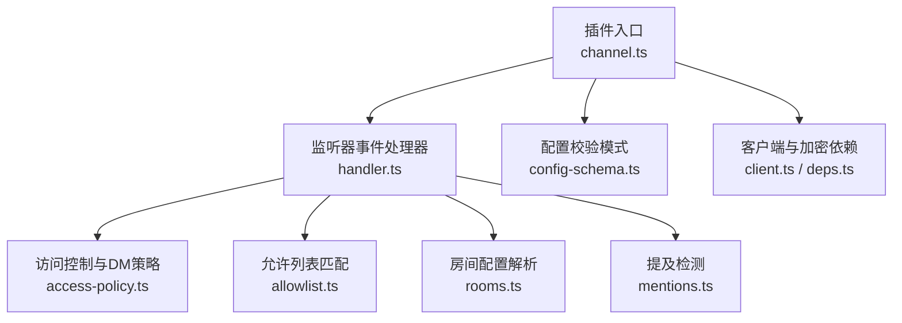
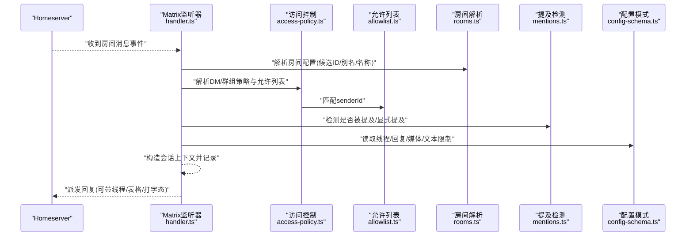
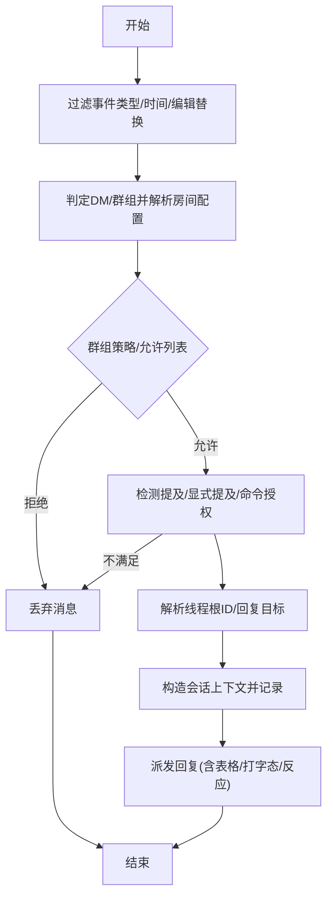
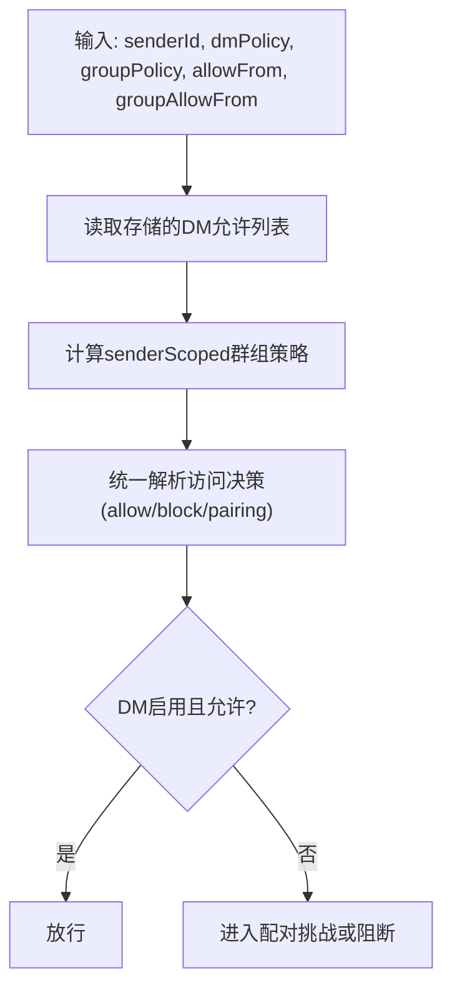
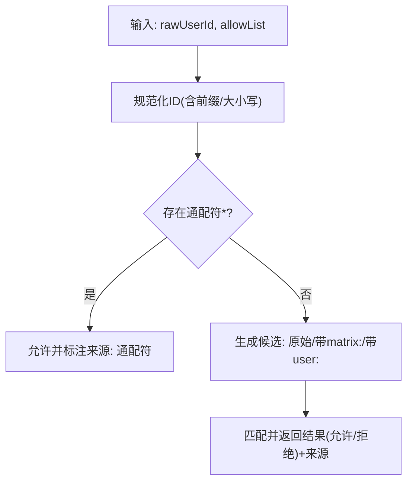
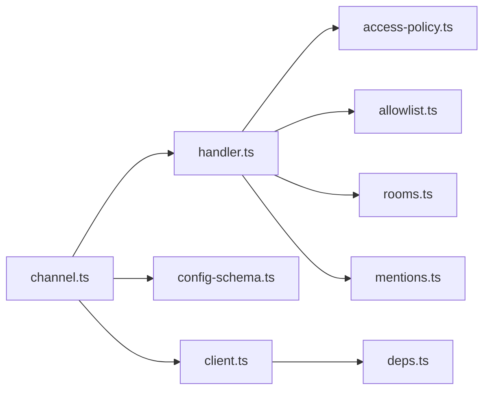

# Matrix问题

<cite>
**本文引用的文件**
- [matrix.md](file://docs/channels/matrix.md)
- [channel.ts](file://extensions/matrix/src/channel.ts)
- [handler.ts](file://extensions/matrix/src/matrix/monitor/handler.ts)
- [access-policy.ts](file://extensions/matrix/src/matrix/monitor/access-policy.ts)
- [allowlist.ts](file://extensions/matrix/src/matrix/monitor/allowlist.ts)
- [rooms.ts](file://extensions/matrix/src/matrix/monitor/rooms.ts)
- [mentions.ts](file://extensions/matrix/src/matrix/monitor/mentions.ts)
- [config-schema.ts](file://extensions/matrix/src/config-schema.ts)
- [client.ts](file://extensions/matrix/src/matrix/client.ts)
- [deps.ts](file://extensions/matrix/src/matrix/deps.ts)
</cite>

## 目录
1. [简介](#简介)
2. [项目结构](#项目结构)
3. [核心组件](#核心组件)
4. [架构总览](#架构总览)
5. [详细组件分析](#详细组件分析)
6. [依赖关系分析](#依赖关系分析)
7. [性能考量](#性能考量)
8. [故障排除指南](#故障排除指南)
9. [结论](#结论)

## 简介
本指南聚焦于Matrix渠道在OpenClaw中的运行与故障排除，覆盖登录状态、房间消息处理、加密房间配置等关键环节。内容基于Matrix插件源码与官方文档，提供针对“已登录但忽略房间消息”“DM无法处理”“加密房间失败”等典型问题的诊断流程与修复步骤，并重点说明groupPolicy配置、房间允许列表、加密模块验证等技术要点。

## 项目结构
Matrix渠道由“插件入口 + 监听器 + 访问控制 + 允许列表 + 房间解析 + 提及检测 + 配置校验 + 客户端与加密依赖”等模块组成。整体采用分层设计：插件入口负责生命周期与配置；监听器负责事件接收与路由；访问控制与允许列表负责安全与准入；房间解析与提及检测负责消息语义识别；配置校验保证参数合法性；客户端与加密依赖负责连接与E2EE能力。

**图表来源**
- [channel.ts:132-461](file://extensions/matrix/src/channel.ts#L132-L461)
- [handler.ts:130-768](file://extensions/matrix/src/matrix/monitor/handler.ts#L130-L768)
- [access-policy.ts:17-127](file://extensions/matrix/src/matrix/monitor/access-policy.ts#L17-L127)
- [allowlist.ts:66-101](file://extensions/matrix/src/matrix/monitor/allowlist.ts#L66-L101)
- [rooms.ts:12-48](file://extensions/matrix/src/matrix/monitor/rooms.ts#L12-L48)
- [mentions.ts:37-63](file://extensions/matrix/src/matrix/monitor/mentions.ts#L37-L63)
- [config-schema.ts:34-62](file://extensions/matrix/src/config-schema.ts#L34-L62)
- [client.ts:1-15](file://extensions/matrix/src/matrix/client.ts#L1-L15)
- [deps.ts:45-88](file://extensions/matrix/src/matrix/deps.ts#L45-L88)

**章节来源**
- [channel.ts:1-462](file://extensions/matrix/src/channel.ts#L1-L462)
- [matrix.md:1-304](file://docs/channels/matrix.md#L1-L304)

## 核心组件
- 插件入口与生命周期
  - 负责插件元数据、能力声明、配置模式、目录查询、目标解析、对外动作、启动与状态探测。
- 监听器事件处理器
  - 处理RoomMessage/Encrypted/Location/Poll等事件，进行时间窗口过滤、DM/群组判定、允许列表与提及规则评估、线程上下文构建、会话记录与回复派发。
- 访问控制与DM策略
  - 统一解析DM与群组策略，结合存储的配对信息与允许列表，决定是否放行。
- 允许列表匹配
  - 规范化用户ID（含matrix:/user:前缀），支持通配符与多种候选匹配。
- 房间配置解析
  - 基于房间ID/别名/名称候选匹配，支持直接与通配配置，返回允许状态与命中来源。
- 提及检测
  - 支持m.mentions字段与HTML格式化正文中的matrix.to链接两种形式。
- 配置校验模式
  - 定义DM策略、群组策略、房间配置、自动加入、媒体上限、线程回复等键的合法取值。
- 客户端与加密依赖
  - 解析认证与共享客户端，按需下载/加载Rust加密SDK二进制，确保E2EE可用。

**章节来源**
- [channel.ts:132-461](file://extensions/matrix/src/channel.ts#L132-L461)
- [handler.ts:130-768](file://extensions/matrix/src/matrix/monitor/handler.ts#L130-L768)
- [access-policy.ts:17-127](file://extensions/matrix/src/matrix/monitor/access-policy.ts#L17-L127)
- [allowlist.ts:66-101](file://extensions/matrix/src/matrix/monitor/allowlist.ts#L66-L101)
- [rooms.ts:12-48](file://extensions/matrix/src/matrix/monitor/rooms.ts#L12-L48)
- [mentions.ts:37-63](file://extensions/matrix/src/matrix/monitor/mentions.ts#L37-L63)
- [config-schema.ts:34-62](file://extensions/matrix/src/config-schema.ts#L34-L62)
- [client.ts:1-15](file://extensions/matrix/src/matrix/client.ts#L1-L15)
- [deps.ts:45-88](file://extensions/matrix/src/matrix/deps.ts#L45-L88)

## 架构总览
下图展示从事件接收、准入控制到回复派发的关键路径，以及与配置的关系。

**图表来源**
- [handler.ts:162-768](file://extensions/matrix/src/matrix/monitor/handler.ts#L162-L768)
- [access-policy.ts:17-127](file://extensions/matrix/src/matrix/monitor/access-policy.ts#L17-L127)
- [allowlist.ts:75-101](file://extensions/matrix/src/matrix/monitor/allowlist.ts#L75-L101)
- [rooms.ts:12-48](file://extensions/matrix/src/matrix/monitor/rooms.ts#L12-L48)
- [mentions.ts:37-63](file://extensions/matrix/src/matrix/monitor/mentions.ts#L37-L63)
- [config-schema.ts:34-62](file://extensions/matrix/src/config-schema.ts#L34-L62)

## 详细组件分析

### 事件处理器与消息处理流程
- 时间窗口与类型过滤
  - 忽略被编辑替换、自身消息、过旧事件，确保只处理有效入站消息。
- 加密消息处理
  - 对加密事件不做额外解密逻辑（由底层SDK自动处理）。
- 房间/DM分类与房间配置覆盖
  - 通过房间配置可将原本DM的房间强制视为群组，避免误判。
- 群组策略与允许列表
  - groupPolicy为disabled时直接丢弃；allowlist未配置或未命中则丢弃。
- 提及要求与命令授权
  - 群组消息默认需要被提及，除非autoReply或显式命令授权豁免。
- 线程与回复目标
  - 根据threadReplies与根事件ID确定回复落点，支持“始终/仅入站/关闭”三种策略。
- 会话记录与回复派发
  - 记录会话元数据，构造带信封的正文，派发回复并可选发送打字态与反应确认。

**图表来源**
- [handler.ts:162-768](file://extensions/matrix/src/matrix/monitor/handler.ts#L162-L768)

**章节来源**
- [handler.ts:162-768](file://extensions/matrix/src/matrix/monitor/handler.ts#L162-L768)

### 访问控制与DM策略
- DM策略
  - open/pairing/allowlist/disabled四种策略，结合存储的配对状态与allowFrom决定放行。
- 群组策略
  - open/allowlist/disabled，senderScoped策略可基于groupAllowFrom动态调整。
- 匹配优先级
  - direct配置可覆盖DM分类；房间users允许列表优先于groupAllowFrom。

**图表来源**
- [access-policy.ts:17-127](file://extensions/matrix/src/matrix/monitor/access-policy.ts#L17-L127)

**章节来源**
- [access-policy.ts:17-127](file://extensions/matrix/src/matrix/monitor/access-policy.ts#L17-L127)

### 允许列表匹配与规范化
- 用户ID规范化
  - 支持matrix:/user:前缀与裸ID，统一大小写与@/域名部分标准化。
- 匹配候选
  - 同时尝试原始ID、带前缀ID、带user:前缀ID，支持通配符。
- 返回匹配来源
  - 明确命中来源（直接/通配），便于日志与告警。

**图表来源**
- [allowlist.ts:66-101](file://extensions/matrix/src/matrix/monitor/allowlist.ts#L66-L101)

**章节来源**
- [allowlist.ts:66-101](file://extensions/matrix/src/matrix/monitor/allowlist.ts#L66-L101)

### 房间配置解析
- 候选键
  - 房间ID、room:前缀ID、别名列表。
- 命中优先级
  - 直接命中优先于通配；未配置或禁用则不允许。
- 允许状态
  - enabled/allow字段共同决定最终允许与否。

**章节来源**
- [rooms.ts:12-48](file://extensions/matrix/src/matrix/monitor/rooms.ts#L12-L48)

### 提及检测
- 检测范围
  - m.mentions字段、房间@提及、HTML格式化正文中的matrix.to链接。
- 与正则提及的组合
  - 可与自定义正则共同生效，提升兼容性。

**章节来源**
- [mentions.ts:37-63](file://extensions/matrix/src/matrix/monitor/mentions.ts#L37-L63)

### 配置校验与模式
- 关键键位
  - dm策略、群组策略、房间配置、自动加入、媒体上限、线程回复、chunk模式、markdown等。
- 房间配置项
  - enabled/allow/autoReply/users/skills/systemPrompt等。

**章节来源**
- [config-schema.ts:34-62](file://extensions/matrix/src/config-schema.ts#L34-L62)

### 客户端与加密依赖
- 运行时要求
  - Matrix支持需要Node环境（Bun不支持）。
- 共享客户端
  - 在网关端口存在时可复用共享客户端以降低资源占用。
- 加密SDK
  - 缺失时自动下载平台库并重试加载；失败则记录警告并禁用E2EE。

**章节来源**
- [client.ts:1-15](file://extensions/matrix/src/matrix/client.ts#L1-L15)
- [deps.ts:45-88](file://extensions/matrix/src/matrix/deps.ts#L45-L88)

## 依赖关系分析
- 插件入口依赖监听器、配置模式、目录与目标解析、动作模块、状态探测。
- 监听器依赖访问控制、允许列表、房间解析、提及检测、配置模式。
- 客户端与加密依赖贯穿启动阶段，影响E2EE可用性与设备验证流程。

**图表来源**
- [channel.ts:132-461](file://extensions/matrix/src/channel.ts#L132-L461)
- [handler.ts:130-768](file://extensions/matrix/src/matrix/monitor/handler.ts#L130-L768)
- [access-policy.ts:17-127](file://extensions/matrix/src/matrix/monitor/access-policy.ts#L17-L127)
- [allowlist.ts:66-101](file://extensions/matrix/src/matrix/monitor/allowlist.ts#L66-L101)
- [rooms.ts:12-48](file://extensions/matrix/src/matrix/monitor/rooms.ts#L12-L48)
- [mentions.ts:37-63](file://extensions/matrix/src/matrix/monitor/mentions.ts#L37-L63)
- [config-schema.ts:34-62](file://extensions/matrix/src/config-schema.ts#L34-L62)
- [client.ts:1-15](file://extensions/matrix/src/matrix/client.ts#L1-L15)
- [deps.ts:45-88](file://extensions/matrix/src/matrix/deps.ts#L45-L88)

## 性能考量
- 启动串行化
  - 多账号启动通过锁序列化，避免并发动态导入竞争。
- 共享客户端
  - 网关模式下复用客户端，减少连接与内存开销。
- 事件过滤
  - 严格的时间窗口与类型过滤减少无效处理。
- 线程与回复
  - 合理配置threadReplies与replyToMode，避免过度线程化导致回环与延迟。

**章节来源**
- [channel.ts:418-461](file://extensions/matrix/src/channel.ts#L418-L461)
- [handler.ts:194-203](file://extensions/matrix/src/matrix/monitor/handler.ts#L194-L203)

## 故障排除指南

### 通用排查清单
- 使用官方命令快速定位问题
  - 运行状态、网关状态、实时日志、健康检查、通道探测。
- 核对DM配对状态
  - 列出并批准配对请求，确保DM策略为pairing时已获准。

**章节来源**
- [matrix.md:250-272](file://docs/channels/matrix.md#L250-L272)

### 已登录但房间消息被忽略
可能原因
- 群组策略为disabled
- 允许列表未配置或未命中
- 房间配置禁用或未允许
- 提及要求未满足且无命令授权

诊断步骤
1. 检查群组策略与房间配置
   - 确认groupPolicy非disabled；房间配置enabled/allow为true。
2. 核对允许列表
   - 检查groupAllowFrom与房间users是否包含发送者；使用规范ID（@user:server）。
3. 验证提及/命令授权
   - 群组消息默认需要被提及；若autoReply=false或requireMention=true，需被提及或显式命令授权。
4. 查看日志
   - 关注“drop room message”“not in allowlist”“no-mention”等提示。

修复建议
- 将房间加入groups并启用；或设置groupPolicy为open并配置groupAllowFrom。
- 在房间users或groupAllowFrom中添加发送者ID。
- 调整requireMention/autoReply或在消息中@机器人并携带授权命令。

**章节来源**
- [handler.ts:266-295](file://extensions/matrix/src/matrix/monitor/handler.ts#L266-L295)
- [handler.ts:413-483](file://extensions/matrix/src/matrix/monitor/handler.ts#L413-L483)
- [rooms.ts:36-47](file://extensions/matrix/src/matrix/monitor/rooms.ts#L36-L47)
- [allowlist.ts:75-101](file://extensions/matrix/src/matrix/monitor/allowlist.ts#L75-L101)

### DM无法处理（pairing/allowlist）
可能原因
- DM策略为pairing且发送者未获准
- DM策略为allowlist但发送者不在allowFrom
- DM未启用

诊断步骤
1. 检查DM策略与允许列表
   - 若为pairing，查看配对请求并批准；若为allowlist，核对allowFrom。
2. 确认DM启用
   - dm.policy非disabled且允许From列表包含发送者。
3. 查看配对交互
   - 机器人会下发配对码并通过DM回复；批准后方可通信。

修复建议
- 将发送者加入dm.allowFrom；或改为open策略并配置通配符。
- 批准配对请求；必要时清理过期配对并重新发起。

**章节来源**
- [access-policy.ts:64-127](file://extensions/matrix/src/matrix/monitor/access-policy.ts#L64-L127)
- [handler.ts:317-334](file://extensions/matrix/src/matrix/monitor/handler.ts#L317-L334)

### 加密房间失败（E2EE）
可能原因
- 加密SDK缺失或加载失败
- 设备未验证或验证未完成
- homeserver/accessToken不匹配导致密钥库变更

诊断步骤
1. 检查加密SDK
   - 若报缺少crypto模块，执行文档建议的重建或下载二进制脚本。
2. 设备验证
   - 首次连接会请求验证；在其他客户端批准后重试。
3. 密钥库与令牌
   - 更换access token或设备会导致新建密钥库，需重新验证。

修复建议
- 按文档指引安装/重建加密SDK；确保Node运行时。
- 在其他客户端完成验证；重启服务后重试。
- 如更换令牌/设备，接受重新验证流程。

**章节来源**
- [matrix.md:111-137](file://docs/channels/matrix.md#L111-L137)
- [deps.ts:45-88](file://extensions/matrix/src/matrix/deps.ts#L45-L88)
- [client.ts:9-15](file://extensions/matrix/src/matrix/client.ts#L9-L15)

### 房间重新加入与邀请处理
- 默认行为
  - 自动接受邀请；可通过autoJoin与autoJoinAllowlist精细控制。
- 建议
  - 在groupAllowFrom或房间users中提前配置允许主体，避免加入后仍被拦截。

**章节来源**
- [matrix.md:222-224](file://docs/channels/matrix.md#L222-L224)
- [config-schema.ts:55-56](file://extensions/matrix/src/config-schema.ts#L55-L56)

### 同步问题与启动异常
- 启动串行化
  - 多账号启动通过锁序列化，避免动态导入竞态。
- 共享客户端
  - 网关模式下复用客户端；如出现异常，检查端口与共享状态。
- 日志与状态
  - 使用doctor/status/probe命令定位错误；关注lastError与probe结果。

**章节来源**
- [channel.ts:418-461](file://extensions/matrix/src/channel.ts#L418-L461)
- [client.ts:28-47](file://extensions/matrix/src/matrix/client.ts#L28-L47)
- [matrix.md:250-258](file://docs/channels/matrix.md#L250-L258)

## 结论
Matrix渠道的稳定性取决于“配置正确性（策略/允许列表/房间配置）+ 安全准入（DM/群组策略）+ 加密可用性（SDK/验证）”。通过本文提供的诊断流程与修复步骤，可系统性地定位并解决“已登录但忽略房间消息”“DM无法处理”“加密房间失败”等常见问题。建议在生产环境中：
- 明确groupPolicy与allowFrom，避免open策略带来的风险；
- 为敏感房间配置房间users与groupAllowFrom；
- 在启用E2EE前完成设备验证；
- 使用共享客户端与合理的线程/回复策略优化性能与体验。