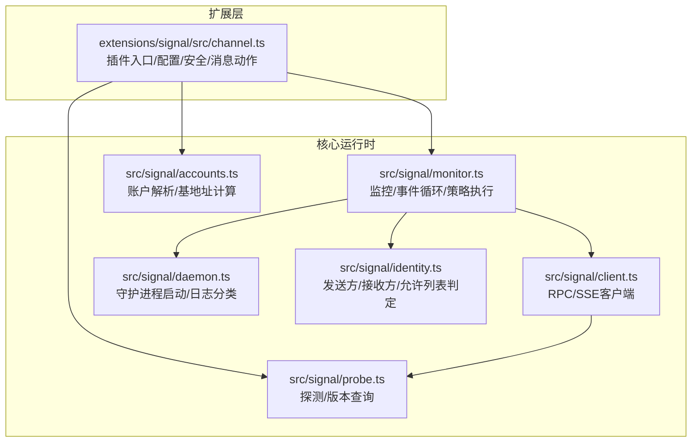
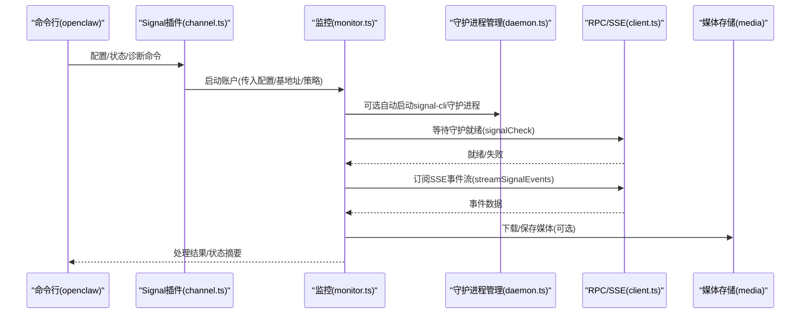
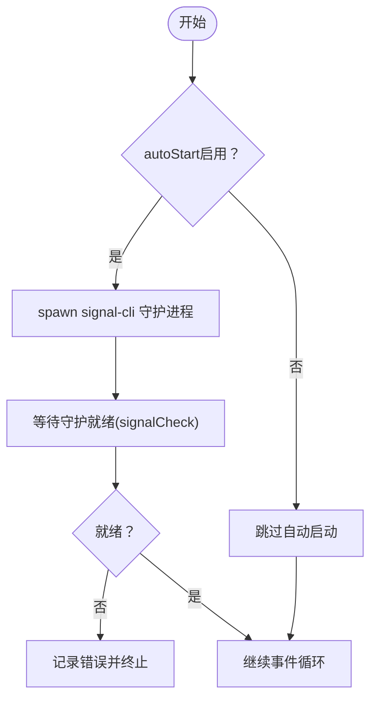
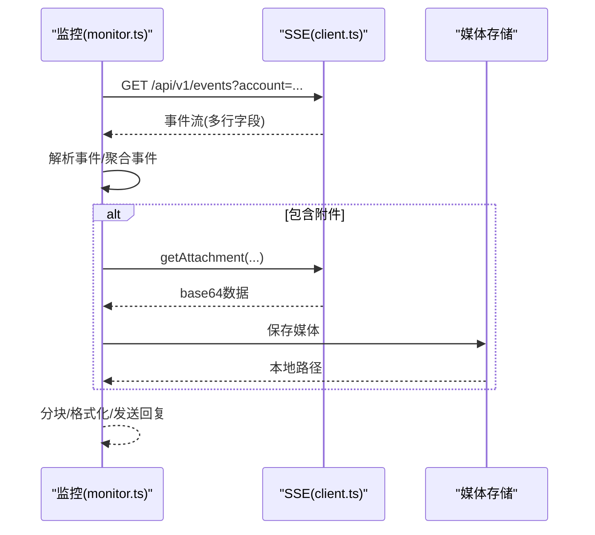
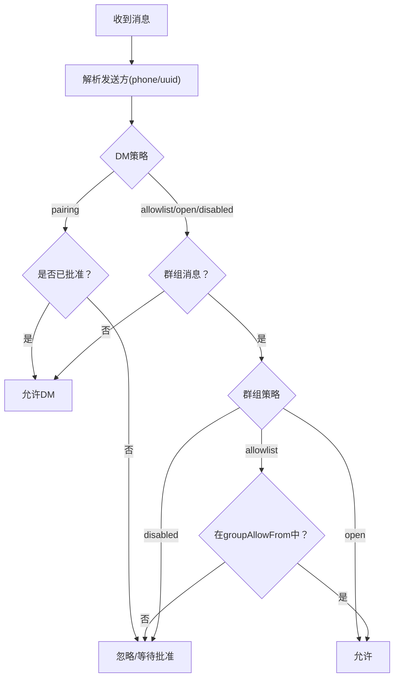
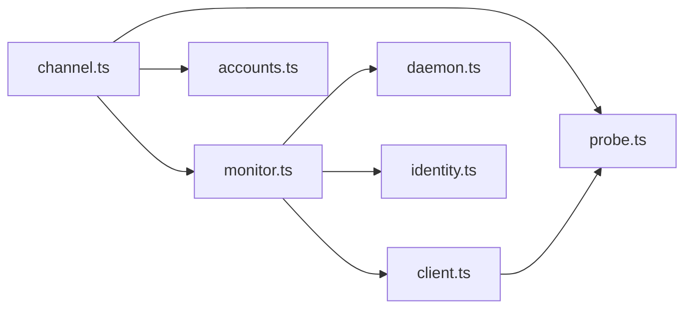

# Signal问题

<cite>
**本文引用的文件**
- [signal.md](file://docs/channels/signal.md)
- [troubleshooting.md](file://docs/channels/troubleshooting.md)
- [channel.ts](file://extensions/signal/src/channel.ts)
- [daemon.ts](file://src/signal/daemon.ts)
- [client.ts](file://src/signal/client.ts)
- [monitor.ts](file://src/signal/monitor.ts)
- [probe.ts](file://src/signal/probe.ts)
- [accounts.ts](file://src/signal/accounts.ts)
- [identity.ts](file://src/signal/identity.ts)
- [monitor.test.ts](file://src/signal/monitor.test.ts)
</cite>

## 目录
1. [简介](#简介)
2. [项目结构](#项目结构)
3. [核心组件](#核心组件)
4. [架构总览](#架构总览)
5. [详细组件分析](#详细组件分析)
6. [依赖关系分析](#依赖关系分析)
7. [性能考量](#性能考量)
8. [故障排除指南](#故障排除指南)
9. [结论](#结论)
10. [附录](#附录)

## 简介
本指南聚焦于Signal渠道（通过signal-cli）在OpenClaw中的常见问题与系统化排查方法。内容覆盖守护进程连接、账户配置、接收模式、访问控制（DM与群组）、提及模式处理、媒体限制、反应通知等关键环节，并提供针对“守护进程可达但机器人静默”“DM被阻止”“群组回复不触发”等典型症状的快速检查与修复步骤。

## 项目结构
Signal渠道由两部分组成：
- 扩展层：定义插件接口、配置解析、安全策略、消息动作与状态采集
- 核心运行时：守护进程管理、HTTP RPC/SSE事件订阅、消息处理与分发

图表来源
- [channel.ts:105-324](file://extensions/signal/src/channel.ts#L105-L324)
- [monitor.ts:327-478](file://src/signal/monitor.ts#L327-L478)
- [client.ts:1-216](file://src/signal/client.ts#L1-L216)
- [daemon.ts:1-148](file://src/signal/daemon.ts#L1-L148)
- [accounts.ts:1-70](file://src/signal/accounts.ts#L1-L70)
- [identity.ts:1-140](file://src/signal/identity.ts#L1-L140)
- [probe.ts:1-57](file://src/signal/probe.ts#L1-L57)

章节来源
- [channel.ts:105-324](file://extensions/signal/src/channel.ts#L105-L324)
- [monitor.ts:327-478](file://src/signal/monitor.ts#L327-L478)

## 核心组件
- 插件入口与配置
  - 账户作用域配置访问器、DM策略构建、消息动作适配、目标解析与标准化
  - 支持多账户、默认账户、启用/删除账户、配置校验与补丁应用
- 守护进程管理
  - 基于signal-cli的子进程管理、输出分类（日志/错误）、退出事件处理
  - 参数映射：账号、HTTP绑定、接收模式、忽略附件/故事、已读回执
- RPC与SSE客户端
  - RPC请求封装、响应解析、超时处理；SSE事件流解析与重连
- 监控与事件处理
  - 等待守护就绪、事件循环、历史上下文、分块发送、媒体下载、反应通知
- 探测与账户解析
  - 基础URL探测与版本查询；账户合并配置、基地址计算、是否已配置判断
- 发送方/接收方与允许列表
  - 电话号/UUID识别与归一化；允许列表匹配；群组策略评估

章节来源
- [channel.ts:50-324](file://extensions/signal/src/channel.ts#L50-L324)
- [daemon.ts:49-147](file://src/signal/daemon.ts#L49-L147)
- [client.ts:50-216](file://src/signal/client.ts#L50-L216)
- [monitor.ts:205-478](file://src/signal/monitor.ts#L205-L478)
- [probe.ts:23-56](file://src/signal/probe.ts#L23-L56)
- [accounts.ts:35-70](file://src/signal/accounts.ts#L35-L70)
- [identity.ts:107-140](file://src/signal/identity.ts#L107-L140)

## 架构总览
Signal渠道采用“扩展插件 + 核心运行时”的分层设计。扩展负责通道语义与配置，核心负责与signal-cli交互（HTTP RPC + SSE），并执行消息路由、策略与媒体处理。

图表来源
- [channel.ts:296-321](file://extensions/signal/src/channel.ts#L296-L321)
- [monitor.ts:405-461](file://src/signal/monitor.ts#L405-L461)
- [client.ts:109-216](file://src/signal/client.ts#L109-L216)
- [daemon.ts:91-147](file://src/signal/daemon.ts#L91-L147)

## 详细组件分析

### 组件A：守护进程启动与健康检查
- 关键点
  - 自动启动：当未显式提供httpUrl时，默认自动启动signal-cli守护进程
  - 参数映射：account、httpHost、httpPort、receiveMode、ignoreAttachments、ignoreStories、sendReadReceipts
  - 日志分类：stderr中含ERROR/WARN/WARNING或特定关键字视为错误
  - 健康检查：基于/check端点；成功后可调用version RPC获取版本
- 故障定位
  - 守护进程无法启动：检查spawn错误、CLI路径、端口占用、权限
  - 健康检查失败：确认bind地址/端口、防火墙、反向代理、超时设置

图表来源
- [monitor.ts:373-419](file://src/signal/monitor.ts#L373-L419)
- [daemon.ts:91-147](file://src/signal/daemon.ts#L91-L147)
- [client.ts:109-132](file://src/signal/client.ts#L109-L132)

章节来源
- [monitor.ts:373-419](file://src/signal/monitor.ts#L373-L419)
- [daemon.ts:91-147](file://src/signal/daemon.ts#L91-L147)
- [client.ts:109-132](file://src/signal/client.ts#L109-L132)

### 组件B：消息接收与事件处理
- 关键点
  - SSE事件流订阅；按行解析event/data/id；空行作为事件边界
  - 媒体附件：根据大小限制调用RPC下载并落盘
  - 分块发送：支持按长度或按空白行分段
  - 反应通知：根据配置决定是否转发/通知
- 故障定位
  - 无事件到达：确认SSE URL、账户参数、网络连通性
  - 媒体过大/下载失败：检查mediaMaxMb、RPC返回、存储权限

图表来源
- [client.ts:134-216](file://src/signal/client.ts#L134-L216)
- [monitor.ts:234-325](file://src/signal/monitor.ts#L234-L325)

章节来源
- [client.ts:134-216](file://src/signal/client.ts#L134-L216)
- [monitor.ts:234-325](file://src/signal/monitor.ts#L234-L325)

### 组件C：访问控制与群组策略
- 关键点
  - DM策略：pairing/allowlist/open/disabled；默认pairing
  - 允许列表：支持E.164与uuid前缀；支持通配符*
  - 群组策略：open/allowlist/disabled；运行时若配置缺失，回退到allowlist
  - 群组允许列表：groupAllowFrom或回退到allowFrom
- 故障定位
  - DM被阻止：检查pairing状态或allowFrom条目
  - 群组回复不触发：检查groupPolicy与groupAllowFrom

图表来源
- [channel.ts:158-183](file://extensions/signal/src/channel.ts#L158-L183)
- [identity.ts:107-140](file://src/signal/identity.ts#L107-L140)
- [monitor.ts:354-366](file://src/signal/monitor.ts#L354-L366)

章节来源
- [channel.ts:158-183](file://extensions/signal/src/channel.ts#L158-L183)
- [identity.ts:107-140](file://src/signal/identity.ts#L107-L140)
- [monitor.ts:354-366](file://src/signal/monitor.ts#L354-L366)

### 组件D：配置写入与诊断
- 关键点
  - 默认允许Signal写入配置更新（需commands.config开启）
  - 通过openclaw doctor与channels status --probe进行诊断
  - 多账户支持与默认账户迁移
- 故障定位
  - 配置写入失败：检查commands.config权限与配置项合法性

章节来源
- [signal.md:61-71](file://docs/channels/signal.md#L61-L71)
- [channel.ts:128-157](file://extensions/signal/src/channel.ts#L128-L157)

## 依赖关系分析
- 插件对运行时的依赖
  - channel.ts依赖runtime提供的消息发送、文本分块、状态汇总、探测函数
  - monitor.ts依赖client.ts的RPC/SSE、daemon.ts的守护进程生命周期、identity.ts的允许列表判定
- 运行时内部耦合
  - accounts.ts提供账户解析与基地址；probe.ts提供探测能力；client.ts提供网络层抽象

图表来源
- [channel.ts:33-33](file://extensions/signal/src/channel.ts#L33-L33)
- [monitor.ts:18-29](file://src/signal/monitor.ts#L18-L29)

章节来源
- [channel.ts:33-33](file://extensions/signal/src/channel.ts#L33-L33)
- [monitor.ts:18-29](file://src/signal/monitor.ts#L18-L29)

## 性能考量
- 启动等待与超时
  - autoStart模式下，等待守护就绪有超时上限；可通过startupTimeoutMs调整
- 媒体与分块
  - 媒体大小限制与下载策略影响吞吐；文本分块模式影响长消息传输效率
- 事件处理
  - SSE事件解析与媒体下载串行化可能成为瓶颈；建议合理设置并发与缓存

## 故障排除指南

### 快速检查清单
- 基础健康
  - 运行状态、网关状态、日志跟踪、诊断命令、通道探测
- 通道特有问题
  - 守护进程可达但机器人静默：检查httpUrl/account/receiveMode
  - DM被阻止：检查pairing状态或dmPolicy/allowFrom
  - 群组回复不触发：检查groupPolicy与groupAllowFrom

章节来源
- [signal.md:251-285](file://docs/channels/signal.md#L251-L285)
- [troubleshooting.md:95-105](file://docs/channels/troubleshooting.md#L95-L105)

### 常见症状与修复

- 守护进程可达但机器人静默
  - 检查项
    - httpUrl与account是否正确
    - receiveMode是否为on-start且已启用接收
    - autoStart与启动超时设置
  - 修复建议
    - 显式设置httpUrl或确保autoStart与端口可用
    - 如使用外部守护进程，关闭autoStart并设置合适的startupTimeoutMs

- DM被阻止
  - 检查项
    - 发送者是否在allowFrom中或已批准pairing
    - dmPolicy是否为pairing且未批准
  - 修复建议
    - 将发送者加入allowFrom或改为open/allowlist
    - 在服务端批准pairing码

- 群组回复不触发
  - 检查项
    - groupPolicy与groupAllowFrom
    - 运行时缺失配置时的回退行为
  - 修复建议
    - 设置groupPolicy为open或在allowFrom中添加发送者
    - 若使用allowlist，确保groupAllowFrom包含允许的发送者

- 配置验证错误
  - 检查项
    - channels.signal.enabled是否为true
    - 配置项合法性与多账户合并
  - 修复建议
    - 使用doctor --fix自动修复常见问题

- 媒体相关问题
  - 检查项
    - mediaMaxMb限制与实际附件大小
    - ignoreAttachments设置
  - 修复建议
    - 提高mediaMaxMb或关闭ignoreAttachments以下载媒体

- 接收模式问题
  - 检查项
    - receiveMode为on-start或manual
    - 守护进程参数是否正确传递
  - 修复建议
    - 根据部署方式选择合适的receiveMode并重启守护进程

章节来源
- [signal.md:165-285](file://docs/channels/signal.md#L165-L285)
- [monitor.ts:373-419](file://src/signal/monitor.ts#L373-L419)
- [identity.ts:107-140](file://src/signal/identity.ts#L107-L140)
- [monitor.test.ts:4-67](file://src/signal/monitor.test.ts#L4-L67)

## 结论
Signal渠道的稳定性取决于守护进程健康、配置准确性与策略一致性。通过本文提供的诊断流程与修复建议，可系统性地定位并解决“守护进程可达但机器人静默”“DM被阻止”“群组回复不触发”等典型问题。建议在生产环境中：
- 明确使用外部守护进程或autoStart模式，并设置合理的startupTimeoutMs
- 正确配置dmPolicy与allowFrom，必要时启用pairing流程
- 合理设置groupPolicy与groupAllowFrom，避免allowlist空导致的误判
- 监控媒体大小与分块策略，确保长消息与媒体传输稳定

## 附录

### 关键配置与行为参考
- 外部守护进程模式与启动参数
  - httpUrl/autoStart/startupTimeoutMs/receiveMode/ignoreAttachments/ignoreStories/sendReadReceipts
- DM与群组策略
  - dmPolicy、allowFrom、groupPolicy、groupAllowFrom
- 媒体与分块
  - mediaMaxMb、textChunkLimit、chunkMode
- 探测与状态
  - probeSignal用于检查/check与version

章节来源
- [signal.md:165-326](file://docs/channels/signal.md#L165-L326)
- [probe.ts:23-56](file://src/signal/probe.ts#L23-L56)
- [accounts.ts:35-70](file://src/signal/accounts.ts#L35-L70)