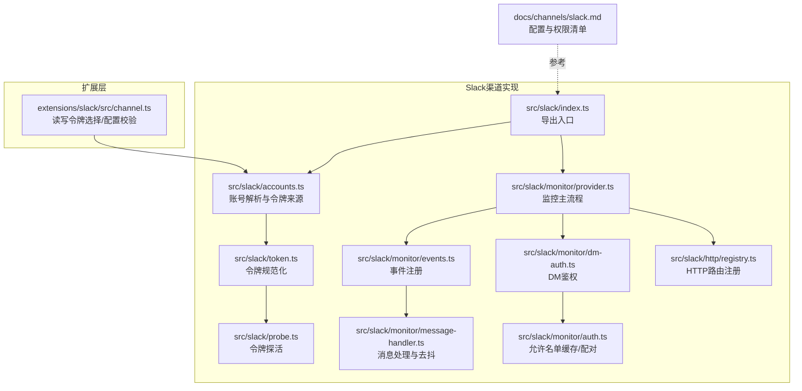
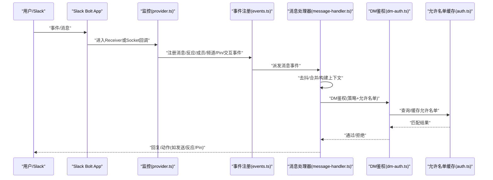
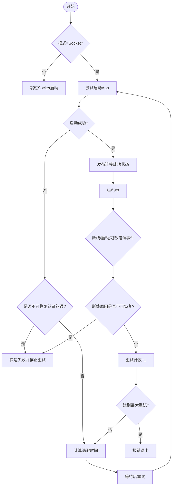
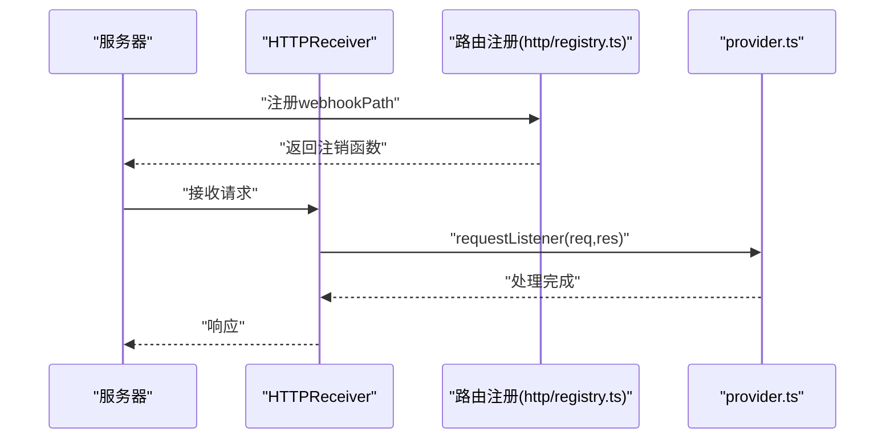
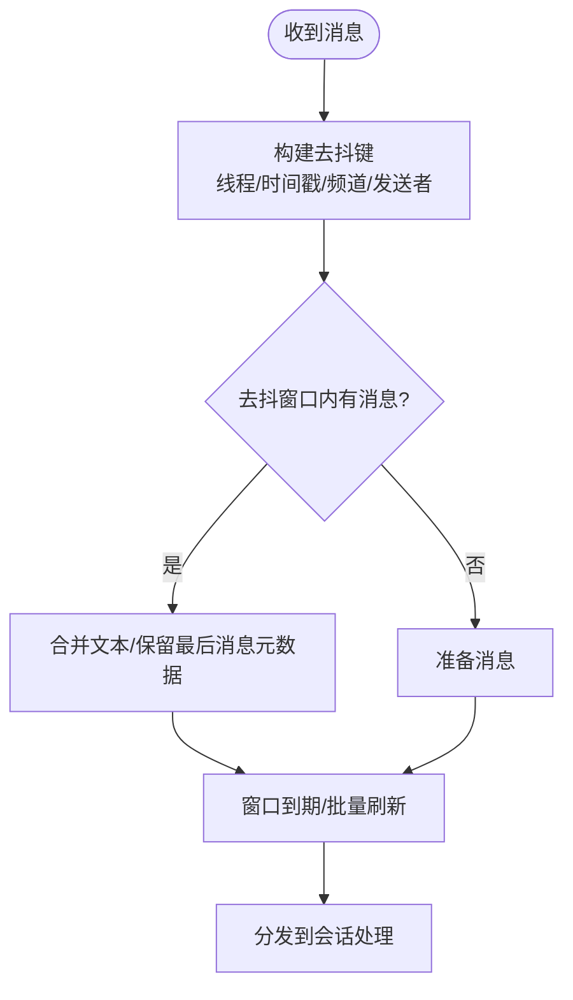
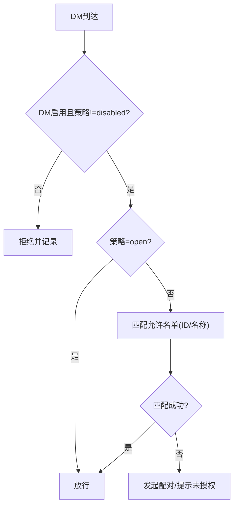
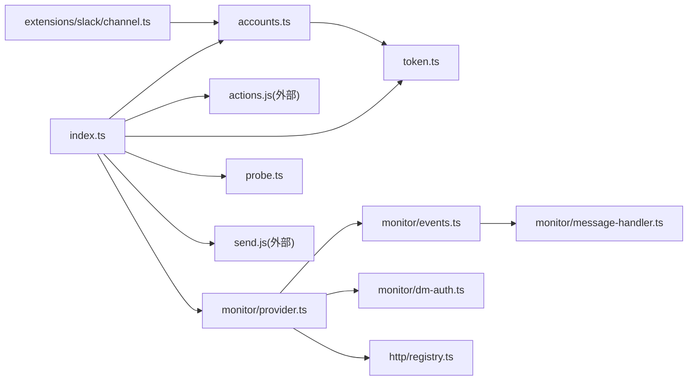

# Slack问题

<cite>
**本文引用的文件**
- [docs/channels/slack.md](file://docs/channels/slack.md)
- [src/slack/index.ts](file://src/slack/index.ts)
- [src/slack/accounts.ts](file://src/slack/accounts.ts)
- [src/slack/token.ts](file://src/slack/token.ts)
- [src/slack/probe.ts](file://src/slack/probe.ts)
- [src/slack/monitor/reconnect-policy.ts](file://src/slack/monitor/reconnect-policy.ts)
- [src/slack/monitor/provider.ts](file://src/slack/monitor/provider.ts)
- [src/slack/monitor/events.ts](file://src/slack/monitor/events.ts)
- [src/slack/monitor/message-handler.ts](file://src/slack/monitor/message-handler.ts)
- [src/slack/monitor/dm-auth.ts](file://src/slack/monitor/dm-auth.ts)
- [src/slack/monitor/auth.ts](file://src/slack/monitor/auth.ts)
- [src/slack/http/registry.ts](file://src/slack/http/registry.ts)
- [extensions/slack/src/channel.ts](file://extensions/slack/src/channel.ts)
</cite>

## 目录
1. [简介](#简介)
2. [项目结构](#项目结构)
3. [核心组件](#核心组件)
4. [架构总览](#架构总览)
5. [详细组件分析](#详细组件分析)
6. [依赖关系分析](#依赖关系分析)
7. [性能考量](#性能考量)
8. [故障排除指南](#故障排除指南)
9. [结论](#结论)
10. [附录](#附录)

## 简介
本指南聚焦于Slack渠道在Socket模式与HTTP模式下的运行与排障，覆盖令牌配置、权限范围、消息路由、DM访问控制、Socket连接重连策略、HTTP Webhook路径冲突检测等关键环节。目标是帮助你在出现“无回复”“DM被忽略”“Socket无法连接”“HTTP不收事件”等典型症状时，快速定位并修复问题。

## 项目结构
围绕Slack渠道的核心代码位于src/slack目录，文档位于docs/channels/slack.md；扩展层在extensions/slack。下图展示与Slack渠道问题排查直接相关的模块关系：

**图表来源**
- [src/slack/index.ts:1-26](file://src/slack/index.ts#L1-L26)
- [src/slack/accounts.ts:1-123](file://src/slack/accounts.ts#L1-L123)
- [src/slack/token.ts:1-30](file://src/slack/token.ts#L1-L30)
- [src/slack/probe.ts:1-46](file://src/slack/probe.ts#L1-L46)
- [src/slack/monitor/provider.ts:1-200](file://src/slack/monitor/provider.ts#L1-L200)
- [src/slack/monitor/events.ts:1-28](file://src/slack/monitor/events.ts#L1-L28)
- [src/slack/monitor/message-handler.ts:1-200](file://src/slack/monitor/message-handler.ts#L1-L200)
- [src/slack/monitor/dm-auth.ts:1-37](file://src/slack/monitor/dm-auth.ts#L1-L37)
- [src/slack/monitor/auth.ts:92-132](file://src/slack/monitor/auth.ts#L92-L132)
- [src/slack/http/registry.ts:1-49](file://src/slack/http/registry.ts#L1-L49)
- [extensions/slack/src/channel.ts:42-73](file://extensions/slack/src/channel.ts#L42-L73)
- [docs/channels/slack.md:1-555](file://docs/channels/slack.md#L1-L555)

**章节来源**
- [src/slack/index.ts:1-26](file://src/slack/index.ts#L1-L26)
- [src/slack/accounts.ts:1-123](file://src/slack/accounts.ts#L1-L123)
- [src/slack/token.ts:1-30](file://src/slack/token.ts#L1-L30)
- [src/slack/probe.ts:1-46](file://src/slack/probe.ts#L1-L46)
- [src/slack/monitor/provider.ts:1-200](file://src/slack/monitor/provider.ts#L1-L200)
- [src/slack/monitor/events.ts:1-28](file://src/slack/monitor/events.ts#L1-L28)
- [src/slack/monitor/message-handler.ts:1-200](file://src/slack/monitor/message-handler.ts#L1-L200)
- [src/slack/monitor/dm-auth.ts:1-37](file://src/slack/monitor/dm-auth.ts#L1-L37)
- [src/slack/monitor/auth.ts:92-132](file://src/slack/monitor/auth.ts#L92-L132)
- [src/slack/http/registry.ts:1-49](file://src/slack/http/registry.ts#L1-L49)
- [extensions/slack/src/channel.ts:42-73](file://extensions/slack/src/channel.ts#L42-L73)
- [docs/channels/slack.md:1-555](file://docs/channels/slack.md#L1-L555)

## 核心组件
- 账号与令牌解析：负责合并基础配置与账户级配置，解析环境变量回退，确定令牌来源（config/env/none），并输出可运行的账户对象。
- 令牌规范化与探活：统一令牌格式，提供auth.test探活能力，辅助快速验证令牌有效性。
- 监控主流程：根据模式（socket/http）初始化App/Receiver，注册事件处理器与Slash命令，管理连接状态与断线重连。
- 事件与消息处理：注册各类事件监听器，构建消息去抖与合并逻辑，决定是否分发到会话处理。
- DM鉴权与允许名单：按策略（pairing/open/disabled）与允许名单匹配发送者，支持配对流程与名称匹配开关。
- HTTP路由注册：标准化webhook路径，避免重复注册，限制请求体大小与超时，确保HTTP模式事件接收稳定。
- 扩展层读写令牌选择：在读/写操作间优先选择合适令牌，支持用户令牌只读模式与写入回退策略。

**章节来源**
- [src/slack/accounts.ts:47-102](file://src/slack/accounts.ts#L47-L102)
- [src/slack/token.ts:10-29](file://src/slack/token.ts#L10-L29)
- [src/slack/probe.ts:12-45](file://src/slack/probe.ts#L12-L45)
- [src/slack/monitor/provider.ts:97-149](file://src/slack/monitor/provider.ts#L97-L149)
- [src/slack/monitor/events.ts:11-27](file://src/slack/monitor/events.ts#L11-L27)
- [src/slack/monitor/message-handler.ts:90-174](file://src/slack/monitor/message-handler.ts#L90-L174)
- [src/slack/monitor/dm-auth.ts:7-37](file://src/slack/monitor/dm-auth.ts#L7-L37)
- [src/slack/http/registry.ts:15-49](file://src/slack/http/registry.ts#L15-L49)
- [extensions/slack/src/channel.ts:44-71](file://extensions/slack/src/channel.ts#L44-L71)

## 架构总览
下图展示Socket模式与HTTP模式的关键交互路径，以及与事件处理、消息去抖、DM鉴权的关系。

**图表来源**
- [src/slack/monitor/provider.ts:188-314](file://src/slack/monitor/provider.ts#L188-L314)
- [src/slack/monitor/events.ts:11-27](file://src/slack/monitor/events.ts#L11-L27)
- [src/slack/monitor/message-handler.ts:90-174](file://src/slack/monitor/message-handler.ts#L90-L174)
- [src/slack/monitor/dm-auth.ts:7-37](file://src/slack/monitor/dm-auth.ts#L7-L37)
- [src/slack/monitor/auth.ts:92-132](file://src/slack/monitor/auth.ts#L92-L132)

## 详细组件分析

### 组件A：Socket模式连接与断线重连
- 连接启动：当模式为socket时，使用botToken与appToken启动App，并发布连接成功状态。
- 断线检测：通过事件发射器监听disconnected/unable_to_socket_mode_start/error，记录断开事件与错误。
- 重连策略：指数退避+抖动，最大尝试次数限制；遇到不可恢复认证错误（如revoked/expired/missing_scope）立即失败，避免阻塞网关。
- 失败保护：非恢复性错误直接抛出，不再重试；超过最大尝试次数后报错退出。

**图表来源**
- [src/slack/monitor/provider.ts:414-479](file://src/slack/monitor/provider.ts#L414-L479)
- [src/slack/monitor/reconnect-policy.ts:1-109](file://src/slack/monitor/reconnect-policy.ts#L1-L109)

**章节来源**
- [src/slack/monitor/provider.ts:414-479](file://src/slack/monitor/provider.ts#L414-L479)
- [src/slack/monitor/reconnect-policy.ts:1-109](file://src/slack/monitor/reconnect-policy.ts#L1-L109)

### 组件B：HTTP模式Webhook接收与路由
- Receiver初始化：HTTP模式下创建HTTPReceiver，绑定签名密钥与webhook路径。
- 请求处理：安装请求体大小与超时保护，调用receiver.requestListener分发事件。
- 路由注册：标准化webhook路径，避免重复注册；若重复则记录日志并忽略后续注册。
- 多账户隔离：每个账户可配置独立webhookPath，防止冲突。

**图表来源**
- [src/slack/monitor/provider.ts:188-231](file://src/slack/monitor/provider.ts#L188-L231)
- [src/slack/http/registry.ts:15-49](file://src/slack/http/registry.ts#L15-L49)

**章节来源**
- [src/slack/monitor/provider.ts:188-231](file://src/slack/monitor/provider.ts#L188-L231)
- [src/slack/http/registry.ts:15-49](file://src/slack/http/registry.ts#L15-L49)

### 组件C：消息去抖与会话键生成
- 去抖策略：基于线程/消息时间戳/频道/发送者构建去抖键，合并同一窗口内的消息文本，减少重复回复。
- 顶层消息键：针对非DM顶层消息，按频道+时间戳聚合，避免并发顶层消息串扰。
- 应用提及优先：app_mention与message事件竞争时，维持去抖与重试键，确保正确分发。

**图表来源**
- [src/slack/monitor/message-handler.ts:63-200](file://src/slack/monitor/message-handler.ts#L63-L200)

**章节来源**
- [src/slack/monitor/message-handler.ts:63-200](file://src/slack/monitor/message-handler.ts#L63-L200)

### 组件D：DM鉴权与允许名单
- 策略判定：disabled/open/pairing三种策略；open需allowFrom包含"*"。
- 允许名单匹配：支持ID与名称（受开关影响），并格式化匹配元信息用于日志与提示。
- 配对流程：未授权发送者触发配对挑战，批准后方可继续。

**图表来源**
- [src/slack/monitor/dm-auth.ts:7-37](file://src/slack/monitor/dm-auth.ts#L7-L37)
- [src/slack/monitor/auth.ts:92-132](file://src/slack/monitor/auth.ts#L92-L132)

**章节来源**
- [src/slack/monitor/dm-auth.ts:7-37](file://src/slack/monitor/dm-auth.ts#L7-L37)
- [src/slack/monitor/auth.ts:92-132](file://src/slack/monitor/auth.ts#L92-L132)

## 依赖关系分析
- 导出入口：index.ts将账号、动作、监控、探测、发送、令牌解析等模块统一导出，便于上层使用。
- 账号解析依赖令牌规范化与环境变量回退，形成稳定的令牌来源链路。
- 监控主流程依赖事件注册、消息处理器、DM鉴权与HTTP路由注册，构成完整的运行闭环。
- 扩展层channel.ts在读写令牌选择与配置校验方面与核心逻辑协同。

**图表来源**
- [src/slack/index.ts:1-26](file://src/slack/index.ts#L1-L26)
- [src/slack/accounts.ts:1-123](file://src/slack/accounts.ts#L1-L123)
- [src/slack/token.ts:1-30](file://src/slack/token.ts#L1-L30)
- [src/slack/probe.ts:1-46](file://src/slack/probe.ts#L1-L46)
- [src/slack/monitor/provider.ts:1-200](file://src/slack/monitor/provider.ts#L1-L200)
- [src/slack/monitor/events.ts:1-28](file://src/slack/monitor/events.ts#L1-L28)
- [src/slack/monitor/message-handler.ts:1-200](file://src/slack/monitor/message-handler.ts#L1-L200)
- [src/slack/monitor/dm-auth.ts:1-37](file://src/slack/monitor/dm-auth.ts#L1-L37)
- [src/slack/http/registry.ts:1-49](file://src/slack/http/registry.ts#L1-L49)
- [extensions/slack/src/channel.ts:42-73](file://extensions/slack/src/channel.ts#L42-L73)

**章节来源**
- [src/slack/index.ts:1-26](file://src/slack/index.ts#L1-L26)
- [extensions/slack/src/channel.ts:42-73](file://extensions/slack/src/channel.ts#L42-L73)

## 性能考量
- 去抖与批处理：通过去抖窗口合并消息，降低重复回复与会话压力，提升吞吐。
- 请求体保护：HTTP模式下限制body大小与超时，避免异常请求导致资源耗尽。
- 退避重连：指数退避+抖动，避免雪崩式重试；达到上限后报错，防止长时间卡死。
- 文本分块与媒体上限：通过textChunkLimit与mediaMaxMb控制输出规模，保障稳定性与合规性。

[本节为通用指导，无需特定文件分析]

## 故障排除指南

### 快速检查清单
- Socket模式未连接
  - 确认Slack应用已启用Socket Mode，App Token具备connections:write，Bot Token有效。
  - 检查网关日志中的断线事件与错误类型，识别是否为不可恢复认证错误。
  - 若出现频繁断线，关注重连策略与网络稳定性。
- HTTP模式不收事件
  - 确认Slack Request URL已设置为相同webhook路径，签名密钥正确。
  - 检查webhookPath是否唯一，避免多账户冲突。
  - 查看HTTP路由注册日志，确认未重复注册。
- 通道无回复
  - 检查groupPolicy与通道allowlist，确认requireMention与用户allowlist设置。
  - 使用诊断命令查看通道状态与日志。
- DM被忽略
  - 检查dm.enabled与dmPolicy，核对允许名单与配对状态。
  - 如策略为pairing，确认已执行配对批准流程。

**章节来源**
- [docs/channels/slack.md:433-490](file://docs/channels/slack.md#L433-L490)
- [src/slack/monitor/reconnect-policy.ts:1-109](file://src/slack/monitor/reconnect-policy.ts#L1-L109)
- [src/slack/http/registry.ts:15-49](file://src/slack/http/registry.ts#L15-L49)
- [src/slack/monitor/provider.ts:130-149](file://src/slack/monitor/provider.ts#L130-L149)

### Socket模式连接问题
- 症状：启动即报错或反复断线
- 排查步骤：
  - 使用令牌探活工具验证botToken与appToken可用性。
  - 检查不可恢复认证错误正则匹配，如invalid_auth/token_revoked等。
  - 观察重连策略参数与最大尝试次数，确认是否因网络波动导致断线。
- 修复建议：
  - 更新失效令牌或重新授权应用。
  - 为Socket Mode配置稳定的网络与防火墙规则。
  - 如遇永久性权限缺失，补充缺失scope并重新安装应用。

**章节来源**
- [src/slack/probe.ts:12-45](file://src/slack/probe.ts#L12-L45)
- [src/slack/monitor/reconnect-policy.ts:1-109](file://src/slack/monitor/reconnect-policy.ts#L1-L109)
- [src/slack/monitor/provider.ts:414-479](file://src/slack/monitor/provider.ts#L414-L479)

### HTTP模式不接收事件
- 症状：Slack侧显示验证失败或事件未送达
- 排查步骤：
  - 确认signingSecret正确，Event Subscriptions与Interactivity的Request URL一致。
  - 检查webhookPath标准化逻辑与路由注册，避免重复注册。
  - 关注请求体大小与超时保护，确认未被提前截断。
- 修复建议：
  - 为每个账户设置唯一webhookPath，避免冲突。
  - 校正Slack应用的Request URL与本地网关暴露地址。
  - 如使用反向代理，确保转发路径与头部正确。

**章节来源**
- [src/slack/monitor/provider.ts:188-231](file://src/slack/monitor/provider.ts#L188-L231)
- [src/slack/http/registry.ts:15-49](file://src/slack/http/registry.ts#L15-L49)

### 通道消息被忽略
- 症状：在频道中无回复
- 排查步骤：
  - 检查groupPolicy与channels.allowlist，确认通道在allowlist中。
  - 核对requireMention与users.allowlist，确认发送者满足触发条件。
  - 使用诊断命令查看通道状态与最近事件。
- 修复建议：
  - 将目标通道加入allowlist，或调整为open策略。
  - 放宽requireMention或添加发送者至users.allowlist。

**章节来源**
- [docs/channels/slack.md:433-452](file://docs/channels/slack.md#L433-L452)

### DM被忽略或无法配对
- 症状：私信无响应或提示未授权
- 排查步骤：
  - 检查dm.enabled与dmPolicy，open策略需allowFrom包含"*"。
  - 核对允许名单与名称匹配开关，确认发送者ID/名称是否匹配。
  - 如为pairing策略，确认已完成配对批准。
- 修复建议：
  - 将发送者ID加入allowFrom，或切换为open策略（谨慎）。
  - 启用名称匹配（仅在必要时开启），并确保名称准确。
  - 引导发送者执行配对流程。

**章节来源**
- [docs/channels/slack.md:454-465](file://docs/channels/slack.md#L454-L465)
- [src/slack/monitor/dm-auth.ts:7-37](file://src/slack/monitor/dm-auth.ts#L7-L37)
- [src/slack/monitor/auth.ts:92-132](file://src/slack/monitor/auth.ts#L92-L132)

### 令牌配置与权限范围
- Socket模式：需要botToken与appToken，appToken需connections:write。
- HTTP模式：需要botToken与signingSecret。
- 用户令牌：可选，支持只读场景；写入需userTokenReadOnly=false且botToken不可用时才回退。
- 权限范围与事件订阅：参考官方manifest与事件清单，确保scope与订阅齐全。

**章节来源**
- [docs/channels/slack.md:123-134](file://docs/channels/slack.md#L123-L134)
- [docs/channels/slack.md:340-431](file://docs/channels/slack.md#L340-L431)
- [extensions/slack/src/channel.ts:44-71](file://extensions/slack/src/channel.ts#L44-L71)

### 消息路由与线程处理
- 去抖与合并：同一窗口内消息会被合并，顶层非DM消息按时间戳聚合，避免串扰。
- 回复标签：replyToMode控制回复行为；当设为off时，显式回复标签也会被禁用。
- 线程历史：thread.historyScope与initialHistoryLimit控制线程上下文获取数量。

**章节来源**
- [src/slack/monitor/message-handler.ts:63-200](file://src/slack/monitor/message-handler.ts#L63-L200)
- [docs/channels/slack.md:243-254](file://docs/channels/slack.md#L243-L254)

## 结论
通过明确Socket与HTTP两种模式的差异、严格校验令牌与权限范围、合理配置DM与通道策略、利用去抖与线程控制优化消息处理，并结合断线重连策略与HTTP路由保护，可显著提升Slack渠道的稳定性与可维护性。遇到问题时，建议按“令牌—模式—策略—路由—事件”的顺序逐项排查，配合诊断命令与日志定位根因。

[本节为总结，无需特定文件分析]

## 附录
- 诊断命令示例（来自文档）：
  - openclaw channels status --probe
  - openclaw logs --follow
  - openclaw doctor
  - openclaw pairing list slack

**章节来源**
- [docs/channels/slack.md:444-450](file://docs/channels/slack.md#L444-L450)