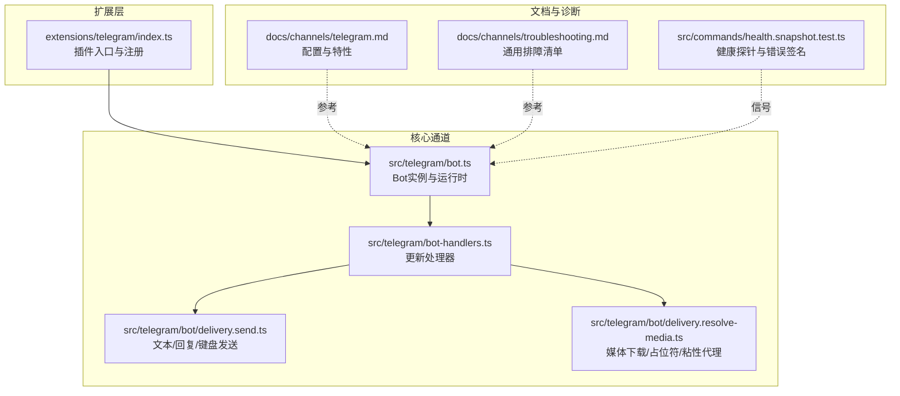
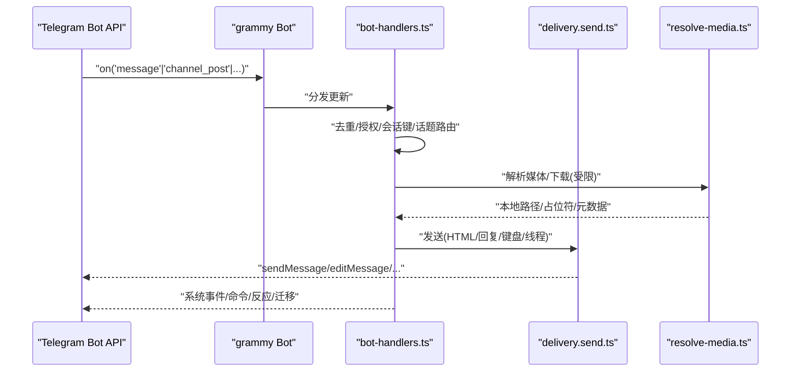
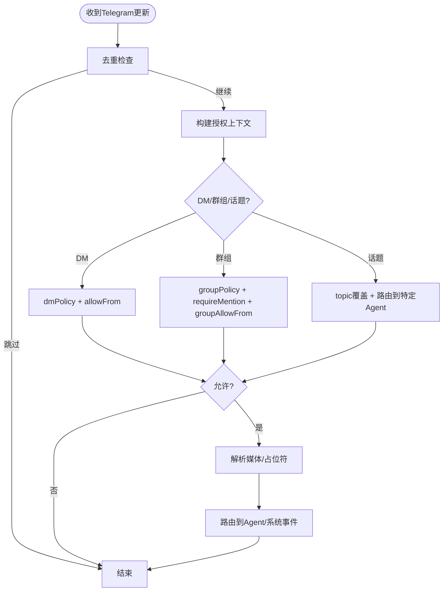
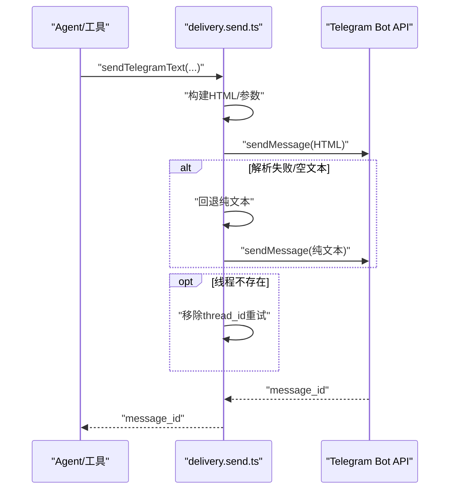
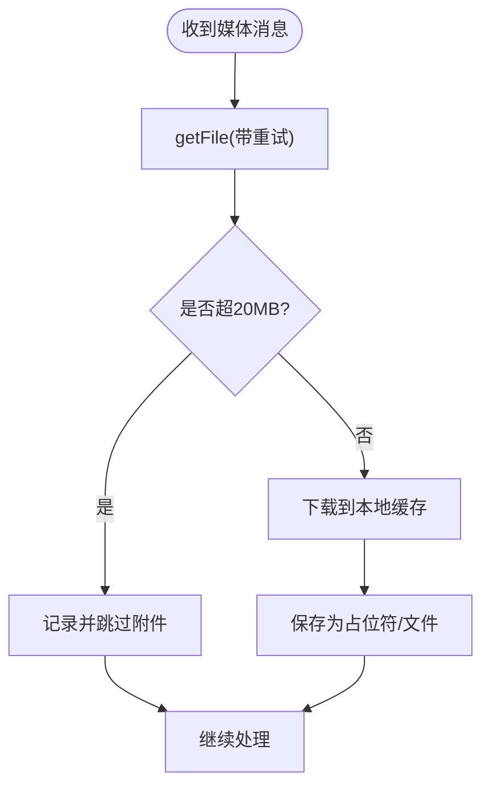
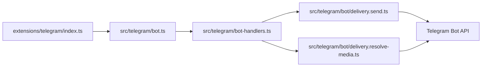

# Telegram问题

<cite>
**本文引用的文件**
- [docs/channels/telegram.md](file://docs/channels/telegram.md)
- [docs/channels/troubleshooting.md](file://docs/channels/troubleshooting.md)
- [src/telegram/bot-handlers.ts](file://src/telegram/bot-handlers.ts)
- [src/telegram/bot/delivery.send.ts](file://src/telegram/bot/delivery.send.ts)
- [src/telegram/bot/delivery.resolve-media.ts](file://src/telegram/bot/delivery.resolve-media.ts)
- [extensions/telegram/index.ts](file://extensions/telegram/index.ts)
- [src/commands/health.snapshot.test.ts](file://src/commands/health.snapshot.test.ts)
- [src/infra/outbound/message.test.ts](file://src/infra/outbound/message.test.ts)
- [src/infra/outbound/targets.channel-resolution.test.ts](file://src/infra/outbound/targets.channel-resolution.test.ts)
- [src/telegram/bot.ts](file://src/telegram/bot.ts)
- [src/telegram/fetch.test.ts](file://src/telegram/fetch.test.ts)
- [src/telegram/send.proxy.test.ts](file://src/telegram/send.proxy.test.ts)
- [src/telegram/send.test.ts](file://src/telegram/send.test.ts)
</cite>

## 目录
1. [简介](#简介)
2. [项目结构](#项目结构)
3. [核心组件](#核心组件)
4. [架构总览](#架构总览)
5. [详细组件分析](#详细组件分析)
6. [依赖关系分析](#依赖关系分析)
7. [性能与容量考虑](#性能与容量考虑)
8. [故障排除指南](#故障排除指南)
9. [结论](#结论)
10. [附录](#附录)

## 简介
本指南聚焦于Telegram渠道在OpenClaw中的问题排查，覆盖Bot API连接、消息转发、文件传输、权限与群组管理、Webhook与长轮询、API限制与网络稳定性等关键环节。针对“/start无响应”“Bot在线但群组静默”“发送失败出现网络错误”“升级后允许列表阻止”等典型症状，提供可执行的诊断流程与修复步骤，并给出配置参考与最佳实践。

## 项目结构
OpenClaw通过扩展模块加载Telegram通道，核心逻辑位于src/telegram目录，文档位于docs/channels/telegram.md与docs/channels/troubleshooting.md。扩展入口负责插件注册与运行时集成，核心处理包括消息授权、线程与话题路由、媒体解析与发送、反应事件与命令菜单等。

图表来源
- [extensions/telegram/index.ts](file://extensions/telegram/index.ts)
- [src/telegram/bot.ts](file://src/telegram/bot.ts)
- [src/telegram/bot-handlers.ts](file://src/telegram/bot-handlers.ts)
- [src/telegram/bot/delivery.send.ts](file://src/telegram/bot/delivery.send.ts)
- [src/telegram/bot/delivery.resolve-media.ts](file://src/telegram/bot/delivery.resolve-media.ts)
- [docs/channels/telegram.md](file://docs/channels/telegram.md)
- [docs/channels/troubleshooting.md](file://docs/channels/troubleshooting.md)
- [src/commands/health.snapshot.test.ts](file://src/commands/health.snapshot.test.ts)

章节来源
- [docs/channels/telegram.md:1-120](file://docs/channels/telegram.md#L1-L120)
- [docs/channels/troubleshooting.md:1-118](file://docs/channels/troubleshooting.md#L1-L118)

## 核心组件
- 插件入口与运行时：扩展模块负责加载Telegram通道，建立与grammy运行时的桥接，初始化账户级配置与令牌解析。
- 消息处理管线：接收Telegram更新（消息、频道文章、反应等），进行去重、授权、会话键构建、媒体解析、转发到Agent或系统事件队列。
- 发送与格式化：统一的发送封装支持HTML格式、链接预览、内联键盘、回复与线程参数；对解析失败自动回退纯文本。
- 媒体处理：下载Telegram文件（受20MB限制）、生成占位符、缓存贴图元数据、SSRF白名单信任api.telegram.org。
- 配置与能力：支持DM/群组策略、提及要求、话题路由、贴图动作、反应通知级别、长轮询/Webhook、代理与网络参数、重试策略等。

章节来源
- [src/telegram/bot-handlers.ts:121-200](file://src/telegram/bot-handlers.ts#L121-L200)
- [src/telegram/bot/delivery.send.ts:91-173](file://src/telegram/bot/delivery.send.ts#L91-L173)
- [src/telegram/bot/delivery.resolve-media.ts:114-200](file://src/telegram/bot/delivery.resolve-media.ts#L114-L200)
- [docs/channels/telegram.md:820-885](file://docs/channels/telegram.md#L820-L885)

## 架构总览
下图展示从Telegram Bot API到OpenClaw内部处理再到外部发送的关键路径与决策点。

图表来源
- [src/telegram/bot-handlers.ts:1558-1599](file://src/telegram/bot-handlers.ts#L1558-L1599)
- [src/telegram/bot/delivery.send.ts:91-173](file://src/telegram/bot/delivery.send.ts#L91-L173)
- [src/telegram/bot/delivery.resolve-media.ts:114-200](file://src/telegram/bot/delivery.resolve-media.ts#L114-L200)

## 详细组件分析

### 组件A：消息处理与授权
- 授权链路：根据是否群组、是否论坛话题、是否DM，分别应用dmPolicy、groupPolicy、requireMention、allowFrom/groupAllowFrom与配对存储。
- 会话隔离：按chatId与topicId构建会话键，论坛话题附加“:topic:<threadId>”，DM支持message_thread_id。
- 去重与防抖：基于更新键上下文与入站防抖策略，避免重复处理与风暴。
- 群组迁移：监听迁移事件，自动迁移配置并写回配置文件。

图表来源
- [src/telegram/bot-handlers.ts:1475-1556](file://src/telegram/bot-handlers.ts#L1475-L1556)
- [src/telegram/bot-handlers.ts:1407-1457](file://src/telegram/bot-handlers.ts#L1407-L1457)

章节来源
- [src/telegram/bot-handlers.ts:1475-1556](file://src/telegram/bot-handlers.ts#L1475-L1556)
- [src/telegram/bot-handlers.ts:1407-1457](file://src/telegram/bot-handlers.ts#L1407-L1457)

### 组件B：发送与格式化
- 文本发送：默认HTML模式，若HTML解析失败或为空则回退纯文本；支持链接预览开关、回复与内联键盘。
- 线程容错：当带thread_id的发送报“线程不存在”时，自动移除thread_id重试，DM场景允许无thread重试。
- 错误分类：区分解析错误、空文本、线程不存在等，采取不同恢复策略。

图表来源
- [src/telegram/bot/delivery.send.ts:91-173](file://src/telegram/bot/delivery.send.ts#L91-L173)

章节来源
- [src/telegram/bot/delivery.send.ts:91-173](file://src/telegram/bot/delivery.send.ts#L91-L173)

### 组件C：媒体解析与下载
- 下载策略：使用带重试的getFile，对“文件过大”永久错误不重试；其他网络错误重试。
- 20MB限制：超过限制直接记录并跳过附件，保留类型占位符以保证消息可达。
- SSRF防护：仅允许api.telegram.org域名下载，避免内部地址风险。
- 贴图缓存：静态贴图描述与元数据缓存，减少重复视觉识别成本。

图表来源
- [src/telegram/bot/delivery.resolve-media.ts:64-93](file://src/telegram/bot/delivery.resolve-media.ts#L64-L93)
- [src/telegram/bot/delivery.resolve-media.ts:114-138](file://src/telegram/bot/delivery.resolve-media.ts#L114-L138)

章节来源
- [src/telegram/bot/delivery.resolve-media.ts:11-42](file://src/telegram/bot/delivery.resolve-media.ts#L11-L42)
- [src/telegram/bot/delivery.resolve-media.ts:114-200](file://src/telegram/bot/delivery.resolve-media.ts#L114-L200)

### 组件D：Webhook与长轮询
- 长轮询：默认模式，grammy运行器按聊天/线程顺序处理，整体并发受agents.defaults.maxConcurrent控制。
- Webhook：需配置webhookUrl、webhookSecret、可选host/port/path；公网端点建议前置反向代理指向webhookUrl。
- 网络与代理：支持channels.telegram.proxy配置；Node 22+默认IPv4优先与DNS结果顺序可调；WSL2默认禁用自动选择IP版本。

章节来源
- [docs/channels/telegram.md:731-747](file://docs/channels/telegram.md#L731-L747)
- [src/telegram/bot.ts:151-152](file://src/telegram/bot.ts#L151-L152)
- [src/telegram/fetch.test.ts:381](file://src/telegram/fetch.test.ts#L381)
- [src/telegram/send.proxy.test.ts:60](file://src/telegram/send.proxy.test.ts#L60)
- [src/telegram/send.test.ts:196](file://src/telegram/send.test.ts#L196)

## 依赖关系分析
- 插件与核心：extensions/telegram/index.ts负责加载通道，核心处理在src/telegram/*中，二者通过运行时接口对接。
- 外部依赖：grammy Bot、Telegram Bot API；网络访问受channels.telegram.proxy与Node网络行为影响。
- 内部依赖：消息处理依赖配置解析、会话存储、系统事件队列；发送依赖格式化、媒体解析与运行时日志。

图表来源
- [extensions/telegram/index.ts](file://extensions/telegram/index.ts)
- [src/telegram/bot.ts](file://src/telegram/bot.ts)
- [src/telegram/bot-handlers.ts](file://src/telegram/bot-handlers.ts)
- [src/telegram/bot/delivery.send.ts](file://src/telegram/bot/delivery.send.ts)
- [src/telegram/bot/delivery.resolve-media.ts](file://src/telegram/bot/delivery.resolve-media.ts)

章节来源
- [extensions/telegram/index.ts](file://extensions/telegram/index.ts)
- [src/telegram/bot.ts](file://src/telegram/bot.ts)
- [src/telegram/bot-handlers.ts](file://src/telegram/bot-handlers.ts)
- [src/telegram/bot/delivery.send.ts](file://src/telegram/bot/delivery.send.ts)
- [src/telegram/bot/delivery.resolve-media.ts](file://src/telegram/bot/delivery.resolve-media.ts)

## 性能与容量考虑
- 文本分片：默认单片段上限约4000字符，支持按换行切分；CLI与工具目标支持论坛话题。
- 历史与并发：群组历史限制与DM历史限制可配置；长轮询并发受agents.defaults.maxConcurrent控制。
- 重试策略：发送辅助工具对可恢复错误进行指数退避重试；媒体下载对网络错误重试，对“文件过大”不重试。
- 网络稳定性：Node 22+默认IPv4优先；在不稳定出口上可通过proxy绕行；必要时强制IPv4或调整DNS结果顺序。

章节来源
- [docs/channels/telegram.md:749-790](file://docs/channels/telegram.md#L749-L790)
- [src/telegram/bot.ts:151-152](file://src/telegram/bot.ts#L151-L152)
- [src/telegram/bot/delivery.resolve-media.ts:64-93](file://src/telegram/bot/delivery.resolve-media.ts#L64-L93)

## 故障排除指南

### 一、Bot不响应/start命令
- 快速检查
  - 使用命令查看配对状态与批准流程：openclaw pairing list telegram
  - 若DM策略为pairing，需先批准配对码；若为allowlist/open，确认sender在allowFrom中。
- 常见原因
  - 未批准配对或配对码过期
  - DM策略与allowFrom不匹配
  - 命令菜单注册失败（通常因api.telegram.org不可达）
- 修复步骤
  - 批准配对或调整dmPolicy/allowFrom
  - 检查DNS/HTTPS到api.telegram.org连通性
  - 重新启动网关以刷新setMyCommands

章节来源
- [docs/channels/troubleshooting.md:49](file://docs/channels/troubleshooting.md#L49)
- [docs/channels/telegram.md:842-848](file://docs/channels/telegram.md#L842-L848)

### 二、Bot在线但群组静默
- 快速检查
  - 检查群组是否在channels.telegram.groups中，或是否使用"*"全局默认
  - 确认requireMention与提及模式配置
  - 使用openclaw channels status --probe验证具体群组ID
- 常见原因
  - 群组未列入允许列表
  - 隐私模式限制全量可见
  - 未提及机器人或提及模式不匹配
- 修复步骤
  - 将群组ID加入groups或使用"*"作为全局默认
  - 在BotFather关闭隐私模式或提升机器人管理员
  - 调整requireMention或添加提及模式

章节来源
- [docs/channels/troubleshooting.md:50](file://docs/channels/troubleshooting.md#L50)
- [docs/channels/telegram.md:823-832](file://docs/channels/telegram.md#L823-L832)

### 三、发送失败出现网络错误
- 快速检查
  - 查看日志中是否有“getUpdates失败”“fetch失败”等网络错误
  - 检查DNS解析与IPv6连通性
- 常见原因
  - api.telegram.org解析异常或IPv6不可达
  - 出口TLS不稳定或代理配置不当
- 修复步骤
  - 通过channels.telegram.proxy配置SOCKS/HTTP代理
  - 强制IPv4优先或禁用自动IP族选择
  - 验证dig api.telegram.org A/AAAA解析结果

章节来源
- [docs/channels/troubleshooting.md:51](file://docs/channels/troubleshooting.md#L51)
- [docs/channels/telegram.md:850-884](file://docs/channels/telegram.md#L850-L884)
- [src/commands/health.snapshot.test.ts:173](file://src/commands/health.snapshot.test.ts#L173)
- [src/commands/health.snapshot.test.ts:222](file://src/commands/health.snapshot.test.ts#L222)

### 四、升级后允许列表阻止
- 快速检查
  - 运行openclaw security audit核对策略
  - 使用openclaw doctor --fix修复@username到数字ID映射与配对存储迁移
- 常见原因
  - 升级前的@username条目未转换为数字ID
  - 允许列表为空导致DM被阻断
- 修复步骤
  - 运行doctor --fix自动修复
  - 明确设置dmPolicy与allowFrom（例如open需要"*"）

章节来源
- [docs/channels/troubleshooting.md:52](file://docs/channels/troubleshooting.md#L52)
- [docs/channels/telegram.md:119-122](file://docs/channels/telegram.md#L119-L122)

### 五、Webhook与长轮询
- Webhook
  - 必须同时配置webhookUrl与webhookSecret；公网URL需前置反向代理
  - 可选host/port/path；如需外网入站，设置webhookHost为0.0.0.0
- 长轮询
  - 默认模式；注意并发与会话隔离；关注网络稳定性

章节来源
- [docs/channels/telegram.md:734-747](file://docs/channels/telegram.md#L734-L747)

### 六、API限制与媒体大小
- 文本限制
  - 单片段默认约4000字符；CLI与工具目标支持论坛话题
- 媒体限制
  - Bot API下载限制20MB；超过将记录并跳过附件，保留占位符
- 修复步骤
  - 对超限媒体改用外部链接或拆分
  - 合理设置mediaMaxMb与textChunkLimit

章节来源
- [docs/channels/telegram.md:749-758](file://docs/channels/telegram.md#L749-L758)
- [src/telegram/bot/delivery.resolve-media.ts:82](file://src/telegram/bot/delivery.resolve-media.ts#L82)

### 七、命令菜单与权限
- 命令注册
  - setMyCommands失败多因DNS/HTTPS到api.telegram.org被阻断
- 权限
  - dmPolicy与groupPolicy均生效；命令授权独立于群组策略
- 修复步骤
  - 修复网络可达性或使用代理
  - 确保sender在allowFrom或groupAllowFrom中

章节来源
- [docs/channels/telegram.md:340](file://docs/channels/telegram.md#L340)
- [docs/channels/telegram.md:842-848](file://docs/channels/telegram.md#L842-L848)

### 八、通道可用性与诊断
- 命令阶梯
  - openclaw status → openclaw gateway status → openclaw logs --follow → openclaw doctor → openclaw channels status --probe
- 健康信号
  - 命令菜单注册失败、getMe失败、网络中断等有明确错误签名

章节来源
- [docs/channels/troubleshooting.md:17-23](file://docs/channels/troubleshooting.md#L17-L23)
- [src/commands/health.snapshot.test.ts:200](file://src/commands/health.snapshot.test.ts#L200)

## 结论
Telegram渠道在OpenClaw中通过grammy运行时与统一的消息处理管线实现高可靠的消息收发与媒体处理。针对常见问题，遵循“命令阶梯+快速检查+修复步骤”的流程，可高效定位并解决问题。建议在生产环境启用代理与合理的网络参数，严格管理允许列表与提及策略，并定期使用doctor与status进行健康巡检。

## 附录

### A. 关键配置参考（节选）
- 启动与认证：enabled、botToken、tokenFile、accounts.*
- 访问控制：dmPolicy、allowFrom、groupPolicy、groupAllowFrom、groups、groups.*.topics.*、bindings[]
- 执行审批：execApprovals、accounts.*.execApprovals
- 命令/菜单：commands.native、commands.nativeSkills、customCommands
- 线程/回复：replyToMode
- 流式预览：streaming
- 格式化/投递：textChunkLimit、chunkMode、linkPreview、responsePrefix
- 媒体/网络：mediaMaxMb、timeoutSeconds、retry、network.autoSelectFamily、proxy
- Webhook：webhookUrl、webhookSecret、webhookPath、webhookHost
- 动作/能力：capabilities.inlineButtons、actions.*

章节来源
- [docs/channels/telegram.md:889-967](file://docs/channels/telegram.md#L889-L967)

### B. 通道可用性与插件解析
- 插件解析恢复：即使插件加载失败，消息发送与公告仍可恢复通道解析，避免“未知通道”错误
- 命令解析恢复：确保Telegram命令菜单与工具调用稳定

章节来源
- [src/infra/outbound/message.test.ts:73](file://src/infra/outbound/message.test.ts#L73)
- [src/infra/outbound/targets.channel-resolution.test.ts:69](file://src/infra/outbound/targets.channel-resolution.test.ts#L69)