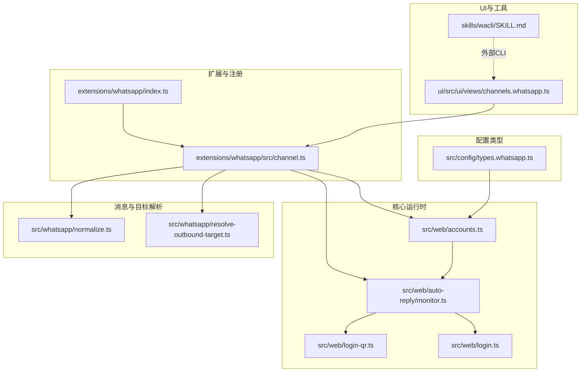
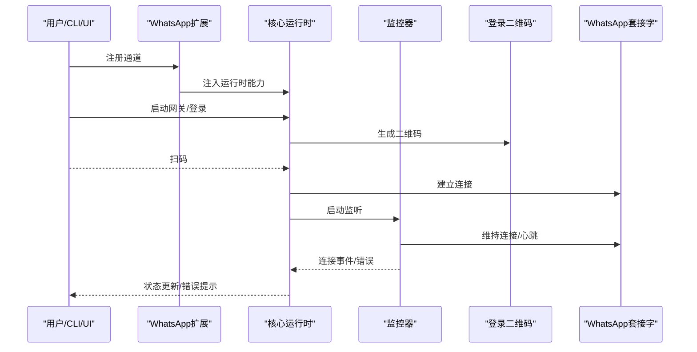
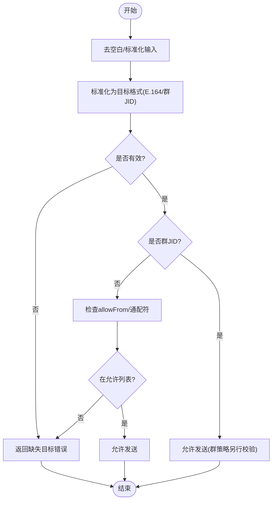
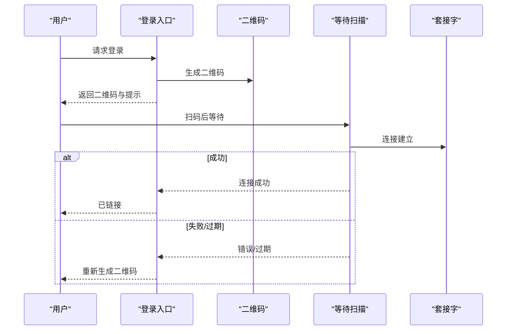
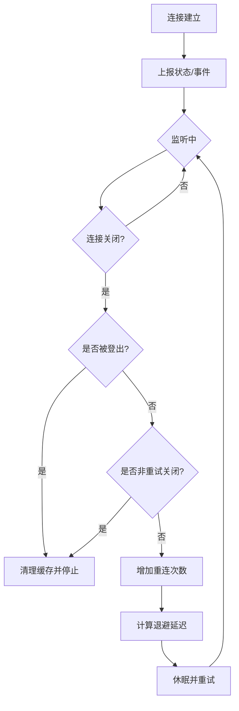
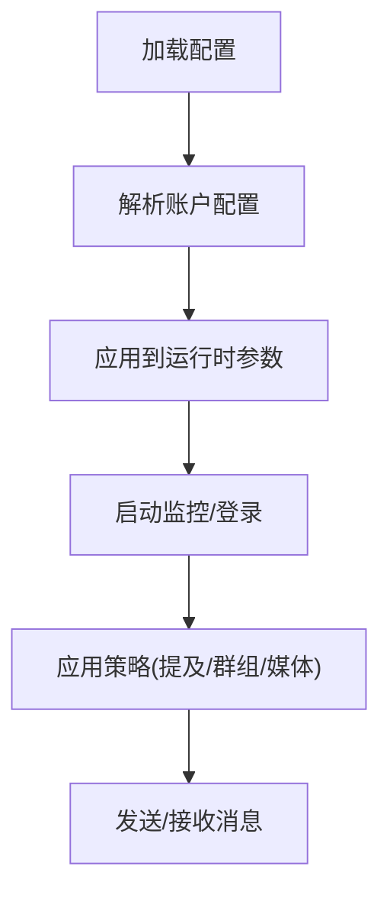
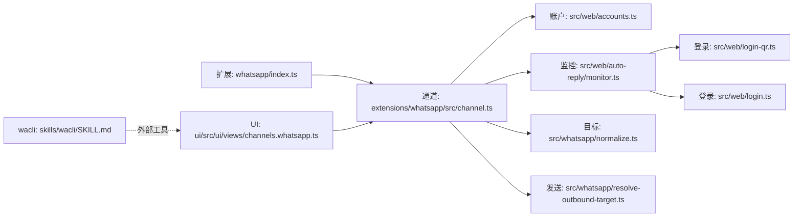

# WhatsApp问题

<cite>
**本文引用的文件**
- [docs/channels/whatsapp.md](file://docs/channels/whatsapp.md)
- [extensions/whatsapp/index.ts](file://extensions/whatsapp/index.ts)
- [src/whatsapp/normalize.ts](file://src/whatsapp/normalize.ts)
- [src/whatsapp/resolve-outbound-target.ts](file://src/whatsapp/resolve-outbound-target.ts)
- [skills/wacli/SKILL.md](file://skills/wacli/SKILL.md)
- [src/web/login-qr.ts](file://src/web/login-qr.ts)
- [apps/macos/Sources/OpenClaw/ChannelsStore+Lifecycle.swift](file://apps/macos/Sources/OpenClaw/ChannelsStore+Lifecycle.swift)
- [ui/src/ui/views/channels.whatsapp.ts](file://ui/src/ui/views/channels.whatsapp.ts)
- [src/channels/plugins/agent-tools/whatsapp-login.ts](file://src/channels/plugins/agent-tools/whatsapp-login.ts)
- [src/web/auto-reply/heartbeat-runner.ts](file://src/web/auto-reply/heartbeat-runner.ts)
- [src/channels/plugins/status-issues/whatsapp.ts](file://src/channels/plugins/status-issues/whatsapp.ts)
- [src/web/auto-reply/monitor.ts](file://src/web/auto-reply/monitor.ts)
- [src/web/login.ts](file://src/web/login.ts)
- [src/web/accounts.ts](file://src/web/accounts.ts)
- [src/config/types.whatsapp.ts](file://src/config/types.whatsapp.ts)
- [src/channels/plugins/onboarding/whatsapp.ts](file://src/channels/plugins/onboarding/whatsapp.ts)
- [src/infra/outbound/deliver.test.ts](file://src/infra/outbound/deliver.test.ts)
- [extensions/whatsapp/src/channel.ts](file://extensions/whatsapp/src/channel.ts)
- [src/channels/plugins/whatsapp-shared.ts](file://src/channels/plugins/whatsapp-shared.ts)
</cite>

## 目录
1. [简介](#简介)
2. [项目结构](#项目结构)
3. [核心组件](#核心组件)
4. [架构总览](#架构总览)
5. [详细组件分析](#详细组件分析)
6. [依赖关系分析](#依赖关系分析)
7. [性能考虑](#性能考虑)
8. [故障排除指南](#故障排除指南)
9. [结论](#结论)
10. [附录](#附录)

## 简介
本指南聚焦于WhatsApp渠道在OpenClaw中的问题诊断与修复，覆盖连接失败、消息发送错误、认证与配对异常、设备同步与重连循环、消息格式与媒体限制、提及与群组激活策略、以及API/速率限制与网络问题的应对。文档基于仓库内实际实现与配置参考，提供可操作的排障步骤与修复建议。

## 项目结构
WhatsApp渠道由“扩展插件 + 核心运行时 + 配置解析 + 登录/心跳/监控 + 规则与校验”等模块组成，关键文件如下图所示：

**图表来源**
- [extensions/whatsapp/index.ts:1-18](file://extensions/whatsapp/index.ts#L1-L18)
- [extensions/whatsapp/src/channel.ts:183-229](file://extensions/whatsapp/src/channel.ts#L183-L229)
- [src/web/accounts.ts:116-166](file://src/web/accounts.ts#L116-L166)
- [src/web/auto-reply/monitor.ts:71-94](file://src/web/auto-reply/monitor.ts#L71-L94)
- [src/web/login-qr.ts:60-106](file://src/web/login-qr.ts#L60-L106)
- [src/web/login.ts:48-78](file://src/web/login.ts#L48-L78)
- [src/whatsapp/normalize.ts:1-81](file://src/whatsapp/normalize.ts#L1-L81)
- [src/whatsapp/resolve-outbound-target.ts:1-53](file://src/whatsapp/resolve-outbound-target.ts#L1-L53)
- [src/config/types.whatsapp.ts:83-116](file://src/config/types.whatsapp.ts#L83-L116)
- [ui/src/ui/views/channels.whatsapp.ts:20-63](file://ui/src/ui/views/channels.whatsapp.ts#L20-L63)
- [skills/wacli/SKILL.md:1-73](file://skills/wacli/SKILL.md#L1-L73)

**章节来源**
- [extensions/whatsapp/index.ts:1-18](file://extensions/whatsapp/index.ts#L1-L18)
- [extensions/whatsapp/src/channel.ts:183-229](file://extensions/whatsapp/src/channel.ts#L183-L229)
- [src/web/accounts.ts:116-166](file://src/web/accounts.ts#L116-L166)
- [src/web/auto-reply/monitor.ts:71-94](file://src/web/auto-reply/monitor.ts#L71-L94)
- [src/web/login-qr.ts:60-106](file://src/web/login-qr.ts#L60-L106)
- [src/web/login.ts:48-78](file://src/web/login.ts#L48-L78)
- [src/whatsapp/normalize.ts:1-81](file://src/whatsapp/normalize.ts#L1-L81)
- [src/whatsapp/resolve-outbound-target.ts:1-53](file://src/whatsapp/resolve-outbound-target.ts#L1-L53)
- [src/config/types.whatsapp.ts:83-116](file://src/config/types.whatsapp.ts#L83-L116)
- [ui/src/ui/views/channels.whatsapp.ts:20-63](file://ui/src/ui/views/channels.whatsapp.ts#L20-L63)
- [skills/wacli/SKILL.md:1-73](file://skills/wacli/SKILL.md#L1-L73)

## 核心组件
- 渠道扩展与注册：负责注册WhatsApp通道、注入运行时能力，并将通道能力暴露给上层。
- 账户与配置解析：解析多账号配置、默认账号、媒体上限、提及与群组策略等。
- 登录与心跳：提供Web登录二维码生成、等待扫描、登录成功回调；心跳用于保持连接与健康提示。
- 消息与目标解析：标准化目标（E.164/群JID），校验直聊/群聊发送权限。
- 监控与重连：维护监听器生命周期、未处理拒绝、非重试关闭状态、指数退避重连。
- UI与工具：展示渠道状态、错误信息；wacli用于第三方消息与历史查询。

**章节来源**
- [extensions/whatsapp/index.ts:1-18](file://extensions/whatsapp/index.ts#L1-L18)
- [extensions/whatsapp/src/channel.ts:338-380](file://extensions/whatsapp/src/channel.ts#L338-L380)
- [src/web/accounts.ts:116-166](file://src/web/accounts.ts#L116-L166)
- [src/web/auto-reply/heartbeat-runner.ts:29-76](file://src/web/auto-reply/heartbeat-runner.ts#L29-L76)
- [src/web/login-qr.ts:208-259](file://src/web/login-qr.ts#L208-L259)
- [src/whatsapp/normalize.ts:55-80](file://src/whatsapp/normalize.ts#L55-L80)
- [src/whatsapp/resolve-outbound-target.ts:8-52](file://src/whatsapp/resolve-outbound-target.ts#L8-L52)
- [src/web/auto-reply/monitor.ts:214-469](file://src/web/auto-reply/monitor.ts#L214-L469)

## 架构总览
WhatsApp渠道采用“扩展插件 + 核心运行时”的分层设计。扩展负责声明式能力与注册，核心运行时负责会话管理、登录、心跳、监控与重连。消息发送路径通过目标解析与规则校验，最终由运行时驱动底层协议栈完成。

**图表来源**
- [extensions/whatsapp/index.ts:6-15](file://extensions/whatsapp/index.ts#L6-L15)
- [extensions/whatsapp/src/channel.ts:338-380](file://extensions/whatsapp/src/channel.ts#L338-L380)
- [src/web/login-qr.ts:208-259](file://src/web/login-qr.ts#L208-L259)
- [src/web/auto-reply/monitor.ts:214-469](file://src/web/auto-reply/monitor.ts#L214-L469)

## 详细组件分析

### 组件A：目标解析与发送授权
- 功能要点
  - 标准化目标：支持E.164与群JID，去除前缀，归一化为统一格式。
  - 发送授权：直聊模式下强制allowFrom白名单或通配符；群聊走群策略。
- 关键流程

**图表来源**
- [src/whatsapp/normalize.ts:55-80](file://src/whatsapp/normalize.ts#L55-L80)
- [src/whatsapp/resolve-outbound-target.ts:8-52](file://src/whatsapp/resolve-outbound-target.ts#L8-L52)

**章节来源**
- [src/whatsapp/normalize.ts:1-81](file://src/whatsapp/normalize.ts#L1-L81)
- [src/whatsapp/resolve-outbound-target.ts:1-53](file://src/whatsapp/resolve-outbound-target.ts#L1-L53)

### 组件B：登录与配对（QR）
- 功能要点
  - 生成二维码数据与提示语。
  - 等待扫描并轮询连接状态，超时/过期处理。
  - 登录成功后清理活动登录记录。
- 关键流程

**图表来源**
- [src/web/login-qr.ts:208-259](file://src/web/login-qr.ts#L208-L259)
- [src/web/login-qr.ts:261-295](file://src/web/login-qr.ts#L261-L295)
- [apps/macos/Sources/OpenClaw/ChannelsStore+Lifecycle.swift:47-97](file://apps/macos/Sources/OpenClaw/ChannelsStore+Lifecycle.swift#L47-L97)

**章节来源**
- [src/web/login-qr.ts:60-106](file://src/web/login-qr.ts#L60-L106)
- [src/web/login-qr.ts:208-259](file://src/web/login-qr.ts#L208-L259)
- [apps/macos/Sources/OpenClaw/ChannelsStore+Lifecycle.swift:47-97](file://apps/macos/Sources/OpenClaw/ChannelsStore+Lifecycle.swift#L47-L97)
- [src/channels/plugins/agent-tools/whatsapp-login.ts:36-72](file://src/channels/plugins/agent-tools/whatsapp-login.ts#L36-L72)

### 组件C：监控与重连循环
- 功能要点
  - 连接建立后上报状态、触发系统事件。
  - 未处理拒绝捕获并强制重启；非重试关闭状态停止监控。
  - 指数退避重连，达到最大次数后降级继续运行或停止。
- 关键流程

**图表来源**
- [src/web/auto-reply/monitor.ts:214-469](file://src/web/auto-reply/monitor.ts#L214-L469)
- [src/web/login.ts:48-78](file://src/web/login.ts#L48-L78)

**章节来源**
- [src/web/auto-reply/monitor.ts:214-469](file://src/web/auto-reply/monitor.ts#L214-L469)
- [src/web/login.ts:48-78](file://src/web/login.ts#L48-L78)

### 组件D：配置与策略
- 功能要点
  - 多账号配置、默认账号、媒体上限、提及/群组策略、消息前缀等。
  - 心跳与重连策略、动作工具门控、配置写入开关。
- 关键流程

**图表来源**
- [src/web/accounts.ts:116-166](file://src/web/accounts.ts#L116-L166)
- [src/config/types.whatsapp.ts:83-116](file://src/config/types.whatsapp.ts#L83-L116)
- [extensions/whatsapp/src/channel.ts:344-364](file://extensions/whatsapp/src/channel.ts#L344-L364)

**章节来源**
- [src/web/accounts.ts:116-166](file://src/web/accounts.ts#L116-L166)
- [src/config/types.whatsapp.ts:83-116](file://src/config/types.whatsapp.ts#L83-L116)
- [extensions/whatsapp/src/channel.ts:344-364](file://extensions/whatsapp/src/channel.ts#L344-L364)

## 依赖关系分析
- 扩展插件依赖核心运行时能力，向通道暴露登录、心跳、状态收集、消息路由等接口。
- 目标解析与规则校验贯穿发送路径，确保符合白名单与群策略。
- 监控器依赖登录与套接字，负责连接生命周期与错误恢复。
- UI与CLI通过通道状态接口展示渠道健康度与错误信息。

**图表来源**
- [extensions/whatsapp/index.ts:1-18](file://extensions/whatsapp/index.ts#L1-L18)
- [extensions/whatsapp/src/channel.ts:183-229](file://extensions/whatsapp/src/channel.ts#L183-L229)
- [src/web/accounts.ts:116-166](file://src/web/accounts.ts#L116-L166)
- [src/web/auto-reply/monitor.ts:71-94](file://src/web/auto-reply/monitor.ts#L71-L94)
- [src/web/login-qr.ts:60-106](file://src/web/login-qr.ts#L60-L106)
- [src/web/login.ts:48-78](file://src/web/login.ts#L48-L78)
- [src/whatsapp/normalize.ts:1-81](file://src/whatsapp/normalize.ts#L1-L81)
- [src/whatsapp/resolve-outbound-target.ts:1-53](file://src/whatsapp/resolve-outbound-target.ts#L1-L53)
- [ui/src/ui/views/channels.whatsapp.ts:20-63](file://ui/src/ui/views/channels.whatsapp.ts#L20-L63)
- [skills/wacli/SKILL.md:1-73](file://skills/wacli/SKILL.md#L1-L73)

**章节来源**
- [extensions/whatsapp/index.ts:1-18](file://extensions/whatsapp/index.ts#L1-L18)
- [extensions/whatsapp/src/channel.ts:183-229](file://extensions/whatsapp/src/channel.ts#L183-L229)
- [src/web/accounts.ts:116-166](file://src/web/accounts.ts#L116-L166)
- [src/web/auto-reply/monitor.ts:71-94](file://src/web/auto-reply/monitor.ts#L71-L94)
- [src/web/login-qr.ts:60-106](file://src/web/login-qr.ts#L60-L106)
- [src/web/login.ts:48-78](file://src/web/login.ts#L48-L78)
- [src/whatsapp/normalize.ts:1-81](file://src/whatsapp/normalize.ts#L1-L81)
- [src/whatsapp/resolve-outbound-target.ts:1-53](file://src/whatsapp/resolve-outbound-target.ts#L1-L53)
- [ui/src/ui/views/channels.whatsapp.ts:20-63](file://ui/src/ui/views/channels.whatsapp.ts#L20-L63)
- [skills/wacli/SKILL.md:1-73](file://skills/wacli/SKILL.md#L1-L73)

## 性能考虑
- 文本分片与换行优先：根据配置选择长度或换行边界分片，减少单次发送失败。
- 媒体优化与回退：自动压缩图片以满足上限，发送失败时首项回退为文本警告，避免静默丢弃。
- 心跳与重连：合理设置心跳周期与重连策略，避免频繁抖动；健康周期清零退避，降低压力。
- 自聊天保护：自聊回合跳过已读回执，减少无效流量。

[本节为通用指导，不直接分析具体文件]

## 故障排除指南

### 1) 连接失败与登录问题
- 症状
  - 未链接：通道状态显示未链接。
  - 已链接但断开：反复断线/重连。
  - 登录超时/过期：二维码过期或长时间未扫描。
- 排查步骤
  - 确认已执行登录命令并扫描二维码。
  - 查看登录等待结果与错误信息，必要时重新生成二维码。
  - 若出现特定错误码（如515），系统会自动重启一次；若仍失败，需重新登录。
  - 若被登出，系统会清理缓存并提示重新登录。
- 修复建议
  - 重新执行登录命令，确保在网关主机上扫描。
  - 检查网络与代理，避免影响WebSocket连接。
  - 如持续失败，清理凭据后重新登录。

**章节来源**
- [docs/channels/whatsapp.md:374-424](file://docs/channels/whatsapp.md#L374-L424)
- [src/web/login-qr.ts:208-259](file://src/web/login-qr.ts#L208-L259)
- [src/web/login-qr.ts:261-295](file://src/web/login-qr.ts#L261-L295)
- [src/web/login.ts:48-78](file://src/web/login.ts#L48-L78)

### 2) 消息发送错误
- 症状
  - 发送失败或无响应。
  - 群消息被忽略。
- 排查步骤
  - 确保网关正在运行且对应账号已登录。
  - 检查目标是否为有效E.164或群JID，且通过标准化。
  - 直聊模式下核对allowFrom白名单或通配符。
  - 群聊检查群策略、发送者允许列表、提及门控与重复键问题。
- 修复建议
  - 在配置中添加允许的发送方或使用通配符。
  - 对群聊启用允许列表或调整提及模式。
  - 清理配置中的重复键，避免覆盖。

**章节来源**
- [docs/channels/whatsapp.md:403-424](file://docs/channels/whatsapp.md#L403-L424)
- [src/whatsapp/normalize.ts:55-80](file://src/whatsapp/normalize.ts#L55-L80)
- [src/whatsapp/resolve-outbound-target.ts:8-52](file://src/whatsapp/resolve-outbound-target.ts#L8-L52)

### 3) 账户认证与配对
- 症状
  - 未链接或链接后断开。
  - 需要批准配对请求（当策略为配对时）。
- 排查步骤
  - 使用状态命令检查链接与运行状态。
  - 若为配对模式，使用配对列表与批准命令处理请求。
  - 检查凭据目录与迁移兼容性。
- 修复建议
  - 重新登录并扫描二维码。
  - 审批挂起的配对请求，避免过多挂起导致阻塞。

**章节来源**
- [docs/channels/whatsapp.md:374-424](file://docs/channels/whatsapp.md#L374-L424)
- [src/channels/plugins/status-issues/whatsapp.ts:30-67](file://src/channels/plugins/status-issues/whatsapp.ts#L30-L67)
- [src/web/accounts.ts:116-166](file://src/web/accounts.ts#L116-L166)

### 4) 设备同步与重连循环
- 症状
  - 连接不稳定，频繁断线。
  - 出现非重试关闭状态或被登出。
- 排查步骤
  - 查看监控日志与错误码，识别是否为非重试关闭。
  - 检查未处理拒绝与加密相关错误，系统会强制重启。
  - 达到最大重连次数后进入降级模式。
- 修复建议
  - 解决冲突的Web会话，重新登录。
  - 调整重连策略与心跳周期，避免过度重试。
  - 清理凭据后重新登录。

**章节来源**
- [src/web/auto-reply/monitor.ts:214-469](file://src/web/auto-reply/monitor.ts#L214-L469)
- [src/web/login.ts:48-78](file://src/web/login.ts#L48-L78)

### 5) 消息格式与媒体限制
- 症状
  - 文本被截断或发送失败。
  - 媒体无法发送或质量不佳。
- 排查步骤
  - 检查文本分片长度与模式（长度/换行）。
  - 检查媒体大小上限与自动优化策略。
  - 确认媒体类型与来源（HTTP/本地路径）。
- 修复建议
  - 调整分片参数与模式，确保内容完整。
  - 提升媒体上限或优化图片尺寸与质量。
  - 使用受支持的媒体类型与正确URL。

**章节来源**
- [docs/channels/whatsapp.md:292-316](file://docs/channels/whatsapp.md#L292-L316)
- [src/web/accounts.ts:152-160](file://src/web/accounts.ts#L152-L160)

### 6) 账户状态检查与UI反馈
- 症状
  - UI显示错误或状态异常。
- 排查步骤
  - 查看UI状态面板中的链接、运行、连接、最后连接时间、最后消息时间与认证年龄。
  - 若存在错误，查看错误弹窗内容。
- 修复建议
  - 根据状态面板提示执行登录或重启网关。
  - 检查日志定位具体错误原因。

**章节来源**
- [ui/src/ui/views/channels.whatsapp.ts:20-63](file://ui/src/ui/views/channels.whatsapp.ts#L20-L63)

### 7) DM策略与提及模式
- 症状
  - 私信被阻止或群聊未触发。
- 排查步骤
  - 检查DM策略与allowFrom配置。
  - 群聊检查groupPolicy、groupAllowFrom与提及模式。
  - 确认会话级激活命令（提及/总是）设置。
- 修复建议
  - 将允许的发送方加入allowFrom。
  - 调整群策略与提及模式，确保满足触发条件。

**章节来源**
- [docs/channels/whatsapp.md:134-200](file://docs/channels/whatsapp.md#L134-L200)
- [src/channels/plugins/whatsapp-shared.ts:10-17](file://src/channels/plugins/whatsapp-shared.ts#L10-L17)

### 8) 心跳与投递确认
- 症状
  - 心跳未送达或确认延迟。
- 排查步骤
  - 检查心跳可见性与发送逻辑。
  - 确认发送成功后的内部钩子事件。
- 修复建议
  - 调整心跳可见性与发送策略。
  - 确保发送成功后触发确认事件。

**章节来源**
- [src/web/auto-reply/heartbeat-runner.ts:29-76](file://src/web/auto-reply/heartbeat-runner.ts#L29-L76)
- [src/infra/outbound/deliver.test.ts:736-766](file://src/infra/outbound/deliver.test.ts#L736-L766)

### 9) wacli工具与第三方交互
- 症状
  - 使用wacli进行消息发送或历史查询失败。
- 排查步骤
  - 确认wacli安装与认证。
  - 使用聊天列表与消息搜索验证环境。
- 修复建议
  - 重新认证并同步，确保在线状态。
  - 使用正确的JID格式与查询参数。

**章节来源**
- [skills/wacli/SKILL.md:1-73](file://skills/wacli/SKILL.md#L1-L73)

## 结论
WhatsApp渠道在OpenClaw中通过扩展插件与核心运行时协同工作，具备完善的登录、监控、重连与策略控制能力。针对常见问题，建议从“登录与配对、发送授权、策略配置、媒体与分片、心跳与确认、UI状态”六个维度进行系统排查，并结合日志与状态面板快速定位根因。

[本节为总结性内容，不直接分析具体文件]

## 附录
- 相关配置字段速查（摘自文档）
  - DM策略与允许列表：dmPolicy、allowFrom
  - 群组策略与发送者允许列表：groupPolicy、groupAllowFrom、groups
  - 历史上下文：historyLimit、dmHistoryLimit、dms["<phone>"].historyLimit
  - 媒体与分片：mediaMaxMb、textChunkLimit、chunkMode
  - 动作工具与配置写入：actions.reactions、configWrites
  - 心跳与重连：web.heartbeatSeconds、web.reconnect.*

**章节来源**
- [docs/channels/whatsapp.md:426-446](file://docs/channels/whatsapp.md#L426-L446)
- [docs/zh-CN/channels/whatsapp.md:358-388](file://docs/zh-CN/channels/whatsapp.md#L358-L388)