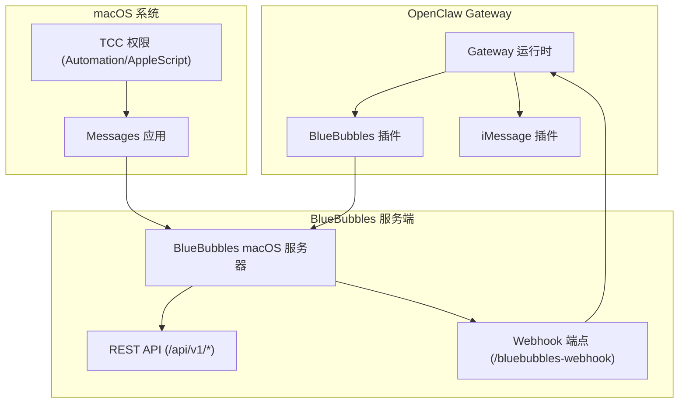
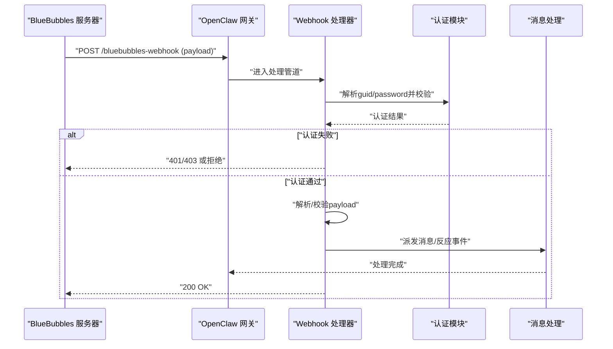
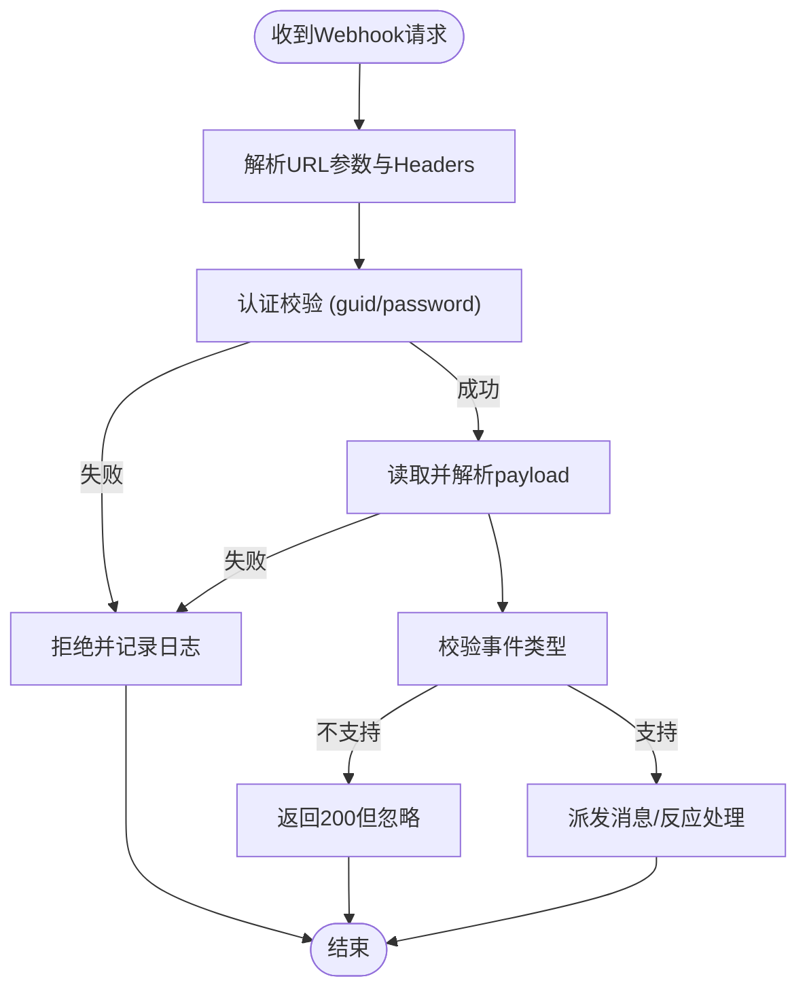
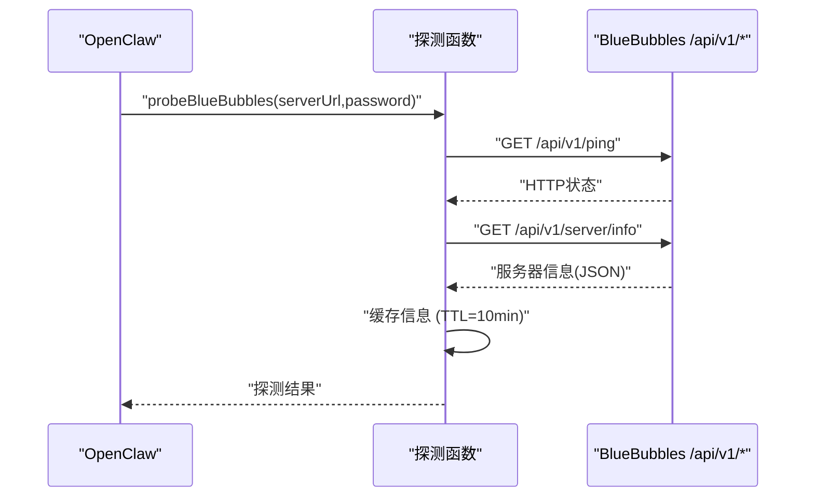
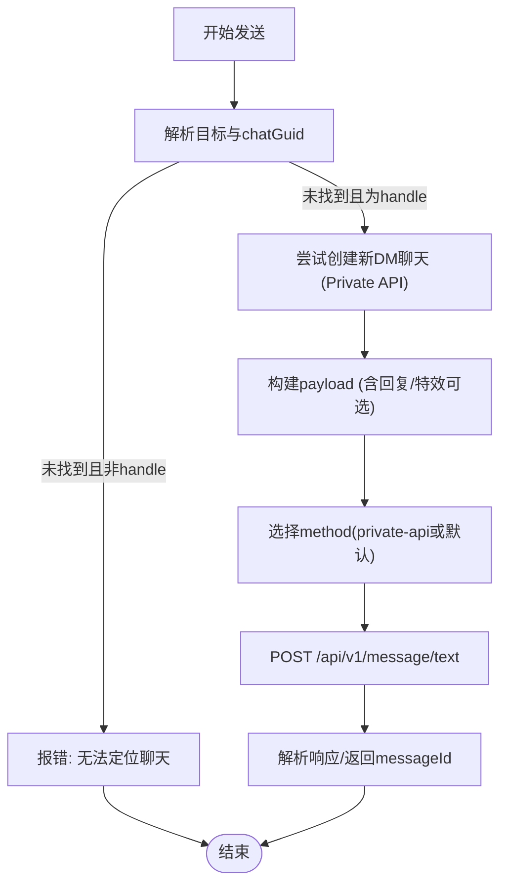
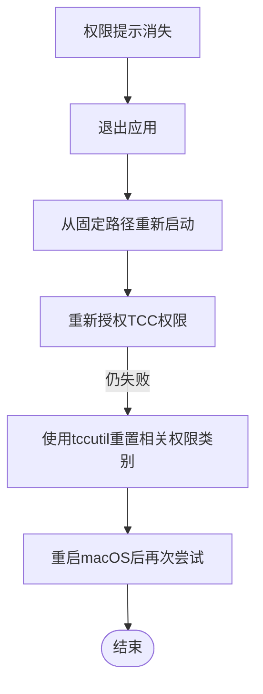
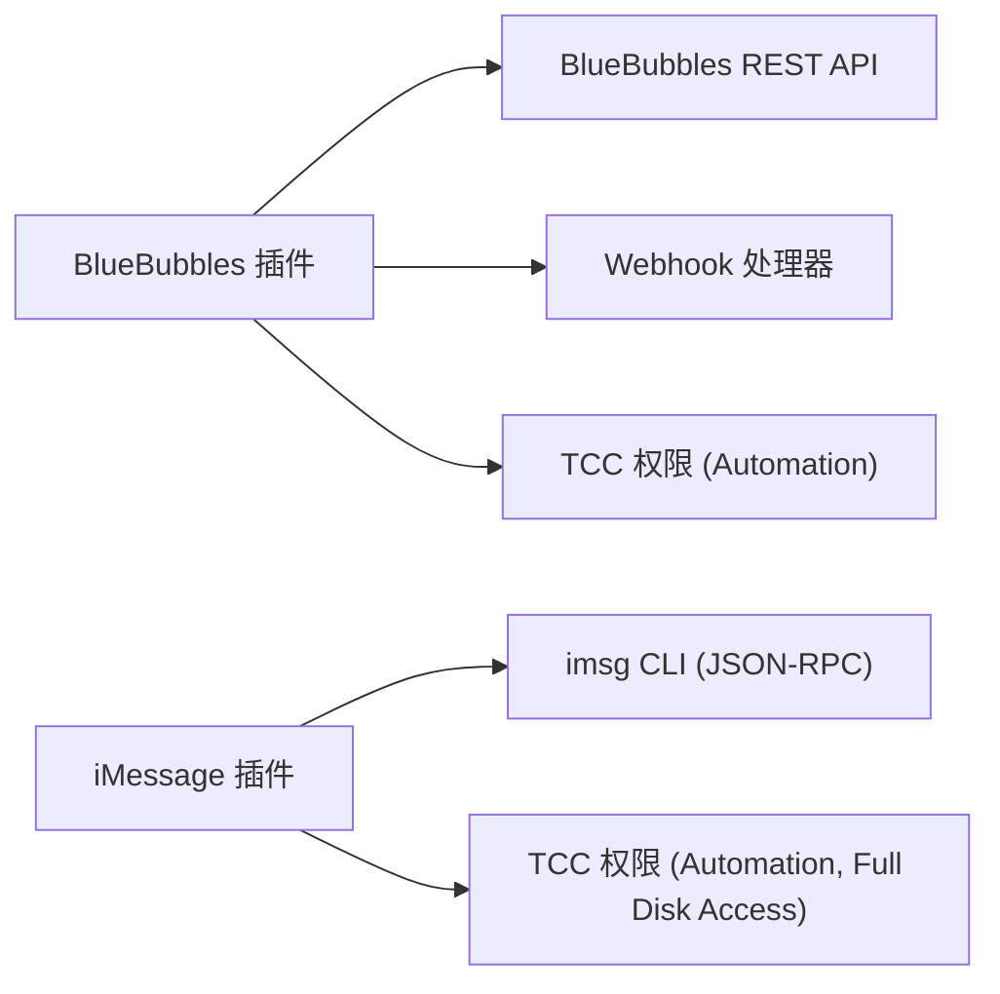

# iMessage和BlueBubbles问题

<cite>
**本文档引用的文件**
- [docs/channels/bluebubbles.md](file://docs/channels/bluebubbles.md)
- [docs/channels/imessage.md](file://docs/channels/imessage.md)
- [docs/channels/troubleshooting.md](file://docs/channels/troubleshooting.md)
- [extensions/bluebubbles/src/monitor.ts](file://extensions/bluebubbles/src/monitor.ts)
- [extensions/bluebubbles/src/probe.ts](file://extensions/bluebubbles/src/probe.ts)
- [extensions/bluebubbles/src/send.ts](file://extensions/bluebubbles/src/send.ts)
- [extensions/bluebubbles/src/monitor.webhook-auth.test.ts](file://extensions/bluebubbles/src/monitor.webhook-auth.test.ts)
- [extensions/bluebubbles/src/monitor-processing.ts](file://extensions/bluebubbles/src/monitor-processing.ts)
- [extensions/bluebubbles/src/onboarding.ts](file://extensions/bluebubbles/src/onboarding.ts)
- [extensions/imessage/index.ts](file://extensions/imessage/index.ts)
- [extensions/bluebubbles/index.ts](file://extensions/bluebubbles/index.ts)
- [apps/macos/Sources/OpenClaw/PermissionManager.swift](file://apps/macos/Sources/OpenClaw/PermissionManager.swift)
- [docs/platforms/mac/permissions.md](file://docs/platforms/mac/permissions.md)
- [docs/platforms/macos.md](file://docs/platforms/macos.md)
- [docs/cli/pairing.md](file://docs/cli/pairing.md)
</cite>

## 目录
1. [简介](#简介)
2. [项目结构](#项目结构)
3. [核心组件](#核心组件)
4. [架构总览](#架构总览)
5. [详细组件分析](#详细组件分析)
6. [依赖关系分析](#依赖关系分析)
7. [性能考量](#性能考量)
8. [故障排除指南](#故障排除指南)
9. [结论](#结论)

## 简介
本指南聚焦于iMessage与BlueBubbles渠道在OpenClaw中的常见问题与排障方法，覆盖Webhook/服务器可达性、macOS隐私权限（TCC）、消息自动化权限、BlueBubbles服务器状态检查、消息接收模式配置、配对与访问控制等关键环节。针对“无入站事件”“可发送但macOS无接收”“DM发送方被阻止”等典型症状，提供可执行的诊断流程与修复步骤。

## 项目结构
OpenClaw通过插件化架构支持多渠道，其中BlueBubbles与iMessage分别由独立扩展实现：
- BlueBubbles扩展负责REST API调用、Webhook接收与处理、配对与访问控制、媒体与动作支持。
- iMessage扩展提供传统JSON-RPC通道（imsg），适用于遗留场景。
- macOS侧提供权限管理与系统设置集成，确保自动化与屏幕录制等能力可用。

图表来源
- [extensions/bluebubbles/index.ts:1-18](file://extensions/bluebubbles/index.ts#L1-L18)
- [extensions/imessage/index.ts:1-18](file://extensions/imessage/index.ts#L1-L18)
- [docs/channels/bluebubbles.md:10-23](file://docs/channels/bluebubbles.md#L10-L23)

章节来源
- [extensions/bluebubbles/index.ts:1-18](file://extensions/bluebubbles/index.ts#L1-L18)
- [extensions/imessage/index.ts:1-18](file://extensions/imessage/index.ts#L1-L18)
- [docs/channels/bluebubbles.md:10-23](file://docs/channels/bluebubbles.md#L10-L23)

## 核心组件
- BlueBubbles通道
  - Webhook认证与处理：支持查询参数或头部的guid/password校验，拒绝无效载荷并记录日志。
  - 服务器探测：通过/ping与/server/info检查连通性与能力（如Private API）。
  - 发送与动作：支持文本、回复线程、特效、私有API相关动作。
  - 配对与访问控制：支持配对模式、允许列表、提及门控与命令门控。
- iMessage通道（遗留）
  - 通过外部imsg CLI进行JSON-RPC通信，需要Full Disk Access与Automation权限。
  - 支持多账户配置与远程SSH执行。
- macOS权限与系统设置
  - TCC权限持久化要求（签名、Bundle ID、路径稳定）。
  - 自动化权限（AppleScript）用于控制其他应用与自动化动作。

章节来源
- [extensions/bluebubbles/src/monitor.ts:120-162](file://extensions/bluebubbles/src/monitor.ts#L120-L162)
- [extensions/bluebubbles/src/probe.ts:137-164](file://extensions/bluebubbles/src/probe.ts#L137-L164)
- [extensions/bluebubbles/src/send.ts:361-472](file://extensions/bluebubbles/src/send.ts#L361-L472)
- [docs/channels/imessage.md:117-132](file://docs/channels/imessage.md#L117-L132)
- [docs/platforms/mac/permissions.md:12-22](file://docs/platforms/mac/permissions.md#L12-L22)

## 架构总览
下图展示从BlueBubbles服务器到OpenClaw网关再到macOS系统的完整链路，以及Webhook认证与处理的关键节点。

图表来源
- [extensions/bluebubbles/src/monitor.ts:120-162](file://extensions/bluebubbles/src/monitor.ts#L120-L162)
- [extensions/bluebubbles/src/monitor.ts:183-261](file://extensions/bluebubbles/src/monitor.ts#L183-L261)
- [extensions/bluebubbles/src/monitor.webhook-auth.test.ts:456-492](file://extensions/bluebubbles/src/monitor.webhook-auth.test.ts#L456-L492)

## 详细组件分析

### BlueBubbles Webhook认证与处理
- 支持的认证方式
  - 查询参数：guid或password。
  - 头部：x-guid、x-password、x-bluebubbles-guid、authorization（Bearer可选）。
- 安全性
  - 认证在解析完整body之前执行，避免泄露敏感信息。
  - 本地回环请求可被信任（localhost）。
- 事件类型过滤
  - 仅处理new-message、updated-message、message-reaction、reaction等事件。
  - 其他类型返回200但忽略。

图表来源
- [extensions/bluebubbles/src/monitor.ts:120-162](file://extensions/bluebubbles/src/monitor.ts#L120-L162)
- [extensions/bluebubbles/src/monitor.ts:183-261](file://extensions/bluebubbles/src/monitor.ts#L183-L261)

章节来源
- [extensions/bluebubbles/src/monitor.ts:120-162](file://extensions/bluebubbles/src/monitor.ts#L120-L162)
- [extensions/bluebubbles/src/monitor.ts:183-261](file://extensions/bluebubbles/src/monitor.ts#L183-L261)
- [extensions/bluebubbles/src/monitor.webhook-auth.test.ts:456-492](file://extensions/bluebubbles/src/monitor.webhook-auth.test.ts#L456-L492)

### BlueBubbles服务器探测与能力缓存
- 探测端点
  - /api/v1/ping：检查连通性与HTTP状态。
  - /api/v1/server/info：获取服务器版本、是否启用Private API、助手连接状态等。
- 缓存策略
  - 10分钟TTL，最大缓存条目数限制，避免频繁请求与内存膨胀。
- macOS版本与功能门控
  - 基于os_version判断是否禁用某些已知不兼容功能（如编辑在macOS 26上）。

图表来源
- [extensions/bluebubbles/src/probe.ts:137-164](file://extensions/bluebubbles/src/probe.ts#L137-L164)
- [extensions/bluebubbles/src/probe.ts:33-73](file://extensions/bluebubbles/src/probe.ts#L33-L73)

章节来源
- [extensions/bluebubbles/src/probe.ts:137-164](file://extensions/bluebubbles/src/probe.ts#L137-L164)
- [extensions/bluebubbles/src/probe.ts:33-73](file://extensions/bluebubbles/src/probe.ts#L33-L73)

### BlueBubbles发送与动作支持
- 文本发送
  - 解析目标（chat_guid/chat_id/handle/identifier），必要时自动创建DM聊天。
  - 支持回复线程与消息特效（需启用Private API）。
- 动作门控
  - 根据Private API状态动态决定是否启用回复线程、特效等。
  - 未知状态时发出警告并降级发送。

图表来源
- [extensions/bluebubbles/src/send.ts:361-472](file://extensions/bluebubbles/src/send.ts#L361-L472)
- [extensions/bluebubbles/src/send.ts:224-312](file://extensions/bluebubbles/src/send.ts#L224-L312)

章节来源
- [extensions/bluebubbles/src/send.ts:361-472](file://extensions/bluebubbles/src/send.ts#L361-L472)
- [extensions/bluebubbles/src/send.ts:224-312](file://extensions/bluebubbles/src/send.ts#L224-L312)

### macOS权限与自动化（TCC）
- 权限持久化要求
  - 固定安装路径、稳定Bundle ID、真实签名证书，避免因变更导致权限丢失。
- 自动化权限（AppleScript）
  - 用于控制其他应用与自动化动作；可通过系统设置打开相应面板。
- 恢复流程
  - 退出应用、移除系统设置中的对应条目、从原路径重新启动并重新授权。
  - 必要时使用tccutil重置特定权限类别。

图表来源
- [docs/platforms/mac/permissions.md:27-41](file://docs/platforms/mac/permissions.md#L27-L41)
- [apps/macos/Sources/OpenClaw/PermissionManager.swift:378-394](file://apps/macos/Sources/OpenClaw/PermissionManager.swift#L378-L394)

章节来源
- [docs/platforms/mac/permissions.md:12-22](file://docs/platforms/mac/permissions.md#L12-L22)
- [apps/macos/Sources/OpenClaw/PermissionManager.swift:378-394](file://apps/macos/Sources/OpenClaw/PermissionManager.swift#L378-L394)

## 依赖关系分析
- BlueBubbles通道依赖
  - 网关注册Webhook处理器，监听指定路径。
  - 通过REST API与BlueBubbles服务器交互，使用密码或guid进行认证。
  - 依赖macOS权限（Automation/AppleScript）以实现自动化控制。
- iMessage通道依赖
  - 依赖外部imsg CLI与JSON-RPC通信。
  - 需要Full Disk Access与Automation权限，headless运行时需在同上下文触发一次GUI提示。

图表来源
- [extensions/bluebubbles/index.ts:1-18](file://extensions/bluebubbles/index.ts#L1-L18)
- [extensions/imessage/index.ts:1-18](file://extensions/imessage/index.ts#L1-L18)
- [docs/channels/imessage.md:117-132](file://docs/channels/imessage.md#L117-L132)

章节来源
- [extensions/bluebubbles/index.ts:1-18](file://extensions/bluebubbles/index.ts#L1-L18)
- [extensions/imessage/index.ts:1-18](file://extensions/imessage/index.ts#L1-L18)
- [docs/channels/imessage.md:117-132](file://docs/channels/imessage.md#L117-L132)

## 性能考量
- Webhook并发与去抖
  - 使用飞行中请求限制器与去抖注册表，合并快速到达的事件（如文本+URL气球）。
- 探测缓存
  - 服务器信息缓存减少重复请求，降低网络开销。
- 媒体与分块
  - 出站媒体大小与文本分块限制可配置，默认8MB与4000字符，避免超长消息导致延迟。

章节来源
- [extensions/bluebubbles/src/monitor.ts:27-29](file://extensions/bluebubbles/src/monitor.ts#L27-L29)
- [extensions/bluebubbles/src/probe.ts:19-27](file://extensions/bluebubbles/src/probe.ts#L19-L27)
- [docs/channels/bluebubbles.md:283-287](file://docs/channels/bluebubbles.md#L283-L287)

## 故障排除指南

### 通用诊断命令
- 健康基线
  - 运行状态、网关状态、实时日志、健康检查、通道探测。
- 常用命令
  - openclaw status
  - openclaw gateway status
  - openclaw logs --follow
  - openclaw doctor
  - openclaw channels status --probe

章节来源
- [docs/channels/troubleshooting.md:13-23](file://docs/channels/troubleshooting.md#L13-L23)

### 症状一：无入站事件
- 最快检查
  - 确认Webhook/服务器可达性与应用权限。
- 诊断步骤
  - 检查BlueBubbles服务器/ping与/server/info是否正常。
  - 确认网关已注册Webhook路径并与BlueBubbles配置一致。
  - 校验Webhook认证参数（guid/password）是否匹配。
  - 查看网关日志中是否有“rejected”或“ignored”记录。
- 修复建议
  - 更新BlueBubbles服务器配置与网关指向的URL。
  - 修正Webhook密码或guid，确保与配置一致。
  - 如使用反向代理，确保在代理层强制认证并正确传递源地址。

章节来源
- [docs/channels/troubleshooting.md:82-86](file://docs/channels/troubleshooting.md#L82-L86)
- [extensions/bluebubbles/src/probe.ts:137-164](file://extensions/bluebubbles/src/probe.ts#L137-L164)
- [extensions/bluebubbles/src/monitor.ts:120-162](file://extensions/bluebubbles/src/monitor.ts#L120-L162)
- [extensions/bluebubbles/src/monitor.webhook-auth.test.ts:456-492](file://extensions/bluebubbles/src/monitor.webhook-auth.test.ts#L456-L492)

### 症状二：可发送但macOS无接收
- 最快检查
  - 检查macOS隐私权限（Messages自动化）。
- 诊断步骤
  - 确认Automation/AppleScript权限已授予。
  - 若权限提示消失，按权限恢复流程重新授权。
  - 对于VM/无头环境，按文档建议每5分钟唤醒Messages以保持活跃。
- 修复建议
  - 重新授予TCC权限并重启通道进程。
  - 配置LaunchAgent定期触发展示器脚本，保持Messages常驻。

章节来源
- [docs/channels/troubleshooting.md:87-87](file://docs/channels/troubleshooting.md#L87-L87)
- [docs/channels/imessage.md:117-132](file://docs/channels/imessage.md#L117-L132)
- [docs/channels/bluebubbles.md:53-125](file://docs/channels/bluebubbles.md#L53-L125)
- [docs/platforms/mac/permissions.md:27-41](file://docs/platforms/mac/permissions.md#L27-L41)

### 症状三：DM发送方被阻止
- 最快检查
  - 列出并批准配对请求或调整允许列表。
- 诊断步骤
  - 使用配对列表查看待审批的DM请求。
  - 检查channels.bluebubbles.dmPolicy与allowFrom配置。
  - 确认sender是否在store允许列表中（若使用配对模式）。
- 修复建议
  - 批准配对请求或更新allowFrom列表。
  - 调整dmPolicy为open或allowlist，并补充允许的发送方。

章节来源
- [docs/channels/troubleshooting.md:88-88](file://docs/channels/troubleshooting.md#L88-L88)
- [docs/cli/pairing.md:18-25](file://docs/cli/pairing.md#L18-L25)
- [extensions/bluebubbles/src/monitor-processing.ts:512-544](file://extensions/bluebubbles/src/monitor-processing.ts#L512-L544)

### BlueBubbles服务器状态检查
- 连通性
  - 使用/ping端点检查HTTP状态。
- 能力与版本
  - 使用/server/info检查os_version、private_api、helper_connected等。
- 功能门控
  - 基于os_version判断是否禁用某些功能（如编辑在macOS 26上）。

章节来源
- [extensions/bluebubbles/src/probe.ts:137-164](file://extensions/bluebubbles/src/probe.ts#L137-L164)
- [extensions/bluebubbles/src/probe.ts:273-286](file://extensions/bluebubbles/src/probe.ts#L273-L286)

### macOS消息应用权限验证
- 必要权限
  - Full Disk Access（访问Messages数据库）。
  - Automation（通过Messages.app发送消息）。
- 触发提示
  - 在与网关相同的用户/会话上下文中运行一次imsg命令以触发权限提示。
- 恢复流程
  - 移除系统设置中的对应条目，从固定路径重新启动并重新授权。
  - 必要时使用tccutil重置权限类别。

章节来源
- [docs/channels/imessage.md:117-132](file://docs/channels/imessage.md#L117-L132)
- [docs/platforms/mac/permissions.md:27-41](file://docs/platforms/mac/permissions.md#L27-L41)

### 自动化权限恢复
- 打开系统设置的Automation面板。
- 重新授权AppleScript权限。
- 如仍无提示，使用tccutil重置相关权限类别并重启系统。

章节来源
- [apps/macos/Sources/OpenClaw/PermissionManager.swift:378-394](file://apps/macos/Sources/OpenClaw/PermissionManager.swift#L378-L394)
- [docs/platforms/mac/permissions.md:27-41](file://docs/platforms/mac/permissions.md#L27-L41)

### 应用重启
- BlueBubbles通道
  - 修改配置或权限后，重启OpenClaw网关与BlueBubbles服务器。
- iMessage通道
  - 重启imsg进程或在同上下文重新触发权限提示。

章节来源
- [docs/channels/bluebubbles.md:44-45](file://docs/channels/bluebubbles.md#L44-L45)
- [docs/channels/imessage.md:61-77](file://docs/channels/imessage.md#L61-L77)

### 无入站事件的深度排查
- Webhook路径一致性
  - 确认BlueBubbles配置的webhookPath与网关注册的一致。
- 认证参数
  - 使用测试用例风格验证guid/password或x-password头是否正确传递。
- 日志与告警
  - 关注“rejected”“invalid payload”“ignored type”等日志信息。

章节来源
- [extensions/bluebubbles/src/monitor.ts:120-162](file://extensions/bluebubbles/src/monitor.ts#L120-L162)
- [extensions/bluebubbles/src/monitor.webhook-auth.test.ts:456-492](file://extensions/bluebubbles/src/monitor.webhook-auth.test.ts#L456-L492)

### 可发送但macOS无接收的进一步检查
- VM/无头环境
  - 按文档配置LaunchAgent每5分钟唤醒Messages。
- 权限状态
  - 确认Automation权限已授予且未被系统隐藏/撤销。
- 应用状态
  - 确保Messages应用处于前台或被定期唤醒，避免进入空闲状态。

章节来源
- [docs/channels/bluebubbles.md:53-125](file://docs/channels/bluebubbles.md#L53-L125)
- [docs/platforms/mac/permissions.md:12-22](file://docs/platforms/mac/permissions.md#L12-L22)

### DM发送方被阻止的配置修复
- 配对模式
  - 使用openclaw pairing list查看待审批请求，批准后生效。
- 允许列表
  - 在channels.bluebubbles.allowFrom中添加允许的发送方（手机号、邮箱、chat_id/chat_guid等）。
- dmPolicy
  - 调整为open或allowlist，并确保groupAllowFrom（如适用）配置正确。

章节来源
- [docs/cli/pairing.md:18-25](file://docs/cli/pairing.md#L18-L25)
- [extensions/bluebubbles/src/monitor-processing.ts:512-544](file://extensions/bluebubbles/src/monitor-processing.ts#L512-L544)

## 结论
针对iMessage与BlueBubbles渠道问题，建议遵循“先可达、再权限、后配对”的排障顺序：优先确认Webhook/服务器可达性与认证参数正确，其次检查macOS TCC权限与自动化授权，最后核对配对与允许列表配置。结合探测缓存与日志输出，可快速定位并修复“无入站事件”“可发送但macOS无接收”“DM发送方被阻止”等典型问题。