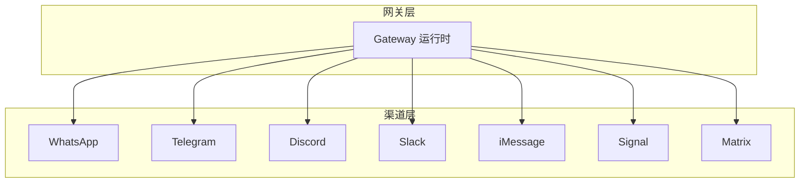
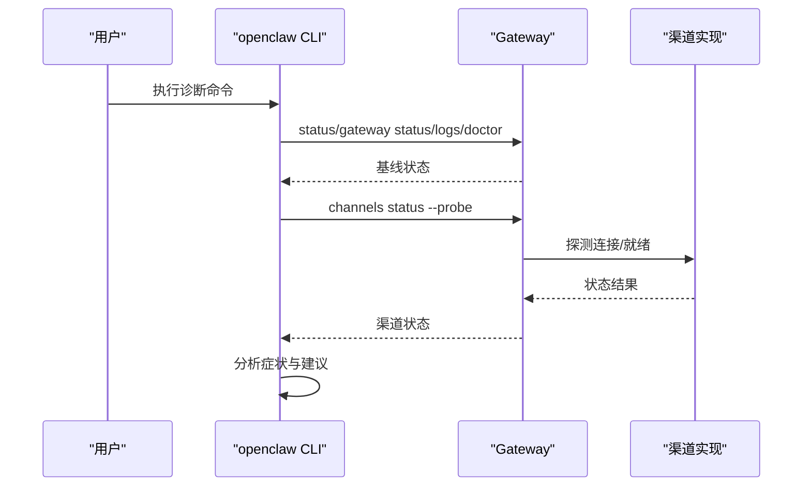
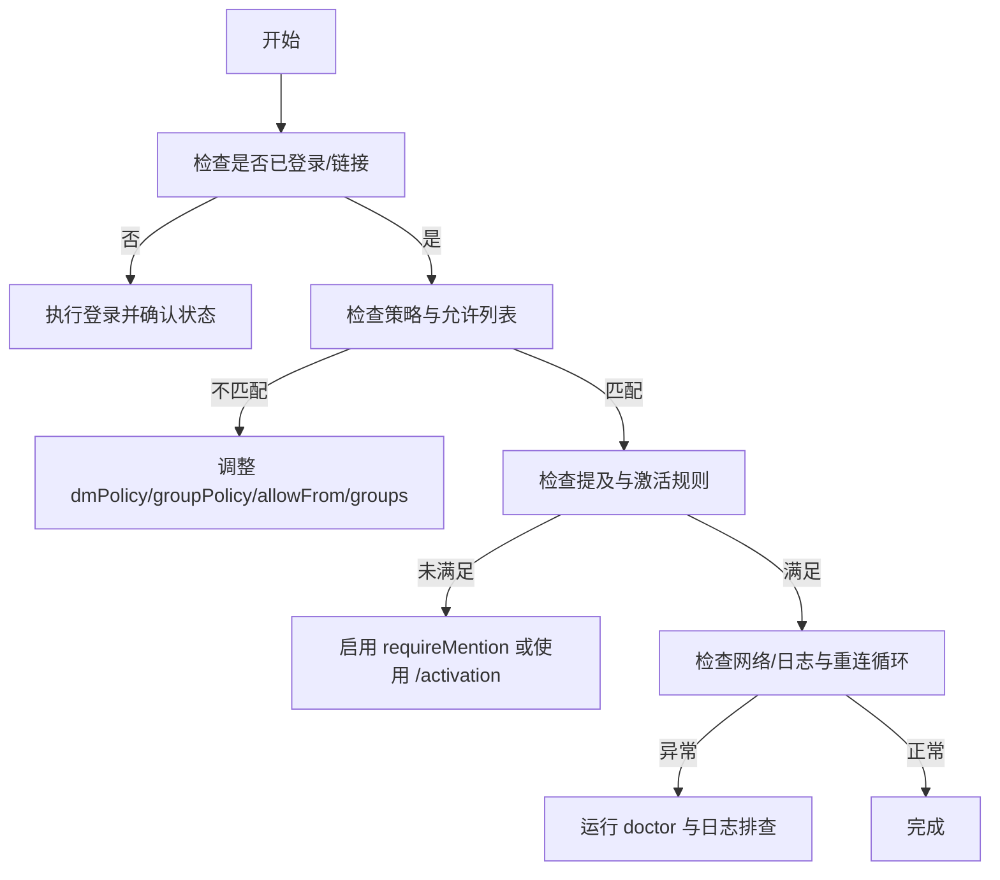
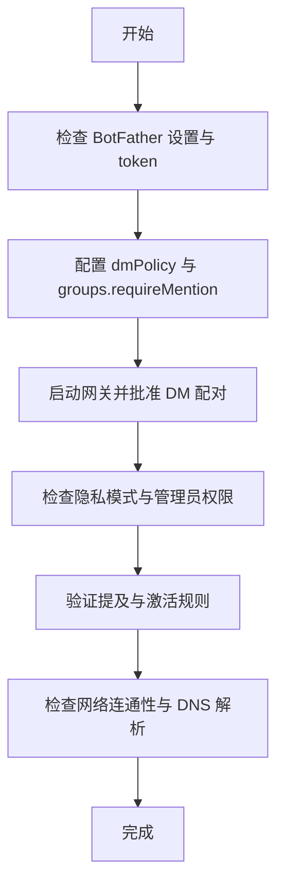
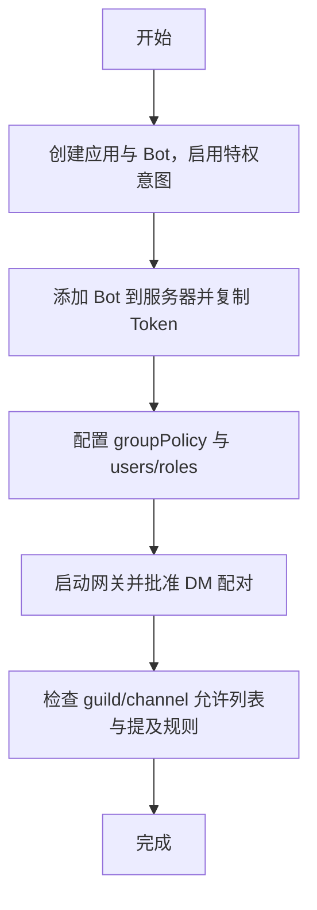
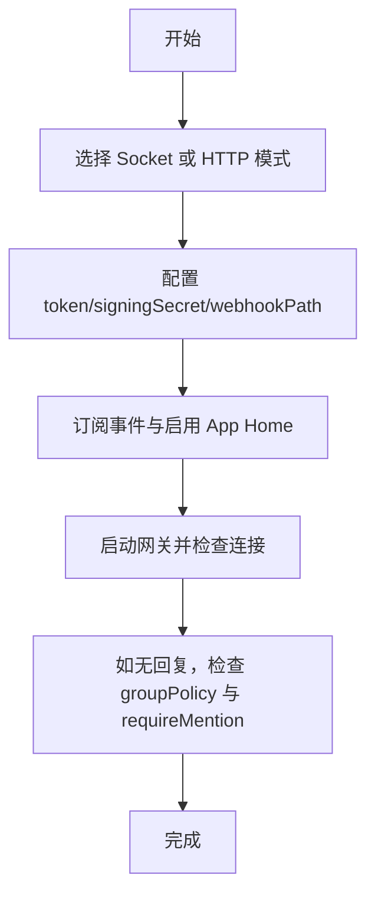
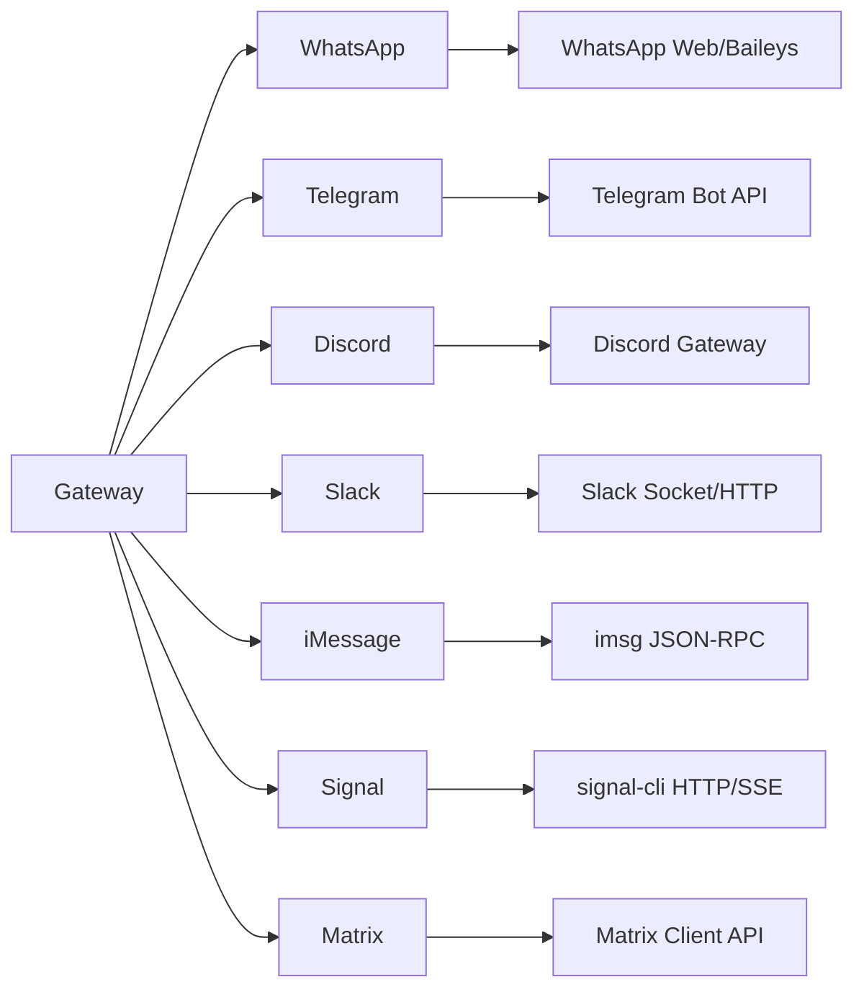

# 渠道问题

<cite>
**本文引用的文件**
- [docs/channels/troubleshooting.md](file://docs/channels/troubleshooting.md)
- [docs/channels/index.md](file://docs/channels/index.md)
- [docs/channels/whatsapp.md](file://docs/channels/whatsapp.md)
- [docs/channels/telegram.md](file://docs/channels/telegram.md)
- [docs/channels/discord.md](file://docs/channels/discord.md)
- [docs/channels/slack.md](file://docs/channels/slack.md)
- [docs/channels/imessage.md](file://docs/channels/imessage.md)
- [docs/channels/signal.md](file://docs/channels/signal.md)
- [docs/channels/matrix.md](file://docs/channels/matrix.md)
- [docs/gateway/troubleshooting.md](file://docs/gateway/troubleshooting.md)
</cite>

## 目录
1. [简介](#简介)
2. [项目结构](#项目结构)
3. [核心组件](#核心组件)
4. [架构总览](#架构总览)
5. [详细组件分析](#详细组件分析)
6. [依赖关系分析](#依赖关系分析)
7. [性能考虑](#性能考虑)
8. [故障排除指南](#故障排除指南)
9. [结论](#结论)
10. [附录](#附录)

## 简介
本指南聚焦于 OpenClaw 的即时通讯渠道连接与运行问题，覆盖 WhatsApp、Telegram、Discord、Slack 等主流渠道的连接失败、消息传递中断、认证错误、权限与配对、群组权限与提及规则、API/速率限制与平台差异等常见问题。文档基于官方文档与仓库内渠道说明，提供可操作的诊断步骤、修复建议与最佳实践，帮助用户快速定位并解决问题。

## 项目结构
OpenClaw 将“渠道”抽象为通过“网关（Gateway）”统一接入的消息通道，不同渠道在“通道配置”“配对/允许列表”“会话路由”“权限与提及”等方面有各自的行为与限制。官方文档中提供了各渠道的“快速设置”“访问控制与激活”“运行时行为”“功能参考”“故障排除”等章节，便于按症状快速检索。

图示来源
- [docs/channels/index.md:14-48](file://docs/channels/index.md#L14-L48)

章节来源
- [docs/channels/index.md:1-48](file://docs/channels/index.md#L1-L48)

## 核心组件
- 渠道配置与策略
  - DM 策略：pairing（默认）、allowlist、open、disabled；支持按账号覆盖
  - 群组策略：open、allowlist、disabled；支持 per-room/per-topic 细粒度控制
  - 提及与激活：requireMention、mentionPatterns、/activation 命令
- 配对与允许列表
  - 渠道侧配对码生成与审批（Telegram、Discord、Slack、Signal、Matrix）
  - 允许列表 entries 支持 ID/用户名/别名/UUID 等，需注意解析与兼容性
- 运行时行为
  - 消息归一化、回复上下文注入、媒体占位符、历史上下文限制
  - 线程/话题/论坛主题路由与会话隔离
- 权限与作用域
  - 各平台的 bot/app token、scope、事件订阅、Webhook/Socket Mode 等要求
- 故障排除命令与基线
  - openclaw status/gateway status/logs/doctor/channels status --probe

章节来源
- [docs/channels/troubleshooting.md:13-30](file://docs/channels/troubleshooting.md#L13-L30)
- [docs/gateway/troubleshooting.md:14-31](file://docs/gateway/troubleshooting.md#L14-L31)

## 架构总览
下图展示“诊断命令—网关—渠道”的交互路径，以及常见问题的定位方向（策略、权限、配对、网络）。

图示来源
- [docs/gateway/troubleshooting.md:14-31](file://docs/gateway/troubleshooting.md#L14-L31)
- [docs/channels/troubleshooting.md:13-30](file://docs/channels/troubleshooting.md#L13-L30)

## 详细组件分析

### WhatsApp（Web）
- 快速设置要点
  - 配置 DM 策略与 allowFrom；必要时使用 dedicated 号码
  - 使用 QR 登录并启动网关；首次需要批准配对请求
- 访问控制与激活
  - DM：pairing/allowlist/open/disabled；支持 per-account 覆盖
  - 群组：groupPolicy（open/allowlist/disabled）+ groupAllowFrom；支持 mention gating
  - 提及与激活：requireMention + mentionPatterns；支持 /activation mention/always
- 运行时与消息处理
  - 文本分片、媒体大小限制、读回执开关、ackReaction
  - 历史上下文缓冲与注入标记
- 常见问题与修复
  - 未链接：执行登录并再次检查状态
  - 连接断开/重连循环：运行 doctor 并查看日志
  - 发送失败：确保网关监听器存在且账号已登录
  - 群消息被忽略：检查 groupPolicy/groupAllowFrom/groups/mention gating

图示来源
- [docs/channels/whatsapp.md:374-424](file://docs/channels/whatsapp.md#L374-L424)

章节来源
- [docs/channels/whatsapp.md:24-76](file://docs/channels/whatsapp.md#L24-L76)
- [docs/channels/whatsapp.md:134-200](file://docs/channels/whatsapp.md#L134-L200)
- [docs/channels/whatsapp.md:292-316](file://docs/channels/whatsapp.md#L292-L316)
- [docs/channels/whatsapp.md:374-424](file://docs/channels/whatsapp.md#L374-L424)

### Telegram
- 快速设置要点
  - 在 BotFather 获取 token；配置 dmPolicy 与 groups.requireMention
  - 启动网关后批准首个 DM 配对
- 侧边设置与权限
  - 隐私模式与群可见性；管理员权限影响消息接收
- 访问控制与激活
  - DM：pairing/allowlist/open/disabled；支持 numeric ID/前缀规范化
  - 群组：groupPolicy + groupAllowFrom；注意 groupAllowFrom 不是群允许列表
  - 提及：@botusername 或 mentionPatterns；支持 /activation always/mention
- 运行时与功能
  - 流式预览（partial/block/progress）、HTML 回退、命令菜单注册
  - 内联按钮、贴纸、投票、回复线程标签、论坛话题与主题路由
- 常见问题与修复
  - /start 无可用回复流：检查配对与 DM 策略
  - 群沉默：检查隐私模式或禁用隐私模式；检查 mention gating
  - 发送失败（网络错误）：检查到 api.telegram.org 的 DNS/IPv6/代理
  - 升级后 allowlist 失效：运行 doctor --fix；将 @username 替换为 numeric ID

图示来源
- [docs/channels/telegram.md:24-69](file://docs/channels/telegram.md#L24-L69)
- [docs/channels/telegram.md:75-103](file://docs/channels/telegram.md#L75-L103)
- [docs/channels/telegram.md:105-246](file://docs/channels/telegram.md#L105-L246)
- [docs/channels/telegram.md:749-790](file://docs/channels/telegram.md#L749-L790)

章节来源
- [docs/channels/telegram.md:24-69](file://docs/channels/telegram.md#L24-L69)
- [docs/channels/telegram.md:75-103](file://docs/channels/telegram.md#L75-L103)
- [docs/channels/telegram.md:105-246](file://docs/channels/telegram.md#L105-L246)
- [docs/channels/telegram.md:749-790](file://docs/channels/telegram.md#L749-L790)

### Discord
- 快速设置要点
  - 开发者门户创建应用与 Bot，启用特权意图；复制 Bot Token
  - 添加 Bot 到服务器；配置允许 DM；启动网关并批准首个 DM 配对
- 访问控制与路由
  - DM：pairing/allowlist/open/disabled；支持 per-account allowFrom
  - 群组：groupPolicy（open/allowlist/disabled）+ users/roles 允许列表
  - 提及：requireMention + mentionPatterns；支持 ignoreOtherMentions
- 功能特性
  - 议程组件（buttons/selects/modals）、论坛频道自动建线程、反应通知、线程绑定会话
- 常见问题与修复
  - 机器人在线但无回复：检查 guild/channel 允许列表与消息内容意图
  - 群消息被忽略：检查 requireMention 与 mention gating
  - DM 回复缺失：检查配对与 DM 策略

图示来源
- [docs/channels/discord.md:24-167](file://docs/channels/discord.md#L24-L167)
- [docs/channels/discord.md:369-461](file://docs/channels/discord.md#L369-L461)

章节来源
- [docs/channels/discord.md:24-167](file://docs/channels/discord.md#L24-L167)
- [docs/channels/discord.md:369-461](file://docs/channels/discord.md#L369-L461)

### Slack
- 快速设置要点
  - Socket Mode：配置 appToken + botToken；订阅事件
  - HTTP Events API：配置 signingSecret 与 webhook 路径
- 访问控制与路由
  - DM：dmPolicy + allowFrom；支持 per-account
  - 群组：groupPolicy + channels.allowlist；支持 per-channel requireMention/users
  - 提及：app_mention/mentionPatterns；支持 thread 回复标签
- 功能特性
  - 文本流式预览（native streaming）、反应通知、成员加入/离开事件映射
- 常见问题与修复
  - 通道无回复：检查 groupPolicy/channels.allowlist/requireMention/users
  - DM 被阻止：检查 dm.enabled/dmPolicy/配对与 allowFrom
  - Socket Mode 未连接：校验 appToken/botToken 与 Slack 应用设置
  - HTTP 模式未接收事件：校验 signingSecret/webhookPath/Request URLs

图示来源
- [docs/channels/slack.md:24-121](file://docs/channels/slack.md#L24-L121)
- [docs/channels/slack.md:136-205](file://docs/channels/slack.md#L136-L205)

章节来源
- [docs/channels/slack.md:24-121](file://docs/channels/slack.md#L24-L121)
- [docs/channels/slack.md:136-205](file://docs/channels/slack.md#L136-L205)

### iMessage（遗留）
- 快速设置要点
  - 安装并验证 imsg；配置 cliPath/dbPath；启动网关并批准 DM 配对
- 权限与要求（macOS）
  - Full Disk Access 与 Automation 权限；必要时在相同用户会话中触发 GUI 提示
- 访问控制与路由
  - DM：pairing/allowlist/open/disabled；支持 handle/chat_id/chat_guid
  - 群组：groupPolicy + groupAllowFrom；支持 regex mentionPatterns
- 常见问题与修复
  - imsg 不可用：检查二进制与 RPC 支持
  - DM 被忽略：检查 dmPolicy/allowFrom/配对
  - 群消息被忽略：检查 groupPolicy/groupAllowFrom/groups 与 mentionPatterns
  - 远程附件失败：检查 remoteHost/allowed roots/SSH 密钥

章节来源
- [docs/channels/imessage.md:31-115](file://docs/channels/imessage.md#L31-L115)
- [docs/channels/imessage.md:134-185](file://docs/channels/imessage.md#L134-L185)
- [docs/channels/imessage.md:304-360](file://docs/channels/imessage.md#L304-L360)

### Signal
- 快速设置要点
  - 使用 separate 号码；安装 signal-cli；QR Link 或 SMS 注册；配置并启动网关
- 访问控制与路由
  - DM：pairing（默认）；UUID/号码 allowFrom
  - 群组：groupPolicy + groupAllowFrom；mention gating 由 mentionPatterns 实现
- 常见问题与修复
  - 守护进程可达但无回复：检查 account/httpUrl/receiveMode
  - DM 被忽略：等待配对批准
  - 群消息被忽略：检查 groupPolicy/groupAllowFrom/mentionPatterns
  - 配置校验错误：运行 doctor --fix；确认 enabled

章节来源
- [docs/channels/signal.md:20-44](file://docs/channels/signal.md#L20-L44)
- [docs/channels/signal.md:182-200](file://docs/channels/signal.md#L182-L200)
- [docs/channels/signal.md:251-286](file://docs/channels/signal.md#L251-L286)

### Matrix
- 快速设置要点
  - 安装插件；获取 homeserver/access token；启用 E2EE（可选）；启动网关
- 加密与多账号
  - E2EE：启用 encryption 并在客户端验证设备；加密房间自动解密
  - 多账号：channels.matrix.accounts；每账号独立存储密钥与会话
- 访问控制与路由
  - DM：pairing/allowlist/open/disabled；支持 full Matrix ID
  - 房间：groupPolicy + groups.allowlist；支持 per-room users/requireMention
- 常见问题与修复
  - 已登录但房间消息被忽略：检查 groupPolicy/groupAllowFrom
  - DM 被忽略：检查 pairing 与 allowFrom
  - 加密房间失败：检查 crypto 模块加载与设备验证

章节来源
- [docs/channels/matrix.md:18-38](file://docs/channels/matrix.md#L18-L38)
- [docs/channels/matrix.md:111-137](file://docs/channels/matrix.md#L111-L137)
- [docs/channels/matrix.md:185-225](file://docs/channels/matrix.md#L185-L225)
- [docs/channels/matrix.md:248-273](file://docs/channels/matrix.md#L248-L273)

## 依赖关系分析
- 渠道与网关
  - 渠道通过网关进行连接、鉴权、事件订阅与消息发送
- 渠道与平台 API
  - 各平台的 token、scope、事件订阅、Webhook/Socket Mode、权限矩阵不同
- 渠道与策略
  - dmPolicy/groupPolicy/allowFrom/mentionPatterns/requireMention 影响消息是否被接受与路由
- 渠道与配对
  - pairing 用于未知发送方的授权；批准后进入 allowFrom 或允许列表

图示来源
- [docs/channels/index.md:14-48](file://docs/channels/index.md#L14-L48)

章节来源
- [docs/channels/index.md:14-48](file://docs/channels/index.md#L14-L48)

## 性能考虑
- 文本分片与媒体大小
  - 各渠道提供 textChunkLimit/chunkMode/mediaMaxMb 控制，避免超限与重试风暴
- 历史上下文
  - historyLimit/dmHistoryLimit 控制上下文长度，平衡响应质量与成本
- 流式预览
  - 部分渠道支持 partial/block/progress 流式输出，减少端到端延迟
- 线程与话题
  - 合理使用 thread/topic 会话隔离，避免跨会话上下文污染

章节来源
- [docs/channels/telegram.md:749-790](file://docs/channels/telegram.md#L749-L790)
- [docs/channels/discord.md:575-617](file://docs/channels/discord.md#L575-L617)
- [docs/channels/whatsapp.md:292-316](file://docs/channels/whatsapp.md#L292-L316)

## 故障排除指南

### 通用诊断命令与基线
- 命令顺序
  - openclaw status
  - openclaw gateway status
  - openclaw logs --follow
  - openclaw doctor
  - openclaw channels status --probe
- 健康基线
  - Runtime: running
  - RPC probe: ok
  - Channel probe: connected/ready

章节来源
- [docs/gateway/troubleshooting.md:14-31](file://docs/gateway/troubleshooting.md#L14-L31)
- [docs/channels/troubleshooting.md:13-30](file://docs/channels/troubleshooting.md#L13-L30)

### 渠道级快速排障清单
- WhatsApp
  - 连接但无 DM 回复：检查配对与 DM 策略
  - 群消息被忽略：检查 requireMention 与 mentionPatterns
  - 随机断开/重登：运行 doctor 与日志，重新登录
- Telegram
  - /start 无回复流：检查配对与 DM 策略
  - 群沉默：检查隐私模式与 mention gating
  - 发送失败（网络错误）：检查到 api.telegram.org 的 DNS/IPv6/代理
  - 升级后 allowlist 失效：运行 doctor --fix；将 @username 替换为 numeric ID
- Discord
  - 机器人在线但无公会回复：检查 guild/channel 允许列表与消息内容意图
  - 群消息被忽略：检查 requireMention 与 mention gating
  - DM 回复缺失：检查配对与 DM 策略
- Slack
  - Socket/HTTP 未连接：校验 token 与事件订阅/签名密钥/请求 URL
  - 通道无回复：检查 groupPolicy/channels.allowlist/requireMention/users
  - DM 被阻止：检查 dm.enabled/dmPolicy/配对与 allowFrom
- iMessage（遗留）
  - imsg 不可用：检查二进制与 RPC 支持
  - DM 被忽略：检查 dmPolicy/allowFrom/配对
  - 群消息被忽略：检查 groupPolicy/groupAllowFrom/mentionPatterns
  - 远程附件失败：检查 remoteHost/allowed roots/SSH 密钥
- Signal
  - 守护进程可达但无回复：检查 account/httpUrl/receiveMode
  - DM 被忽略：等待配对批准
  - 群消息被忽略：检查 groupPolicy/groupAllowFrom/mentionPatterns
- Matrix
  - 已登录但房间消息被忽略：检查 groupPolicy/groupAllowFrom
  - DM 被忽略：检查 pairing 与 allowFrom
  - 加密房间失败：检查 crypto 模块加载与设备验证

章节来源
- [docs/channels/troubleshooting.md:31-118](file://docs/channels/troubleshooting.md#L31-L118)
- [docs/channels/whatsapp.md:374-424](file://docs/channels/whatsapp.md#L374-L424)
- [docs/channels/telegram.md:338-341](file://docs/channels/telegram.md#L338-L341)
- [docs/channels/discord.md:436-461](file://docs/channels/discord.md#L436-L461)
- [docs/channels/slack.md:433-490](file://docs/channels/slack.md#L433-L490)
- [docs/channels/imessage.md:304-360](file://docs/channels/imessage.md#L304-L360)
- [docs/channels/signal.md:251-286](file://docs/channels/signal.md#L251-L286)
- [docs/channels/matrix.md:248-273](file://docs/channels/matrix.md#L248-L273)

### 权限与作用域（常见问题）
- Slack
  - 缺少 scope：校验 appToken/botToken 与事件订阅
  - HTTP 模式缺少 signingSecret 或 Request URL 不一致
- Discord
  - 未启用 Message Content Intent/Server Members Intent
  - OAuth 权限不足导致无法读取消息历史或获取成员信息
- Telegram
  - Privacy Mode 导致群消息不可见；需关闭隐私模式或设为管理员
- WhatsApp
  - 无有效会话或凭据目录异常导致反复断开/重登
- iMessage
  - macOS 权限缺失（Full Disk Access/Automation）导致无法读取/发送消息

章节来源
- [docs/channels/slack.md:340-431](file://docs/channels/slack.md#L340-L431)
- [docs/channels/discord.md:490-538](file://docs/channels/discord.md#L490-L538)
- [docs/channels/telegram.md:78-103](file://docs/channels/telegram.md#L78-L103)
- [docs/channels/whatsapp.md:389-400](file://docs/channels/whatsapp.md#L389-L400)
- [docs/channels/imessage.md:117-133](file://docs/channels/imessage.md#L117-L133)

### 配对流程与账户绑定
- 通用流程
  - 生成配对码 → 在渠道侧发送配对码 → 在 OpenClaw 中批准 → 进入 allowFrom/允许列表
- 渠道差异
  - Telegram：/start 后批准 DM 配对
  - Discord：DM 触发后批准配对
  - Slack：DM 触发后批准配对
  - Signal：DM 触发后批准配对
  - Matrix：DM 触发后批准配对
- 注意事项
  - 配对码过期时间与最大挂起数
  - 升级后可能需要 doctor --fix 以迁移 allowFrom 格式

章节来源
- [docs/channels/troubleshooting.md:31-118](file://docs/channels/troubleshooting.md#L31-L118)
- [docs/channels/telegram.md:54-68](file://docs/channels/telegram.md#L54-L68)
- [docs/channels/discord.md:143-166](file://docs/channels/discord.md#L143-L166)
- [docs/channels/slack.md:454-465](file://docs/channels/slack.md#L454-L465)
- [docs/channels/signal.md:251-268](file://docs/channels/signal.md#L251-L268)
- [docs/channels/matrix.md:248-264](file://docs/channels/matrix.md#L248-L264)

### 群组权限与提及规则
- 通用原则
  - groupPolicy：open/allowlist/disabled
  - groupAllowFrom：限制允许在群组中触发的发送者
  - requireMention：是否必须提及 bot
  - mentionPatterns：正则表达式匹配
- 渠道差异
  - Telegram：支持 @botusername 与 mentionPatterns；支持 per-group/per-topic
  - Discord：支持角色/用户 allowlist；支持 ignoreOtherMentions
  - WhatsApp：支持 mention/JID 与 reply-to 自动检测
  - Slack：支持 per-channel requireMention/users
  - iMessage：无原生提及，使用 mentionPatterns
  - Matrix：支持 full Matrix ID；支持 per-room users/requireMention

章节来源
- [docs/channels/telegram.md:142-246](file://docs/channels/telegram.md#L142-L246)
- [docs/channels/discord.md:397-461](file://docs/channels/discord.md#L397-L461)
- [docs/channels/whatsapp.md:178-200](file://docs/channels/whatsapp.md#L178-L200)
- [docs/channels/slack.md:165-205](file://docs/channels/slack.md#L165-L205)
- [docs/channels/imessage.md:151-171](file://docs/channels/imessage.md#L151-L171)
- [docs/channels/matrix.md:195-225](file://docs/channels/matrix.md#L195-L225)

### API 限制、速率限制与权限配置
- 速率限制与计费
  - 文档中提供针对 429/402 的识别与处理思路（例如 Anthropic 长上下文）
- 渠道侧限制
  - Telegram：textChunkLimit、mediaMaxMb、timeoutSeconds
  - Discord：streaming、draftChunk、historyLimit
  - Slack：textChunkLimit、mediaMaxMb、streaming/nativeStreaming
  - WhatsApp：textChunkLimit、mediaMaxMb、sendReadReceipts
  - iMessage：textChunkLimit、mediaMaxMb、includeAttachments
  - Signal：textChunkLimit、mediaMaxMb、receiveMode
  - Matrix：textChunkLimit、mediaMaxMb、threadReplies、encryption
- 权限与作用域
  - Slack：appToken/botToken、signingSecret、事件订阅
  - Discord：Message Content Intent、Server Members Intent、OAuth 权限
  - Telegram：Privacy Mode、BotFather 设置
  - WhatsApp：Baileys 凭据与会话状态
  - iMessage：macOS 权限与 imsg CLI
  - Signal：signal-cli 版本与 captcha 流程
  - Matrix：homeserver/access token、E2EE 设备验证

章节来源
- [docs/gateway/troubleshooting.md:32-60](file://docs/gateway/troubleshooting.md#L32-L60)
- [docs/channels/telegram.md:749-790](file://docs/channels/telegram.md#L749-L790)
- [docs/channels/discord.md:575-617](file://docs/channels/discord.md#L575-L617)
- [docs/channels/slack.md:519-547](file://docs/channels/slack.md#L519-L547)
- [docs/channels/whatsapp.md:292-316](file://docs/channels/whatsapp.md#L292-L316)
- [docs/channels/imessage.md:247-286](file://docs/channels/imessage.md#L247-L286)
- [docs/channels/signal.md:206-220](file://docs/channels/signal.md#L206-L220)
- [docs/channels/matrix.md:274-304](file://docs/channels/matrix.md#L274-L304)

## 结论
- 本指南基于官方文档总结了主流渠道的连接与运行问题，并提供了可操作的诊断步骤与修复建议
- 关键在于先用通用命令建立健康基线，再结合渠道特性逐项排查策略、权限、配对与网络
- 对于升级后的问题，优先运行 doctor 与检查 token/URL/权限变更

## 附录
- 相关文档入口
  - 渠道索引与概览：[渠道索引:1-48](file://docs/channels/index.md#L1-L48)
  - 通用故障排除：[网关故障排除:1-380](file://docs/gateway/troubleshooting.md#L1-L380)
  - 各渠道详细说明与故障排除：见各渠道文档章节