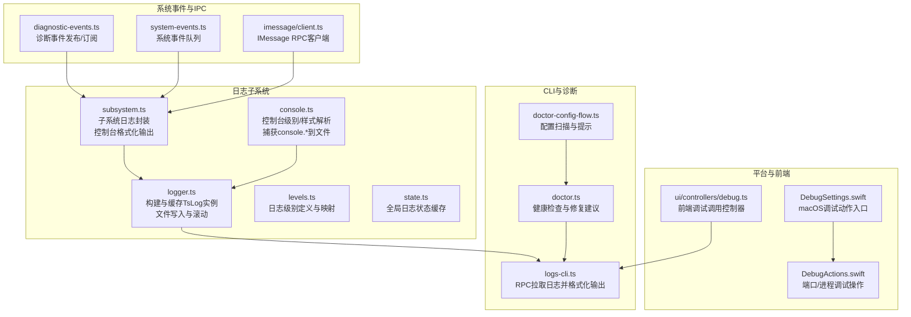
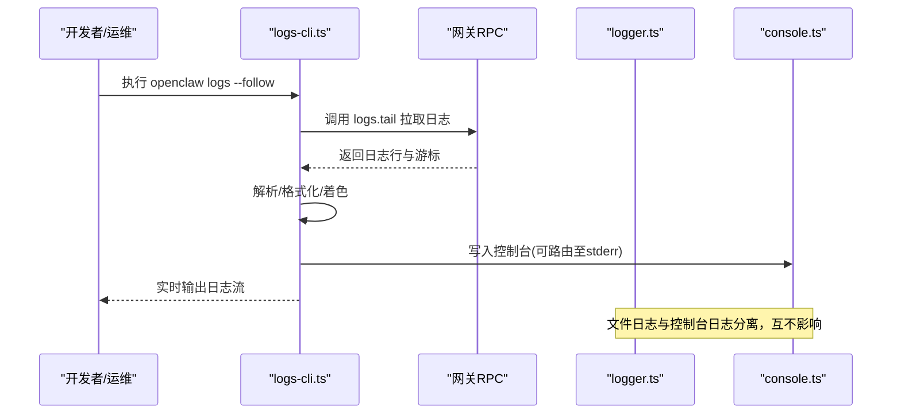
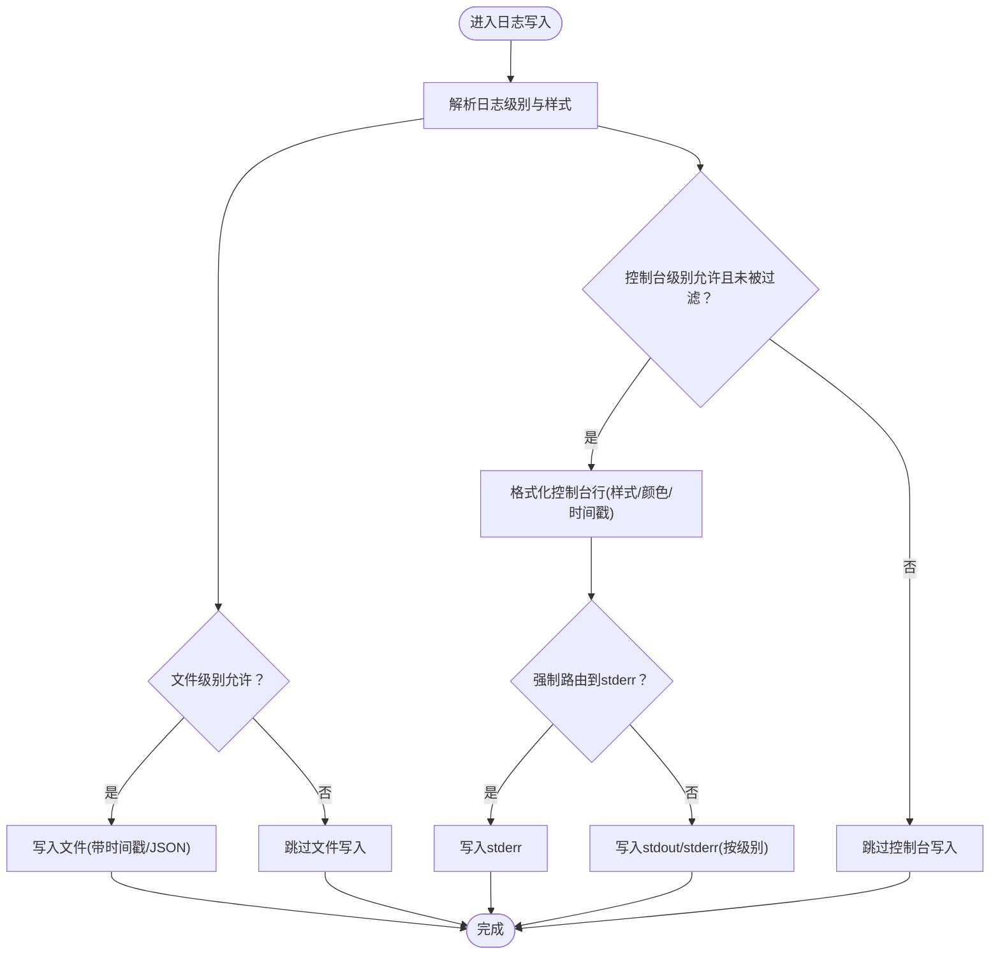
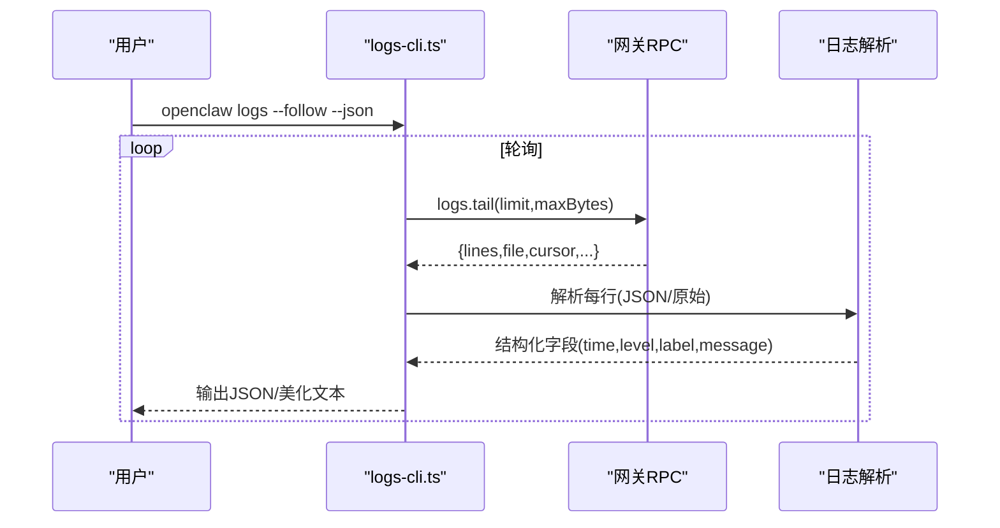
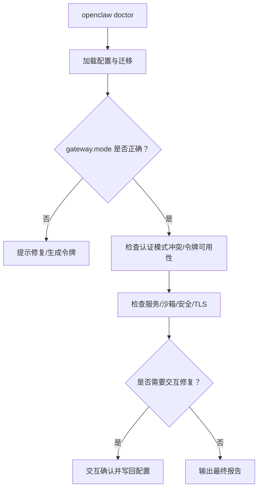
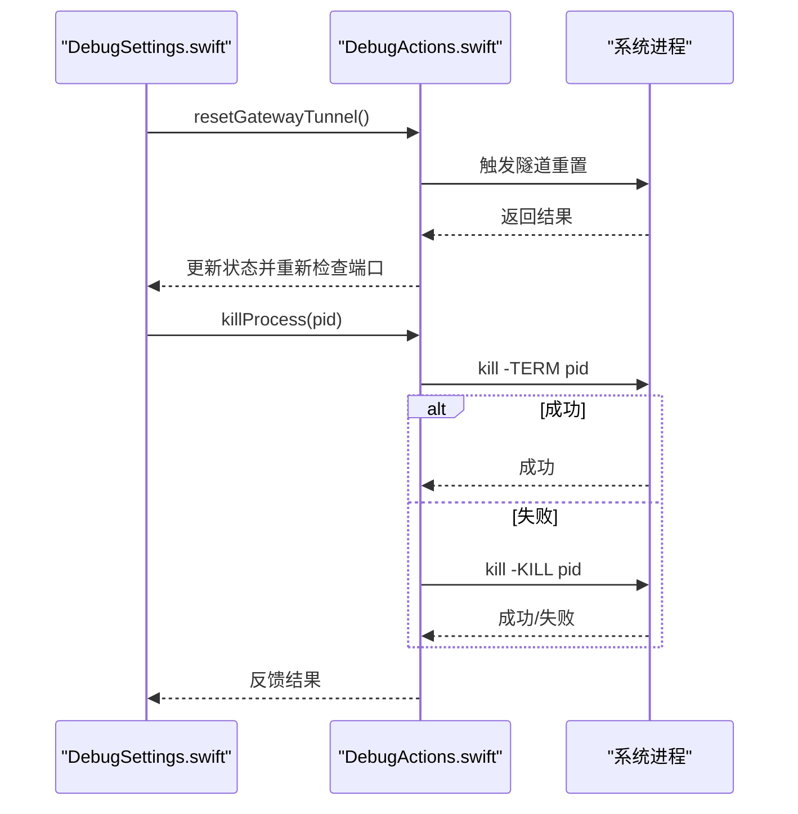
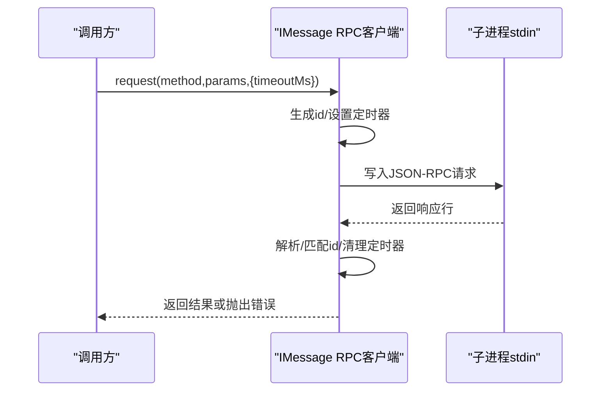
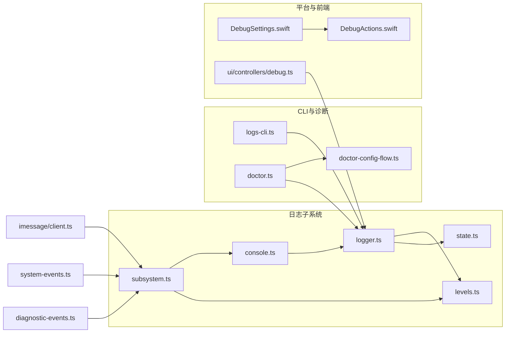

# 调试指南

<cite>
**本文引用的文件**
- [src/logging/logger.ts](file://src/logging/logger.ts)
- [src/logging/subsystem.ts](file://src/logging/subsystem.ts)
- [src/logging/console.ts](file://src/logging/console.ts)
- [src/logging/state.ts](file://src/logging/state.ts)
- [src/logging/levels.ts](file://src/logging/levels.ts)
- [src/cli/logs-cli.ts](file://src/cli/logs-cli.ts)
- [src/commands/doctor.ts](file://src/commands/doctor.ts)
- [docs/help/troubleshooting.md](file://docs/help/troubleshooting.md)
- [docs/gateway/troubleshooting.md](file://docs/gateway/troubleshooting.md)
- [apps/macos/Sources/OpenClaw/DebugSettings.swift](file://apps/macos/Sources/OpenClaw/DebugSettings.swift)
- [apps/macos/Sources/OpenClaw/DebugActions.swift](file://apps/macos/Sources/OpenClaw/DebugActions.swift)
- [ui/src/ui/controllers/debug.ts](file://ui/src/ui/controllers/debug.ts)
- [src/imessage/client.ts](file://src/imessage/client.ts)
- [src/infra/diagnostic-events.ts](file://src/infra/diagnostic-events.ts)
- [src/infra/system-events.ts](file://src/infra/system-events.ts)
- [src/commands/doctor-config-flow.ts](file://src/commands/doctor-config-flow.ts)
- [src/cli/memory-cli.ts](file://src/cli/memory-cli.ts)
- [scripts/debug-claude-usage.ts](file://scripts/debug-claude-usage.ts)
</cite>

## 目录
1. [简介](#简介)
2. [项目结构](#项目结构)
3. [核心组件](#核心组件)
4. [架构总览](#架构总览)
5. [详细组件分析](#详细组件分析)
6. [依赖关系分析](#依赖关系分析)
7. [性能考量](#性能考量)
8. [故障排查指南](#故障排查指南)
9. [结论](#结论)
10. [附录](#附录)

## 简介
本指南面向开发者与运维人员，提供OpenClaw系统的系统化调试方法论与工具链。内容覆盖日志分析、调试工具使用、错误追踪与定位策略，并针对网络通信、进程间通信、内存与资源占用等专业场景给出可操作的调试流程与最佳实践。文档同时区分开发、测试与生产环境的调试差异，帮助快速定位并解决问题。

## 项目结构
OpenClaw的调试能力由“日志子系统”“CLI日志查看器”“诊断命令”“平台调试入口”“前端调试控制器”等模块协同构成。下图展示与调试相关的关键模块与交互：

图表来源
- [src/logging/logger.ts:126-184](file://src/logging/logger.ts#L126-L184)
- [src/logging/subsystem.ts:308-402](file://src/logging/subsystem.ts#L308-L402)
- [src/logging/console.ts:100-111](file://src/logging/console.ts#L100-L111)
- [src/cli/logs-cli.ts:198-329](file://src/cli/logs-cli.ts#L198-L329)
- [src/commands/doctor.ts:73-369](file://src/commands/doctor.ts#L73-L369)
- [apps/macos/Sources/OpenClaw/DebugSettings.swift:672-706](file://apps/macos/Sources/OpenClaw/DebugSettings.swift#L672-L706)
- [apps/macos/Sources/OpenClaw/DebugActions.swift:237-265](file://apps/macos/Sources/OpenClaw/DebugActions.swift#L237-L265)
- [ui/src/ui/controllers/debug.ts:45-60](file://ui/src/ui/controllers/debug.ts#L45-L60)
- [src/infra/diagnostic-events.ts:195-235](file://src/infra/diagnostic-events.ts#L195-L235)
- [src/infra/system-events.ts:99-119](file://src/infra/system-events.ts#L99-L119)
- [src/imessage/client.ts:148-184](file://src/imessage/client.ts#L148-L184)

章节来源
- [src/logging/logger.ts:1-348](file://src/logging/logger.ts#L1-L348)
- [src/logging/subsystem.ts:1-426](file://src/logging/subsystem.ts#L1-L426)
- [src/logging/console.ts:1-327](file://src/logging/console.ts#L1-L327)
- [src/cli/logs-cli.ts:1-330](file://src/cli/logs-cli.ts#L1-L330)
- [src/commands/doctor.ts:1-370](file://src/commands/doctor.ts#L1-L370)

## 核心组件
- 日志子系统：统一管理日志级别、文件滚动、控制台输出与元数据格式化；支持按子系统粒度启用/抑制输出。
- CLI日志查看器：通过RPC从网关拉取日志，支持JSON/纯文本/带颜色输出、时间本地化显示与断开管道处理。
- 诊断命令：执行系统性健康检查，输出修复建议与配置扫描结果，辅助快速定位问题根因。
- 平台调试入口：macOS应用提供隧道重置、端口检查、进程终止等调试动作；前端提供调试方法调用控制器。
- 系统事件与IPC：诊断事件发布/订阅与系统事件队列，IMessage RPC客户端用于进程间通信调试。

章节来源
- [src/logging/logger.ts:126-184](file://src/logging/logger.ts#L126-L184)
- [src/logging/subsystem.ts:308-402](file://src/logging/subsystem.ts#L308-L402)
- [src/logging/console.ts:203-326](file://src/logging/console.ts#L203-L326)
- [src/cli/logs-cli.ts:218-329](file://src/cli/logs-cli.ts#L218-L329)
- [src/commands/doctor.ts:73-369](file://src/commands/doctor.ts#L73-L369)
- [apps/macos/Sources/OpenClaw/DebugSettings.swift:672-706](file://apps/macos/Sources/OpenClaw/DebugSettings.swift#L672-L706)
- [apps/macos/Sources/OpenClaw/DebugActions.swift:237-265](file://apps/macos/Sources/OpenClaw/DebugActions.swift#L237-L265)
- [ui/src/ui/controllers/debug.ts:45-60](file://ui/src/ui/controllers/debug.ts#L45-L60)
- [src/infra/diagnostic-events.ts:195-235](file://src/infra/diagnostic-events.ts#L195-L235)
- [src/infra/system-events.ts:99-119](file://src/infra/system-events.ts#L99-L119)
- [src/imessage/client.ts:148-184](file://src/imessage/client.ts#L148-L184)

## 架构总览
OpenClaw的调试架构以“日志子系统为核心”，向上通过CLI与UI提供可视化与交互式调试入口，向下通过诊断命令与平台动作实现系统级排障。

图表来源
- [src/cli/logs-cli.ts:218-329](file://src/cli/logs-cli.ts#L218-L329)
- [src/logging/logger.ts:126-184](file://src/logging/logger.ts#L126-L184)
- [src/logging/console.ts:203-326](file://src/logging/console.ts#L203-L326)

## 详细组件分析

### 日志子系统（logger.ts、subsystem.ts、console.ts）
- 日志级别与最小阈值映射：支持silent/fatal/error/warn/info/debug/trace，内部转换为tslog最小级别，确保只在必要时写入。
- 文件日志：默认滚动文件名含日期，超过最大文件大小时进行截断保护并输出警告；支持外部传输注册以便接入其他日志后端。
- 控制台输出：支持pretty/compact/json三种样式；可强制路由到stderr；可对特定子系统与消息进行抑制；支持时间戳前缀与ANSI着色。
- 子系统日志：按子系统命名空间生成子logger，支持meta中consoleMessage覆盖仅控制台显示的消息；支持raw直写不带级别/子系统前缀。
- 环境与配置：优先读取环境变量覆盖；测试模式下有快速路径避免加载配置；支持禁用文件日志（silent）。

图表来源
- [src/logging/logger.ts:126-184](file://src/logging/logger.ts#L126-L184)
- [src/logging/subsystem.ts:316-361](file://src/logging/subsystem.ts#L316-L361)
- [src/logging/console.ts:203-326](file://src/logging/console.ts#L203-L326)

章节来源
- [src/logging/logger.ts:1-348](file://src/logging/logger.ts#L1-L348)
- [src/logging/subsystem.ts:308-402](file://src/logging/subsystem.ts#L308-L402)
- [src/logging/console.ts:100-111](file://src/logging/console.ts#L100-L111)
- [src/logging/state.ts:1-20](file://src/logging/state.ts#L1-L20)
- [src/logging/levels.ts:1-37](file://src/logging/levels.ts#L1-L37)

### CLI日志查看器（logs-cli.ts）
- 功能特性：支持限制返回行数、最大字节数、跟随模式、轮询间隔、本地时间显示、JSON输出、颜色开关。
- 错误处理：网关不可达时输出结构化错误信息与提示；断开管道时优雅停止并记录。
- 输出格式：根据终端能力自动选择美化或简洁输出；支持将日志行解析为结构化对象再格式化。

图表来源
- [src/cli/logs-cli.ts:218-329](file://src/cli/logs-cli.ts#L218-L329)

章节来源
- [src/cli/logs-cli.ts:1-330](file://src/cli/logs-cli.ts#L1-L330)

### 诊断命令（doctor.ts）
- 健康检查：检查配置有效性、认证模式冲突、服务安装与运行状态、沙箱镜像、安全与TLS前置条件等。
- 自动修复：对可自动修复的问题给出修复建议；对需要人工确认的步骤提供交互式确认。
- 记忆与工作区：探测工作区完整性与备份建议；对内存检索健康进行探测。

图表来源
- [src/commands/doctor.ts:73-369](file://src/commands/doctor.ts#L73-L369)

章节来源
- [src/commands/doctor.ts:1-370](file://src/commands/doctor.ts#L1-L370)

### 平台调试入口（macOS）
- 隧道重置与端口检查：通过调试动作触发隧道重置与端口状态刷新，便于排查网络连通性问题。
- 进程终止：尝试优雅终止目标进程，失败则强制终止并反馈状态。

图表来源
- [apps/macos/Sources/OpenClaw/DebugSettings.swift:672-706](file://apps/macos/Sources/OpenClaw/DebugSettings.swift#L672-L706)
- [apps/macos/Sources/OpenClaw/DebugActions.swift:237-265](file://apps/macos/Sources/OpenClaw/DebugActions.swift#L237-L265)

章节来源
- [apps/macos/Sources/OpenClaw/DebugSettings.swift:672-706](file://apps/macos/Sources/OpenClaw/DebugSettings.swift#L672-L706)
- [apps/macos/Sources/OpenClaw/DebugActions.swift:237-265](file://apps/macos/Sources/OpenClaw/DebugActions.swift#L237-L265)

### 前端调试控制器（ui/controllers/debug.ts）
- 提供通过RPC调用调试方法的能力，支持参数JSON输入与结果/错误展示，便于在Web界面中快速复现与验证问题。

章节来源
- [ui/src/ui/controllers/debug.ts:45-60](file://ui/src/ui/controllers/debug.ts#L45-L60)

### 系统事件与诊断事件（diagnostic-events.ts、system-events.ts）
- 诊断事件：全局状态维护事件序列、监听者集合与分发深度保护，异常监听者不影响主流程。
- 系统事件：按会话键维护事件队列，支持窥视、出队与重置，便于在调试阶段观察系统行为。

章节来源
- [src/infra/diagnostic-events.ts:171-242](file://src/infra/diagnostic-events.ts#L171-L242)
- [src/infra/system-events.ts:99-119](file://src/infra/system-events.ts#L99-L119)

### 进程间通信（IMessage RPC，imessage/client.ts）
- 请求/响应模型：基于JSON-RPC 2.0，支持超时与pending管理；解析失败时记录错误并忽略该行，避免影响整体流程。
- 超时与健壮性：为每个请求分配唯一ID并设置定时器，超时后拒绝并清理pending。

图表来源
- [src/imessage/client.ts:148-184](file://src/imessage/client.ts#L148-L184)

章节来源
- [src/imessage/client.ts:148-194](file://src/imessage/client.ts#L148-L194)

### 配置与诊断（doctor-config-flow.ts）
- 安全二进制与自定义安全配置扫描：对缺失的profile与解释器配置给出修复建议，指导使用doctor自动补全。

章节来源
- [src/commands/doctor-config-flow.ts:1855-1888](file://src/commands/doctor-config-flow.ts#L1855-L1888)

### 内存与资源占用（memory-cli.ts）
- 内存索引进度：提供索引进度、已耗时与剩余ETA估算，便于在大规模索引任务中监控资源占用与性能表现。

章节来源
- [src/cli/memory-cli.ts:657-686](file://src/cli/memory-cli.ts#L657-L686)

## 依赖关系分析
- 日志子系统内部依赖：subsystem依赖console与levels解析控制台样式与级别；logger依赖state与levels进行缓存与阈值计算；console依赖logger以捕获console.*到文件。
- CLI与诊断：logs-cli依赖gateway RPC与日志解析；doctor依赖配置加载、健康探测与修复流程。
- 平台与前端：macOS调试动作通过Shell执行系统命令；前端调试控制器通过RPC与网关交互。
- 事件系统：诊断事件与系统事件作为横切关注点，被各模块通过子系统日志记录与观察。

图表来源
- [src/logging/subsystem.ts:1-426](file://src/logging/subsystem.ts#L1-L426)
- [src/logging/console.ts:1-327](file://src/logging/console.ts#L1-L327)
- [src/logging/logger.ts:1-348](file://src/logging/logger.ts#L1-L348)
- [src/logging/state.ts:1-20](file://src/logging/state.ts#L1-L20)
- [src/logging/levels.ts:1-37](file://src/logging/levels.ts#L1-L37)
- [src/cli/logs-cli.ts:1-330](file://src/cli/logs-cli.ts#L1-L330)
- [src/commands/doctor.ts:1-370](file://src/commands/doctor.ts#L1-L370)
- [src/commands/doctor-config-flow.ts:1855-1888](file://src/commands/doctor-config-flow.ts#L1855-L1888)
- [apps/macos/Sources/OpenClaw/DebugSettings.swift:672-706](file://apps/macos/Sources/OpenClaw/DebugSettings.swift#L672-L706)
- [apps/macos/Sources/OpenClaw/DebugActions.swift:237-265](file://apps/macos/Sources/OpenClaw/DebugActions.swift#L237-L265)
- [ui/src/ui/controllers/debug.ts:45-60](file://ui/src/ui/controllers/debug.ts#L45-L60)
- [src/infra/diagnostic-events.ts:171-242](file://src/infra/diagnostic-events.ts#L171-L242)
- [src/infra/system-events.ts:99-119](file://src/infra/system-events.ts#L99-L119)
- [src/imessage/client.ts:148-184](file://src/imessage/client.ts#L148-L184)

## 性能考量
- 日志级别与输出：在高吞吐场景下建议提升文件级别（如info）并降低控制台级别（silent），减少TTY写入与格式化开销。
- 文件滚动与大小限制：合理设置maxFileBytes，避免频繁截断导致的写入抖动；定期清理旧日志文件。
- 控制台样式：在非TTY或CI环境下自动降级为compact/json，减少ANSI转义与颜色计算成本。
- CLI跟随模式：适当增大轮询间隔与max-bytes，避免频繁RPC调用与大块日志解析。
- 诊断事件：分发深度保护避免递归风暴；监听者异常不影响主流程。

## 故障排查指南

### 快速三分钟诊断流程
- 使用“症状优先”的排查清单，依次执行状态、探测、网关状态、医生、通道探测与日志跟踪，快速定位问题范围。

章节来源
- [docs/help/troubleshooting.md:13-35](file://docs/help/troubleshooting.md#L13-L35)

### 症状树与命令梯子
- 不同症状（无回复、UI无法连接、网关未启动、通道连上但消息不流动、自动化未触发、节点工具失败、浏览器工具失败）分别提供命令梯子与常见日志签名，便于快速缩小范围。

章节来源
- [docs/help/troubleshooting.md:68-298](file://docs/help/troubleshooting.md#L68-L298)
- [docs/gateway/troubleshooting.md:14-380](file://docs/gateway/troubleshooting.md#L14-L380)

### 日志分析与过滤
- 使用CLI日志查看器的follow、json、plain、color、local-time选项组合，结合控制台样式与子系统过滤，快速聚焦问题域。
- 在控制台层面对特定子系统进行过滤，或对探针类消息进行抑制，避免噪声干扰。

章节来源
- [src/cli/logs-cli.ts:218-329](file://src/cli/logs-cli.ts#L218-L329)
- [src/logging/console.ts:119-138](file://src/logging/console.ts#L119-L138)
- [src/logging/subsystem.ts:253-283](file://src/logging/subsystem.ts#L253-L283)

### 错误追踪与定位
- 诊断事件：利用诊断事件发布/订阅机制记录关键事件序列，配合子系统日志定位事件前后关系。
- 系统事件：通过窥视/出队接口观察会话事件队列，辅助定位状态变更与异常路径。

章节来源
- [src/infra/diagnostic-events.ts:195-235](file://src/infra/diagnostic-events.ts#L195-L235)
- [src/infra/system-events.ts:99-119](file://src/infra/system-events.ts#L99-L119)

### 网络与进程间通信调试
- 网关RPC：当CLI日志显示“网关不可达”时，检查URL、鉴权与服务状态；必要时使用doctor进行健康检查。
- IPC（IMessage）：关注请求超时、解析失败与pending清理；在超时后重试或调整超时参数。

章节来源
- [src/cli/logs-cli.ts:158-196](file://src/cli/logs-cli.ts#L158-L196)
- [src/imessage/client.ts:148-194](file://src/imessage/client.ts#L148-L194)

### 内存与资源占用
- 使用内存CLI的索引进度输出，结合本地时间显示与ETA估算，评估资源占用与性能瓶颈。

章节来源
- [src/cli/memory-cli.ts:657-686](file://src/cli/memory-cli.ts#L657-L686)

### 生产环境调试要点
- 优先使用silent文件日志与紧凑/JSON控制台输出，避免TTY与颜色带来的额外开销。
- 使用doctor进行系统性健康检查与配置修复，减少手工排查误差。
- 对于远程网关，确保URL与鉴权一致，必要时使用doctor进行迁移与兼容性检查。

章节来源
- [src/commands/doctor.ts:316-335](file://src/commands/doctor.ts#L316-L335)
- [docs/gateway/troubleshooting.md:307-374](file://docs/gateway/troubleshooting.md#L307-L374)

### 开发与测试环境调试
- 测试模式下默认静默文件日志与控制台日志，可通过环境变量或覆盖设置调整级别与样式。
- 使用子系统过滤与控制台时间戳前缀，提升调试可读性。

章节来源
- [src/logging/logger.ts:64-83](file://src/logging/logger.ts#L64-L83)
- [src/logging/console.ts:40-72](file://src/logging/console.ts#L40-L72)
- [src/logging/console.ts:128-130](file://src/logging/console.ts#L128-L130)

### 远程调试与脚本辅助
- 使用远程脚本辅助分析第三方服务用量与问题定位，结合日志与CLI输出进行交叉验证。

章节来源
- [scripts/debug-claude-usage.ts](file://scripts/debug-claude-usage.ts)

## 结论
OpenClaw提供了从日志、CLI、诊断命令到平台与前端的完整调试工具链。通过合理设置日志级别与输出样式、使用doctor进行系统性健康检查、结合IPC与事件系统进行问题定位，能够在不同环境中高效发现并解决问题。建议在生产环境优先采用静默文件日志与紧凑输出，在开发与测试环境启用更丰富的控制台输出与过滤能力。

## 附录

### 日志级别与输出建议
- 开发：控制台debug/trace，文件info；开启颜色与时间戳前缀。
- 测试：silent文件日志，控制台silent（除非显式开启）。
- 生产：文件debug/info，控制台warn/error；避免TTY与颜色。

章节来源
- [src/logging/levels.ts:1-37](file://src/logging/levels.ts#L1-L37)
- [src/logging/console.ts:40-72](file://src/logging/console.ts#L40-L72)
- [src/logging/logger.ts:64-83](file://src/logging/logger.ts#L64-L83)