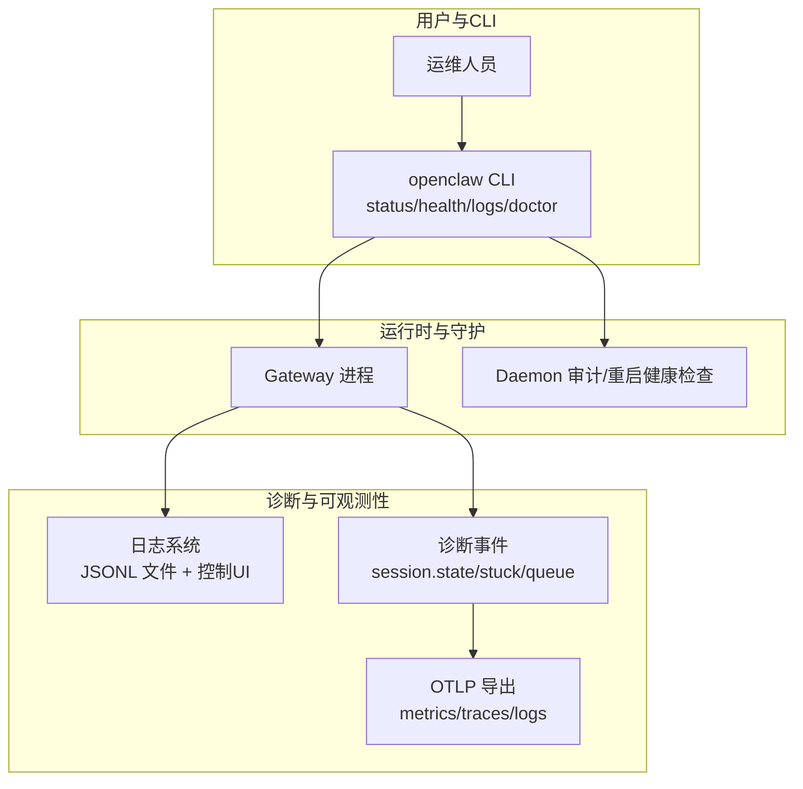
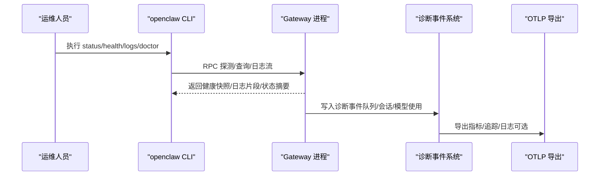
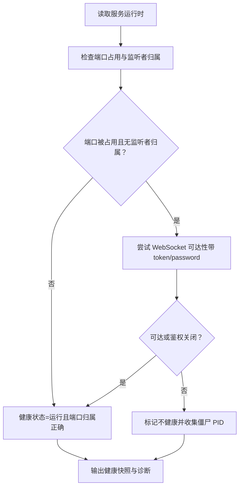
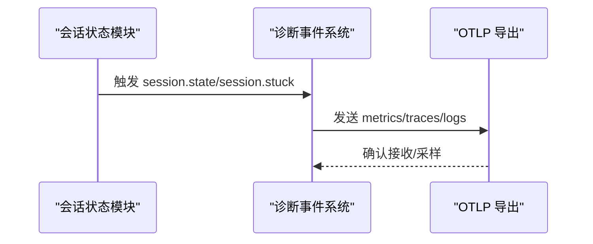
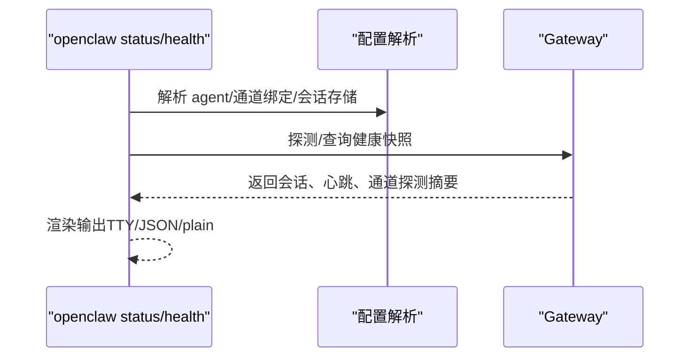
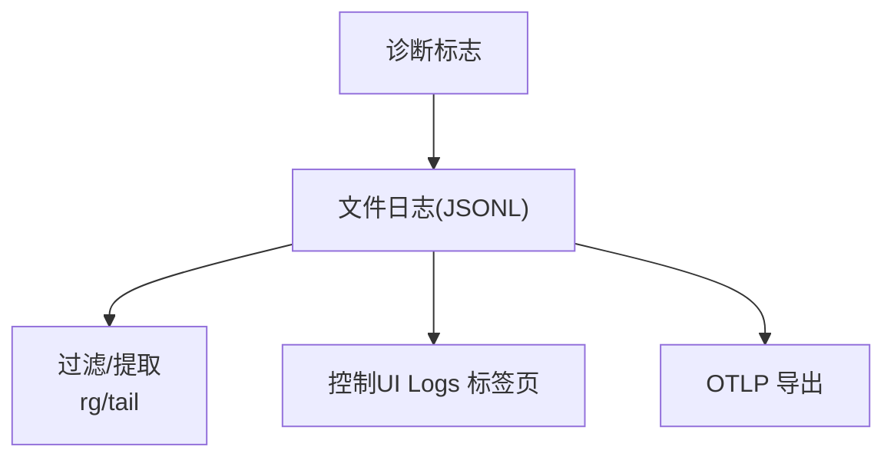
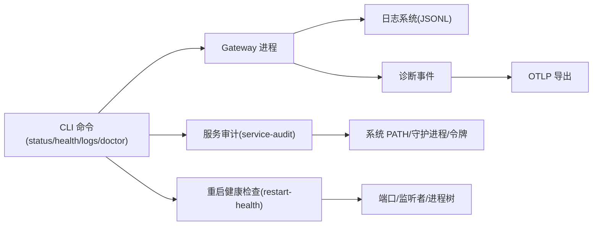

# 运行时问题

<cite>
**本文引用的文件**
- [docs/help/troubleshooting.md](file://docs/help/troubleshooting.md)
- [docs/gateway/troubleshooting.md](file://docs/gateway/troubleshooting.md)
- [docs/gateway/health.md](file://docs/gateway/health.md)
- [docs/logging.md](file://docs/logging.md)
- [docs/diagnostics/flags.md](file://docs/diagnostics/flags.md)
- [docs/cli/doctor.md](file://docs/cli/doctor.md)
- [docs/cli/logs.md](file://docs/cli/logs.md)
- [src/cli/daemon-cli/restart-health.ts](file://src/cli/daemon-cli/restart-health.ts)
- [src/daemon/service-audit.ts](file://src/daemon/service-audit.ts)
- [src/daemon/service-runtime.ts](file://src/daemon/service-runtime.ts)
- [src/commands/status.command.ts](file://src/commands/status.command.ts)
- [src/commands/health.ts](file://src/commands/health.ts)
- [src/logging/diagnostic-session-state.ts](file://src/logging/diagnostic-session-state.ts)
- [extensions/diagnostics-otel/src/service.ts](file://extensions/diagnostics-otel/src/service.ts)
- [src/gateway/server-lanes.ts](file://src/gateway/server-lanes.ts)
- [src/config/sessions/store-maintenance.ts](file://src/config/sessions/store-maintenance.ts)
- [src/cli/memory-cli.ts](file://src/cli/memory-cli.ts)
- [docs/debug/node-issue.md](file://docs/debug/node-issue.md)
</cite>

## 目录
1. [简介](#简介)
2. [项目结构](#项目结构)
3. [核心组件](#核心组件)
4. [架构总览](#架构总览)
5. [详细组件分析](#详细组件分析)
6. [依赖关系分析](#依赖关系分析)
7. [性能考量](#性能考量)
8. [故障排除指南](#故障排除指南)
9. [结论](#结论)
10. [附录](#附录)

## 简介
本指南面向运维与平台工程师，聚焦 OpenClaw 在生产运行中的常见运行时问题：网关服务异常、代理执行错误、内存泄漏、性能下降、日志分析与调试、进程崩溃与死锁、并发与队列积压、资源限制与恢复策略等。文档以仓库内现有“排障手册”“健康检查”“日志与诊断”“CLI 命令参考”为基础，结合运行时关键模块（服务审计、重启健康检查、诊断事件与会话状态、OTel 导出）进行系统化梳理，并提供可操作的诊断流程、可视化图示与优化建议。

## 项目结构
OpenClaw 将“排障知识”沉淀在 docs 目录中，形成“症状优先”的快速通道与“深度诊断”的分主题 runbook；同时，运行时诊断能力由 CLI 命令与内部模块实现，包括：
- 健康检查与状态命令：status、health、logs、doctor
- 服务审计与重启健康检查：service-audit、restart-health
- 诊断事件与会话状态：diagnostic-session-state、diagnostics-otel
- 资源维护与并发控制：server-lanes、store-maintenance、memory-cli

**图表来源**
- [docs/help/troubleshooting.md:13-299](file://docs/help/troubleshooting.md#L13-L299)
- [docs/gateway/troubleshooting.md:14-380](file://docs/gateway/troubleshooting.md#L14-L380)
- [docs/logging.md:100-353](file://docs/logging.md#L100-L353)
- [src/cli/daemon-cli/restart-health.ts:1-297](file://src/cli/daemon-cli/restart-health.ts#L1-L297)
- [src/daemon/service-audit.ts:1-424](file://src/daemon/service-audit.ts#L1-L424)

**章节来源**
- [docs/help/troubleshooting.md:1-299](file://docs/help/troubleshooting.md#L1-L299)
- [docs/gateway/troubleshooting.md:1-380](file://docs/gateway/troubleshooting.md#L1-L380)
- [docs/logging.md:1-353](file://docs/logging.md#L1-L353)

## 核心组件
- 健康检查与状态
  - status：汇总网关可达性、心跳、会话、系统事件等
  - health：请求运行中 Gateway 的健康快照（含通道探测）
- 日志与诊断
  - logs：通过 RPC 实时查看 Gateway 日志（支持 JSON/本地时间）
  - 诊断标志：按子系统启用目标化 debug 日志
  - OTLP 导出：指标、追踪、日志导出到收集器
- 服务审计与重启健康检查
  - service-audit：服务配置与运行时路径/令牌/守护进程单元审计
  - restart-health：端口占用、监听归属、可达性确认、僵尸进程终止
- 诊断事件与会话状态
  - session.state/stuck：会话卡住检测与事件上报
  - diagnostics-otel：将诊断事件映射为 OTel 指标/追踪

**章节来源**
- [src/commands/status.command.ts:318-613](file://src/commands/status.command.ts#L318-L613)
- [src/commands/health.ts:348-375](file://src/commands/health.ts#L348-L375)
- [docs/cli/logs.md:1-29](file://docs/cli/logs.md#L1-L29)
- [docs/diagnostics/flags.md:1-92](file://docs/diagnostics/flags.md#L1-L92)
- [extensions/diagnostics-otel/src/service.ts:560-617](file://extensions/diagnostics-otel/src/service.ts#L560-L617)
- [src/cli/daemon-cli/restart-health.ts:1-297](file://src/cli/daemon-cli/restart-health.ts#L1-L297)
- [src/daemon/service-audit.ts:1-424](file://src/daemon/service-audit.ts#L1-L424)
- [src/logging/diagnostic-session-state.ts:50-112](file://src/logging/diagnostic-session-state.ts#L50-L112)

## 架构总览
下图展示从 CLI 到 Gateway、诊断事件与 OTLP 导出的整体链路，以及与服务审计、重启健康检查的关系。

**图表来源**
- [docs/help/troubleshooting.md:13-299](file://docs/help/troubleshooting.md#L13-L299)
- [docs/gateway/health.md:1-36](file://docs/gateway/health.md#L1-L36)
- [docs/logging.md:142-353](file://docs/logging.md#L142-L353)
- [extensions/diagnostics-otel/src/service.ts:560-617](file://extensions/diagnostics-otel/src/service.ts#L560-L617)

## 详细组件分析

### 组件A：服务审计与重启健康检查
- 服务审计（service-audit）
  - 检查服务命令是否包含 gateway 子命令、PATH 是否最小化、是否使用版本管理器 Node、是否嵌入令牌、守护进程单元配置等
  - 输出问题列表与级别（推荐/激进），用于引导修复
- 重启健康检查（restart-health）
  - 读取服务运行时状态与端口占用情况
  - 判断监听者是否归属当前运行 PID 或认证关闭码是否指向鉴权问题
  - 支持等待健康、渲染诊断、终止僵尸进程

**图表来源**
- [src/cli/daemon-cli/restart-health.ts:73-185](file://src/cli/daemon-cli/restart-health.ts#L73-L185)
- [src/daemon/service-audit.ts:402-424](file://src/daemon/service-audit.ts#L402-L424)

**章节来源**
- [src/daemon/service-audit.ts:1-424](file://src/daemon/service-audit.ts#L1-L424)
- [src/cli/daemon-cli/restart-health.ts:1-297](file://src/cli/daemon-cli/restart-health.ts#L1-L297)
- [src/daemon/service-runtime.ts:1-13](file://src/daemon/service-runtime.ts#L1-L13)

### 组件B：诊断事件与会话状态
- 诊断会话状态（diagnostic-session-state）
  - 记录每个会话的最后活动时间、状态与队列深度，定期裁剪过期条目
  - 提供“会话卡住”阈值配置与心跳触发
- 诊断事件到 OTLP（diagnostics-otel）
  - 将诊断事件映射为计数器与直方图（队列深度/等待、会话状态/卡住、运行尝试、心跳聚合）
  - 可选开启日志导出，支持采样与刷新间隔

**图表来源**
- [src/logging/diagnostic-session-state.ts:50-112](file://src/logging/diagnostic-session-state.ts#L50-L112)
- [extensions/diagnostics-otel/src/service.ts:560-617](file://extensions/diagnostics-otel/src/service.ts#L560-L617)

**章节来源**
- [src/logging/diagnostic-session-state.ts:1-112](file://src/logging/diagnostic-session-state.ts#L1-L112)
- [extensions/diagnostics-otel/src/service.ts:1-617](file://extensions/diagnostics-otel/src/service.ts#L1-L617)

### 组件C：健康检查与状态命令
- status 命令
  - 汇总网关可达性、心跳、会话、系统事件、内存插件状态等
  - 支持 --deep 时对运行中 Gateway 进行通道探测
- health 命令
  - 请求运行中 Gateway 的健康快照，包含会话统计、心跳、通道探测摘要与耗时

**图表来源**
- [src/commands/status.command.ts:318-613](file://src/commands/status.command.ts#L318-L613)
- [src/commands/health.ts:348-375](file://src/commands/health.ts#L348-L375)

**章节来源**
- [src/commands/status.command.ts:1-613](file://src/commands/status.command.ts#L1-L613)
- [src/commands/health.ts:1-375](file://src/commands/health.ts#L1-L375)

### 组件D：日志系统与诊断标志
- 日志位置与格式
  - 默认写入 /tmp/openclaw/openclaw-YYYY-MM-DD.log（JSONL）
  - CLI 支持 --json、--plain、--no-color、--local-time
- 诊断标志
  - 通过 diagnostics.flags 针对子系统启用目标化 debug 日志
  - 支持通配符与环境变量覆盖
- OTLP 导出
  - 可导出指标、追踪、日志；支持采样与刷新间隔

**图表来源**
- [docs/logging.md:20-353](file://docs/logging.md#L20-L353)
- [docs/diagnostics/flags.md:1-92](file://docs/diagnostics/flags.md#L1-L92)

**章节来源**
- [docs/logging.md:1-353](file://docs/logging.md#L1-L353)
- [docs/diagnostics/flags.md:1-92](file://docs/diagnostics/flags.md#L1-L92)

## 依赖关系分析
- CLI 命令依赖 Gateway 运行时与健康快照
- 诊断事件依赖会话状态与队列事件
- OTLP 导出依赖诊断事件与配置开关
- 服务审计与重启健康检查依赖系统端口与进程信息

**图表来源**
- [src/commands/status.command.ts:318-613](file://src/commands/status.command.ts#L318-L613)
- [src/commands/health.ts:348-375](file://src/commands/health.ts#L348-L375)
- [src/cli/daemon-cli/restart-health.ts:1-297](file://src/cli/daemon-cli/restart-health.ts#L1-L297)
- [src/daemon/service-audit.ts:1-424](file://src/daemon/service-audit.ts#L1-L424)
- [docs/logging.md:142-353](file://docs/logging.md#L142-L353)

**章节来源**
- [src/commands/status.command.ts:1-613](file://src/commands/status.command.ts#L1-L613)
- [src/commands/health.ts:1-375](file://src/commands/health.ts#L1-L375)
- [src/cli/daemon-cli/restart-health.ts:1-297](file://src/cli/daemon-cli/restart-health.ts#L1-L297)
- [src/daemon/service-audit.ts:1-424](file://src/daemon/service-audit.ts#L1-L424)
- [docs/logging.md:1-353](file://docs/logging.md#L1-L353)

## 性能考量
- 并发与队列
  - 通过 server-lanes 设置不同命令队列的并发度（主/子代理/Cron）
  - 诊断事件记录队列深度与等待时间，便于识别瓶颈
- 会话卡住检测
  - 通过诊断会话状态与心跳阈值，及时发现卡住会话并生成事件
- 存储维护
  - 会话存储最大磁盘字节与高水位线配置，避免磁盘压力导致性能退化
- 内存索引进度
  - 内存搜索索引过程显示 ETA 与耗时，辅助评估资源占用

**章节来源**
- [src/gateway/server-lanes.ts:1-10](file://src/gateway/server-lanes.ts#L1-L10)
- [src/logging/diagnostic-session-state.ts:50-112](file://src/logging/diagnostic-session-state.ts#L50-L112)
- [src/config/sessions/store-maintenance.ts:80-124](file://src/config/sessions/store-maintenance.ts#L80-L124)
- [src/cli/memory-cli.ts:657-686](file://src/cli/memory-cli.ts#L657-L686)

## 故障排除指南

### 一、症状优先排查流程（快速通道）
- 使用“症状优先”决策树，按“无回复/控制UI无法连接/网关未启动/通道连上但消息不流动/自动化未触发/节点工具失败/浏览器工具失败”等分类，依次执行对应命令与检查点
- 关键命令：status、status --all、gateway probe、gateway status、doctor、channels status --probe、logs --follow

**章节来源**
- [docs/help/troubleshooting.md:68-299](file://docs/help/troubleshooting.md#L68-L299)

### 二、网关服务异常
- 健康信号
  - Runtime: running、RPC probe: ok、doctor 无阻塞性问题、channels 状态 connected/ready
- 常见症状与定位
  - 服务未运行：检查 service 配置、端口冲突、鉴权缺失
  - 服务已运行但不可达：核对 token/password、URL/端口、设备身份
  - 升级后异常：检查 gateway.mode、bind 与 auth 严格性变化、设备/配对状态
- 诊断步骤
  - openclaw status / gateway status / logs --follow / doctor
  - openclaw gateway status --deep（深探）
  - openclaw channels status --probe

**章节来源**
- [docs/help/troubleshooting.md:151-178](file://docs/help/troubleshooting.md#L151-L178)
- [docs/gateway/troubleshooting.md:152-181](file://docs/gateway/troubleshooting.md#L152-L181)
- [docs/gateway/troubleshooting.md:307-380](file://docs/gateway/troubleshooting.md#L307-L380)

### 三、代理执行错误与消息流问题
- 无回复
  - 检查配对状态、群组提及规则、通道白名单
- 通道连上但消息不流动
  - 检查权限/作用域、DM 策略、通道特定投递规则
- 自动化未触发
  - 检查 cron 启用与下次唤醒、心跳跳过原因（静默时段/有请求在途/告警关闭）

**章节来源**
- [docs/gateway/troubleshooting.md:61-91](file://docs/gateway/troubleshooting.md#L61-L91)
- [docs/gateway/troubleshooting.md:182-212](file://docs/gateway/troubleshooting.md#L182-L212)
- [docs/gateway/troubleshooting.md:213-244](file://docs/gateway/troubleshooting.md#L213-L244)

### 四、节点与浏览器工具失败
- 节点工具失败
  - 检查节点在线与能力、OS 权限、执行批准与允许清单
- 浏览器工具失败
  - 检查浏览器可执行路径、CDP 可达性、扩展中继标签页连接

**章节来源**
- [docs/gateway/troubleshooting.md:245-275](file://docs/gateway/troubleshooting.md#L245-L275)
- [docs/gateway/troubleshooting.md:276-306](file://docs/gateway/troubleshooting.md#L276-L306)

### 五、日志分析与调试
- 日志位置与模式
  - 默认文件：/tmp/openclaw/openclaw-YYYY-MM-DD.log（JSONL）
  - CLI 支持 --json、--plain、--no-color、--local-time
- 诊断标志
  - 通过 diagnostics.flags 针对子系统启用目标化 debug 日志（如 telegram.http）
  - 支持通配符与环境变量覆盖
- OTLP 导出
  - 开启 diagnostics.otel 后导出指标/追踪/日志，便于集中观测

**章节来源**
- [docs/logging.md:20-353](file://docs/logging.md#L20-L353)
- [docs/diagnostics/flags.md:1-92](file://docs/diagnostics/flags.md#L1-L92)

### 六、进程崩溃、死锁与并发问题
- 会话卡住
  - 通过诊断会话状态与心跳阈值识别卡住会话，生成 session.stuck 事件
- 死锁/长时间阻塞
  - 结合队列深度/等待直方图与会话状态事件，定位瓶颈
- 进程僵尸与端口占用
  - 使用 restart-health 终止僵尸 PID、确认端口监听归属与可达性

**章节来源**
- [src/logging/diagnostic-session-state.ts:50-112](file://src/logging/diagnostic-session-state.ts#L50-L112)
- [extensions/diagnostics-otel/src/service.ts:560-617](file://extensions/diagnostics-otel/src/service.ts#L560-L617)
- [src/cli/daemon-cli/restart-health.ts:187-243](file://src/cli/daemon-cli/restart-health.ts#L187-L243)

### 七、内存泄漏与资源使用
- 会话存储磁盘压力
  - 配置 maxDiskBytes 与高水位线，避免磁盘占满导致性能退化
- 内存搜索索引
  - 索引过程显示 ETA 与耗时，关注 CPU/内存峰值

**章节来源**
- [src/config/sessions/store-maintenance.ts:80-124](file://src/config/sessions/store-maintenance.ts#L80-L124)
- [src/cli/memory-cli.ts:657-686](file://src/cli/memory-cli.ts#L657-L686)

### 八、运行时环境优化与恢复策略
- 服务审计与修复
  - 使用 doctor --repair 修复配置漂移、清理未知键、重写旧版计划任务
  - 针对 Node 版本管理器/系统 Node、PATH 最小化、守护进程单元严格性进行修复建议
- 重启健康检查
  - 等待健康、渲染诊断、终止僵尸进程，确保端口归属与可达性
- 令牌漂移与凭据
  - 检查 service token 与配置 token 是否一致，必要时强制重新安装服务元数据

**章节来源**
- [docs/cli/doctor.md:1-46](file://docs/cli/doctor.md#L1-L46)
- [src/daemon/service-audit.ts:373-400](file://src/daemon/service-audit.ts#L373-L400)
- [src/cli/daemon-cli/restart-health.ts:187-243](file://src/cli/daemon-cli/restart-health.ts#L187-L243)

### 九、Node + tsx 特定崩溃（开发环境）
- 症状：Node + tsx 启动时报错，提示 __name 不是函数
- 原因：esbuild keepNames 生成的 __name 辅助在 Node 25 加载路径中缺失或被覆盖
- 临时方案：使用 Bun 或 Node + tsc watch + 编译产物运行

**章节来源**
- [docs/debug/node-issue.md:1-86](file://docs/debug/node-issue.md#L1-L86)

## 结论
本指南基于 OpenClaw 文档与运行时模块，构建了“症状优先—命令阶梯—诊断工具—修复策略”的闭环。通过健康检查、日志与诊断标志、OTLP 导出、服务审计与重启健康检查，可系统化定位并恢复网关服务异常、代理执行错误、内存与性能问题，并建立可持续的运行时可观测性与优化机制。

## 附录
- 常用命令速查
  - openclaw status / openclaw gateway status / openclaw logs --follow / openclaw doctor
  - openclaw health --json / openclaw channels status --probe
- 诊断标志示例
  - diagnostics.flags: ["telegram.http", "gateway.*"]
  - 环境覆盖：OPENCLAW_DIAGNOSTICS=telegram.http,telegram.payload
- OTLP 导出要点
  - diagnostics.otel.enabled、endpoint、protocol、traces/metrics/logs 开关、采样率与刷新间隔